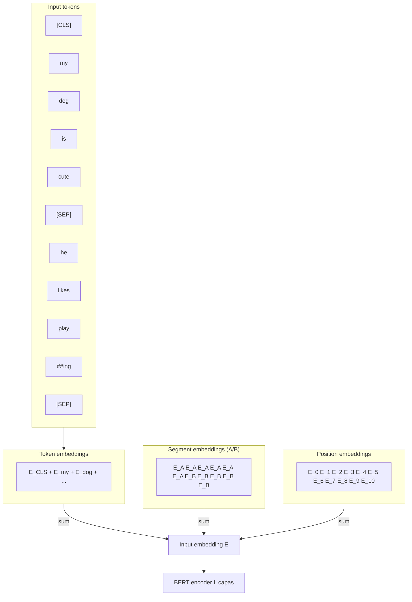

# Analisis del Paper: BERT — Pre-training of Deep Bidirectional Transformers for Language Understanding

**Autores**: Jacob Devlin, Ming-Wei Chang, Kenton Lee, Kristina Toutanova
**Institucion**: Google AI Language
**Publicado**: arXiv preprint 1810.04805 (octubre 2018) — version final NAACL 2019 (junio 2019)
**Codigo y checkpoints**: https://github.com/google-research/bert

> PDF en: [bert-devlin-2018.pdf](bert-devlin-2018.pdf)

---

## 1. Resumen ejecutivo

BERT (**B**idirectional **E**ncoder **R**epresentations from **T**ransformers) es un modelo de representacion de lenguaje basado exclusivamente en el **encoder** de la arquitectura Transformer (Vaswani 2017). Se pre-entrena sobre 3.3B palabras de texto sin etiquetar (BookCorpus + Wikipedia inglesa) usando dos objetivos auto-supervisados:

1. **Masked Language Model (MLM)**: enmascara el 15% de los tokens y los predice usando contexto bidireccional simultaneo.
2. **Next Sentence Prediction (NSP)**: clasifica si dos oraciones aparecen contiguas en el corpus.

Una vez pre-entrenado, BERT se adapta a tareas downstream con **fine-tuning**: agregar una capa de salida pequena y ajustar todos los parametros end-to-end con datos etiquetados. Con este recipe los autores avanzaron el estado del arte en 11 benchmarks de NLP simultaneamente -- GLUE (+7.7), MultiNLI (+4.6), SQuAD 1.1 F1 (+1.5), SQuAD 2.0 F1 (+5.1) -- demostrando que la **bidireccionalidad profunda** y el **transfer learning** son la combinacion ganadora para entender lenguaje natural.

La contribucion conceptual central: **MLM** rompe la barrera que impedia a los modelos de lenguaje ser bidireccionales (un LM clasico se "veria a si mismo" trivialmente si pudiera atender a la derecha). El truco — enmascarar — convierte el objetivo en un denoising auto-encoder a nivel de token y libera la atencion para ser totalmente bidireccional.

---

## 2. Posicionamiento historico

### 2.1. Estado del arte en 2018

Tres lineas dominaban el pre-entrenamiento de representaciones de lenguaje:

| Enfoque | Representante | Bidireccional? | Fine-tune o feature? |
|---|---|---|---|
| Word embeddings estaticos | Word2Vec, GloVe | N/A (sin contexto) | Feature |
| Contextualized embeddings | **ELMo** (Peters 2018) | Concatenacion shallow | Feature |
| Pre-trained LM | **OpenAI GPT** (Radford 2018) | Solo left-to-right | Fine-tune |

### 2.2. Diferencia con ELMo (Figura 3 del paper)

ELMo entrena dos LMs **independientes** -- uno LTR y uno RTL -- y al final concatena sus estados ocultos. Cada direccion en pre-entrenamiento solo ve la mitad del contexto; la "bidireccionalidad" es solo en la cabeza final, no en las representaciones internas. Devlin et al. la llaman **shallow bidirectional**.

BERT, en cambio, entrena un solo Transformer donde cada capa de self-attention ve **todo el contexto bidireccionalmente desde la primera capa**. Es **deep bidirectional**.

### 2.3. Diferencia con OpenAI GPT

GPT comparte el formato fine-tuning de BERT y la arquitectura Transformer, pero usa **decoder** con masked self-attention causal: cada token solo atiende a los anteriores. Esto es necesario para un LM autoregresivo, pero limita el uso para tareas de comprension donde el contexto a la derecha es relevante.

Devlin et al. disenaron BERT para ser **mininalmente diferente** de GPT (mismo numero de parametros en BERT-base, mismo formato `[CLS]/[SEP]` durante fine-tuning, mismo learning rate cuando es posible). El experimento controlado aisla el efecto de bidireccionalidad + MLM/NSP. Resultado: +4.5 puntos GLUE.

---

## 3. Arquitectura

### 3.1. Bloques Transformer encoder

Cada bloque es identico a Vaswani 2017 (sin modificaciones):

$$\text{Block}(x) = \text{LN}(x + \text{FFN}(\text{LN}(x + \text{MHA}(x))))$$

donde **MHA** es multi-head self-attention sin masking causal y **FFN** es una red feedforward de dos capas con activacion **GELU** (Hendrycks & Gimpel 2016, no ReLU). Dimension del FFN: $4H$.

### 3.2. Dos tamanos

| Modelo | $L$ (capas) | $H$ (hidden) | $A$ (heads) | Params | FFN |
|---|---|---|---|---|---|
| BERT-base  | 12 | 768  | 12 | 110M | 3072 |
| BERT-large | 24 | 1024 | 16 | 340M | 4096 |

BERT-base se eligio para coincidir con GPT en numero de parametros. BERT-large se eligio para empujar la frontera (era el Transformer encoder mas grande en su momento).

---

## 4. Input representation

### 4.1. Tokenizacion WordPiece

Vocabulario de 30,000 piezas construido por algoritmo greedy (Wu 2016). Subwords se prefijan con `##`:

```
"playing" -> ["play", "##ing"]
"unaffable" -> ["un", "##aff", "##able"]
```

Beneficios: cubre morfologia, evita OOV, controla el tamano del vocab.

### 4.2. Tokens especiales

- `[CLS]`: primer token de toda secuencia. Su salida $C \in \mathbb{R}^H$ es la representacion agregada usada para clasificacion.
- `[SEP]`: separa oraciones cuando el input es un par.
- `[MASK]`: marca tokens enmascarados durante MLM (no aparece en fine-tuning).

### 4.3. Tres embeddings sumados (Figura 2)

$$E_i = E^{tok}_i + E^{seg}_i + E^{pos}_i$$

con $E^{tok}_i \in \mathbb{R}^H$ aprendido por WordPiece, $E^{seg}_i \in \{E_A, E_B\}$ indicando segmento, y $E^{pos}_i$ aprendido (no sinusoidal) hasta 512 posiciones.



---

## 5. Pre-training objectives

### 5.1. Masked Language Model (MLM)

Para cada secuencia se selecciona aleatoriamente el **15% de las posiciones WordPiece**. Cada posicion seleccionada se transforma asi:

| Probabilidad | Transformacion | Justificacion |
|---|---|---|
| 80% | Reemplazar con `[MASK]` | Caso principal: forzar al modelo a inferir el token desde el contexto |
| 10% | Reemplazar con token aleatorio | Anade ruido leve; obliga al modelo a no confiar ciegamente en el token observado |
| 10% | Dejar sin cambios | Reduce el mismatch entre pretrain y fine-tune (donde nunca aparece `[MASK]`) |

**Por que esta mezcla**: si siempre se reemplazara con `[MASK]`, el modelo aprenderia a usar contexto SOLO en posiciones marcadas. Como `[MASK]` no existe en fine-tuning, los embeddings de tokens normales nunca recibirian senal de "predecirme". El 10%+10% obliga al encoder a mantener una representacion distribucional de **todo** token, no solo de los enmascarados.

Loss MLM: cross-entropy contra el token original, **solo en las posiciones seleccionadas** (no se reconstruye el resto del input, a diferencia de un denoising auto-encoder estandar).

$$L_{MLM} = -\sum_{i \in M} \log P(x_i \mid \tilde{x})$$

donde $M$ es el conjunto de posiciones enmascaradas y $\tilde{x}$ es la secuencia ruidosa.

**Costo de convergencia**: como solo se predice el 15% de los tokens, MLM converge mas lento que un LM tradicional que predice cada token. Apendice C.1 confirma que MLM tarda mas pasos pero alcanza mejor accuracy downstream rapidamente.

### 5.2. Next Sentence Prediction (NSP)

Pares $(A, B)$ generados como:

- **50% IsNext**: $B$ sigue inmediatamente a $A$ en el corpus.
- **50% NotNext**: $B$ es una oracion aleatoria de otro documento.

Clasificacion binaria con softmax sobre $C$ (la salida del `[CLS]`):

$$L_{NSP} = -\log P(y \mid C), \quad y \in \{\text{IsNext}, \text{NotNext}\}$$

Motivacion: NLI y QA dependen de la relacion entre oraciones, no capturable por un objetivo a nivel de token. El modelo final alcanza 97-98% accuracy en NSP.

### 5.3. Loss combinada

$$L = L_{MLM} + L_{NSP}$$

Suma simple, sin pesos -- ambos terminos en la misma escala (cross-entropy media).

### 5.4. Hyperparametros de pre-training

- Adam, lr=1e-4, $\beta_1=0.9$, $\beta_2=0.999$, weight decay 0.01
- Warmup lineal sobre los primeros 10k pasos, decay lineal despues
- Dropout 0.1 en todas las capas
- Activacion GELU
- Batch 256 secuencias x 512 tokens = 128k tokens/batch
- 1,000,000 pasos (~40 epochs sobre 3.3B palabras)
- 90% de los pasos con seqlen 128 (eficiencia), 10% finales con seqlen 512 (aprender position embeddings altos)

Hardware: BERT-base en 4 Cloud TPUs (16 chips), BERT-large en 16 Cloud TPUs (64 chips). 4 dias cada uno.

---

## 6. Datos

| Corpus | Tamano | Notas |
|---|---|---|
| BookCorpus (Zhu 2015) | 800M palabras | Libros de ficcion |
| Wikipedia inglesa | 2,500M palabras | Solo texto pasaje (sin listas, tablas, headers) |

Critico: usar corpus **document-level** (oraciones contiguas reales) y no shuffled (como Billion Word Benchmark) para que NSP tenga senal y para extraer secuencias largas.

---

## 7. Fine-tuning

Mismo modelo, mismos pesos pre-entrenados; se anade una capa de salida pequena y se entrena end-to-end. Cuatro patrones (Figura 4 del paper):

### 7.1. Single sentence classification (SST-2, CoLA)

Input: `[CLS] tok_1 tok_2 ... [SEP]`. Clasificacion: $\text{softmax}(W C)$ con $W \in \mathbb{R}^{K \times H}$.

### 7.2. Sentence pair classification (MNLI, QQP, MRPC, STS-B, RTE)

Input: `[CLS] tok_A_1 ... [SEP] tok_B_1 ... [SEP]` con segment embeddings A/B. Clasificacion sobre $C$.

### 7.3. Question answering (SQuAD)

Input: `[CLS] question [SEP] passage [SEP]`. Se aprenden vectores $S, E \in \mathbb{R}^H$ y se predicen inicio y fin del span:

$$P_i^{start} = \frac{e^{S \cdot T_i}}{\sum_j e^{S \cdot T_j}}, \quad P_i^{end} = \frac{e^{E \cdot T_i}}{\sum_j e^{E \cdot T_j}}$$

Score de span $(i, j)$: $S \cdot T_i + E \cdot T_j$ con $j \geq i$. Para SQuAD 2.0 (con preguntas sin respuesta) se compara contra el score del `[CLS]`.

### 7.4. Token tagging (NER, CoNLL-2003)

Clasificador por token sobre $T_i$. Para piezas WordPiece se usa la representacion de la primera pieza.

### 7.5. Hyperparametros de fine-tuning

- Batch: 16 o 32
- Learning rate Adam: 5e-5, 3e-5, o 2e-5 (busqueda en dev)
- Epochs: 2, 3 o 4
- Dropout siempre 0.1
- Para datasets pequenos (MRPC, RTE, STS-B) BERT-large era inestable: random restarts con la misma checkpoint pero distinta semilla de fine-tuning resolvian el problema.

---

## 8. Resultados detallados

### 8.1. GLUE (Tabla 1)

| Sistema | MNLI-m/mm | QQP | QNLI | SST-2 | CoLA | STS-B | MRPC | RTE | **Avg** |
|---|---|---|---|---|---|---|---|---|---|
| Pre-OpenAI SOTA | 80.6/80.1 | 66.1 | 82.3 | 93.2 | 35.0 | 81.0 | 86.0 | 61.7 | 74.0 |
| BiLSTM+ELMo+Attn | 76.4/76.1 | 64.8 | 79.8 | 90.4 | 36.0 | 73.3 | 84.9 | 56.8 | 71.0 |
| OpenAI GPT | 82.1/81.4 | 70.3 | 87.4 | 91.3 | 45.4 | 80.0 | 82.3 | 56.0 | 75.1 |
| **BERT-base** | 84.6/83.4 | 71.2 | 90.5 | 93.5 | 52.1 | 85.8 | 88.9 | 66.4 | **79.6** |
| **BERT-large** | **86.7/85.9** | **72.1** | **92.7** | **94.9** | **60.5** | **86.5** | **89.3** | **70.1** | **82.1** |

BERT-base supera a GPT por +4.5 con identico count de parametros. BERT-large suma otros +2.5. La mejora es consistente en TODAS las tareas, no concentrada en ninguna.

### 8.2. SQuAD 1.1 (Tabla 2)

- Humano: F1 91.2
- Top leaderboard pre-BERT (#1 Ensemble nlnet): F1 91.7
- **BERT-large single + TriviaQA pretrain**: F1 91.8 (supera al humano)
- **BERT-large ensemble + TriviaQA**: F1 **93.2** (+1.5 sobre el mejor previo)

### 8.3. SQuAD 2.0 (Tabla 3)

- BERT-large single: F1 **83.1** (+5.1 sobre el mejor publicado)

### 8.4. SWAG (Tabla 4)

Sentido comun: dado un comienzo, elegir la continuacion plausible entre 4.

- ESIM+ELMo: 59.2
- OpenAI GPT: 78.0
- **BERT-large**: **86.3** (humano experto: 85.0; humano 5-anotaciones: 88.0)

### 8.5. CoNLL-2003 NER (Tabla 7)

- BERT-large fine-tune: F1 92.8 (Test)
- BERT-base feature-based con suma de las ultimas 4 capas: F1 96.1 (Dev), solo 0.3 F1 detras del fine-tuning. Demuestra que BERT funciona bien en ambos modos.

---

## 9. Ablations (Tabla 5 y Tabla 6)

### 9.1. Efecto de los objetivos de pre-training

Sobre BERT-base, mismos datos, mismo fine-tune:

| Variante | MNLI-m | QNLI | MRPC | SST-2 | SQuAD F1 |
|---|---|---|---|---|---|
| BERT-base (MLM + NSP) | 84.4 | 88.4 | 86.7 | 92.7 | 88.5 |
| **No NSP** (solo MLM) | 83.9 | 84.9 | 86.5 | 92.6 | 87.9 |
| **LTR & No NSP** | 82.1 | 84.3 | 77.5 | 92.1 | 77.8 |
| LTR & No NSP + BiLSTM (encima) | 82.1 | 84.1 | 75.7 | 91.6 | 84.9 |

Lecturas:

- Quitar **NSP** degrada visiblemente QNLI, MNLI, SQuAD -- tareas que dependen de relacion entre oraciones. Esto motivo a Devlin et al. a incluirlo. _(Trabajo posterior: RoBERTa muestra que con mas datos/epochs y NSP removido el rendimiento es igual o mejor; el efecto observado aqui se atribuyo despues a que el modelo no estaba lo suficientemente entrenado.)_
- Pasar de bidireccional (No NSP) a **LTR** degrada SQuAD masivamente (87.9 -> 77.8): tareas token-level se rompen sin contexto derecho.
- Anadir un BiLSTM encima del LTR recupera parcialmente SQuAD pero rompe GLUE -- evidencia de que la bidireccionalidad **debe estar en el pre-training**, no anadirse despues.

### 9.2. Efecto del tamano del modelo (Tabla 6)

| #L | #H | #A | LM ppl | MNLI-m | MRPC | SST-2 |
|---|---|---|---|---|---|---|
| 3  | 768  | 12 | 5.84 | 77.9 | 79.8 | 88.4 |
| 6  | 768  | 12 | 4.68 | 81.9 | 84.8 | 91.3 |
| 12 | 768  | 12 | 3.99 | 84.4 | 86.7 | 92.9 |
| 12 | 1024 | 16 | 3.54 | 85.7 | 86.9 | 93.3 |
| **24** | **1024** | **16** | **3.23** | **86.6** | **87.8** | **93.7** |

Conclusion: escalar **siempre** ayuda, incluso para datasets pequenos como MRPC (3.6k ejemplos). Devlin et al. lo destacan como **el primer trabajo que muestra mejoras claras al escalar a este tamano para tareas pequenas**, condicionado a tener suficiente pre-training. Es un anticipo de la era de los LLMs.

### 9.3. Efecto de la masking strategy (Tabla 8, Apendice C.2)

Variando los porcentajes (`[MASK]`, mismo, random):

- 80/10/10: MNLI 84.2, NER fine-tune 95.4
- 100/0/0 (siempre `[MASK]`): MNLI 84.3, NER 94.9 (peor en NER feature-based)
- 0/0/100 (siempre random): MNLI 83.6, NER 94.9 (degrada todo)

Fine-tuning es **sorprendentemente robusto** a la estrategia, pero feature-based amplifica el mismatch -- 100% MASK rompe NER feature-based.

---

## 10. Por que bidireccional supera a unidireccional

La justificacion conceptual del paper (Seccion 3.1):

> "It is unfortunately impossible to train deep bidirectional models with a standard conditional LM, since bidirectional conditioning would allow each word to indirectly 'see itself,' and the model could trivially predict the target word in a multi-layered context."

En un Transformer multi-capa con atencion bidireccional, predecir $x_i$ desde $\{x_1, ..., x_n\}$ es trivial: la primera capa puede copiar $x_i$ y las siguientes pasarlo a la posicion $i$ a traves de la self-attention. No hay senal de aprendizaje.

MLM rompe esto: $x_i$ se reemplaza por `[MASK]` (o ruido), asi el modelo NO puede copiarlo y debe inferirlo del contexto bidireccional. Es la pieza tecnica que habilita la bidireccionalidad profunda en un encoder.

Empiricamente, las ablations muestran:

- Tareas **token-level** (QA, NER) se benefician masivamente del contexto derecho.
- Tareas **sentence-level** (NLI, sentiment) tambien mejoran, pero la diferencia es menor.
- ELMo hacia bidireccionalidad shallow (concat de dos LMs) y BERT lo supera por margen amplio: la bidireccionalidad en cada capa, desde la primera, es estrictamente mas poderosa.

---

## 11. Sucesores

| Modelo | Ano | Cambio respecto a BERT |
|---|---|---|
| **RoBERTa** (Liu et al.) | 2019 | Mas datos (160GB vs 16GB), mas pasos, batch mayor (8k), masking dinamico, **NSP removido**, sin segment embeddings. SOTA sobre BERT con la misma arquitectura. |
| **ALBERT** (Lan et al.) | 2019 | Factorized embeddings ($V \times H \to V \times E + E \times H$), cross-layer parameter sharing, **SOP** (Sentence Order Prediction) en lugar de NSP. 18x menos parametros que BERT-large con mejor rendimiento. |
| **DistilBERT** (Sanh et al.) | 2019 | Destilacion: BERT-base profesor, modelo estudiante de 6 capas. 40% menos params, 60% mas rapido, 97% del rendimiento. |
| **SpanBERT** (Joshi et al.) | 2020 | Enmascara spans contiguos en lugar de tokens individuales; objetivo SBO. Mejora QA. |
| **ELECTRA** (Clark et al.) | 2020 | Replaced-token detection: un generador pequeno crea reemplazos, un discriminador clasifica si cada token es original o sustituido. **Toda posicion da senal**, no solo el 15%. Mucho mas eficiente en compute. |
| **DeBERTa** (He et al.) | 2020 | Disentangled attention: separa contenido y posicion en dos vectores. Enhanced mask decoder con posiciones absolutas en la salida. SOTA en GLUE/SuperGLUE. |
| **BERT especializados** | 2019-2020 | BioBERT, SciBERT, ClinicalBERT, FinBERT, LegalBERT, mBERT (104 idiomas), XLM-R. Demostraron que el recipe de Devlin et al. transfiere a dominios y lenguas. |

Comun a todos: mantienen la idea central de **encoder Transformer pre-entrenado con objetivo auto-supervisado de denoising y fine-tuning para downstream**. BERT definio la plantilla.

---

## 12. Lecciones transferibles

1. **Pre-train + fine-tune como paradigma general**: el patron se replico en vision (MAE, BEiT, DINO), audio (wav2vec 2.0, HuBERT), codigo (CodeBERT, CodeT5), grafos (GraphBERT) y multimodalidad (CLIP, DALL-E). Pre-entrenar con objetivos auto-supervisados sobre datos abundantes y ajustar con datos etiquetados escasos es la receta dominante.
2. **Denoising como objetivo universal**: enmascarar y reconstruir es una forma simple, escalable y efectiva de extraer estructura de datos sin etiquetas. MLM, MAE, T5 span corruption, BART denoising son variantes de la misma idea.
3. **Disenar para minimizar gap pretrain/finetune**: la regla 80/10/10 ilustra que pequenos detalles del setup importan tanto como la arquitectura. La asimetria entre pre-entrenamiento y uso final degrada rendimiento.
4. **Escalar funciona, incluso para datasets pequenos**: BERT-large mejora MRPC (3.6k ejemplos) sobre BERT-base. Antesala de los scaling laws de Kaplan 2020.
5. **Misma arquitectura, multiples tareas**: la unificacion de input format (`[CLS] ... [SEP] ... [SEP]`) y la simplicidad del fine-tuning (capa lineal arriba, mismo lr/optimizer) hizo que BERT fuera trivialmente reusable. Una API simple es ventaja competitiva.
6. **Ablaciones controladas son oro**: el experimento BERT vs GPT en la misma escala de parametros y datos, variando solo bidireccionalidad, fue el argumento mas convincente del paper. Diseno experimental disciplinado supera a la ingenieria a ciegas.
7. **Las decisiones del pre-entrenamiento se cuestionaran**: NSP fue defendido en este paper y descartado un ano despues por RoBERTa. La ciencia avanza al cuestionar incluso las piezas que parecian centrales. Reproducibilidad y publicacion abierta de checkpoints aceleran ese proceso.

---

## 13. Referencias clave del paper

- **Vaswani et al. 2017** — Attention Is All You Need. La arquitectura que BERT usa tal cual.
- **Peters et al. 2018a** — ELMo. Bidireccionalidad shallow, contraste directo.
- **Radford et al. 2018** — OpenAI GPT. Fine-tune sobre Transformer LTR, baseline mas comparable.
- **Howard & Ruder 2018** — ULMFiT. Fine-tuning de LM con tecnicas como discriminative lr, slanted triangular lr.
- **Wu et al. 2016** — WordPiece tokenization (Google NMT).
- **Taylor 1953** — Cloze procedure. Origen psicolinguistico del MLM.
- **Wang et al. 2018a** — GLUE benchmark.
- **Rajpurkar et al. 2016** — SQuAD 1.1.
