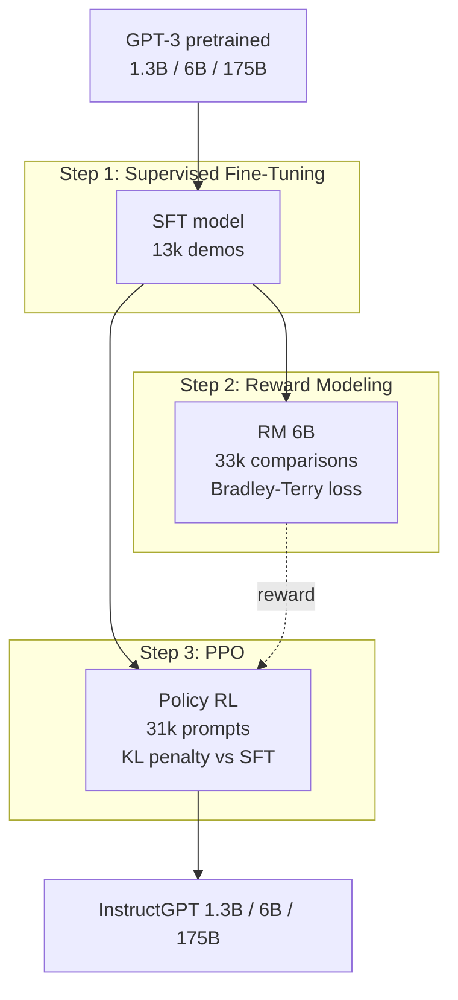

# InstructGPT: el paper que hizo a GPT "utilizable"

## 0. Tarjeta resumen

| Campo | Valor |
| --- | --- |
| Título | Training language models to follow instructions with human feedback |
| Autores | 20 autores de OpenAI; Ouyang, Wu, Jiang, Almeida y Wainwright como primarios; Leike y Lowe como leads |
| Publicación | NeurIPS 2022; preprint arXiv:2203.02155 (4 mar 2022) |
| Modelos resultantes | InstructGPT 1.3B, 6B, 175B (architectura GPT-3) |
| Técnica central | RLHF en tres etapas: SFT → Reward Model → PPO |
| Hallazgo clave | InstructGPT 1.3B es preferido por humanos sobre GPT-3 175B (100x menos parámetros) |
| Conexión histórica | Precursor técnico directo de ChatGPT (lanzado 30 nov 2022, 9 meses después) |

InstructGPT no es un modelo nuevo en sentido arquitectónico: usa la misma arquitectura Transformer-decoder de GPT-3, los mismos pesos pre-entrenados, los mismos tokenizadores. Lo que cambia es el post-training. Y ese cambio es lo que separa un modelo "técnicamente capaz" de un modelo "comercialmente desplegable". Es el paper que vuelve real la idea de un asistente conversacional general.

---

## 1. Contexto histórico: el problema que GPT-3 dejó abierto

Para entender InstructGPT hay que ubicarse en el período mayo 2020 – marzo 2022.

GPT-3 (Brown et al., 2020) demostró que escalar el modelo y los datos producía "few-shot learners": un solo modelo, sin fine-tuning específico de tarea, podía resolver traducción, QA, aritmética básica y generación creativa con apenas algunos ejemplos en el prompt. Fue un cambio de paradigma — del "una arquitectura por tarea" al "un modelo, muchas tareas".

Pero el GPT-3 base de la API tenía problemas operativos serios cuando OpenAI intentó comercializarlo:

1. **Inventaba hechos** (lo que el paper llama "make up facts" y hoy llamamos alucinaciones).
2. **Generaba contenido tóxico, sesgado u ofensivo** sin que el usuario lo pidiera.
3. **Ignoraba instrucciones**: pedirle "resume este texto" en estilo conversacional muchas veces terminaba en continuación del texto, en repetición o en preguntas adicionales en vez de un resumen.
4. **Necesitaba prompting cuidadoso** para comportarse como asistente. Sin prefix engineering tipo "Q: ... A: ..." la respuesta podía ser cualquier cosa.

El paper lo enuncia con precisión técnica: el objetivo de pre-training (predecir el siguiente token sobre la web) está **misaligned** con el objetivo deseado (seguir instrucciones de forma útil, honesta e inofensiva). La capacidad bruta estaba; la utilidad como producto no.

Esto es lo que se conoce como el **problema del alignment**: ¿cómo modificar un modelo general para que, sin perder capacidades, se comporte como queremos que se comporte? Y en este paper se hace concreto bajo el marco **HHH** de Askell et al. (2021):

- **Helpful** — útil: ayuda al usuario a resolver su tarea, infiriendo intención correctamente.
- **Honest** — honesto: no fabrica información ni engaña deliberadamente. El paper hace una distinción importante: en un modelo generativo no se puede medir "creencia interna" — sólo se puede medir **truthfulness**, es decir, si las afirmaciones públicas coinciden con la realidad.
- **Harmless** — inofensivo: no causa daño físico, psicológico ni social.

El marco HHH es operacionalizable. Los tres ejes pueden anotarse por humanos y eso permite optimizarlos. Ese es el insight metodológico que abre el camino para RLHF.

### 1.1. Antecedentes técnicos directos

InstructGPT no nace en el vacío. Hereda de:

- **Christiano et al. (2017)** — Deep RL from human preferences. Introduce la idea de aprender un reward model desde comparaciones humanas y usarlo en RL. Aplicado a robots simulados y Atari.
- **Ziegler et al. (2019)** — Fine-tuning language models from human preferences. Primera aplicación de RLHF a un modelo de lenguaje (GPT-2) en continuación estilística.
- **Stiennon et al. (2020)** — Learning to summarize with human feedback. Aplica RLHF a resumen. Muestra que el RM aprendido generaliza mejor que el cross-entropy directo contra resúmenes de referencia. Este paper es la plantilla metodológica directa de InstructGPT.

La novedad de InstructGPT no es inventar RLHF — es aplicarlo a un **dominio amplio** (la distribución completa de prompts del API de OpenAI, no una sola tarea como resumen) y demostrar que la técnica escala a un modelo de propósito general de 175B parámetros.

---

## 2. El pipeline RLHF en tres pasos

El corazón técnico del paper es el pipeline de tres etapas que la Figure 2 del paper resume. Lo represento aquí explícitamente:



### 2.1. Step 1 — Supervised Fine-Tuning (SFT)

**Datos**: aproximadamente 13 000 prompts de entrenamiento. Mezcla de:

- Prompts enviados al API por usuarios reales (con consentimiento; PII filtrado; máximo 200 por user ID).
- Prompts escritos por los propios labelers en tres modalidades para bootstrap inicial:
  - **Plain**: tarea arbitraria con diversidad asegurada.
  - **Few-shot**: una instrucción más múltiples pares (query, response).
  - **User-based**: basados en use-cases declarados en las waitlist applications de los clientes.

Los labelers escriben respuestas "demostraciones ideales": cómo querrían que el modelo respondiera. Cada demostración es un par (prompt, respuesta deseada).

**Procedimiento**: fine-tuning supervisado estándar de GPT-3 sobre estas demostraciones, con next-token prediction restringida al span de respuesta. Detalles:

- 16 epochs.
- Cosine learning rate decay.
- Residual dropout 0.2.
- **Overfitting deliberado**: el paper observa que el SFT overfittea la validación de loss tras 1 epoch — pero las puntuaciones de preferencia humana y RM siguen mejorando hasta epoch 16. Es una observación contraintuitiva: la métrica de loss y la métrica de utilidad divergen. El criterio de selección de checkpoint es el score del reward model en validación, no la loss.

**¿Por qué SFT no basta?** Porque para tareas open-ended hay muchas respuestas válidas. La demostración del labeler captura una respuesta "buena", pero no las muchas variantes igualmente buenas que el modelo podría generar. El SFT no enseña una distribución sobre respuestas aceptables, sólo memoriza ejemplos puntuales. Por eso hace falta Step 2.

> Para profundizar en SFT como técnica genérica ver fundamento [`sft.md`](../../../site/content/fundamentos/sft.md) del site.

### 2.2. Step 2 — Reward Model (RM)

**Datos**: 33 000 prompts en el dataset RM. Para cada prompt se generan **K respuestas** desde varios modelos (SFT actual, snapshots anteriores, GPT-3 base, GPT-3 prompted). K varía entre 4 y 9.

Los labelers reciben las K respuestas y producen un **ranking total** (no comparaciones pareadas independientes — eso es eficiencia operativa). De ese ranking se derivan $\binom{K}{2}$ pares ordenados $(y_w, y_l)$ donde $y_w$ es la respuesta preferida ("winner") y $y_l$ la peor ("loser") del par.

**Arquitectura del RM**:

- Inicializado desde el SFT model — concretamente, del 6B. El paper explica por qué no usaron 175B: el RM 175B era inestable durante entrenamiento y producía un value function pobre para PPO. 6B es el sweet spot práctico.
- Se elimina la última capa de unembedding (la que mapea de embedding a vocabulario).
- Se agrega una cabeza lineal final que produce un **escalar** $r_\theta(x, y)$: el reward predicho para la respuesta $y$ dado el prompt $x$.

**Loss function** — Bradley-Terry pairwise:

$$
\mathcal{L}(\theta) = -\frac{1}{\binom{K}{2}} \mathbb{E}_{(x, y_w, y_l) \sim D} \left[ \log \sigma\big( r_\theta(x, y_w) - r_\theta(x, y_l) \big) \right]
$$

donde $\sigma$ es la sigmoide. Esto es exactamente el modelo de Bradley-Terry de elección discreta: la probabilidad de que un humano prefiera $y_w$ sobre $y_l$ se modela como $\sigma(r(y_w) - r(y_l))$.

Una sutileza operacional: los $\binom{K}{2}$ pares de un mismo prompt **se procesan como un solo batch**. Si se tratan como ejemplos independientes y se mezclan en el dataset, el RM overfittea tras una sola pasada — porque cada respuesta aparece en $K-1$ pares y se ve $K-1$ veces como gradient update por epoch. Procesarlos en batch requiere sólo $K$ forward passes (uno por respuesta) en vez de $2\binom{K}{2} = K(K-1)$. Es más eficiente computacionalmente **y** mejora la accuracy de validación. Excelente caso de "la implementación correcta también es la teóricamente correcta".

**Normalización**: tras el entrenamiento se centra el RM con un bias scalar tal que la respuesta promedio de los labelers tenga reward 0. Esto es necesario porque la loss de Bradley-Terry es invariante a shifts globales — sólo importan diferencias relativas. Para usar el RM como reward en PPO se necesita una escala absoluta.

**Inter-labeler agreement**: 72.6% ± 1.5% entre labelers de entrenamiento, 77.3% ± 1.3% con labelers held-out, 73% en comparación con Stiennon et al. en resumen. No es 100% — y eso es importante: la tarea de juzgar respuestas largas y abiertas es **inherentemente ambigua**. Hay desacuerdo legítimo. Por eso aspirar a un RM perfecto es imposible.

> El detalle matemático del modelo Bradley-Terry y su conexión con la regresión logística está desarrollado en [`bradley-terry.md`](../../../site/content/fundamentos/bradley-terry.md). Ese fundamento explica por qué este loss específico — y no MSE entre rewards predichos y rewards "verdaderos" — es la elección correcta cuando los datos son comparaciones humanas.

### 2.3. Step 3 — Reinforcement Learning via PPO

Aquí entra el componente RL propiamente dicho. Se trata como un **bandit**: cada prompt $x$ es un episodio; el modelo (la "policy") genera una respuesta $y$; el RM produce un reward $r_\theta(x, y)$; episodio terminado. No hay multi-step exploration en sentido estricto — es contextual bandit.

**Algoritmo**: PPO (Proximal Policy Optimization, Schulman et al. 2017). La policy se inicializa desde el SFT. La value function (necesaria para el cálculo de advantage en PPO) se inicializa desde el RM.

**Datos**: 31 000 prompts del API, sin labels humanos en esta etapa — sólo prompts. El reward viene del RM, no de humanos.

**Objetivo combinado** — éste es el corazón del Step 3 y donde está la fórmula clave del paper:

$$
\text{objective}(\phi) = \mathbb{E}_{(x,y) \sim D_{\pi_\phi^{RL}}} \Big[ r_\theta(x, y) - \beta \log \frac{\pi_\phi^{RL}(y \mid x)}{\pi^{SFT}(y \mid x)} \Big] + \gamma \mathbb{E}_{x \sim D_{\text{pretrain}}} \big[ \log \pi_\phi^{RL}(x) \big]
$$

Desglosando cada término:

| Término | Significado |
| --- | --- |
| $r_\theta(x, y)$ | Reward del RM. El objetivo principal a maximizar. |
| $-\beta \log \frac{\pi^{RL}}{\pi^{SFT}}$ | **KL penalty per-token contra el SFT**. Penaliza alejarse del SFT. |
| $\gamma \mathbb{E}_{x \sim D_{\text{pretrain}}}[\log \pi^{RL}(x)]$ | **Pretraining mix**: mezcla la loss de pre-training para mitigar el alignment tax. Esto es lo que distingue PPO-ptx de PPO puro. Cuando $\gamma = 0$ se llama "PPO"; cuando $\gamma > 0$ se llama "PPO-ptx". |

Los hiperparámetros típicos: $\beta = 0.02$, $\gamma$ tuneado para que las regresiones en benchmarks NLP públicos desaparezcan sin sacrificar reward.

### 2.4. La KL penalty es crítica — y no opcional

Sin la KL penalty contra el SFT pasan dos cosas que destruyen el modelo:

1. **Mode collapse**. La policy converge a respuestas estereotipadas que el RM puntúa alto. La diversidad se pierde. El modelo se vuelve repetitivo y aburrido.
2. **Reward hacking** del RM. La policy descubre patrones que engañan al RM — frases gancho, formato adulador, hedging excesivo — sin mejorar la utilidad real. El RM es un proxy aproximado de la preferencia humana; optimizar agresivamente contra el proxy aleja de la métrica verdadera. Esto es **Goodhart's law** aplicado a alignment: "cuando una métrica se convierte en objetivo deja de ser una buena métrica".

La KL penalty contra $\pi^{SFT}$ actúa como **trust region** explícita: la policy puede mejorar contra el RM pero no puede alejarse demasiado de la distribución del SFT, que sí fue entrenada sobre demostraciones humanas reales. Es una forma de regularización fuerte que ancla la policy al manifold del lenguaje natural.

Hay aquí una observación profunda que se generaliza: la KL penalty contra una distribución de referencia es lo que hace posible RLHF estable. Es la idea que captura **DPO** (Rafailov et al. 2023) y que justifica que se pueda derivar una loss supervisada cerrada equivalente.

> Para entender por qué la KL penalty no es un truco sino una consecuencia matemática del problema de alignment ver [`kl-implicito.md`](../../../site/content/fundamentos/kl-implicito.md). La derivación muestra cómo la solución óptima al objetivo de InstructGPT tiene forma cerrada $\pi^*(y \mid x) \propto \pi^{SFT}(y \mid x) \exp(r_\theta(x,y)/\beta)$ — y cómo DPO explota esto para evitar PPO.

### 2.5. El "alignment tax" y PPO-ptx

Cuando se entrena PPO puro (sin pretraining mix), aparece un fenómeno preocupante: el modelo mejora en preferencia humana pero **se degrada en benchmarks NLP académicos** — concretamente SQuAD, DROP, HellaSwag y traducción WMT 2015.

A esto el paper lo llama **alignment tax**: el costo en capacidades que pagas por alinear. Si el alignment tax es alto, hay un disincentivo para alinear modelos — un mundo con modelos no alineados pero más capaces. Y un alignment tax alto puede ser inaceptable para deployment.

La mitigación es **PPO-ptx**: agregar la loss de pre-training como término del objetivo. Concretamente, durante PPO se intercalan batches de prompts del API (con el reward del RM) y batches de texto del corpus de pre-training (con la loss de log-likelihood estándar de language modeling). El coeficiente $\gamma$ controla la mezcla.

Resultado: PPO-ptx **revierte** las regresiones en SQuAD, DROP, HellaSwag — en algunos casos incluso supera a GPT-3 base — sin sacrificar el reward del RM ni la preferencia humana. Es un free lunch metodológico, dentro de lo razonable.

El paper también muestra que **aumentar $\beta$** (la KL) no logra lo mismo: aumentar KL reduce las regresiones pero también reduce el reward. PPO-ptx es estrictamente mejor para este trade-off.

---

## 3. Resultados — qué demostraron empíricamente

### 3.1. Preferencia humana: el resultado más citado

| Comparación | Win rate de InstructGPT |
| --- | --- |
| InstructGPT 175B vs GPT-3 175B (base) | 85% ± 3% |
| InstructGPT 175B vs GPT-3 175B (few-shot prompted) | 71% ± 4% |
| InstructGPT 1.3B vs GPT-3 175B | > 50% (preferido a pesar de ser 100x más chico) |

El resultado central — y el que aparece en cada presentación sobre RLHF desde 2022 — es que **alignment > scale** en el régimen de prompts realistas. Un modelo de 1.3B alineado vence a un modelo de 175B no alineado. Esto desplaza el frame de "más parámetros = mejor modelo" hacia "post-training importa tanto o más que pre-training".

Es importante leer esto correctamente: la comparación se hace en la **distribución de prompts del API** — prompts realistas de usuarios reales. En benchmarks NLP tradicionales (SQuAD, MMLU) la historia es distinta y el scaling vuelve a dominar.

### 3.2. Truthfulness (TruthfulQA)

| Modelo | Outputs verdaderos | Outputs verdaderos + informativos |
| --- | --- | --- |
| GPT-3 175B | ~20% | ~20% |
| InstructGPT PPO 175B | ~40% | ~30% |
| InstructGPT con prompt "Instruction+QA" | ~50%+ | ~30%+ |

Aproximadamente **2x mejora en truthfulness**. El comportamiento por defecto es más veraz, sin necesidad de prompting específico — ese es el punto clave. InstructGPT también hace **menos alucinaciones en tareas closed-domain del API** (21% vs 41% para GPT-3).

Una observación honesta del paper: con el prompt "Instruction+QA" (que enseña al modelo a decir "I have no comment" cuando no sabe) InstructGPT se vuelve más verdadero **a costa de ser menos informativo**. Es una forma de hedging defensivo — el modelo aprende que en duda es mejor callar. Útil pero a veces frustrante para el usuario.

### 3.3. Toxicidad (RealToxicityPrompts)

Cuando se le pide "respond respectfully":

- ~25% menos toxic outputs que GPT-3.

Cuando **no** se le pide respeto explícito, la diferencia desaparece. Y cuando se le pide explícitamente que sea tóxico, InstructGPT **es más tóxico que GPT-3** — porque sigue instrucciones mejor. Esto es importante: alignment no es safety automático. Es alignment a instrucciones explícitas. Si la instrucción es dañina, el modelo es más dañino.

### 3.4. Sesgo (CrowS-Pairs, Winogender)

**No mejora significativamente**. El paper es honesto en este punto: el RLHF tal como se aplica aquí no reduce sesgos en estos benchmarks. PPO-ptx con instrucción de "act respectfully" incluso aumenta sesgo en Winogender — porque el modelo expresa más certeza en sus respuestas (mayor confidence → menor entropía → mayor desviación de la distribución uniforme que sería "imparcial").

### 3.5. Tabla consolidada de resultados

| Métrica | GPT-3 175B | SFT 175B | PPO 175B | PPO-ptx 175B |
| --- | --- | --- | --- | --- |
| Win rate vs SFT 175B (API dist.) | ~0.20 | 0.50 | ~0.62 | **~0.67** |
| TruthfulQA (truthful + informative) | ~0.20 | ~0.25 | ~0.30 | ~0.30 |
| RealToxicityPrompts (respectful) | 0.23 | 0.20 | — | **0.16** |
| SQuADv2 (alignment tax mitigado) | baseline | regresión | regresión | ≈ baseline |
| HellaSwag | baseline | regresión | regresión | **> baseline** |
| Likert score (1-7, labelers held-out) | ~2.5 | ~4.0 | — | **~4.8** |

---

## 4. Evaluación: labelers, Likert y attribute ratings

La evaluación con humanos es la parte del paper donde más se ve la inversión operacional de OpenAI. No es trivial.

### 4.1. El proceso de hiring de labelers

- ~40 contractors via Upwork y ScaleAI.
- **Screening test**: filtros explícitos para sensibilidad a outputs potencialmente dañinos, capacidad de identificar contenido inapropiado, alignment con la sensibilidad demográfica buscada.
- Onboarding extensivo: instrucciones detalladas por tarea, chat room compartido para dudas en tiempo real, colaboración estrecha researcher-labeler.
- Held-out set: un grupo separado de labelers nunca produjo datos de training y se usa para evaluar generalización.

Esto es muy distinto de crowdsourcing standard (MTurk de un solo paso). Es más caro, más lento, y produce mejor calidad. Es también lo que hace difícil de replicar el paper para grupos académicos.

### 4.2. Métricas anotadas (Tabla 3 del paper)

Por cada output del modelo, los labelers anotan:

| Métrica | Escala |
| --- | --- |
| Overall quality | Likert 1-7 |
| Fails to follow correct instruction/task | Binary |
| Inappropriate for customer assistant | Binary |
| Hallucination | Binary |
| Satisfies constraint provided in instruction | Binary |
| Contains sexual content | Binary |
| Contains violent content | Binary |
| Encourages/fails to discourage violence/abuse/terrorism/self-harm | Binary |
| Denigrates a protected class | Binary |
| Gives harmful advice | Binary |
| Expresses opinion | Binary |
| Expresses moral judgment | Binary |

Es un esquema operacionalmente sofisticado. El Likert overall es la métrica resumida, pero las binarias permiten desagregar fallos y mejoras por dimensión.

### 4.3. Conflictos de criterio

El paper menciona un detalle crucial: helpfulness, truthfulness y harmlessness pueden **entrar en conflicto**. Por ejemplo: un usuario pide instrucciones para hacer algo peligroso. Ser maximally helpful contradice harmlessness. La política del paper es:

- **Durante training**: prioridad a helpfulness (porque doing the right thing requires hard decisions que dejan para el futuro).
- **Durante evaluation final**: prioridad a truthfulness y harmlessness (porque eso es lo que realmente importa para deployment).

Esta inconsistencia (training prioritiza diferente que eval) es uno de los puntos débiles del pipeline y los autores lo reconocen como open problem.

---

## 5. Generalización: el resultado sorprendente

InstructGPT generaliza más allá de su distribución de entrenamiento:

### 5.1. A held-out labelers

Los held-out labelers — que nunca produjeron datos para training — **prefieren InstructGPT al mismo rate que los training labelers**. El RM tiene 69.6% accuracy en held-out vs 72.4% en training. La pérdida es pequeña.

Esto sugiere que el modelo no está sobreajustado a las idiosincrasias de los 40 labelers de training. Hay algo más general sobre "ser un buen asistente" que está aprendiendo.

### 5.2. A idiomas no-inglés

A pesar de que el dataset es **96% inglés**, InstructGPT sigue instrucciones razonables en francés, español, alemán y otros idiomas. El paper muestra ejemplos donde el prompt es en francés y la respuesta también lo es — algo que GPT-3 base hace mucho peor.

A veces responde en inglés cuando le piden en otro idioma — un fallo de fidelidad de instrucción — pero la capacidad subyacente está. Cross-lingual transfer del alignment.

### 5.3. A código

InstructGPT 175B puede explicar código, resumir funciones, y responder preguntas sobre código. El dataset de fine-tuning prácticamente no contiene código (es < 1%). El comportamiento de "seguir instrucciones" se transfiere al dominio code.

Esta generalización es la observación más optimista del paper desde el punto de vista del alignment research: las propiedades comportamentales pueden no requerir cobertura de dominio completo en el RLHF.

### 5.4. Errores que persisten

InstructGPT no es perfecto. El paper documenta tres clases de errores que persisten:

1. **False premises**: si la pregunta asume algo falso ("Why is it important to eat socks after meditating?"), el modelo entra en el juego y produce respuestas plausibles a la pregunta falsa, en vez de cuestionar la premisa.
2. **Overly hedging**: en preguntas con respuesta clara puede dar respuestas evasivas tipo "this is a complex question...". Esto probablemente viene del incentivo del RM a la "epistemic humility" — los labelers premiaron hedging.
3. **Multi-constraint failures**: cuando una instrucción tiene varias restricciones simultáneas ("list 10 movies from the 1930s set in France") el modelo se confunde.

---

## 6. Limitaciones honestas (y dolorosas)

El paper dedica la sección 5 entera a discusión y limitaciones. Algunas son técnicas; otras son políticas y éticas.

### 6.1. Quién es el "humano" en RLHF — alignment to what?

Sección 5.2 del paper, titulada literalmente **"Who are we aligning to?"**. Es una de las secciones más interesantes del paper porque es filosóficamente honesta.

Los 40 labelers son:
- Mayoría US o Sudeste Asiático.
- Hablantes nativos de inglés.
- Filtrados por screening que premió cierta sensibilidad cultural específica.
- Reciben instrucciones escritas por researchers de OpenAI — sesgo de los researchers se filtra en las instrucciones.

Pero hay **cuatro capas de proxy**:

1. Researchers escriben las instrucciones → influencian a los labelers.
2. Labelers producen las anotaciones → influencian al RM.
3. RM produce el reward → influencia a la policy.
4. Policy se sirve a customers vía API → influencia a end users.

Lo que llamamos "preferencia humana" en el output es una composición de cuatro pasos de proxy, cada uno con su propio sesgo. **No es "human values" en abstracto** — es las preferencias de un grupo demográfico específico, mediadas por las instrucciones de un equipo específico de OpenAI.

El paper reconoce esto explícitamente y lo plantea como un open problem: ¿cómo diseñar un proceso de alignment transparente, accountable, y que represente a quienes son impactados por la tecnología?

### 6.2. Costo y escalabilidad

RLHF es caro. Para InstructGPT:

- 40 labelers full-time durante meses.
- 13k demos + 33k comparisons + 31k prompts PPO.
- Costos OpenAI no publicados pero estimados en millones de USD sólo por el componente humano.

El paper menciona como dato técnico de compute:

| Modelo | Petaflops/s-days |
| --- | --- |
| GPT-3 175B (pre-training) | 3 640 |
| SFT 175B | 4.9 |
| PPO-ptx 175B | 60 |

El cost del alignment es ~1.8% del pre-training en compute. Pero el cost humano (labelers) **no entra en este número**. Y la calidad del RM depende fuertemente de la calidad de la data humana — así que comprimir más este pipeline no es trivial.

### 6.3. RM jailbreaks y reward hacking

Aún con KL penalty, el RM puede ser engañado. La policy aprende patrones que correlacionan con high reward sin ser realmente útiles:

- Adulación ("Great question!").
- Hedging excesivo.
- Listas markdown estructuradas (porque labelers favorecieron formato visualmente claro).
- Longitud excesiva (porque a veces más palabras correlacionaba con más utilidad percibida).

Algunos de estos patrones siguen apareciendo en modelos RLHF actuales — son el "estilo ChatGPT" que se ha vuelto reconocible y a veces irritante.

### 6.4. Models still make stuff up

El paper es explícito: InstructGPT "is neither fully aligned nor fully safe; they still generate toxic or biased outputs, make up facts, and generate sexual and violent content without explicit prompting." RLHF mitiga, no elimina.

### 6.5. Lo más importante — el modelo sigue instrucciones que podrían dañar

Citando el paper textualmente: *"Perhaps the greatest limitation of our models is that, in most cases, they follow the user's instruction, even if that could lead to harm in the real world."*

Esto es estructural: InstructGPT está optimizado para seguir instrucciones. Si la instrucción pide algo dañino, el modelo lo intentará. Es la razón por la que hizo falta una capa adicional de refusals y safety filters en ChatGPT — refinamientos posteriores que InstructGPT no incluye nativamente.

---

## 7. De InstructGPT a ChatGPT (y por qué no hay paper de ChatGPT)

Cronología:

| Fecha | Evento |
| --- | --- |
| Mayo 2020 | GPT-3 paper (Brown et al.) |
| Marzo 2022 | InstructGPT paper (este) |
| Mayo 2022 | InstructGPT models disponibles en API como `text-davinci-002` |
| Noviembre 2022 | ChatGPT lanzado al público (basado en GPT-3.5) |
| Marzo 2023 | GPT-4 |
| Mayo 2024 | GPT-4o (modelo "omni") |
| Mayo 2025 | GPT-5 |

**OpenAI nunca publicó un paper técnico de ChatGPT**. Sólo una entrada de blog. La razón oficial es que ChatGPT es "esencialmente la misma metodología que InstructGPT" aplicada a un dataset multi-turn de conversaciones y a una base GPT-3.5. La razón comercial probable es estratégica: en noviembre 2022 OpenAI ya competía con Anthropic, DeepMind y Google, y publicar detalles habría acelerado a los competidores.

Para entender ChatGPT técnicamente, **InstructGPT es la referencia canónica**. Las diferencias principales conocidas son:

1. **Dataset multi-turn**: ChatGPT entrena con conversaciones completas, no con prompts aislados. El modelo aprende a mantener contexto a través de varios turnos.
2. **Base model**: GPT-3.5 en vez de GPT-3. GPT-3.5 incluye Codex training (entrenamiento sobre código) que mejora razonamiento.
3. **Safety post-training adicional**: refusal patterns, system prompts, capas de moderation.
4. **Iteración continua**: cada conversación con usuarios genera potencial feedback que va a iteraciones siguientes del RM.

La estructura conceptual — SFT → RM → PPO con KL penalty — es idéntica.

---

## 8. Impacto y legado: la era post-RLHF

InstructGPT es el paper técnico fundacional de la era ChatGPT. Su impacto en los 3 años siguientes (2022-2025):

### 8.1. RLHF como standard de post-training

Antes de InstructGPT: alignment era un sub-campo académico marginal. Después: cada modelo comercial usa alguna variante de RLHF o sucesor. Ejemplos directos:

- **Claude** (Anthropic, 2022+) — Constitutional AI: variante de RLHF donde el RM se entrena en parte con principios escritos en vez de comparaciones humanas exclusivamente.
- **LLaMA-2-Chat** (Meta, 2023) — RLHF con dos RMs separados: uno para helpfulness, otro para safety.
- **Mistral-Instruct / Mixtral-Instruct** (Mistral, 2023) — variantes con DPO.
- **Gemini** (Google, 2023+) — alignment pipeline derivado de RLHF.
- **Qwen, Yi, DeepSeek** (China, 2023+) — todas las familias open-weight chinas usan RLHF.

### 8.2. DPO — simplificación posterior

Rafailov et al. (2023) — **Direct Preference Optimization**: muestran que se puede saltar el entrenamiento explícito del RM y la fase de PPO. La derivación parte de la forma cerrada de la policy óptima bajo el objetivo de InstructGPT:

$$
\pi^*(y \mid x) = \frac{1}{Z(x)} \pi^{SFT}(y \mid x) \exp\left(\frac{r_\theta(x, y)}{\beta}\right)
$$

De ahí se despeja $r_\theta$ en términos de $\pi^*$ y $\pi^{SFT}$, se sustituye en la Bradley-Terry loss, y queda una loss supervisada que se entrena con los datos de comparación directamente sobre la policy. DPO elimina:

- La fase RM explícita (sigue existiendo conceptualmente, "implícito" en la policy).
- La fase PPO (mucho más simple computacionalmente).

DPO es lo que la mayoría de modelos open-weight 2024-2025 usan hoy en día por su simplicidad. InstructGPT sigue siendo la referencia conceptual y el "ground truth" experimental — pero el deployment hoy no usa PPO en muchos casos.

> Ver fundamento [`dpo.md`](../../../site/content/fundamentos/dpo.md) en el site para la derivación matemática completa y la relación con InstructGPT.

### 8.3. Otras direcciones

- **RLAIF** (RL from AI Feedback): usar un modelo grande para generar las anotaciones que entrenan al RM, eliminando humanos de gran parte del loop. Bai et al. 2022 (Anthropic Constitutional AI) es el ejemplo canónico.
- **RLVR** (RL from Verifiable Rewards): en dominios como matemáticas o código, reemplazar el RM por un verificador determinista. Lo usa DeepSeek-R1 y OpenAI-o1.
- **PRM** (Process Reward Models): RM no sobre output final sino sobre cadenas de razonamiento intermedio. Lightman et al. 2023.

### 8.4. La industria del alignment

InstructGPT fundó indirectamente las "AI alignment teams" en todas las empresas grandes de AI:

- OpenAI Alignment Team (que produjo este paper) → eventualmente fracturado y reformado varias veces; algunos miembros fundaron Anthropic.
- Anthropic — fundada por ex-OpenAI; alignment-first como tesis comercial.
- DeepMind Safety Team.
- Google Responsible AI.

El paper es citado constantemente en discusiones de policy, regulación AI (EU AI Act, US Executive Order on AI) y safety research. Su impacto trasciende lo técnico.

---

## 9. Conexión con clase 20 del curso

La clase 20 del Diplomado IA UC trata "ChatGPT y modelos de lenguaje conversacionales" en su sección 4d. El plan de la clase no profundiza en PPO como algoritmo — eso queda fuera del scope. Lo que sí debe entenderse de InstructGPT para esa clase:

1. **El pipeline de tres pasos** — SFT → RM → PPO — es la respuesta técnica a "cómo se hizo ChatGPT a partir de GPT-3".
2. **La Bradley-Terry loss del RM** — la conexión con el fundamento de elección discreta del curso, que se vio antes para regresión logística.
3. **La KL penalty contra el SFT** — el mecanismo que evita mode collapse y reward hacking, y que conceptualmente conecta con DPO.
4. **El alignment tax y PPO-ptx** — el costo en capacidades que pagas y cómo mitigarlo.
5. **Limitaciones de fondo** — quién decide qué significa "aligned", el problema del proxy a través de labelers y researchers.

Cross-links a fundamentos del site:

- [`sft.md`](../../../site/content/fundamentos/sft.md) — para el detalle de qué es y cómo se hace Supervised Fine-Tuning.
- [`bradley-terry.md`](../../../site/content/fundamentos/bradley-terry.md) — para la loss del Reward Model y su conexión con elección discreta.
- [`kl-implicito.md`](../../../site/content/fundamentos/kl-implicito.md) — para entender la forma cerrada de la policy óptima y la KL penalty.
- [`dpo.md`](../../../site/content/fundamentos/dpo.md) — para la simplificación moderna del pipeline que reemplaza PPO en muchos modelos open-weight.

---

## 10. Lectura crítica final

InstructGPT es un paper que combina tres virtudes raramente juntas:

1. **Rigor técnico**: las matemáticas del Bradley-Terry RM y del objetivo PPO-ptx están limpias, reproducibles, y bien justificadas empíricamente.
2. **Honestidad empírica**: el paper documenta sus propios fallos. La sección 5.3 (Limitations) y 5.4 (Open questions) son extensas. La sección 5.2 (Who are we aligning to?) es filosóficamente honesta de un modo poco común en papers comerciales.
3. **Impacto práctico**: produjo ChatGPT — el producto AI más significativo de la década en términos de adopción.

Sus debilidades no son técnicas sino estructurales:

- **No es reproducible** fuera de OpenAI por costos.
- **No discute alternativas suficientemente** — DPO, expert iteration, behavior cloning. El paper privilegia PPO sin un ablation profundo de por qué PPO y no otro RL algorithm.
- **El alignment es a un grupo demográfico específico**, no a "valores humanos". El paper lo reconoce pero no resuelve.
- **No publica el RM ni los datos de comparación**. Otros grupos no pueden auditar las preferencias específicas que se aprendieron.

Para un ingeniero senior, las preguntas que quedan abiertas y que vale la pena trabajar son:

- ¿Cuándo conviene DPO vs PPO en problemas reales? La respuesta corta es: DPO si el dataset es estático y de calidad razonable; PPO si necesitas iterar en línea con humanos.
- ¿Cómo construir RMs robustos para dominios verticales (medicina, legal, ingeniería)? Aquí hay oportunidad — los RMs genéricos de OpenAI no entienden criterios especializados.
- ¿Cómo escalar más allá de humans-in-the-loop sin perder alignment? Constitutional AI, RLAIF, y debate son intentos parciales.

InstructGPT es, en última instancia, el paper donde RLHF deja de ser una técnica de investigación y se vuelve infraestructura de producto. Es el equivalente de "Attention Is All You Need" para la era de los LLMs alineados — la pieza arquitectural que después todo el ecosistema dio por sentada.

---

## 11. Notas para integración al site

Cuando se prepare la página `papers/instructgpt-ouyang-2022.md` del site de Hugo:

- Resumen ejecutivo arriba con la tabla card.
- Diagrama Mermaid del pipeline 3-step (incluido en sección 2).
- Math en LaTeX (Bradley-Terry loss, objetivo PPO-ptx) — el site renderiza KaTeX.
- Cross-links bidireccionales con fundamentos `sft.md`, `bradley-terry.md`, `kl-implicito.md`, `dpo.md`.
- Cross-link con el _index de la clase 20 (sección ChatGPT).
- Tags sugeridos: `rlhf`, `alignment`, `instruction-tuning`, `chatgpt`, `openai`, `bradley-terry`, `ppo`, `reward-model`, `paper-summary`.
- Imagen destacada: la Figure 2 del paper (diagrama de 3 pasos) es la canónica.
- Cita BibTeX:

```bibtex
@inproceedings{ouyang2022training,
  title={Training language models to follow instructions with human feedback},
  author={Ouyang, Long and Wu, Jeff and Jiang, Xu and Almeida, Diogo and Wainwright, Carroll L and Mishkin, Pamela and Zhang, Chong and Agarwal, Sandhini and Slama, Katarina and Ray, Alex and others},
  booktitle={Advances in Neural Information Processing Systems (NeurIPS)},
  year={2022},
  url={https://arxiv.org/abs/2203.02155}
}
```
