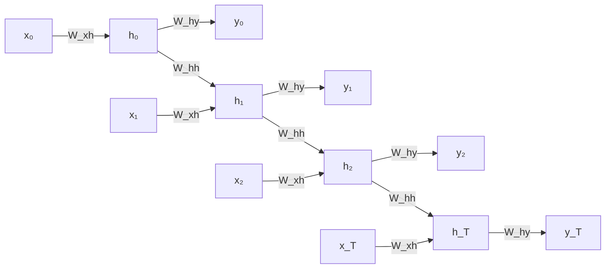

## 1. Motivación: por qué modelar secuencias

El mundo está lleno de datos secuenciales: audio, video, texto, series temporales financieras, secuencias de ADN biológicas. A diferencia de las redes feed-forward o convolucionales que procesan entradas de **tamaño fijo**, una red recurrente maneja secuencias de **longitud variable** mediante un estado oculto que persiste entre pasos temporales *(slides 1-6)*.

La pregunta fundamental es: **dado el contexto pasado, ¿qué viene después?** Esta pregunta subyace en tareas como predecir la trayectoria de un objeto en movimiento ("dada una imagen de una pelota, ¿dónde estará en el siguiente frame?") o generar el siguiente token en una secuencia de palabras. Las secuencias aparecen en múltiples dominios —carácter a carácter, palabra a palabra, frame a frame— y el desafío es capturar tanto **dependencias de corto plazo** como **dependencias de largo plazo** que pueden estar separadas por cientos de pasos temporales.

---

## 2. Limitaciones de los enfoques ingenuos

Antes de presentar las RNNs, Amini expone tres soluciones ingenuas y por qué fallan *(slides 7-13)*.

### 2.1 Ventana fija pequeña

La forma más simple es usar una **ventana deslizante** de tamaño fijo para predecir el siguiente elemento. Dado un contexto de dos palabras anteriores ("for a"), se predice la siguiente. Cada palabra se codifica en **one-hot encoding**, sin perder información de la identidad.

El problema: una ventana de dos palabras captura muy poco contexto. En la oración *"Francia es donde crecí, pero ahora vivo en Boston. Hablo fluidamente ____"*, para predecir "francés" se necesita información del **pasado distante** (que viví en Francia al inicio). Una ventana pequeña falla categóricamente.

### 2.2 Bag of words (contar palabras)

Codificar todo el texto como un vector de conteos por palabra. El problema es que los **conteos no preservan el orden**. Las frases *"The food was good, not bad at all"* y *"The food was bad, not good at all"* tienen el mismo vector de conteos, pero significan lo **opuesto**. Sin preservar el orden, es imposible capturar negaciones, contexto temporal o relaciones sintácticas.

### 2.3 Ventana fija grande

Expandir la ventana a toda la secuencia, con un vector one-hot independiente por posición. El problema fundamental: **sin compartir parámetros**. Cada palabra en cada posición es un parámetro separado; lo aprendido sobre "this" en posición 1 no transfiere a "this" en posición 5. El modelo no generaliza y el número de parámetros crece sin límite con la longitud de la secuencia.

---

## 3. Criterios de diseño para el modelado de secuencias

Tras exponer las limitaciones, Amini enumera **cuatro criterios clave** que debe cumplir una solución robusta *(slide 14)*:

1. **Manejar secuencias de longitud variable** sin padding artificial ni truncamiento.
2. **Rastrear dependencias de largo plazo**: el estado interno debe retener y propagar información del pasado distante.
3. **Preservar información sobre el orden**: el orden de la secuencia debe estar implícitamente codificado.
4. **Compartir parámetros entre pasos**: los mismos pesos en cada paso temporal, permitiendo generalización y eficiencia de parámetros.

Las **redes neuronales recurrentes (RNNs)** emergen como la respuesta natural a estos cuatro requisitos.

---

## 4. Arquitectura de redes neuronales recurrentes

### 4.1 Concepto fundamental: recurrencia

Una RNN aplica la **misma función** en cada paso temporal, con una entrada que incluye el estado oculto del paso anterior *(slides 15-17)*. La ecuación fundamental es:

$$h_t = f_W(x_t, h_{t-1})$$

donde:

- $x_t$ es la entrada en el paso $t$.
- $h_t$ es el **estado oculto** — un "resumen lossy" de toda la información procesada hasta el momento.
- $f_W$ es una función parametrizada (típicamente una red neuronal pequeña) con pesos aprendibles $W$.

Este mecanismo cumple los cuatro criterios:

- **Longitud variable**: se aplica el mismo paso recurrente tantas veces como sea necesario.
- **Largo plazo**: el estado $h_t$ propaga información desde $h_0$ por composición a través del tiempo.
- **Orden**: la secuencia se procesa paso a paso, preservando estructura temporal.
- **Parámetros compartidos**: $f_W$ es idéntica en cada $t$; la red reutiliza los mismos pesos.

### 4.2 Parametrización estándar: lineal + activación

La implementación típica usa una combinación de transformación lineal y activación no-lineal:

$$h_t = \tanh(W_{hh}^\top h_{t-1} + W_{xh}^\top x_t)$$

donde:

- $W_{hh} \in \mathbb{R}^{d_h \times d_h}$ es la matriz de transición del estado oculto ("recurrente").
- $W_{xh} \in \mathbb{R}^{d_h \times d_x}$ es la matriz entrada-a-oculto.
- $\tanh$ es una activación no-lineal que introduce expresividad.
- El bias se absorbe implícitamente.

La dimensión crítica es $d_h$, el **tamaño del estado oculto**: suficientemente grande para capturar contexto, pero eficiente en parámetros.

Para generar una predicción en cada paso, se añade una capa de salida:

$$\hat{y}_t = W_{hy}^\top h_t$$

donde $W_{hy} \in \mathbb{R}^{d_y \times d_h}$ mapea del estado oculto al espacio de salida.

### 4.3 Pseudocódigo de RNN

La implementación operativa, con pesos compartidos en cada paso, se resume *(slides 18-19)*:

```python
my_rnn = RNN()
hidden_state = [0, 0, 0, 0]      # h_0 inicializado en cero

sentence = ["I", "love", "recurrent", "neural"]

for word in sentence:
    prediction, hidden_state = my_rnn(word, hidden_state)

next_word_prediction = prediction  # predicción para "networks"
```

La misma instancia `my_rnn` (con los mismos pesos) procesa cada palabra, actualizando `hidden_state` en cada iteración.

---

## 5. Arquitecturas según la tarea

Las RNNs permiten múltiples configuraciones según cómo se alineen las secuencias de entrada y salida *(slides 16-19)*:

- **Many-to-one** (clasificación de secuencias): se procesan todos los inputs $x_1, \ldots, x_T$ generando estados $h_1, \ldots, h_T$, pero solo el **último estado** $h_T$ alimenta una salida $y$. Ejemplo: análisis de sentimiento de una oración completa.
- **One-to-many** (generación condicionada): se proporciona un único input (o contexto inicial codificado en $h_0$) que genera una secuencia de outputs $y_1, \ldots, y_T$. Ejemplo: image captioning, donde la imagen se codifica y la RNN genera palabras secuencialmente.
- **Many-to-many síncrono** (misma longitud): se generan outputs en cada paso temporal, con igual número de pasos que inputs. Ejemplo: etiquetado POS (part-of-speech) de oraciones.
- **Many-to-many asíncrono** (encoder-decoder): dos RNNs en cascada: un **encoder** procesa la secuencia de entrada y resume en $h_T$ (el "contexto"); un **decoder** alimentado por el contexto genera la secuencia de salida. Permite entrada y salida de **longitudes distintas**. Ejemplo: traducción automática.

---

## 6. Grafo computacional desplegado en el tiempo

Para entender cómo entrenar una RNN, visualizar el **grafo computacional desplegado** es fundamental *(slides 23-25)*. En lugar de ver la RNN como un ciclo, se "despliega" en el tiempo: en cada paso $t = 1, \ldots, T$ hay una copia del módulo RNN recibiendo $x_t$ y $h_{t-1}$, produciendo $h_t$ y $y_t$.



El grafo resultante es una **red feed-forward profunda** (con profundidad $T$). Las **mismas matrices $W_{xh}$, $W_{hh}$, $W_{hy}$ se repiten** en cada paso: los parámetros se **comparten profundamente** a través del tiempo. Esta visualización es esencial para comprender por qué el entrenamiento es desafiante: el gradiente debe fluir hacia atrás a través de muchas capas, ampliando el riesgo de vanishing o exploding gradients.

---

## 7. Backpropagation through time (BPTT)

Entrenar una RNN requiere extender backpropagation al grafo desplegado. El procedimiento se llama **backpropagation through time (BPTT)** *(slides 24-26)*:

1. **Forward pass**: propagar $x_1, \ldots, x_T$ por el grafo desplegado, computando $h_1, \ldots, h_T$ y $y_1, \ldots, y_T$.
2. **Definir pérdida**: sumar la pérdida en cada paso (típicamente cross-entropy):

   $$L = \sum_{t=1}^{T} L_t(y_t, \text{target}_t)$$
3. **Backward pass**: aplicar la regla de la cadena a través del grafo desplegado. El gradiente respecto a $W_{hh}$ recibe contribuciones de **todos** los pasos temporales, porque $W_{hh}$ aparece en cada transición $h_{t-1} \to h_t$.
4. **Actualizar**: aplicar SGD, Adam o RMSprop con los gradientes computados.

Al calcular el gradiente respecto a $h_0$, la señal debe fluir hacia atrás a través de $T$ pasos. Cada factor incluye la derivada de la activación y la matriz $W_{hh}$. Para una RNN vanilla con tanh:

$$\frac{\partial h_t}{\partial h_{t-1}} = W_{hh}^\top \cdot \mathrm{diag}\bigl(\tanh'(z)\bigr)$$

donde $z$ es la pre-activación y $\tanh'(z) = 1 - \tanh^2(z) \in (0, 1)$.

---

## 8. Vanishing y exploding gradients

El flujo del gradiente a través de muchos pasos temporales es **multiplicativo**: la derivada de $h_t$ respecto a $h_{t-k}$ es un producto de $k$ jacobianos *(slides 27-28)*:

$$\frac{\partial h_t}{\partial h_{t-k}} = \prod_{i=0}^{k-1} \frac{\partial h_{t-i}}{\partial h_{t-i-1}}$$

Si los valores singulares de las jacobianas son **menores que 1**, el gradiente decae exponencialmente: **vanishing gradient**. Si son **mayores que 1**, explota: **exploding gradient**.

$$\left\| \frac{\partial L}{\partial h_0} \right\| \;\approx\; C \cdot \sigma_{\max}(W_{hh})^T$$

**Vanishing**: silencioso e impide aprender dependencias de largo plazo. El gradiente que viaja desde el paso 100 al paso 1 se vuelve negligible, y los pesos que afectan el paso 1 casi no se actualizan.

**Exploding**: causa inestabilidad numérica (NaN, Inf), pero al menos provoca alertas visibles.

Ambos fenómenos surgen del diseño arquitectónico: una RNN vanilla intenta comprimir toda la historia en un vector de estado oculto de dimensión fija, y multiplicar repetidamente por matrices $W_{hh}$ causa decaimiento o crecimiento exponencial. Las soluciones —gradient clipping, arquitecturas con compuertas, mecanismos de atención— se desarrollan en las partes siguientes.
