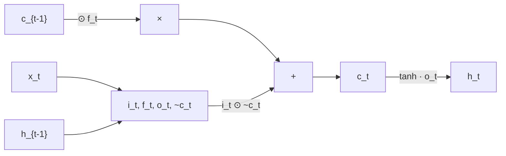

## 5. Recortado de gradientes (Gradient Clipping)

Durante el entrenamiento de RNNs mediante BPTT, los gradientes se propagan hacia atrás a través de muchos pasos temporales. Cuando la magnitud de estos gradientes crece de manera descontrolada, produce **exploding gradients**, causando inestabilidad numérica y divergencia del entrenamiento *(slide 48)*.

El **gradient clipping** es una técnica simple pero efectiva para mitigar este problema. El procedimiento es directo: antes de actualizar los parámetros, se verifica la norma del gradiente total. Si excede un umbral $\tau$, se escala proporcionalmente:

$$\hat{g} \leftarrow \begin{cases} g & \text{si } \|g\| \leq \tau \\ \dfrac{\tau}{\|g\|} \cdot g & \text{si } \|g\| > \tau \end{cases}$$

A continuación, se realiza la actualización de parámetros con el gradiente recortado: $\theta \leftarrow \theta - \eta \hat{g}$.

**Por qué funciona**: el clipping limita la magnitud del paso de actualización sin alterar la dirección del gradiente. Esto evita saltos numéricos extremos que podrían causar NaN o Inf. El umbral típico $\tau$ se elige empíricamente (por ejemplo, 5.0 o 10.0).

**Limitación crítica**: el gradient clipping **no resuelve el vanishing gradient**, solo mitiga la explosión. Para el desvanecimiento silencioso de gradientes, que impide aprender dependencias a largo plazo, se requiere una arquitectura con mecanismos de memoria explícitos.

---

## 6. Limitaciones fundamentales de las RNNs vanilla

Las redes recurrentes estándar enfrentan dos desafíos críticos que limitan su capacidad de modelar secuencias largas *(slides 49-52)*.

### 6.1 El problema del desvanecimiento de gradientes

Cuando se calcula el gradiente respecto a un estado oculto temprano $h_0$, este debe fluir hacia atrás a través de $T$ pasos temporales. Matemáticamente:

$$\frac{\partial L}{\partial h_0} = \frac{\partial L}{\partial h_T} \cdot \frac{\partial h_T}{\partial h_{T-1}} \cdot \frac{\partial h_{T-1}}{\partial h_{T-2}} \cdots \frac{\partial h_1}{\partial h_0}$$

Cada factor en esta cadena de jacobianos incluye la derivada de la activación (por ejemplo, $\tanh'(z)$) y la matriz de recurrencia $W_{hh}$. Si los valores singulares de estas jacobianas son consistentemente menores que 1, el producto de muchos factores decae exponencialmente. El gradiente que viaja desde el paso 100 al paso 1 se vuelve negligible, y la red no puede aprender cómo el paso inicial afecta la salida final.

**Impacto práctico**: la red desarrolla un sesgo hacia las **dependencias de corto plazo**. Los parámetros que influyen en predicciones cercanas se actualizan eficientemente, mientras que los que afectan predicciones distantes casi no reciben señal de error.

### 6.2 El cuello de botella de información

Una RNN vanilla comprime toda la historia de la secuencia en un vector de estado oculto de dimensión fija. Para secuencias de miles de pasos, un vector de 128 o 256 dimensiones es insuficiente para retener toda la información relevante. La red debe olvidar información antigua para dejar espacio a información nueva.

El ejemplo clásico ilustra el problema: *"Francia es donde crecí, pero ahora vivo en Boston. Hablo fluidamente ___."* Para predecir "francés", el modelo debe recordar información del **pasado distante** (mencionada al principio). Sin un mecanismo explícito, esta información se diluye conforme procesa palabras intermedias.

---

## 7. Motivación para los mecanismos de compuertas (gating)

La solución a ambos problemas es introducir **compuertas** que controlen selectivamente qué información fluye, qué se olvida y qué se retiene en la celda de memoria *(slides 53-55)*.

La intuición combina dos mecanismos clave:

1. **Multiplicación elemento-a-elemento por vectores de compuerta**: los valores de las compuertas están entre 0 y 1 (producidos por activación sigmoide). Un valor de 0 "cierra" completamente el flujo; un valor de 1 lo abre completamente.

2. **Conexiones "shortcut" o caminos alternativos**: en lugar de transformar información a través de múltiples capas no-lineales, se permite que fluya relativamente sin cambios cuando se desea. Esto crea caminos para que el gradiente viaje sin acumulación de transformaciones.

Estas dos ideas en combinación mitigan el vanishing gradient: los caminos directos reducen la "distancia" que el gradiente debe viajar, mientras que las compuertas aprendibles permiten a la red desarrollar control fino sobre qué retener y qué descartar.

Típicamente se introduce una tríada de compuertas:

- **Forget gate**: controla qué del estado anterior se retiene.
- **Input gate**: controla cuánta información nueva entra.
- **Output gate**: controla qué se expone al siguiente paso.

---

## 8. LSTM: Long Short-Term Memory

### 8.1 Arquitectura fundamental

LSTM, propuesto por Hochreiter y Schmidhuber (1997), es la arquitectura con compuertas más icónica *(slides 54-55)*. A diferencia de una RNN vanilla que mantiene un único estado oculto $h_t$, el LSTM mantiene **dos estados paralelos**:

- **Cell state** $c_t$: la "memoria" principal o "cinta de contexto". Fluye con cambios mínimos cuando el forget gate es alto, preservando información a largo plazo.
- **Hidden state** $h_t$: la salida "filtrada" del cell state, que se pasa al siguiente paso y se usa para la predicción.

### 8.2 Ecuaciones del LSTM

Las ecuaciones formales *(slides 54-55)*:

$$i_t = \sigma(W_{xi} x_t + W_{hi} h_{t-1} + b_i) \quad \text{(input gate)}$$

$$f_t = \sigma(W_{xf} x_t + W_{hf} h_{t-1} + b_f) \quad \text{(forget gate)}$$

$$\tilde{c}_t = \tanh(W_{xc} x_t + W_{hc} h_{t-1} + b_c) \quad \text{(candidate cell state)}$$

$$c_t = f_t \odot c_{t-1} + i_t \odot \tilde{c}_t \quad \text{(new cell state)}$$

$$o_t = \sigma(W_{xo} x_t + W_{ho} h_{t-1} + b_o) \quad \text{(output gate)}$$

$$h_t = o_t \odot \tanh(c_t) \quad \text{(hidden state)}$$

donde $\odot$ denota multiplicación elemento-a-elemento. Todos los pesos $W$ y biases $b$ son aprendibles.

### 8.3 Rol de cada compuerta

**Forget gate** $f_t$: produce valores en $(0, 1)$ que multiplican elemento-a-elemento el cell state anterior. Si $f_t$ es cercano a 0, el contenido de $c_{t-1}$ se "olvida"; si es cercano a 1, se preserva. La red aprende cuándo olvidar información antigua.

**Input gate** $i_t$ y **candidate** $\tilde{c}_t$: el input gate decide cuánta información nueva entra en el cell state. El candidato, computado con tanh, proporciona los valores que pueden entrar. La combinación $i_t \odot \tilde{c}_t$ filtra el candidato según importancia.

**Output gate** $o_t$: controla qué información del cell state se comunica al siguiente paso y al exterior. El cell state se filtra con una activación tanh y se multiplica por $o_t$.

### 8.4 Por qué LSTM mitiga el vanishing gradient

La derivada del cell state respecto al paso anterior es:

$$\frac{\partial c_t}{\partial c_{t-1}} = f_t$$

**Críticamente**, no hay matriz $W_{hh}$ multiplicando: es únicamente una multiplicación elemento-a-elemento por valores en $(0, 1)$. Aunque cada elemento sea menor que 1, rara vez **todos** los elementos simultáneamente son cercanos a cero. En contraste, una RNN vanilla multiplica repetidamente por $W_{hh}$, causando decaimiento exponencial rápido cuando sus valores singulares son pequeños. El LSTM evita esto, permitiendo que la red mantenga un "camino directo" para el flujo de información y gradientes.

---

## 9. GRU: Gated Recurrent Unit

La arquitectura **GRU** (Cho et al., 2014) simplifica el diseño de LSTM combinando el forget gate y el input gate en una única **update gate**, y eliminando el cell state separado. En su lugar, usa un único estado oculto $h_t$ que se actualiza de forma similar *(slide 55)*.

Las ecuaciones principales:

$$z_t = \sigma(W_{xz} x_t + W_{hz} h_{t-1}) \quad \text{(update gate)}$$

$$r_t = \sigma(W_{xr} x_t + W_{hr} h_{t-1}) \quad \text{(reset gate)}$$

$$\tilde{h}_t = \tanh(W_{x\tilde{h}} x_t + W_{h\tilde{h}} (r_t \odot h_{t-1})) \quad \text{(candidate)}$$

$$h_t = (1 - z_t) \odot h_{t-1} + z_t \odot \tilde{h}_t$$

**Update gate** $z_t$: balance entre retener el estado anterior y adoptar el candidato nuevo.

**Reset gate** $r_t$: controla cuánto del estado anterior se considera al computar el candidato.

**Ventajas de GRU**: menos parámetros que LSTM (no requiere el cell state separado), entrenamiento más rápido y rendimiento típicamente comparable. Es una opción preferida en contextos donde la eficiencia de parámetros es crítica.

---

## 10. Limitaciones de los modelos recurrentes y motivación para attention

Aunque LSTM y GRU resolvieron el vanishing gradient, siguen procesando secuencias **secuencialmente**, paso a paso. Esto introduce limitaciones que motivan el salto hacia mecanismos de atención.

### 10.1 Cuello de botella secuencial

Cada paso $t$ depende de la salida del paso $t-1$. Esto impide la paralelización a través del tiempo y hace que el entrenamiento de secuencias largas sea lento, incluso en hardware altamente paralelo (GPUs/TPUs).

### 10.2 Distancia efectiva entre tokens

Aunque las compuertas LSTM permiten teóricamente preservar información indefinidamente, en la práctica las dependencias de muy largo alcance siguen siendo difíciles. La señal entre tokens distantes debe atravesar muchos pasos de procesamiento, atenuándose por interferencia de tokens intermedios.

### 10.3 Cuello de botella de codificación en seq2seq

En arquitecturas **seq2seq** con LSTM, el encoder comprime toda la entrada en un vector de contexto fijo $c$ de dimensión limitada. El decoder genera la salida usando únicamente este vector. Para secuencias largas, toda la información debe fluir a través de este cuello de botella, causando pérdida de información.

Ejemplo: traducir *"El auto rojo de Carlos está averiado"* requiere que el encoder capture estructura gramatical, identidades de entidades (Carlos, auto), atributos (rojo) y estado (averiado). Todo en un vector $c$. El decoder, sin acceso directo a palabras específicas del input, debe generar la traducción palabra por palabra; cuando necesita generar "Carlos", no tiene acceso directo a esa palabra en el input, debe "recordarla" en $c$, que ahora contiene información sobre todas las otras palabras también.

La **atención** resuelve esto permitiendo que el decoder, en cada paso, genere su propio context vector adaptativo que enfatiza las partes relevantes del input.

---

## 11. Self-attention: queries, keys y values

La **self-attention** (o intra-attention) emerge como un mecanismo alternativo para capturar dependencias en una secuencia **sin necesidad de recurrencia**. En lugar de procesar token por token, permite que cada posición "atienda" directamente a todas las demás posiciones simultáneamente.

### 11.1 La metáfora de búsqueda

La idea central es derivar tres representaciones para cada token:

- **Query** (pregunta): ¿Qué información necesito?
- **Key** (clave): ¿Qué información puedo ofrecer?
- **Value** (valor): ¿Cuál es esa información?

Es análogo a una búsqueda en una base de datos: la *query* se compara con todas las *keys*; las que más coinciden seleccionan los *values* correspondientes.

### 11.2 Proyecciones aprendibles

Si la entrada es $X \in \mathbb{R}^{n \times d}$ ($n$ tokens, $d$ dimensiones):

$$Q = X W_Q, \quad K = X W_K, \quad V = X W_V$$

donde $W_Q, W_K, W_V \in \mathbb{R}^{d \times d_k}$ son matrices aprendibles. En self-attention, los tres provienen de la **misma** secuencia $X$ — de ahí el "self".

---

## 12. Scaled dot-product attention

Una vez derivados queries y keys, se computa la "compatibilidad" entre cada query y cada key:

$$\text{scores} = QK^T \in \mathbb{R}^{n \times n}$$

Cada elemento $(i, j)$ indica cuán relevante es la posición $j$ para la posición $i$. Para estabilizar estos scores, se escalan:

$$\text{attention\_scores} = \frac{QK^T}{\sqrt{d_k}}$$

donde $d_k$ es la dimensión de los keys. El factor $\sqrt{d_k}$ evita que los productos punto sean muy grandes cuando $d_k$ es grande, lo cual saturaría el softmax (gradientes muy pequeños).

Finalmente, se aplica softmax fila por fila para convertir los scores en probabilidades, y se ponderan los values:

$$\text{Attention}(Q, K, V) = \text{softmax}\!\left(\frac{QK^T}{\sqrt{d_k}}\right) V$$

El output es una combinación ponderada de los values, donde los pesos se aprenden según la relevancia capturada por queries y keys. La derivación formal del factor $\sqrt{d_k}$ se desarrolla en `profundizacion.md`.

---

## 13. Síntesis del bloque intermedio

Las limitaciones de las RNNs vanilla —vanishing gradients y cuello de botella de codificación— impulsaron el desarrollo de arquitecturas progresivamente más sofisticadas:

1. **Gradient clipping** mitiga la explosión, pero no el desvanecimiento.
2. **LSTM/GRU** resuelven el desvanecimiento mediante caminos directos y compuertas aprendibles, permitiendo aprender dependencias de centenas de pasos.
3. **Self-attention** elimina el cuello de botella secuencial: cada posición accede directamente a todas las demás, en paralelo.

El siguiente bloque (Parte III) construye sobre la self-attention para llegar al **Transformer** completo: multi-head attention, positional encoding, normalización por capas, conexiones residuales y aplicaciones más allá del lenguaje.
