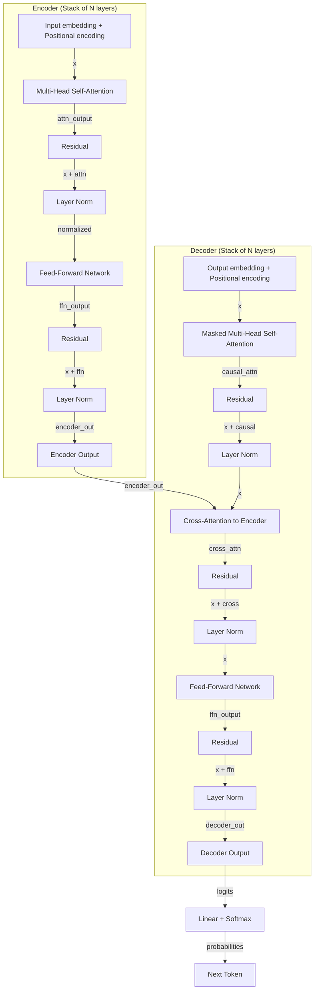

## 1. Mecanismo de Atención Escalada (Scaled Dot-Product Attention)

La atención es el mecanismo fundamental que permite a las redes neuronales identificar y enfocarse en las características más importantes de una entrada. El objetivo central es reconocer qué partes del input merecen mayor atención *(slides 56-58)*.

El proceso comprende cuatro pasos clave:

1. **Codificación de información posicional**: Dado que los datos se procesan en paralelo (no secuencialmente como en RNNs), es necesario inyectar información sobre la posición de cada elemento en la secuencia. Sin esto, la arquitectura no distingue el orden de los tokens.

2. **Extracción de query, key, value**: Cada posición genera tres representaciones aprendidas mediante capas lineales aplicadas a la entrada con codificación posicional.

3. **Cálculo del peso de atención**: Se computa la similitud entre cada query y todos los keys usando el producto punto, escalado por un factor de normalización:

$$\text{Attention}(Q, K, V) = \text{softmax}\left(\frac{QK^T}{\sqrt{d_k}}\right)V$$

Aquí, $d_k$ es la dimensión de los keys. El escalamiento evita valores extremos en la softmax *(slide 59)*.

4. **Extracción de características con alta atención**: Los pesos resultantes se usan para ponderar los values, obteniendo una representación que enfatiza los tokens relevantes.

### Multi-Head Attention

Una cabeza de atención solo puede enfocarse en un patrón simultáneamente. La solución es usar múltiples cabezas en paralelo, cada una aprendiendo patrones diferentes. Una cabeza podría atender a relaciones sintácticas, otra a semánticas, etc. *(slides 60-61)*

Cada cabeza:
- Proyecta entrada a query, key, value independientes
- Computa atención con dimensión reducida
- Genera un output que se concatena con los de otras cabezas
- Se proyecta nuevamente a la dimensión original

## 2. Codificación Posicional (Positional Encoding)

Como el Transformer procesa toda la secuencia simultáneamente, pierde información inherente del orden. La solución clásica es sumar una codificación posicional a cada embedding *(slides 62-63)*.

La codificación usa funciones sinusoidales:

$$PE_{(pos, 2i)} = \sin\left(\frac{pos}{10000^{2i/d_{model}}}\right)$$

$$PE_{(pos, 2i+1)} = \cos\left(\frac{pos}{10000^{2i/d_{model}}}\right)$$

Donde:
- $pos$ es la posición en la secuencia
- $i$ es la dimensión del modelo
- Las frecuencias varían logarítmicamente entre dimensiones

Esta formulación permite al modelo aprender tanto dependencias locales como de largo alcance, pues diferentes dimensiones capturan patrones a diferentes escalas temporales.

## 3. Arquitectura Completa del Transformer

*(Slides 64-70 aproximadamente)*

### Bloque Encoder

El encoder es una pila de capas idénticas. Cada capa contiene:

1. **Multi-head self-attention**: Los tokens atienden a todos los demás tokens (incluido a sí mismo)
2. **Conexión residual**: $\text{output} = x + \text{MultiHeadAttention}(x)$
3. **Normalización de capa**: Layer normalization estabiliza el entrenamiento
4. **Feed-forward block**: Red neuronal de dos capas con ReLU
   - Primera capa expande la dimensión (típicamente 4x)
   - Segunda capa proyecta de vuelta
5. **Otra conexión residual**: $\text{output} = x + \text{FFN}(x)$

Las conexiones residuales y normalizaciones son críticas para permitir que redes muy profundas entrenen efectivamente.

### Bloque Decoder

El decoder es similar al encoder pero con tres modificaciones:

1. **Self-attention enmascarada**: Causal/masked attention. Un token solo puede atender a posiciones anteriores, no futuras. Esto es esencial en tareas generativas para evitar acceso a información futura.

2. **Cross-attention**: El decoder atiende a la salida del encoder, permitiendo que la información codificada se incorpore al proceso decodificador.

3. **Salida decodificada secuencialmente**: A diferencia del encoder que procesa todo paralelamente, el decoder típicamente genera un token por paso de tiempo (durante inferencia).

### Arquitectura Encoder-Decoder Completa

## 4. Mecanismos Especializados: Atención Enmascarada y Causal

### Atención Enmascarada (Masked Attention)

En tareas generativas, durante el entrenamiento no queremos que el modelo vea posiciones futuras. Se implementa multiplicando los scores de atención por una máscara triangular antes del softmax: los valores correspondientes a posiciones futuras se establecen a $-\infty$, asegurando que softmax produce probabilidad 0 *(slides 65-67)*.

### Cross-Attention

En arquitecturas encoder-decoder, la cross-attention permite que cada posición del decoder atienda a todas las posiciones del encoder. Las queries provienen del decoder, mientras que keys y values vienen del encoder. Esto es fundamental para tareas como traducción automática, donde el decoder necesita acceder selectivamente a diferentes partes de la entrada codificada.

## 5. Aplicaciones Transversales de Transformers

*(Slides 71-76)*

### Procesamiento de Lenguaje Natural (NLP)

**BERT (Devlin et al., 2019)**: Transformer bidireccional preentrenado. Usa solo el encoder, enfocándose en tareas de comprensión (clasificación, extracción de entidades). La atención bidireccional permite que cada token vea contexto futuro y pasado.

**GPT (Brown et al., 2020)**: Transformer solo-decoder. Usa atención causal para tareas de generación (continuación de texto, resumen). Preentrenado con objective language modeling: predecir el siguiente token.

### Visión por Computadora (Computer Vision)

**Vision Transformer (ViT, Dosovitskiy et al., 2020)**: Divide la imagen en parches (patches), los embebe, añade codificación posicional, y pasa por Transformer estándar. Demostró que los Transformers pueden competir o superar a CNNs en tareas de clasificación de imágenes, especialmente con datos de entrenamiento suficientes.

La ventaja clave: los Transformers capturan relaciones de largo alcance sin los sesgos inductivos de las convoluciones locales.

### Modelado de Secuencias Biológicas

**AlphaFold (Jumper et al., 2021, Lin et al., 2023)**: Usa Transformers para predecir estructura de proteínas a partir de secuencias de aminoácidos. La atención aprende qué residuos interaccionan a través de la cadena 3D. Revolucionó la biología estructural.

El breakthrough: la atención multi-head puede representar explícitamente interacciones entre pares de residuos, lo que es perfecto para estructura proteica.

## 6. Ventajas sobre Modelos Recurrentes

*(Slides 77-79)*

Los RNNs sufren limitaciones críticas:

- **Cuello de botella de codificación**: Toda la información de entrada debe comprimirse en un vector de estado oculto de dimensión fija
- **Sin paralelización**: El procesamiento es secuencial; cada step depende del anterior
- **Memoria limitada**: La información temprana se diluye al propagar a través de muchos pasos

Los Transformers eliminan estas limitaciones:

- **Atención directa**: Cada posición puede acceder directamente a cualquier otra, sin intermediarios
- **Paralelización completa**: Todos los tokens se procesan simultáneamente
- **Memoria de largo plazo**: Los gradientes fluyen directamente entre posiciones distantes

## 7. Cierre: El Futuro de los Modelos de Secuencias

*(Slide 83)*

Los Transformers son el bloque constructivo fundamental de los grandes modelos de lenguaje (Large Language Models, LLMs) modernos. La lección destaca seis puntos:

1. RNNs son adecuados para tareas de modelado de secuencias, pero tienen limitaciones estructurales
2. La recurrencia permite modelar dependencias secuenciales
3. El entrenamiento requiere backpropagation a través del tiempo (BPTT)
4. Existen aplicaciones exitosas en música, clasificación, traducción, etc.
5. **La atención permite procesar secuencias sin recurrencia**, eliminando cuellos de botella
6. **La atención es la base de muchos modelos de lenguaje grandes** — el futuro pertenece a arquitecturas basadas en Transformers
