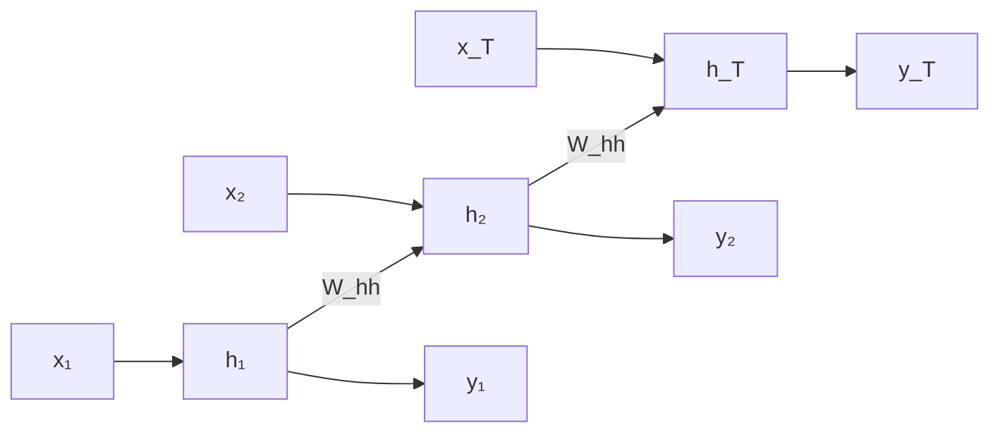

## 1. Motivación: Por Qué Modelar Secuencias

El mundo de los datos está lleno de secuencias. Audio, video, texto, series temporales financieras, secuencias de ADN. A diferencia de las redes neuronales feed-forward tradicionales (MLP) o las convolucionales (CNN), que trabajan con entradas de **tamaño fijo**, una red neuronal recurrente puede procesar secuencias de **longitud variable** manteniendo un estado oculto que persiste entre pasos temporales.

La pregunta fundamental que motiva el trabajo con secuencias es: **dado un contexto pasado, ¿qué viene después?** *(slides 1-6)*. Esta es la tarea central del modelado de secuencias, ejemplificada en preguntas como "dada una imagen de una pelota en movimiento, ¿dónde estará en el siguiente frame?" o "dada una secuencia de palabras, ¿cuál es la próxima palabra?"

Las secuencias aparecen en múltiples dominios: carácter a carácter en procesamiento de texto, palabra a palabra en lenguaje natural, o frame a frame en visión temporal. El desafío es capturar tanto **dependencias de corto plazo** como **dependencias de largo plazo** en la información.

## 2. Limitaciones de los Enfoques Ingenuous para Secuencias

Antes de introducir RNNs, el documento explora ideas previas y sus limitaciones *(slides 7-13)*.

### Idea #1: Ventana Fija Pequeña

La forma más simple de abordar la predicción del siguiente elemento es usar una **ventana deslizante** de tamaño fijo. Dado un contexto de dos palabras anteriores ("for a"), predecir la siguiente. Cada palabra se codifica en **one-hot encoding** (un vector donde todas las posiciones son cero excepto una).

El problema es evidente: una ventana de dos palabras no captura contexto suficiente para resolver ambigüedades semánticas. En la oración "Francia es donde crecí, pero ahora vivo en Boston. Hablo fluidamente ____", necesitamos información del **pasado distante** (que viví en Francia) para predecir "francés". Una ventana pequeña falla completamente.

### Idea #2: Bag of Words (Contar Palabras)

¿Por qué no usar toda la secuencia, pero como un conjunto de conteos? Se codifica el texto completo como un vector donde cada posición es la frecuencia de una palabra.

El problema: los **conteos no preservan el orden**. Las oraciones "The food was good, not bad at all" y "The food was bad, not good at all" tienen el mismo vector de conteos, pero significan lo **opuesto**. Sin información sobre orden, es imposible capturar negaciones, contexto temporal, o relaciones sintácticas.

### Idea #3: Ventana Fija Grande

Expandimos la ventana a toda la secuencia. Cada entrada (cada palabra) recibe un vector one-hot independiente que se procesa hacia una predicción.

El problema fundamental: **sin compartición de parámetros**. Cada palabra en cada posición es un parámetro separado. Las cosas aprendidas sobre "this" en posición 1 no transfieren a "this" en posición 5. El modelo no generalizará a nuevas secuencias y el número de parámetros crece ilimitadamente.

## 3. Criterios de Diseño para el Modelado de Secuencias

Después de exponer estas limitaciones, Soleimany enumera **cuatro criterios clave** que debe cumplir una solución *(slide 14)*:

1. **Manejar secuencias de longitud variable**: el modelo debe procesar secuencias de cualquier duración sin requerir padding artificial o truncamiento.

2. **Rastrear dependencias a largo plazo**: el estado interno debe poder retener y propagar información desde el pasado distante.

3. **Mantener información sobre el orden**: la secuencia debe preservarse implícitamente en la representación, no solo como conteos.

4. **Compartir parámetros entre pasos**: los mismos pesos se aplican en cada paso temporal, permitiendo generalización y eficiencia de parámetros.

Las **Redes Neuronales Recurrentes (RNNs)** emergen como la respuesta natural a estos cuatro requisitos.

## 4. Arquitectura de Redes Neuronales Recurrentes

### Estructura Básica: La Recurrencia

Una RNN es una arquitectura que aplica la **misma función** a cada paso temporal, pero con una entrada que incluye el estado oculto del paso anterior. *(slide 15)* La ecuación fundamental es:

$$h_t = f(h_{t-1}, x_t)$$

donde:
- $x_t$ es la entrada en el paso $t$.
- $h_t$ es el **estado oculto** en el paso $t$, que actúa como un "resumen lossy" de toda la información vista hasta ese momento.
- $f$ es una función parametrizada (típicamente una red neuronal pequeña).

Este mecanismo cumple todos los criterios:
- **Longitud variable**: se puede aplicar el mismo paso recurrente tantas veces como sea necesario.
- **Largo plazo**: el estado $h_t$ propaga información desde $h_0$ mediante una cadena de composiciones.
- **Orden**: la secuencia se procesa paso a paso, preservando la estructura temporal.
- **Parámetros compartidos**: $f$ es la misma en cada $t$.

### Parametrización Típica: Lineal + No-linealidad

La implementación estándar usa una **combinación lineal + activación**:

$$h_t = \sigma(W_{hh} \, h_{t-1} + W_{xh} \, x_t)$$

donde:
- $W_{hh} \in \mathbb{R}^{d_h \times d_h}$ es la matriz de transición del estado oculto ("recurrente").
- $W_{xh} \in \mathbb{R}^{d_h \times d_x}$ es la matriz entrada-a-oculto.
- $\sigma$ es una activación no-lineal (típicamente tanh o ReLU).
- El bias se absorbe añadiendo una entrada constante 1.

La dimensión crítica es $d_h$, el **tamaño del estado oculto**, que debe ser lo suficientemente grande para capturar el contexto pero eficiente en parámetros.

### Codificación de la Salida

Para tareas donde necesitamos una predicción en cada paso o solo al final, añadimos una capa de salida:

$$y_t = \sigma(W_{hy} \, h_t)$$

donde $W_{hy} \in \mathbb{R}^{d_y \times d_h}$ mapea del estado oculto al espacio de salida.

## 5. Diversidad de Arquitecturas RNN para Aplicaciones

Las RNNs son altamente flexibles, permitiendo muchas configuraciones según la tarea *(slides 16-19)*:

### Muchos-a-Uno: Clasificación de Secuencias
Se procesan todos los inputs $x_1, \ldots, x_T$ generando estados $h_1, \ldots, h_T$, pero solo el **último estado** $h_T$ alimenta una salida $y$ (una única etiqueta o clase). **Ejemplo**: análisis de sentimiento de una oración completa.

### Uno-a-Muchos: Generación Condicionada
Se proporciona un único input (o contexto inicial codificado en $h_0$) que genera una secuencia completa de outputs $y_1, \ldots, y_T$. **Ejemplo**: generación de descripción de una imagen (image captioning), donde la imagen se codifica y la RNN genera una secuencia de palabras.

### Muchos-a-Muchos Síncrono (Misma Longitud)
Se procesan inputs y se generan outputs en cada paso temporal, con el mismo número de pasos. **Ejemplo**: etiquetado de partes de discurso (POS tagging) o labeling de frames en video.

### Encoder-Decoder (Seq2Seq)
Dos RNNs en cascada: un **encoder** procesa la secuencia de entrada y resume su información en $h_T$ (el "contexto" $c$), que luego alimenta un **decoder** que genera la secuencia de salida. Permite entrada y salida de **longitudes diferentes**. **Ejemplo**: traducción automática, donde la oración en idioma origen puede tener distinta longitud que la traducción.

## 6. Ejemplo Práctico: Generación de Texto a Nivel de Carácter

Un caso ilustrativo que aparece en los slides es la **generación de texto carácter a carácter** *(slides 20-22)*. 

Dado un vocabulario pequeño como $\{\text{'h'}, \text{'e'}, \text{'l'}, \text{'o'}\}$ y una secuencia de entrenamiento "hello":

- En el paso $t$, la RNN recibe el carácter $x_t$ en **one-hot encoding** (4-dimensional).
- Genera un estado oculto $h_t$ que codifica "he visto los caracteres h, e, l,...".
- Produce logits sobre el vocabulario $y_t$, que indican la probabilidad del siguiente carácter.
- Durante entrenamiento, se compara $y_t$ con la etiqueta (el siguiente carácter real).
- Durante inferencia, se muestrea del softmax de $y_t$ y se realimenta como entrada para el siguiente paso.

**Resultado notable**: entrenar este modelo en las obras completas de Shakespeare produce, después de suficientes iteraciones, texto que **conserva la estructura sintáctica** (pentámetro yámbico, diálogos correctos con escenografía) aunque sin coherencia semántica profunda. Las primeras iteraciones generan ruido; la estructura emerge con el entrenamiento.

## 7. Computación del Grafo Temporal y Despliegue

Para entender cómo entrenar una RNN, es crucial visualizar el **grafo computacional desplegado** *(slide 23)*. 

En lugar de ver la RNN como un ciclo, se "despliega" en el tiempo: en cada paso $t = 1, \ldots, T$, hay una copia del mismo módulo RNN recibiendo $x_t$ y $h_{t-1}$, produciendo $h_t$ y $y_t$. El grafo resultante es una **red feed-forward profunda** (con profundidad $T$) donde:

Esta visualización es crucial porque muestra que **las mismas matrices $W_{xh}$, $W_{hh}$, $W_{hy}$ se repiten** en cada paso. Esto impone una restricción fuerte pero necesaria: los parámetros se **comparten profundamente** a través del tiempo.

## 8. Entrenamiento: Backpropagation Through Time (BPTT)

### El Algoritmo BPTT

Entrenar una RNN requiere extender backpropagation al grafo desplegado. El procedimiento se denomina **Backpropagation Through Time (BPTT)** *(slides 24-26)*:

1. **Forward Pass**: propagar todos los inputs $x_1, \ldots, x_T$ a través del grafo desplegado, computando $h_1, \ldots, h_T$ y $y_1, \ldots, y_T$.

2. **Definir Pérdida**: calcular la pérdida total sumando la pérdida en cada paso (típicamente cross-entropy o ranking loss):
   $$L = \sum_{t=1}^{T} L_t(y_t, \text{target}_t)$$

3. **Backward Pass**: aplicar la regla de la cadena a través del grafo desplegado. El gradiente respecto a $W_{hh}$ recibe contribuciones de todos los pasos temporales, porque $W_{hh}$ aparece en cada transición $h_{t-1} \to h_t$.

4. **Actualizar**: aplicar SGD (o Adam, RMSprop, etc.) para actualizar los parámetros.

### Problemas Fundamentales: Vanishing y Exploding Gradients

Un desafío crítico emerge al desplegar la RNN: el flujo del gradiente a través de muchos pasos temporales es **multiplicativo**. La derivada de $h_t$ respecto a $h_{t-k}$ es un producto de $k$ matrices jacobianas:

$$\frac{\partial h_t}{\partial h_{t-k}} = \prod_{i=0}^{k-1} \frac{\partial h_{t-i}}{\partial h_{t-i-1}}$$

Si los valores singulares de las matrices jacobianas son **menores que 1**, el gradiente decae exponencialmente: **vanishing gradient**. Si son **mayores que 1**, explota: **exploding gradient** *(slide 27)*.

**Vanishing gradient**: particularmente problemático porque impide que la red aprenda dependencias de largo plazo. El gradiente que viaja desde el paso 100 al paso 1 se vuelve negligible, así que los pesos que afectan el paso 1 casi no se actualizan.

**Exploding gradient**: causa inestabilidad numérica pero es más fácil de detectar.

### Soluciones

- **Exploding**: **Gradient clipping** escala el gradiente cuando su norma excede un umbral. Previene picos sin afectar la dirección.

- **Vanishing**: requiere **cambios arquitecturales fundamentales**. Las soluciones principales son **LSTM** (Long Short-Term Memory) y **GRU** (Gated Recurrent Units), que introducen mecanismos de "compuerta" para permitir que el gradiente fluya sin atenuación.

## 9. Transición a Arquitecturas Gateadas: LSTM

Aunque el material de las primeras 30 páginas introduce principalmente RNNs vanilla, establece la motivación para arquitecturas gateadas *(slide 28)*. Una RNN vanilla con activación tanh sufre del problema de vanishing gradient porque:

$$\frac{\partial h_t}{\partial h_{t-1}} = \frac{\partial}{\partial h_{t-1}} \tanh(W_{hh} h_{t-1} + W_{xh} x_t) = \text{diag}(1 - \tanh^2(\cdot)) \cdot W_{hh}$$

Esta derivada incluye un producto matricial $W_{hh}$ que, típicamente, tiene valores singulares menores que 1.

**LSTM** (propuesto por Hochreiter & Schmidhuber, 1997) resuelve esto introduciendo una **cell state** $c_t$ que se actualiza mediante suma (no multiplicación matricial):

$$c_t = f \odot c_{t-1} + i \odot g$$

donde $f$, $i$, $g$ son "compuertas" (valores entre 0 y 1) que controlan qué información se preserva, olvida, y añade. La derivada respecto a la cell state anterior es simplemente la compuerta de olvido $f$, permitiendo flujo de gradiente sin atenuación exponencial.

---

Este conjunto de notas cubre los fundamentos conceptuales y arquitecturales de RNNs presentados en las primeras 30 páginas del lecture 2 de MIT 6.S191 (2020). Establece la motivación biológica y computacional, presenta las limitaciones de enfoques simples, desarrolla la arquitectura RNN, y delinea los desafíos de entrenamiento que motivarán arquitecturas más sofisticadas en secciones posteriores.

