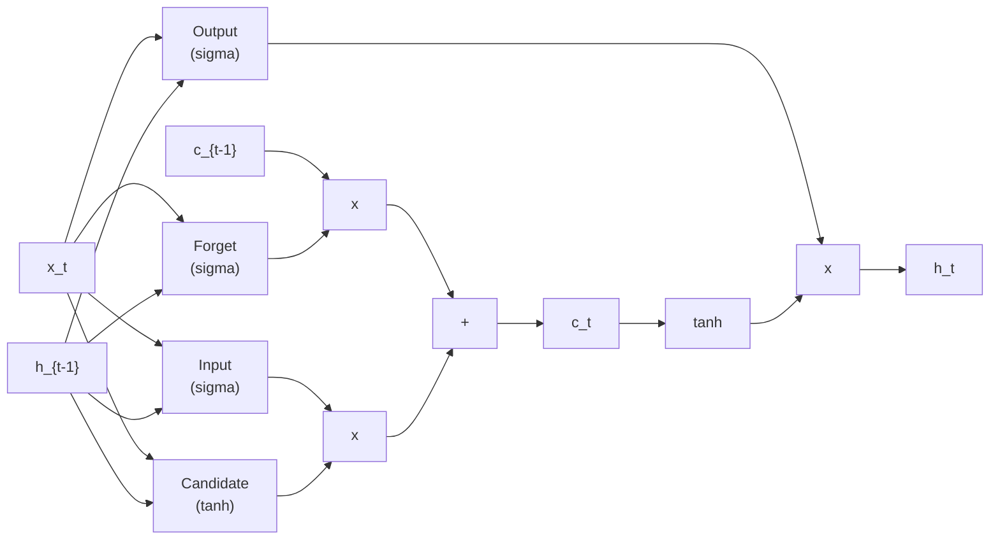

## 1. Grafo Computacional Desplegado en Tiempo

Una RNN puede representarse como un **grafo computacional desplegado** (unrolled computational graph) a traves de los pasos temporales. *(slides 31-35)* En lugar de mostrar una celda recurrente reutilizada, el grafo muestra explicitamente cada paso temporal, con la misma red aplicada T veces.

En el paso forward:
- Se procesa la secuencia completa: $x_0, x_1, \ldots, x_T$
- Se generan estados ocultos: $h_0, h_1, \ldots, h_T$
- Se producen salidas: $\hat{y}_0, \hat{y}_1, \ldots, \hat{y}_T$

En el paso backward (BPTT), el error retropropaga desde la perdida $L$ a traves de todas las conexiones recurrentes y entrada-oculto, regenerando gradientes para $W_{xh}$, $W_{hh}$ y $W_{hy}$.

---

## 2. Backpropagation Through Time (BPTT)

### Concepto General

BPTT es la generalizacion del algoritmo de backpropagation estandar al caso de **arquitecturas recurrentes con grafo desplegado en tiempo**. *(slides 36-40)*

**Fase forward**: Se despliega la RNN sobre toda la secuencia, alimentando cada entrada $x_t$ y manteniendo el estado oculto $h_t$. Se calcula la perdida total $L = \sum_{t=0}^{T} L_t$, donde $L_t$ es la perdida en el paso $t$.

**Fase backward**: Se propaga el error hacia atras desde $L$ a traves de la cadena de matrices $W_{hh}$, resultando en una multiplicacion **repetida** de jacobianos. Si se despliegan muchos pasos temporales (T grande), esto amplifica o atenua exponencialmente los gradientes.

### El Problema Fundamental

Al calcular el gradiente con respecto a $h_0$ (el estado oculto inicial), la senal de error debe fluir hacia atras a traves de $T$ pasos, cada uno multiplicando por $W_{hh}$ (o su jacobiano). Matematicamente:

$$\frac{\partial L}{\partial h_0} = \frac{\partial L}{\partial h_T} \cdot \frac{\partial h_T}{\partial h_{T-1}} \cdot \frac{\partial h_{T-1}}{\partial h_{T-2}} \cdots \frac{\partial h_1}{\partial h_0}$$

Cada factor $\frac{\partial h_t}{\partial h_{t-1}}$ incluye una derivada de la funcion de activacion y multiplicacion por $W_{hh}$. Para una RNN vanilla con tanh:

$$\frac{\partial h_t}{\partial h_{t-1}} = W_{hh}^T \cdot \text{diag}(\tanh'(z))$$

Si el mayor valor singular de $W_{hh}$ es menor a 1, el gradiente se reduce por factor $(< 1)^T$. Para T grande, tiende a cero. Si es mayor a 1, tiende a infinito.

---

## 3. Vanishing y Exploding Gradients

### Definicion y Causas

**Vanishing gradient** *(slides 41-45)*: El gradiente decae exponencialmente hacia las primeras capas/pasos. Si $\sigma_{\max}(W_{hh}) < 1$, entonces:

$$\left\| \frac{\partial L}{\partial h_0} \right\| \approx C \cdot \sigma_{\max}(W_{hh})^T \to 0 \text{ cuando } T \to \infty$$

Esto significa que la red no puede aprender **dependencias a largo plazo** porque el gradiente se pierde antes de llegar a los pasos tempranos.

**Exploding gradient**: Si $\sigma_{\max}(W_{hh}) > 1$, el gradiente crece exponencialmente:

$$\left\| \frac{\partial L}{\partial h_0} \right\| \approx C \cdot \sigma_{\max}(W_{hh})^T \to \infty$$

Esto causa **inestabilidad numerica** durante el entrenamiento, produciendo NaN o valores infinitos.

### Consecuencias Practicas

- **Vanishing**: La red aprende patrones locales bien, pero ignora contexto historico.
- **Exploding**: Actualizaciones de peso descontroladas, perdida de convergencia.

El gradiente de desvanecimiento es mas insidioso porque es silencioso; el exploding al menos provoca alertas (NaN).

---

## 4. Gradient Clipping: Solucion para Exploding Gradients

### Mecanica

**Gradient clipping** es una tecnica simple pero efectiva: si la norma del gradiente excede un umbral $\tau$, se escala proporcionalmente. *(slides 46-48)*

$$\hat{g} \leftarrow \begin{cases}
g & \text{si } \|g\| \leq \tau \\
\frac{\tau}{\|g\|} \cdot g & \text{si } \|g\| > \tau
\end{cases}$$

Despues, se actualiza con el gradiente recortado:

$$\theta \leftarrow \theta - \eta \hat{g}$$

### Por Que Funciona

- Limita la magnitud del paso de actualizacion.
- Mantiene la direccion del gradiente (normaliza solo la magnitud).
- Evita overflow/underflow numerico.

### Limitaciones

El clipping **no resuelve el vanishing gradient**: simplemente evita el explosion. Para desvanecimiento, se requiere una arquitectura diferente (LSTM, GRU).

---

## 5. Por Que RNNs Estandar Fallan en Secuencias Largas

### Incapacidad para Modelar Dependencias Lejanas

Una RNN vanilla intenta comprimir toda la historia en un vector de estado oculto de dimension fija. Para secuencias largas (T >> 1000), esto es insuficiente. *(slides 49-52)*

**Problema 1: Cuello de botella de informacion**. El estado $h_t$ debe conservar toda informacion relevante de $x_0, \ldots, x_{t-1}$. Con vanishing gradients, el gradiente de $L$ no llega a $h_0$, por lo que la red no puede aprender a retener informacion critica de pasos lejanos.

**Problema 2: Dependencias a largo plazo**. Algunos problemas (traduccion automatica, analisis de parrafos) requieren correlacionar informacion separada por 100+ pasos. Una RNN sin mecanismo de memoria explicito no puede mantener eso.

### Evidencia Empirica

Experimentos muestran que una RNN vanilla alcanza precision casi constante al predecir palabras lejanas en una secuencia. LSTM/GRU mejoran dramaticamente este comportamiento.

---

## 6. Motivacion para Compuertas (Gating)

La solucion es introducir **compuertas** (gates) que controlen que informacion fluye, que se olvida y que se retiene. *(slides 53-55)*

### Intuicion

En lugar de una actualizacion monolitica $h_t = f(h_{t-1}, x_t)$, se introduce:

1. **Multiplicacion elemento-wise** por vectores de compuerta (valores entre 0 y 1).
2. **Conexiones "shortcuts"** que evitan pasar por multiples transformaciones no-lineales.

Esto reduce la distancia que el gradiente debe viajar, mitigando el desvanecimiento.

### Tipos de Compuertas

- **Forget gate**: decide que informacion del estado anterior se retiene.
- **Input gate**: decide cuanta informacion nueva entra.
- **Output gate**: decide que se expone al exterior.

Cada compuerta es aprendible, permitiendo que la red desarrolle un control fino sobre la memoria.

---

## 7. Arquitectura LSTM: Motivacion y Diseno

### El Bloque LSTM

LSTM (Long Short-Term Memory), propuesto por Hochreiter y Schmidhuber en 1997, es la arquitectura con compuertas mas iconica. *(slides 56-58)*

En lugar de un estado oculto $h_t$, LSTM mantiene dos estados:
- **Cell state** $c_t$: la "memoria" principal, que fluye casi sin cambios si el forget gate es alto.
- **Hidden state** $h_t$: la salida "filtrada" del cell state.

---

## 8. Ecuaciones del LSTM

Las ecuaciones formales del LSTM son: *(slide 59)*

$$i_t = \sigma(W_{xi} x_t + W_{hi} h_{t-1} + b_i) \quad \text{(input gate)}$$

$$f_t = \sigma(W_{xf} x_t + W_{hf} h_{t-1} + b_f) \quad \text{(forget gate)}$$

$$\tilde{c}_t = \tanh(W_{xc} x_t + W_{hc} h_{t-1} + b_c) \quad \text{(candidate cell state)}$$

$$c_t = f_t \odot c_{t-1} + i_t \odot \tilde{c}_t \quad \text{(new cell state)}$$

$$o_t = \sigma(W_{xo} x_t + W_{ho} h_{t-1} + b_o) \quad \text{(output gate)}$$

$$h_t = o_t \odot \tanh(c_t) \quad \text{(hidden state)}$$

donde $\odot$ denota multiplicacion elemento-wise, y todos los $W$ y $b$ son parametros aprendibles.

---

## 9. Analisis de Compuertas LSTM

### Forget Gate ($f_t$)

$$f_t = \sigma(W_{xf} x_t + W_{hf} h_{t-1} + b_f)$$

Controlado por sigma (salida en $[0, 1]$), multiplica elemento-wise el cell state anterior. Si $f_t \approx 0$, se "olvida" el pasado; si $f_t \approx 1$, se preserva.

### Input Gate ($i_t$) y Candidate ($\tilde{c}_t$)

El input gate decide cuanto del candidato entra en la celda. El candidato $\tilde{c}_t$ se computa con tanh (rango $[-1, 1]$), introduciendo no-linealidad.

### Output Gate ($o_t$)

Controla que se comunica al siguiente paso. El cell state se filtra con tanh y se multiplica por $o_t$.

### Por Que Evita Vanishing Gradients

La derivada del cell state respecto al paso anterior es:

$$\frac{\partial c_t}{\partial c_{t-1}} = f_t$$

No hay matriz $W_{hh}$ multiplicando; es **solo una multiplicacion elemento-wise** por $f_t \in (0, 1)$. Aunque $f_t < 1$ por elemento, rara vez **todos** los elementos son cercanos a cero, permitiendo que el gradiente fluya significativamente. En contraste, una RNN vanilla multiplica por $W_{hh}$ repetidamente, causando decaimiento exponencial si los valores singulares son pequenos.

---

## 10. GRU y Cierre

La arquitectura **GRU** (Gated Recurrent Unit), introducida por Cho et al. (2014), simplifica LSTM manteniendo una unica compuerta de reset y una de actualizacion. *(slide 60 inicia GRU)*

Las RNNs vanilla, a pesar de su elegancia, presentan un **cuello de botella fundamental** para secuencias largas. LSTM y GRU resuelven esto mediante compuertas que modulan el flujo de gradientes y permiten memorizar informacion relevante sin requerer que viaje a traves de capas profundas de transformaciones no-lineales.

En la practica moderna, LSTM y GRU dominan tareas de secuencias antes de la era de Transformers, y siguen siendo utiles para ciertos dominios (series temporales, synthesis en linea).
