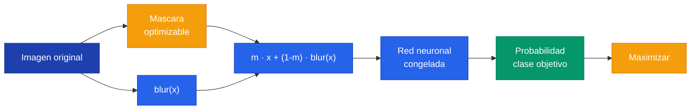

# Laboratorios Section Implementation Plan

> **For Claude:** REQUIRED SUB-SKILL: Use superpowers:executing-plans to implement this plan task-by-task.

**Goal:** Create a standalone `/laboratorios/` section in the Hugo site with in-depth lab content for Lab 09 (7 pages), and add a link card from clase-09.

**Architecture:** New top-level Hugo content section `site/content/laboratorios/` with one sub-folder per lab. Lab 09 gets 7 pages: index + 6 sub-pages. Same style as existing `teoria.md` pages.

**Tech Stack:** Hugo (Hextra theme), Markdown, shortcodes: ``, ``, ``, ``, mermaid diagrams.

**Style rules (derived from existing pages):**
- Spanish sin tildes: "funcion", "parametros", "informacion"
- Frontmatter: `title`, `weight`, `math: true`
- Secciones `## N. Titulo` separadas por `---`, subsecciones `###`
- `` para conceptos clave (2-4 frases)
- Mermaid con paleta Tailwind: input=#1e40af, conv=#2563eb/#3b82f6, output=#059669, act=#f59e0b
- Bold para terminos clave en primera mencion
- Citas de papers: `> Paper: Autor (Año). *Titulo.*`
- **NO usar tabs PyTorch/TensorFlow/JAX** — este lab es 100% PyTorch-specific (lucent y torchray no tienen equivalente). Codigo en bloques `python` normales.

**Source material:**
- Notebook: `clase_09/material/Laboratorio/Laboratorio Clase 9.ipynb`
- Analisis: `clase_09/analisis_laboratorio9.md`

---

### Task 1: Create laboratorios index and lab-09 landing

**Files:**
- Create: `site/content/laboratorios/_index.md`
- Create: `site/content/laboratorios/lab-09/_index.md`

**Step 1: Create `site/content/laboratorios/_index.md`**

```markdown
---
title: "Laboratorios"
weight: 60
sidebar:
  open: true
---

Exploracion en profundidad de los laboratorios del diplomado: librerias, conceptos, codigo paso a paso y ejercicios.


  

```

**Step 2: Create `site/content/laboratorios/lab-09/_index.md`**

```markdown
---
title: "Lab 09 - Visualizacion e Interpretabilidad en CNNs"
weight: 10
sidebar:
  open: true
---

**Clase:** Clase 09 — CNNs en Profundidad
**Profesor:** Miguel Fadic
**Fecha:** 2026-04-07

Este laboratorio explora dos tecnicas para entender que aprende una red neuronal convolucional:

1. **Feature Visualization** — que inputs maximizan la respuesta de una capa o neurona
2. **Attribution** — que partes del input son responsables de la clasificacion


Al terminar este lab seras capaz de navegar las capas de cualquier arquitectura CNN, visualizar sus representaciones internas y usar Extremal Perturbation para auditar decisiones del modelo.



  
  
  
  
  
  

```

**Step 3: Verify Hugo can find the new section**

```bash
cd /Users/robertoaraneda/projects/personal/courses/ia-uc/site && hugo list all 2>&1 | grep laboratorio
```
Expected: lines showing the new pages.

**Step 4: Commit**

```bash
git add site/content/laboratorios/
git commit -m "feat: add laboratorios section with lab-09 landing"
```

---

### Task 2: Add lab link card to clase-09

**Files:**
- Modify: `site/content/clases/clase-09/_index.md`

**Step 1: Add lab card after existing cards**

In `site/content/clases/clase-09/_index.md`, add before the closing ``:
```markdown
  
```

**Step 2: Commit**

```bash
git add site/content/clases/clase-09/_index.md
git commit -m "feat: add lab-09 link card to clase-09"
```

---

### Task 3: Create librerias.md

**Files:**
- Create: `site/content/laboratorios/lab-09/librerias.md`

**Content — section by section:**

Frontmatter: `title: "Librerias del Laboratorio"`, `weight: 10`, `math: true`

**## 1. Vision General**
- Tabla resumen de las 5 librerias con: nombre, proposito, origen
- torch, torchvision, torch-lucent, torchray, PIL/matplotlib

**## 2. PyTorch y torchvision**
- `torch`: framework base (tensores, autograd, GPU)
- `torchvision.models`: coleccion de arquitecturas pre-entrenadas
- `weights="IMAGENET1K_V1"` descarga pesos entrenados en ImageNet
- `.to(device).eval()` — por que `.eval()` es critico (batch norm usa estadisticas de batch en train mode, pero con una sola imagen de optimizacion produce resultados incorrectos)
- Code block: cargar los 4 modelos

```python
import torch
import torchvision.models as models

device = torch.device("cuda:0" if torch.cuda.is_available() else "cpu")

alexnet = models.alexnet(weights="IMAGENET1K_V1").to(device).eval()
vgg19 = models.vgg19(weights="IMAGENET1K_V1").to(device).eval()
googlenet = models.googlenet(weights="IMAGENET1K_V1").to(device).eval()
resnet50 = models.resnet50(weights="IMAGENET1K_V1").to(device).eval()
```

 sobre `.eval()` y batch norm.

**## 3. torch-lucent**
- Origen: port PyTorch de **Lucid** (Distill/Google Brain, TensorFlow)
- Que implementa: algoritmo de optimizacion de input con regularizacion (decorrelated space, transformation robustness)
- Imports con explicacion de cada modulo:

```python
from lucent.optvis import render, param, transform, objectives
from lucent.modelzoo.util import get_model_layers
```

- `render`: funcion principal `render_vis()` para generar visualizaciones
- `param`: parametrizacion del input (espacio decorrelacionado)
- `transform`: transformaciones de robustez (jitter, rotate, scale)
- `objectives`: objetivos de optimizacion (canal, capa, label)
- `get_model_layers`: lista nombres de capas accesibles

**## 4. torchray**
- Origen: Facebook Research
- Paper citado: `> Paper: Fong et al. (2019). *Understanding Deep Networks via Extremal Perturbations and Smooth Masks.*`
- Que implementa: metodos de attribution, nosotros usamos extremal perturbation
- Imports:

```python
from torchray.attribution.extremal_perturbation import extremal_perturbation
from torchray.benchmark import get_example_data, plot_example
```

**## 5. PIL y matplotlib**
- PIL: abrir/manipular imagenes. Fix para Colab:

```python
from PIL import ImageShow
ImageShow._viewers = [ImageShow.IPythonViewer()]
```

- matplotlib: solo para grillas de visualizacion (`plt.figure`, `gridspec`, `imshow`)

**## 6. Normalizacion de ImageNet**
- Concepto: restar media y dividir por desviacion estandar del dataset
- Valores estandar:

```python
mean = [0.485, 0.456, 0.406]
std = [0.229, 0.224, 0.225]
```

- `lucent` aplica esta normalizacion por defecto (`preprocess=True`)
- Si el modelo NO fue entrenado con datos normalizados, usar `preprocess=False`
- Funcion `desnormalizar()` para volver de tensor normalizado a imagen visible

```python
def desnormalizar(tensor, mean=[0.485, 0.456, 0.406], std=[0.229, 0.224, 0.225]):
    for t, m, s in zip(tensor, mean, std):
        t.mul_(s).add_(m)
    return tensor
```

**Step 1: Write the file with all content above**

**Step 2: Commit**

```bash
git add site/content/laboratorios/lab-09/librerias.md
git commit -m "feat: add librerias page for lab-09"
```

---

### Task 4: Create capas.md

**Files:**
- Create: `site/content/laboratorios/lab-09/capas.md`

**Content — section by section:**

Frontmatter: `title: "Acceso a Capas de CNNs en PyTorch"`, `weight: 20`, `math: true`

**## 1. El Problema**
- Los nombres internos de PyTorch no coinciden con los nombres "populares" de la literatura
- `features_12` NO es la capa 12 — es el elemento 13 (indice 12) del `nn.Sequential` llamado `features`
- : "indice en nn.Sequential ≠ numero de capa convolucional"

**## 2. Como PyTorch Nombra las Capas**
- `nn.Sequential` sin nombres: asigna `atributo_indice` automaticamente
- Code block mostrando el constructor de AlexNet y la correspondencia:

```python
self.features = nn.Sequential(
    nn.Conv2d(3, 64, ...),   # features_0
    nn.ReLU(inplace=True),   # features_1  <- esta es la "capa 1 conv" post-activacion
    nn.MaxPool2d(...),        # features_2
    ...
)
```

- `get_model_layers(model)` — retorna lista de strings con nombres accesibles

```python
from lucent.modelzoo.util import get_model_layers
get_model_layers(alexnet)
# ['features_0', 'features_1', ..., 'features_12', 'classifier_1', ...]
```

**## 3. AlexNet**
- Diagrama mermaid de la arquitectura (5 conv + 3 FC)
- Tabla completa (14 filas): `features_X` → operacion → dimensiones de salida
- Destacar las 5 capas conv activadas: `features_1`, `features_4`, `features_7`, `features_9`, `features_11`

| Nombre lucent | Operacion | Salida |
|---|---|---|
| features_0 | Conv2d(3, 64, 11, stride=4, pad=2) | 55x55x64 |
| features_1 | ReLU | 55x55x64 |
| features_2 | MaxPool2d(3, stride=2) | 27x27x64 |
| ... | ... | ... |

**## 4. VGG19**
- Tabla mapeando `features_X` a nombre popular (`conv1_1`, `conv1_2`, etc.)
- 16 capas conv + 3 FC
- Code block: `vgg19.features` para ver la estructura

| Capa | Nombre popular | features_X |
|---|---|---|
| 1 | conv1_1 | features_1 |
| 2 | conv1_2 | features_3 |
| ... | ... | ... |

**## 5. GoogLeNet (Inception v1)**
- Estructura: 2 conv iniciales + 9 modulos inception
- Nombres legibles: `conv1`, `conv2`, `inception3a`, ..., `inception5b`
- **Sub-capas de cada modulo inception**: `_1x1`, `_3x3`, `_5x5`, `_pool_proj`
- Code block: `get_model_layers(googlenet)[:20]`

**## 6. ResNet50**
- Estructura: conv1 + 4 layer groups + avgpool + fc
- Cada layer group tiene N bloques bottleneck (3, 4, 6, 3)
- Recomendacion: trabajar a nivel de grupos (`layer1`, `layer2`, `layer3`, `layer4`)
- Code block: `get_model_layers(resnet50)[:20]`

**## 7. Sintaxis de Direccionamiento**
- Formato: `'nombre_capa:numero_canal'`
- Ejemplos:

```python
render.render_vis(alexnet, 'features_11:9')   # canal 9 de la 5ta conv de AlexNet
render.render_vis(alexnet, 'labels:162')       # imagen que maximiza la clase 162 (beagle)
render.render_vis(googlenet, 'inception4b:3')  # canal 3 del modulo inception4b
```

- `'labels:indice'` para visualizar la clase completa (1000 clases de ImageNet, indice 0-999)

**Step 1: Write the file**

**Step 2: Commit**

```bash
git add site/content/laboratorios/lab-09/capas.md
git commit -m "feat: add capas page for lab-09"
```

---

### Task 5: Create feature-viz.md

**Files:**
- Create: `site/content/laboratorios/lab-09/feature-viz.md`

**Content — section by section:**

Frontmatter: `title: "Feature Visualization"`, `weight: 30`, `math: true`

**## 1. Que es Feature Visualization**
- Definicion: tecnica para visualizar que inputs maximizan la respuesta de un componente de una red neuronal
- Componentes posibles: neurona individual, canal (mapa de activacion), capa completa, clase de salida
- : "En entrenamiento normal se optimizan los PESOS. En feature visualization se congelan los pesos y se optimiza la IMAGEN."

**## 2. El Algoritmo: Gradient Ascent sobre el Input**
- Contraste con gradient descent:

```text
Entrenamiento normal (gradient descent):
  Input FIJO → Red → Loss → Actualizar PESOS

Feature Visualization (gradient ascent):
  Input VARIABLE → Red CONGELADA → Activacion objetivo → Actualizar IMAGEN
```

- Formula matematica:

$$x^* = \arg\max_x \; a_l(x) - \lambda \cdot R(x)$$

Donde $a_l(x)$ es la activacion del componente objetivo y $R(x)$ es un termino de regularizacion.

- Diagrama mermaid del flujo: imagen ruido → forward → activacion capa → backward → gradiente sobre imagen → actualizar imagen → repetir


- Regularizacion: sin ella, la imagen optimizada es ruido de alta frecuencia. `lucent` aplica:
  - **Decorrelated space**: optimizar en espacio de frecuencias, no pixeles
  - **Transformation robustness**: aplicar jitter/rotacion/escala durante optimizacion

**## 3. render_vis en la Practica**
- Funcion principal y parametros:

```python
render.render_vis(
    model,                    # modelo en .eval()
    'features_11:9',          # objetivo: capa:canal
    show_image=True,          # desplegar imagen
    preprocess=True,          # normalizar con media/std de ImageNet
    thresholds=(512,),        # pasos de optimizacion
)
```

- Ejemplo basico: canal 9 de la capa 5 de AlexNet
- Ejemplo de clase: `'labels:162'` (beagle)

**## 4. Channel Visualization**
- Que es: visualizar multiples canales de una capa para ver que patrones detecta
- Funcion helper `get_images()`:

```python
def get_images(model, layers, rows, cols, preprocess=True, transforms=None):
    fig = plt.figure(figsize=(4*len(layers)*cols, 4*rows))
    outer_grid = fig.add_gridspec(1, len(layers))
    for layer_index, layer in enumerate(layers):
        inner_grid = outer_grid[0, layer_index].subgridspec(rows, cols, wspace=0, hspace=0)
        axs = inner_grid.subplots()
        for i in range(rows):
            for j in range(cols):
                image = render.render_vis(model, f'{layer}:{i*cols+j}',
                                          preprocess=preprocess, transforms=transforms,
                                          show_image=False)[0][0]
                axs[i][j].imshow(image)
                axs[i][j].axis('off')
```

- Configuracion por arquitectura:

```python
layers = {
    alexnet: ['features_1', 'features_7', 'features_11'],
    vgg19: ['features_1', 'features_17', 'features_35'],
    googlenet: ['conv1', 'inception4b', 'inception5b'],
    resnet50: ['relu', 'layer2', 'layer4']
}
```

**## 5. Aprendizaje Jerarquico Composicional**
- : las CNNs profundas aprenden de forma jerarquica: primeras capas = bordes/colores, capas medias = texturas/patrones, capas profundas = partes de objetos/conceptos.
- Tabla:

| Profundidad | Que aprende | Ejemplo |
|---|---|---|
| Primera capa | Bordes, gradientes de color | Lineas horizontales, verticales, diagonales |
| Capas medias | Texturas, patrones repetitivos | Cuadriculas, circulos, pelaje |
| Ultima capa | Partes de objetos, conceptos | Ojos, patas, ruedas |

- Observacion: primera capa es similar en TODAS las arquitecturas. Ultima capa varia mucho. AlexNet (menos profunda) tiene features finales mucho menos complejos que ResNet.

**## 6. Label Visualization**
- Formato: `'labels:indice'` (indice 0-999 de ImageNet)
- Ejemplo: clase 8 (gallina/hen) en las 4 arquitecturas

```python
_ = render.render_vis(alexnet, 'labels:8', show_image=True)
_ = render.render_vis(vgg19, 'labels:8', show_image=True)
_ = render.render_vis(googlenet, 'labels:8', show_image=True)
_ = render.render_vis(resnet50, 'labels:8', show_image=True)
```

- Observacion: las 4 arquitecturas generan imagenes con rasgos claramente asociados a gallinas (crestas, plumas, colores). Todas aprendieron a reconocer gallinas por su aspecto visual, no por atajos.

**Step 1: Write the file**

**Step 2: Commit**

```bash
git add site/content/laboratorios/lab-09/feature-viz.md
git commit -m "feat: add feature-viz page for lab-09"
```

---

### Task 6: Create flores-overfitting.md

**Files:**
- Create: `site/content/laboratorios/lab-09/flores-overfitting.md`

**Content — section by section:**

Frontmatter: `title: "Flores, Overfitting y Fine-tuning"`, `weight: 35`, `math: true`

**## 1. Contexto**
- Hasta ahora visualizamos modelos pre-entrenados en ImageNet. Ahora aplicamos las mismas tecnicas sobre modelos entrenados por nosotros.
- Dataset: Oxford 102 Flowers (102 clases de flores)

**## 2. MiAlexNet: Modelo Entrenado desde Cero**
- Arquitectura completa (5 conv + 3 FC, 102 clases de salida):

```python
class MiAlexNet(nn.Module):
    def __init__(self):
        super(MiAlexNet, self).__init__()
        self.conv1 = nn.Sequential(
            nn.Conv2d(in_channels=3, out_channels=64, kernel_size=11, stride=4, padding=2),
            nn.ReLU(inplace=True),
            nn.MaxPool2d(kernel_size=3, stride=2))
        self.conv2 = nn.Sequential(
            nn.Conv2d(64, 192, 5, padding=2),
            nn.ReLU(inplace=True),
            nn.MaxPool2d(3, stride=2))
        self.conv3 = nn.Sequential(
            nn.Conv2d(192, 384, 3, padding=1),
            nn.ReLU(inplace=True))
        self.conv4 = nn.Sequential(
            nn.Conv2d(384, 256, 3, padding=1),
            nn.ReLU(inplace=True))
        self.conv5 = nn.Sequential(
            nn.Conv2d(256, 256, 3, padding=1),
            nn.ReLU(inplace=True),
            nn.MaxPool2d(3, stride=2))
        self.fc1 = nn.Sequential(nn.Linear(256 * 6 * 6, 4096), nn.ReLU(inplace=True))
        self.fc2 = nn.Sequential(nn.Linear(4096, 4096), nn.ReLU(inplace=True))
        self.fc3 = nn.Linear(4096, 102)
```

- Carga de pesos y evaluacion:

```python
base_alexnet = MiAlexNet()
weights = torch.load("base_alexnet.pth")
base_alexnet.load_state_dict(weights)
base_alexnet = base_alexnet.to(device).eval()
```

- Resultados: **98.17% train, 80.2% test** (gap de 18pp)
- : esta diferencia se llama **overfitting** — el modelo memorizo los datos de entrenamiento en vez de aprender patrones generalizables.

**## 3. Flowers Dataset**
- Clase custom para cargar el dataset:

```python
class Flowers(torch.utils.data.Dataset):
    def __init__(self, root, transform=None):
        self.root = root
        self.transform = transform
        self.imagenes = []
        self.imgs_to_class = []
        self.imagenes, self.imgs_to_class = self.armar_indices(root)

    def armar_indices(self, root):
        lista_imagenes, imgs_to_class = [], []
        for clase in sorted(listdir(root)):
            directorio = join(root, clase)
            for img in sorted(listdir(directorio)):
                lista_imagenes.append(join(directorio, img))
                imgs_to_class.append(int(clase))
        return lista_imagenes, imgs_to_class
```

- Transforms sin normalizacion (modelo entrenado sin normalizar):

```python
transforms = Compose([Resize((224, 224)), ToTensor()])
```

**## 4. Feature Visualization del Modelo Base**
- `get_model_layers(base_alexnet)` → capas: `conv1`, `conv3`, `conv5`, `labels`
- Usar `preprocess=False` porque el modelo no fue entrenado con datos normalizados

```python
get_images(base_alexnet, ['conv1', 'conv3', 'conv5', 'labels'], 3, 3, preprocess=False)
```

- Observaciones:
  - Muchas imagenes grises = no hubo activacion significativa (filtros sobrantes)
  - Imagenes de clases (labels) no tienen forma de flor definida
  - Hipotesis: el modelo sufre overfitting, aprendio correlaciones del dataset, no la forma de las flores

**## 5. Fine-tuning desde ImageNet**
- Concepto: partir de pesos entrenados en otro dataset (ImageNet) en vez de desde cero
- Diferencia Transfer Learning vs Fine-tuning vs Feature Extraction:

| Estrategia | Que se entrena | Cuando usarla |
|---|---|---|
| **Transfer Learning** | Termino general para reutilizar conocimiento | — |
| **Fine-tuning** | Todas las capas (o algunas) con learning rate bajo | Datos similares al dataset original |
| **Feature extraction** | Solo la ultima capa, resto congelado | Muy pocos datos |

- Modificar AlexNet para flores: reemplazar classifier

```python
finetuned_alexnet = models.alexnet()
finetuned_alexnet.classifier = nn.Sequential(
    nn.Dropout(),
    nn.Linear(256 * 6 * 6, 4096),
    nn.ReLU(inplace=True),
    nn.Dropout(),
    nn.Linear(4096, 4096),
    nn.ReLU(inplace=True),
    nn.Linear(4096, 102),
)
```

- Normalizacion ImageNet obligatoria para fine-tuning:

```python
mean = [0.485, 0.456, 0.406]
std = [0.229, 0.224, 0.225]
transforms = Compose([Resize((224, 224)), ToTensor(), Normalize(mean, std)])
```

- Resultados: **~100% train, 96% test** (gap de 4pp vs 18pp antes)
- : fine-tuning redujo el gap de overfitting de 18pp a 4pp. Las representaciones pre-aprendidas (bordes, texturas, formas) son transferibles y generalizan mejor.

**## 6. Comparacion Visual: Base vs Fine-tuned**
- 3 clases de flores: 53 (sunflower), 72 (water lily), 73 (rose)

```python
# Modelo base (sin normalizar)
_ = render.render_vis(base_alexnet, 'labels:53', show_image=True, preprocess=False)

# Modelo fine-tuned (con normalizacion)
_ = render.render_vis(finetuned_alexnet, 'labels:53', show_image=True)
```

- Modelo base: imagenes difusas, sin forma de flor
- Modelo fine-tuned: colores y texturas claramente asociados a cada tipo de flor
- **Conclusion**: si no se tienen suficientes datos, es recomendable entrenar a partir de un modelo preentrenado

**Step 1: Write the file**

**Step 2: Commit**

```bash
git add site/content/laboratorios/lab-09/flores-overfitting.md
git commit -m "feat: add flores-overfitting page for lab-09"
```

---

### Task 7: Create attribution.md

**Files:**
- Create: `site/content/laboratorios/lab-09/attribution.md`

**Content — section by section:**

Frontmatter: `title: "Attribution - Extremal Perturbation"`, `weight: 40`, `math: true`

**## 1. Que es Attribution**
- Definicion: determinar que elementos del input contribuyeron mas al valor del output
- Diferencia con Feature Visualization:

| Tecnica | Pregunta que responde | Input |
|---|---|---|
| Feature Visualization | Que patron maximiza una neurona? | Imagen sintetica (generada) |
| Attribution | Que parte de ESTA imagen causo la prediccion? | Imagen real (dada) |

**## 2. Extremal Perturbation**
- Cita: `> Paper: Fong et al. (2019). *Understanding Deep Networks via Extremal Perturbations and Smooth Masks.*`
- Idea: dada un area fija (ej: 12% de la imagen), encontrar la mascara optima que maximiza la respuesta de una clase
- Formula:

$$m^* = \arg\max_m \; \phi(m \odot x + (1-m) \odot \text{blur}(x))$$

sujeto a $\text{area}(m) = a$

Donde $m$ es la mascara, $x$ la imagen, $\phi$ la salida del modelo para la clase de interes, y $a$ el area fija.

- Diagrama mermaid del proceso:



- Parametros de la funcion:

| Parametro | Descripcion | Ejemplo |
|---|---|---|
| `model` | Modelo a analizar | `alexnet` |
| `x` | Tensor del input | `x.unsqueeze(0)` |
| `category_id` | Indice de la clase | `245` (French Bulldog) |
| `areas` | Lista de fracciones de area visible | `[0.05, 0.1, 0.2]` |
| `debug` | Mostrar proceso de optimizacion | `True` |

- Interpretacion de colores: rojo/calido = alta importancia, azul/frio = baja importancia
- Mascara centrada en objeto = features correctos aprendidos
- Mascara dispersa/en fondo = bias/atajos

**## 3. Ejemplo con ImageNet**
- Imagen con bulldog frances (245) y gato egipcio (285)
- Codigo:

```python
_, x, category_id_1, category_id_2 = get_example_data()

mask_1, _ = extremal_perturbation(
    alexnet, x, category_id_1,
    debug=True, areas=[0.12],
)
mask_2, _ = extremal_perturbation(
    alexnet, x, category_id_2,
    debug=True, areas=[0.05],
)
```

- Observacion: mascara para bulldog cubre al perro, mascara para gato cubre al gato. El modelo se fija en los elementos correctos.

**## 4. Attribution en Flowers: Base vs Fine-tuned**

### Set de train (ambos predicen bien)
- Mismo indice, comparar mascaras:
  - Modelo base: da importancia al FONDO de la imagen
  - Modelo fine-tuned: da importancia a la FLOR

```python
x = ds_train[index][0].to(device).unsqueeze(0)
label = ds_train[index][1]
base_mask, _ = extremal_perturbation(base_alexnet, x, label, debug=True, areas=[0.2])
```

- : a pesar de que ambos predicen correctamente, miran cosas diferentes. El modelo base aprende correlaciones espurias con el fondo.

### Set de test (base falla, fine-tuned acierta)
- Buscar imagen donde base falle y fine-tuned acierte:

```python
base_mistakes = get_wrong_indices(base_alexnet, test_dl)
finetuned_mistakes = get_wrong_indices(finetuned_alexnet, normalized_test_dl)

for index in base_mistakes:
    if index not in finetuned_mistakes:
        break
```

- Mascara del modelo base sobre la imagen: atencion en hojas del fondo, NO en la flor
- Mascara del fine-tuned: atencion centrada en la flor

### Diagnostico del error
- El modelo base predijo una clase equivocada. Usando attribution sobre la clase predicha (no la real), se ve que le dio importancia a hojas que no son parte de la flor.
- **Conclusion**: el modelo base formo correlaciones entre el fondo y el tipo de flor, no aprendio los atributos visuales de las flores.

**## 5. Conclusiones sobre Attribution**
- Tabla resumen de comportamiento:

| Escenario | Modelo base | Modelo fine-tuned |
|---|---|---|
| Train (acierta) | Mascara en fondo | Mascara en flor |
| Test (base falla) | Mascara dispersa/fondo | Mascara centrada en flor |

- Attribution es una herramienta de auditoria: permite entender POR QUE un modelo toma sus decisiones y detectar cuando aprende atajos incorrectos.

**Step 1: Write the file**

**Step 2: Commit**

```bash
git add site/content/laboratorios/lab-09/attribution.md
git commit -m "feat: add attribution page for lab-09"
```

---

### Task 8: Create ejercicios.md

**Files:**
- Create: `site/content/laboratorios/lab-09/ejercicios.md`

**Content — section by section:**

Frontmatter: `title: "Ejercicios y Glosario"`, `weight: 50`, `math: true`

**## 1. Ejercicios del Laboratorio**

### Ejercicio 1: Adaptar Arquitectura para Flowers
- Contexto: modificar VGG19, GoogLeNet o ResNet50 para 102 clases
- Codigo guia para las 3 opciones:

```python
# VGG19
model = models.vgg19()
model.classifier = nn.Sequential(
    nn.Linear(25088, 4096), nn.ReLU(inplace=True), nn.Dropout(),
    nn.Linear(4096, 4096), nn.ReLU(inplace=True), nn.Dropout(),
    nn.Linear(4096, 102),
)

# GoogLeNet
model = models.googlenet()
model.fc = nn.Linear(1024, 102)

# ResNet50
model = models.resnet50()
model.fc = nn.Linear(2048, 102)
```

### Ejercicio 2: Feature Hierarchy
- Visualizar 4 canales de la primera, una media y la ultima capa conv
- Recordar: `preprocess=False` si el modelo no fue entrenado con datos normalizados
- Que observar: aumento en complejidad de features a medida que la capa es mas profunda

### Ejercicio 3: Label Visualization de 3 Flores
- Escoger 3 clases (ej: 53=sunflower, 72=water lily, 73=rose)
- Generar imagenes con `render.render_vis(model, 'labels:X')`
- Que observar: tienen sentido las imagenes generadas? Se parecen a las flores reales?

### Ejercicio 4: Fine-tuning desde ImageNet
- Usar la version preentrenada (`weights="IMAGENET1K_V1"`)
- Congelar parametros base, entrenar 20+ epocas

```python
model = models.vgg19(weights="IMAGENET1K_V1")
for param in model.parameters():
    param.requires_grad = False
model.classifier = nn.Sequential(
    nn.Linear(25088, 4096), nn.ReLU(inplace=True), nn.Dropout(),
    nn.Linear(4096, 4096), nn.ReLU(inplace=True), nn.Dropout(),
    nn.Linear(4096, 102),
)
```

- Tabla de comparacion a llenar:

| Modelo | Parametros | Tiempo/epoca | Accuracy train | Accuracy test |
|---|---|---|---|---|

### Ejercicio 5: Comparacion Visual post Fine-tuning
- Repetir ejercicio 3 con el modelo fine-tuned
- Comparar las imagenes generadas: son mas claras? Mas especificas?

---

**## 2. Glosario del Laboratorio**

| Termino | Descripcion |
|---|---|
| `render.render_vis()` | Genera imagen que maximiza activacion de una capa/canal/clase |
| `get_model_layers()` | Lista nombres de capas accesibles de un modelo |
| `extremal_perturbation()` | Encuentra mascara optima que maximiza respuesta de una clase |
| `contrastive_reward` | Funcion de recompensa que maximiza clase objetivo y minimiza el resto |
| `areas` | Fraccion de la imagen visible a traves de la mascara (ej: 0.12 = 12%) |
| Decorrelated space | Optimizar imagen en espacio de frecuencias para resultados mas naturales |
| Transformation robustness | Aplicar jitter/rotacion/escala durante optimizacion para robustez |
| `.eval()` | Modo evaluacion: batch norm usa estadisticas globales, dropout desactivado |
| `preprocess` | Flag de lucent para aplicar (o no) normalizacion de ImageNet |

**Step 1: Write the file**

**Step 2: Commit**

```bash
git add site/content/laboratorios/lab-09/ejercicios.md
git commit -m "feat: add ejercicios page for lab-09"
```

---

### Task 9: Verify full build

**Step 1: Build Hugo site**

```bash
cd /Users/robertoaraneda/projects/personal/courses/ia-uc/site && hugo --minify 2>&1 | tail -20
```
Expected: `0 errors` in output.

**Step 2: Check all lab pages render**

```bash
cd /Users/robertoaraneda/projects/personal/courses/ia-uc/site && hugo list all 2>&1 | grep laboratorio
```
Expected: 8 lines (laboratorios index + lab-09 index + 6 sub-pages).

**Step 3: Visual verification**

```bash
cd /Users/robertoaraneda/projects/personal/courses/ia-uc/site && hugo server -D &
```
Check in browser: `/laboratorios/lab-09/` should show 6 cards. Each sub-page should render correctly with concept-alert, mermaid, math, code blocks.
