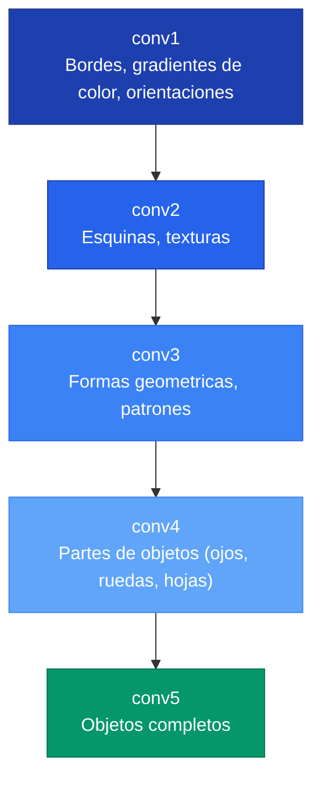
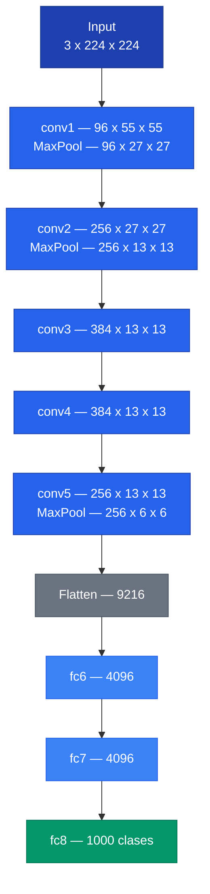
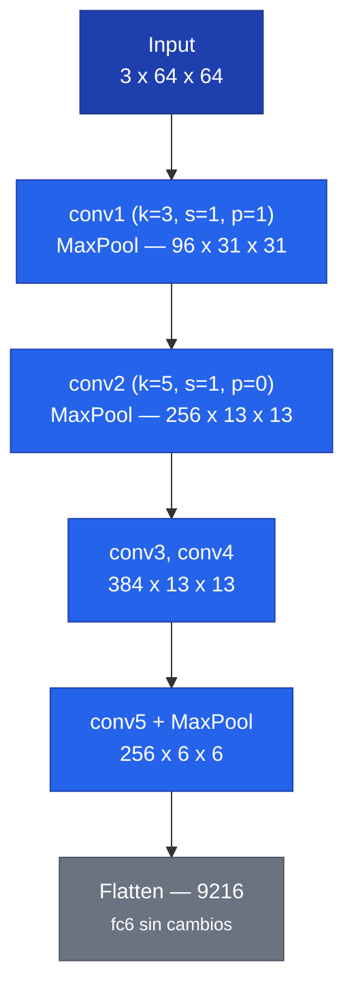

## 1. Que es una Red Convolucional (CNN)

Una red convolucional es una arquitectura de red neuronal disenada para procesar datos con estructura espacial (imagenes). A diferencia de una red densa (MLP), las CNNs explotan que los pixeles cercanos estan relacionados entre si, usando **filtros** que se deslizan sobre la imagen.

| Tipo de capa | Que hace |
|---|---|
| **Convolucion** | Aplica un filtro para detectar patrones locales (bordes, texturas, formas) |
| **Pooling** | Reduce el tamano espacial, concentrando la informacion mas relevante |
| **Fully Connected (FC)** | Combina todas las caracteristicas para producir una prediccion |

---

## 2. Como funciona una Convolucion por dentro

Un filtro es una pequena matriz de numeros (pesos). Se **desliza** sobre la imagen y en cada posicion hace un **producto punto** entre el filtro y el parche de imagen que cubre.

```text
Imagen (fragmento 3x3):    Filtro (3x3):         Producto punto:
+---+---+---+              +----+----+----+
| 1 | 2 | 3 |              |  0 | -1 |  0 |      1x0  + 2x(-1) + 3x0
+---+---+---+       x      +----+----+----+   =  4x(-1)+ 5x5   + 6x(-1)  = 5
| 4 | 5 | 6 |              | -1 |  5 | -1 |      7x0  + 8x(-1) + 9x0
+---+---+---+              +----+----+----+
| 7 | 8 | 9 |              |  0 | -1 |  0 |
+---+---+---+              +----+----+----+
```

La red **aprende los valores del filtro** durante el entrenamiento.

---

## 3. Filtro Laplaciano

El Laplaciano es un ejemplo clasico de filtro detector de bordes. Compara cada pixel con sus vecinos: si son similares (zona uniforme), el resultado es cercano a 0. Si el pixel central es muy distinto (borde), el resultado es alto.

```text
Filtro Laplaciano:
+----+----+----+
|  0 | -1 |  0 |
+----+----+----+
| -1 |  4 | -1 |
+----+----+----+
|  0 | -1 |  0 |
+----+----+----+
```

La red no usa el Laplaciano explicitamente, pero los filtros que aprende en conv1 terminan siendo matematicamente similares.

---

## 4. Invarianza a Traslaciones


**MaxPool** proporciona invarianza a pequenos desplazamientos: aunque la activacion se mueva un pixel, el maximo de la ventana sigue siendo el mismo. Esto permite que la red reconozca objetos independientemente de su posicion exacta.


```text
Activacion en (2,2):        Imagen movida, activacion en (2,3):
+---+---+---+---+           +---+---+---+---+
| 0 | 0 | 0 | 0 |           | 0 | 0 | 0 | 0 |
| 0 | 0 | 0 | 0 |           | 0 | 0 | 0 | 0 |
| 0 | 9 | 0 | 0 |           | 0 | 0 | 9 | 0 |
| 0 | 0 | 0 | 0 |           | 0 | 0 | 0 | 0 |

MaxPool 2x2: max = 9        MaxPool 2x2: max = 9  (mismo resultado)
```

---

## 5. Jerarquia de Caracteristicas

Cada capa ve la salida de la anterior, no los pixeles originales. Esto produce una jerarquia emergente:



Esta jerarquia no esta impuesta: emerge porque es la estrategia mas eficiente para reducir el error de clasificacion.

---

## 6. Formulas clave

### Dimension de salida de una capa convolucional o de pooling

$$O = \left\lfloor \frac{I - K + 2P}{S} \right\rfloor + 1$$

Donde:
- $I$ = tamano de entrada
- $K$ = tamano del kernel
- $P$ = padding
- $S$ = stride

### Cantidad de parametros de una capa Conv2d

$$\text{params} = C_{out} \times (C_{in} \times K_H \times K_W + 1)$$

### Cantidad de parametros de una capa Linear

$$\text{params} = \text{out\_features} \times (\text{in\_features} + 1)$$

---

## 7. Arquitectura Original de AlexNet

AlexNet (2012) clasificaba imagenes del dataset **ImageNet** (1000 categorias) con entradas de 3 x 224 x 224 (RGB).

### Diagrama de flujo de datos



### Capa a capa

| Capa | Configuracion | Salida | Parametros | Detecta |
|------|--------------|--------|-----------|---------|
| conv1 | 96 filtros 11x11, stride=4 | 96 x 27 x 27 | 34,944 | Bordes, colores basicos |
| conv2 | 256 filtros 5x5 | 256 x 13 x 13 | 614,656 | Texturas, esquinas |
| conv3 | 384 filtros 3x3 | 384 x 13 x 13 | 885,120 | Formas complejas |
| conv4 | 384 filtros 3x3 | 384 x 13 x 13 | 1,327,488 | Partes de objetos |
| conv5 | 256 filtros 3x3 | 256 x 6 x 6 | 884,992 | Objetos completos |
| fc6 | Linear(9216, 4096) | 4096 | 37,752,832 | - |
| fc7 | Linear(4096, 4096) | 4096 | 16,781,312 | - |
| fc8 | Linear(4096, 1000) | 1000 | 4,097,000 | Clasificacion |
| **Total** | | | **62,378,344** | |

> Las capas FC concentran ~95% de los parametros, aunque son solo 3 capas.

---

## 8. Actividad 1 — Adaptar para 102 clases

Para un dataset de 102 clases (ej. Oxford Flowers), solo la **ultima capa** `fc8` necesita cambiar:

| Capa | Original | Modificado |
|------|----------|-----------|
| fc8 | `Linear(4096, 1000)` | `Linear(4096, 102)` |

```python
class MiAlexNet(nn.Module):
    def __init__(self):
        super(MiAlexNet, self).__init__()
        self.conv1 = nn.Sequential(
            nn.Conv2d(3, 96, kernel_size=(11,11), stride=(4,4), padding=(2,2)),
            nn.MaxPool2d(kernel_size=(3,3), stride=(2,2)),
            nn.ReLU()
        )
        # ... conv2-conv5 sin cambios ...
        self.fc8 = nn.Sequential(nn.Linear(4096, 102))  # CAMBIO: 1000 -> 102
```

---

## 9. Actividad 2 — Adaptar para imagenes 64 x 64


Con imagenes de 64x64, el kernel=11 y stride=4 de conv1 son demasiado agresivos. Las dimensiones colapsan antes de llegar a fc6. La solucion es modificar conv1 y conv2 para preservar las dimensiones espaciales hasta llegar a 6x6 antes del flatten.


### Cambios necesarios

| Capa | Original | Modificado | Razon |
|------|----------|-----------|-------|
| conv1 kernel | (11,11) | **(3,3)** | Adecuado para imagen pequena |
| conv1 stride | (4,4) | **(1,1)** | Evita colapso espacial |
| conv1 padding | (2,2) | **(1,1)** | Mantiene salida 64x64 |
| conv2 padding | (2,2) | **(0,0)** | Reduce 31 a 27 para llegar a 13 tras MaxPool |

### Nuevo flujo de dimensiones


