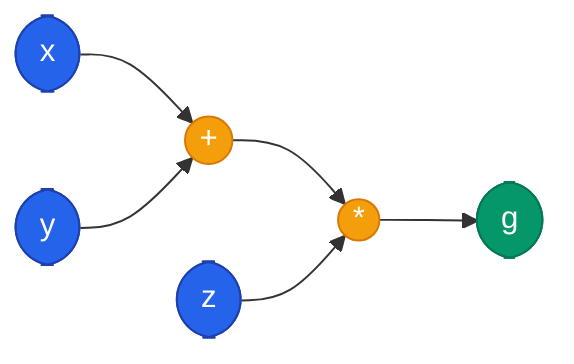

## 1. Algoritmo de Aprendizaje y Grafos de Computo

### 1.1 Pasos de Entrenamiento

El entrenamiento de una red neuronal consta de 3 pasos fundamentales que se repiten ciclicamente:

1. **Forward (Propagacion hacia adelante):** Los datos de entrada pasan a traves del modelo, que genera una prediccion.
2. **Backward (Retropropagacion):** Se compara la prediccion con la etiqueta real mediante una funcion de perdida, y se propaga el error hacia atras para calcular los gradientes.
3. **Weights Update (Actualizacion de pesos):** Los pesos del modelo se actualizan segun el error cometido.

### 1.2 Descenso del Gradiente (Regla Delta)


\Delta w = -\eta \cdot \frac{\partial E(w)}{\partial w}, \quad w \leftarrow w + \Delta w


Donde:
- $E(w)$ es la funcion de error (loss)
- $\eta$ es el **learning rate**
- $\frac{\partial E(w)}{\partial w}$ es el gradiente del error respecto a los pesos

### 1.3 Entrenamiento de un Perceptron

Para un perceptron simple con funcion de activacion $f$:

$$\hat{y} = f\left(\sum_i w_i x_i + w_0\right)$$

La funcion de error (MSE) es:

$$E(w) = \frac{1}{2}(y - \hat{y})^2$$

El gradiente del error respecto a cada peso:

$$\frac{\partial E(w)}{\partial w_i} = (y - \hat{y}) \cdot f'(z) \cdot x_i$$

### 1.4 Perceptron Multicapa (MLP)

- Los MLPs combinan multiples perceptrones en varias capas (Deep Feed Forward Networks)
- Pueden aproximar cualquier funcion matematica (Teorema de Aproximacion Universal)
- El algoritmo de **Backpropagation** resuelve el problema de entrenar capas ocultas aplicando la **Regla de la Cadena** de forma recursiva

### 1.5 Grafos de Computo

Los grafos de computo son representaciones que permiten expresar y evaluar funciones matematicas. Consisten en grafos dirigidos donde los **nodos** son operaciones matematicas y las **aristas** representan el flujo de variables.



Los frameworks (TensorFlow, PyTorch) los utilizan para implementar backpropagation de forma automatica.

---

## 2. Funciones de Activacion

### 2.1 Funcion Sigmoide

$$\sigma(x) = \frac{1}{1 + e^{-x}}$$

**Derivada:** $\sigma'(x) = \sigma(x)(1 - \sigma(x))$

**Problemas:**
- Neuronas saturadas tienen gradiente cercano a cero (**vanishing gradient**)
- La salida no esta centrada en cero (produce zig-zag en la convergencia)

### 2.2 Tangente Hiperbolica (Tanh)

$$\tanh(x) = \frac{e^x - e^{-x}}{e^x + e^{-x}} = 2\sigma(2x) - 1$$

- Centrada en cero (mejora sobre Sigmoide)
- Aun sufre de vanishing gradient en saturacion

### 2.3 ReLU (Rectified Linear Unit)

$$\text{ReLU}(x) = \max(0, x)$$


ReLU converge mucho mas rapido que Sigmoide (hasta 6x segun Krizhevsky et al., 2012) porque su gradiente en la zona positiva es constante (= 1), mientras que el gradiente de Sigmoide es como maximo 0.25.


**Problema:** Se satura para entradas negativas (gradiente = 0, la neurona "muere").

### 2.4 Leaky ReLU / PReLU

$$\text{PReLU}(x) = \max(\alpha x, x)$$

Donde $\alpha$ es un parametro pequeno (ej. 0.01). Las neuronas nunca dejan de aprender.

### 2.5 Softmax

$$\text{softmax}(z_i) = \frac{e^{z_i}}{\sum_j e^{z_j}}$$

Convierte salidas en probabilidades que suman 1. Usada en capas de salida para clasificacion multiclase.

### 2.6 Tabla Comparativa

| Funcion | Rango | Centrada en 0 | Vanishing Gradient | Uso tipico |
|---------|-------|---------------|-------------------|------------|
| Sigmoide | (0, 1) | No | Si | Salida binaria |
| Tanh | (-1, 1) | Si | Si | Capas ocultas (RNN) |
| ReLU | [0, +inf) | No | Solo negativos | Capas ocultas (CNN) |
| Leaky ReLU | (-inf, +inf) | No | No | Capas ocultas |
| Softmax | (0, 1) | N/A | N/A | Capa salida (multiclase) |

### 2.7 Ejemplo: Comparacion de Funciones de Activacion



```python
import torch
import torch.nn.functional as F

# Crear tensor de entrada
x = torch.linspace(-5, 5, 100)

# Aplicar funciones de activacion
y_sigmoid = torch.sigmoid(x)
y_tanh = torch.tanh(x)
y_relu = F.relu(x)
y_leaky = F.leaky_relu(x, negative_slope=0.01)

# Verificar rangos de salida
print(f"Sigmoid: min={y_sigmoid.min():.4f}, max={y_sigmoid.max():.4f}")
print(f"Tanh:    min={y_tanh.min():.4f}, max={y_tanh.max():.4f}")
print(f"ReLU:    min={y_relu.min():.4f}, max={y_relu.max():.4f}")
print(f"Leaky:   min={y_leaky.min():.4f}, max={y_leaky.max():.4f}")

# Calcular gradientes para comparar
x_grad = torch.tensor([0.0, 2.0, -2.0], requires_grad=True)
salida = torch.sigmoid(x_grad).sum()
salida.backward()
print(f"Gradientes Sigmoid en [0, 2, -2]: {x_grad.grad}")
```


```python
import tensorflow as tf

# Crear tensor de entrada
x = tf.linspace(-5.0, 5.0, 100)

# Aplicar funciones de activacion
y_sigmoid = tf.nn.sigmoid(x)
y_tanh = tf.nn.tanh(x)
y_relu = tf.nn.relu(x)
y_leaky = tf.nn.leaky_relu(x, alpha=0.01)

# Verificar rangos de salida
print(f"Sigmoid: min={tf.reduce_min(y_sigmoid):.4f}, max={tf.reduce_max(y_sigmoid):.4f}")
print(f"Tanh:    min={tf.reduce_min(y_tanh):.4f}, max={tf.reduce_max(y_tanh):.4f}")
print(f"ReLU:    min={tf.reduce_min(y_relu):.4f}, max={tf.reduce_max(y_relu):.4f}")
print(f"Leaky:   min={tf.reduce_min(y_leaky):.4f}, max={tf.reduce_max(y_leaky):.4f}")

# Calcular gradientes para comparar
x_grad = tf.Variable([0.0, 2.0, -2.0])
with tf.GradientTape() as tape:
    salida = tf.reduce_sum(tf.nn.sigmoid(x_grad))
grad = tape.gradient(salida, x_grad)
print(f"Gradientes Sigmoid en [0, 2, -2]: {grad.numpy()}")
```


```python
import jax
import jax.numpy as jnp
from jax import grad

# Crear arreglo de entrada
x = jnp.linspace(-5, 5, 100)

# Aplicar funciones de activacion
y_sigmoid = jax.nn.sigmoid(x)
y_tanh = jnp.tanh(x)
y_relu = jax.nn.relu(x)
y_leaky = jax.nn.leaky_relu(x, negative_slope=0.01)

# Verificar rangos de salida
print(f"Sigmoid: min={y_sigmoid.min():.4f}, max={y_sigmoid.max():.4f}")
print(f"Tanh:    min={y_tanh.min():.4f}, max={y_tanh.max():.4f}")
print(f"ReLU:    min={y_relu.min():.4f}, max={y_relu.max():.4f}")
print(f"Leaky:   min={y_leaky.min():.4f}, max={y_leaky.max():.4f}")

# Gradiente de sigmoid evaluado en puntos especificos
grad_sigmoid = grad(lambda x: jax.nn.sigmoid(x))
puntos = [0.0, 2.0, -2.0]
grads = [grad_sigmoid(jnp.float32(p)) for p in puntos]
print(f"Gradientes Sigmoid en {puntos}: {grads}")
```



---

## 3. Inicializacion de Pesos

### 3.1 El Problema

En redes profundas existen 4 problemas criticos:

**Forward:** Vanishing input signal (pesos < 1) y Exploding input signal (pesos > 1)

**Backward:** Vanishing gradient y Exploding gradient

Para una red de $L$ capas sin activacion:

$$y = W^{[L]} \cdot W^{[L-1]} \cdots W^{[1]} \cdot x$$

Si los pesos son < 1, $y \to 0$ cuando $L$ es grande. Si son > 1, $y \to \infty$.

### 3.2 Inicializacion de Xavier Glorot


Xavier Glorot inicializa los pesos desde una distribucion gaussiana con varianza $\text{Var}(W_i) = \frac{2}{\text{fan\_in} + \text{fan\_out}}$, donde fan_in es el numero de entradas y fan_out el numero de salidas de la capa. Esto mantiene la varianza estable a traves de las capas.


En PyTorch:

```python
torch.nn.init.xavier_uniform_(tensor, gain=1.0)
```

### 3.3 Ejemplo: Inicializacion Xavier en una Red



```python
import torch
import torch.nn as nn

# Definir red con 3 capas ocultas
modelo = nn.Sequential(
    nn.Linear(784, 256),
    nn.ReLU(),
    nn.Linear(256, 128),
    nn.ReLU(),
    nn.Linear(128, 10),
)

# Aplicar inicializacion Xavier a todas las capas lineales
def init_xavier(m):
    if isinstance(m, nn.Linear):
        nn.init.xavier_uniform_(m.weight)
        nn.init.zeros_(m.bias)

modelo.apply(init_xavier)

# Verificar varianza de los pesos por capa
for nombre, param in modelo.named_parameters():
    if "weight" in nombre:
        print(f"{nombre}: var={param.var():.4f}, media={param.mean():.4f}")
```


```python
import tensorflow as tf

# Definir red con inicializacion Xavier (Glorot es el valor por defecto)
modelo = tf.keras.Sequential([
    tf.keras.layers.Dense(256, activation="relu",
                          kernel_initializer="glorot_uniform",
                          input_shape=(784,)),
    tf.keras.layers.Dense(128, activation="relu",
                          kernel_initializer="glorot_uniform"),
    tf.keras.layers.Dense(10,
                          kernel_initializer="glorot_uniform"),
])

modelo.build()

# Verificar varianza de los pesos por capa
for capa in modelo.layers:
    w = capa.get_weights()[0]  # pesos (sin bias)
    print(f"{capa.name}: var={w.var():.4f}, media={w.mean():.4f}")
```


```python
import jax
import jax.numpy as jnp
from jax import random
from jax.nn.initializers import glorot_uniform

# Inicializar pesos con Xavier/Glorot para cada capa
key = random.PRNGKey(42)
capas = [(784, 256), (256, 128), (128, 10)]
params = []

for fan_in, fan_out in capas:
    key, subkey = random.split(key)
    # glorot_uniform devuelve una funcion inicializadora
    init_fn = glorot_uniform()
    w = init_fn(subkey, (fan_in, fan_out))
    b = jnp.zeros(fan_out)
    params.append((w, b))
    print(f"Capa ({fan_in},{fan_out}): var={w.var():.4f}, media={w.mean():.4f}")
```



---

## 4. Conceptos Clave de PyTorch

### 4.1 Tensores

| Dimensiones | Nombre | Ejemplo |
|-------------|--------|---------|
| 0 | Escalar | `5.0` |
| 1 | Vector | `[1, 2, 3]` |
| 2 | Matriz | `[[1, 2], [3, 4]]` |
| 3+ | Tensor | Imagen RGB: alto x ancho x 3 canales |

Los tensores de PyTorch tienen dos superpoderes: pueden ejecutarse en **GPU** y pueden rastrear operaciones para calcular **gradientes automaticamente**.

```python
# Tensor que rastrea gradientes
x = torch.tensor([2.0], requires_grad=True)
```

### 4.2 Optimizador Adam

Adam (Adaptive Moment Estimation) adapta el learning rate para cada peso individualmente combinando:

1. **Momentum:** Memoria de la direccion de actualizacion anterior
2. **Adaptativo:** Ajusta el paso segun la magnitud de los gradientes

$$w = w - \eta \cdot \text{gradiente}$$

```python
optimizer = optim.Adam(model.parameters(), lr=1e-4)
optimizer.zero_grad()     # Limpia gradientes
loss_value.backward()     # Calcula gradientes
optimizer.step()          # Actualiza pesos
```

### 4.3 Ejemplo: Loop de Entrenamiento con Adam



```python
import torch
import torch.nn as nn
import torch.optim as optim

# Datos sinteticos: clasificacion binaria
X = torch.randn(200, 4)
y = (X[:, 0] + X[:, 1] > 0).float().unsqueeze(1)

# Modelo simple con ReLU y Xavier
modelo = nn.Sequential(nn.Linear(4, 16), nn.ReLU(), nn.Linear(16, 1), nn.Sigmoid())
modelo.apply(lambda m: nn.init.xavier_uniform_(m.weight) if isinstance(m, nn.Linear) else None)

# Optimizador Adam y funcion de perdida
optimizador = optim.Adam(modelo.parameters(), lr=1e-3)
criterio = nn.BCELoss()

# Loop de entrenamiento
for epoca in range(100):
    pred = modelo(X)                  # Forward
    perdida = criterio(pred, y)       # Calcular perdida
    optimizador.zero_grad()           # Limpiar gradientes
    perdida.backward()                # Backward
    optimizador.step()                # Actualizar pesos
    if (epoca + 1) % 20 == 0:
        acc = ((pred > 0.5) == y).float().mean()
        print(f"Epoca {epoca+1}: perdida={perdida:.4f}, precision={acc:.4f}")
```


```python
import tensorflow as tf
import numpy as np

# Datos sinteticos: clasificacion binaria
X = np.random.randn(200, 4).astype("float32")
y = ((X[:, 0] + X[:, 1]) > 0).astype("float32").reshape(-1, 1)

# Modelo simple con ReLU y Xavier (Glorot por defecto)
modelo = tf.keras.Sequential([
    tf.keras.layers.Dense(16, activation="relu", input_shape=(4,)),
    tf.keras.layers.Dense(1, activation="sigmoid"),
])

# Compilar con Adam y binary crossentropy
modelo.compile(
    optimizer=tf.keras.optimizers.Adam(learning_rate=1e-3),
    loss="binary_crossentropy",
    metrics=["accuracy"],
)

# Entrenar el modelo
historial = modelo.fit(X, y, epochs=100, batch_size=32, verbose=0)

# Mostrar resultados cada 20 epocas
for i in range(19, 100, 20):
    print(f"Epoca {i+1}: perdida={historial.history['loss'][i]:.4f}, "
          f"precision={historial.history['accuracy'][i]:.4f}")
```


```python
import jax
import jax.numpy as jnp
from jax import random, grad, jit
import optax  # Libreria de optimizadores para JAX

# Datos sinteticos: clasificacion binaria
key = random.PRNGKey(0)
X = random.normal(key, (200, 4))
y = ((X[:, 0] + X[:, 1]) > 0).astype(jnp.float32).reshape(-1, 1)

# Inicializar pesos con Xavier
k1, k2 = random.split(key)
params = {
    "w1": jax.nn.initializers.glorot_uniform()(k1, (4, 16)),
    "b1": jnp.zeros(16),
    "w2": jax.nn.initializers.glorot_uniform()(k2, (16, 1)),
    "b2": jnp.zeros(1),
}

# Funcion forward y perdida
def predecir(params, x):
    h = jax.nn.relu(x @ params["w1"] + params["b1"])
    return jax.nn.sigmoid(h @ params["w2"] + params["b2"])

def perdida_fn(params, x, y):
    pred = predecir(params, x)
    return -jnp.mean(y * jnp.log(pred + 1e-7) + (1 - y) * jnp.log(1 - pred + 1e-7))

# Configurar optimizador Adam
optimizador = optax.adam(1e-3)
estado_opt = optimizador.init(params)

# Loop de entrenamiento con JIT para velocidad
@jit
def paso(params, estado_opt, x, y):
    grads = grad(perdida_fn)(params, x, y)
    updates, estado_opt = optimizador.update(grads, estado_opt)
    params = optax.apply_updates(params, updates)
    return params, estado_opt

for epoca in range(100):
    params, estado_opt = paso(params, estado_opt, X, y)
    if (epoca + 1) % 20 == 0:
        loss = perdida_fn(params, X, y)
        acc = jnp.mean((predecir(params, X) > 0.5) == y)
        print(f"Epoca {epoca+1}: perdida={loss:.4f}, precision={acc:.4f}")
```


