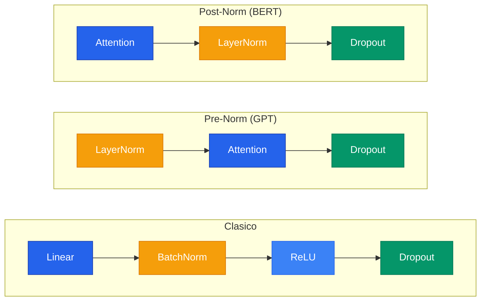

## 1. Normalizaciones: BatchNorm y LayerNorm

### 1.1 Que problema resuelven

En una red profunda, las activaciones de cada capa cambian de escala constantemente a medida que los pesos se actualizan. Esto se llama **Internal Covariate Shift**.

**La solucion**: despues de cada capa, normalizar las activaciones para que SIEMPRE tengan media aproximadamente 0 y varianza aproximadamente 1.

### 1.2 Que es normalizar (Z-score)


x_{\text{norm}} = \frac{x - \mu}{\sigma}


```text
Ejemplo:
  Valores: [2.0, 8.0, 4.0, 6.0]
  Media = 5.0, Std = 2.24
  Normalizado: [-1.34, +1.34, -0.45, +0.45]  (media=0, var=1)
```

### 1.3 Gamma y Beta: no perder expresividad

Despues de normalizar, la red aplica dos parametros **aprendibles**:

$$y = \gamma \cdot x_{\text{norm}} + \beta$$

- $\gamma$ (gamma) = escala, $\beta$ (beta) = centro
- Se inicializan en $\gamma=1$, $\beta=0$
- Si normalizar no ayuda, la red puede deshacerlo aprendiendo $\gamma = \sigma_{\text{original}}$, $\beta = \mu_{\text{original}}$

### 1.4 BatchNorm: normalizar por COLUMNA

Calcula media y varianza de cada **feature** a traves de todas las muestras del batch.

```text
         Feature 1   Feature 2   Feature 3
Muestra 1:   2.0        10.0        0.5
Muestra 2:   8.0        20.0        1.5
Muestra 3:   4.0        30.0        0.8
              |           |           |
         normaliza    normaliza    normaliza
         esta col.    esta col.    esta col.
```

**En inferencia** usa running mean/var acumuladas durante entrenamiento. Por eso `model.eval()` es critico.

### 1.5 LayerNorm: normalizar por FILA

Calcula media y varianza de cada **muestra** a traves de todos sus features.

- No depende del batch (funciona con batch=1)
- Comportamiento identico en entrenamiento e inferencia
- No tiene running stats


**BatchNorm** es ideal para imagenes (CNNs) y normaliza por canal/feature. **LayerNorm** es ideal para texto (Transformers) y normaliza por muestra. GPT usa LayerNorm porque en inferencia genera token por token (batch=1).


### 1.6 Cuando usar cual

| | BatchNorm | LayerNorm |
|---|---|---|
| **Ideal para** | Imagenes (CNNs) | Texto (Transformers) |
| **Normaliza** | Por canal/feature (columna) | Por muestra (fila) |
| **Depende del batch** | Si (batches grandes) | No (funciona con batch=1) |
| **train vs eval** | Distintos (running stats) | Iguales |
| **En PyTorch** | `nn.BatchNorm1d`, `nn.BatchNorm2d` | `nn.LayerNorm` |

### 1.7 Donde poner la normalizacion



> NUNCA en la ultima capa (queremos la prediccion sin normalizar).

---

## 2. Dropout: Regularizacion

### 2.1 Que es

En cada iteracion de entrenamiento, cada neurona tiene una probabilidad $p$ de ser "apagada" (su valor se pone en 0). Fuerza a que TODAS las neuronas aprendan a ser utiles.

### 2.2 Tipos de Dropout

```text
Dropout(p=0.5):    apaga NEURONAS individuales -> para capas lineales
Dropout2d(p=0.25): apaga CANALES completos     -> para capas convolucionales
```

### 2.3 Inverted Dropout

PyTorch usa inverted dropout: escala durante entrenamiento (divide por 1-p) para que en inferencia no haya que hacer nada.

```text
ENTRENAMIENTO (p=0.5):
  Valores:         [2.0, 4.0, 1.0, 3.0]
  Mascara:         [1,   0,   1,   0  ]
  Aplicar mascara: [2.0, 0.0, 1.0, 0.0]
  Dividir por 0.5: [4.0, 0.0, 2.0, 0.0]  <- escala AQUI

INFERENCIA:
  Valores:         [2.0, 4.0, 1.0, 3.0]  <- no hace NADA
```

---

## 3. Frameworks: PyTorch vs TensorFlow vs JAX

| | PyTorch | TensorFlow/Keras | JAX/Flax |
|---|---|---|---|
| **Estilo** | Orientado a objetos | Orientado a objetos | Funcional puro |
| **Train/Eval** | `model.train()`/`eval()` | `training=True/False` | `use_running_average` |
| **Quien lo usa** | Industria + academia | Industria (Google) | Investigacion (DeepMind) |

---

## 4. Tipos de datos de entrada

La red nunca ve fotos, palabras ni sonidos. **Solo ve arrays de numeros con distinta forma (shape).**

| Tipo | Shape | Preproceso |
|------|-------|-----------|
| Tabular (CSV) | (batch, features) | Ya son numeros |
| Imagenes | (batch, canales, alto, ancho) | Dividir por 255 |
| Texto | (batch, tokens, embedding_dim) | Tokenizar + Embedding |
| Audio | (batch, 1, frecuencias, tiempo) | Muestreo + Espectrograma |

---

## 5. Redes Convolucionales (CNN)

### Arquitectura CNN tipica

```mermaid
graph LR
    subgraph ConvBlock1["Bloque Conv 1 — entiende la imagen"]
        direction LR
        C1["Conv2d"]:::conv --> B1["BatchNorm2d"]:::norm --> R1["ReLU"]:::act --> M1["MaxPool"]:::pool --> D1["Dropout2d"]:::reg
    end
    subgraph ConvBlock2["Bloque Conv 2 — patrones complejos"]
        direction LR
        C2["Conv2d"]:::conv --> B2["BatchNorm2d"]:::norm --> R2["ReLU"]:::act --> M2["MaxPool"]:::pool --> D2["Dropout2d"]:::reg
    end
    subgraph FC["Clasificacion"]
        direction LR
        FL["Flatten"]:::flat --> L1["Linear"]:::fc --> B3["BatchNorm1d"]:::norm --> R3["ReLU"]:::act --> D3["Dropout"]:::reg --> L2["Linear<br/><small>salida</small>"]:::output
    end

    D1 --> C2
    D2 --> FL

    classDef conv fill:#1e40af,color:#fff,stroke:#1e3a8a
    classDef norm fill:#f59e0b,color:#fff,stroke:#d97706
    classDef act fill:#3b82f6,color:#fff,stroke:#2563eb
    classDef pool fill:#60a5fa,color:#fff,stroke:#3b82f6
    classDef reg fill:#059669,color:#fff,stroke:#047857
    classDef flat fill:#6b7280,color:#fff,stroke:#4b5563
    classDef fc fill:#2563eb,color:#fff,stroke:#1e40af
    classDef output fill:#059669,color:#fff,stroke:#047857
```



---

## 6. Entrenamiento de una red neuronal

### Los 7 pasos

1. **DATOS**: cargar + normalizar + armar batches
2. **RED**: definir capas
3. **LOSS**: funcion que mide el error (CrossEntropyLoss para clasificacion)
4. **OPTIMIZADOR**: algoritmo que ajusta pesos (Adam, lr=0.001)
5. **ENTRENAR**: forward -> loss -> backward -> update
6. **EVALUAR**: probar con datos nunca vistos
7. **GUARDAR**: `torch.save()`

### Funcion de perdida

| Tarea | Funcion | Ejemplo |
|---|---|---|
| Clasificar en N clases | `nn.CrossEntropyLoss` | Digito 0-9 |
| Si o no (binario) | `nn.BCELoss` | Es spam? |
| Predecir un valor | `nn.MSELoss` | Precio de casa |


**CrossEntropyLoss** hace internamente Softmax + (-log(probabilidad de clase correcta)). Si la red da 0.95 a la clase correcta: $\text{loss} = -\log(0.95) = 0.05$ (bajo). Si da 0.01: $\text{loss} = -\log(0.01) = 4.6$ (alto).


### model.train() vs model.eval()

```text
model.train():  Dropout ACTIVO, BatchNorm usa stats del batch actual
model.eval():   Dropout DESACTIVADO, BatchNorm usa running stats

SIEMPRE llamar model.eval() antes de predecir.
```
