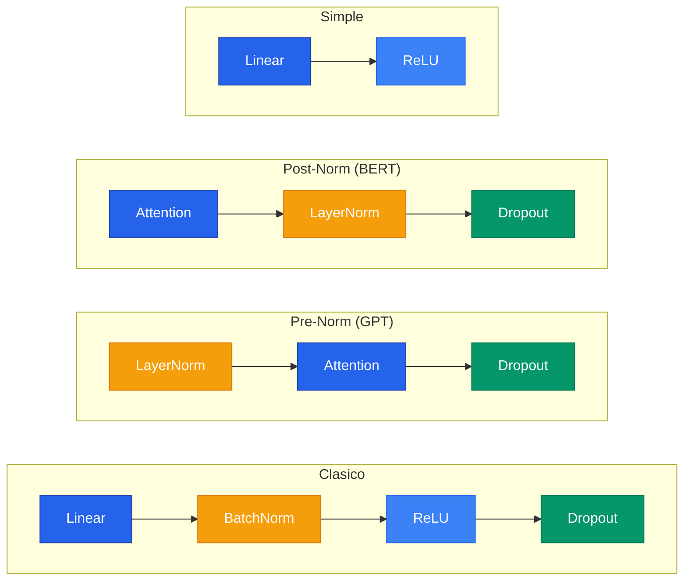

## 1. ReLU: Funcion de Activacion

### 1.1 El problema con Sigmoide y Tanh

Las funciones de activacion tradicionales presentan un problema critico: **saturacion**. Cuando la entrada es muy grande o muy negativa, la derivada se acerca a 0, produciendo gradientes "muertos".

En redes profundas, durante backpropagation los gradientes se multiplican capa por capa. Si cada capa aporta gradientes cercanos a 0, el gradiente total se desvanece exponencialmente: el **vanishing gradient problem**.

### 1.2 ReLU: Rectified Linear Unit

$$\text{ReLU}(x) = \max(0, x)$$

**Ventajas:**
- Computacionalmente eficiente (solo una comparacion con 0)
- No se satura para valores positivos
- Promueve sparsity (regularizacion implicita)

**Desventaja (Dying ReLU):** Si una neurona siempre recibe entradas negativas, queda permanentemente "muerta".

### 1.3 Variantes de ReLU

| Funcion | Formula | Caracteristica |
|---|---|---|
| **Leaky ReLU** | $\max(0.01x, x)$ | Pequeno gradiente para $x < 0$ |
| **ELU** | $x$ si $x>0$, $\alpha(e^x - 1)$ si $x \leq 0$ | Salidas negativas suaves |
| **GELU** | $x \cdot \Phi(x)$ | Usada en Transformers (BERT, GPT) |
| **Swish/SiLU** | $x \cdot \sigma(x)$ | Usada en EfficientNet |

```python
# En PyTorch
relu = nn.ReLU()
output = F.relu(input)
```

#### Ejemplo: Comparacion de funciones de activacion




```python
import torch
import torch.nn as nn

# Crear entrada de prueba con valores positivos y negativos
x = torch.linspace(-3, 3, 100)

# Comparar comportamiento de cada activacion
activaciones = {
    "ReLU": nn.ReLU(),
    "LeakyReLU": nn.LeakyReLU(0.01),
    "ELU": nn.ELU(alpha=1.0),
    "GELU": nn.GELU(),
    "SiLU": nn.SiLU(),  # Swish
}

for nombre, fn in activaciones.items():
    y = fn(x)
    # Gradiente: derivada de la activacion
    grad = torch.autograd.grad(y.sum(), x, create_graph=True)[0] if x.requires_grad else None
    print(f"{nombre}: min={y.min():.2f}, max={y.max():.2f}")
```




```python
import tensorflow as tf
import numpy as np

# Crear entrada de prueba
x = tf.constant(np.linspace(-3, 3, 100), dtype=tf.float32)

# Comparar cada activacion
activaciones = {
    "ReLU": tf.keras.activations.relu,
    "LeakyReLU": lambda x: tf.keras.activations.relu(x, alpha=0.01),
    "ELU": tf.keras.activations.elu,
    "GELU": tf.keras.activations.gelu,
    "Swish": tf.keras.activations.swish,
}

for nombre, fn in activaciones.items():
    y = fn(x)
    print(f"{nombre}: min={y.numpy().min():.2f}, max={y.numpy().max():.2f}")
```




```python
import jax
import jax.numpy as jnp
from jax import nn as jnn

# Crear entrada de prueba
x = jnp.linspace(-3, 3, 100)

# Comparar cada activacion
activaciones = {
    "ReLU": jnn.relu,
    "LeakyReLU": lambda x: jnn.leaky_relu(x, negative_slope=0.01),
    "ELU": jnn.elu,
    "GELU": jnn.gelu,
    "SiLU": jnn.silu,  # Swish
}

for nombre, fn in activaciones.items():
    y = fn(x)
    # JAX permite calcular gradiente facilmente
    grad_fn = jax.grad(lambda x: fn(x).sum())
    print(f"{nombre}: min={y.min():.2f}, max={y.max():.2f}")
```




---

## 2. Dropout: Regularizacion

### 2.1 Que problema resuelve


**Overfitting** ocurre cuando la red memoriza los datos de entrenamiento en vez de aprender patrones generales. Dropout lo combate apagando neuronas al azar en cada iteracion, forzando a TODAS las neuronas a aprender features utiles independientemente.


### 2.2 Como funciona

En cada iteracion, cada neurona tiene probabilidad $p$ de ser apagada:

```text
ITERACION 1:                    ITERACION 2:
Valores:                        Valores:
[3.2, 1.5, 0.8, 2.1, 0.3, 1.7] [3.2, 1.5, 0.8, 2.1, 0.3, 1.7]

Despues de Dropout (p=0.5):     Despues de Dropout (p=0.5):
[3.2, 0.0, 0.8, 2.1, 0.0, 1.7] [0.0, 1.5, 0.0, 2.1, 0.3, 0.0]
```

### 2.3 Por que funciona

**Equipo de trabajo:** Sin Dropout, algunas neuronas se vuelven super-especializadas y las demas se vuelven parasitarias. Con Dropout, como cualquier neurona puede desaparecer, TODAS tienen que aprender a ser utiles.

**Ensambles gratis:** Cada iteracion entrena una "sub-red" diferente. Con 10 neuronas y p=0.5, hay $2^{10} = 1024$ posibles sub-redes.

### 2.4 Inverted Dropout (PyTorch)

```python
dropout = nn.Dropout(p=0.5)

# En modelo real
class MiRed(nn.Module):
    def __init__(self):
        super().__init__()
        self.fc1 = nn.Linear(100, 50)
        self.relu = nn.ReLU()
        self.dropout = nn.Dropout(p=0.5)
        self.fc2 = nn.Linear(50, 10)

    def forward(self, x):
        x = self.fc1(x)
        x = self.relu(x)
        x = self.dropout(x)  # Solo activo en .train()
        x = self.fc2(x)
        return x

model.train()  # Dropout ACTIVO
model.eval()   # Dropout DESACTIVADO
```

**Valores tipicos de p:**

| Valor | Donde | Agresividad |
|---|---|---|
| p = 0.1 | Transformers | Sutil |
| p = 0.2-0.3 | Capas convolucionales | Moderado |
| p = 0.5 | Capas fully-connected | Agresivo |

#### Ejemplo: Implementacion de Inverted Dropout desde cero




```python
import torch

def inverted_dropout(x, p=0.5, training=True):
    """Inverted Dropout: escala en entrenamiento, nada en inferencia."""
    if not training or p == 0:
        return x
    # Mascara binaria: 1 con prob (1-p), 0 con prob p
    mask = (torch.rand_like(x) > p).float()
    # Escalar por 1/(1-p) para mantener la esperanza
    return x * mask / (1 - p)

# Demostrar que la esperanza se mantiene
x = torch.ones(10000) * 2.0
print(f"Original:  media = {x.mean():.4f}")
print(f"Dropout:   media = {inverted_dropout(x, p=0.5).mean():.4f}")  # ~2.0
print(f"Inferencia: media = {inverted_dropout(x, p=0.5, training=False).mean():.4f}")  # 2.0
```




```python
import tensorflow as tf

def inverted_dropout(x, p=0.5, training=True):
    """Inverted Dropout: escala en entrenamiento, nada en inferencia."""
    if not training or p == 0:
        return x
    # Mascara binaria con probabilidad (1-p) de mantener
    mask = tf.cast(tf.random.uniform(tf.shape(x)) > p, tf.float32)
    # Escalar por 1/(1-p) para compensar neuronas apagadas
    return x * mask / (1 - p)

# Demostrar que la esperanza se mantiene
x = tf.ones(10000) * 2.0
print(f"Original:  media = {tf.reduce_mean(x):.4f}")
print(f"Dropout:   media = {tf.reduce_mean(inverted_dropout(x, p=0.5)):.4f}")  # ~2.0
print(f"Inferencia: media = {tf.reduce_mean(inverted_dropout(x, p=0.5, training=False)):.4f}")
```




```python
import jax
import jax.numpy as jnp
import jax.random as jr

def inverted_dropout(key, x, p=0.5, training=True):
    """Inverted Dropout: escala en entrenamiento, nada en inferencia."""
    if not training or p == 0:
        return x
    # JAX requiere clave PRNG explicita (reproducibilidad)
    mask = (jr.uniform(key, x.shape) > p).astype(jnp.float32)
    # Escalar por 1/(1-p) para mantener la esperanza
    return x * mask / (1 - p)

# Demostrar que la esperanza se mantiene
key = jr.PRNGKey(42)
x = jnp.ones(10000) * 2.0
print(f"Original:  media = {x.mean():.4f}")
print(f"Dropout:   media = {inverted_dropout(key, x, p=0.5).mean():.4f}")  # ~2.0
```




---

## 3. Normalizaciones: BatchNorm y LayerNorm

### 3.1 Internal Covariate Shift

A medida que los pesos se actualizan, la escala y distribucion de las activaciones cambia constantemente. Cada capa tiene que re-aprender a interpretar sus entradas en vez de aprender patrones utiles.

### 3.2 Normalizacion Z-score

$$x_{\text{norm}} = \frac{x - \mu}{\sigma}$$

### 3.3 Gamma y Beta

$$y = \gamma \cdot x_{\text{norm}} + \beta$$

Son parametros aprendibles que permiten a la red "deshacer" la normalizacion si no es util en alguna capa.

### 3.4 BatchNorm vs LayerNorm


**BatchNorm** normaliza por feature (columna) a traves del batch. Ideal para CNNs. Necesita `model.eval()` en inferencia para usar running stats. **LayerNorm** normaliza por muestra (fila). Ideal para Transformers. Comportamiento identico en train e inferencia.


### 3.5 Donde poner la normalizacion

```text
Capa Lineal -> Normalizacion -> Activacion (ReLU) -> Dropout

NUNCA en la ultima capa.
```

---

## 4. Guia Practica: Entrenamiento de DNNs

### Orden de las capas



### Loop de entrenamiento

```python
for epoch in range(num_epochs):
    model.train()
    for images, labels in train_loader:
        # 1. Forward
        predictions = model(images)
        # 2. Loss
        loss = loss_fn(predictions, labels)
        # 3. Backward
        optimizer.zero_grad()
        loss.backward()
        # 4. Update
        optimizer.step()

    # Evaluacion
    model.eval()
    with torch.no_grad():
        for images, labels in test_loader:
            predictions = model(images)
            # Calcular accuracy...
```

#### Ejemplo: Loop completo de entrenamiento CNN con MNIST




```python
import torch
import torch.nn as nn
from torchvision import datasets, transforms
from torch.utils.data import DataLoader

# Datos: descargar MNIST y normalizar
transform = transforms.Compose([transforms.ToTensor(), transforms.Normalize((0.1307,), (0.3081,))])
train_ds = datasets.MNIST("data", train=True, download=True, transform=transform)
test_ds = datasets.MNIST("data", train=False, transform=transform)
train_loader = DataLoader(train_ds, batch_size=64, shuffle=True)
test_loader = DataLoader(test_ds, batch_size=1000)

# Red: CNN simple con BatchNorm y Dropout
class CNN(nn.Module):
    def __init__(self):
        super().__init__()
        self.net = nn.Sequential(
            nn.Conv2d(1, 32, 3, padding=1), nn.BatchNorm2d(32), nn.ReLU(), nn.MaxPool2d(2),
            nn.Conv2d(32, 64, 3, padding=1), nn.BatchNorm2d(64), nn.ReLU(), nn.MaxPool2d(2),
            nn.Flatten(), nn.Linear(64*7*7, 128), nn.ReLU(), nn.Dropout(0.5), nn.Linear(128, 10))
    def forward(self, x):
        return self.net(x)

model = CNN()
optimizer = torch.optim.Adam(model.parameters(), lr=1e-3)
loss_fn = nn.CrossEntropyLoss()

# Entrenar 5 epocas
for epoch in range(5):
    model.train()
    for imgs, labels in train_loader:
        loss = loss_fn(model(imgs), labels)
        optimizer.zero_grad(); loss.backward(); optimizer.step()
    # Evaluar
    model.eval()
    correct = sum((model(x).argmax(1) == y).sum().item() for x, y in test_loader)
    print(f"Epoca {epoch+1}: accuracy = {correct/len(test_ds):.4f}")
```




```python
import tensorflow as tf
from tensorflow.keras import layers

# Datos: cargar MNIST y normalizar
(x_train, y_train), (x_test, y_test) = tf.keras.datasets.mnist.load_data()
x_train = x_train[..., None].astype("float32") / 255.0
x_test = x_test[..., None].astype("float32") / 255.0

# Red: CNN simple con BatchNorm y Dropout
model = tf.keras.Sequential([
    layers.Conv2D(32, 3, padding="same", activation="relu", input_shape=(28, 28, 1)),
    layers.BatchNormalization(), layers.MaxPooling2D(2),
    layers.Conv2D(64, 3, padding="same", activation="relu"),
    layers.BatchNormalization(), layers.MaxPooling2D(2),
    layers.Flatten(), layers.Dense(128, activation="relu"),
    layers.Dropout(0.5), layers.Dense(10)])

# Entrenar 5 epocas
model.compile(optimizer="adam", loss=tf.keras.losses.SparseCategoricalCrossentropy(from_logits=True),
              metrics=["accuracy"])
model.fit(x_train, y_train, epochs=5, batch_size=64, validation_data=(x_test, y_test))
```




```python
import jax, jax.numpy as jnp
from flax import linen as nn
import optax

# Red: CNN simple
class CNN(nn.Module):
    @nn.compact
    def __call__(self, x, training=False):
        x = nn.Conv(32, (3, 3), padding="SAME")(x)
        x = nn.BatchNorm(use_running_average=not training)(x)
        x = nn.relu(x); x = nn.max_pool(x, (2, 2), strides=(2, 2))
        x = nn.Conv(64, (3, 3), padding="SAME")(x)
        x = nn.BatchNorm(use_running_average=not training)(x)
        x = nn.relu(x); x = nn.max_pool(x, (2, 2), strides=(2, 2))
        x = x.reshape((x.shape[0], -1))  # Flatten
        x = nn.Dense(128)(x); x = nn.relu(x)
        x = nn.Dropout(rate=0.5)(x, deterministic=not training)
        return nn.Dense(10)(x)

# Inicializar parametros con entrada dummy
model = CNN()
variables = model.init(jax.random.PRNGKey(0), jnp.ones((1, 28, 28, 1)), training=False)
tx = optax.adam(1e-3)
opt_state = tx.init(variables["params"])
```




### Epocas y Early Stopping

```text
Pocas epocas (underfitting):   la red no aprendio lo suficiente
Punto justo:                   generaliza bien
Demasiadas (overfitting):      memoriza, test accuracy baja
```

Rangos tipicos:
- MNIST: 5-20 epocas
- Clasificar texto: 10-50 epocas
- ImageNet: 90-300 epocas
- GPT-3: ~1 epoca (dataset tan grande que no necesita repetir)
