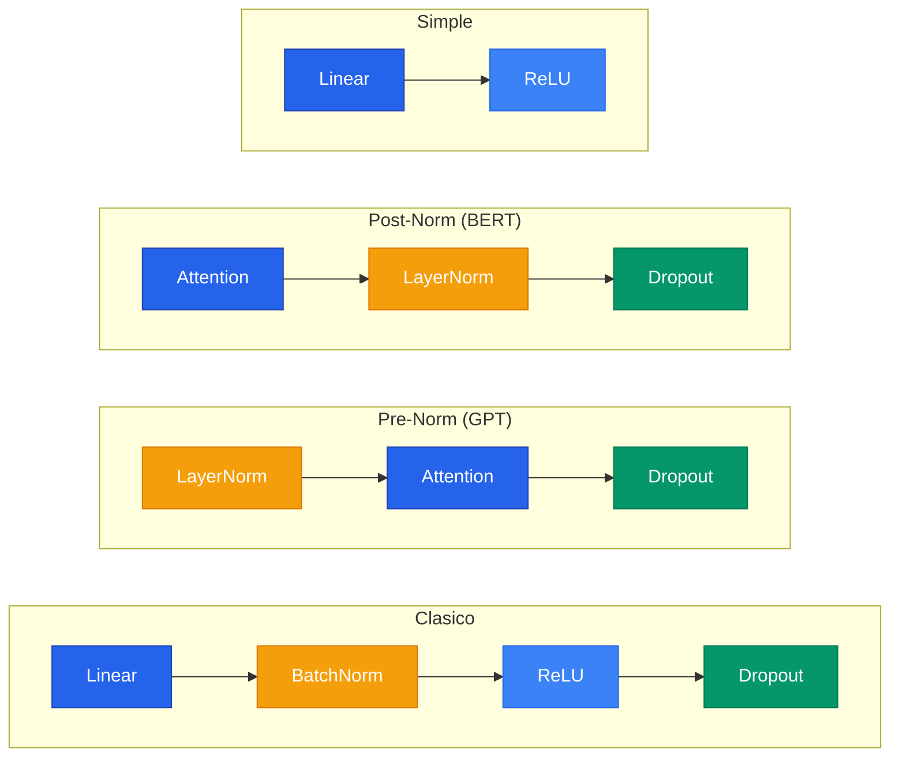

## 1. ReLU: Funcion de Activacion

### 1.1 El problema con Sigmoide y Tanh

Las funciones de activacion tradicionales presentan un problema critico: **saturacion**. Cuando la entrada es muy grande o muy negativa, la derivada se acerca a 0, produciendo gradientes "muertos".

En redes profundas, durante backpropagation los gradientes se multiplican capa por capa. Si cada capa aporta gradientes cercanos a 0, el gradiente total se desvanece exponencialmente: el **vanishing gradient problem**.

### 1.2 ReLU: Rectified Linear Unit

$$\text{ReLU}(x) = \max(0, x)$$

**Ventajas:**
- Computacionalmente eficiente (solo una comparacion con 0)
- No se satura para valores positivos
- Promueve sparsity (regularizacion implicita)

**Desventaja (Dying ReLU):** Si una neurona siempre recibe entradas negativas, queda permanentemente "muerta".

### 1.3 Variantes de ReLU

| Funcion | Formula | Caracteristica |
|---|---|---|
| **Leaky ReLU** | $\max(0.01x, x)$ | Pequeno gradiente para $x < 0$ |
| **ELU** | $x$ si $x>0$, $\alpha(e^x - 1)$ si $x \leq 0$ | Salidas negativas suaves |
| **GELU** | $x \cdot \Phi(x)$ | Usada en Transformers (BERT, GPT) |
| **Swish/SiLU** | $x \cdot \sigma(x)$ | Usada en EfficientNet |

```python
# En PyTorch
relu = nn.ReLU()
output = F.relu(input)
```

---

## 2. Dropout: Regularizacion

### 2.1 Que problema resuelve


**Overfitting** ocurre cuando la red memoriza los datos de entrenamiento en vez de aprender patrones generales. Dropout lo combate apagando neuronas al azar en cada iteracion, forzando a TODAS las neuronas a aprender features utiles independientemente.


### 2.2 Como funciona

En cada iteracion, cada neurona tiene probabilidad $p$ de ser apagada:

```text
ITERACION 1:                    ITERACION 2:
Valores:                        Valores:
[3.2, 1.5, 0.8, 2.1, 0.3, 1.7] [3.2, 1.5, 0.8, 2.1, 0.3, 1.7]

Despues de Dropout (p=0.5):     Despues de Dropout (p=0.5):
[3.2, 0.0, 0.8, 2.1, 0.0, 1.7] [0.0, 1.5, 0.0, 2.1, 0.3, 0.0]
```

### 2.3 Por que funciona

**Equipo de trabajo:** Sin Dropout, algunas neuronas se vuelven super-especializadas y las demas se vuelven parasitarias. Con Dropout, como cualquier neurona puede desaparecer, TODAS tienen que aprender a ser utiles.

**Ensambles gratis:** Cada iteracion entrena una "sub-red" diferente. Con 10 neuronas y p=0.5, hay $2^{10} = 1024$ posibles sub-redes.

### 2.4 Inverted Dropout (PyTorch)

```python
dropout = nn.Dropout(p=0.5)

# En modelo real
class MiRed(nn.Module):
    def __init__(self):
        super().__init__()
        self.fc1 = nn.Linear(100, 50)
        self.relu = nn.ReLU()
        self.dropout = nn.Dropout(p=0.5)
        self.fc2 = nn.Linear(50, 10)

    def forward(self, x):
        x = self.fc1(x)
        x = self.relu(x)
        x = self.dropout(x)  # Solo activo en .train()
        x = self.fc2(x)
        return x

model.train()  # Dropout ACTIVO
model.eval()   # Dropout DESACTIVADO
```

**Valores tipicos de p:**

| Valor | Donde | Agresividad |
|---|---|---|
| p = 0.1 | Transformers | Sutil |
| p = 0.2-0.3 | Capas convolucionales | Moderado |
| p = 0.5 | Capas fully-connected | Agresivo |

---

## 3. Normalizaciones: BatchNorm y LayerNorm

### 3.1 Internal Covariate Shift

A medida que los pesos se actualizan, la escala y distribucion de las activaciones cambia constantemente. Cada capa tiene que re-aprender a interpretar sus entradas en vez de aprender patrones utiles.

### 3.2 Normalizacion Z-score

$$x_{\text{norm}} = \frac{x - \mu}{\sigma}$$

### 3.3 Gamma y Beta

$$y = \gamma \cdot x_{\text{norm}} + \beta$$

Son parametros aprendibles que permiten a la red "deshacer" la normalizacion si no es util en alguna capa.

### 3.4 BatchNorm vs LayerNorm


**BatchNorm** normaliza por feature (columna) a traves del batch. Ideal para CNNs. Necesita `model.eval()` en inferencia para usar running stats. **LayerNorm** normaliza por muestra (fila). Ideal para Transformers. Comportamiento identico en train e inferencia.


### 3.5 Donde poner la normalizacion

```text
Capa Lineal -> Normalizacion -> Activacion (ReLU) -> Dropout

NUNCA en la ultima capa.
```

---

## 4. Guia Practica: Entrenamiento de DNNs

### Orden de las capas



### Loop de entrenamiento

```python
for epoch in range(num_epochs):
    model.train()
    for images, labels in train_loader:
        # 1. Forward
        predictions = model(images)
        # 2. Loss
        loss = loss_fn(predictions, labels)
        # 3. Backward
        optimizer.zero_grad()
        loss.backward()
        # 4. Update
        optimizer.step()

    # Evaluacion
    model.eval()
    with torch.no_grad():
        for images, labels in test_loader:
            predictions = model(images)
            # Calcular accuracy...
```

### Epocas y Early Stopping

```text
Pocas epocas (underfitting):   la red no aprendio lo suficiente
Punto justo:                   generaliza bien
Demasiadas (overfitting):      memoriza, test accuracy baja
```

Rangos tipicos:
- MNIST: 5-20 epocas
- Clasificar texto: 10-50 epocas
- ImageNet: 90-300 epocas
- GPT-3: ~1 epoca (dataset tan grande que no necesita repetir)
