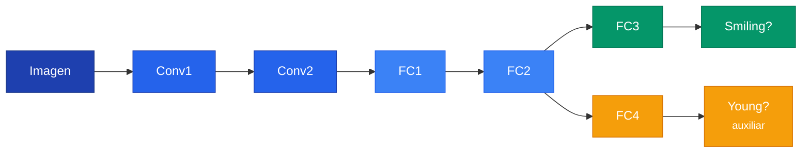

## 1. Funciones de Perdida

### 1.1 Contexto: el problema de Machine Learning



f^* \approx f^*_{Tr} = \arg\min_{f \in \mathcal{H}} \frac{1}{N} \sum_{x_i \in Tr} L(f(x_i), y_i)


Donde $\mathcal{H}$ es el espacio de hipotesis, $L$ es la funcion de perdida, $f(x_i)$ es la prediccion y $y_i$ la etiqueta real.

### 1.2 MSE (Mean Squared Error)


\text{MSE} = \frac{1}{N} \sum_{i=1}^{N} (\hat{y}_i - y_i)^2


MSE **castiga desproporcionadamente los errores grandes** por el cuadrado. Dos modelos con el mismo error promedio pueden tener MSE muy diferente.

```text
Modelo A: errores [5.0, 0.0, 10.0]  -> MSE = 41.7
Modelo B: errores [5.0, 5.0, 5.0]   -> MSE = 25.0  <- MEJOR
```

```python
loss_fn = nn.MSELoss()
loss = loss_fn(predictions, target)
```

### 1.3 Cross-Entropy


\text{CE} = -\sum_i y_i \log(\hat{y}_i)


Como $y_i$ es one-hot (solo un 1), se simplifica:

$$\text{CE} = -\log(\hat{y}_{\text{clase correcta}})$$

- Si la red da 0.89 a la clase correcta: $-\log(0.89) = 0.117$ (bajo)
- Si la red da 0.01 a la clase correcta: $-\log(0.01) = 4.605$ (alto)

### 1.4 Softmax


**Softmax** convierte numeros crudos (logits) en probabilidades que suman 1. En PyTorch, `nn.CrossEntropyLoss` hace Softmax + Cross-Entropy internamente. No aplicar softmax antes.


$$\text{softmax}(z_i) = \frac{e^{z_i}}{\sum_j e^{z_j}}$$

```python
loss_fn = nn.CrossEntropyLoss()
logits = model(x)                    # numeros crudos, NO probabilidades
loss = loss_fn(logits, label)        # PyTorch aplica softmax internamente
```

### Ejemplo: MSE vs Cross-Entropy



```python
import torch
import torch.nn as nn

# Simulamos logits y etiquetas para 4 muestras, 3 clases
logits = torch.tensor([[2.0, 1.0, 0.1],
                       [0.5, 2.5, 0.3],
                       [0.3, 0.1, 3.0],
                       [1.5, 0.8, 0.2]])
etiquetas = torch.tensor([0, 1, 2, 0])

# Cross-Entropy (ideal para clasificacion)
ce_loss = nn.CrossEntropyLoss()
print(f"Cross-Entropy: {ce_loss(logits, etiquetas):.4f}")

# MSE (NO recomendado para clasificacion)
one_hot = nn.functional.one_hot(etiquetas, num_classes=3).float()
mse_loss = nn.MSELoss()
probs = torch.softmax(logits, dim=1)
print(f"MSE: {mse_loss(probs, one_hot):.4f}")
```


```python
import tensorflow as tf

# Simulamos logits y etiquetas para 4 muestras, 3 clases
logits = tf.constant([[2.0, 1.0, 0.1],
                      [0.5, 2.5, 0.3],
                      [0.3, 0.1, 3.0],
                      [1.5, 0.8, 0.2]])
etiquetas = tf.constant([0, 1, 2, 0])

# Cross-Entropy (ideal para clasificacion)
ce_loss = tf.keras.losses.SparseCategoricalCrossentropy(from_logits=True)
print(f"Cross-Entropy: {ce_loss(etiquetas, logits).numpy():.4f}")

# MSE (NO recomendado para clasificacion)
one_hot = tf.one_hot(etiquetas, depth=3)
probs = tf.nn.softmax(logits, axis=1)
mse_loss = tf.keras.losses.MeanSquaredError()
print(f"MSE: {mse_loss(one_hot, probs).numpy():.4f}")
```


```python
import jax
import jax.numpy as jnp
import optax

# Simulamos logits y etiquetas para 4 muestras, 3 clases
logits = jnp.array([[2.0, 1.0, 0.1],
                    [0.5, 2.5, 0.3],
                    [0.3, 0.1, 3.0],
                    [1.5, 0.8, 0.2]])
etiquetas = jnp.array([0, 1, 2, 0])

# Cross-Entropy (ideal para clasificacion)
ce = optax.softmax_cross_entropy_with_integer_labels(logits, etiquetas)
print(f"Cross-Entropy: {jnp.mean(ce):.4f}")

# MSE (NO recomendado para clasificacion)
one_hot = jax.nn.one_hot(etiquetas, num_classes=3)
probs = jax.nn.softmax(logits, axis=1)
mse = jnp.mean((probs - one_hot) ** 2)
print(f"MSE: {mse:.4f}")
```



### 1.5 MSE para clasificacion: por que NO funciona

MSE prefiere predecir valores intermedios, no porque sean mas probables, sino porque estan mas cerca de todo:

```text
Si siempre predice "0": MSE = 28.5
Si siempre predice "5": MSE = 11.0  <- MSE lo prefiere, pero no tiene sentido
```

### 1.6 Cuando usar cual

| Tipo de problema | Funcion de perdida | Ejemplo |
|---|---|---|
| Clasificacion (N clases) | `nn.CrossEntropyLoss` | Digitos 0-9 |
| Clasificacion binaria | `nn.BCEWithLogitsLoss` | Spam? |
| Regresion | `nn.MSELoss` | Precio, temperatura |
| Regresion robusta | `nn.L1Loss` | Tiempos de respuesta |

---

## 2. Regularizacion

### 2.1 Motivacion: overfitting

Cuando un modelo tiene muchos parametros y pocos datos, **memoriza** en vez de aprender patrones generales.

```text
Sin regularizacion:   Train 100%, Test 60%  <- memorizo
Con regularizacion:   Train 95%,  Test 85%  <- generaliza
```

### 2.2 Regularizacion L2 (Weight Decay)


L_{\text{total}} = L_{\text{original}} + \lambda \sum_i w_i^2


Penaliza los pesos grandes. La red prefiere distribuir la importancia entre muchos pesos chicos.

```text
Sin L2:  pesos = [50.0, -30.0, 0.01, 0.01, 0.0, 0.0]  (pocas neuronas hacen todo)
Con L2:  pesos = [3.2, -2.1, 1.5, -1.8, 0.9, -0.7]    (pesos distribuidos)
```

```python
# L2 en PyTorch: un solo parametro en el optimizador
optimizer = optim.Adam(model.parameters(), lr=0.001, weight_decay=0.2)
```

Valores tipicos de weight_decay: 0.0001 (sutil), 0.001 (moderado), 0.01 (fuerte).

### 2.3 Regularizacion L1

$$L_{\text{total}} = L_{\text{original}} + \lambda \sum_i |w_i|$$


**L2** hace pesos chicos pero no cero. **L1** produce **sparsity**: muchos pesos se hacen exactamente cero, como si la red seleccionara automaticamente que features importan.


```python
# L1 manual en PyTorch
l1_lambda = 0.001
l1_norm = sum(p.abs().sum() for p in model.parameters())
loss = loss_fn(predictions, labels) + l1_lambda * l1_norm
```

### 2.4 Comparacion L1 vs L2 vs Dropout

| Tecnica | Que hace | Efecto | En PyTorch |
|---|---|---|---|
| **L2** | Penaliza $w^2$ | Pesos chicos (distribuidos) | `weight_decay=0.2` |
| **L1** | Penaliza $|w|$ | Pesos en cero (sparse) | Manual |
| **Dropout** | Apaga neuronas al azar | Redundancia | `nn.Dropout(p=0.5)` |

Se pueden combinar (y es comun hacerlo).

### Ejemplo: efecto de L1 vs L2 sobre los pesos



```python
import torch
import torch.nn as nn
import torch.optim as optim

# Red simple para comparar efecto de L1 vs L2
modelo_l1 = nn.Linear(10, 1)
modelo_l2 = nn.Linear(10, 1)

# Datos sinteticos
X = torch.randn(100, 10)
y = torch.randn(100, 1)

# Entrenamiento con L2 (weight_decay en el optimizador)
opt_l2 = optim.SGD(modelo_l2.parameters(), lr=0.01, weight_decay=0.1)
for _ in range(200):
    opt_l2.zero_grad()
    nn.MSELoss()(modelo_l2(X), y).backward()
    opt_l2.step()

# Entrenamiento con L1 (penalizacion manual)
opt_l1 = optim.SGD(modelo_l1.parameters(), lr=0.01)
for _ in range(200):
    opt_l1.zero_grad()
    loss = nn.MSELoss()(modelo_l1(X), y)
    l1_pen = 0.1 * sum(p.abs().sum() for p in modelo_l1.parameters())
    (loss + l1_pen).backward()
    opt_l1.step()

# Comparar: L1 produce mas pesos cercanos a cero (sparsity)
print("Pesos L2:", modelo_l2.weight.data.round(decimals=3))
print("Pesos L1:", modelo_l1.weight.data.round(decimals=3))
print(f"Pesos ~0 en L1: {(modelo_l1.weight.abs() < 0.01).sum().item()}")
print(f"Pesos ~0 en L2: {(modelo_l2.weight.abs() < 0.01).sum().item()}")
```


```python
import tensorflow as tf
import numpy as np

# Datos sinteticos
X = np.random.randn(100, 10).astype("float32")
y = np.random.randn(100, 1).astype("float32")

# Modelo con regularizacion L2
modelo_l2 = tf.keras.Sequential([
    tf.keras.layers.Dense(1, kernel_regularizer=tf.keras.regularizers.l2(0.1),
                          input_shape=(10,))
])
modelo_l2.compile(optimizer="sgd", loss="mse")
modelo_l2.fit(X, y, epochs=200, verbose=0)

# Modelo con regularizacion L1
modelo_l1 = tf.keras.Sequential([
    tf.keras.layers.Dense(1, kernel_regularizer=tf.keras.regularizers.l1(0.1),
                          input_shape=(10,))
])
modelo_l1.compile(optimizer="sgd", loss="mse")
modelo_l1.fit(X, y, epochs=200, verbose=0)

# Comparar: L1 produce mas pesos cercanos a cero
pesos_l2 = modelo_l2.layers[0].get_weights()[0].flatten()
pesos_l1 = modelo_l1.layers[0].get_weights()[0].flatten()
print(f"Pesos ~0 en L1: {np.sum(np.abs(pesos_l1) < 0.01)}")
print(f"Pesos ~0 en L2: {np.sum(np.abs(pesos_l2) < 0.01)}")
```


```python
import jax
import jax.numpy as jnp
import optax

# Inicializar pesos
key = jax.random.PRNGKey(0)
w_l1 = jax.random.normal(key, (10, 1)) * 0.1
w_l2 = w_l1.copy()
X = jax.random.normal(key, (100, 10))
y = jax.random.normal(key, (100, 1))

# Loss con L2
def loss_l2(w):
    pred = X @ w
    return jnp.mean((pred - y) ** 2) + 0.1 * jnp.sum(w ** 2)

# Loss con L1
def loss_l1(w):
    pred = X @ w
    return jnp.mean((pred - y) ** 2) + 0.1 * jnp.sum(jnp.abs(w))

# Entrenamiento simple con gradiente descendente
for _ in range(200):
    w_l2 -= 0.01 * jax.grad(loss_l2)(w_l2)
    w_l1 -= 0.01 * jax.grad(loss_l1)(w_l1)

# Comparar sparsity
print(f"Pesos ~0 en L1: {jnp.sum(jnp.abs(w_l1) < 0.01)}")
print(f"Pesos ~0 en L2: {jnp.sum(jnp.abs(w_l2) < 0.01)}")
```



---

## 3. Tareas Auxiliares

### 3.1 Motivacion

A veces la tarea principal es dificil y la red no tiene suficiente senal para aprender bien. Una **tarea auxiliar** se entrena al mismo tiempo para mejorar las representaciones internas.

```text
Solo tarea principal (Smiling):
  La red aprende solo de una senal binaria

Con tarea auxiliar (Smiling + Young):
  Las capas compartidas aprenden representaciones mas RICAS
  que ayudan a AMBAS tareas
```

### 3.2 Arquitectura con tarea auxiliar



### 3.3 CombinedLoss


L_{\text{total}} = L_{\text{principal}} + \lambda \cdot L_{\text{auxiliar}}


- $\lambda = 0.0$: la tarea auxiliar no tiene efecto
- $\lambda = 0.2$: poca influencia (valor tipico)
- $\lambda = 1.0$: ambas tareas con igual importancia

```python
class CombinedLoss(nn.Module):
    def forward(self, main_pred, aux_pred, main_labels, aux_labels):
        main_loss = F.binary_cross_entropy_with_logits(main_pred, main_labels)
        aux_loss = F.binary_cross_entropy_with_logits(aux_pred, aux_labels)
        return main_loss + self.aux_weight * aux_loss
```

### 3.4 Cuidado con la escala de los losses

```text
main_loss ~ 0.5 (cross-entropy)
aux_loss  ~ 500.0 (MSE de landmarks)

Con lambda=0.2: Loss = 0.5 + 0.2 * 500 = 100.5  <- auxiliar DOMINA!
Solucion: lambda=0.001: Loss = 0.5 + 0.001 * 500 = 1.0  <- balanceado
```

### Ejemplo: loss combinado para multi-task learning



```python
import torch
import torch.nn as nn
import torch.nn.functional as F

class RedMultiTarea(nn.Module):
    def __init__(self):
        super().__init__()
        self.compartida = nn.Linear(784, 128)  # capas compartidas
        self.cabeza_principal = nn.Linear(128, 1)  # tarea: sonriendo?
        self.cabeza_auxiliar = nn.Linear(128, 1)   # tarea: joven?

    def forward(self, x):
        feat = F.relu(self.compartida(x))
        return self.cabeza_principal(feat), self.cabeza_auxiliar(feat)

modelo = RedMultiTarea()
x = torch.randn(32, 784)
labels_main = torch.randint(0, 2, (32, 1)).float()
labels_aux = torch.randint(0, 2, (32, 1)).float()

# Forward y loss combinado
pred_main, pred_aux = modelo(x)
loss_main = F.binary_cross_entropy_with_logits(pred_main, labels_main)
loss_aux = F.binary_cross_entropy_with_logits(pred_aux, labels_aux)

# Lambda controla la influencia de la tarea auxiliar
lambda_aux = 0.2
loss_total = loss_main + lambda_aux * loss_aux
print(f"Principal: {loss_main:.4f}, Auxiliar: {loss_aux:.4f}, Total: {loss_total:.4f}")
```


```python
import tensorflow as tf

# Red con dos salidas (multi-tarea)
entrada = tf.keras.Input(shape=(784,))
compartida = tf.keras.layers.Dense(128, activation="relu")(entrada)
salida_principal = tf.keras.layers.Dense(1, name="principal")(compartida)
salida_auxiliar = tf.keras.layers.Dense(1, name="auxiliar")(compartida)

modelo = tf.keras.Model(inputs=entrada,
                        outputs=[salida_principal, salida_auxiliar])

# loss_weights controla la influencia de cada tarea
modelo.compile(
    optimizer="adam",
    loss={"principal": "binary_crossentropy",
          "auxiliar": "binary_crossentropy"},
    loss_weights={"principal": 1.0, "auxiliar": 0.2}  # lambda = 0.2
)

# Datos sinteticos
import numpy as np
X = np.random.randn(100, 784).astype("float32")
y_main = np.random.randint(0, 2, (100, 1)).astype("float32")
y_aux = np.random.randint(0, 2, (100, 1)).astype("float32")

modelo.fit(X, {"principal": y_main, "auxiliar": y_aux}, epochs=5, verbose=1)
```


```python
import jax
import jax.numpy as jnp
import optax

# Parametros de la red multi-tarea
key = jax.random.PRNGKey(0)
k1, k2, k3 = jax.random.split(key, 3)
params = {
    "compartida": jax.random.normal(k1, (784, 128)) * 0.01,
    "principal": jax.random.normal(k2, (128, 1)) * 0.01,
    "auxiliar": jax.random.normal(k3, (128, 1)) * 0.01,
}

def forward(params, x):
    feat = jax.nn.relu(x @ params["compartida"])
    return feat @ params["principal"], feat @ params["auxiliar"]

def loss_combinado(params, x, y_main, y_aux, lambda_aux=0.2):
    pred_main, pred_aux = forward(params, x)
    # Binary cross-entropy con sigmoide
    bce = lambda p, y: -jnp.mean(y * jnp.log(jax.nn.sigmoid(p) + 1e-7)
                        + (1 - y) * jnp.log(1 - jax.nn.sigmoid(p) + 1e-7))
    return bce(pred_main, y_main) + lambda_aux * bce(pred_aux, y_aux)

# Datos sinteticos
X = jax.random.normal(key, (100, 784))
y_main = jax.random.bernoulli(k1, shape=(100, 1)).astype(jnp.float32)
y_aux = jax.random.bernoulli(k2, shape=(100, 1)).astype(jnp.float32)

loss = loss_combinado(params, X, y_main, y_aux)
print(f"Loss combinado: {loss:.4f}")
```



### 3.5 Cuando usar tareas auxiliares

**Util cuando:** la tarea principal tiene pocos datos, hay tareas relacionadas disponibles, las tareas comparten estructura.

**No util cuando:** las tareas no estan relacionadas, la auxiliar es mucho mas facil/dificil, lambda esta mal calibrado.
