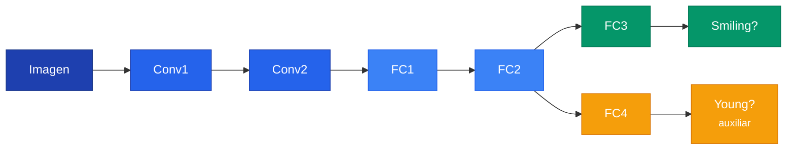

## 1. Funciones de Perdida

### 1.1 Contexto: el problema de Machine Learning



f^* \approx f^*_{Tr} = \arg\min_{f \in \mathcal{H}} \frac{1}{N} \sum_{x_i \in Tr} L(f(x_i), y_i)


Donde $\mathcal{H}$ es el espacio de hipotesis, $L$ es la funcion de perdida, $f(x_i)$ es la prediccion y $y_i$ la etiqueta real.

### 1.2 MSE (Mean Squared Error)


\text{MSE} = \frac{1}{N} \sum_{i=1}^{N} (\hat{y}_i - y_i)^2


MSE **castiga desproporcionadamente los errores grandes** por el cuadrado. Dos modelos con el mismo error promedio pueden tener MSE muy diferente.

```text
Modelo A: errores [5.0, 0.0, 10.0]  -> MSE = 41.7
Modelo B: errores [5.0, 5.0, 5.0]   -> MSE = 25.0  <- MEJOR
```

```python
loss_fn = nn.MSELoss()
loss = loss_fn(predictions, target)
```

### 1.3 Cross-Entropy


\text{CE} = -\sum_i y_i \log(\hat{y}_i)


Como $y_i$ es one-hot (solo un 1), se simplifica:

$$\text{CE} = -\log(\hat{y}_{\text{clase correcta}})$$

- Si la red da 0.89 a la clase correcta: $-\log(0.89) = 0.117$ (bajo)
- Si la red da 0.01 a la clase correcta: $-\log(0.01) = 4.605$ (alto)

### 1.4 Softmax


**Softmax** convierte numeros crudos (logits) en probabilidades que suman 1. En PyTorch, `nn.CrossEntropyLoss` hace Softmax + Cross-Entropy internamente. No aplicar softmax antes.


$$\text{softmax}(z_i) = \frac{e^{z_i}}{\sum_j e^{z_j}}$$

```python
loss_fn = nn.CrossEntropyLoss()
logits = model(x)                    # numeros crudos, NO probabilidades
loss = loss_fn(logits, label)        # PyTorch aplica softmax internamente
```

### 1.5 MSE para clasificacion: por que NO funciona

MSE prefiere predecir valores intermedios, no porque sean mas probables, sino porque estan mas cerca de todo:

```text
Si siempre predice "0": MSE = 28.5
Si siempre predice "5": MSE = 11.0  <- MSE lo prefiere, pero no tiene sentido
```

### 1.6 Cuando usar cual

| Tipo de problema | Funcion de perdida | Ejemplo |
|---|---|---|
| Clasificacion (N clases) | `nn.CrossEntropyLoss` | Digitos 0-9 |
| Clasificacion binaria | `nn.BCEWithLogitsLoss` | Spam? |
| Regresion | `nn.MSELoss` | Precio, temperatura |
| Regresion robusta | `nn.L1Loss` | Tiempos de respuesta |

---

## 2. Regularizacion

### 2.1 Motivacion: overfitting

Cuando un modelo tiene muchos parametros y pocos datos, **memoriza** en vez de aprender patrones generales.

```text
Sin regularizacion:   Train 100%, Test 60%  <- memorizo
Con regularizacion:   Train 95%,  Test 85%  <- generaliza
```

### 2.2 Regularizacion L2 (Weight Decay)


L_{\text{total}} = L_{\text{original}} + \lambda \sum_i w_i^2


Penaliza los pesos grandes. La red prefiere distribuir la importancia entre muchos pesos chicos.

```text
Sin L2:  pesos = [50.0, -30.0, 0.01, 0.01, 0.0, 0.0]  (pocas neuronas hacen todo)
Con L2:  pesos = [3.2, -2.1, 1.5, -1.8, 0.9, -0.7]    (pesos distribuidos)
```

```python
# L2 en PyTorch: un solo parametro en el optimizador
optimizer = optim.Adam(model.parameters(), lr=0.001, weight_decay=0.2)
```

Valores tipicos de weight_decay: 0.0001 (sutil), 0.001 (moderado), 0.01 (fuerte).

### 2.3 Regularizacion L1

$$L_{\text{total}} = L_{\text{original}} + \lambda \sum_i |w_i|$$


**L2** hace pesos chicos pero no cero. **L1** produce **sparsity**: muchos pesos se hacen exactamente cero, como si la red seleccionara automaticamente que features importan.


```python
# L1 manual en PyTorch
l1_lambda = 0.001
l1_norm = sum(p.abs().sum() for p in model.parameters())
loss = loss_fn(predictions, labels) + l1_lambda * l1_norm
```

### 2.4 Comparacion L1 vs L2 vs Dropout

| Tecnica | Que hace | Efecto | En PyTorch |
|---|---|---|---|
| **L2** | Penaliza $w^2$ | Pesos chicos (distribuidos) | `weight_decay=0.2` |
| **L1** | Penaliza $|w|$ | Pesos en cero (sparse) | Manual |
| **Dropout** | Apaga neuronas al azar | Redundancia | `nn.Dropout(p=0.5)` |

Se pueden combinar (y es comun hacerlo).

---

## 3. Tareas Auxiliares

### 3.1 Motivacion

A veces la tarea principal es dificil y la red no tiene suficiente senal para aprender bien. Una **tarea auxiliar** se entrena al mismo tiempo para mejorar las representaciones internas.

```text
Solo tarea principal (Smiling):
  La red aprende solo de una senal binaria

Con tarea auxiliar (Smiling + Young):
  Las capas compartidas aprenden representaciones mas RICAS
  que ayudan a AMBAS tareas
```

### 3.2 Arquitectura con tarea auxiliar



### 3.3 CombinedLoss


L_{\text{total}} = L_{\text{principal}} + \lambda \cdot L_{\text{auxiliar}}


- $\lambda = 0.0$: la tarea auxiliar no tiene efecto
- $\lambda = 0.2$: poca influencia (valor tipico)
- $\lambda = 1.0$: ambas tareas con igual importancia

```python
class CombinedLoss(nn.Module):
    def forward(self, main_pred, aux_pred, main_labels, aux_labels):
        main_loss = F.binary_cross_entropy_with_logits(main_pred, main_labels)
        aux_loss = F.binary_cross_entropy_with_logits(aux_pred, aux_labels)
        return main_loss + self.aux_weight * aux_loss
```

### 3.4 Cuidado con la escala de los losses

```text
main_loss ~ 0.5 (cross-entropy)
aux_loss  ~ 500.0 (MSE de landmarks)

Con lambda=0.2: Loss = 0.5 + 0.2 * 500 = 100.5  <- auxiliar DOMINA!
Solucion: lambda=0.001: Loss = 0.5 + 0.001 * 500 = 1.0  <- balanceado
```

### 3.5 Cuando usar tareas auxiliares

**Util cuando:** la tarea principal tiene pocos datos, hay tareas relacionadas disponibles, las tareas comparten estructura.

**No util cuando:** las tareas no estan relacionadas, la auxiliar es mucho mas facil/dificil, lambda esta mal calibrado.
