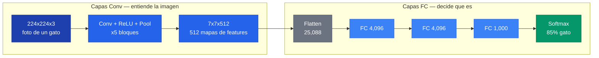
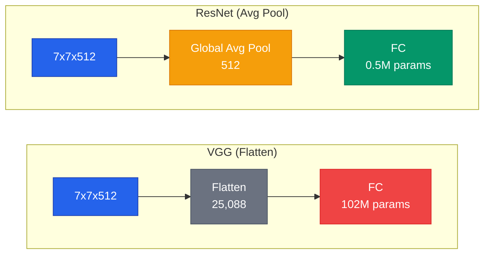
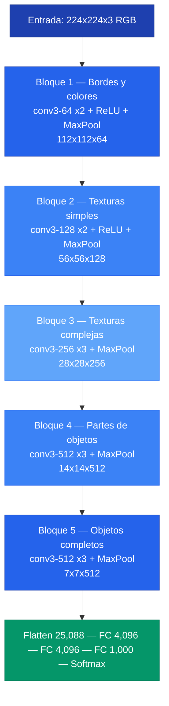

> Preguntas y respuestas sobre como operan internamente las redes convolucionales.

---

## 1. Que es un mapa de activacion

Un mapa de activacion es el resultado de **un filtro recorriendo toda la imagen**. Es una grilla 2D donde cada valor indica "cuanto se parece esta region al patron que busca el filtro".

```text
Imagen 224x224x3
       |
       |  Filtro #0 (3x3x3) pasa por TODAS las 224x224 posiciones
       |
       v
Mapa de activacion #0: 224x224 valores

  Valor alto (ej: 8.5) -> "encontre el patron aqui"
  Valor bajo (ej: 0.1) -> "no hay nada relevante aqui"
```

Cada filtro siempre produce exactamente **un** mapa de activacion.

---

## 2. Que significa `conv3-64`

Notacion del paper de VGG: una capa convolucional con filtros de 3x3 que tiene 64 filtros (= 64 canales de salida).

| Notacion | Kernel | Filtros |
|----------|--------|---------|
| conv3-64 | 3x3 | 64 |
| conv3-128 | 3x3 | 128 |
| conv3-512 | 3x3 | 512 |

---

## 3. De donde salen los 64 canales

De los **64 filtros** que definimos en la capa. El numero 64 es una **decision del disenador**, no un calculo.


El patron de VGG es doblar los canales en cada bloque: 64 -> 128 -> 256 -> 512 -> 512. Esto compensa la perdida de informacion espacial del MaxPool: menos pixeles, pero mas canales para representar patrones mas abstractos.


---

## 4. Los 64 filtros no producen lo mismo

No, porque cada filtro tiene **pesos distintos**. Los 64 filtros recorren la misma imagen, pero cada uno tiene sus propios valores en el kernel 3x3x3.

```text
Mismo parche, tres filtros distintos:

Filtro #0 (bordes verticales):  resultado = 12.3
Filtro #1 (bordes horizontales): resultado = -0.5
Filtro #2 (zonas brillantes):   resultado = 85.7
```

Al inicio del entrenamiento los pesos son aleatorios. Despues del entrenamiento con backpropagation, cada filtro converge a detectar un patron util.

---

## 5. Numero de filtros vs. posiciones

Son independientes:

| Concepto | Que determina | Quien lo decide |
|----------|--------------|-----------------|
| **Posiciones** (224x224) | Tamano espacial H x W | Tamano de imagen + stride + padding |
| **Filtros** (64) | Canales de salida | El disenador de la arquitectura |

$$H_{\text{out}} = \frac{H_{\text{in}} + 2P - K}{S} + 1$$

---

## 6. Que reduce el espacio y que cambia canales

| Operacion | Efecto en H x W | Efecto en Canales |
|-----------|-----------------|-------------------|
| Conv stride=1, pad=1 | No cambia | Lo define `out_channels` |
| Conv stride=2 | Divide por 2 | Lo define `out_channels` |
| MaxPool 2x2, stride=2 | Divide por 2 | No cambia |
| Conv 1x1 | No cambia | Cambia canales |
| Global Average Pool | H x W -> 1x1 | No cambia |

**Regla clave:** Las convoluciones controlan los canales; el stride y el pooling controlan el espacio.

---

## 7. Campo receptivo capa a capa

```text
Capas tempranas:  Alta resolucion x Pocos canales  -> "DONDE estan los bordes"
Capas profundas:  Baja resolucion x Muchos canales  -> "QUE objeto hay"
```

---

## 8. Las capas convolucionales NO clasifican

Las capas convolucionales extraen features. La clasificacion ocurre solo al final (FC + Softmax).



---

## 9. Las capas FC intermedias

### Por que no saltar de 25,088 a 1,000 directo

Las capas intermedias permiten aprender **combinaciones no-lineales** entre features:

```text
FC1: "Si hay pelaje Y ojos redondos Y NO ruedas -> probablemente animal"
FC2: "Si animal Y color dorado Y tamano grande -> perro dorado grande"
Final: neurona contribuye a clase "golden retriever"
```

### El 89% de los parametros de VGG estan en las FC

```text
Todas las conv (13 capas):  14.7M   (10.6%)
FC1: 25,088 x 4,096:      102.8M   (74.3%)
FC2: 4,096 x 4,096:        16.8M   (12.1%)
FC3: 4,096 x 1,000:         4.1M   (3.0%)
```

---

## 10. Global Average Pooling


En lugar de aplanar (Flatten) el tensor 7x7x512 en un vector de 25,088, **Global Average Pooling** promedia cada canal en un solo numero, produciendo un vector de 512. Esto reduce las capas FC de ~102M parametros a ~0.5M parametros (~200x menos).


### Comparacion



### No se pierde informacion relevante

A esta altura de la red, importa **si** el patron esta presente, no **donde**:

```text
Canal #23 detecta "ojos de perro":
  Con ojos en la imagen:  promedio = 0.32 -> "hay ojos de perro"
  Sin ojos en la imagen:  promedio = 0.0  -> "no hay ojos de perro"
```

### Todas las arquitecturas modernas lo usan

```text
VGG (2014):      flatten -> FC 4,096 -> FC 4,096 -> FC 1,000  (122M params en FC)
GoogLeNet (2014): AvgPool -> FC 1,000                          (1M params en FC)
ResNet (2015):    AvgPool -> FC 1,000                          (2M params en FC)
```

---

## 11. Flujo completo de VGG-16


