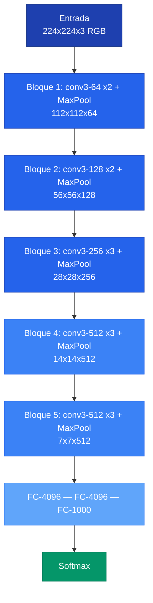
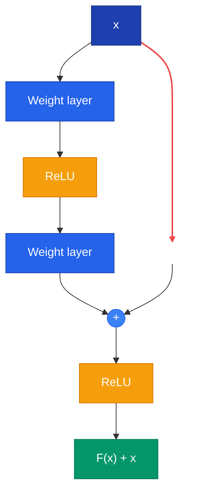

## 1. Contexto

Dado el mismo dataset, distintas arquitecturas de CNN producen resultados muy diferentes. No existe "la mejor arquitectura": la eleccion depende del trade-off entre precision, velocidad y memoria.

| Arquitectura | Ano | Idea central | Parametros | Top-1 ImageNet |
|-------------|-----|-------------|-----------|----------------|
| AlexNet | 2012 | ReLU y Dropout | ~60M | ~56% |
| VGG-16 | 2014 | Profundidad con filtros 3x3 | 138M | ~74% |
| GoogLeNet | 2014 | Modulos Inception + 1x1 conv | ~6.8M | ~69% |
| ResNet-50 | 2016 | Conexiones residuales | ~25M | ~76% |
| ResNet-152 | 2016 | Residuales muy profundos | ~60M | ~77% |

---

## 2. Campo Receptivo (Receptive Field)


El **campo receptivo** de una neurona es la porcion de la imagen de entrada que influencio su activacion. Apilar capas pequenas (3x3) aumenta el campo receptivo sin aumentar proporcionalmente los parametros. Este insight motiva el diseno de VGG.


| Configuracion | Campo Receptivo | Parametros |
|--------------|----------------|------------|
| 1 capa con filtro 5x5 | 5x5 | 25 |
| 2 capas con filtros 3x3 | 5x5 | 18 (28% menos) |

---

## 3. VGG

> Paper: Simonyan & Zisserman (2014). *Very deep convolutional networks for large-scale image recognition.*

### Arquitectura VGG-16



### Key Insight: Filtros 3x3

El filtro 3x3 es el mas pequeno que captura las nociones espaciales esenciales (arriba, abajo, izquierda, derecha, centro). Dos capas de 3x3 logran el mismo campo receptivo que una capa de 5x5, con 28% menos parametros y una no-linealidad extra (ReLU entre capas).

### Ejemplo: Cargar VGG-16 preentrenado



```python
import torchvision.models as models
import torch

# Cargar VGG-16 con pesos preentrenados en ImageNet
vgg16 = models.vgg16(weights=models.VGG16_Weights.IMAGENET1K_V1)
vgg16.eval()

# Reemplazar clasificador para 10 clases (transfer learning)
vgg16.classifier[6] = torch.nn.Linear(4096, 10)

# Congelar capas convolucionales
for param in vgg16.features.parameters():
    param.requires_grad = False

print(f"Parametros totales: {sum(p.numel() for p in vgg16.parameters()):,}")
print(f"Parametros entrenables: {sum(p.numel() for p in vgg16.parameters() if p.requires_grad):,}")
```


```python
import tensorflow as tf

# Cargar VGG-16 con pesos preentrenados en ImageNet
base_model = tf.keras.applications.VGG16(weights="imagenet", include_top=False,
                                          input_shape=(224, 224, 3))
# Congelar capas convolucionales
base_model.trainable = False

# Agregar clasificador para 10 clases (transfer learning)
model = tf.keras.Sequential([
    base_model,
    tf.keras.layers.Flatten(),
    tf.keras.layers.Dense(4096, activation="relu"),
    tf.keras.layers.Dense(10, activation="softmax"),
])

model.summary()
```


```python
import jax
import jax.numpy as jnp
from flax import linen as nn

# Definir bloque convolucional estilo VGG
class VGGBlock(nn.Module):
    features: int
    num_convs: int

    @nn.compact
    def __call__(self, x):
        for _ in range(self.num_convs):
            x = nn.Conv(self.features, (3, 3), padding="SAME")(x)
            x = nn.relu(x)
        # Max pooling 2x2 con stride 2
        x = nn.max_pool(x, (2, 2), strides=(2, 2))
        return x

# Nota: para pesos preentrenados en JAX, usar jax-models o convertir desde PyTorch
```



---

## 4. Inception / GoogLeNet

> Paper: Szegedy et al. (2014). *Going deeper with convolutions.*

### Motivacion

Los objetos en una imagen pueden aparecer a distintas escalas. En lugar de elegir un tamano de filtro, Inception usa **todos al mismo tiempo** y concatena los resultados.

### Modulo Inception con reduccion

Se anaden **convoluciones 1x1 antes** de las 3x3 y 5x5 para reducir canales:

| Caso | Calculo | Parametros |
|------|---------|-----------|
| Sin 1x1 | 192 x 5 x 5 x 32 | 153,600 |
| Con 1x1 (16 intermedios) | 192x1x1x16 + 16x5x5x32 | 15,872 |

**Reduccion: ~90% menos parametros.**

### Average Pooling en lugar de FC

GoogLeNet reemplaza las capas densas finales por **Average Pooling global**: de ~50M parametros en FC a ~1M.

### Clasificadores auxiliares

Las redes profundas sufren de **vanishing gradient**. Inception agrega 2 clasificadores auxiliares en capas intermedias para inyectar gradiente. Solo se usa el clasificador final en inferencia.

---

## 5. ResNet

> Paper: He et al. (2016). *Deep residual learning for image recognition.* CVPR 2016.

### El problema: mas capas no siempre es mejor

Una red de 56 capas tiene **mayor error** que una de 20, tanto en train como en test. No es overfitting, es un problema de **optimizacion**.

### Residual Learning


En lugar de aprender el mapeo $H(x)$ directamente, la red aprende el **residuo** $F(x) = H(x) - x$, de modo que $H(x) = F(x) + x$. Si la identidad es optima, es mas facil llevar $F(x)$ a cero que aprender la identidad completa.


### Bloque Residual



### Bottleneck Block (ResNet-50/101/152)

```text
256-d input
    |
  1x1, 64   <- reduce dimensionalidad
    |
  3x3, 64   <- convolucion espacial
    |
  1x1, 256  <- restaura dimensionalidad
    |
    + (skip connection)
```

### Ejemplo: Bloque Residual



```python
import torch
import torch.nn as nn

class ResidualBlock(nn.Module):
    """Bloque residual basico (ResNet-18/34)"""
    def __init__(self, channels):
        super().__init__()
        self.conv1 = nn.Conv2d(channels, channels, 3, padding=1, bias=False)
        self.bn1 = nn.BatchNorm2d(channels)
        self.conv2 = nn.Conv2d(channels, channels, 3, padding=1, bias=False)
        self.bn2 = nn.BatchNorm2d(channels)
        self.relu = nn.ReLU(inplace=True)

    def forward(self, x):
        residuo = x                        # guardar entrada para skip connection
        out = self.relu(self.bn1(self.conv1(x)))
        out = self.bn2(self.conv2(out))
        out += residuo                     # sumar skip connection
        return self.relu(out)
```


```python
import tensorflow as tf

def bloque_residual(x, filtros):
    """Bloque residual basico (ResNet-18/34)"""
    residuo = x  # guardar entrada para skip connection
    # Primera convolucion + BN + ReLU
    out = tf.keras.layers.Conv2D(filtros, 3, padding="same", use_bias=False)(x)
    out = tf.keras.layers.BatchNormalization()(out)
    out = tf.keras.layers.ReLU()(out)
    # Segunda convolucion + BN
    out = tf.keras.layers.Conv2D(filtros, 3, padding="same", use_bias=False)(out)
    out = tf.keras.layers.BatchNormalization()(out)
    # Sumar skip connection y activar
    out = tf.keras.layers.Add()([out, residuo])
    return tf.keras.layers.ReLU()(out)
```


```python
import jax.numpy as jnp
from flax import linen as nn

class ResidualBlock(nn.Module):
    """Bloque residual basico (ResNet-18/34)"""
    channels: int

    @nn.compact
    def __call__(self, x, train: bool = True):
        residuo = x  # guardar entrada para skip connection
        out = nn.Conv(self.channels, (3, 3), padding="SAME", use_bias=False)(x)
        out = nn.BatchNorm(use_running_average=not train)(out)
        out = nn.relu(out)
        out = nn.Conv(self.channels, (3, 3), padding="SAME", use_bias=False)(out)
        out = nn.BatchNorm(use_running_average=not train)(out)
        return nn.relu(out + residuo)  # sumar skip connection y activar
```



### Decisiones de diseno

- **Batch Normalization** despues de cada capa convolucional
- **Sin Dropout**: la regularizacion la aportan los residuales y el BN

---

## 6. Interpretabilidad

### Por que es importante

Despues de entrenar una CNN, podemos preguntar: **que esta aprendiendo realmente la red?**

| Tecnica | Pregunta que responde |
|---------|----------------------|
| **Feature Visualization** | Que patrones de entrada activan maximamente una parte de la red? |
| **Attribution** | Que region de *esta* imagen es responsable de *esta* prediccion? |

### Feature Visualization

Las redes son diferenciables con respecto a su entrada. Podemos hacer **gradient ascent sobre el input**: actualizar la imagen para maximizar la activacion de un objetivo.

$$x^* = \arg\max_x \; \text{objetivo}(\text{red}(x))$$

Lo que aprende GoogLeNet capa a capa:

| Capas | Tipo de feature |
|-------|----------------|
| conv2d0-2 | Bordes y gradientes basicos |
| mixed3a-3b | Texturas (puntos, lineas) |
| mixed4a-4b | Patrones complejos |
| mixed4b-4c | Partes de objetos (ojos, patas) |
| mixed4d-4e | Objetos reconocibles |

### Attribution

Responde: *que region de esta imagen causo esta prediccion?*

**Caso real de bias:** una red clasificaba "caballo" basandose en el watermark de copyright, no en el caballo.

| Metodo | Tipo | Fortaleza |
|--------|------|-----------|
| Gradient | Backprop | Rapido, sensibilidad local |
| Guided Backprop | Backprop | Filtros mas limpios |
| Grad-CAM | Backprop | Mapas de calor semanticos |
| Occlusion | Perturbacion | Intuitivo, pero lento |
| RISE | Perturbacion | Robusto al ruido |
| Extremal Perturbation | Perturbacion | Mascaras precisas |

### Ejemplo: Grad-CAM



```python
import torch
import torchvision.models as models
import torchvision.transforms as T
from PIL import Image

# Cargar modelo y preparar imagen
model = models.resnet50(weights=models.ResNet50_Weights.IMAGENET1K_V1)
model.eval()
img = T.Compose([T.Resize(224), T.CenterCrop(224), T.ToTensor(),
    T.Normalize([0.485,0.456,0.406],[0.229,0.224,0.225])])(Image.open("gato.jpg")).unsqueeze(0)

# Capturar activaciones y gradientes de la ultima capa conv
activaciones, gradientes = None, None
def hook_fw(m, i, o): global activaciones; activaciones = o.detach()
def hook_bw(m, i, o): global gradientes; gradientes = o[0].detach()
model.layer4[-1].register_forward_hook(hook_fw)
model.layer4[-1].register_full_backward_hook(hook_bw)

# Forward + backward sobre la clase predicha
out = model(img)
clase = out.argmax(1).item()
out[0, clase].backward()

# Calcular mapa de calor Grad-CAM
pesos = gradientes.mean(dim=[2, 3], keepdim=True)  # promedio espacial
cam = (pesos * activaciones).sum(dim=1, keepdim=True).relu()
cam = cam / cam.max()  # normalizar entre 0 y 1
```


```python
import tensorflow as tf
import numpy as np

# Cargar modelo preentrenado
model = tf.keras.applications.ResNet50(weights="imagenet")
# Crear modelo que retorna activaciones de la ultima capa conv
grad_model = tf.keras.Model(inputs=model.input,
    outputs=[model.get_layer("conv5_block3_out").output, model.output])

# Preparar imagen
img = tf.keras.preprocessing.image.load_img("gato.jpg", target_size=(224, 224))
img_array = tf.expand_dims(tf.keras.applications.resnet50.preprocess_input(
    tf.keras.preprocessing.image.img_to_array(img)), 0)

# Calcular gradientes respecto a la clase predicha
with tf.GradientTape() as tape:
    activaciones, predicciones = grad_model(img_array)
    clase = tf.argmax(predicciones[0])
    loss = predicciones[:, clase]
gradientes = tape.gradient(loss, activaciones)

# Mapa de calor Grad-CAM
pesos = tf.reduce_mean(gradientes, axis=(1, 2))  # promedio espacial
cam = tf.nn.relu(tf.reduce_sum(activaciones * pesos[:, tf.newaxis, tf.newaxis, :], axis=-1))
cam = cam / tf.reduce_max(cam)  # normalizar entre 0 y 1
```


```python
import jax
import jax.numpy as jnp

def grad_cam(apply_fn, params, img, capa_objetivo, clase):
    """Grad-CAM generico para modelos JAX/Flax"""
    # Funcion que retorna el logit de la clase objetivo
    def logit_clase(params, img):
        # Obtener activaciones intermedias y salida
        activaciones, logits = apply_fn(params, img, capture_intermediates=True)
        return logits[0, clase], activaciones[capa_objetivo]

    # Gradiente del logit respecto a las activaciones
    (_, activaciones), grad_fn = jax.value_and_grad(logit_clase, has_aux=True)
    grads = grad_fn(params, img)

    # Promedio espacial de gradientes -> pesos por canal
    pesos = jnp.mean(grads, axis=(1, 2))
    # Combinacion ponderada + ReLU
    cam = jnp.maximum(jnp.sum(activaciones * pesos[None, None, :], axis=-1), 0)
    return cam / jnp.max(cam)  # normalizar entre 0 y 1
```



### Perturbacion Extremal

Aprender una mascara de tamano fijo $m$ que preserve maximamente la salida de la red:

$$\arg\max_m \; \Phi(m \otimes x) \quad \text{sujeto a: } \text{area}(m) = a$$

> "Si solo te dejo ver una pequena region de la imagen, que region elegiria la red para reconocer mejor el objeto?"
