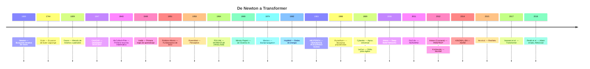
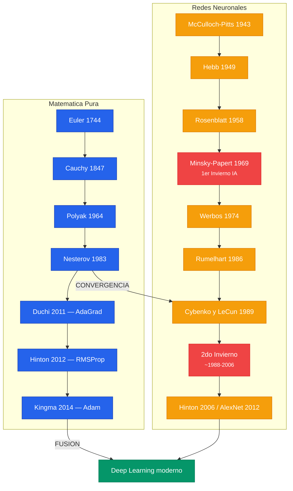

> Este documento traza la linea historica completa: desde el calculo de Euler y Lagrange
> en el siglo XVIII, pasando por Cauchy inventando gradient descent en 1847 para astronomia,
> hasta Adam en 2015. Cada idea nacio como solucion a un problema concreto de su epoca.

---

# Parte I: Las Raices Matematicas (1669-1964)

---

## 1. Newton y la Busqueda de Raices (1669)

Isaac Newton describio un metodo iterativo para encontrar raices de polinomios en *De analysi* (escrito 1669, publicado 1711).

### El metodo Newton-Raphson

Para encontrar la raiz de $g(x) = 0$:

$$x^{(k+1)} = x^{(k)} - \frac{g(x^{(k)})}{g'(x^{(k)})}$$

### Conexion con la optimizacion

Para **minimizar** $f(x)$, aplicando Newton-Raphson a $g(x) = f'(x)$:

$$x^{(k+1)} = x^{(k)} - \frac{f'(x^{(k)})}{f''(x^{(k)})}$$

### Version multivariada

$$x^{(k+1)} = x^{(k)} - [H(x^{(k)})]^{-1} \nabla f(x^{(k)})$$

Donde $H$ es la **matriz Hessiana**: $H_{ij} = \frac{\partial^2 f}{\partial x_i \partial x_j}$.

**Convergencia cuadratica** cerca de la solucion: $\|x^{(k+1)} - x^*\| \leq C \|x^{(k)} - x^*\|^2$, pero cada iteracion cuesta $O(n^3)$ -- impracticable para redes neuronales con millones de parametros.

---

## 2. Euler, Lagrange y el Calculo de Variaciones (1744-1788)

### El problema que inicio todo

**Johann Bernoulli (1696)** planteo el **problema de la braquistocrona**: encontrar la curva de descenso mas rapido bajo gravedad entre dos puntos. Este problema lanzo el campo del calculo de variaciones.

### La pregunta fundamental

Entre todas las funciones $y(x)$ que satisfacen ciertas condiciones, cual minimiza un **funcional**?

$$J[y] = \int_a^b L(x, y(x), y'(x)) \, dx$$

### La Ecuacion de Euler-Lagrange


\frac{\partial L}{\partial y} - \frac{d}{dx}\frac{\partial L}{\partial y'} = 0


| Dimension finita | Dimension infinita |
|---|---|
| Variable $x \in \mathbb{R}^n$ | Funcion $y(x)$ |
| Funcion $f(x)$ | Funcional $J[y]$ |
| $\nabla f = 0$ | Ecuacion de Euler-Lagrange |
| Gradient descent | Flujo de gradiente |

Conexiones modernas: Neural ODEs, transporte optimo, Physics-Informed Neural Networks (PINNs).

---

## 3. Gauss y los Minimos Cuadrados (1809)

Gauss desarrollo el **metodo de minimos cuadrados** en *Theoria motus corporum coelestium* (1809), motivado por determinar orbitas planetarias.

$$S(\theta) = \frac{1}{2} \sum_{i=1}^{m} r_i(\theta)^2 = \frac{1}{2} \|r(\theta)\|^2$$

donde $r_i(\theta) = y_i - \hat{y}(t_i; \theta)$ son los **residuos**.

La funcion de costo MSE usada en redes neuronales es exactamente el metodo de Gauss. La matematica es la misma -- lo que cambio es la escala y la complejidad del modelo.

---

## 4. Cauchy y el Nacimiento del Gradient Descent (1847)

### El paper que lo empezo todo

Augustin-Louis Cauchy publico **"Methode generale pour la resolution des systemes d'equations simultanees"** en *Comptes Rendus de l'Academie des Sciences* (1847). Solo 3 paginas que cambiaron la historia de la optimizacion.

### La reformulacion clave

Su insight: **convertir busqueda de raices en minimizacion**:

$$F(x_1, \ldots, x_n) = \sum_{i=1}^{m} f_i(x_1, \ldots, x_n)^2$$

### El metodo iterativo de Cauchy


x^{(k+1)} = x^{(k)} - \alpha \nabla F(x^{(k)})



**La ecuacion de Cauchy de 1847 es, en esencia, exactamente lo que `loss.backward(); optimizer.step()` hace en PyTorch hoy.** Este fue el primer algoritmo explicito de optimizacion iterativa usando informacion de derivadas.


### Ejemplo: La ecuacion de Cauchy (1847) en codigo moderno



```python
import torch

# La ecuacion de Cauchy: x^(k+1) = x^(k) - alpha * grad F(x^(k))
# Minimizar F(x) = x^2 + 4*sin(x) -- exactamente lo que loss.backward() + step() hace

x = torch.tensor([5.0], requires_grad=True)
alpha = 0.1  # Paso de Cauchy

for k in range(50):
    F = x**2 + 4 * torch.sin(x)  # Funcion objetivo
    F.backward()                   # Calcular gradiente (dF/dx)
    with torch.no_grad():
        x -= alpha * x.grad       # Regla de Cauchy: x = x - alpha * grad
    x.grad.zero_()
    if k % 10 == 0:
        print(f"Iter {k:3d}: x = {x.item():.4f}, F(x) = {F.item():.4f}")
```


```python
import tensorflow as tf

# La ecuacion de Cauchy implementada con GradientTape
x = tf.Variable([5.0])
alpha = 0.1

for k in range(50):
    with tf.GradientTape() as tape:
        F = x**2 + 4 * tf.sin(x)  # Funcion objetivo
    grad = tape.gradient(F, x)      # Gradiente dF/dx
    x.assign_sub(alpha * grad)      # Regla de Cauchy: x = x - alpha * grad
    if k % 10 == 0:
        print(f"Iter {k:3d}: x = {x.numpy()[0]:.4f}, F(x) = {F.numpy()[0]:.4f}")
```


```python
import jax
import jax.numpy as jnp

# La ecuacion de Cauchy con diferenciacion automatica de JAX
def F(x):
    return x**2 + 4 * jnp.sin(x)

grad_F = jax.grad(F)  # JAX genera la funcion gradiente automaticamente
x = 5.0
alpha = 0.1

for k in range(50):
    x = x - alpha * grad_F(x)  # Regla de Cauchy: x = x - alpha * grad
    if k % 10 == 0:
        print(f"Iter {k:3d}: x = {x:.4f}, F(x) = {F(x):.4f}")
```



---

## 5. Demostracion: Por que el Negativo del Gradiente es la Direccion Optima

### Teorema

Entre todos los vectores unitarios $d$ con $\|d\| = 1$, la derivada direccional $D_d f(x)$ es minimizada cuando $d = -\nabla f(x) / \|\nabla f(x)\|$.

### Demostracion

**Paso 1 -- Derivada direccional:**

$$D_d f(x) = \nabla f(x)^T d$$

**Paso 2 -- Cauchy-Schwarz:**

$$|\nabla f(x)^T d| \leq \|\nabla f(x)\| \cdot \|d\| = \|\nabla f(x)\|$$

**Paso 3 -- Alcanzar la cota inferior:**

$$d^* = -\frac{\nabla f(x)}{\|\nabla f(x)\|} \qquad \blacksquare$$

---

## 6. Metodos de Segundo Orden

### Gauss-Newton

$$\theta^{(k+1)} = \theta^{(k)} - (J^T J)^{-1} J^T r$$

### Levenberg-Marquardt (1944/1963)

$$\theta^{(k+1)} = \theta^{(k)} - (J^T J + \lambda I)^{-1} J^T r$$

$\lambda$ interpola entre Gauss-Newton ($\lambda \to 0$) y gradient descent ($\lambda \to \infty$).

### BFGS y L-BFGS (1970)

Aproxima $H^{-1}$ iterativamente usando solo informacion de gradientes, reduciendo almacenamiento de $O(n^2)$ a $O(mn)$.

---

## 7. Multiplicadores de Lagrange y Optimizacion Restringida

**Problema:** Minimizar $f(x)$ sujeto a $g_i(x) = 0$.

**Lagrangiano:**

$$\mathcal{L}(x, \lambda) = f(x) + \sum_{i=1}^{m} \lambda_i g_i(x)$$

### Condiciones KKT (para desigualdades)

1. **Estacionariedad:** $\nabla f + \sum_i \mu_i \nabla g_i = 0$
2. **Factibilidad primal:** $g_i(x^*) \leq 0$
3. **Factibilidad dual:** $\mu_i \geq 0$
4. **Holgura complementaria:** $\mu_i g_i(x^*) = 0$

---

# Parte II: El Nacimiento de las Redes Neuronales (1943-1989)

---

## 9. McCulloch-Pitts: La Primera Neurona Matematica (1943)

$$y = \Theta\left(\sum_i w_i x_i - T\right)$$

Demostraron que redes de estas neuronas pueden computar **cualquier proposicion de logica proposicional**. Pero los pesos eran fijos -- no habia algoritmo de aprendizaje.

---

## 10. Hebb: La Primera Regla de Aprendizaje (1949)

$$\Delta w_{ij} = \eta \cdot x_i \cdot y_j$$

Regla **no-supervisada basada en correlacion**: fortalece conexiones entre neuronas simultaneamente activas. Pero es **inestable** -- los pesos crecen sin limite.

---

## 11. Robbins-Monro: Los Cimientos de SGD (1951)

$$\theta_{n+1} = \theta_n - a_n \cdot Y_n(\theta_n)$$

### Condiciones de convergencia

$$\sum_n a_n = \infty \qquad \text{y} \qquad \sum_n a_n^2 < \infty$$

La primera condicion asegura poder alcanzar $\theta^*$ desde cualquier punto. La segunda asegura que el ruido se promedia.


**SGD es una aplicacion directa de Robbins-Monro.** Los learning rate schedules estan motivados por estas condiciones: un LR constante viola $\sum a_n^2 < \infty$ y previene convergencia exacta.


### Ejemplo: Condiciones de Robbins-Monro en SGD moderno



```python
import torch

# Las condiciones de Robbins-Monro: sum(a_n) = inf, sum(a_n^2) < inf
# Ejemplo: a_n = 1/n satisface ambas condiciones
# Un LR constante viola sum(a_n^2) < inf -> no converge exactamente

def lr_robbins_monro(n):
    """Learning rate que cumple condiciones de Robbins-Monro."""
    return 1.0 / (1.0 + n)  # sum(1/n) = inf, sum(1/n^2) = pi^2/6 < inf

# Demostrar convergencia: minimizar f(x) = (x - 3)^2 con ruido
x = torch.tensor([10.0])
for n in range(1, 201):
    ruido = torch.randn(1) * 0.5          # Gradiente ruidoso (estocastico)
    grad = 2 * (x - 3) + ruido            # Gradiente real + ruido
    lr = lr_robbins_monro(n)
    x = x - lr * grad                     # Paso de Robbins-Monro
    if n % 50 == 0:
        print(f"n={n:3d}, lr={lr:.4f}, x={x.item():.4f} (optimo=3.0)")
```


```python
import tensorflow as tf

# Schedule que cumple condiciones de Robbins-Monro: a_n = 1/(1+n)
schedule_rm = tf.keras.optimizers.schedules.InverseTimeDecay(
    initial_learning_rate=1.0,
    decay_steps=1,
    decay_rate=1.0  # lr = 1.0 / (1 + n) -> cumple Robbins-Monro
)

# Verificar que el schedule cumple las condiciones
suma_lr = 0.0
suma_lr2 = 0.0
for n in range(1, 10001):
    lr = schedule_rm(n).numpy()
    suma_lr += lr
    suma_lr2 += lr ** 2

print(f"sum(a_n) = {suma_lr:.2f} (debe diverger -> inf)")
print(f"sum(a_n^2) = {suma_lr2:.4f} (debe converger < inf)")
# LR constante: sum(a^2) = N*a^2 -> diverge, viola Robbins-Monro
```


```python
import jax
import jax.numpy as jnp
from jax import random

# Robbins-Monro: theta_{n+1} = theta_n - a_n * Y_n(theta_n)
# con a_n = 1/(1+n), Y_n es observacion ruidosa del gradiente

def paso_robbins_monro(x, n, key):
    """Un paso del algoritmo de Robbins-Monro."""
    ruido = random.normal(key) * 0.5
    grad_ruidoso = 2 * (x - 3) + ruido   # Gradiente estocastico
    lr = 1.0 / (1.0 + n)                 # Cumple ambas condiciones
    return x - lr * grad_ruidoso

x = 10.0
key = random.PRNGKey(42)
for n in range(1, 201):
    key, subkey = random.split(key)
    x = paso_robbins_monro(x, n, subkey)
    if n % 50 == 0:
        print(f"n={n:3d}, lr={1/(1+n):.4f}, x={x:.4f} (optimo=3.0)")
```



---

## 12. Rosenblatt y el Perceptron (1958)

$$y = \text{sign}(w \cdot x + b)$$

### Teorema de Convergencia

Si los datos son linealmente separables con margen $\gamma$ y radio $R$, el numero de actualizaciones es finito: $k \leq R^2 / \gamma^2$.

---

## 13. Minsky-Papert: El Invierno de la IA (1969)

### Demostracion de no-separabilidad lineal del XOR

Las cuatro restricciones del perceptron llevan a $b > 0$ y $b \leq 0$ simultaneamente -- **contradiccion**. Esto contribuyo al **primer invierno de la IA** (~1969-1982).

---

## 14. Werbos: Backpropagation (1974)

Formulo la regla de la cadena aplicada sistematicamente en orden reverso a traves de un grafo computacional. Costo: $O(W)$ donde $W$ es el numero de pesos, versus $O(W^2)$ para derivadas por separado.

---

## 15. Hopfield y la Fisica Estadistica (1982)

Funcion de energia: $E = -\frac{1}{2} \sum_i \sum_j w_{ij} s_i s_j + \sum_i \theta_i s_i$

Bajo actualizaciones asincronas, la energia es monotonamente no-creciente -- la red converge a un minimo local = memoria almacenada.

---

## 16. Rumelhart, Hinton, Williams: La Popularizacion (1986)

Reemplazaron la funcion escalon con el **sigmoid** $\sigma(z) = 1/(1+e^{-z})$, haciendo la red **diferenciable de extremo a extremo**. Demostraron empiricamente que backpropagation podia aprender representaciones internas (XOR resuelto trivialmente por una red 2-2-1).

---

## 17. Teorema de Aproximacion Universal (1989-1991)

Para cualquier $f \in C(I_n)$ y $\epsilon > 0$, existen parametros tales que:

$$\left|\sum_{j=1}^{N} \alpha_j \sigma(w_j^T x + b_j) - f(x)\right| < \epsilon \quad \forall x \in I_n$$

Garantiza **existencia**, no construccion. La profundidad logra compresion exponencial -- motivacion teorica para deep learning.

---

## 18. LeCun y las Redes Convolucionales (1989)

La convolucion explota dos priors sobre datos visuales: **conectividad local** y **equivarianza traslacional**. Reduce parametros de ~$10^6$ a 25 por filtro (5x5).

---

# Parte III: La Evolucion de los Optimizadores (1964-2018)

---

## 19. Polyak y el Heavy Ball (1964)

$$x_{k+1} = x_k - \alpha \nabla f(x_k) + \beta (x_k - x_{k-1})$$

Requiere $O(\sqrt{\kappa})$ iteraciones vs $O(\kappa)$ para gradient descent. Si $\kappa = 10{,}000$: GD necesita ~10,000 iteraciones, Heavy Ball ~100.

---

## 20. Nesterov y la Aceleracion Optima (1983)

Solo 4 paginas -- uno de los papers mas influyentes en teoria de optimizacion.


\begin{aligned}
y_k &= x_k + \frac{k-1}{k+2}(x_k - x_{k-1}) \\
x_{k+1} &= y_k - \frac{1}{L} \nabla f(y_k)
\end{aligned}


### Tasa de convergencia

$$f(x_k) - f(x^*) \leq \frac{2L \|x_0 - x^*\|^2}{(k+1)^2} = O(1/k^2)$$

Nemirovski y Yudin (1983) demostraron que $O(1/k^2)$ es la **cota inferior** para metodos de primer orden. **Nesterov iguala esta cota** -- ningun metodo de primer orden puede hacerlo asintoticamente mejor.

---

## 21. Momentum como Ecuacion Diferencial

### La ODE de Nesterov (Su, Boyd, Candes, 2016)

$$X'' + \frac{3}{t} X' + \nabla f(X) = 0$$

Los tres terminos: **aceleracion** (inercia), **amortiguamiento** dependiente del tiempo (friccion decreciente), y **fuerza restauradora** del potencial $f$.

### Contraste con Polyak

Polyak corresponde a friccion constante: $X'' + \gamma X' + \nabla f(X) = 0$.

---

## 22. AdaGrad: Learning Rates Adaptativos (2011)

Duchi, Hazan, Singer. Motivado por features sparse en NLP: features raros deberian tener learning rates mas altos.

**El defecto fatal:** $G_t$ solo acumula -- el learning rate efectivo $\eta / \sqrt{G_t} \to 0$ cuando $t \to \infty$.

---

## 23. RMSProp: Nacido en una Clase de Coursera (2012)

RMSProp **nunca fue publicado en un paper peer-reviewed**. Geoffrey Hinton lo introdujo en la Lectura 6.5 de su curso de Coursera.

$$E[g^2]_t = \rho \, E[g^2]_{t-1} + (1 - \rho) g_t^2$$

$$\theta_{t+1} = \theta_t - \frac{\eta}{\sqrt{E[g^2]_t + \epsilon}} g_t$$

La EMA da una **ventana deslizante**: a diferencia de AdaGrad, el learning rate no decae a cero.

---

## 24. Adam: Momentos Adaptativos (2014)

**Primer momento** $m_t$ = EMA de gradientes = **momentum**. **Segundo momento** $v_t$ = EMA de gradientes al cuadrado = **learning rate adaptativo estilo RMSProp**.

### Correccion de sesgo

$$\mathbb{E}[m_t] = \mathbb{E}[g_t] \cdot (1 - \beta_1^t)$$

Dividir por $(1 - \beta_1^t)$ da el estimador insesgado $\hat{m}_t$.

### El problema de convergencia (Reddi et al., 2018)

Mostraron que la demostracion original esta errada y construyeron un contraejemplo donde Adam converge a $x = +1$ cuando el optimo es $x^* = -1$. La EMA en $v_t$ puede decrecer, violando la condicion de learning rate no-creciente.


**Adam puede diverger** cuando $\beta_1 < \sqrt{\beta_2}$ (los defaults satisfacen esto: $0.9 < \sqrt{0.999} \approx 0.9995$). AMSGrad corrige esto asegurando que el denominador nunca decrece, pero empiricamente rara vez supera a Adam.


---

## 25. Los Breakthroughs que Terminaron el Invierno de la IA

| Ano | Breakthrough | Contribucion |
|---|---|---|
| 2006 | Deep Belief Networks (Hinton) | Pretraining no-supervisado |
| 2010 | ReLU (Nair & Hinton) | Derivada = 1, sin vanishing gradient |
| 2012 | AlexNet | CNN profunda en GPUs gano ImageNet |
| 2015 | Batch Normalization | Permite LR mas altos |
| 2015 | ResNets (He et al.) | Skip connections: $\frac{\partial L}{\partial x} = \frac{\partial L}{\partial y}(\frac{\partial F}{\partial x} + I)$ |
| 2015 | Adam (Kingma & Ba) | Momentum + adaptividad |
| 2017 | Transformer (Vaswani et al.) | Atencion es todo lo que necesitas |

---

## 26. El Gran Debate: Adam vs SGD

| Aspecto | Pro-SGD | Pro-Adam |
|---|---|---|
| Generalizacion | Minimos "planos" | Converge mas rapido |
| Tuning | Requiere mas tuning de LR | Funciona "out of the box" |
| Arquitecturas | Mejor para CNNs | **Esencial** para Transformers |

**Resolucion moderna:** La **arquitectura y la tarea** importan mas que el optimizador aislado. CNNs en vision: SGD. Transformers/NLP: Adam/AdamW.

---

## Linea de Tiempo Completa



---

## El Arco Narrativo



La historia muestra un patron recurrente:
1. **La teoria matematica establece lo posible**
2. **Las limitaciones practicas se identifican**
3. **Breakthroughs algoritmicos/ingenieriles las superan**

Cada generacion construyo directamente sobre los fundamentos de sus predecesores. La ecuacion de Cauchy de 1847 sigue siendo el corazon de todo.
