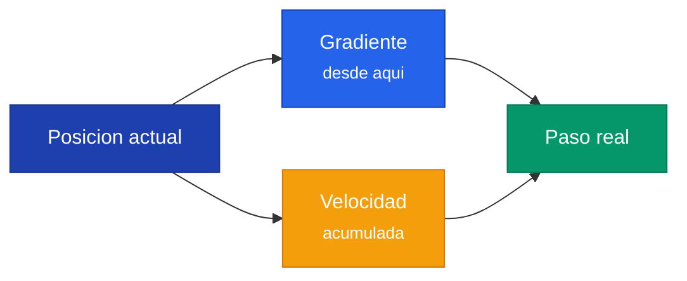
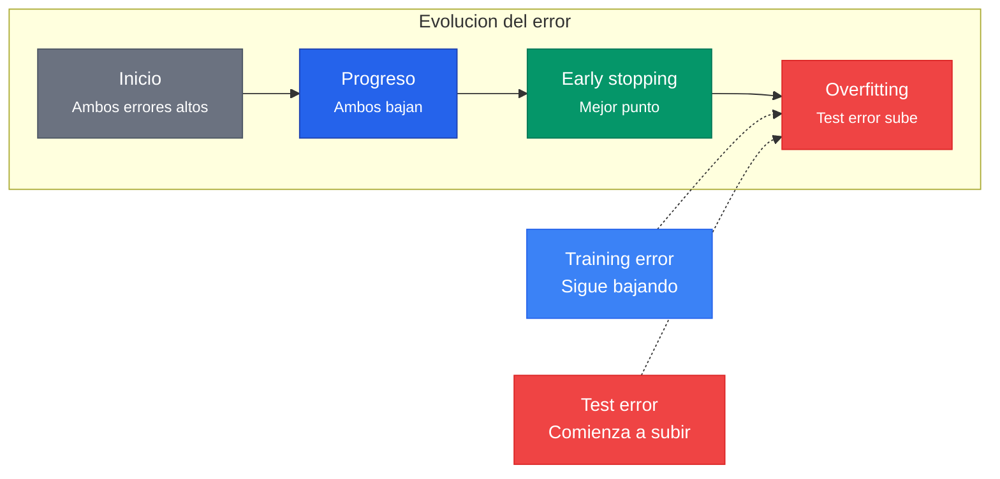

## 1. Motivacion y Contexto

### El problema fundamental

Dado un conjunto de datos (ej: imagenes de animales), queremos que un **modelo** aprenda a clasificarlos en un **espacio distribuido** donde cada clase (label) quede separada de las demas. El modelo toma los datos de entrada y los mapea a un espacio de representaciones donde las distintas clases forman clusters separables.

### La funcion de perdida

La **funcion de perdida** (loss function) evalua que tan bien el algoritmo modela un conjunto de datos. Mide el **error** entre la salida del modelo y la salida esperada. El proceso iterativo busca reducir progresivamente esta perdida hasta lograr una buena separacion.


### Forward Pass y Backpropagation

El flujo basico de una red neuronal es:

```
x (input) --> [x W] (multiplicacion por pesos) --> [+ b] (suma del bias) --> y (output)
```

- **Forward pass**: Los datos pasan por la red para obtener una prediccion.
- **Error**: La diferencia entre el valor predicho y el real.
- **Mision**: Disminuir el error **ajustando los pesos** de cada nodo.
- **Como**: Los cambios se propagan hacia atras (**backpropagation**) usando derivadas parciales.
- Como los pesos son vectores, las derivadas parciales se llaman **gradientes**.


### Convergencia vs Divergencia

Un concepto clave ilustrado con la funcion $f(x) = x^2 \sin(x)$:

| | Convergencia | Divergencia |
|---|---|---|
| **Step coefficient** | 0.005 (pequeno) | 0.05 (grande) |
| **Comportamiento** | Descenso suave al minimo | Oscilaciones erraticas |
| **Resultado** | Llega al optimo (4.9, -23.7) | Se aleja del optimo (5.4, -22.1) |



**Leccion clave**: El tamano del paso (step coefficient / learning rate) determina si el proceso converge o diverge.


---

## 2. Concepto de Optimizacion

### Objetivo

El objetivo de un algoritmo de optimizacion es **modificar los pesos del modelo** para **minimizar** la funcion de perdida. Estos algoritmos son **iterativos**: dan pasos que acercan la solucion a un optimo en cada iteracion.

### Funcion objetivo

La funcion que queremos minimizar se compone de dos partes:

$$L(W) = \mathcal{L}(f(x), y; W) + \alpha \Omega(W)$$

Donde:
- $\mathcal{L}(f(x), y; W)$ = **Funcion de perdida**: mide el error entre la prediccion $f(x)$ y el valor real $y$, parametrizada por los pesos $W$
- $\alpha \Omega(W)$ = **Regularizador**: penaliza la complejidad del modelo (previene overfitting)

### El gradiente como brujula

- La **derivada** nos entrega la **pendiente** de una funcion en un punto.
- El **gradiente** es la generalizacion multidimensional: nos indica la **direccion** en la cual debemos mover los pesos para acercarnos al optimo.

### Regla de actualizacion fundamental


w_i^{new} = w_i^{old} - \eta \frac{\partial L}{\partial w_i}


Donde:
- $w_i^{new}$ = nuevo valor del peso
- $w_i^{old}$ = valor actual del peso
- $\eta$ = **learning rate** (tasa de aprendizaje)
- $\frac{\partial L}{\partial w_i}$ = el **gradiente** (derivada parcial de la perdida respecto al peso)

El signo **negativo** es crucial: nos movemos en la direccion **opuesta** al gradiente (que apunta hacia arriba), para descender hacia el minimo.

> **Intuicion**: El gradiente apunta en la direccion de mayor crecimiento. Para minimizar, nos movemos en la direccion contraria.

---

## 3. Gradiente Descendente (GD)

### Algoritmo clasico

En Gradient Descent (GD), calculamos la funcion de perdida considerando **todos** los elementos del set de entrenamiento:

$$L(W) = \sum_{n} \mathcal{L}(f(x_n), y_n; W) + \alpha \Omega(W)$$

Donde $n$ recorre **todos los datos** del dataset.

### Regla de actualizacion

$$w_i^{new} = w_i^{old} - \eta \frac{\partial L}{\partial w_i}$$

La perdida se calcula sobre el dataset completo, y luego se actualiza una vez.

### Problema fundamental

**El paso ($\eta$) importa enormemente:**
- Si $\eta$ es muy grande: los pasos sobredimensionados saltan el minimo (divergencia)
- Si $\eta$ es muy pequeno: convergencia extremadamente lenta
- Ademas, con datasets grandes, calcular el gradiente sobre todos los datos en cada iteracion es **muy costoso computacionalmente**

---

## 4. Descenso de Gradiente Estocastico (SGD)

### Motivacion

Si el dataset es muy grande, GD clasico es prohibitivamente lento porque:
- Cada iteracion requiere pasar por **todo** el dataset
- Se hacen demasiados calculos por cada actualizacion de pesos

### Solucion: Mini-batches

SGD muestrea **subconjuntos** de datos llamados **batches**:

$$L(W) = \sum_{n'} \mathcal{L}(f(x_{n'}), y_{n'}; W) + \alpha \Omega(W)$$

Ahora $n'$ es un **minibatch** (subconjunto pequeno) en vez de todos los datos.

### Conceptos clave: Epoca vs Iteracion

| Concepto | Definicion |
|---|---|
| **Epoca** | Un ciclo completo donde el modelo pasa por **todo** el set de datos |
| **Iteracion** | Una actualizacion de pesos usando un **batch** |
| **Batch size** | Tamano del subconjunto de datos por iteracion |

**Ejemplo concreto**:
- Dataset: 1000 datos
- Batch size = 100
- Iteraciones por epoca = 1000 / 100 = **10 iteraciones**
- Batch size = 500 -> 2 iteraciones por epoca
- Batch size = 1000 (todo el dataset) -> 1 iteracion por epoca = GD clasico

### SGD vs GD visualmente

En una superficie de perdida con curvas de nivel (contour plot):
- **GD** (negro): camino directo y suave hacia el minimo
- **SGD** (rojo): camino mas erratico y zigzagueante, pero eventualmente llega


La naturaleza estocastica introduce **ruido**, lo cual puede ser beneficioso para escapar de minimos locales.

---

## 5. Problemas de SGD

SGD tiene tres problemas principales:

### 5.1 Saddle Points (Puntos de Silla)

Un saddle point es un punto donde el gradiente es cero pero **no es un minimo**. La superficie sube en una direccion y baja en otra. SGD puede quedarse "atascado" en estos puntos porque el gradiente es muy pequeno o nulo.

### 5.2 Optimos Locales

La funcion de perdida puede tener multiples minimos. SGD puede converger a un **minimo local** en vez del **minimo global** (el verdadero optimo).

### 5.3 Tamano de los Pasos

El gradiente determina la **direccion**, pero el **tamano del paso** depende del learning rate $\eta$:

- **Learning rate grande**: pasos grandes que pueden saltar sobre el minimo
- **Learning rate pequeno**: pasos diminutos que convergen muy lentamente


---

## 6. Learning Rate

### El dilema central

$$w_i^{new} = w_i^{old} - \underbrace{\eta}_{\text{learning rate}} \cdot \frac{\partial L}{\partial w_i}$$

### Comportamiento segun el valor de $\eta$

| Learning Rate | Comportamiento | Loss vs Epoch |
|---|---|---|
| **Muy alto** | Diverge, la loss sube | Curva ascendente |
| **Alto** | Converge rapido al inicio, luego oscila | Plateau alto |
| **Bajo** | Converge muy lentamente | Baja gradualmente |
| **Bueno** | Converge rapido y llega a un buen minimo | Baja rapido y se estabiliza |

---

## 7. SGD con Momentum

### Motivacion

El gradiente de SGD depende solo del **batch actual**, lo cual genera variabilidad: diferentes grupos de datos pueden producir gradientes muy distintos.

### Idea central

Momentum agrega la idea de **mantener la direccion** del gradiente, incorporando **historia** de como se ha movido en el pasado. Es analogo al momentum fisico: un objeto en movimiento tiende a mantener su direccion.

### Formulas

**Sin momentum (SGD clasico):**

$$w_{t+1} = w_t - \eta \nabla f(x_t)$$

**Con momentum:**


v_{t+1} = \rho \, v_t + \nabla f(x_t) \quad \text{(velocidad acumulada)}


$$w_{t+1} = w_t - \eta \, v_{t+1}$$

Donde:
- $v_{t+1}$ = velocidad (momentum acumulado)
- $\rho$ = coeficiente de momentum (tipicamente 0.9)
- $\nabla f(x_t)$ = gradiente actual

### Ejemplo numerico (1 dimension, $\rho = 0.1$)

| Batch | Gradiente | $v_{t+1} = \rho \cdot v_t + \text{gradiente}$ | Calculo |
|---|---|---|---|
| Batch 1 | -2 | -2 | $0.1 \times 0 + (-2) = -2$ |
| Batch 2 | -4 | -4.2 | $0.1 \times (-2) + (-4) = -4.2$ |
| Batch 3 | -3 | -3.42 | $0.1 \times (-4.2) + (-3) = -3.42$ |
| Batch 4 | 2 | 1.658 | $0.1 \times (-3.42) + 2 = 1.658$ |

**Observaciones:**
- Cuando los gradientes mantienen la misma direccion (batches 1-3), el momentum **amplifica** el paso
- Cuando el gradiente cambia de direccion (batch 4), el momentum **amortigua** el cambio

### Efecto visual


- **SGD sin momentum**: oscilaciones en zigzag alrededor del camino optimo
- **SGD con momentum**: trayectoria mas suave y directa hacia el minimo

---

## 8. Nesterov Accelerated Gradient (NAG)

### Idea fundamental

Nesterov es una variante "predictiva" del momentum. En vez de calcular el gradiente en la posicion actual, **primero se mueve** en la direccion del momentum y **luego** calcula el gradiente desde esa posicion avanzada.

### Analogia

- **Momentum clasico**: Es como una bola bajando un cerro que no sabe que hay mas abajo (ciega)
- **Nesterov**: Es como un esquiador que **mira hacia adelante** para frenar antes de una curva cerrada

### Formulas (3 pasos)


\begin{aligned}
w_t' &= w_t - \rho \, v_t & \text{(mirar adelante)} \\
v_{t+1} &= \rho \, v_t - \alpha \frac{\partial L}{\partial w_t'} & \text{(correccion)} \\
w_{t+1} &= w_t + v_{t+1} & \text{(update final)}
\end{aligned}



---

## 9. Comparacion Momentum vs Nesterov

### Diferencia grafica

**Momentum clasico:**



**Nesterov:**


### Tabla comparativa

| Caracteristica | Momentum Clasico | Nesterov (NAG) |
|---|---|---|
| **Punto de calculo** | Posicion **actual** | Posicion **predecida** |
| **Comportamiento** | Bola ciega bajando | Esquiador que mira adelante |
| **Convergencia** | Rapida, puede **oscilar** | Mas **estable** cerca del optimo |
| **Ventaja** | Simple, efectivo | Mejor control cerca del optimo |

---

## 10. Adaptive Gradient (AdaGrad)

### Motivacion

En SGD (con o sin momentum), **todos los pesos** comparten el **mismo learning rate**. Pero en la realidad:
- Algunos pesos necesitan actualizaciones grandes (features poco frecuentes)
- Otros necesitan actualizaciones pequenas (features frecuentes)

### Idea central

AdaGrad da a **cada peso su propio learning rate** que se adapta segun la historia de sus gradientes.

### Formulas


\eta_{w^i} = \frac{\eta}{\sqrt{\sum_{j=1}^{t} G_j^2}}


$$w_t^i = w_{t-1}^i - \eta_{w^i} \frac{\partial L}{\partial w^i}$$

### Efecto de normalizacion

- **Gradientes grandes** -> denominador grande -> learning rate **reducido** (se frena)
- **Gradientes pequenos** -> denominador pequeno -> learning rate **acelerado** (se impulsa)

### Problema de AdaGrad

El denominador $\sqrt{\sum G_j^2}$ **siempre crece** (es una suma de cuadrados). Esto significa que el learning rate **tiende a cero** con el tiempo, y el entrenamiento puede **detenerse prematuramente**.

> Este problema motivo el desarrollo de RMSProp y eventualmente Adam.

---

## 11. Adaptive Moments (Adam)

### Motivacion

Adam combina lo mejor de dos mundos:
- **Momentum** de SGD (suavizado de gradientes usando primer momento)
- **Escalamiento adaptativo** de AdaGrad (learning rate por parametro usando segundo momento)

### Estructura de la formula


w_i^t = w_i^{t-1} - \eta \frac{\hat{r}_t}{\sqrt{\hat{v}_t} + \epsilon}


### Calculo de los momentos

**Primer momento (media):**
$$r_t = (1 - \gamma_1) G_i^t + \gamma_1 \, r_{t-1}$$

**Segundo momento (varianza):**
$$v_t = (1 - \gamma_2) (G_i^t)^2 + \gamma_2 \, v_{t-1}$$

### Correccion de sesgo (Bias Correction)

Ambos estimadores parten de cero, lo cual introduce un sesgo. Adam aplica una **correccion**:

$$\hat{r}_t = \frac{r_t}{1 - \gamma_1^t} \qquad \hat{v}_t = \frac{v_t}{1 - \gamma_2^t}$$


**Adam combina momentum + adaptividad con correccion de sesgo.** Es el optimizador mas usado en deep learning moderno porque requiere pocos hiperparametros y los defaults funcionan bien en la mayoria de los casos.


### Hiperparametros tipicos de Adam

| Parametro | Valor tipico | Descripcion |
|---|---|---|
| $\eta$ (alpha) | 0.001 | Learning rate global |
| $\beta_1$ ($\gamma_1$) | 0.9 | Decaimiento del primer momento |
| $\beta_2$ ($\gamma_2$) | 0.999 | Decaimiento del segundo momento |
| $\epsilon$ | 1e-8 | Estabilidad numerica |

---

## 12. Adaptar el Learning Rate durante el Entrenamiento

### Motivacion

Un learning rate fijo puede no ser optimo durante todo el entrenamiento:
- Al inicio, queremos pasos **grandes** para avanzar rapido
- Cerca del optimo, queremos pasos **pequenos** para ajustar fino

### Estrategias de Scheduling

#### 12.1 Decaimiento basado en epocas (Step Decay)

Cada cierta cantidad de epocas, **reducir** el learning rate por un factor.

**Ejemplo real con ResNet:**

| Epocas | Learning Rate |
|---|---|
| 0-30 | 0.1 |
| 30-60 | 0.01 |
| 60-90 | 0.001 |
| 90-120 | 0.0001 |

#### 12.2 Decaimiento basado en validacion (ReduceLROnPlateau)

- Monitorear la funcion de perdida del **conjunto de validacion**
- Si la perdida no mejora durante $n$ epocas consecutivas, reducir el learning rate

#### 12.3 Otras estrategias comunes

- **Cosine annealing**: LR sigue una curva coseno, bajando suavemente
- **Warmup**: LR empieza bajo y sube gradualmente antes de aplicar decay
- **Cyclical LR**: LR oscila entre un minimo y un maximo

---

## 13. Early Stopping

### Concepto

Si durante el entrenamiento el error del **conjunto de validacion** comienza a **empeorar** (subir) mientras el error de entrenamiento sigue bajando, es senal de **overfitting**. Early stopping detiene el entrenamiento en ese punto.

### Comportamiento tipico



### Implementacion practica

1. Dividir datos en train/validation/test
2. Entrenar monitoreando la **validation loss**
3. Guardar el modelo cada vez que la validation loss mejore (**best checkpoint**)
4. Si la validation loss no mejora durante `patience` epocas, detener el entrenamiento
5. Restaurar el mejor checkpoint

### Relacion con learning rate

Early stopping y learning rate scheduling son **complementarios**:
- El scheduler puede reducir el LR cuando el progreso se estanca
- Early stopping detiene completamente cuando ya no hay progreso posible

---

## 14. Papers y Optimizadores Modernos

La clase referencia varios optimizadores posteriores a Adam:

### 14.1 Adam (2015) - El fundacional

**Paper:** *"Adam: A Method for Stochastic Optimization"* -- Kingma & Ba, ICLR 2015.

### 14.2 Ranger (2019)

Combina **RAdam** (Rectified Adam) + **Lookahead**: optimizador "todo-en-uno" para robustez sin tuning extensivo.

### 14.3 Lookahead (2019)

**Meta-optimizador** que envuelve a cualquier optimizador existente (SGD, Adam, etc.):
1. Mantiene dos conjuntos de pesos: **fast weights** ($\phi$) y **slow weights** ($\theta$)
2. El optimizador interno avanza $k$ pasos con los fast weights
3. Los slow weights se actualizan interpolando: $\theta = \theta + \alpha (\phi - \theta)$

### 14.4 Gradient Centralization (2020)

Centralizar los vectores gradiente para que tengan **media cero**. Literalmente **una linea de codigo**:

```python
gradient = gradient - gradient.mean()
```

### 14.5 AngularGrad (2021)

Usa la **informacion angular** (direccion) entre gradientes consecutivos, no solo su magnitud.

---

## 15. Resumen Comparativo de Optimizadores

| Optimizador | LR Adaptativo | Momentum | Ventaja principal | Desventaja principal |
|---|---|---|---|---|
| **GD** | No | No | Gradiente exacto | Muy lento en datasets grandes |
| **SGD** | No | No | Rapido por iteracion | Ruidoso, puede oscilar |
| **SGD + Momentum** | No | Si | Suaviza oscilaciones | Puede sobrepasar minimos |
| **SGD + Nesterov** | No | Si (predictivo) | Mejor control cerca del optimo | Mas complejo |
| **AdaGrad** | Si (por peso) | No | Adapta LR automaticamente | LR tiende a cero |
| **Adam** | Si (por peso) | Si (1er y 2do momento) | Robusto, pocos hiperparametros | Puede no generalizar tan bien como SGD |

### Flujo de decision practico

```
Problema nuevo?
  |
  v
Empezar con Adam (lr=0.001, defaults)
  |
  v
Funciona bien? ----Si----> Listo!
  |
  No
  v
Probar SGD + Momentum + LR Scheduler
  |
  v
Funciona bien? ----Si----> Listo!
  |
  No
  v
Experimentar con:
  - AdamW (Adam + weight decay desacoplado)
  - Ranger (RAdam + Lookahead)
  - Gradient Centralization (agregar una linea)
```

### Jerarquia evolutiva de los optimizadores

```
GD (1847, Cauchy)
 |
 +-- SGD (muestreo estocastico)
      |
      +-- SGD + Momentum (suavizado historico)
      |    |
      |    +-- Nesterov (momentum predictivo)
      |
      +-- AdaGrad (LR adaptativo por peso)
           |
           +-- RMSProp (media movil exponencial)
           |
           +-- Adam (Momentum + Adaptividad) [2015]
                |
                +-- AdaMax, RAdam, AdamW
                +-- Lookahead, Ranger [2019]
                +-- Gradient Centralization [2020]
                +-- AngularGrad [2021]
```


**No hay optimizador universalmente "mejor"**: depende del problema, datos y arquitectura. Adam es un buen punto de partida; SGD + momentum puede generalizar mejor en vision.


---

## Formulas Resumen

### SGD basico

$$w_{t+1} = w_t - \eta \nabla f(x_t)$$

### SGD + Momentum

$$v_{t+1} = \rho \, v_t + \nabla f(x_t) \qquad w_{t+1} = w_t - \eta \, v_{t+1}$$

### Nesterov

$$w_t' = w_t - \rho \, v_t \qquad v_{t+1} = \rho \, v_t - \alpha \nabla L(w_t') \qquad w_{t+1} = w_t + v_{t+1}$$

### AdaGrad

$$\eta_{w^i} = \frac{\eta}{\sqrt{\sum_j G_j^2}} \qquad w_t^i = w_{t-1}^i - \eta_{w^i} \nabla L$$

### Adam

$$r_t = (1-\beta_1) g_t + \beta_1 r_{t-1} \qquad v_t = (1-\beta_2) g_t^2 + \beta_2 v_{t-1}$$

$$\hat{r}_t = \frac{r_t}{1 - \beta_1^t} \qquad \hat{v}_t = \frac{v_t}{1 - \beta_2^t}$$

$$w_t = w_{t-1} - \eta \frac{\hat{r}_t}{\sqrt{\hat{v}_t} + \epsilon}$$
