## 1. Motivacion: Datos Secuenciales

Las **RNNs** son modelos de redes neuronales para procesar **datos secuenciales** (Rumelhart et al., 1986a). Nuestro mundo de datos esta lleno de secuencias: texto, audio, video, series temporales financieras, ADN. Para todos estos casos, una RNN es una herramienta natural.

A diferencia de una MLP o CNN -- que asumen entradas de **tamano fijo** -- una RNN puede procesar secuencias de **longitud variable** mediante un **estado oculto** que persiste entre pasos.

---

## 2. Encoding Recurrente

Sea una secuencia $X = \{x_1, x_2, \ldots, x_T\}$ donde $x_t$ es el vector de entrada en el paso temporal $t$.

Una RNN usa un **encoding recurrente**:

$$h_t = f(h_{t-1}, x_t)$$

```mermaid
graph LR
    X1[x₁] --> H1[h₁]
    X2[x₂] --> H2[h₂]
    XT[x_T] --> HT[h_T]
    H1 -- f₂ --> H2 -- f₂ -.→.-> HT
```

Tres elementos clave:

- **$h_t$**: vector oculto (latente/interno) en el paso $t$, codifica la **historia** de la secuencia hasta $t$.
- **$f_1, f_2$**: funciones parametricas ajustadas durante el aprendizaje. Tipicamente MLPs (single layer NN).
- **$t$**: paso de la secuencia, usualmente temporal pero puede representar otros ordenamientos (espacial, ranking, etc).

---

## 3. Configuracion Comun: Lineal + Sigmoide

La parametrizacion mas simple es:

$$h_t = \sigma(W_{hh} \, h_{t-1} + W_{xh} \, x_t)$$

con dimensiones:

- $x \in \mathbb{R}^{d_x}$, $h \in \mathbb{R}^{d_h}$
- $W_{xh} \in \mathbb{R}^{d_h \times d_x}$ -- matriz **entrada → oculto**
- $W_{hh} \in \mathbb{R}^{d_h \times d_h}$ -- matriz **oculto → oculto** (recurrente)

Cada conexion $w_{ij}$ es un peso aprendible. Anadiendo un **bias** mediante una entrada constante 1:

$$\binom{h_1}{h_2} = \sigma\left( W \cdot \binom{x_1, x_2, x_3, 1}{} \right)$$

donde $W$ ahora incluye los pesos de bias.


La RNN aplica los **mismos pesos** $W_{xh}$ y $W_{hh}$ en cada paso temporal. Esto se llama **comparticion profunda de parametros**. Permite procesar secuencias de cualquier longitud sin aumentar el numero de parametros.


---

## 4. RNNs como Dispositivos de Memoria Secuencial

La red aprende a usar el estado oculto $h_t$ como un **resumen lossy** de los inputs hasta el paso $t$.

Esto provee un mecanismo para aprender **orden secuencial** (similar a las mascaras de convolucion en CNNs). Es la **propiedad clave 1** de las RNNs.

---

## 5. Encoding del Output

La mayoria de aplicaciones requieren tambien codificar una salida $y$:

$$y = \sigma(W_{hy} \, h_T)$$

donde $W_{hy} \in \mathbb{R}^{d_y \times d_h}$ proyecta del estado oculto al espacio de salida.

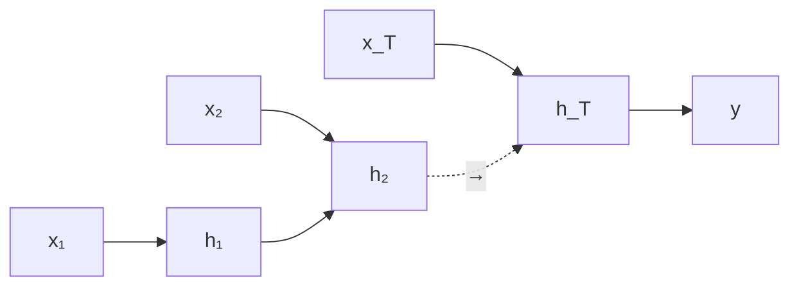

---

## 6. Aplicacion: Sentiment Analysis

Tarea: clasificar el sentimiento de "This is great!" como positivo (`++`) o negativo.

Cada palabra es un input $x_t$. Solo el **ultimo estado** $h_T$ alimenta la prediccion.

Preguntas de implementacion que la clase plantea:

1. Como codificar (embedding) las palabras de entrada?
2. Como codificar la salida?
3. Que dimensionalidad usar para el estado interno?
4. Como manejar secuencias de **longitud variable**?
5. Podemos hacer un modelo **mas profundo**?

---

## 7. RNN Profunda (Stacked)

Apilamos varias capas de RNN. La salida del estado oculto de la capa $\ell$ alimenta a la capa $\ell + 1$ en el mismo paso temporal:

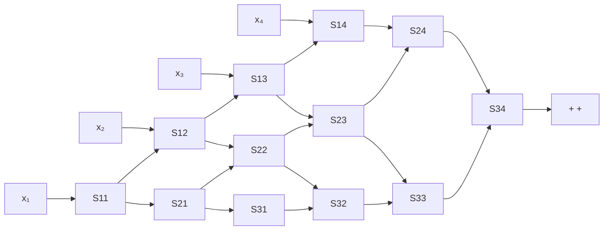

Mas capas = mas capacidad representacional, pero tambien mas dificil de entrenar.

---

## 8. RNN Bidireccional

Pregunta: el estado $h_t$ modela el **pasado** de la secuencia. Que pasa con el **futuro**?

Respuesta: usamos una **RNN bidireccional**. Dos RNNs en paralelo:

- Una procesa la secuencia de izquierda a derecha (forward $\overrightarrow{h_t}$).
- Otra de derecha a izquierda (backward $\overleftarrow{h_t}$).

Las salidas se concatenan para alimentar capas siguientes:

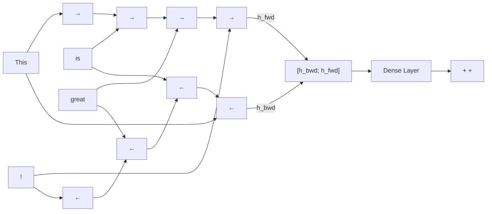

Las RNN bidireccionales **no son aplicables** a tareas online (streaming) porque requieren conocer toda la secuencia.

---

## 9. Configuraciones Segun la Aplicacion

Las RNNs son **muy flexibles**: pueden mapear secuencias de cualquier dimension a secuencias de cualquier dimension.

### Many-to-many sincronico (mismo largo)

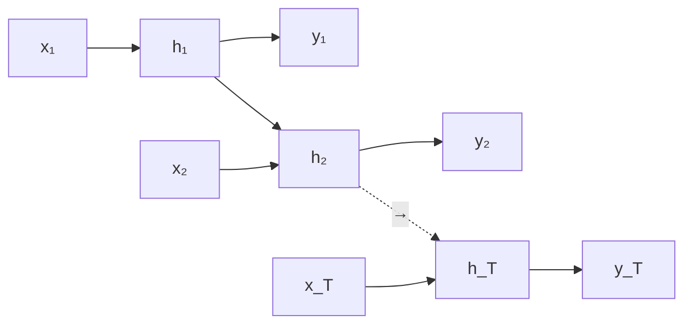

Ejemplo: etiquetado POS, video frame labeling.

### One-to-many (un input, muchos outputs)

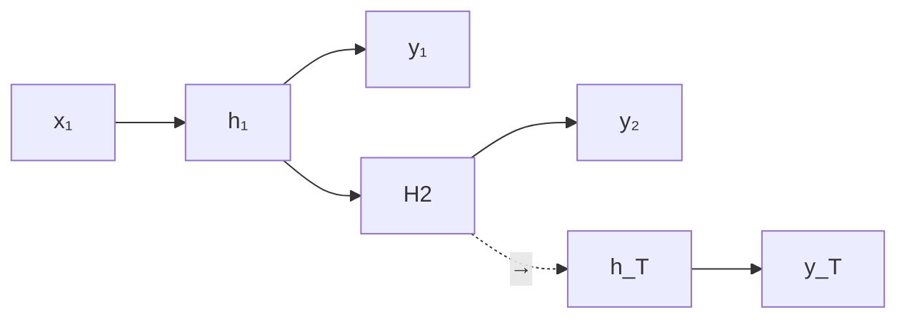

Ejemplo: image captioning (la imagen genera una secuencia de palabras).

### Many-to-one


Ejemplo: sentiment analysis, clasificacion de secuencia.

### Encoder-Decoder (Seq2Seq)

Entrada y salida de **longitudes diferentes** ($T \neq T'$):

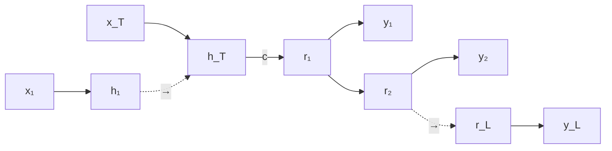

Ejemplo: traduccion automatica.

---

## 10. Ejemplo: Target Tracking en Video (Seq2Seq)

Cada frame de un video alimenta una RNN. El estado $h_T$ codifica el contexto temporal y permite predecir bounding boxes en frames futuros. Es un caso de seq2seq donde inputs y outputs son secuencias de imagenes / cajas.

---

## 11. Ejemplo: Generacion de Texto a Nivel de Caracter

**Vocabulario**: [h, e, l, o]
**Secuencia de entrenamiento**: "hello"

En cada paso, la red recibe un caracter como one-hot vector (4-dim) y predice el **siguiente caracter** mediante un softmax sobre el vocabulario.

```text
input chars:   "h"   "e"   "l"   "l"
target chars:  "e"   "l"   "l"   "o"

input layer:    1     0     0     0
                0     1     0     0
                0     0     1     0
                0     0     1     0

hidden layer: [0.3, ...] [1.0, ...] [0.1, ...] [-0.3, ...]

output layer: [1.0, 0.5, 0.1, 0.2]   ← logits para [h, e, l, o]
              ...
```

En **inferencia**, se muestrea un caracter del softmax y se realimenta como input al siguiente paso. Asi se generan secuencias arbitrariamente largas.

### Ejemplo: Shakespeare

Entrenar este modelo sobre las obras completas de Shakespeare produce, despues de muchas iteraciones, texto que **conserva la estructura sintactica** (sonetos en pentametro yambico, dialogos con escenografia). Las primeras iteraciones son ruido; con suficiente entrenamiento, emerge texto plausible aunque sin coherencia semantica profunda.

---

## 12. Otra Configuracion: Many-to-Many con Output Tardio

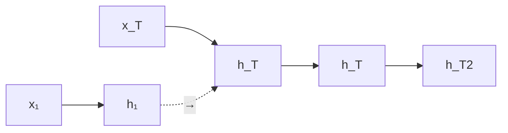

Variante donde solo el ultimo estado se procesa con capas posteriores.

---

## 13. Comparticion Profunda de Parametros

Las RNNs proveen **parameter sharing profundo** mediante ciclos:

- Permite modelar secuencias de **diferente longitud** (propiedad clave 2).
- Una RNN desplegada equivale a una red feedforward profunda donde **todas las capas comparten los mismos pesos**.
- La comparticion profunda permite modelar interacciones **arbitrariamente lejanas** (propiedad clave 3).

CNN tiene parameter sharing tambien, pero **shallow** (compartido solo dentro del kernel). RNN comparte profundamente.

---

## 14. RNN vs CNN para Secuencias

| Aspecto | RNN | CNN |
|---|---|---|
| **Longitud variable** | Nativa | Requiere padding/truncado |
| **Receptive field** | Teoricamente infinito | Limitado por profundidad |
| **Modela orden** | Si | Solo dentro del kernel |
| **Interacciones distantes** | Si (con LSTM/GRU) | Dificil sin atencion |

Para tareas como reconocimiento de voz, traduccion, Q&A, generacion de dialogos -- las RNNs son la eleccion natural.

---

## 15. Image Captioning (CNN + RNN)

Una de las aplicaciones mas elegantes: **combinar CNN y RNN**.

- **CNN** extrae features de la imagen (ej. VGG, sin las dos ultimas capas FC).
- El vector $v$ resultante (4096-dim) alimenta a una **RNN/LSTM** que genera la descripcion palabra por palabra.

La actualizacion de la RNN incluye el contexto visual:

$$h = \tanh(W_{xh} \, x + W_{hh} \, h + W_{ih} \, v)$$

donde $W_{ih}$ es una nueva matriz que proyecta el embedding visual al espacio del estado oculto.

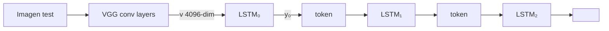

Resultados (aciertos):

- "A cat sitting on a suitcase on the floor"
- "A tennis player in action on the court"
- "Two giraffes standing in a grassy field"

Failure cases:

- "A bird is perched on a tree branch" → la imagen muestra una arana en una telarana.
- "A man in a baseball uniform throwing a ball" → la imagen muestra un fildeador agachado, no lanzando.

Ver [Show and Tell, Vinyals et al. 2015](/papers/show-and-tell-vinyals-2015).

---

## 16. RNN Training

El entrenamiento de una RNN se descompone en **tres bloques de parametros**:

1. **$W_{xh}$**: input → hidden state.
2. **$W_{hh}$**: hidden previo → hidden actual.
3. **$W_{hy}$**: hidden → output.

Pasos:

1. Definir una **funcion de perdida** que relacione outputs con etiquetas. Tipicamente cross-entropy o ranking loss.
2. **Minimizar** mediante **mini-batch SGD** (o variantes como Adam).
3. **Computar el gradiente** aplicando backpropagation generalizada al **grafo computacional desplegado**.
4. Esta variante se llama **Backpropagation Through Time (BPTT)**.

---

## 17. Backpropagation Through Time (BPTT)

**Forward**: pasar inputs y estados ocultos a traves de **toda la secuencia** para computar la perdida total.

**Backward**: propagar la senal de error a traves de toda la secuencia para computar gradientes y actualizar pesos.

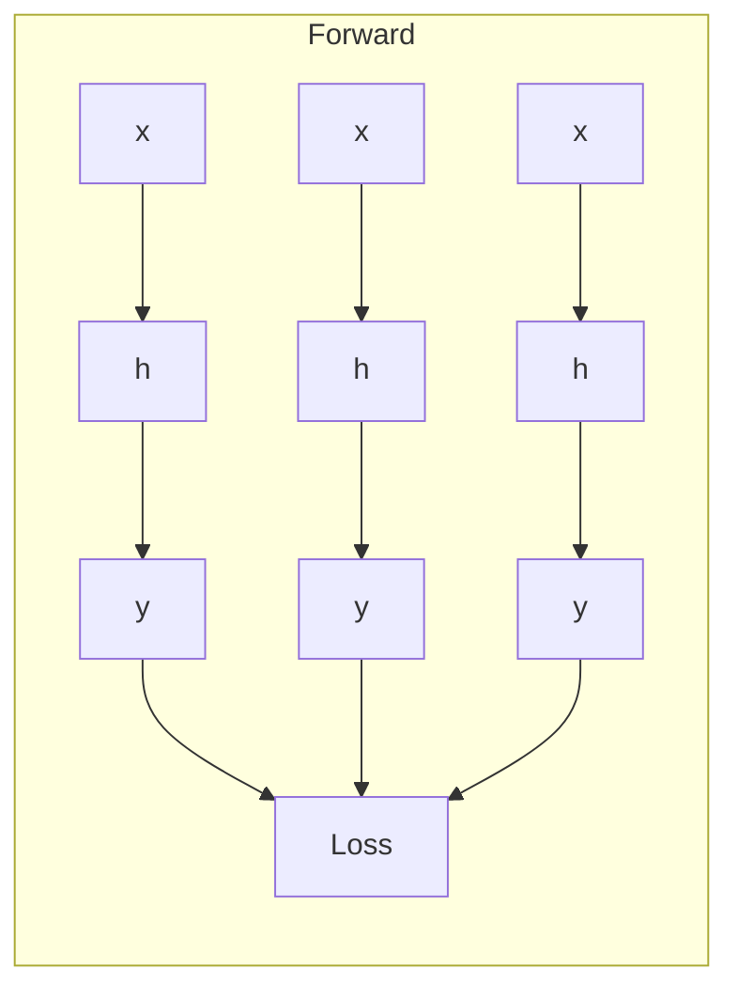

### Problemas potenciales

- **Exploding gradient**: el gradiente crece exponencialmente.
- **Vanishing gradient**: el gradiente decae exponencialmente.

Vanishing/exploding dependen del **mayor valor singular de $W_{hh}$**:

- $> 1$ → exploding.
- $< 1$ → vanishing.

### Soluciones

- **Exploding** → **gradient clipping** (escalar el gradiente cuando excede un umbral).
- **Vanishing** → **arquitecturas con compuertas** (LSTM, GRU).

Ver el fundamento [Backpropagation Through Time](/fundamentos/backpropagation-through-time) para la derivacion completa.

---

## 18. LSTM (Long Short-Term Memory)

LSTM es una RNN con compuertas, propuesta por Hochreiter y Schmidhuber (1997).

### Comparacion visual con RNN

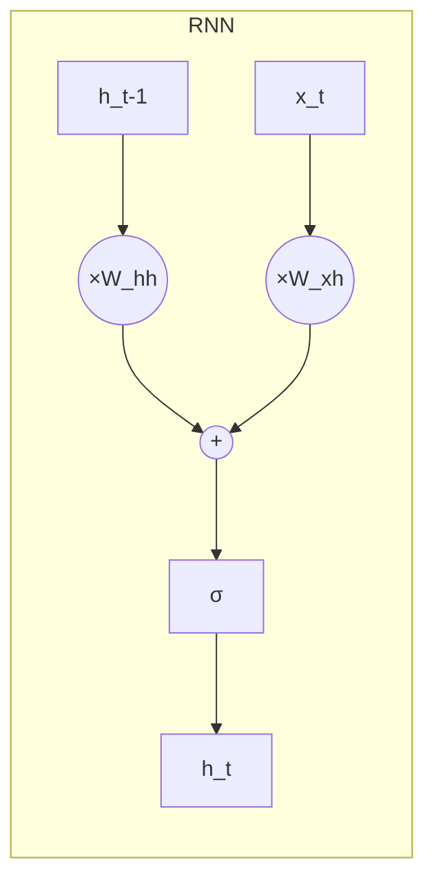

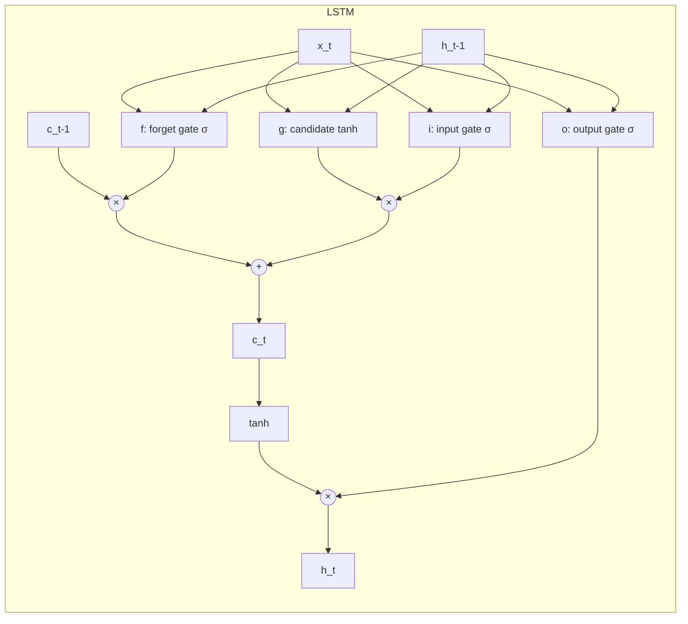

### Ecuaciones

$$
\begin{aligned}
i &= \sigma(W_{hi} h_{t-1} + W_{xi} x_t) \quad \text{(input gate)} \\
f &= \sigma(W_{hf} h_{t-1} + W_{xf} x_t) \quad \text{(forget gate)} \\
g &= \tanh(W_{hg} h_{t-1} + W_{xg} x_t) \quad \text{(candidate)} \\
o &= \sigma(W_{ho} h_{t-1} + W_{xo} x_t) \quad \text{(output gate)} \\
c_t &= f \odot c_{t-1} + i \odot g \quad \text{(cell state)} \\
h_t &= o \odot \tanh(c_t) \quad \text{(hidden state)}
\end{aligned}
$$

### Roles

- **$i$ (input gate)**: controla cuanto del candidato $g$ se actualiza en la celda.
- **$f$ (forget gate)**: controla cuanto del estado previo $c_{t-1}$ se borra.
- **$g$ (candidate gate)**: el valor candidato a escribir.
- **$o$ (output gate)**: controla la salida.
- **$c_t$**: estado interno (cell state).
- **$h_t$**: salida externa.

### Por que evita vanishing

La derivada del cell state es:

$$\frac{\partial c_t}{\partial c_{t-1}} = f$$

Es **multiplicacion elementwise por $f$**, no producto matricial. El gradiente fluye sin matrices que lo decaigan exponencialmente.

---

## 19. RNNs vs LSTMs (Cierre)

- Las RNNs proveen **mucha flexibilidad** arquitectural.
- El **flujo de gradientes hacia atras** puede explotar o anularse.
- **Exploding** se controla con **gradient clipping**.
- **Vanishing** requiere soluciones alternativas: **LSTM** y **GRU** (Gated Recurrent Units) son la respuesta mas adoptada.


**Resumen final**: las RNNs vanilla son simples pero **no funcionan bien** en la practica para secuencias largas. **LSTMs y GRUs** son hoy la eleccion comun. En tareas grandes de NLP, han sido reemplazados por **Transformers** (que veremos mas adelante en el diplomado).


---

## Lecturas recomendadas

- [Paper LSTM original (Hochreiter & Schmidhuber 1997)](/papers/lstm-hochreiter-1997)
- [Paper GRU (Cho et al. 2014)](/papers/gru-cho-2014)
- [Paper Pascanu 2013 - vanishing/exploding](/papers/difficulty-training-rnns-pascanu-2013)
- [Paper Seq2Seq (Sutskever 2014)](/papers/seq2seq-sutskever-2014)
- [Paper Show and Tell (Vinyals 2015)](/papers/show-and-tell-vinyals-2015)
- [Christopher Olah, "Understanding LSTM Networks"](https://colah.github.io/posts/2015-08-Understanding-LSTMs/) -- explicacion visual
- [Andrej Karpathy, "The Unreasonable Effectiveness of RNNs"](https://karpathy.github.io/2015/05/21/rnn-effectiveness/)

Continuar con la [Profundizacion](profundizacion) para la matematica detallada.
