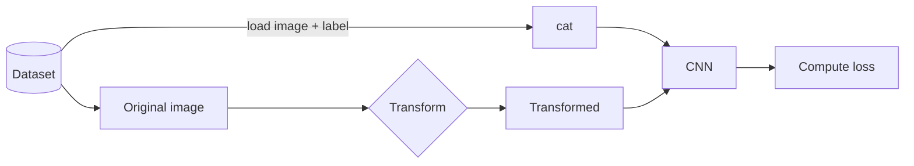
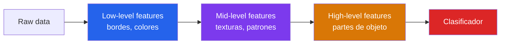
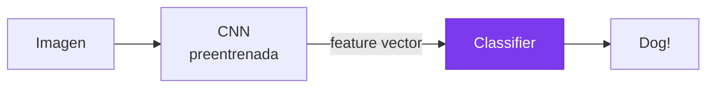
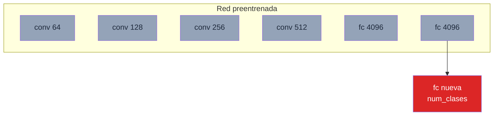
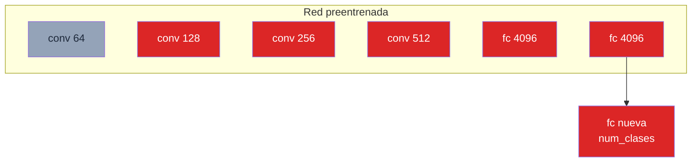
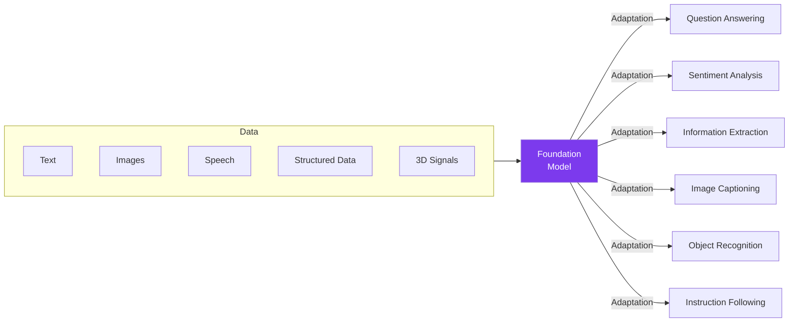

## 1. Motivacion: El Problema de los Datos Pequenos

Recordemos los ingredientes de un sistema de machine learning:

- **Modelo** (tipos de NN, arquitecturas, activaciones).
- **Optimizacion** (tecnicas de regularizacion, algoritmos de optimizacion).
- **Datos**.

Hasta ahora el curso cubrio profundamente modelo y optimizacion. **Data** no se ha abordado en profundidad.

### El elefante en la habitacion: Big Data

La mayoria de los avances de deep learning asumen **grandes cantidades de datos** para entrenar redes efectivamente desde cero. La pregunta critica:


**La mayoria de problemas reales tienen datos pequenos**. Desgraciadamente. Esta clase puede ser una de las mas importantes para aplicaciones reales.


La clase cubre dos tecnicas fundamentales para lidiar con este escenario:

1. **Data Augmentation** -- generar mas ejemplos a partir de los existentes.
2. **Transfer Learning** -- reutilizar conocimiento de modelos preentrenados.

---

# Parte I: Data Augmentation

---

## 2. El Problema

Problemas que casi seguramente enfrentaras:

1. **Escasez de datos**: ejemplos etiquetados son caros.
2. **Datasets pequenos**: conjuntos de datos relevantes no son lo suficientemente grandes.
3. **Falta de diversidad**: deep learning necesita **cantidad** y **diversidad** de datos.
4. **Desbalance**: algunas clases tienen pocos ejemplos.

**Pregunta**: podemos hacer algo para **agrandar** el dataset? Podemos generar **mas variacion**?

---

## 3. Que es Data Augmentation

**Idea simple**: basandose en los datos disponibles, **generar mas datos**.

**Como**: aplicando **transformaciones a la entrada**, podemos generar multiples muestras a partir de cada muestra. Cada una de estas se usa para entrenar el modelo.




**Importante**: las transformaciones **no deben afectar la relacion entrada-salida**. Una rotacion de 180 grados de un "6" lo convierte en "9" -- rompe la semantica.


### Por que funciona?

- Ayuda a entrenar modelos que performan mejor.
- Ayuda a entrenar modelos mas **robustos**.
- Ayuda a balancear un dataset desbalanceado.
- Ayuda a obtener senales adicionales para entrenamiento self-supervised.

---

## 4. Data Augmentation en Imagenes

### 4.1 Cropping (Recortes)

Extraer regiones aleatorias de la imagen. Cada recorte es una nueva muestra (con la misma etiqueta, siempre que el objeto de interes siga visible).

### 4.2 Flips (Espejos)

Flip horizontal es la augmentation mas comun. Flip vertical solo en dominios donde la orientacion no importa (satelites, microscopia).

Nota: **no aplicable a numeros ni texto** -- un "b" flipped se vuelve "d".

### 4.3 Rotations

Aplicar rotaciones aleatorias dentro de un rango (ej. ±15 grados). Muy usado en clasificacion de objetos naturales. Peligroso en dominios con orientacion fija (medicina, firmas).

### 4.4 Scaling

Zoom in/out para aumentar robustez a distintas escalas.

### 4.5 Light / Color

Perturbaciones foto-metricas:

- Brillo, contraste, saturacion, hue.
- Agregar ruido gaussiano.
- Shadowing / highlight.

### 4.6 Adding Noise

Ruido gaussiano pixel-wise. Obliga al modelo a ignorar variaciones de alta frecuencia.

### 4.7 Mixup

Tecnica mas avanzada: **combinar dos imagenes** como promedio ponderado, **y sus labels tambien**:

$$
\begin{aligned}
\tilde{x} &= \lambda \, x_i + (1 - \lambda) \, x_j \\
\tilde{y} &= \lambda \, y_i + (1 - \lambda) \, y_j
\end{aligned}
$$

con $\lambda \sim \text{Beta}(\alpha, \alpha)$. Ver [paper Mixup (Zhang 2017)](/papers/mixup-zhang-2017) y el fundamento de [Data Augmentation](/fundamentos/data-augmentation) para detalles.

### Resumen: tecnicas en imagenes

- Cropping
- Scaling
- Flips
- Rotations
- Light
- Adding noise
- Mixup

---

## 5. Data Augmentation en Texto

**Mucho mas dificil** porque cambios locales suelen cambiar la semantica.

Tecnicas comunes:

| Tecnica | Como |
|---|---|
| **Paraphrasing** | Reescribir con otras palabras (manual, back-translation, LLM) |
| **Word deletion** | Borrar palabras aleatoriamente |
| **Word embedding similarity** | Reemplazar por vecinos en word2vec / GloVe |
| **Synonyms** | Sustituir por sinonimos |
| **Lexical database (WordNet)** | Reemplazar segun relaciones linguisticas |

```
Language graph (WordNet-like):
          language
          /   |   \
       words  |  linguistic
              |    processes
         communication
       /      |      \
     oral  terminology speech
```

---

## 6. Consideraciones Importantes

Antes de elegir augmentations:

1. La transformacion debe ser **relevante para la tarea**.
2. Debe **crear una nueva fuente de varianza**.
3. Cuidado con **corromper demasiado** el ejemplo.
4. No cambiar la **semantica** de la muestra.

---

# Parte II: Transfer Learning

---

## 7. Motivacion

Data augmentation puede llevarnos solo hasta cierto punto. Podemos hacer mejor?

Preguntas:

- Podemos aprovechar **otros datasets grandes existentes**?
- Actualmente inicializamos modelos aleatoriamente -- podemos hacer mejor?

**Transfer Learning** responde afirmativamente a ambas.

---

## 8. Que es Transfer Learning

**Idea**:

1. Aprender un modelo en un **dataset rico** (source dataset).
2. **Transferir** el conocimiento aprendido a un segundo dataset (target dataset).

**Como**: varias tecnicas. **Finetuning** es la mas popular.

**Cuando**:

- Tenemos un **dataset rico** con mucha anotacion (source).
- Un dataset **relacionado pero pobre** con pocas anotaciones (target).

---

## 9. Como Aplicar Transfer Learning

Queremos especializar un modelo robusto entrenado en grandes cantidades de datos a nuestra tarea.

### Receta general

1. **Entrenar un modelo en el source dataset**. Idealmente un dataset grande como ImageNet.
2. **Aplicar**:
   - **Direct transfer learning** (feature extraction).
   - **Finetuning**.

---

## 10. Intuicion Importante

**Learned features in a CNN**:

- Las **primeras capas** aprenden features **genericos** (bordes, texturas, blobs de color).
- Las **ultimas capas** aprenden features **semanticos** especificos a la tarea.



Esto es consistente con los hallazgos de [Yosinski et al. 2014](/papers/transferable-features-yosinski-2014): las capas iniciales son mas **transferibles** que las profundas.

---

## 11. Direct Transfer Learning

### Receta

1. **Reemplazar la imagen con sus features CNN** extraidas de la red preentrenada.
2. Entrenar otro tipo de clasificador (SVM, por ejemplo) sobre esos features.



### Como se hace en practica

- **Congelar** las capas de extraccion de features aprendidas.
- **Reemplazar** la ultima capa (clasificador) por una nueva con el numero correcto de clases.
- **Entrenar** solo el nuevo clasificador.

Tambien se puede usar otros clasificadores (SVM, Random Forest, Logistic Regression).



---

## 12. Finetuning

### Receta

1. **Congelar algunas** o ninguna de las capas de features.
2. **Reemplazar** y entrenar un clasificador sobre esos features.
3. Con datasets mas grandes, **entrenar mas capas**.



Las capas bajas (bordes, colores) se congelan; las altas (features semanticas) se descongelan y se ajustan al nuevo dominio.

---

## 13. Que tan bueno es esto?

"Aint easy being this good, but I do what I can" -- finetuning es la herramienta por defecto del deep learning aplicado.

### La norma

Finetuning se usa **casi siempre** en modelos NN modernos, especialmente cuando se trabaja con imagenes y texto. El paradigma unified encoder-decoder de modelos como BERT pretrained + finetune para image captioning, VQA, etc.

---

## 14. Applied Finetuning: Cuantas capas descongelar?

**Importante**: la cantidad de capas descongeladas depende de:

1. La **cantidad de datos disponibles** en la tarea target.
2. La **similitud** entre tareas source y target.

### Cuando descongelar mas capas

- Gran cantidad de datos en la tarea target.
- Tarea target **diferente** de la tarea source.

### Matriz de decision

| Data Target | Similitud con Source | Estrategia |
|---|---|---|
| Poco (< 5K) | Similar | Feature extraction (todo frozen) |
| Poco | Diferente | Finetuning capas medias |
| Mucho (> 50K) | Similar | Finetuning completo con lr bajo |
| Mucho | Diferente | Finetuning completo o training desde cero |

---

## 15. Tips para Applied Finetuning


**Regla clave**: usar un **learning rate mas bajo** cuando se hace finetuning.

Un buen punto de partida: $\frac{1}{10}$ del learning rate original.


### Tips

- En **imagenes**: usar un modelo preentrenado en **ImageNet**.
  - [PyTorch torchvision models](https://pytorch.org/docs/stable/torchvision/models)
  - [TensorFlow models](https://github.com/tensorflow/models)
- En **texto**: usar una variante de **BERT**. Para Espanol: **BETO** ([DCCUChile/beto](https://github.com/dccuchile/beto)).
- La mayoria de frameworks de DL ofrecen **"Model Zoos"** con modelos preentrenados descargables.
- Tambien: [HuggingFace Transformers](https://github.com/huggingface/transformers) -- zoo mas grande de foundation models.

---

# Parte III: Conclusiones

---

## 16. Small Talk sobre Foundation Models

**Machine learning today** -- el paradigma emergente:



Source: Bommasani et al. 2021, [paper disponible aqui](/papers/foundation-models-bommasani-2021).

---

## 17. Foundation Models

- Habilitados por **transfer learning + escala**.
- Usan modelos eficientes (**Transformers**) y **self-supervision** (temas que cubriremos mas adelante).
- Ejemplos: **BERT, DALL-E, GPT-3**.
- Ver el [fundamento de Foundation Models](/fundamentos/foundation-models) para mas detalle.

Workshop relacionado: [CRFM Stanford](https://crfm.stanford.edu/workshop.html).

---

## 18. Hoy Vimos

1. Por que es importante considerar el **escenario de small data**.
2. Herramientas para lidiar con este escenario: **Data Augmentation** y **Transfer Learning**.
3. Que es data augmentation y como usarla en imagenes, texto y otros escenarios.
4. Que es transfer learning y finetuning, y como usarlos.

---

## 19. Conclusion: Como Lidiar con Small Data

En realidad, small data es un **tema de investigacion activo**. El caso extremo se llama **few-shot learning** (aprender de ejemplos muy pocos).

### Soluciones actuales

- **Data augmentation**.
- **Transfer learning**.
- Modelos mas simples o **ensembles**.
- O no usar deep learning y usar **feature engineering**.
- **Regularizacion**.
- **Buscar mas datos**.
- Usar **datos sinteticos**.

### Tendencias (por explorar)

- Mejores **inductive biases** (Transformers, Graph Neural Networks).
- **Self-supervised pre-training**.
- **Meta-learning**.

---

# Parte IV: Material Extra

---

## 20. Data Augmentation en Otros Tipos de Datos

### Time Series Data

- Cambiar la direccion del "tiempo" (flipping).
- Usar una **ventana variable** de datos (window cropping).
- Comprimir o extender un rango temporal (window warping).
- Augmentar en el **dominio de frecuencias**.

### General Forms of Data

- Aplicar **ruido**.

**Pero**: es dificil ser generico, porque es **task-specific**.

---

## 21. Data Augmentation en AlexNet

Uno de los primeros papers en usar data augmentation sistematica para deep learning ([Krizhevsky 2012](/papers/alexnet-krizhevsky-2012)):

### Train

- Extraer **crops aleatorios 224x224** de imagenes 256x256.
- Cada **flip horizontal**.
- **Alterar aleatoriamente las intensidades** de canales RGB (PCA color augmentation).

### Test

- Extraer **5 crops 224x224** (4 esquinas + centro).
- Anadir el reflejo de cada crop.
- Obtener una prediccion por crop.
- **Promediar** en el softmax layer.

---

## 22. Otras (Experimentales) Formas de Augmentar Datos

Tecnicas avanzadas basadas en:

- **GAN / Adversarial**: sintetizar nuevos ejemplos con redes generativas.
- **Reinforcement Learning**: AutoAugment -- aprender politicas de augmentation optimas.
- **Meta-Learning**: adaptar augmentations al modelo y al dataset.

---

## Lecturas recomendadas

- [Paper Mixup (Zhang 2017)](/papers/mixup-zhang-2017) -- la augmentation moderna mas citada.
- [Paper AlexNet (Krizhevsky 2012)](/papers/alexnet-krizhevsky-2012) -- data augmentation precursor.
- [Paper Yosinski 2014](/papers/transferable-features-yosinski-2014) -- analisis layer-by-layer de transferibilidad.
- [Paper Foundation Models (Bommasani 2021)](/papers/foundation-models-bommasani-2021) -- el paradigma moderno.
- Shorten & Khoshgoftaar (2019) "A survey on Image Data Augmentation for Deep Learning" -- revision exhaustiva.

Continuar con la [Profundizacion](profundizacion) para la matematica detallada.
