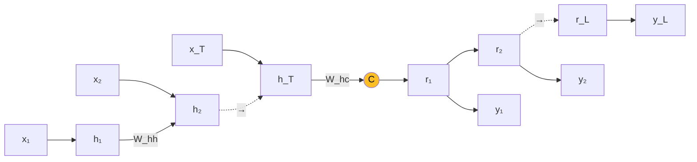
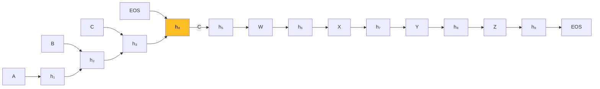
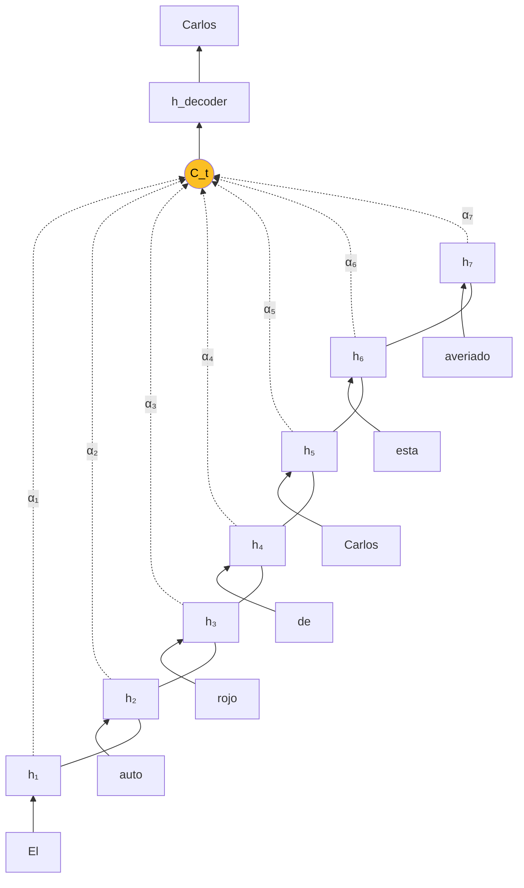
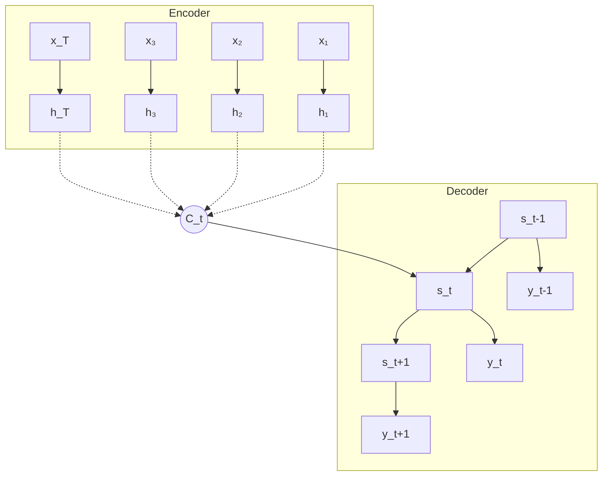

## 1. Lenguaje como Marca de Inteligencia

El lenguaje es un **medio para codificar informacion**. La clase abre con una analogia historica -- la maquina **Enigma** de la segunda guerra mundial como artefacto fisico de encoding, y la **bomba de Turing** como maquina de decoding.

La inteligencia no es solo **codificar** informacion (comprimirla en un formato transmissible), sino tambien **decodificarla** (reconstruir el significado a partir del codigo). Ambos procesos son importantes y complementarios.

---

## 2. Encoding/Decoding como Seq2Seq

Un proceso de encoding/decoding puede modelarse como una **tarea Seq2Seq**:

1. Un **encoder** (o RNN de entrada) procesa la secuencia de entrada y produce una representacion intermedia de longitud fija (tipicamente el ultimo hidden state).
2. Un **decoder** (o RNN de salida) se condiciona en este vector intermedio para generar la secuencia de salida.



### 2.1 Matematica de encoder y decoder

**Encoder RNN**:

$$h_t = \sigma(W_{xh} x_t + W_{hh} h_{t-1})$$

**Decoder RNN** (cuando $t = 1$):

$$
\begin{aligned}
y_1 &= \sigma(W_{ry} r_1) \\
r_1 &= \sigma(W_{rr} C) \\
C &= \sigma(W_{hC} h_T)
\end{aligned}
$$

**Decoder RNN** (cuando $t > 1$):

$$
\begin{aligned}
y_t &= \sigma(W_{ry} r_t + W_{yy} y_{t-1}) \\
r_t &= \sigma(W_{rr} r_{t-1})
\end{aligned}
$$

En general, cada modelo $W_{ij}$ puede ser una **MLP totalmente conectada**:

$$y = \sigma(W x)$$

---

## 3. Ejemplo: Traduccion de Idiomas

Input: `"Economic growth has slowed down in recent years."`

1. **Encode**: la oracion inglesa se codifica en un vector $Z = [z_1, z_2, \ldots, z_d] \in \mathbb{R}^d$.
2. **Decode**: $Z$ alimenta al decoder para generar `"La croissance economique a ralenti ces dernieres annees."`


- La conexion entre encoder y decoder es una **representacion latente intermedia** $Z$.
- $Z$ vive en un **espacio de embedding** que codifica la **semantica** de las instancias de entrada.
- $Z$ tiene **dimensionalidad fija**, por lo que la entrada y salida pueden tener **tamanos distintos**.


### 3.1 Otras aplicaciones

El patron encoder-decoder se adapta a muchos problemas:

- **Reconocimiento de voz**: audio → transcripcion.
- **Traduccion automatica**: idioma A → idioma B.
- **Question answering**: pregunta → respuesta.
- **Image captioning**: imagen → descripcion textual.

Ejemplo image captioning: imagen de "una mujer con una nina en un parque tirando un frisbee" → texto descriptivo.

---

## 4. Entrenamiento del Seq2Seq

Encoder y decoder se entrenan **conjuntamente** maximizando la log-probabilidad condicional promedio sobre todos los pares $(x_i, y_i)$ del training set:

$$\max_{\theta} \; \frac{1}{|TS|} \sum_{(x_i, y_i) \in TS} \log P(y_i \mid x_i; \theta)$$

Una de las configuraciones mas simples: encoder produce un **context vector C** que luego el decoder usa para generar la secuencia.

---

## 5. Sutskever et al. 2014

Paper canonico de Seq2Seq para traduccion ([ver ficha](/papers/seq2seq-sutskever-2014)).



Claves:

- **Traduccion textual** end-to-end.
- **Encoder** lee la oracion entrada (ej. `"ABC"`), **decoder** produce la salida (ej. `"WXYZ"`): **modelo autoregresivo**.
- Cada RNN es un **LSTM profundo de 4 capas**.
- El **vector contextual $C$** corresponde al **ultimo hidden state** del LSTM encoder.
- Un simbolo especial **`<EOS>`** (end-of-sentence) se usa para detener el decoding.
- Durante entrenamiento, los **outputs ground truth** se usan como inputs al decoder (**teacher forcing**).

### 5.1 El context vector como espacio semantico

Sutskever muestra que $C$ codifica la oracion en un **espacio semantico**. Oraciones con significado similar estan cerca.

Una proyeccion PCA 2D de los context vectors para distintas oraciones muestra:

- `"John admires Mary"` vs `"Mary admires John"` → cercanas pero **distintas** (orden de palabras preservado).
- `"I was given a card by her"` vs `"She gave me a card"` → muy cercanas (mismo significado, voz pasiva/activa).


Las frases estan **agrupadas por significado, considerando el orden de palabras**. Este tipo de representacion seria dificil de capturar con un modelo **Bag-of-Words** (BoW), que ignora orden.


---

## 6. Problema del Seq2Seq Estandar

En el modelo basico, el encoder codifica la **secuencia entera** en un **embedding / context vector C** fijo. Este $C$ codifica **toda la informacion relevante del input** y es la **unica conexion** entre encoder y decoder.

**Problema**: mientras el proceso de decoding progresa, necesita considerar **distintas partes del input**.

```
        Decode: La croissance economique a ralenti ces dernieres annees.
        Encode: Economic growth has slowed down in recent years.
```

Cuando el decoder genera `"croissance"` deberia mirar a `"growth"`. Cuando genera `"annees"` deberia mirar a `"years"`. Un solo $C$ no permite esto.

---

## 7. Idea: Mecanismo de Atencion

**Agregar un mecanismo de atencion** que identifique adaptativamente que parte del input necesita considerar el decoder para generar el siguiente output.


- El mecanismo de atencion **alinea la salida con la porcion relevante de la entrada**.
- En cada paso del decoding, el decoder tiene acceso a **piezas selectivas** de informacion del input.


### 7.1 Ejemplo paso a paso

Input: `"El auto rojo de Carlos esta averiado."`
Output: `"Carlos 's red car is not working."`

En cada paso del decoder, se computa un context vector $C_1, C_2, \ldots$ que pondera distintas posiciones del encoder.



Al generar `"Carlos"`, el alpha alto es el de `"Carlos"` en el encoder. Al generar `"red"`, el alpha alto es el de `"rojo"`. Al generar `"working"`, el alpha alto es el de `"averiado"`.

---

## 8. Modelo de Atencion (Bahdanau et al., ICLR 2015)

Ver la [ficha del paper](/papers/bahdanau-attention-2015).

### 8.1 Setup general



### 8.2 Encoder: BiLSTM

El encoder es una **RNN bidireccional** (tipicamente BiLSTM). Para cada posicion $j$ produce anotaciones:

$$h_j = [\overrightarrow{h_j}; \overleftarrow{h_j}]$$

que combinan contexto **pasado** (forward) y **futuro** (backward).

### 8.3 Context vector adaptativo

Ahora el context vector $C_t$ **cambia en cada paso $t$ del decoder**:

$$C_t = \sum_{i=1}^{T} \alpha_{t,i} \, h_i$$

donde $\alpha_{t,i}$ es la atencion que pone la posicion $t$ del output sobre la posicion $i$ del input.

### 8.4 Calculo del decoder

$$
\begin{aligned}
y_t &= \sigma(W_{yy} y_{t-1} + W_{sy} s_t + W_{cy} C_t) \\
s_t &= \sigma(W_{ss} s_{t-1} + W_{cs} C_t) \\
C_t &= \sum_{i=1}^{T} \alpha_{t,i} \, [\overrightarrow{h_i}; \overleftarrow{h_i}]
\end{aligned}
$$

### 8.5 Propiedades clave

- En cada paso $t$, $C_t$ es un **promedio ponderado** de los hidden states del BiLSTM.
- $\alpha_{t,i}$ codifica la **relevancia** del hidden state $h_i$ para generar el output $y_t$.
- Este mecanismo se llama **soft attention**. Tiene la ventaja de ser **diferenciable** (bueno para SGD).
- El modelo puede **enfocarse en distintas partes** de la secuencia de input al generar cada palabra traducida.
- Usar una **RNN bidireccional** permite que $C_t$ considere **dependencias en ambas direcciones**.

---

## 9. Calculo de los Coeficientes $\alpha_{t,j}$

### 9.1 Pregunta clave

$\alpha_{t,j}$ estima cuanto afectan el **output context previo $s_{t-1}$** y el **hidden state $h_j$** al context $s_t$ usado para generar $y_t$.

### 9.2 Formulacion matematica

$$\hat{\alpha}_{t,j} = V_c^T \sigma(W_c s_{t-1} + U_c h_j)$$

con $V_c \in \mathbb{R}^n$, $W_c \in \mathbb{R}^{n \times n}$, $U_c \in \mathbb{R}^{n \times 2n}$.

### 9.3 Normalizacion (softmax)

$$\alpha_{t,j} = \frac{\hat{\alpha}_{t,j}}{\sum_k \hat{\alpha}_{t,k}}$$

(aplicar softmax sobre las posiciones del input).

### 9.4 Por que $s_{t-1}$?

El estado del decoder $s_{t-1}$ se usa para calcular los pesos de atencion porque:

- Usando $s_{t-1}$ para generar los coeficientes de atencion, el modelo **trackea el progreso** del decoder (memoria de lo que se ha generado hasta ahora).
- En resumen, cada $\alpha_{t,j}$ se estima usando un **modelo aditivo** que combina el embedding del context de output previo $s_{t-1}$ con su correspondiente input source $h_j$ del decoder.

---

## 10. Ejemplo: Summarization de Documentos (See & Manning, ACL 2017)

Ver [ficha del paper](/papers/pointer-generator-see-2017).

La tarea: tomar un articulo largo y generar un resumen abstractivo.

### Ejemplos (de la Figura 1 del paper)

**Articulo**: sobre contrabandistas que atraen migrantes arabes y africanos en barcos sobrecargados.
**Resumen abstractivo**: "CNN investigation uncovers the **business inside** a **human smuggling ring**."

**Articulo**: sobre un agente de policia de Carolina del Sur que disparo y mato a un hombre negro desarmado.
**Resumen abstractivo**: "more **questions than answers emerge** in **controversial s.c.** police shooting."


**Summarization abstractiva vs extractiva**:

- **Extractiva**: seleccionar oraciones existentes del articulo.
- **Abstractiva**: **generar** nuevas palabras y frases no presentes literalmente en el articulo.

Los terminos en **negrita** en los ejemplos denotan **palabras novel** (abstractivas).


### Tecnicas Avanzadas

Details del modelo (ver paper):

- **Italics** denota palabras OOV.
- **Green shading** representa valor de probabilidad de generacion ($p_{\text{gen}}$).
- **Yellow shading** representa el coverage vector (para evitar repeticion).

---

## 11. Ejemplo: Image Captioning (Xu et al., ICML 2015)

Ver [ficha del paper](/papers/show-attend-tell-xu-2015).

Image captioning puede considerarse un **problema de traduccion entre modalidades** imagen y lenguaje.

**Contrastes con inputs textuales**:

1. La **localizacion espacial** de estructuras relevantes (orden de palabras) no esta predefinida.
2. La lista de palabras validas (**diccionario visual**) es desconocida.

### Solucion

- **Usar como embedding de entrada** (diccionario visual) los outputs de una **CNN preentrenada** (ej. capas finales de AlexNet o VGG).
- Para acomodar encoding a nivel de **region**, usar **capas convolucionales** en vez de capas fully-connected.

La imagen se embebe como una **secuencia de palabras visuales** $w \times h$ de dimension $c$. Cada celda del grid de output encoding contiene informacion de la mayoria de partes del input.

Resultados (Figura 3 del paper):

- "A woman is throwing a **frisbee** in a park."
- "A **dog** is standing on a hardwood floor."
- "A **stop sign** is on a road with a mountain in the background."

La visualizacion de **attention maps** muestra exactamente a que parte de la imagen esta mirando el modelo al generar cada palabra.

---

## 12. Bottom-Up Attention (Anderson et al., CVPR 2018)

Ver [ficha del paper](/papers/bottom-up-attention-anderson-2018).

Mejora sobre Xu et al. 2015: en lugar de atender sobre un **grid uniforme** de features CNN, usar **regiones propuestas por Faster R-CNN** (objetos detectados).

Ejemplos de la clase:

- "Two elephants and a baby elephant walking together." → atencion se mueve entre los elefantes.
- "A close up of a sandwich with a stuffed animal." → atencion enfocada en el sandwich y el stuffed animal.
- "Two hot dogs on a tray with a drink." → cada parte del caption corresponde a una region detectada.


El mecanismo de atencion **bottom-up** se aplica al nivel de **objetos y regiones salientes** -- una base natural para atencion en vision, dado que nuestro sistema visual tambien procesa objetos como unidades.


---

## 13. Resumen de la Clase

1. **Seq2Seq** generaliza RNNs a mapeos de secuencia de longitud variable a secuencia de longitud variable.
2. **Encoder-decoder** es el patron arquitectonico: encoder comprime la entrada en $C$, decoder genera la salida autoregresivamente condicionado en $C$.
3. **Sutskever 2014** mostro que Seq2Seq funciona para traduccion automatica con LSTMs profundas.
4. El vector $C$ aprende un **espacio semantico** continuo.
5. **Problema**: $C$ fijo es un cuello de botella en oraciones largas.
6. **Mecanismo de atencion** (Bahdanau 2015): $C_t$ cambia en cada paso del decoder, computado como promedio ponderado de los hidden states del encoder.
7. **Atencion aditiva**: $\alpha_{t,j}$ computada via softmax sobre scores de una MLP small.
8. **Soft attention** es diferenciable y domina en la practica; **hard attention** requiere REINFORCE.
9. Aplicaciones: **traduccion**, **summarization** (pointer-generator), **image captioning** (Show-Attend-Tell, bottom-up attention).
10. La atencion es el **precursor del Transformer** (Vaswani 2017), que elimina las RNNs y usa atencion pura.

---

## Lecturas recomendadas

- [Paper Seq2Seq (Sutskever 2014)](/papers/seq2seq-sutskever-2014)
- [Paper Bahdanau Attention (2015)](/papers/bahdanau-attention-2015)
- [Paper Show, Attend and Tell (Xu 2015)](/papers/show-attend-tell-xu-2015)
- [Paper Pointer-Generator (See 2017)](/papers/pointer-generator-see-2017)
- [Paper Bottom-Up Attention (Anderson 2018)](/papers/bottom-up-attention-anderson-2018)
- Luong et al. 2015 "Effective Approaches to Attention-based NMT" -- dot-product attention
- Vaswani et al. 2017 "Attention Is All You Need" -- el Transformer

Continuar con la [Profundizacion](profundizacion) para la matematica detallada.
