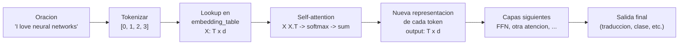

Este capitulo cuenta, paso a paso y en lenguaje llano, la idea fundamental detras de la atencion del Transformer: **representar palabras como vectores y medir su parentesco con un producto punto**. No vamos a definir Q, K, V todavia. Primero hay que ver el mecanismo desnudo: tomar embeddings, multiplicarlos entre si, normalizar y devolver una suma ponderada. Si ese click esta solido, todo lo que viene despues (scaling, multi-head, masking) son refinamientos.

El script que acompana esta narrativa es `clase_14/practica/01_dot_product_attention_manual.py`. La recomendacion es leer hasta cierto punto, correr el script, mirar la salida, y volver al texto.

---

## 1. Punto de partida: que es un vector

Un vector es solo una **lista ordenada de numeros**. La dimension es cuantos numeros tiene la lista:

- `[3, 4]` es un vector 2D.
- `[1, -2, 5]` es un vector 3D.
- `[0.1, 0.2, ..., 0.9]` con 768 entradas es un vector 768D.

En NLP, **cada palabra se representa como un vector**. No hay magia: las computadoras solo entienden numeros, asi que para que una red neuronal pueda procesar la palabra "perro" alguien tiene que convertir "perro" en una lista de numeros.

Una representacion ficticia, solo para fijar la idea:

```
"perro" -> [ 0.5,  0.8, -0.2,  0.1]
"gato"  -> [ 0.4,  0.7, -0.3,  0.2]
"avion" -> [-0.6,  0.1,  0.9, -0.4]
```

La idea fuerza es esta: **palabras de significado parecido terminan teniendo vectores parecidos**. "Perro" y "gato" son ambos animales domesticos pequenios, asi que sus vectores van a ser similares. "Avion" no comparte casi nada con "perro", asi que su vector va a ser muy distinto. Ese parecido **no se programa a mano**: emerge solo cuando el modelo se entrena con grandes cantidades de texto.


Un embedding es la traduccion de una palabra a una lista de numeros que captura su significado. El modelo aprende esta traduccion a partir de los datos.


---

## 2. Cercania geometrica: que significa "vectores parecidos"

Imagina una hoja cuadriculada con ejes X e Y. Cada palabra es un **punto** en ese plano. Para fijar ideas, supongamos que tras entrenar un modelo obtenemos:

- `"perro" -> [3, 4]`
- `"gato"  -> [3, 5]`
- `"avion" -> [-2, 1]`

Dibujados:

```
   Y
   6 |
   5 |       . gato   (3, 5)
   4 |       . perro  (3, 4)
   3 |
   2 |
   1 | . avion (-2, 1)
   0 |
     +--+--+--+--+--+--+--+-> X
       -2 -1  0  1  2  3  4
```

Perro y gato estan **pegados** en la hoja. Avion esta lejos de los dos. Cuando entrenamos un modelo de lenguaje con miles de millones de palabras, el modelo aprende solito a colocar las palabras semanticamente parecidas cerca unas de otras. Nadie le dice "perro y gato son ambos animales": el modelo lo deduce de los contextos en los que aparecen ("mi perro come...", "mi gato come...", "mi perro duerme...", "mi gato duerme..."). Las dos palabras viven en oraciones parecidas, asi que terminan en zonas parecidas del espacio de embeddings.

En modelos reales no son 2 dimensiones, son 512 (Vaswani 2017) o 768 (BERT base) o mas. **No podemos visualizarlas**, pero la matematica es exactamente la misma. Cuando bajamos a 2D para mostrarlo en una grafica, perdemos informacion, pero la intuicion geometrica se mantiene: cercania en el espacio = parecido semantico.

---

## 3. Donde estan almacenados los embeddings

Esto a veces no se dice explicitamente y queda un misterio: la respuesta es que los embeddings **viven en una matriz de numeros, dentro del modelo**. Esa matriz se llama `embedding_table` (o `wte` en GPT, o `word_embeddings.weight` en BERT). Es una tabla 2D:

- **Filas**: una por cada palabra (o token) del vocabulario. BERT base tiene unas 30,000 filas.
- **Columnas**: las dimensiones del embedding. BERT base usa 768.
- **Cada celda**: un `float32` (4 bytes).

Tamano total para BERT base: $30{,}000 \times 768 \times 4 \text{ bytes} \approx 92$ MB **solo para la tabla de embeddings**.

Vive en RAM mientras el modelo corre. Cuando lo guardas a disco (con `torch.save` o el formato safetensors), la matriz se serializa a un archivo binario. Cuando llamas `from_pretrained("bert-base-uncased")` lo que estas descargando es, entre otras cosas, esa matriz pre-entrenada. Tu no la entrenas: el modelo ya hizo el trabajo.

Una analogia util desde tu fondo de bases de datos: piensalo como una **tabla SQL gigante** donde cada palabra tiene su vector pre-calculado:

```
| token_id | dim_0  | dim_1  | dim_2  | ... | dim_767 |
|----------|--------|--------|--------|-----|---------|
|       0  |  0.13  | -0.41  |  0.05  | ... |   0.22  |  <- "[CLS]"
|       1  | -0.78  |  0.02  | -0.11  | ... |   0.34  |  <- "[PAD]"
|     ...
|   1532   |  0.51  |  0.08  | -0.24  | ... |  -0.17  |  <- "perro"
```

Hacer "lookup" de un embedding es simplemente **indexar la tabla por el id del token**. En PyTorch:

```python
embedding_vector = embedding_table[token_id]  # fila completa
```

No hay calculo, es una indexacion en memoria. Por eso es barata.

---

## 4. Como medimos "que tan parecidos son" dos vectores: el producto punto

Tenemos vectores. Sabemos que palabras parecidas tienen vectores parecidos. Necesitamos una operacion concreta que reciba dos vectores y devuelva un numero diciendo cuanto se parecen. Esa operacion es el **producto punto** (dot product).

La definicion es directa: **multiplica posicion por posicion y suma todo**.

Para $\mathbf{a} = [3, 4]$ y $\mathbf{b} = [3, 5]$:

$$\mathbf{a} \cdot \mathbf{b} = 3 \times 3 + 4 \times 5 = 9 + 20 = 29$$

La formula general para vectores de dimension $d$:

$$\mathbf{a} \cdot \mathbf{b} = \sum_{i=1}^{d} a_i \, b_i$$

### Interpretacion geometrica

Dibuja en la hoja una flecha que empieza en el origen y termina en cada punto. Ahora pregunta: **las flechas apuntan hacia donde?**

- Si las dos flechas apuntan en la **misma direccion**, el dot product es **grande positivo**.
- Si son **perpendiculares** (90 grados), el dot product es **cerca de 0**.
- Si apuntan en **direcciones opuestas**, el dot product es **grande negativo**.

Verifiquemoslo con los tres vectores del ejemplo:

| par | calculo | resultado | comentario |
|-----|---------|-----------|-----------|
| perro . gato  | $3 \cdot 3 + 4 \cdot 5$    | $29$  | flechas casi paralelas: muy alineadas |
| perro . avion | $3 \cdot (-2) + 4 \cdot 1$ | $-2$  | poco alineadas |
| gato . avion  | $3 \cdot (-2) + 5 \cdot 1$ | $-1$  | poco alineadas |

El numero 29 contra los numeros -2 y -1 grita la diferencia: perro y gato se parecen, los demas no.


El producto punto es **la operacion matematica que el Transformer usa para preguntar "que tan relacionadas estan dos palabras?"**. Si esta alto, una palabra le va a "prestar atencion" a la otra. Si esta bajo, la va a ignorar. Eso es self-attention en una frase.


Una observacion adicional que vamos a usar mas adelante: **un vector consigo mismo siempre tiene producto punto positivo grande**. Concretamente:

$$\mathbf{a} \cdot \mathbf{a} = \sum_{i} a_i^2 = \|\mathbf{a}\|^2$$

Eso es la norma al cuadrado, y siempre es no negativa. Lo recordaremos cuando veamos la diagonal de la matriz de scores.

---

## 5. Como recibe esto la red: le pasamos pares de palabras

Esta es una pregunta que confunde al principio. La respuesta es **no, nunca le pasas pares**. Le pasas una **oracion entera** (una secuencia de tokens) y la red, internamente, calcula los productos punto entre todos los pares de palabras de esa oracion.

Tu interactuas con el modelo de afuera asi:

```
input:  "I love neural networks"  ->  [modelo]  ->  output: una traduccion / clasificacion / siguiente token
```

Los productos punto, los softmax y las sumas ponderadas son **maquinaria interna**. Tu nunca los tocas a menos que estes implementando el modelo a mano (como en este capitulo).

El flujo completo de un token al pasar por self-attention:



La parte D es la que estamos abriendo en este capitulo. Todo lo demas pasa "alrededor", pero sin ese paso D el Transformer no es Transformer.

---

## 6. El script: self-attention degenerada manual (sin Q/K/V)

Ahora si, vamos al codigo. La version que vamos a leer es **degenerada** a proposito: usa $Q = K = V = X$, es decir, los embeddings tal cual sin proyectar por matrices aprendibles. Eso aisla el mecanismo "comparar via dot product, normalizar con softmax, devolver suma ponderada" sin distraerse con Q/K/V todavia.

### 6.1 Crear vocab y embedding random

```python
import torch

torch.manual_seed(42)
torch.set_printoptions(precision=3, sci_mode=False)

vocab = ["I", "love", "neural", "networks"]
d_model = 4  # en la vida real son 512 o 768; aqui 4 para verlo
embedding_table = torch.randn(len(vocab), d_model)
```

`embedding_table` es la tabla SQL de la seccion 3, en miniatura: 4 filas (una por palabra), 4 columnas (las dimensiones). Esta inicializada con numeros random porque aqui no estamos entrenando — solo queremos ver el mecanismo. En un modelo real, esos numeros vendrian de un entrenamiento previo.

### 6.2 Tokenizar y lookup

```python
sentence = ["I", "love", "neural", "networks"]
token_ids = torch.tensor([vocab.index(w) for w in sentence])
X = embedding_table[token_ids]  # shape: (T, d_model) = (4, 4)
T = X.shape[0]
```

`token_ids` traduce cada palabra a su id en el vocab: `[0, 1, 2, 3]`. Despues, `embedding_table[token_ids]` indexa la tabla y devuelve la submatriz de filas correspondientes. `X` queda con shape $(T, d_{\text{model}}) = (4, 4)$: una fila por token de la oracion, cada fila es el embedding de ese token.

### 6.3 Calcular la matriz de scores: X @ X.T

Queremos el producto punto **entre cada par de tokens**. La forma manual (didactica) es con dos loops:

```python
scores_manual = torch.zeros(T, T)
for i in range(T):
    for j in range(T):
        scores_manual[i, j] = torch.dot(X[i], X[j])
```

`scores_manual[i, j]` es el dot product entre el embedding del token $i$ y el embedding del token $j$. La matriz resultante es $T \times T$ (4x4 en este caso): cada fila es "que tanto se parece este token con cada uno de los demas".

Pero esa version con loops es lenta y poco legible. La forma vectorizada equivalente es **una sola multiplicacion de matrices**:

```python
scores = X @ X.T  # exactamente lo mismo, pero en paralelo y de una linea
```

Recordatorio de algebra lineal: si $X$ es $(T, d)$, entonces $X^T$ es $(d, T)$, y $X X^T$ es $(T, T)$. La entrada $(i, j)$ de ese producto es exactamente $\sum_k X_{ik} X_{jk} = X_i \cdot X_j$. Es identico al doble loop, pero corre en paralelo en GPU.

### 6.4 Softmax fila por fila

Los scores son numeros reales cualquiera (positivos, negativos, grandes, chicos). Para usarlos como **pesos de atencion** necesitamos que cada fila sea una distribucion de probabilidad: todas no-negativas y que sumen 1. Esa es exactamente la funcion del softmax:

$$\text{softmax}(z_i) = \frac{e^{z_i}}{\sum_j e^{z_j}}$$

Aplicado **fila por fila** (`dim=-1`):

```python
weights = torch.softmax(scores, dim=-1)
```

Ahora `weights[i, j]` es el numero entre 0 y 1 que dice "que fraccion de su atencion el token $i$ pone en el token $j$", y cada fila suma 1.

### 6.5 Output: suma ponderada de embeddings

El paso final es el que da sentido a todo lo anterior. Para cada token $i$, su nueva representacion es la **suma ponderada de los embeddings de todos los tokens**, usando los pesos de la fila $i$:

$$\text{output}_i = \sum_{j} \text{weights}_{ij} \cdot X_j$$

En matriz:

```python
output = weights @ X  # (T, T) @ (T, d_model) = (T, d_model)
```

Toda la self-attention degenerada cabe en **una sola linea**:

```python
output = torch.softmax(X @ X.T, dim=-1) @ X
```

Esa linea es el corazon del Transformer en su forma mas pura. Todo lo demas (Q/K/V, scaling, multi-head, masking) son perfeccionamientos encima de esto.

---

## 7. La salida que veras al correr el script

Cuando ejecutas `01_dot_product_attention_manual.py` con `torch.manual_seed(42)`, los numeros son siempre los mismos. Estos son los valores reales que imprime.

**Matriz de scores** ($X X^T$, antes del softmax):

```
[[11.170,  2.811,  3.605, -4.532],   <- 'I'
 [ 2.811,  4.561, -0.276, -0.994],   <- 'love'
 [ 3.605, -0.276,  4.099, -1.122],   <- 'neural'
 [-4.532, -0.994, -1.122,  3.299]]   <- 'networks'
```

**Matriz de pesos** despues del softmax:

```
[[0.999, 0.000, 0.001, 0.000],   <- 'I' atiende a si mismo casi 100%
 [0.147, 0.843, 0.007, 0.003],   <- 'love' atiende a 'love' 84%, a 'I' 15%
 [0.376, 0.008, 0.615, 0.003],
 [0.000, 0.014, 0.012, 0.974]]
```

Tres observaciones que conviene digerir:

1. **La diagonal de scores es siempre la mas grande de su fila**. `scores[0,0] = 11.17`, mucho mayor que `scores[0,1] = 2.81` o `scores[0,3] = -4.53`. Esto no es casualidad: ya lo vimos en la seccion 4, $X_i \cdot X_i = \|X_i\|^2$ es la norma al cuadrado, siempre positiva. Los valores fuera de la diagonal pueden ser negativos.

2. **La matriz de scores es simetrica**: `scores[i,j] == scores[j,i]`. Esto pasa porque $X X^T$ siempre es simetrica (es propiedad del algebra lineal: $(X X^T)^T = X X^T$). Cuando agreguemos Q y K separados en el siguiente escalon, vamos a usar $Q K^T$ con $Q \neq K$, y la matriz dejara de ser simetrica. Eso es bueno: queremos que "como te miro yo" sea distinto de "como me miras tu".

3. **El softmax saturo**. Mira la fila 0: `[0.999, 0.000, 0.001, 0.000]`. Casi toda la masa de probabilidad se fue al elemento de mayor score. La razon es que las diferencias en la fila son grandes (11.17 vs 2.81 vs -4.53), y el softmax es exponencial, asi que esas diferencias se exageran. Cuando $d_{\text{model}}$ crece, los productos punto crecen en varianza, y este efecto empeora hasta que el softmax casi siempre devuelve un one-hot. **Esa es la motivacion del scaling por $\sqrt{d_k}$** — lo veremos en el escalon siguiente.

---

## 8. Limitaciones de esta version

Lo que acabamos de construir **funciona**, pero esta lejos del Transformer real. Estas son las cuatro carencias mas evidentes, cada una motiva un escalon siguiente:

1. **Q = K = V = X**. Cada token usa su propio embedding como query, key y value. El modelo no puede aprender a "preguntar una cosa y exponer otra". Solucion: introducir matrices aprendibles $W_Q, W_K, W_V$ que proyectan $X$ a tres roles distintos: $Q = X W_Q$, $K = X W_K$, $V = X W_V$.

2. **Sin scaling**. Los productos punto crecen en magnitud cuando $d_{\text{model}}$ crece, y el softmax satura. Solucion: dividir los scores por $\sqrt{d_k}$ antes del softmax. La formula completa de attention queda $\text{softmax}(QK^T/\sqrt{d_k}) V$.

3. **Una sola cabeza**. El modelo solo puede aprender una forma de relacionar tokens. Pero las palabras se relacionan de muchas formas (sintacticamente, semanticamente, posicionalmente). Solucion: **multi-head attention**, ejecutar $h$ atenciones en paralelo cada una en un subespacio distinto, y concatenar.

4. **Sin masking**. En un decoder autoregresivo, el token $i$ no debe ver los tokens futuros $j > i$ (sino estaria haciendo trampa al predecir el siguiente). Solucion: poner $-\infty$ en la triangular superior de la matriz de scores antes del softmax. Eso fuerza pesos cero al futuro.

Cada uno se arregla en escalones siguientes de esta practica.

---

## 9. Pausa de verificacion

Antes de avanzar al capitulo 02, asegurate de poder responder estas cuatro preguntas con confianza. Si dudas en alguna, vuelve atras y relee la seccion correspondiente.

1. **Por que la diagonal de la matriz de scores siempre es positiva grande?**
   *(Pista: que es $X_i \cdot X_i$? Seccion 4.)*

2. **Que hace softmax y por que cada fila suma 1?**
   *(Pista: la formula es $e^{z_i} / \sum_j e^{z_j}$. La normalizacion del denominador garantiza la suma. Seccion 6.4.)*

3. **Por que la matriz $X X^T$ es cuadrada $T \times T$ cuando la oracion tiene $T$ tokens?**
   *(Pista: dimensiones de $X$ y de $X^T$. Seccion 6.3.)*

4. **Que significa que el output sea "una nueva representacion de cada token como suma ponderada de los demas"?**
   *(Pista: cada fila de output es un vector en el mismo espacio que los embeddings, pero ahora con informacion mezclada de toda la oracion. Seccion 6.5.)*

Si las cuatro respuestas estan claras, el escalon 1 esta solido. Pasa al siguiente.

---

## Siguiente capitulo

[02 - Cross-entropy: como se mide el error](../02-cross-entropy)

Codigo completo del escalon: `clase_14/practica/01_dot_product_attention_manual.py`

**Ver tambien:** [Hub de practica](../) - [Clase 14 - Teoria](../../teoria) - [Fundamento self-attention](/fundamentos/self-attention).
