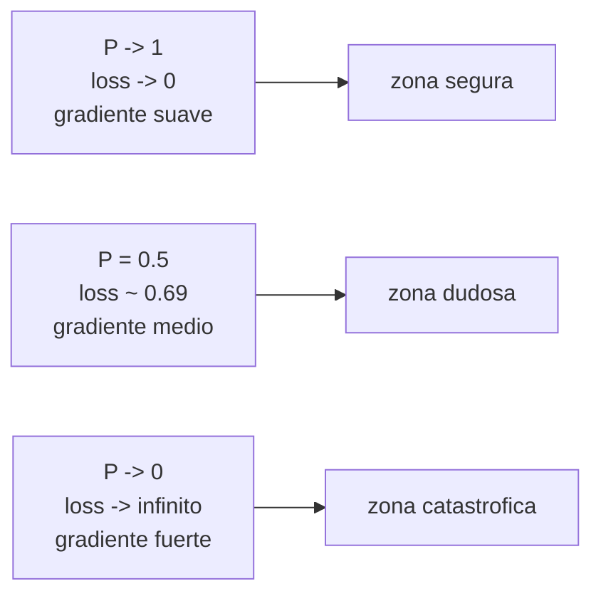

En el capitulo anterior viste como un embedding convierte palabras en vectores y como el dot product mide similitud entre ellos. Ese mecanismo permite que el modelo **proponga** una respuesta. Pero entrenar no es proponer: entrenar es **comparar la propuesta con la verdad y ajustar los pesos cuando la propuesta esta mal**. Para eso necesitamos una funcion de perdida (loss). En clasificacion de tokens, la funcion estandar se llama **cross-entropy**, y este capitulo la construye desde cero, sin asumir que conoces la formula.

```mermaid
flowchart LR
  A[Input: 'El cielo es ___'] --> B[Modelo Transformer]
  B --> C[Distribucion de probabilidad<br/>sobre 30000 palabras]
  C --> D[Loss = -log P(palabra correcta)]
  D --> E[Backprop ajusta pesos]
  E --> B
```

## 1. Pregunta de fondo: quien decide que el modelo se equivoco

Para entrenar, necesitas comparar la prediccion del modelo con una **respuesta correcta**. Eso requiere un dataset etiquetado. Hay dos formas de obtener esas etiquetas:

- **Supervisado clasico**: humanos etiquetan ("este correo es spam", "esta foto es un gato"). Caro, lento, no escala a billones de ejemplos.
- **Self-supervised**: el texto mismo es la respuesta correcta. Los Transformers usan esta estrategia, y por eso pueden entrenarse con todo internet sin un equipo de anotadores.

### Ejemplos de self-supervised

**GPT (next-token prediction):**
Tomas una oracion como "El cielo es azul" y generas pares (input, target) automaticamente recorriendo la oracion:

```
input              ->  target_correcto
"El"               ->  "cielo"
"El cielo"         ->  "es"
"El cielo es"      ->  "azul"
```

La palabra correcta es siempre **la que efectivamente venia despues** en el texto original. El "etiquetador" es el corpus.

**BERT (masked language model):**
Tomas "El gato come pescado", enmascaras una palabra al azar ("El gato [MASK] pescado") y entrenas al modelo a predecir cual era. De nuevo, la respuesta correcta esta en el propio texto.

Esta es la genialidad: **NO se necesitan humanos etiquetando**. Cualquier libro, paper, hilo de Reddit o snippet de codigo se convierte en millones de pares de entrenamiento gratis.


Self-supervised es el truco que volvio posibles a los LLMs. Antes los datasets eran chicos (ImageNet, ~1M imagenes). Con self-supervised el dataset es internet entero, sin pagarle a nadie por etiquetar.


## 2. El modelo predice probabilidades, no respuestas

Aqui hay un punto critico que se malentiende seguido: **el modelo NO devuelve "la respuesta es X"**. Devuelve una **distribucion de probabilidad sobre todas las palabras del vocabulario**.

Imagina que el vocabulario tiene 30,000 palabras y la pregunta es "El cielo es ___". La salida del modelo se ve asi:

```
"azul"     -> 0.45    (45% de probabilidad)
"oscuro"   -> 0.20
"verde"    -> 0.10
"limpio"   -> 0.08
... 29,996 palabras mas con probabilidades pequenitas
```

Las 30,000 probabilidades suman exactamente 1.0 (eso lo garantiza el softmax al final del modelo). Sabemos que la respuesta correcta era "azul", y el modelo le dio 45%. La pregunta operativa es: **como convertimos ese 0.45 en un numero de error que podamos minimizar**.

## 3. Lo que queremos del loss

Antes de mirar formulas, definamos con palabras que propiedades queremos. La funcion de perdida tiene que cumplir esto cuando el modelo le da probabilidad $P$ a la respuesta correcta:

| $P$ que dio el modelo a la respuesta correcta | Loss deseado |
|---|---|
| 1.0 (le dio 100%, perfecto) | **0** (sin castigo) |
| 0.9 (muy seguro y acerto) | poco |
| 0.5 (dudoso) | medio |
| 0.1 (mal) | alto |
| 0.001 (catastrofico) | muy alto |
| 0.0 (no le dio ninguna chance) | infinito |

Resumido: **una funcion que vale cero cuando el modelo es perfecto, crece cuando se equivoca, y se dispara cuando esta convencido de algo equivocado**. Existe una funcion matematica que cumple eso de manera natural: $-\log(P)$.

## 4. Por que $-\log(P)$ funciona

Recordatorio breve de logaritmo natural (base $e$):

- $\log(1) = 0$
- $\log(0.5) \approx -0.69$
- $\log(0.1) \approx -2.30$
- $\log(0.01) \approx -4.60$
- $\log(0) = -\infty$

El log de un numero entre 0 y 1 siempre es **negativo**, y se hace mas negativo mientras el numero se acerca a 0. Si **negamos** ese log, obtenemos un numero positivo que crece cuando $P$ se acerca a 0:

| $P$ | $\log(P)$ | $-\log(P)$ = loss |
|---|---|---|
| 1.00 | 0 | 0.00 |
| 0.90 | -0.10 | 0.10 |
| 0.50 | -0.69 | 0.69 |
| 0.10 | -2.30 | 2.30 |
| 0.01 | -4.60 | 4.60 |
| 0.0001 | -9.21 | 9.21 |

Hace exactamente lo que queriamos: cero cuando perfecto, infinito cuando catastrofico, y crece de manera no lineal al alejarse de la respuesta correcta. La formula del loss para una sola muestra de clasificacion es entonces:

$$
\mathcal{L} = -\log\big(P_{\text{correcta}}\big)
$$

donde $P_{\text{correcta}}$ es la probabilidad que el modelo le asigno a la palabra que **realmente** venia en el texto.

## 5. Por que no algo mas simple como $1 - P$

A primera vista uno podria proponer una formula mas elemental: si $P$ es la probabilidad asignada a la respuesta correcta, el error podria ser $1 - P$. Si el modelo dio 0.95, el error es 0.05. Si dio 0.10, el error es 0.90. Suena razonable. Comparemos las dos opciones lado a lado:

| $P$ | $1 - P$ | $-\log(P)$ |
|---|---|---|
| 0.9 | 0.10 | 0.10 |
| 0.1 | 0.90 | 2.30 |
| 0.001 | 0.999 | 6.91 |

Mira la tercera fila. Con $1-P$, un modelo que da $P=0.1$ (malo) y un modelo que da $P=0.001$ (terrible, **100 veces peor**) tienen losses casi identicos: 0.90 vs 0.999. Para el optimizador esos dos casos se ven practicamente iguales y los gradientes casi no diferencian entre ellos. **El modelo no aprenderia la diferencia entre malo y catastrofico**.

Con $-\log(P)$, los mismos dos casos dan 2.30 vs 6.91 -- 3 veces mas castigo para el peor. Esa diferencia se traduce en gradientes mas grandes para el caso terrible, y por lo tanto en ajustes mas fuertes a los pesos. **El modelo SI distingue grados de equivocacion**, y aprende mas rapido a no estar seguro de cosas equivocadas.


Cross-entropy se puede leer en una linea: "te doy un numero de error igual a $-\log$ de la probabilidad que le diste a la respuesta correcta. Mientras mas cerca de 0% le diste a lo correcto, mas alto el castigo, y crece sin limite."


## 6. El script: 3 modelos hipoteticos

El script `01b_cross_entropy_demo.py` no entrena nada -- solo simula la salida de 3 modelos hipoteticos prediciendo "El cielo es ___" sobre un vocabulario de 5 palabras: `["azul", "oscuro", "verde", "limpio", "hermoso"]`. La respuesta correcta es "azul" (id 0).

```python
import torch
import torch.nn.functional as F

vocab = ["azul", "oscuro", "verde", "limpio", "hermoso"]
target_id = 0  # azul es la respuesta correcta

modelo_A = torch.tensor([0.95, 0.02, 0.01, 0.01, 0.01])  # bueno
modelo_B = torch.tensor([0.30, 0.30, 0.20, 0.10, 0.10])  # mediocre
modelo_C = torch.tensor([0.01, 0.50, 0.20, 0.20, 0.09])  # malo
```

Cada vector es una distribucion de probabilidad: las 5 entradas suman 1.0. La interpretacion:

- **Modelo A** le da 95% a "azul". Esta muy seguro y acerto.
- **Modelo B** le da 30% a "azul" y reparte el resto. Esta dudoso pero no muy equivocado.
- **Modelo C** le da solo 1% a "azul" y 50% a "oscuro". Esta convencido de algo equivocado.

Calculamos el loss manualmente con $-\log(P_{\text{correcta}})$:

```python
loss_A = -torch.log(modelo_A[target_id])  # -log(0.95) = 0.0513
loss_B = -torch.log(modelo_B[target_id])  # -log(0.30) = 1.2040
loss_C = -torch.log(modelo_C[target_id])  # -log(0.01) = 4.6052
```

Resumido:

| Modelo | $P(\text{azul})$ | Loss = $-\log(P)$ |
|---|---|---|
| A (bueno) | 0.95 | 0.0513 |
| B (mediocre) | 0.30 | 1.2040 |
| C (malo) | 0.01 | 4.6052 |

**Ratio C/A = 89.8x**. El modelo malo recibe casi 90 veces mas castigo que el bueno. Esa diferencia es la senal que va a fluir hacia atras por backprop y va a hacer que los pesos del modelo C se ajusten fuerte mientras los del modelo A casi no se mueven. Asi se aprende: castigando duro lo equivocado y dejando tranquilo lo que ya esta bien.

### Verificacion con `F.cross_entropy`

PyTorch provee la funcion `F.cross_entropy` que hace exactamente esto, pero con una sutileza: espera **logits** (numeros crudos) en vez de probabilidades, y aplica softmax internamente para asegurar estabilidad numerica:

```python
target = torch.tensor([target_id])             # batch de tamano 1
logits = torch.log(modelo_A).unsqueeze(0)      # convertir probs a logits
loss_pytorch = F.cross_entropy(logits, target) # 0.0513, identico a -log(P)
```

`F.cross_entropy` es exactamente $-\log(P_{\text{correcta}})$, en una linea, con dos optimizaciones bajo el capot:

1. **Estabilidad numerica**: combina softmax + log + negar en una sola operacion (`log_softmax` + `nll_loss`) para evitar que probabilidades muy chicas (tipo $10^{-30}$) pierdan precision en float32.
2. **Vectorizacion**: opera sobre un batch entero de muestras de golpe, no una por una.

El resultado es el mismo numero que calculamos a mano. La funcion no es magia: es la formula del capitulo, optimizada para correr a escala.

## 7. La forma de la curva

Una tabla panoramica del loss para distintos valores de $P$:

| $P$(correcta) | $-\log(P)$ | interpretacion |
|---|---|---|
| 1.0000 | 0.0000 | perfecto, sin castigo |
| 0.9900 | 0.0101 | muy bien |
| 0.9500 | 0.0513 | muy bien |
| 0.9000 | 0.1054 | muy bien |
| 0.5000 | 0.6931 | ok pero mejorable |
| 0.3000 | 1.2040 | mal |
| 0.1000 | 2.3026 | mal |
| 0.0100 | 4.6052 | muy mal |
| 0.0010 | 6.9078 | catastrofico |
| 0.0001 | 9.2103 | catastrofico |



La curva es **no lineal**: cae rapido cerca de $P=1$ (modelo casi perfecto, gradiente suave) y se dispara cuando $P \to 0$ (modelo terrible, gradiente fuerte). Esto es **deseable** para el entrenamiento:

- Cuando el modelo esta cerca de la respuesta, el gradiente es chico y los pesos casi no se mueven (no rompemos lo que ya funciona).
- Cuando el modelo esta perdido, el gradiente es enorme y los pesos se ajustan fuerte (corregimos rapido).

Esa asimetria es lo que hace que cross-entropy converja mas rapido y mejor que un loss lineal tipo $1-P$ o cuadratico tipo $(1-P)^2$ en problemas de clasificacion.

## 8. Conexion con el siguiente capitulo

Lo que viste hasta aqui es **como se mide el error** en una muestra. El siguiente paso es: una vez que tienes el numero de loss, **como ajustas los millones de pesos del modelo para reducirlo**. La respuesta corta es: derivadas parciales del loss respecto a cada peso (gradientes) + un paso pequeno en la direccion opuesta. La respuesta larga -- y la magia que hace todo esto practico -- es **autograd**, el sistema que PyTorch usa para calcular esos gradientes automaticamente sin que tu derives nada a mano.

## 9. Pausa de verificacion

Antes de pasar al siguiente capitulo, asegurate de poder responder con tus palabras:

1. ¿El modelo devuelve "la respuesta correcta" o devuelve una distribucion de probabilidades sobre todas las opciones del vocabulario? ¿Por que esa distincion importa para entender el loss?
2. ¿Por que $-\log(0.01) > -\log(0.1)$? (¿Que pasa con $\log$ cuando el argumento se acerca a 0?)
3. ¿Por que self-supervised (el texto mismo es target) es lo que hace posible entrenar LLMs con todo internet sin pagar etiquetadores?
4. ¿Que ventaja concreta tiene $-\log(P)$ sobre $1-P$ cuando el modelo esta MUY equivocado? Da el ejemplo numerico.
5. ¿Que hace `F.cross_entropy` que `-torch.log(probs[target])` no haga? (Pista: piensa en estabilidad numerica y batches.)

Si las cinco preguntas tienen respuesta clara, el concepto esta solido y puedes avanzar.

---

## Siguiente capitulo

[02b - Self-supervision](../02b-self-supervision): de donde sale el target sin humanos etiquetando — el truco que hizo posibles los LLMs.

Despues: [03 - Gradient descent y autograd](../03-gradient-descent).

Codigo completo: `clase_14/practica/01b_cross_entropy_demo.py`

**Ver tambien:** [01 - Embeddings y dot product](../01-embeddings-y-dot-product) · [Indice de la practica](../) · [Clase 14 - Teoria](../../teoria) · [Fundamento self-attention](/fundamentos/self-attention).
