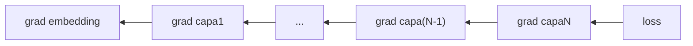

En los dos capitulos anteriores armamos las dos piezas representacionales del modelo: **embeddings** (como se ven los datos por dentro) y **cross-entropy** (como se mide el error). Falta la pieza dinamica: **como cambia el modelo** para que ese error baje. Eso es gradient descent. Y la magia que lo hace viable en redes con millones de parametros se llama **autograd**.

## 1. El problema en una frase

El modelo tiene **millones de numeros** (los pesos). Queremos encontrar los valores que hacen el loss bajo. No hay forma de probar todas las combinaciones — son demasiadas. Necesitamos un algoritmo que ajuste los numeros poco a poco en la direccion correcta.

Para hacerse una idea de la escala: GPT-2 small tiene 124 millones de parametros. GPT-3 tiene 175 mil millones. Si quisieramos probar solo dos valores por peso (alto/bajo) en GPT-2 small, serian $2^{124{,}000{,}000}$ combinaciones. No alcanza la edad del universo. La fuerza bruta es imposible.

Gradient descent resuelve esto con una idea sorprendentemente simple: en cada paso, mira **localmente** hacia donde mejora el loss y muevete un poquito en esa direccion. Repetido millones de veces, llega a configuraciones de pesos que funcionan asombrosamente bien.

## 2. La analogia del paisaje

Imagina el loss como **altitud** y los pesos como **posicion horizontal** en un terreno montañoso. Pesos buenos = valle (loss bajo). Pesos malos = montaña (loss alto).

```
   loss (altura)
    |
    |       ╱╲
   alto    ╱  ╲      <- pesos malos
    |     ╱    ╲    ╱
    |    ╱      ╲  ╱
    |   ╱        ╲╱
   bajo|__________________  <- valle: pesos buenos
    |
    +-----------------> pesos del modelo
```

Idea simple: mira la pendiente local. Da un paso hacia donde el suelo baja. Repite. Llegas a un valle.

Eso es **gradient descent**. "Gradient" = palabra tecnica para pendiente local.

La analogia se queda corta en un detalle: en el paisaje real solo tenemos dos dimensiones (norte-sur, este-oeste). En un Transformer hay millones. Pero la regla local es identica: **mira la pendiente, da un paso cuesta abajo**.

## 3. El gradiente

Para cada peso, el gradiente dice: "si aumento ESTE peso un poquito, el loss sube o baja, y cuanto?"

- Gradiente positivo -> subir el peso aumenta el loss -> hay que **bajarlo**
- Gradiente negativo -> subir el peso disminuye el loss -> hay que **subirlo**
- Gradiente cerca de 0 -> ya estoy en un valle local

Regla de actualizacion:

$$\text{nuevo\_peso} = \text{peso\_actual} - \alpha \cdot \text{gradiente}$$

donde $\alpha$ es el **learning rate** (tipico 0.001).

Notar el signo menos: por eso se llama "descent". Si la pendiente sube hacia la derecha (gradiente positivo), el algoritmo se mueve a la izquierda. Si baja hacia la derecha (gradiente negativo), se mueve a la derecha. Siempre **opuesto al gradiente** = siempre cuesta abajo.


El gradiente NO te dice donde esta el minimo. Solo te dice la pendiente local: "aqui mismo, en este punto exacto, hacia donde sube el loss". Es informacion miope — funciona solo si das pasos chicos. Si das un paso enorme, la pendiente local deja de ser representativa y puedes terminar en un peor lugar. Por eso el learning rate importa tanto.


## 4. Por que se llama "back"-propagation?

El modelo tiene capas en serie:

```
input -> embedding -> capa1 -> capa2 -> ... -> capaN -> output -> loss
```

Para ajustar `capa1` necesitas saber: si muevo un peso de capa1, cuanto cambia el loss al final? La idea genial es la **regla de la cadena**: los gradientes se calculan **al reves**, propagando el error desde el loss hacia atras hasta los embeddings.



La intuicion fisica de "atras" es literal: el forward pass va de los datos hacia el loss (izquierda a derecha). El backward pass va del loss hacia los datos (derecha a izquierda), llevando la "responsabilidad" del error hasta cada peso individual.

PyTorch hace todo esto solo con `loss.backward()`. Tu solo escribes el forward; PyTorch deriva el backward gratis. Esto es lo que distingue PyTorch (o TensorFlow, o JAX) de hacer redes neuronales en NumPy puro: en NumPy tendrias que derivar a mano cada operacion, lo que es factible para una capa pero impensable para un Transformer.

## 5. El loop de entrenamiento completo

Antes de entrar al demo de una variable, conviene fijar el esqueleto que vas a ver una y otra vez en codigo PyTorch real:

```python
for batch in dataset:
    # 1. Forward
    output = model(batch.input)

    # 2. Loss
    loss = F.cross_entropy(output, batch.target)

    # 3. Limpiar gradientes acumulados
    optimizer.zero_grad()

    # 4. BACKPROP: calcular gradiente para cada peso
    loss.backward()

    # 5. Ajustar: peso = peso - lr * gradiente
    optimizer.step()
```

Cinco lineas, un Transformer entrenandose. El paso 3 (limpiar gradientes) es el que mas confunde al principio: PyTorch **acumula** gradientes por defecto en cada `backward()`. Si no los limpias, sumas el gradiente del batch nuevo al del batch anterior y todo se desordena. `zero_grad()` resetea esa pizarra.

## 6. El script: minimizar f(x) = x²

(Extractos del script `01c_gradient_descent_demo.py`)

Caso simplificado: **una sola variable**, no millones. La funcion `f(x) = x²` tiene minimo en $x=0$. Empezamos en $x=5$ y aplicamos gradient descent.

Derivada de $x^2$ es $2x$ (eso es el gradiente). Con `learning_rate = 0.1`:

```
paso |        x |       f(x) |  gradiente |    nuevo_x
0    |   5.0000 |    25.0000 |    10.0000 |     4.0000
1    |   4.0000 |    16.0000 |     8.0000 |     3.2000
5    |   1.6384 |     2.6844 |     3.2768 |     1.3107
10   |   0.5369 |     0.2882 |     1.0737 |     0.4295
19   |   0.0721 |     0.0052 |     0.1441 |     0.0576
```

Convergencia exponencial: cada iteracion $x$ se multiplica por 0.8. El "modelo" llega a $x \approx 0.06$ en 20 pasos.

Por que 0.8? Porque la regla es:

$$x_{\text{nuevo}} = x - 0.1 \cdot 2x = x \cdot (1 - 0.2) = 0.8 \cdot x$$

Cada paso reduce $x$ al 80% del anterior. Despues de 20 pasos, $0.8^{20} \approx 0.012$, asi que $5 \cdot 0.012 \approx 0.06$. Cuadra con la tabla. La velocidad de convergencia depende del producto `learning_rate * derivada_segunda` — pero para este capitulo basta con la intuicion: lr y forma de la funcion juntos definen que tan rapido se llega.

## 7. PyTorch autograd: lo mismo, automatico

```python
x = torch.tensor(5.0, requires_grad=True)
fx = x ** 2          # forward
fx.backward()        # backward: PyTorch calcula x.grad = 2x = 10
print(x.grad)        # tensor(10.)
```

Sin que tu derives nada, PyTorch sabe que la derivada de $x^2$ es $2x$. Funciona para cualquier funcion diferenciable.

El truco interno: cuando declaras un tensor con `requires_grad=True`, PyTorch construye en silencio un **grafo computacional** detras de cada operacion. Cada vez que haces `x ** 2`, `x + y`, `x.matmul(W)`, etc., agrega un nodo al grafo que recuerda que operacion fue y cual es su derivada. Cuando llamas `backward()`, recorre el grafo al reves aplicando la regla de la cadena.


Esto es lo que hace posible todo deep learning moderno. PyTorch registra cada operacion sobre tensores con `requires_grad=True`. Cuando llamas `backward()`, recorre el grafo computacional al reves aplicando la regla de la cadena. Funciona para CUALQUIER funcion diferenciable, sin importar la complejidad: redes con millones de parametros y cientos de capas. Tu escribes el forward; PyTorch hace el backward gratis.


En el script ves la version "estilo PyTorch" del mismo experimento, con un detalle nuevo:

```python
with torch.no_grad():
    x -= learning_rate * x.grad
    x.grad.zero_()
```

`with torch.no_grad()` le dice a PyTorch: "esta operacion es housekeeping, no la metas en el grafo computacional". Si actualizaramos `x` sin ese contexto, PyTorch interpretaria la actualizacion como una operacion mas y empezaria a derivar la actualizacion. Ese seria un bug clasico. En codigo real, `optimizer.step()` se encarga de hacer esto correctamente.

## 8. El learning rate es CRITICO

Tres regimenes (mostrar resultados del script):

**lr = 0.1 (justo):** convergencia exponencial. Excelente.

**lr = 0.01 (chico):** despues de 20 pasos sigue en $x = 3.34$. Tarda 10x mas. No diverge, solo es muy lento. En modelos reales esto se traduce en horas extra de GPU sin necesidad.

**lr = 1.1 (grande):** EXPLOTA. Cada paso es tan grande que se pasa al otro lado del minimo, oscila y diverge:

```
paso |          x |          f(x)
   0 |    -6.0000 |       25.0000
   1 |     7.2000 |       36.0000     <- otro lado
   2 |    -8.6400 |       51.8400     <- mas lejos
   3 |    10.3680 |       74.6496
   ...
   9 |    30.9628 |      666.8474     <- divergencia total
```

Esto se llama **gradient explosion**. Pasa al entrenar Transformers reales si el lr es muy alto, especialmente al inicio del entrenamiento cuando los pesos son chicos y los gradientes pueden ser grandes. Se mitiga con varias tecnicas:

- **Gradient clipping**: cortar el gradiente a un maximo (tipico `max_norm = 1.0`).
- **Learning rate warmup**: empezar con `lr` muy chico y subirlo progresivamente en los primeros miles de pasos.
- **Schedulers**: bajar `lr` con el tiempo (cosine decay, linear decay).

En la practica, encontrar un buen `lr` es uno de los hiperparametros mas importantes. Demasiado bajo = el modelo no aprende en tiempo razonable. Demasiado alto = el modelo diverge o queda atascado oscilando. El "sweet spot" depende de la arquitectura, el optimizer, el batch size y los datos.

## 9. SGD vs Adam

**SGD (Stochastic Gradient Descent)** — el basico:

$$w \leftarrow w - \alpha \cdot g$$

Donde $g$ es el gradiente. Es lo que vimos en el demo: tomar el gradiente actual y aplicarlo directo. Funciona, pero es ingenuo: trata a todos los pesos por igual y no recuerda la historia.

**Adam** — el estandar moderno en Transformers:

- Mantiene **promedio movil** de gradientes pasados (momento, como bajar con impulso).
- Mantiene **promedio movil del cuadrado** de los gradientes (varianza por peso).
- Adapta `lr` **por peso individualmente** segun ese historial: pesos cuyos gradientes son chicos reciben pasos mas grandes; pesos cuyos gradientes son grandes/ruidosos reciben pasos mas chicos.
- Converge mas rapido, mas robusto, menos sensible al `lr` exacto.

La ecuacion completa de Adam (referencia, no para memorizar):

$$m_t = \beta_1 m_{t-1} + (1 - \beta_1) g_t$$
$$v_t = \beta_2 v_{t-1} + (1 - \beta_2) g_t^2$$
$$w \leftarrow w - \alpha \cdot \frac{\hat{m}_t}{\sqrt{\hat{v}_t} + \epsilon}$$

Tipicamente $\beta_1 = 0.9$, $\beta_2 = 0.999$, $\epsilon = 10^{-8}$. **AdamW** es una variante con weight decay desacoplado, casi universal en Transformers modernos.

99% de Transformers usan Adam o AdamW. SGD se usa mas en vision clasica (ResNets de ImageNet), donde con bastante tuning logra resultados ligeramente mejores. Para texto, language modeling y casi todo lo nuevo: Adam/AdamW.

## 10. La conexion completa

| En el demo (1 variable) | En un Transformer real (millones) |
|---|---|
| `x` (1 numero) | weights del modelo |
| `f(x) = x²` | `loss = cross_entropy(...)` |
| `df/dx = 2x` | `df/d(weight_i)` calculado por backprop |
| `x = x - lr * 2x` | `weight = weight - lr * grad`, para cada peso |
| 20 pasos | millones de batches |

El forward pass del Transformer (embeddings -> attention -> FFN -> ... -> logits) es solo una funcion matematica complicada. PyTorch trackea las operaciones, autograd calcula gradientes, optimizer aplica ajustes. Mismo principio que $x^2$; mas piezas en el medio.

Otra forma de verlo: cuando lees un paper de Transformers que dice "lo entrenamos con AdamW, lr=3e-4, warmup de 4000 pasos, gradient clipping 1.0", lo que estan describiendo es exactamente las tres patas que viste:

1. El **loop**: forward, loss, zero_grad, backward, step.
2. El **optimizer**: AdamW en lugar de SGD.
3. Las **proteccionesa** contra divergencia: warmup, clipping, schedulers.

Nada mas. La complejidad del modelo esta en la arquitectura, no en el mecanismo de aprendizaje.

## 11. Pausa de verificacion

1. Que hace `loss.backward()` en PyTorch?
2. Por que con learning rate muy grande el modelo diverge?
3. Por que se llama "back"-propagation? (sentido fisico de "atras")
4. Cual es la diferencia conceptual entre SGD y Adam?
5. Por que hay que llamar `optimizer.zero_grad()` en cada iteracion?
6. Que hace `with torch.no_grad()` y por que es importante al actualizar pesos manualmente?

---

## Siguiente capitulo

Ahora tienes las cuatro piezas: embeddings (representacion), cross-entropy (medicion del error), gradient descent (mecanismo de ajuste) y autograd (automatizacion). Es momento de ponerlas todas a funcionar juntas en un ciclo de entrenamiento real.

[04 - Mini Word2Vec: training real](../04-mini-word2vec)

Codigo completo: `clase_14/practica/01c_gradient_descent_demo.py`

---

**Ver tambien:** [02 - Cross-entropy](../02-cross-entropy) (el loss que minimizamos) · [Indice de la practica](../) · [Clase 14 - Teoria](../../teoria) · [Fundamento transformer](/fundamentos/transformer).
