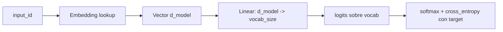
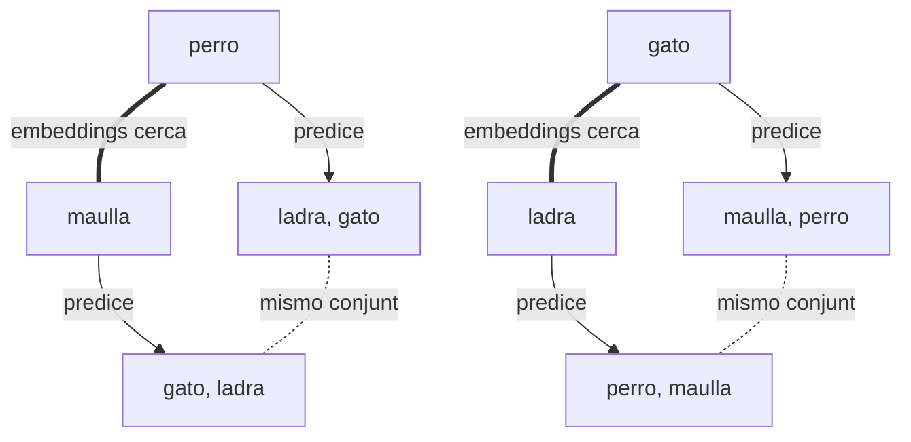
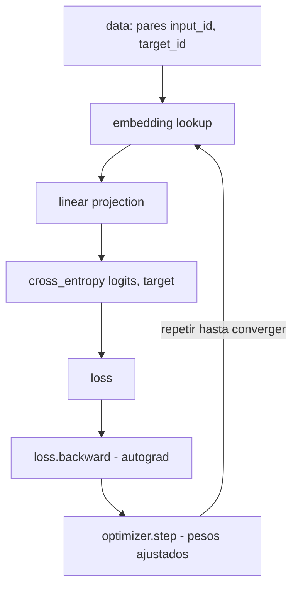

## 1. Donde estamos

Hasta aqui construimos las piezas por separado. Ahora toca juntarlas en un ciclo de entrenamiento real.

Lo que ya tienes:

- Embeddings (matriz de pesos, capitulo 01).
- Dot product (similitud entre vectores, capitulo 01).
- Cross-entropy (loss para clasificacion, capitulo 02).
- Gradient descent + autograd (capitulo 03).

Tiempo de juntarlo todo y entrenar embeddings de verdad. La meta de este capitulo es ver, con tus propios ojos, como una matriz de embeddings inicializada al azar se transforma — solo por aplicar backprop sobre cross-entropy — en una matriz con estructura.


Al final de este capitulo vas a haber corrido el ciclo completo: dataset -> forward -> loss -> backward -> step. Es la misma estructura que entrena GPT-4. Lo unico que cambia en los modelos grandes es la complejidad del bloque del medio.


## 2. La tarea: skip-gram simplificado

Vamos a construir un **mini-Word2Vec**. La tarea es la version mas simple posible de skip-gram: dada una palabra, predecir cual co-ocurre con ella.

### Vocabulario

Solo 6 palabras, agrupadas en dos dominios semanticos:

```
["perro", "gato", "ladra", "maulla", "avion", "vuela"]
```

Dominio mascotas: `perro`, `gato`, `ladra`, `maulla`. Dominio aviacion: `avion`, `vuela`.

### Mini-corpus

En lugar de oraciones completas, le damos al modelo **pares de palabras que co-ocurren** en oraciones imaginarias:

```
perro  <-> ladra     (un perro ladra)
gato   <-> maulla    (un gato maulla)
perro  <-> gato      (ambos son mascotas)
ladra  <-> maulla    (ambos son sonidos de mascotas)
avion  <-> vuela     (un avion vuela)
```

### Pares de entrenamiento

Cada par se entrena en ambas direcciones (skip-gram clasico). Entonces de 5 co-ocurrencias salen 10 pares (input, target):

```
input -> target
perro  -> ladra
ladra  -> perro
gato   -> maulla
maulla -> gato
perro  -> gato
gato   -> perro
ladra  -> maulla
maulla -> ladra
avion  -> vuela
vuela  -> avion
```

Todo esto se codifica como dos tensores de ids:

```python
input_ids  = tensor([0, 2, 1, 3, 0, 1, 2, 3, 4, 5])
target_ids = tensor([2, 0, 3, 1, 1, 0, 3, 2, 5, 4])
```

donde el mapping es `perro=0, gato=1, ladra=2, maulla=3, avion=4, vuela=5`.

## 3. La arquitectura

Tan simple como se puede: `embedding lookup -> linear projection -> logits sobre vocab`.



### El codigo

```python
import torch
import torch.nn as nn
import torch.nn.functional as F

class TinyEmbeddingModel(nn.Module):
    def __init__(self, vocab_size, d_model):
        super().__init__()
        self.embedding = nn.Embedding(vocab_size, d_model)
        self.output = nn.Linear(d_model, vocab_size, bias=False)

    def forward(self, ids):
        x = self.embedding(ids)   # (batch, d_model)
        return self.output(x)     # (batch, vocab_size) = logits
```

### El conteo de parametros

Con `vocab_size=6` y `d_model=8`:

- `embedding.weight`: $6 \times 8 = 48$ parametros.
- `output.weight`: $8 \times 6 = 48$ parametros (sin bias).

Total: **96 parametros**. Comparalo con GPT-3 (175 mil millones). Misma estructura, escala distinta.


La capa `output` proyecta de `d_model` a `vocab_size` para poder hacer cross-entropy contra el target. En modelos grandes a esto se le llama **lm_head** ("language modeling head") y es la ultima capa de GPT, BERT, T5, etc. Es lo que convierte un vector latente en una distribucion sobre el vocabulario.


## 4. El training loop completo

Esta es la pieza que junta todo lo de los capitulos anteriores:

```python
torch.manual_seed(42)
model = TinyEmbeddingModel(vocab_size=6, d_model=8)
optimizer = torch.optim.Adam(model.parameters(), lr=0.1)

n_epochs = 300
for epoch in range(n_epochs):
    logits = model(input_ids)                   # forward
    loss = F.cross_entropy(logits, target_ids)  # loss

    optimizer.zero_grad()                       # limpiar gradientes
    loss.backward()                             # BACKPROP (autograd)
    optimizer.step()                            # ajustar pesos
```

Detallando cada linea:

| Linea | Que hace | Capitulo |
|---|---|---|
| `model(input_ids)` | embedding lookup + proyeccion lineal | 01 |
| `F.cross_entropy(logits, target_ids)` | mide error entre prediccion y target | 02 |
| `optimizer.zero_grad()` | borra gradientes del paso anterior | 03 |
| `loss.backward()` | autograd calcula $\partial L / \partial \theta$ para todos los pesos | 03 |
| `optimizer.step()` | Adam ajusta los pesos: $\theta \leftarrow \theta - \eta \nabla L$ | 03 |


Esa estructura de 5 lineas es **identica** a entrenar GPT-4. Lo unico que cambia es la complejidad del bloque del medio (self-attention, multi-head, decenas de capas, normalizacion, residuales). El proceso de aprendizaje en si es el mismo.


## 5. Que ves al correr

Vamos por partes — antes de entrenar, durante, despues.

### 5.1 Embeddings ANTES (random)

Inicializados con `nn.Embedding`, los vectores son random. La matriz de dot products no tiene patron:

```
Dot products ANTES (random):
            perro    gato   ladra  maulla   avion   vuela
   perro:   13.27    1.78   -1.96   -0.86   -3.05    2.35
   gato:     1.78    7.04   -2.27    1.80    0.79   -3.40
   ladra:   -1.96   -2.27    5.69   -1.50   -1.45    1.31
  maulla:   -0.86    1.80   -1.50    4.80   -1.79    0.84
   avion:   -3.05    0.79   -1.45   -1.79    9.55   -2.84
   vuela:    2.35   -3.40    1.31    0.84   -2.84    6.18
```

Lee asi: `scores[i, j] = embedding[i] . embedding[j]`. Sin entrenamiento, los valores son arbitrarios (los positivos y negativos no significan nada semantico).

### 5.2 Loss durante training

```
epoch    loss
   0    1.5431
  30    0.5548
  60    0.5545
  90    0.5545
 ...    ...
 299    0.5545
```

Convergencia rapida — en las primeras 30 epocas el loss baja de $\approx 1.54$ a $\approx 0.55$, y ahi se queda.

¿Por que se queda en `0.5545` y no en 0?

$$
-\log(0.5) \approx 0.6931 \quad \text{(loss si predice 0.5 a un solo target)}
$$

Pero la verdadera explicacion es mas fina: cuando un mismo input tiene **dos targets validos** en el dataset, el optimo es repartir 0.5 / 0.5 entre ellos, lo que da un loss promedio cercano a $-\log(0.5) \approx 0.693$. El valor $0.5545$ es ligeramente menor porque el dataset tiene pares de "una sola opcion" mezclados (`avion <-> vuela`).


**Loss optimo cuando el target no es deterministico.** Si `perro` co-ocurre con `ladra` y `gato` con igual frecuencia, el modelo no puede hacer mejor que asignar $P=0.5$ a cada uno. El cross-entropy minimo posible para ese ejemplo es $-\log(0.5) \approx 0.693$. Que el loss converja a ese piso es **prueba** de que el modelo aprendio la estructura — no que se quedo atascado.


### 5.3 Predicciones del modelo entrenado

Al pasar cada palabra del vocab por el modelo y aplicar softmax sobre los logits:

```
input  -> top-3 predicciones
 perro -> ladra (0.50), gato   (0.50), avion  (0.00)
 gato  -> perro (0.50), maulla (0.50), vuela  (0.00)
 ladra -> perro (0.50), maulla (0.50), avion  (0.00)
 maulla-> ladra (0.50), gato   (0.50), avion  (0.00)
 avion -> vuela (1.00), maulla (0.00), perro  (0.00)
 vuela -> avion (1.00), perro  (0.00), gato   (0.00)
```

Perfecto. El modelo aprendio **exactamente** los pares co-ocurrentes del dataset:

- `perro` predice `{ladra, gato}` con 50/50 (sus dos co-ocurrentes).
- `avion` predice `vuela` con 100% (su unico co-ocurrente).

## 6. El resultado contraintuitivo (la leccion clave)

Hasta aqui parece todo previsible. Pero ahora viene la sorpresa.

Mira la matriz de dot products de los **embeddings entrenados**:

```
Dot products DESPUES (entrenados):
            perro    gato   ladra  maulla   avion   vuela
   perro:   26.95    1.52   -6.24   18.20  -17.08   -6.97
   gato:     1.52   19.97   14.46   -5.82  -15.87   -0.55
   ladra:   -6.24   14.46   24.31   -5.58  -11.68   -7.29
  maulla:   18.20   -5.82   -5.58   19.70   -6.08   -9.76
   avion:  -17.08  -15.87  -11.68   -6.08   28.42    4.54
   vuela:   -6.97   -0.55   -7.29   -9.76    4.54   21.20
```

Los pares que esperarias como "intuitivos":

| Par | Esperado | Real |
|---|---|---|
| `perro . gato` | alto (ambos mascotas) | **1.52** (bajo) |
| `ladra . maulla` | alto (ambos sonidos) | **-5.58** (NEGATIVO) |

Y los valores ALTOS resultan estar en pares no obvios:

| Par | Valor |
|---|---|
| `perro . maulla` | **18.20** |
| `gato . ladra` | **14.46** |

¿Que paso? ¿El entrenamiento fallo?

No. El entrenamiento converge perfectamente al optimo (las predicciones son 50/50 exactas). Lo que falla es **nuestra intuicion sobre que organiza el espacio de embeddings**.

## 7. Por que pasa esto (la verdad sobre los embeddings)

Los embeddings **no se organizan por nuestras categorias mentales** ("mascotas vs sonidos"). Se organizan por **que predicen**.

### Quien predice lo mismo, queda cerca

Mira los conjuntos de targets que cada palabra debe predecir:

| Palabra | Debe predecir |
|---|---|
| `perro` | `{ladra, gato}` |
| `maulla` | `{gato, ladra}` |
| `gato` | `{maulla, perro}` |
| `ladra` | `{perro, maulla}` |

Observa: `perro` y `maulla` deben predecir **el mismo conjunto** `{ladra, gato}` (= `{gato, ladra}`). Para que sus logits den las mismas dos opciones con probabilidad 0.5/0.5, sus vectores embedding tienen que ser parecidos despues de la proyeccion `output`. **Por eso `perro . maulla = 18.20`**.

Misma cosa con `gato` y `ladra`: ambos deben predecir `{perro, maulla}`. Sus embeddings se vuelven similares. **Por eso `gato . ladra = 14.46`**.

Y al reves: `perro` predice `{ladra, gato}` mientras que `gato` predice `{maulla, perro}`. **Conjuntos distintos** -> embeddings poco alineados -> `perro . gato = 1.52` (cerca de 0).




Los embeddings se agrupan por **"intercambiabilidad funcional"**, no por categorias humanas. Dos palabras quedan cerca si son intercambiables como inputs — es decir, si se pueden usar en los mismos contextos para predecir las mismas cosas. Esta es la **hipotesis distribucional** de Harris (1954): "you shall know a word by the company it keeps" (Firth, 1957).


### La formula detras

El logit del target $t$ dado el input $i$ es:

$$
\text{logit}(t \mid i) = e_i \cdot W_t
$$

donde $e_i$ es el embedding de la palabra input y $W_t$ es la fila $t$ de la matriz `output`. Para que `perro` y `maulla` produzcan los **mismos logits** sobre todos los targets, necesitan que:

$$
e_{\text{perro}} \cdot W_t \approx e_{\text{maulla}} \cdot W_t \quad \forall t
$$

La forma mas eficiente de lograr esto en un espacio de baja dimension es haciendo $e_{\text{perro}} \approx e_{\text{maulla}}$. **El optimizador descubre eso solo**, sin que nadie le diga.

## 8. Por que en Word2Vec real SI salen clusters intuitivos

Si en un dataset chico salen patrones contraintuitivos, ¿por que el Word2Vec original (Mikolov et al., 2013) entrenado en miles de millones de palabras SI agrupa "perro" y "gato" cerca?

Porque en un corpus grande, "perro" y "gato" aparecen en **cientos de contextos compartidos**:

- "mi ___ se enfermo"
- "alimento mi ___ todos los dias"
- "fui al veterinario con mi ___"
- "al ___ le gusta jugar en el parque"
- "compre comida para mi ___"

Estos contextos compartidos aportan miles de pares de entrenamiento donde `perro` y `gato` deben predecir las mismas palabras de contexto. La intercambiabilidad funcional **emerge** del volumen masivo de co-ocurrencias compartidas.

En nuestro mini-corpus de 5 pares, solo agregamos **uno** de esos contextos compartidos (`perro <-> gato` directo, "ambos mascotas"). Ese par hace que `perro` deba predecir `gato`, no que `perro` y `gato` sean intercambiables. Por eso el efecto es debil.

### Donde si funciona en nuestro mini-corpus

El dominio aviacion **si** queda separado de mascotas:

| Comparacion | Valor |
|---|---|
| `avion . vuela` | **4.54** (positivo, alineados) |
| `avion . perro` | **-17.08** (muy negativo) |
| `avion . gato` | **-15.87** (muy negativo) |
| `avion . ladra` | **-11.68** (muy negativo) |
| `vuela . perro` | **-6.97** (negativo) |

`avion` y `vuela` no quedan tan altos entre si (4.54) porque solo tienen 1 co-ocurrencia. Pero ambos quedan **muy lejos** de cualquier mascota, porque los conjuntos de palabras que predicen son completamente disjuntos. **Los dominios SI se separan**, aunque la geometria interna de cada dominio sea contraintuitiva.

## 9. Lo que probamos con este capitulo

Hicimos el ciclo completo de entrenamiento:

- Empezamos con embeddings random (matriz de dot products sin patron).
- Definimos un loss (cross-entropy) y un dataset (10 pares input/target).
- Backprop (autograd) ajusto los embeddings hacia el optimo del loss.
- El modelo aprendio **exactamente** los pares que el dataset le pidio (probs 50/50 perfectas).
- Los embeddings emergieron con **estructura geometrica**, pero esa estructura es la que el dataset induce, no la que nuestra intuicion espera.

Eso es exactamente lo que pasa al entrenar BERT, GPT, RoBERTa, T5 con todo internet — solo que con corpora gigantescos (cientos de miles de millones de tokens) y tareas mas sofisticadas (Masked Language Modeling para BERT, next-token prediction para GPT).

## 10. Recapitulacion: el ciclo completo



En codigo:

```python
for epoch in range(n_epochs):
    logits = model(input_ids)                    # forward
    loss = F.cross_entropy(logits, target_ids)   # loss

    optimizer.zero_grad()                        # limpiar
    loss.backward()                              # backward
    optimizer.step()                             # update
```


**Esa estructura de 5 lineas es identica a entrenar GPT-4.** Los modelos grandes solo cambian:

- El **modelo** (en lugar de embedding+linear, hay un Transformer con multi-head attention + FFN + residuales + LayerNorm en docenas de capas).
- El **dataset** (en lugar de 10 pares, tokens de toda la web).
- La **tarea** (en lugar de skip-gram, next-token prediction o masked LM).
- La **escala de compute** (semanas en miles de GPUs).

Pero el ciclo `forward -> loss -> backward -> step` es el mismo. Si entendiste este capitulo, entiendes el motor de cualquier red neuronal moderna.


## 11. Pausa de verificacion

Antes de avanzar, asegurate de poder responder:

1. ¿Por que el loss converge a $\approx 0.5545$ y no a 0?
2. ¿Por que `perro . maulla = 18.20` es alto si pensariamos que `perro` y `gato` deberian estar cerca por ser ambos mascotas?
3. Si quisieras que `perro` y `gato` salieran cerca en el espacio de embeddings, ¿que par(es) agregarias al corpus?
4. ¿En que se diferencia este mini-Word2Vec de un Transformer real?
5. ¿Por que la matriz `output` tiene shape `(d_model, vocab_size)` y no `(vocab_size, vocab_size)`?

### Sugerencias de respuesta

1. Porque cada input tiene en promedio 2 targets validos. El optimo posible es repartir $P = 0.5$ entre ellos, lo que da $-\log(0.5) \approx 0.69$ por ejemplo. El promedio sobre el dataset (que mezcla casos de 2 targets y 1 target) da $\approx 0.55$.
2. Porque `perro` y `maulla` tienen que predecir el **mismo conjunto** `{ladra, gato}`. Para producir los mismos logits, sus embeddings deben ser similares. La intuicion humana de "perro y gato son mascotas" no esta codificada en el dataset.
3. Por ejemplo: `(perro, mascota)` y `(gato, mascota)`. Asi los dos compartirian el target `mascota`, aumentando su intercambiabilidad funcional. O cualquier par que les de **contextos compartidos**.
4. Tres diferencias clave: (a) un Transformer tiene **self-attention** entre tokens en vez de un solo lookup, (b) tiene **muchas capas** apiladas con residuales y LayerNorm, (c) procesa **secuencias** completas en paralelo, no pares aislados. Pero el loop de entrenamiento es identico.
5. Porque proyectamos del espacio latente (`d_model`) al espacio de logits sobre el vocabulario (`vocab_size`). Si fuera `(vocab_size, vocab_size)` perderiamos el embedding intermedio, que es justamente lo que queremos aprender.

## 12. Que viene despues

Ya tienes la base solida del ciclo de entrenamiento. Los siguientes escalones (en construccion) suben la complejidad del **modelo**, no del proceso:

| Escalon | Concepto | Resultado |
|---|---|---|
| 2 | Q, K, V con proyecciones aprendibles + scaling $\sqrt{d_k}$ | Self-attention real, no degenerada |
| 3 | Multi-head attention | $h$ cabezas en paralelo capturando relaciones distintas |
| 4 | Bloque Transformer (attention + FFN + residual + LayerNorm) | Una capa encoder funcional |
| 5 | Mini-GPT char-level entrenado en Shakespeare | El modelo genera texto coherente |

Cuando llegues alla, vas a tener un Transformer construido por ti, end-to-end, sin librerias de alto nivel. **Eso** es entender el Transformer.

---

Codigo completo: `clase_14/practica/01d_train_embeddings.py`

Volver al [hub de practica](..) o a [Clase 14](../..).
