En el escalon anterior construimos self-attention de una sola cabeza: tres matrices aprendibles $W^Q, W^K, W^V$, scaling por $\sqrt{d_k}$, softmax, mezcla de values. Funciona y es entrenable. Pero todavia tiene una limitacion estructural — una sola — que vamos a romper en este capitulo: produce **una sola distribucion de pesos por token**.

Eso suena inocente hasta que piensas en lo que significa para el lenguaje. Una palabra real, cumpliendo su rol en una oracion, no tiene una unica relacion saliente con el resto de la oracion. Tiene varias, distintas en tipo y simultaneas. Y un solo softmax no puede capturarlas todas a la vez. Este capitulo construye la pieza que arregla eso: **multi-head attention**.

El script que acompana es `clase_14/practica/03_multi_head_attention.py`. Misma rutina: lee hasta la seccion 4, corre el script, mira los numeros, vuelve al texto.

---

## 1. Recap: el compromiso del softmax single-head

Empecemos con una oracion concreta: **"Alexis kicked the ball at the park"**.

Concentrate en la palabra **"kicked"**. Si le preguntas al modelo "que partes de la oracion son relevantes para entender 'kicked'?", la respuesta honesta es: varias, en simultaneo.

- "kicked" tiene un **sujeto** que ejecuta la accion: "Alexis".
- Tiene un **objeto directo** sobre el que recae la accion: "ball" (mas el determinante "the").
- Tiene un **complemento de lugar** que situa la accion: "park".

Esas tres relaciones son distintas en tipo. La primera es sujeto-verbo, la segunda verbo-objeto, la tercera verbo-locacion. Si quisieras representar "kicked" en su contexto, idealmente le darias acceso a las tres a la vez, sin tener que renunciar a ninguna.

Eso es lo que single-head attention **no puede** hacer. Mira la formula:

$$
\text{output}[\text{kicked}] = \sum_j \alpha_{kicked, j} \cdot V[j], \quad \text{con} \sum_j \alpha_{kicked, j} = 1
$$

Los pesos $\alpha$ vienen de un softmax. Como **suman 1**, son un presupuesto fijo de atencion. Si "kicked" gasta 0.6 en "Alexis", le quedan 0.4 para repartir entre el resto. Si quiere subir tambien "ball" a 0.5, tiene que bajar "Alexis". El softmax obliga a un trade-off: solo puede haber un foco fuerte por token, o una mezcla diluida.


El softmax actua como **"argmax suave"**: tiende a elegir UN ganador con la mayor parte de la masa. Si tu modelo necesita resaltar multiples ganadores en distintas dimensiones de relacion (sujeto, objeto, lugar), un solo softmax no alcanza. Necesitas multiples softmaxes operando en paralelo, y cada uno mirando un aspecto distinto.


La consecuencia es que single-head deja "expresividad sobre la mesa". El modelo es entrenable, pero esta forzado a comprimir todas las relaciones distintas en un unico mapa de pesos. Esa es la limitacion que multi-head viene a resolver.

---

## 2. La idea: h atenciones en paralelo

La solucion es directa: **ejecuta $h$ atenciones independientes a la vez**, cada una con sus propias matrices, cada una en un subespacio distinto, y concatena los resultados al final. Cada copia se llama una **cabeza**.

La intuicion: si cada cabeza tiene su propio softmax, cada una puede tener su propio "foco". La cabeza 1 puede aprender a especializarse en relaciones sujeto-verbo. La cabeza 2 en verbo-objeto. La cabeza 3 en correferencias. La cabeza 4 en token anterior, etc. Cada una manda su propia mezcla, y al final se combinan.

Matematicamente, la formula es:

$$
\text{head}_i = \text{Attention}(Q W_i^Q, K W_i^K, V W_i^V)
$$

$$
\text{MultiHead}(Q, K, V) = \text{Concat}(\text{head}_1, \ldots, \text{head}_h) W^O
$$

Aqui hay tres cosas nuevas que vale la pena desempacar:

- **$h$ tripletas de matrices**. En vez de una sola $(W^Q, W^K, W^V)$, tienes $h$ tripletas $(W_i^Q, W_i^K, W_i^V)$ para $i = 1, \ldots, h$. Cada tripleta proyecta a un subespacio de dimension $d_k = d_{model} / h$, no $d_{model}$.
- **Concat**. Cada cabeza produce un output de shape `(T, d_k)`. Concatenas las $h$ a lo largo de la dimension feature: $(T, h \cdot d_k) = (T, d_{model})$. Vuelves a tener un tensor de la dimension original.
- **$W^O$**. Una matriz final, aprendible, que **mezcla** las cabezas. Es lo que permite que la informacion extraida por las cabezas se combine y dialogue. Sin $W^O$, las cabezas serian compartimentos estancos pegados; con $W^O$, son contribuciones que se integran.

### Hyperparametros canonicos (Vaswani 2017)

El paper original "Attention Is All You Need" eligio:

- $d_{model} = 512$
- $h = 8$ cabezas
- $d_k = d_v = 512 / 8 = 64$ por cabeza

Notar la division: cada cabeza opera en un subespacio mas chico ($d_k = 64$, no $512$), pero hay 8 en paralelo. **El costo computacional total es similar al de una sola cabeza con $d_k = 512$**, pero la expresividad es mucho mayor porque ahora hay 8 distribuciones distintas en lugar de una.

Esta eleccion ($d_k = 64$) fue influyente: como veremos en la seccion 9, la mayoria de los modelos posteriores (BERT, GPT-2) la heredaron casi sin cambios.

---

## 3. Por que se llama "Transformer"

(sidebar conceptual)

Antes de seguir con la implementacion, vale una pausa para responder una pregunta basica que muchas veces se da por respondida sin haberla mirado: **por que la arquitectura se llama "Transformer"?**

El nombre captura la idea central de la pieza: **cada capa transforma representaciones**. Cada token entra como un vector en $d_{model}$ dimensiones — un embedding de la palabra mas su posicion — y sale transformado, con contexto agregado. Lo que cambia entre capas no son los tokens (la longitud de la secuencia se mantiene), sino las representaciones que viven dentro de cada token.

La pieza tiene dos sub-operaciones que trabajan juntas:

- **Self-attention** mezcla **horizontalmente** entre tokens. Es la operacion de la que hemos estado hablando: cada token recoge informacion de los demas. Multi-head es el corazon de esta parte.
- **Feed-Forward Network (FFN) position-wise** profundiza **verticalmente** dentro de cada token. Es una MLP que se aplica independientemente a cada posicion, transformando la representacion individual sin mezclarla con vecinos. Aqui no hay flujo entre tokens; el flujo es de capa en capa, dentro de cada token.

La metafora geometrica es: self-attention agrega contexto en el eje de la secuencia, FFN agrega procesamiento en el eje de las features. Apilas N de estos bloques, le pones embeddings a la entrada y un head de prediccion a la salida, y tienes un Transformer completo.

La palabra "transformer" viene de "transformacion": no es solo que pasa informacion, es que la **transforma capa tras capa**. Cuando termina, el vector que sale de la ultima capa para "kicked" tiene poco que ver con su embedding inicial: es una representacion contextual que "sabe" que tiene un sujeto Alexis, un objeto ball, un lugar park.

---

## 4. La elegancia computacional

Conceptualmente decimos "$h$ cabezas", y en la naive lo programaras literal: $h$ Linear modules separados. Pero **en produccion no se hace asi**. La implementacion estandar (la del paper, la de PyTorch, la de huggingface) usa un truco que tienes que ver una vez para internalizarlo.

La idea: en vez de tener $h$ matrices $W_i^Q$ de shape `(d_model, d_k)` cada una, tienes **una sola** $W^Q$ de shape `(d_model, d_model)` que produce los $h$ vectores apilados. Despues haces `view` para dividir, y `transpose` para reorganizar.

```python
Q = self.W_Q(x)              # (B, T, d_model)
Q = Q.view(B, T, h, d_k)     # divide la dim de d_model en (h, d_k)
Q = Q.transpose(1, 2)        # (B, h, T, d_k) - cabezas al frente
```

Tres operaciones tipicas:

- **`Linear(d_model, d_model)`**: una proyeccion grande que mete las $h$ cabezas en una sola pasada matricial.
- **`view(B, T, h, d_k)`**: reinterpreta el tensor sin mover memoria. Lo que era $d_{model}$ valores contiguos pasa a leerse como una matriz $h \times d_k$.
- **`transpose(1, 2)`**: pone la dim de cabezas en la posicion 1, asi PyTorch puede vectorizar todas las cabezas con una sola llamada a `matmul`.

El resultado es que **un solo matmul calcula todas las cabezas a la vez**. No hay loop Python sobre $i = 1, \ldots, h$. La GPU procesa las $h$ cabezas en paralelo dentro de un kernel CUDA. Para $h = 8$ esto es ~8x mas rapido que la version naive; para $h = 96$ (GPT-3) es la diferencia entre entrenable y no entrenable.


"Multi-head" es **conceptualmente $h$ atenciones en paralelo**, pero en el codigo de produccion es **una sola operacion vectorizada**. El reshape no es un truco de implementacion accesorio: es la forma en la que se aprovecha la geometria de la GPU. Volveremos a este punto en la seccion 10.


---

## 5. Implementacion naive (didactica)

Vamos al codigo. Primero la version naive: $h$ Linear modules separados, un loop sobre cabezas, concatenacion al final. Es facil de leer y traduce literalmente la formula matematica.

```python
import math
import torch
import torch.nn as nn
import torch.nn.functional as F


class MultiHeadAttentionNaive(nn.Module):
    """
    Version conceptualmente clara: una lista de h cabezas.
    Es como ejecutar h independientes en paralelo y concatenar.
    """
    def __init__(self, d_model, h):
        super().__init__()
        assert d_model % h == 0, "d_model debe ser divisible por h"
        self.h = h
        self.d_k = d_model // h

        # h conjuntos de matrices W_Q, W_K, W_V (cada una proyecta
        # de d_model a d_k, no a d_model como en single-head).
        self.heads_W_Q = nn.ModuleList([
            nn.Linear(d_model, self.d_k, bias=False) for _ in range(h)
        ])
        self.heads_W_K = nn.ModuleList([
            nn.Linear(d_model, self.d_k, bias=False) for _ in range(h)
        ])
        self.heads_W_V = nn.ModuleList([
            nn.Linear(d_model, self.d_k, bias=False) for _ in range(h)
        ])

        # Proyeccion final que mezcla las h cabezas.
        self.W_O = nn.Linear(d_model, d_model, bias=False)

    def forward(self, x):
        head_outputs = []
        all_weights = []

        # Ejecutar cada cabeza independientemente
        for i in range(self.h):
            Q = self.heads_W_Q[i](x)  # (B, T, d_k)
            K = self.heads_W_K[i](x)
            V = self.heads_W_V[i](x)

            scores = Q @ K.transpose(-2, -1) / math.sqrt(self.d_k)
            weights = F.softmax(scores, dim=-1)
            output = weights @ V          # (B, T, d_k)

            head_outputs.append(output)
            all_weights.append(weights)

        # Concatenar las h salidas a lo largo de la dim feature
        concat = torch.cat(head_outputs, dim=-1)  # (B, T, h*d_k) = (B, T, d_model)

        # Proyectar de vuelta
        output = self.W_O(concat)         # (B, T, d_model)

        # Apilar weights para visualizacion: (B, h, T, T)
        all_weights = torch.stack(all_weights, dim=1)

        return output, all_weights
```

Tres cosas para notar:

- **`nn.ModuleList`**: lista de modulos registrados como sub-componentes. Si en lugar de `ModuleList` usaras una `list` de Python, los Linears no se registrarian como parametros del modulo y el optimizer no los actualizaria. Es un bug clasico de PyTorch.
- **El loop sobre $i$**: es lo que hace la version "naive". Cada iteracion ejecuta una cabeza completa: proyecciones, scores, softmax, output. Lo bonito es que se lee como pseudocodigo de la formula matematica.
- **`torch.cat([...], dim=-1)`**: concatena las $h$ salidas (cada una de shape `(B, T, d_k)`) a lo largo de la ultima dimension. El resultado tiene shape `(B, T, h * d_k) = (B, T, d_model)`. Listo para `W_O`.

Esta version corre, da resultados correctos, y es perfecta para entender que esta pasando. El unico problema es que es lenta en GPU.

---

## 6. Implementacion eficiente (produccion)

Ahora la version vectorizada. La matematica es **identica** a la anterior — lo veremos en la seccion 7 — pero el computo se reorganiza para aprovechar el paralelismo de la GPU.

```python
class MultiHeadAttention(nn.Module):
    """
    Implementacion eficiente, la usada en BERT/GPT/Vaswani.

    En vez de h Linear modules separados, usamos UN solo Linear que
    proyecta de d_model a d_model = h * d_k en una sola operacion. Luego
    reshape para dividir en h cabezas y permute para que la dim de
    cabezas quede al frente.
    """
    def __init__(self, d_model, h):
        super().__init__()
        assert d_model % h == 0
        self.d_model = d_model
        self.h = h
        self.d_k = d_model // h

        self.W_Q = nn.Linear(d_model, d_model, bias=False)
        self.W_K = nn.Linear(d_model, d_model, bias=False)
        self.W_V = nn.Linear(d_model, d_model, bias=False)
        self.W_O = nn.Linear(d_model, d_model, bias=False)

    def forward(self, x):
        B, T, _ = x.shape

        # Proyectar Q, K, V de una sola vez (a d_model entero)
        Q = self.W_Q(x)  # (B, T, d_model)
        K = self.W_K(x)
        V = self.W_V(x)

        # RESHAPE: dividir d_model = h * d_k en dos dimensiones
        # (B, T, d_model) -> (B, T, h, d_k)
        Q = Q.view(B, T, self.h, self.d_k)
        K = K.view(B, T, self.h, self.d_k)
        V = V.view(B, T, self.h, self.d_k)

        # PERMUTE: poner la dim de cabezas al frente
        # (B, T, h, d_k) -> (B, h, T, d_k)
        Q = Q.transpose(1, 2)
        K = K.transpose(1, 2)
        V = V.transpose(1, 2)

        # Atencion vectorizada en TODAS las cabezas a la vez
        # scores: (B, h, T, T)
        scores = Q @ K.transpose(-2, -1) / math.sqrt(self.d_k)
        weights = F.softmax(scores, dim=-1)
        head_outputs = weights @ V        # (B, h, T, d_k)

        # Volver a juntar las cabezas
        # (B, h, T, d_k) -> (B, T, h, d_k) -> (B, T, d_model)
        head_outputs = head_outputs.transpose(1, 2).contiguous()
        concat = head_outputs.view(B, T, self.d_model)

        # Proyeccion final
        output = self.W_O(concat)

        return output, weights
```

Tres puntos clave:

- **Solo 4 `nn.Linear`** (no $3h + 1$): $W_Q, W_K, W_V, W_O$, todas de `d_model -> d_model`. Las cabezas no son modulos; son slices de la dimension feature.
- **`view` no copia**: reinterpreta el tensor con nuevo shape. El costo es $O(1)$ en memoria. La operacion `(B, T, d_model) -> (B, T, h, d_k)` es gratis.
- **`scores = Q @ K.transpose(-2, -1)`**: este es **un solo matmul** que calcula los scores para las $h$ cabezas y los $B$ ejemplos a la vez. PyTorch lo despacha como un kernel batched. Misma operacion en la GPU procesa todo.

El secuencia mental: una sola proyeccion grande -> reshape para revelar las cabezas latentes -> matmul batched que opera sobre todas -> reshape de vuelta para concatenar.

```mermaid
flowchart LR
  X["x<br>(B, T, d_model)"] --> WQ["W_Q<br>(d_model, d_model)"]
  WQ --> Q1["Q<br>(B, T, d_model)"]
  Q1 --> V1["view<br>(B, T, h, d_k)"]
  V1 --> T1["transpose<br>(B, h, T, d_k)"]
  T1 --> MM["scores = Q@Kt / sqrt(d_k)<br>(B, h, T, T)"]
  MM --> SM["softmax + @ V<br>(B, h, T, d_k)"]
  SM --> T2["transpose + view<br>(B, T, d_model)"]
  T2 --> WO["W_O<br>(d_model, d_model)"]
  WO --> Y["output<br>(B, T, d_model)"]
```



---

## 7. Verificacion: ambas dan resultados equivalentes

Si las dos implementaciones son matematicamente equivalentes, deberian dar exactamente el mismo output (modulo errores de precision flotante) cuando se inicializan con los mismos pesos. El script lo verifica copiando los pesos de la naive a la eficiente y comparando las salidas.

Numeros del script:

```
Naive:     256 parametros
Eficiente: 256 parametros
Max diferencia entre output naive y eficiente: 5.96e-08
```

Tres observaciones:

1. **Mismo numero de parametros** (256). Tiene que ser asi: las dos versiones tienen $4 \cdot d_{model}^2$ parametros aprendibles, distribuidos distinto ($h$ matrices chicas vs 1 matriz grande) pero matematicamente igual.
2. **Diferencia maxima ~$6 \times 10^{-8}$**. Eso es ruido de precision float32, no diferencia algoritmica. Si la diferencia fuera $10^{-2}$ o $10^{-3}$, habria un bug. Pero $10^{-8}$ es exactamente el limite de la representacion en punto flotante.
3. **La eficiente es solo mas rapida**, no mas expresiva. La capacidad del modelo es identica.


La version naive y la eficiente son **matematicamente equivalentes**. Misma cantidad de parametros, misma funcion de input a output, mismos gradientes. La diferencia es 100% de implementacion: la eficiente reorganiza el computo para que la GPU pueda paralelizar todas las cabezas en un solo kernel. En CPU la diferencia es modesta; en GPU es enorme.


---

## 8. Lo que cada cabeza atiende

Ahora la parte que hace concreto el argumento conceptual: **mostrar que las $h$ cabezas producen distribuciones distintas**. El script ejecuta el modelo (sin entrenar, con pesos random) sobre `["I", "love", "neural", "networks"]` y reporta, para cada cabeza, a quien atiende mas el token "I":

```
Cabeza 0: 'I' atiende mas a 'love'      (peso 0.49)
Cabeza 1: 'I' atiende mas a 'networks'  (peso 0.34)
Cabeza 2: 'I' atiende mas a 'I'         (peso 0.39)
Cabeza 3: 'I' atiende mas a 'I'         (peso 0.51)
```

Cuatro cabezas, cuatro distribuciones distintas. La cabeza 0 manda la atencion de "I" hacia "love"; la cabeza 1 hacia "networks"; las cabezas 2 y 3 hacia el propio "I", pero con pesos distintos. Cada cabeza tiene su propia "lente".

Ojo: este modelo **no esta entrenado**. Los pesos son random, asi que las distribuciones tampoco son interpretables linguisticamente. Lo unico que demuestra el experimento es que las cabezas son **independientes**: cada una produce un patron distinto, lo cual es consistente con la idea de que cada $W_i^Q, W_i^K$ esta inicializada con random distinto.

### En modelos entrenados, las cabezas se especializan

En modelos reales (BERT, GPT-2 entrenados sobre texto), las cabezas convergen automaticamente hacia patrones interpretables. Esto se descubrio en una serie de papers de "probing" entre 2019-2020:

- **Voita et al. (2019)** mostraron en Transformers de NMT que algunas cabezas atienden a relaciones sintacticas (sujeto-verbo, modificador-sustantivo), otras al token actual, otras al token anterior. Identificaron cabezas "especialistas" y "redundantes".
- **Clark et al. (2019)** ("What Does BERT Look At?") encontraron que en BERT hay cabezas dedicadas a anaforas (resolver "it" -> antecedente), cabezas que atienden al `[CLS]`, cabezas que atienden al token siguiente, cabezas que detectan relaciones de dependencia sintactica.

La especializacion **no esta programada**: emerge de la asimetria del entrenamiento. Cada cabeza tiene sus propias matrices $W_i^Q, W_i^K, W_i^V$, recibe gradientes ligeramente distintos por su posicion en el grafo (el random inicial rompe la simetria), y converge a un nicho funcional. Es la misma logica que vimos en el escalon 5 con Q/K/V: el rol no esta cableado, sino que **emerge de los caminos asimetricos del backprop**.

---

## 9. La tabla de modelos reales

Los hyperparametros de multi-head no son arbitrarios. La industria converge a algunas configuraciones canonicas:

| Modelo            | d_model | h  | d_k | params/capa |
|-------------------|---------|----|-----|-------------|
| Transformer-base  |    512  |  8 |  64 |       2.6M  |
| Transformer-big   |   1024  | 16 |  64 |      10.5M  |
| BERT-base         |    768  | 12 |  64 |       7.1M  |
| BERT-large        |   1024  | 16 |  64 |      12.6M  |
| GPT-2 small       |    768  | 12 |  64 |       7.1M  |
| GPT-2 large       |   1280  | 20 |  64 |      19.7M  |
| GPT-3             |  12288  | 96 | 128 |     600M+   |

Tres patrones que saltan a la vista:

- **$d_k = 64$ es el "default historico"**. Vaswani lo eligio asi en 2017 y casi todos los modelos siguientes (BERT, GPT-2, T5, RoBERTa) lo heredaron sin cambios. Es un sweet spot empirico: lo suficientemente grande para que cada cabeza tenga capacidad, lo suficientemente chico para tener muchas cabezas.
- **$d_{model}$ y $h$ crecen juntos**. Ningun modelo grande se construye sumando solo $d_{model}$ con poco $h$, ni mucho $h$ con poco $d_{model}$. La proporcion es informacion empirica: $h$ entre 8 y 96, $d_k$ casi siempre 64.
- **GPT-3 rompe el patron de $d_k$**. Sube a 128. La justificacion fue que a esa escala ($d_{model} = 12288$), tener cabezas mas anchas (cada una con mas capacidad) compensa mejor que tener mas cabezas chicas. Es una decision empirica, no teorica.

### Calculo del numero de parametros por capa

Para multi-head attention, los parametros vienen de las 4 matrices $d_{model} \times d_{model}$:

$$
\text{params}_{\text{attention}} = 4 \cdot d_{model}^2
$$

Por ejemplo, BERT-base: $4 \cdot 768^2 = 2.36$M solo para la parte de attention. Si sumas la FFN del bloque (que tiene $8 \cdot d_{model}^2$ por la expansion 4x), el total por capa es ~7M. Doce capas: 85M parametros solo en bloques Transformer. Mas embeddings: ~110M en BERT-base.

A estas escalas, **el reshape de la version eficiente no es un detalle**: es la diferencia entre poder entrenar el modelo en una semana o en un ano.

---

## 10. La conexion GPU-arquitectura

(sidebar)

Vale una pausa para conectar la implementacion con el hardware. **Multi-head attention es exitosa en parte porque se "casa" con la geometria de la GPU.**

Una NVIDIA H100 tiene 16,896 CUDA cores ejecutando en paralelo. Una operacion como `matmul` se descompone automaticamente en miles de pequenos productos que corren simultaneamente. La GPU no es buena haciendo cosas secuenciales: es buena haciendo muchas cosas iguales a la vez.

El reshape `(B, T, d_model) -> (B, h, T, d_k)` no es solo elegancia matematica. Es exactamente como esta cableado el silicio: divide el trabajo en $h$ trozos identicos, todos del mismo tamano, todos ejecutables en paralelo, todos beneficiandose de la misma optimizacion de cache y de tensor cores. Cuando el matmul corre, no hay un loop: hay un kernel que dispara $B \cdot h$ matrices a la vez sobre los miles de cores, y la GPU lo digiere sin sudor.

**Las arquitecturas que sobreviven son las que se casan con la geometria del silicio.** Esa es una observacion incomoda pero importante. No es solo que los Transformers sean "mejores" que las RNN en terminos de capacidad de modelar. Es que las RNN, por su naturaleza secuencial (cada paso depende del anterior), no pueden aprovechar la paralelismo masivo de las GPUs. Un LSTM con 100M parametros corriendo sobre una secuencia de 1000 tokens en una H100 utiliza una fraccion de la capacidad de la GPU; los nucleos quedan ociosos esperando que termine el paso anterior.

Los Transformers no tienen ese problema: la attention es naturalmente paralela en la dimension de la secuencia, y multi-head es paralela tambien en la dimension de las cabezas. Los modelos modernos exprimen las GPU al maximo. Esa es una razon estructural — no solo de capacidad de modelado — por la que los Transformers ganaron.


Multi-head no es solo expresividad extra. Es **expresividad extra que se paraleliza**. El reshape revela $h$ subproblemas identicos, todos del tamano correcto para que las GPU los procesen en simultaneo. La arquitectura y el hardware se eligieron mutuamente.


---

## 11. Pausa de verificacion

Antes de pasar al siguiente escalon, asegurate de poder responder estas preguntas con tus propias palabras:

1. **Por que single-head sufre el "compromiso del softmax"?**
   Porque produce una sola distribucion de pesos por token, y el softmax obliga a que esos pesos sumen 1. Si una palabra como "kicked" necesita atender simultaneamente a sujeto, objeto y lugar, no puede: cualquier peso que ponga en uno se lo tiene que sacar a otro. La distribucion es un presupuesto fijo.

2. **Que es lo que se "divide" en multi-head: el input o el output de las proyecciones?**
   El **output**. El input $x$ sigue siendo de dimension $d_{model}$ y se mete entero a cada cabeza. Lo que se divide es la dimension feature de las salidas $Q, K, V$: cada cabeza produce vectores de dimension $d_k = d_{model} / h$, no $d_{model}$. Por eso $h \cdot d_k = d_{model}$ y la concatenacion al final recupera la dimension original.

3. **Cuantas distribuciones de pesos hay en multi-head con $h = 4$ y secuencia de longitud $T$?**
   Cuatro matrices de pesos, cada una de shape `(T, T)`. Cuatro softmaxes independientes. Cada cabeza tiene su propia matriz porque tiene sus propias $W_i^Q, W_i^K$. En el script veras un tensor de `weights` de shape `(B, h, T, T) = (1, 4, 4, 4)`.

4. **Como se especializan las cabezas si todas empiezan random?**
   Misma idea que vimos en Q/K/V: los caminos en el grafo de computo son asimetricos. Cada cabeza tiene matrices distintas, con random distinto al inicio. Cuando backprop fluye desde el loss, cada cabeza recibe un gradiente ligeramente distinto, lo que la mueve en una direccion distinta del espacio de parametros. Despues de muchos pasos, cada cabeza converge a un patron especializado: una a sujeto-verbo, otra a token anterior, etc. La especializacion no esta programada — emerge de la asimetria estructural y del random inicial que rompe la simetria.

---

## Siguiente capitulo

[06b - Multi-Head Internals](../06b-multi-head-internals): demo numerica viendo exactamente como las cabezas son slices de la matriz grande, paso a paso.

Despues: [07 - Bloque Transformer](../07-transformer-block), donde combinamos multi-head con LayerNorm, residual y FFN para tener el bloque completo.

Codigo: `clase_14/practica/03_multi_head_attention.py`

Volver al [hub de practica](..).
