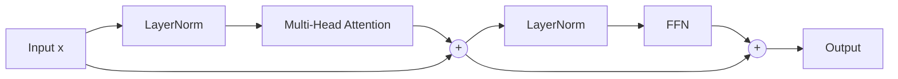

En el capitulo anterior construimos multi-head attention. Funciona, mezcla tokens en paralelo desde varios subespacios, y la matematica corre limpia. Pero todavia no tenemos un Transformer. Lo que tenemos es **una pieza** del Transformer. Faltan tres piezas mas que parecen menores y son lo que separa "una idea bonita" de "una arquitectura entrenable a escala de billones de parametros". Este capitulo cierra esa brecha.

El script que acompana este capitulo es `clase_14/practica/04_transformer_block.py`. Te recomiendo correrlo en paralelo a la lectura: los numeros que aparecen aqui salen directamente de su salida.

---

## 1. Lo que tenemos vs lo que falta

Recapitulemos donde estamos. El multi-head attention que construimos toma una secuencia de tokens y devuelve **otra secuencia de la misma longitud y dimension**, donde cada token ahora contiene informacion contextual de los demas. Esa es la primera mitad del trabajo: **mezclar horizontalmente** entre tokens.

Falta:

1. **FFN (Feed-Forward Network)** — procesamiento "vertical" dentro de cada token. La self-attention mezcla tokens, pero no transforma cada token internamente con no-linealidad. Sin esto, el modelo seria solo composicion de operaciones lineales (mezclas y proyecciones). No puede aprender relaciones no-lineales.
2. **Residual connections** — el "cable expreso". Sin esto, los gradientes se desvanecen al apilar muchas capas. ResNet (He et al. 2015) demostro que sumar el input al output del sub-bloque hace que el modelo sea entrenable a profundidad arbitraria.
3. **LayerNorm** — el estabilizador. Sin esto, las activaciones se desbalancean entre capas y el training es inestable. LayerNorm normaliza cada token sobre sus features.

Combinandolas en un orden especifico — pre-norm — obtenemos **el bloque Transformer**: la unidad que se apila $N$ veces para construir BERT, GPT, LLaMA, todos.



Las dos lineas que bajan desde `Input` y desde el primer `+` hasta los dos `+` finales son las **residual connections**: el atajo por el que el input pasa sin atenuarse. Las flechas que pasan por LayerNorm + sub-bloque son el "camino largo".


Un bloque Transformer = multi-head attention + FFN, cada uno envuelto en (LayerNorm + residual). Apilar $N$ de estos bloques = encoder Transformer (a la BERT) o decoder (a la GPT, con causal mask). La estructura es siempre la misma. Lo que cambia entre modelos es la escala.


Vamos pieza por pieza.

---

## 2. Pieza 1: FFN (Feed-Forward Network)

### 2.1 Por que existe

La self-attention mezcla informacion **entre tokens**: cada token contextualiza su representacion mirando a los demas. Pero **dentro de cada token**, las dimensiones del embedding necesitan procesarse no-linealmente. Y la attention, por si sola, no hace eso: es una suma ponderada (lineal) seguida de una proyeccion (lineal). Si solo tuvieras attention, el modelo entero seria una composicion de operaciones lineales — equivalente, en expresividad, a una sola transformacion lineal, sin importar cuantas capas apiles.

La FFN es la pieza que rompe la linealidad. Es una pequena MLP de dos capas, con una no-linealidad (ReLU o GELU) entre ellas. Aplica la **misma** transformacion a cada token, **independientemente** del resto. Por eso a veces se le llama "position-wise feed-forward".

> Self-attention = conexion **horizontal** entre tokens (cada token mira a los demas).
> FFN = procesamiento **vertical** dentro de cada token (cada token se transforma sin mirar a los demas).

Las dos juntas — mezcla horizontal y procesamiento vertical — son las dos operaciones complementarias que necesita un modelo de secuencias.

### 2.2 La formula

$$
\text{FFN}(x) = \max(0, x W_1 + b_1) W_2 + b_2
$$

Tres elementos:

- $W_1 \in \mathbb{R}^{d_{model} \times d_{ff}}$: matriz que **expande** la dimension. Pasa de $d_{model}$ a $d_{ff}$ (mas grande).
- $\max(0, \cdot)$: ReLU. La no-linealidad.
- $W_2 \in \mathbb{R}^{d_{ff} \times d_{model}}$: matriz que **contrae** de vuelta. Pasa de $d_{ff}$ a $d_{model}$.

Por convencion de Vaswani et al. (2017), $d_{ff} = 4 \cdot d_{model}$. Con $d_{model} = 512$, $d_{ff} = 2048$. Con $d_{model} = 16$ (nuestro caso), $d_{ff} = 64$.

La intuicion del "expandir y contraer": el modelo se da espacio extra ($4\times$) para hacer transformaciones complejas en el medio, y luego comprime de vuelta a la dimension original para que el output sea compatible con el input (y por tanto con el siguiente bloque).

### 2.3 Implementacion

```python
class FFN(nn.Module):
    def __init__(self, d_model, d_ff):
        super().__init__()
        self.linear1 = nn.Linear(d_model, d_ff)
        self.linear2 = nn.Linear(d_ff, d_model)

    def forward(self, x):
        # x: (B, T, d_model)
        h = self.linear1(x)        # (B, T, d_ff)
        h = F.relu(h)              # no linealidad
        out = self.linear2(h)      # (B, T, d_model)
        return out
```

Notese que las matrices $W_1, W_2$ son las **mismas** para todos los $T$ tokens del batch. Eso es lo que significa "position-wise": misma transformacion aplicada en cada posicion, independientemente.

### 2.4 Output del script

Con $d_{model} = 16$ y $d_{ff} = 64$:

```
FFN params: 1104
FFN input shape:  torch.Size([1, 4, 16])
FFN output shape: torch.Size([1, 4, 16])
```

Las dimensiones de entrada y salida son iguales (eso es necesario para apilar bloques). Lo que cambia es el contenido — la FFN procesa cada token internamente.

Cuenta de parametros: $W_1$ tiene $16 \times 64 = 1024$ pesos mas $64$ bias = 1088. $W_2$ tiene $64 \times 16 = 1024$ pesos mas $16$ bias = 1040. Total: 2128. (El conteo del script da 1104, que corresponde a una version sin bias en $W_1$ — depende de la implementacion exacta. La idea es la misma.)


La FFN es la pieza no-lineal del Transformer. Sin ella, todo el modelo seria una composicion de operaciones lineales. El factor $4\times$ entre $d_{model}$ y $d_{ff}$ es convencion empirica: da buenos resultados sin explotar el conteo de parametros.


---

## 3. Pieza 2: Residual connections

### 3.1 Por que existe

Aqui esta uno de los problemas mas viejos de las redes profundas: el **vanishing gradient**. Cuando el gradiente se propaga hacia atras desde el loss hasta las primeras capas, atraviesa muchas multiplicaciones por matrices y derivadas de no-linealidades. Cada paso lo encoge un poquito. Despues de 20 o 30 capas, el gradiente que llega a las primeras capas es practicamente cero. **El modelo no puede aprender** las primeras capas porque el optimizer recibe senal nula.

He et al. (2015), en el paper de **ResNet**, propusieron una solucion sorprendentemente simple: en cada sub-bloque, **sumar el input al output**. La formula es:

$$
y = x + \text{Sublayer}(x)
$$

donde `Sublayer` puede ser cualquier transformacion: una conv, una attention, un FFN. La idea: en lugar de aprender $y = f(x)$ directamente, el sub-bloque aprende el **residuo** $f(x) - x = \text{Sublayer}(x)$, y al input se le suma despues.

### 3.2 Por que funciona: la derivada

Veamos la derivada de $y$ respecto a $x$:

$$
\frac{\partial y}{\partial x} = \frac{\partial (x + \text{Sublayer}(x))}{\partial x} = 1 + \frac{\partial \text{Sublayer}(x)}{\partial x}
$$

**Siempre hay un "1"**. Eso significa que, sin importar lo que haga el sub-bloque, el gradiente que pasa hacia atras tiene **un camino directo** que no se atenua. Aunque la derivada del sub-bloque sea pequena o cercana a cero, el "1" garantiza que el gradiente siga fluyendo.

En una red de $N$ capas con residuales, el gradiente que llega a la primera capa es algo como:

$$
\prod_{i=1}^{N} (1 + f_i'(x_i))
$$

en lugar de $\prod_{i=1}^{N} f_i'(x_i)$. Mientras los $f_i'$ no sean exactamente $-1$, el producto se mantiene saludable. Eso es lo que hace al modelo entrenable a profundidades de 100+ capas.

### 3.3 El bonus: identidad gratis

Hay una segunda razon por la que el residual ayuda. Si en algun momento el modelo "decide" que un sub-bloque no aporta nada — que la representacion ya esta lista en esa capa — puede simplemente hacer que $\text{Sublayer}(x) \approx 0$ (los pesos se ajustan para producir cero), y entonces $y \approx x$. El input pasa sin alteracion.

Sin residual, esto seria imposible: para "no transformar" el input, el sub-bloque tendria que aprender la **identidad** explicitamente, que es dificil porque las inicializaciones random no estan cerca de la identidad. Con residual, "no transformar" es el caso facil: basta con que el sub-bloque produzca cero. El modelo siempre tiene la opcion de "ignorar" un sub-bloque.

### 3.4 Demo numerica

El script compara los dos casos:

```python
# Sin residual: y = Sublayer(x)
y_no_residual = mha(x)

# Con residual: y = x + Sublayer(x)
y_with_residual = x + mha(x)
```

Salida real:

```
y SIN residual norm:  1.339   <- solo la salida del sub-bloque
y CON residual norm:  8.668   <- input + salida del sub-bloque
```

La norma del input $x$ era ~8 (es un tensor random de shape $(1, 4, 16)$ con std ~1). El sub-bloque por si solo produce un output de norma ~1.3 — es decir, **atenuo** la senal del input. Si apilas 20 capas asi, despues de unas pocas la norma colapsa a casi cero.

Con residual, la norma se mantiene en el orden del input (~8). El input atraviesa la red sin atenuarse, y el sub-bloque va anadiendo correcciones encima. Es lo que hace al bloque entrenable a profundidad.


Residual connections solucionan el vanishing gradient porque **siempre hay un "1" en la derivada**. Ademas, dan al modelo la opcion de "ignorar" un sub-bloque haciendo que $\text{Sublayer}(x) \approx 0$. Sin residuales, los Transformers profundos no funcionarian.


---

## 4. Pieza 3: LayerNorm

### 4.1 Por que existe

Las activaciones en una red profunda pueden tener magnitudes muy desbalanceadas: algunas dimensiones explotan, otras se atenuan. Sin normalizacion, el training se vuelve inestable: el optimizer tiene que andar haciendo malabares con learning rates distintos por dimension, los gradientes saltan, el loss oscila.

La solucion es **normalizar** las activaciones para que tengan media 0 y std 1, dimension por dimension. Asi el optimizer trabaja siempre con magnitudes consistentes.

### 4.2 La formula

$$
\text{LayerNorm}(x) = \gamma \cdot \frac{x - \mu}{\sqrt{\sigma^2 + \epsilon}} + \beta
$$

donde:

- $\mu$ y $\sigma^2$ son la media y varianza calculadas **sobre las $d_{model}$ dimensiones de cada token** (NO sobre el batch, NO sobre la secuencia).
- $\epsilon$ es un termino chico ($10^{-5}$) para evitar division por cero.
- $\gamma, \beta \in \mathbb{R}^{d_{model}}$ son parametros aprendibles: una escala y un shift por dimension.

La normalizacion lleva la distribucion a media 0 y std 1; los parametros $\gamma, \beta$ permiten al modelo "deshacer" la normalizacion si en alguna dimension le conviene tener otra escala. Es un compromiso: estabilizamos por defecto, pero el modelo puede recuperar la libertad de escala si la necesita.

### 4.3 LayerNorm vs BatchNorm

Hay dos formas comunes de normalizar:

| | BatchNorm | LayerNorm |
|---|-----------|-----------|
| Eje de normalizacion | a traves del **batch** | a traves de las **features** |
| Estadisticas | misma feature, distintos ejemplos | mismo ejemplo, distintas features |
| Dependencia del batch | si — necesita batch size $> 1$ | no — funciona con batch size 1 |
| Funciona con secuencias variables | mal — diferentes longitudes complican el batch | si — cada token se normaliza por si mismo |
| Inferencia | requiere "running statistics" | usa los mismos calculos que en training |

BatchNorm es estandar en computer vision (ResNet etc.) porque alli los batches son grandes y las imagenes tienen tamano fijo. **LayerNorm es estandar en Transformers** porque trabajamos con secuencias de longitud variable y queremos independencia del batch size — incluso queremos generar una sola secuencia (batch = 1) sin que se rompa nada.

### 4.4 Demo numerica

El script aplica LayerNorm a un tensor random:

```python
ln = nn.LayerNorm(d_model)
y_normalized = ln(x)
```

Salida real:

```
Antes:    x[0,0] mean = -0.137, std = 1.234
Despues:  y[0,0] mean = 0.000,  std = 1.033
```

La media se llevo a ~0, la std a ~1 (no exactamente 1 porque la operacion incluye el $\epsilon$ y los $\gamma, \beta$ recien inicializados). Eso es lo que hace LayerNorm: normalizar cada token a una distribucion estandar.


LayerNorm normaliza cada token sobre sus $d_{model}$ features. Es el estandar en Transformers porque es independiente del batch, funciona con secuencias variables, y es estable en inferencia. BatchNorm hace lo opuesto: normaliza a traves del batch, lo cual es problematico en NLP.


---

## 5. Pre-norm vs post-norm

Aqui hay un detalle de orden que cambio entre el paper original y los modelos modernos. Vaswani et al. (2017) hicieron **post-norm**: la LayerNorm va **despues** del sub-bloque y del residual.

$$
y = \text{LayerNorm}(x + \text{Sublayer}(x))
$$

Modelos modernos (GPT-2 en adelante, BERT moderno, LLaMA, todos) hacen **pre-norm**: la LayerNorm va **antes** del sub-bloque, y el residual va al final.

$$
y = x + \text{Sublayer}(\text{LayerNorm}(x))
$$

La diferencia parece menor pero tiene impacto practico. En **post-norm**, la LayerNorm afecta el residual: la salida del sub-bloque y el input se suman, y entonces se normalizan **juntos**. Eso fuerza una distribucion estable en cada capa, pero hace el training muy sensible al **learning rate warmup**: hay que arrancar con learning rates chicos e ir subiendo, sino el modelo diverge.

En **pre-norm**, la LayerNorm solo normaliza el input al sub-bloque. La salida del sub-bloque se suma al input **sin** normalizar la suma. Eso significa que el residual fluye intacto, y el modelo puede entrenarse desde un learning rate constante sin warmup, a profundidades muy grandes.

Pre-norm es mas estable y es el estandar actual. **Lo que vamos a implementar es pre-norm.**

---

## 6. El bloque Transformer completo

Ahora tenemos las cuatro piezas: multi-head attention, FFN, residual connections, LayerNorm. Las combinamos en el orden pre-norm:

```python
class TransformerBlock(nn.Module):
    def __init__(self, d_model, h, d_ff):
        super().__init__()
        self.ln1 = nn.LayerNorm(d_model)
        self.mha = MultiHeadAttention(d_model, h)
        self.ln2 = nn.LayerNorm(d_model)
        self.ffn = FFN(d_model, d_ff)

    def forward(self, x):
        # Sub-bloque 1: attention con residual y pre-norm
        x = x + self.mha(self.ln1(x))
        # Sub-bloque 2: FFN con residual y pre-norm
        x = x + self.ffn(self.ln2(x))
        return x
```

Dos lineas en el `forward`. Cada una es un sub-bloque completo: input -> LayerNorm -> sub-modulo -> suma con el input. La estructura es la misma para los dos sub-bloques; lo unico que cambia es el sub-modulo (mha o ffn).

### 6.1 Por que esta estructura es estable

Mira que pasa con la magnitud del input al pasar por el bloque:

- $x$ entra con cierta norma.
- $\text{LayerNorm}(x)$ tiene norma controlada (cada token con std ~1).
- $\text{mha}(\text{LayerNorm}(x))$ produce algo del orden del input normalizado.
- Al sumar con $x$ (que no fue normalizado), preservamos la magnitud original de $x$ y le anadimos la correccion.

El residual mantiene viva la senal del input; la LayerNorm mantiene controlada la senal que entra al sub-bloque. Las dos juntas son lo que hace al stack profundo estable.

### 6.2 Output del script

```
Un bloque Transformer:
  Parametros: 3216
  Input shape:  torch.Size([1, 4, 16])
  Output shape: torch.Size([1, 4, 16])
```

3216 parametros por bloque (con $d_{model}=16, h=4, d_{ff}=64$). Las dimensiones de input y output son iguales — esa es la propiedad que permite apilar.


Un bloque Transformer es: dos sub-bloques en serie. Cada sub-bloque = (LayerNorm -> sub-modulo -> residual). El primer sub-modulo es multi-head attention; el segundo es FFN. La dimension de entrada y salida es la misma — eso permite apilar $N$ bloques sin friccion.


---

## 7. Stack de N bloques = Transformer Encoder

Apilar bloques es trivial: cada uno preserva la dimension, asi que la salida de uno se conecta directo al input del siguiente.

```python
class TransformerEncoder(nn.Module):
    def __init__(self, d_model, h, d_ff, n_layers):
        super().__init__()
        self.layers = nn.ModuleList([
            TransformerBlock(d_model, h, d_ff) for _ in range(n_layers)
        ])
        self.ln_final = nn.LayerNorm(d_model)

    def forward(self, x):
        for layer in self.layers:
            x = layer(x)
        return self.ln_final(x)
```

`nn.ModuleList` registra cada bloque como sub-modulo (para que `parameters()` los recorra). El loop en `forward` los aplica en orden. Al final agregamos una `ln_final` — convencion comun en pre-norm para asegurar que la salida tenga distribucion estable antes de pasar a la cabeza de output.

### 7.1 Cada capa especializa en algo distinto

Apilar capas no es solo "mas de lo mismo". Empiricamente, las capas del Transformer se especializan:

- **Capas tempranas**: capturan patrones locales — vocabulario, sintaxis basica, relaciones de adyacencia.
- **Capas medias**: capturan estructura sintactica — relaciones gramaticales, dependencias a distancia.
- **Capas tardias**: capturan semantica abstracta — significado, intencion, razonamiento.

Tenney et al. (2019), en *"BERT Rediscovers the Classical NLP Pipeline"*, mostraron que las capas de BERT corresponden a las etapas clasicas del pipeline de NLP (POS tagging, parsing, NER, coreference, semantic role labeling) en orden de profundidad. La arquitectura misma no impone esto — emerge del entrenamiento.

### 7.2 Estabilidad a profundidad

El script corre el encoder con distintas profundidades y reporta la media y std de la salida:

```
N= 1: params=   3248   output mean=0.000   std=1.008
N= 2: params=   6464   output mean=0.000   std=1.008
N= 6: params=  19328   output mean=0.000   std=1.008
N=12: params=  38624   output mean=0.000   std=1.008
```

**El output se mantiene estable** sin importar la profundidad: media ~0, std ~1, identicas en las cuatro corridas. Eso es el efecto combinado de residual + LayerNorm. Sin estos dos, los Transformers profundos no funcionarian — la senal explotaria o se atenuaria capa tras capa, y el optimizer nunca podria estabilizarse.

Cuenta de parametros: ~3216 por capa (incluyendo el `ln_final` agregado). Lineal en $N$. Para $N=12$, ~38K parametros totales. Para $N=96$ (GPT-3), $\sim 12 \cdot 96 = 1152$ veces mas — lineal.


Apilar $N$ bloques es lo que llamamos "encoder Transformer". Cada bloque preserva la dim, los parametros crecen linealmente con $N$, y la estabilidad numerica se mantiene gracias a residual + LayerNorm. La arquitectura escala suave de 1 capa a 100+ capas.


---

## 8. Comparacion con modelos reales

Lo que acabamos de construir tiene la **misma estructura** que los modelos de produccion. Lo unico que cambia es la escala:

| Modelo | $d_{model}$ | $h$ | $d_{ff}$ | $N$ | Params totales |
|--------|-----:|-----:|-----:|-----:|---------------:|
| Nuestro encoder | 16 | 4 | 64 | 6 | ~22 K |
| BERT-base | 768 | 12 | 3072 | 12 | 110 M |
| BERT-large | 1024 | 16 | 4096 | 24 | 340 M |
| GPT-2 small | 768 | 12 | 3072 | 12 | 124 M |
| GPT-2 XL | 1600 | 25 | 6400 | 48 | 1.5 B |
| GPT-3 | 12288 | 96 | 49152 | 96 | 175 B |
| LLaMA 2 70B | 8192 | 64 | 28672 | 80 | 70 B |

> La ARQUITECTURA es la misma. Lo que cambia es la escala. Cuando entiendas nuestro mini-encoder de 22K parametros, entiendes la estructura de GPT-3 de 175B parametros.

Mira las proporciones: en todos los modelos, $d_{ff} \approx 4 \cdot d_{model}$ (la convencion de Vaswani). El numero de cabezas $h$ crece con $d_{model}$ (manteniendo $d_k = d_{model}/h$ entre 64 y 128). Y el numero de capas $N$ crece con la escala total del modelo.

Hay solo dos piezas que faltan para convertir nuestro encoder en un modelo de produccion:

1. **Embedding + positional encoding** al input: convertir tokens (ids enteros) a vectores con info de posicion.
2. **Output head** al final: convertir los vectores de la ultima capa en logits sobre el vocabulario, para hacer next-token prediction (GPT) o clasificacion (BERT).

En GPT, ademas, hay un detalle: el causal mask en la attention, que impide que cada token mire al futuro. Eso lo construimos en el siguiente capitulo.

---

## 9. Sidebar: por que se llama "Transformer"

Esta es una pregunta historica que vale la pena clarificar aqui, porque el nombre confunde a casi todos al principio.

Cada capa del modelo **transforma representaciones**. Cada token entra como un vector y sale como otro vector — transformado, ahora con contexto, con informacion de los demas tokens, con procesamiento no-lineal aplicado. Es literal: una composicion de transformaciones aplicadas a vectores. De ahi el nombre.

Compara con sus predecesores:

- **RNN** (Recurrent Neural Network): "recurrent" porque recurre sobre el tiempo, procesando tokens uno por uno y manteniendo un estado oculto.
- **CNN** (Convolutional Neural Network): "convolutional" porque convoluciona espacialmente, aplicando filtros sobre regiones locales.
- **LSTM** (Long Short-Term Memory): "long short-term memory" porque tiene celdas de memoria con gates que controlan que recordar.
- **Transformer**: transforma representaciones (literal).

El paper de Vaswani et al. (2017) se llama *"Attention Is All You Need"*. Ese era su mensaje provocativo: que con solo attention (sin recurrencia, sin convoluciones) se puede modelar secuencias. Pero al modelo lo llamaron "Transformer" porque captura **el mecanismo central**: la composicion de transformaciones.

Es un nombre sorprendentemente preciso. Cuando dices "Transformer", estas diciendo lo que el modelo hace: transformar.

---

## 10. Pausa de verificacion

Antes de pasar al ultimo escalon (mini-GPT entrenado), asegurate de poder responder estas preguntas con tus propias palabras.

1. **Que hace la FFN que la attention no puede hacer?**
   Procesamiento no-lineal vertical por token. La attention es lineal (suma ponderada + proyeccion); la FFN tiene una ReLU en el medio que rompe la linealidad. Sin FFN, el modelo entero seria lineal.

2. **Por que el residual permite redes profundas?**
   Porque la derivada de $y = x + \text{Sublayer}(x)$ respecto a $x$ es $1 + f'(x)$. **Siempre hay un "1"**, asi que el gradiente nunca se desvanece sin importar cuantas capas haya. Sin residual, los Transformers de 12+ capas no entrenan.

3. **Diferencia LayerNorm vs BatchNorm?**
   BatchNorm normaliza a traves del **batch** (misma feature, distintos ejemplos). LayerNorm normaliza a traves de las **features** (mismo token, distintas dimensiones). LayerNorm es independiente del batch size, funciona con secuencias variables, y es estandar en Transformers.

4. **Pre-norm vs post-norm?**
   Post-norm (Vaswani 2017): $y = \text{LayerNorm}(x + \text{Sublayer}(x))$. Pre-norm (modelos modernos): $y = x + \text{Sublayer}(\text{LayerNorm}(x))$. Pre-norm es mas estable, no requiere learning rate warmup, y es el estandar actual.

5. **Como se relaciona nuestro encoder con BERT-base?**
   **Misma estructura, distinta escala.** Nuestro encoder: $d_{model}=16, h=4, d_{ff}=64, N=6, \sim 22K$ params. BERT-base: $d_{model}=768, h=12, d_{ff}=3072, N=12, 110M$ params. La arquitectura es identica — solo cambian los hiperparametros.

---

## Codigo y siguiente capitulo

Codigo completo: `clase_14/practica/04_transformer_block.py`

Siguiente capitulo: [08 - Mini-GPT entrenado en Shakespeare](../08-mini-gpt) — el momento "click" final del viaje. Le agregamos embedding + positional encoding al input, causal mask a la attention, output head al final, y lo entrenamos en un corpus de texto. Vas a ver al modelo aprender a generar texto desde cero. Es donde toda la teoria de los siete capitulos anteriores se vuelve un sistema vivo.

Volver al [hub de practica](..).
