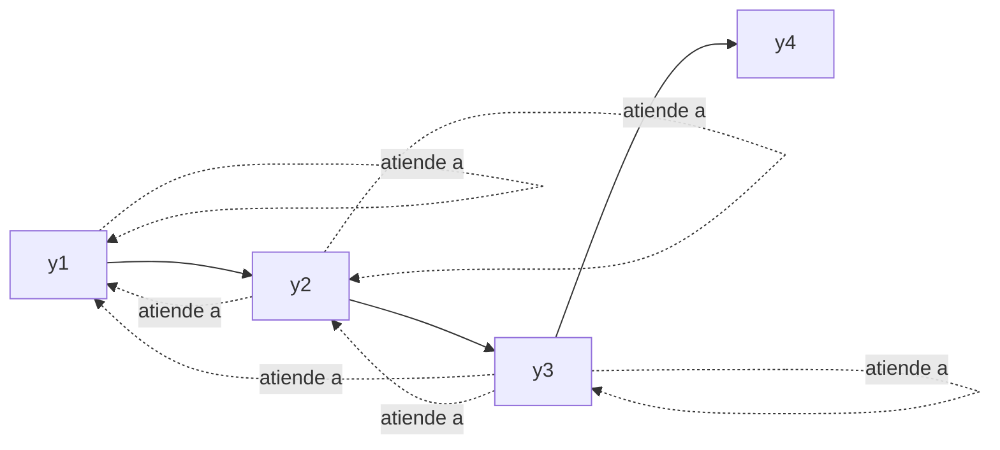
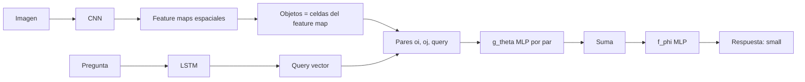

> Este documento profundiza en los fundamentos matematicos detras de la Clase 14.
> Cubre la derivacion del scaled dot-product, la diferencia formal entre masked
> self-attention y cross-attention, la matematica de positional encoding, el
> pseudocodigo y math de CLIP, las Relation Networks como caso particular de
> self-attention, y un puente hacia Transformer Circuits e interpretabilidad
> mecanicista.

---

# Parte I: Scaled Dot-Product en Profundidad

---

## 1. Por que Dividir por $\sqrt{d_k}$

### 1.1 Setup probabilistico

Asumamos que cada componente de $q \in \mathbb{R}^{d_k}$ y $k \in \mathbb{R}^{d_k}$ es independiente, con media cero y varianza uno:

$$\mathbb{E}[q_i] = 0, \quad \text{Var}(q_i) = 1, \quad \mathbb{E}[k_i] = 0, \quad \text{Var}(k_i) = 1$$

El producto punto $q \cdot k = \sum_{i=1}^{d_k} q_i k_i$ tiene:

$$\mathbb{E}[q \cdot k] = \sum_i \mathbb{E}[q_i k_i] = \sum_i \mathbb{E}[q_i] \mathbb{E}[k_i] = 0$$

$$\text{Var}(q \cdot k) = \sum_i \text{Var}(q_i k_i) = \sum_i 1 = d_k$$

### 1.2 Por que esto es un problema

Si $d_k = 512$, el producto punto tiene desviacion estandar $\sqrt{512} \approx 22.6$. Pasar por softmax:

$$\text{softmax}(z)_i = \frac{e^{z_i}}{\sum_j e^{z_j}}$$

con valores de $z$ del orden de 20-30 hace que la distribucion **colapse** a un one-hot: el maximo absorbe practicamente toda la masa. La derivada de softmax en regimen saturado es **casi cero**:

$$\frac{\partial \text{softmax}(z)_i}{\partial z_j} = \text{softmax}(z)_i (\delta_{ij} - \text{softmax}(z)_j)$$

Si $\text{softmax}(z)_i \to 1$ y los demas $\to 0$, el gradiente $\to 0$. **Entrenamiento se rompe**.

### 1.3 La correccion

Dividir por $\sqrt{d_k}$ normaliza la varianza:

$$\text{Var}\!\left(\frac{q \cdot k}{\sqrt{d_k}}\right) = \frac{1}{d_k} \cdot d_k = 1$$

Ahora los logits estan en un regimen sano para softmax independientemente de $d_k$.


El factor $1/\sqrt{d_k}$ no es un detalle estetico: **sin el, el Transformer no se entrena para $d_k$ grande**. Es una correccion de escala fundamentada en la varianza del producto punto.


---

## 2. Forma Matricial

Para una secuencia de $T$ tokens y $d_{model}$ dimensiones, $X \in \mathbb{R}^{T \times d_{model}}$. Las proyecciones son:

$$Q = X W^Q \in \mathbb{R}^{T \times d_k}$$
$$K = X W^K \in \mathbb{R}^{T \times d_k}$$
$$V = X W^V \in \mathbb{R}^{T \times d_v}$$

La matriz de scores:

$$S = \frac{Q K^T}{\sqrt{d_k}} \in \mathbb{R}^{T \times T}$$

Cada fila de $S$ es un vector de scores que pasa por softmax (a lo largo del eje de keys):

$$A = \text{softmax}(S) \in \mathbb{R}^{T \times T}$$

con $\sum_j A_{ij} = 1$. La salida es:

$$O = A V \in \mathbb{R}^{T \times d_v}$$

**Costo**: dominado por $QK^T$ y $AV$, ambos $O(T^2 \cdot d)$ en computo y $O(T^2)$ en memoria. Esta cuadratica es el origen de toda la investigacion en "efficient transformers" (Reformer, Performer, FlashAttention, etc.).

---

# Parte II: Mascaras y Cross-Attention

---

## 3. Masked Self-Attention (Decoder)

En el decoder, cuando se predice $y_t$, el modelo solo puede ver $y_1, \ldots, y_t$ (causalidad). Implementacion: agregar una **mascara** $M$ a los scores:

$$S' = \frac{QK^T}{\sqrt{d_k}} + M, \quad M_{ij} = \begin{cases} 0 & \text{si } j \leq i \\ -\infty & \text{si } j > i \end{cases}$$

Despues de softmax, los valores con $-\infty$ se vuelven $0$, asi $A'_{ij} = 0$ para $j > i$.



Esto permite que el decoder se entrene **en paralelo** sobre toda la secuencia objetivo (teacher forcing) sin "filtrar" el futuro.

---

## 4. Cross-Attention (Decoder atiende al Encoder)

En la segunda sub-capa del decoder, queries vienen del decoder y keys/values del encoder:

$$Q_{dec} = S_{dec} W^Q, \quad K_{enc} = H_{enc} W^K, \quad V_{enc} = H_{enc} W^V$$

donde $S_{dec} \in \mathbb{R}^{T_y \times d}$ es la salida de la self-attention del decoder y $H_{enc} \in \mathbb{R}^{T_x \times d}$ es la salida del encoder. La atencion:

$$\text{CrossAttn} = \text{softmax}\!\left(\frac{Q_{dec} K_{enc}^T}{\sqrt{d_k}}\right) V_{enc}$$

produce una matriz $T_y \times d_v$: una representacion enriquecida por posicion del decoder.


La cross-attention del Transformer **es Bahdanau attention generalizada**: el decoder consulta hidden states del encoder para construir un context vector adaptativo. La diferencia es que (a) se usa scaled dot-product en vez de aditivo, (b) hay multiples cabezales y (c) ocurre en cada capa, no solo en la conexion encoder-decoder de la RNN.


### 4.1 Comparacion formal

| Tipo | Q | K | V | Mascara |
|---|---|---|---|---|
| Encoder self-attn | $X_{enc}$ | $X_{enc}$ | $X_{enc}$ | Ninguna |
| Decoder masked self-attn | $X_{dec}$ | $X_{dec}$ | $X_{dec}$ | Triangular causal |
| Decoder cross-attn | $X_{dec}$ | $H_{enc}$ | $H_{enc}$ | Ninguna (o de padding) |

---

# Parte III: Multi-Head Attention en Detalle

---

## 5. Por que Multiples Cabezales

Una sola atencion produce **una distribucion** sobre tokens. Para una query $q_i$, hay un solo $\alpha_{i \cdot}$. Multi-head permite que el modelo aprenda $h$ distribuciones distintas en paralelo. Cada cabezal $i$ tiene sus propias matrices de proyeccion:

$$\text{head}_i = \text{Attention}(Q W_i^Q, K W_i^K, V W_i^V)$$

con $W_i^Q, W_i^K \in \mathbb{R}^{d_{model} \times d_k}$ y $W_i^V \in \mathbb{R}^{d_{model} \times d_v}$, donde $d_k = d_v = d_{model} / h$.

La concatenacion y proyeccion final:

$$\text{MultiHead}(Q, K, V) = \text{Concat}(\text{head}_1, \ldots, \text{head}_h) W^O$$

con $W^O \in \mathbb{R}^{h d_v \times d_{model}}$.

### 5.1 Costo computacional

Como $d_k = d_{model}/h$, la suma de costos de los $h$ cabezales es del mismo orden que single-head con $d_k = d_{model}$. **Multi-head no aumenta el costo**, redistribuye la capacidad.

### 5.2 Interpretacion

Estudios empiricos (Voita et al. 2019, Clark et al. 2019) muestran que distintos cabezales aprenden:

- **Cabezales sintacticos**: atienden al sujeto, al objeto directo, al complemento.
- **Cabezales posicionales**: atienden al token anterior o siguiente.
- **Cabezales de coreferencia**: atienden al antecedente de un pronombre.
- **Cabezales semanticos**: atienden a tokens relacionados por significado.

Tambien se observa que **muchos cabezales son redundantes** y pueden podarse sin perdida significativa.

---

# Parte IV: Positional Encoding

---

## 6. Sinusoidal Positional Encoding

La definicion de Vaswani et al.:

$$PE(p, 2i) = \sin\!\left(\frac{p}{10000^{2i/d_{model}}}\right)$$
$$PE(p, 2i+1) = \cos\!\left(\frac{p}{10000^{2i/d_{model}}}\right)$$

Para $d_{model} = 512$ e $i \in \{0, 1, \ldots, 255\}$, las frecuencias varian de $1$ (en $i=0$) a $1/10000$ (en $i = 255$). Periodos correspondientes: de $2\pi$ a $20000\pi$.

### 6.1 Propiedad clave: desplazamientos lineales

Para un offset fijo $k$:

$$\begin{pmatrix} PE(p+k, 2i) \\ PE(p+k, 2i+1) \end{pmatrix} = R_k^{(i)} \begin{pmatrix} PE(p, 2i) \\ PE(p, 2i+1) \end{pmatrix}$$

donde $R_k^{(i)}$ es una matriz de rotacion 2D. Esto se demuestra usando identidades trigonometricas:

$$\sin(\omega(p+k)) = \sin(\omega p) \cos(\omega k) + \cos(\omega p) \sin(\omega k)$$
$$\cos(\omega(p+k)) = \cos(\omega p) \cos(\omega k) - \sin(\omega p) \sin(\omega k)$$

con $\omega = 1/10000^{2i/d_{model}}$.

**Implicacion**: el modelo puede aprender **relaciones relativas** entre posiciones via transformaciones lineales sobre los $PE$, lo que facilita generalizar a longitudes no vistas.

### 6.2 PE aprendido vs sinusoidal

En la practica, BERT y GPT usan **embeddings posicionales aprendidos**: una matriz $E_{pos} \in \mathbb{R}^{T_{max} \times d_{model}}$ entrenable. Trade-offs:

| Tipo | Generaliza fuera de $T_{max}$ | Capacidad | Implementacion |
|---|---|---|---|
| Sinusoidal | Si (frecuencias fijas) | Limitada | Sin parametros |
| Aprendido | No (sin truncamiento o extrapolacion ad-hoc) | Mayor | Matriz extra |
| Relativo (Shaw 2018, T5) | Si | Mayor | Mas complejo |
| RoPE (Su et al. 2021) | Si | Alta | Rotacion en queries/keys |

Modelos modernos (LLaMA, GPT-NeoX) usan **RoPE** o variantes relativas.

---

# Parte V: GPT vs BERT

---

## 7. Dos Familias del Transformer

| Eje | GPT (decoder-only) | BERT (encoder-only) |
|---|---|---|
| Atencion | Causal (masked) | Bidireccional |
| Pre-training | Autoregresivo: $P(x_t \mid x_{<t})$ | MLM + NSP |
| Uso natural | Generacion | Comprension |
| Fine-tuning | Few-shot, prompting | Cabezas especificas por tarea |
| Output | Distribucion sobre siguiente token | Representaciones por token + [CLS] |

### 7.1 Loss de GPT

$$\mathcal{L}_{GPT} = -\sum_{t=1}^{T} \log P(x_t \mid x_{<t}; \theta)$$

Cross-entropy autoregresiva sobre el vocabulario.

### 7.2 Loss de BERT

$$\mathcal{L}_{BERT} = \mathcal{L}_{MLM} + \mathcal{L}_{NSP}$$

con

$$\mathcal{L}_{MLM} = -\sum_{t \in M} \log P(x_t \mid x_{\setminus M}; \theta)$$

donde $M$ es el conjunto de posiciones enmascaradas (15%). Y

$$\mathcal{L}_{NSP} = -\log P(\text{IsNext} \mid [\text{CLS}]; \theta)$$

Es importante notar que la atencion bidireccional de BERT **no es compatible** con generacion autoregresiva: el modelo veria el futuro durante decoding. Por eso GPT (causal) domina en generacion.

---

# Parte VI: CLIP -- Vision-Lenguaje Contrastivo

---

## 8. Pseudocodigo de CLIP

Tomado del paper Radford et al. 2021:

```python
# I: imagenes [n, h, w, c]
# T: textos   [n, l]
# W_i, W_t: proyecciones a espacio compartido
# t: temperatura aprendible (escalar)

I_f = image_encoder(I)       # [n, d_i]
T_f = text_encoder(T)        # [n, d_t]

# proyectar y normalizar
I_e = l2_normalize(I_f @ W_i, axis=1)   # [n, d_e]
T_e = l2_normalize(T_f @ W_t, axis=1)   # [n, d_e]

# similitudes coseno escaladas
logits = (I_e @ T_e.T) * exp(t)         # [n, n]

# loss simetrico
labels = arange(n)
loss_i = cross_entropy(logits, labels, axis=0)
loss_t = cross_entropy(logits, labels, axis=1)
loss   = (loss_i + loss_t) / 2
```

### 8.1 Por que funciona

- $I_e$, $T_e$ estan **L2-normalizadas**, asi $I_e \cdot T_e^T$ es **similitud coseno**.
- $\exp(t)$ es una **temperatura aprendible**: el modelo elige cuan "afilado" es el softmax. Tipicamente termina en $\exp(t) \approx 100$.
- La cross-entropy fuerza la **diagonal** (pares verdaderos) a ser maxima dentro de cada fila y cada columna. Equivale a InfoNCE.

### 8.2 Math del objetivo InfoNCE

Para una imagen $i$ con su texto verdadero $t_i$ en un batch de $N$:

$$\mathcal{L}_i = -\log \frac{\exp(I_i \cdot T_i / \tau)}{\sum_{j=1}^{N} \exp(I_i \cdot T_j / \tau)}$$

con $\tau = \exp(-t)$ la temperatura. La direccion simetrica para texto $\to$ imagen es analoga. La perdida total es el promedio.

InfoNCE es un **estimador de mutual information**: maximizar InfoNCE acota inferiormente $I(I; T)$.

### 8.3 Zero-shot via prompts

Para clasificar entre $C$ clases:

1. Construir prompts $\text{prompt}_c = $ "A photo of a $\{c\}$" para $c = 1, \ldots, C$.
2. Computar $T^{(c)} = \text{text\_encoder}(\text{prompt}_c)$ y normalizar.
3. Computar $I = \text{image\_encoder}(\text{img})$ y normalizar.
4. Devolver $\arg\max_c I \cdot T^{(c)}$.

**No requiere reentrenamiento**. El text encoder convierte clases en embeddings dinamicamente.

CLIP en Food101: **90.1% rank-1** sin entrenar en Food101. Comparable a un ResNet50 supervisado.

---

# Parte VII: Relation Networks como Self-Attention

---

## 9. Relation Networks (Santoro et al. 2017)

### 9.1 Definicion

Dado un conjunto de objetos $O = \{o_1, \ldots, o_n\}$:

$$RN(O) = f_\phi\!\left( \sum_{i,j} g_\theta(o_i, o_j) \right)$$

con $g_\theta$ un MLP que procesa pares y $f_\phi$ un MLP que procesa la suma. La idea es que **cada par de objetos se proyecta a una representacion de relacion** y se agregan.

### 9.2 Aplicacion a CLEVR

CLEVR es un dataset de razonamiento visual: imagenes 3D con objetos (cubos, esferas, cilindros) y preguntas como:

> "What size is the cylinder that is left of the brown metal thing that is left of the big sphere?"

Modelo:



CNN+LSTM+RN supera a humanos en CLEVR. El mismo modelo, con minimas modificaciones, alcanza state-of-the-art en bAbI (18 de 20 tareas).

### 9.3 Conexion con self-attention

Considera la salida de self-attention para una posicion $i$:

$$z_i = \sum_j \alpha_{ij} v_j = \sum_j \frac{\exp(q_i \cdot k_j / \sqrt{d_k})}{\sum_l \exp(q_i \cdot k_l / \sqrt{d_k})} v_j$$

Si definimos $g(o_i, o_j) = \alpha_{ij} v_j$ (una funcion de pares con un coeficiente normalizado y un valor proyectado), entonces:

$$z_i = \sum_j g(o_i, o_j)$$

que es **exactamente la forma de Relation Networks** (sin $f_\phi$ exterior, o con $f_\phi$ siendo la FFN posterior del bloque Transformer).


**Self-attention es una Relation Network normalizada**. Tokens son los "objetos", la atencion modela las relaciones, el grafo es totalmente conectado. Esto explica por que el Transformer es tan bueno en tareas relacionales: tiene un **bias relacional** explicito en su arquitectura.


---

# Parte VIII: Hacia Interpretabilidad Mecanicista

---

## 10. Transformer Circuits

**Transformer Circuits** (Anthropic, Elhage et al. 2021 -- "A Mathematical Framework for Transformer Circuits") es una linea de investigacion que reescribe el Transformer en una forma analizable matematicamente.

### 10.1 Descomposicion de la atencion

Cada cabezal puede verse como **dos circuitos** en paralelo:

1. **QK circuit** ("attention pattern"): determina **donde** atender.
$$W_{QK} = W^Q (W^K)^T \in \mathbb{R}^{d_{model} \times d_{model}}$$
   (la matriz $W_{QK}$ define una bilinear form sobre embeddings residuales).

2. **OV circuit** ("output-value"): determina **que** copiar de la posicion atendida al stream residual.
$$W_{OV} = W^O W^V \in \mathbb{R}^{d_{model} \times d_{model}}$$

Con esto, la accion de un cabezal sobre el residual stream $x$ es:

$$\text{head}(x) = \text{softmax}(x W_{QK} x^T) \cdot x W_{OV}$$

### 10.2 Hallazgos

- **Induction heads**: cabezales de capa 2+ que implementan un patrón "previo: A B ... actual: A → predecir B". Aparecen automaticamente y son responsables del **in-context learning**.
- **Inhibitory heads**, **name-mover heads**, **previous-token heads**: distintos cabezales con roles funcionales identificables.
- **Polysemanticity y superposition**: muchas neuronas individuales codifican **multiples** features superpuestos en el mismo vector, gracias al hecho de que el espacio es compresible (Anthropic, "Toy Models of Superposition" 2022).

### 10.3 Por que importa

La interpretabilidad mecanicista busca abrir la caja negra: entender que computan los modelos en termino de **circuitos legibles**. Si el Transformer es la arquitectura dominante, mapear sus circuitos es central para safety, alignment y debugging de LLMs.


La frase "Attention Is All You Need" deviene literal: si entendemos los circuitos de atencion, entendemos en gran parte lo que hace un LLM. Anthropic, OpenAI, DeepMind y la academia estan trabajando activamente en esta direccion.


---

## 11. Conexion al Resto del Diplomado

### Fundamentos especificos del Transformer (creados con esta clase)

- [Self-Attention](/fundamentos/self-attention): Q/K/V, scaled dot-product, multi-head, derivacion de varianza, codigo PyTorch/JAX/TensorFlow.
- [Arquitectura Transformer](/fundamentos/transformer): encoder/decoder completo, FFN, layer norm, residuals, masked y cross attention, pre-norm vs post-norm.
- [Positional Encoding](/fundamentos/positional-encoding): sinusoidal, aprendido, RoPE, ALiBi, comparativa.
- [Embeddings Distribuidos](/fundamentos/embeddings-distribuidos): capa embedding, espacios semanticos, W2V/GloVe, tied embeddings, subword.
- [Pre-training BERT](/fundamentos/pretraining-bert): MLM, NSP, fine-tuning, RoBERTa/ALBERT/DistilBERT/DeBERTa/ELECTRA.
- [Vision Transformer](/fundamentos/vision-transformer): patches, [class] token, trade-off datos vs inductive bias, DeiT/Swin/MAE.
- [Aprendizaje Contrastivo (CLIP)](/fundamentos/aprendizaje-contrastivo): InfoNCE simetrico, zero-shot, robustez a distribution shift, ALIGN/SigLIP.

### Fundamentos previos relevantes

- [Clase 13](/clases/clase-13): Bahdanau attention es el ancestro directo del Transformer; cross-attention es Bahdanau "scaled dot-product".
- [Mecanismo de Atencion](/fundamentos/mecanismo-atencion): variantes de scoring (aditivo, dot-product, scaled, bilinear) y soft vs hard.
- [Seq2Seq](/fundamentos/seq2seq): la estructura encoder-decoder, teacher forcing, beam search.
- [Transfer Learning](/fundamentos/transfer-learning): paradigma "pre-train large + fine-tune small" que BERT y CLIP popularizaron.
- [Redes Recurrentes](/fundamentos/redes-recurrentes): las limitaciones que el Transformer resuelve.

### Wiki integrada

- [Wiki de investigacion Clase 14](wiki): sintesis con cronologia 2014-2026, codigo end-to-end, mapa de archivos.

---

# Resumen Ejecutivo

1. **Scaled dot-product**: dividir por $\sqrt{d_k}$ es necesario para que el softmax no sature; se justifica por la varianza del producto punto.
2. **Forma matricial**: $\text{Attention}(Q,K,V) = \text{softmax}(QK^T/\sqrt{d_k})V$ es $O(T^2 d)$ en tiempo y memoria.
3. **Mascara causal**: agregar $-\infty$ al triangular superior implementa la atencion del decoder en paralelo.
4. **Cross-attention**: la cross-attention del Transformer es Bahdanau attention generalizada (scaled dot-product, multi-head, en cada capa).
5. **Multi-head**: $h$ cabezales en paralelo, costo computacional similar a single-head, captura distintos patrones relacionales.
6. **Positional encoding**: sinusoidal permite desplazamientos lineales; aprendido es mas comun en BERT/GPT; RoPE/relativos dominan en LLMs modernos.
7. **GPT vs BERT**: causal autoregresivo vs bidireccional MLM; ambos son Transformers escalados con distinta mascara y objetivo.
8. **CLIP**: contrastivo InfoNCE en espacio compartido imagen-texto; habilita zero-shot via prompts.
9. **Relation Networks**: self-attention es una RN normalizada; el bias relacional del Transformer es explicito.
10. **Transformer Circuits**: descomposicion en QK y OV circuits permite interpretabilidad mecanicista; induction heads explican in-context learning.

---

## Referencias

- [Vaswani, Shazeer, Parmar, et al. (2017). Attention Is All You Need. *NeurIPS*.](/papers/attention-is-all-you-need-vaswani-2017)
- [Devlin, Chang, Lee, Toutanova (2018). BERT: Pre-training of Deep Bidirectional Transformers for Language Understanding. *NAACL 2019*.](/papers/bert-devlin-2018)
- [Radford, Kim, Hallacy, et al. (2021). Learning Transferable Visual Models From Natural Language Supervision (CLIP). *ICML*.](/papers/clip-radford-2021)
- [Dosovitskiy et al. (2021). An Image is Worth 16x16 Words: Transformers for Image Recognition at Scale (ViT). *ICLR*.](/papers/vit-dosovitskiy-2021)
- [Santoro, Raposo, Barrett, et al. (2017). A simple neural network module for relational reasoning. *NeurIPS*.](/papers/relation-networks-santoro-2017)
- Shaw, Uszkoreit, Vaswani (2018). Self-Attention with Relative Position Representations. *NAACL*.
- Su, Lu, Pan, et al. (2021). RoFormer: Enhanced Transformer with Rotary Position Embedding (RoPE).
- Voita, Talbot, Moiseev, et al. (2019). Analyzing Multi-Head Self-Attention. *ACL*.
- Clark, Khandelwal, Levy, Manning (2019). What Does BERT Look At? *BlackboxNLP*.
- Elhage, Nanda, Olsson, et al. (2021). A Mathematical Framework for Transformer Circuits. *Anthropic*.
- Olsson, Elhage, Nanda, et al. (2022). In-context Learning and Induction Heads. *Anthropic*.
- Rush (2018). The Annotated Transformer. *Harvard NLP*.

Volver a [Teoria](teoria) | Hub de la [Clase 14](/clases/clase-14).
