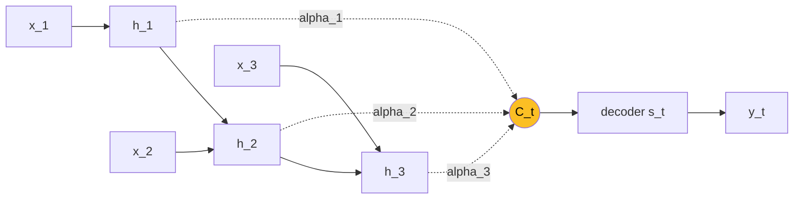
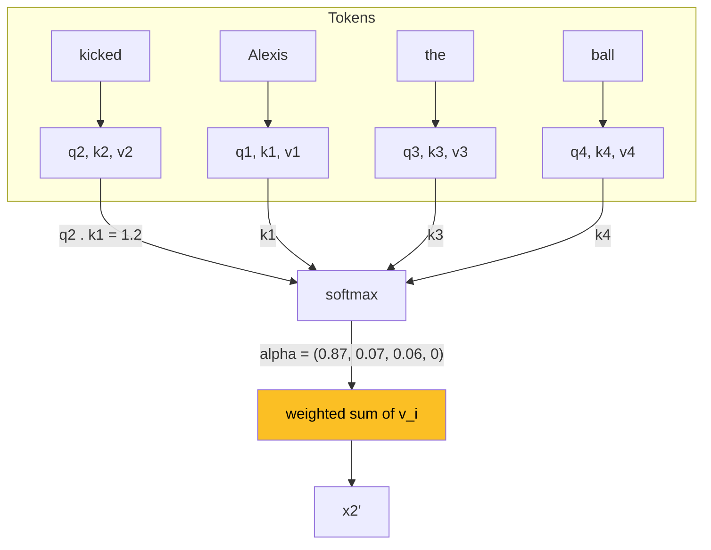
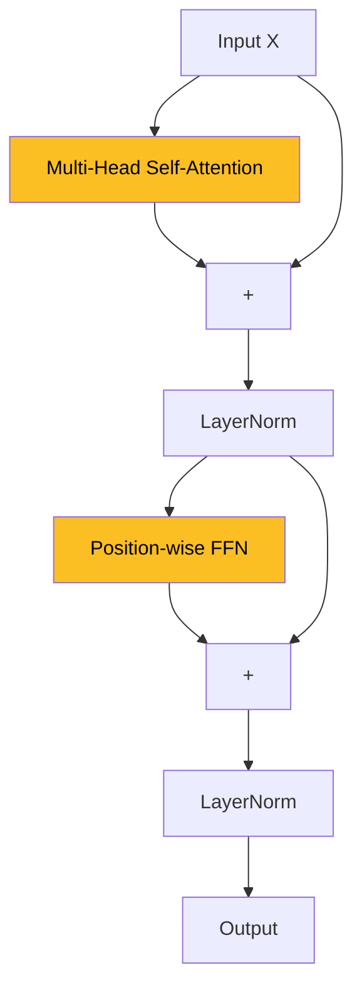
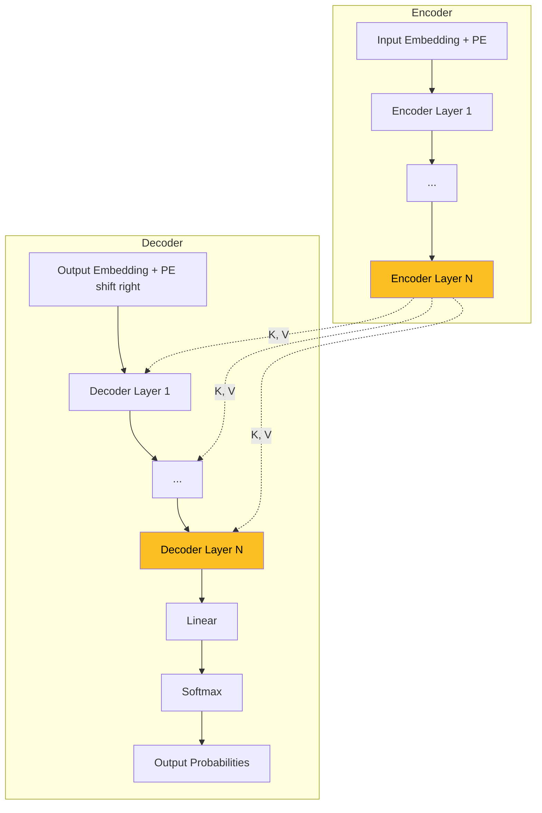
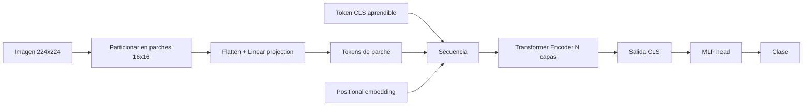

## 1. Motivacion: Por que ir mas alla de las RNNs

Las **RNNs** (vanilla, GRU, LSTM) fueron la eleccion natural para datos secuenciales durante mas de una decada. Sin embargo, su diseno tiene tres limitaciones estructurales:

1. **No modelan jerarquia explicita**. La recurrencia es lineal: $h_t$ depende solo de $h_{t-1}$. No hay un mecanismo nativo para capturar estructura jerarquica (frases dentro de oraciones, clausulas anidadas).
2. **Hidden state como cuello de botella**. Toda la historia de la secuencia debe comprimirse en un vector de tamano fijo. Para secuencias largas, la informacion antigua se diluye.
3. **Distancia entre tokens es $O(T)$**. Para que el token 1 influya en el token 100, la senal debe propagarse por 100 pasos de recurrencia (con sus respectivas multiplicaciones, no-linealidades y posibles vanishing gradients).

A esto se suma un problema practico crucial: **las RNNs no se paralelizan en el tiempo**. Cada $h_t$ depende de $h_{t-1}$, asi que el computo es secuencial. En la era de las GPUs masivas, esto se vuelve un cuello de botella de hardware.


La pregunta de Vaswani et al. (2017) fue radical: **¿necesitamos la recurrencia en absoluto?** ¿Podemos construir un modelo seq2seq usando solo attention, sin RNN ni convolucion?


---

## 2. El Transformer: Tres Ingredientes

El paper "**Attention Is All You Need**" (Vaswani et al. 2017, Google Brain & Google Research) responde con tres ideas combinadas:

1. **Self-attention**: cada token atiende a todos los demas tokens de la misma secuencia. Captura relaciones intra-secuencia sin recurrencia.
2. **Multi-head attention**: en vez de una sola distribucion de atencion, varios "cabezales" en paralelo aprenden distintos tipos de relaciones (sintactica, semantica, co-referencia).
3. **Hierarchical stacking**: apilar $N$ capas de self-attention permite construir representaciones jerarquicas, sustituyendo la jerarquia que las RNNs no modelan.

El resultado es un modelo seq2seq encoder-decoder que **elimina por completo la recurrencia** y se entrena de forma masivamente paralela.

---

## 3. Repaso: Seq2Seq con Attention (Clase 13)

Antes de saltar al Transformer, reanclamos la imagen mental de la [Clase 13](/clases/clase-13). Un seq2seq con attention RNN tiene:



- Encoder RNN produce hidden states $h_1, \ldots, h_T$.
- En cada paso $t$, el decoder calcula pesos $\alpha_{t,i}$ y un context $C_t = \sum_i \alpha_{t,i} h_i$.
- Atencion soft, diferenciable, normalizada por softmax.

El Transformer toma esta idea y la lleva al limite: **toda la red es atencion**, no solo la conexion encoder-decoder.

---

## 4. Embeddings de Tokens

> Ver [fundamento dedicado: Embeddings Distribuidos](/fundamentos/embeddings-distribuidos) para la matematica de la capa embedding, espacios semanticos y tied embeddings.

Antes de entrar a self-attention conviene fijar como se representa el input. El proceso es:

1. **Vocabulario indexado**: cada palabra (o subpalabra, BPE/WordPiece) tiene un id entero. Tipico: 10.000 a 50.000 entradas.
2. **Embedding matrix** $E \in \mathbb{R}^{|V| \times d_{model}}$: cada fila es el vector denso aprendido de un token. Convierte ids en vectores.

Un ejemplo en 4 dimensiones:

| Palabra | Vector |
|---|---|
| cat | [1.2, -0.1, 4.3, 3.2] |
| mat | [0.4, 2.5, -0.9, 0.5] |

Estos espacios capturan **regularidades semanticas**:

- **Genero**: $\text{king} - \text{queen} \approx \text{man} - \text{woman}$.
- **Tiempo verbal**: $\text{walk} - \text{walked} \approx \text{run} - \text{ran}$.
- **Pais-capital**: $\text{Russia} - \text{Moscow} \approx \text{Japan} - \text{Tokyo}$.


El embedding **no entiende** el lenguaje per se -- es una tabla aprendida. Lo que importa es que en el espacio de embedding, palabras semanticamente cercanas terminan cerca despues del entrenamiento.


---

## 5. Atencion: Motivacion Linguistica

Considera la oracion:

> "The trophy cannot fit in the suitcase because **it** is too big."

¿A que se refiere "it"? Al **trophy** (porque es grande). Si cambiamos "big" por "small":

> "The trophy cannot fit in the suitcase because **it** is too small."

ahora "it" se refiere al **suitcase**. Resolver coreferencia requiere que el modelo, al procesar "it", **mire** a otras palabras de la oracion. Self-attention es exactamente eso: cada token consulta a todos los demas.

Otro ejemplo: "The cat is on the mat" -- al codificar "cat", el modelo deberia atender a "mat" para enriquecer la representacion con contexto.

---

## 6. Attention como Acceso a Memoria

Una analogia util: una operacion **attention** es como un diccionario suave.

```python
memory = {key_1: value_1, key_2: value_2, ...}
result = memory[query]   # busqueda exacta
```

En attention diferenciable la "busqueda" es **suave**:

- Cada elemento de la memoria es un par $(k_i, v_i)$.
- Una **query** $q$ se compara contra cada $k_i$ via similitud (producto punto).
- Las similitudes se normalizan a una distribucion (softmax).
- El resultado es un **promedio ponderado** de los $v_i$.

Cada palabra de entrada produce **tres vectores**: query $q$, key $k$ y value $v$, mediante proyecciones lineales aprendidas.

---

## 7. Recordatorio: Producto Punto

$$a \cdot b = \sum_i a_i b_i = \|a\|\,\|b\| \cos\theta$$

Ejemplo numerico: $[2, 3, 4] \cdot [5, 1, 7] = 10 + 3 + 28 = 41$.

El producto punto es una **medida de similitud**: alto cuando los vectores apuntan en direcciones similares, cero cuando son ortogonales, negativo cuando son opuestos.

---

## 8. Self-Attention: La Ecuacion Central

> Ver [fundamento dedicado: Self-Attention](/fundamentos/self-attention) para derivacion de varianza ($\sqrt{d_k}$), multi-head con codigo en PyTorch/JAX/TensorFlow, y conexion con Relation Networks.

La operacion central del Transformer es:

$$\text{Attention}(Q, K, V) = \text{softmax}\!\left(\frac{Q K^T}{\sqrt{d_k}}\right) V$$

donde:

- $Q \in \mathbb{R}^{T \times d_k}$ son las queries (una por token).
- $K \in \mathbb{R}^{T \times d_k}$ son las keys.
- $V \in \mathbb{R}^{T \times d_v}$ son los values.
- $d_k$ es la dimension de queries y keys.

En self-attention, $Q$, $K$ y $V$ se obtienen del **mismo input** $X$:

$$Q = X W^Q, \quad K = X W^K, \quad V = X W^V$$

con $W^Q, W^K \in \mathbb{R}^{d_{model} \times d_k}$, $W^V \in \mathbb{R}^{d_{model} \times d_v}$ matrices de proyeccion aprendidas.

---

## 9. Diagrama Operativo: "Alexis kicked the ball"

Tomemos la oracion `Alexis kicked the ball` (4 tokens). Para el token "kicked" (query $x_1'$):

1. Calcular productos punto de $q_{kicked}$ con cada key: por ejemplo $(1.2, 0.2, 0.1, 0.0)$.
2. Aplicar softmax: $(0.87, 0.07, 0.06, 0.00)$.
3. Combinar values con esos pesos: $x_{kicked}' = 0.87 \cdot v_{Alexis} + 0.07 \cdot v_{kicked} + 0.06 \cdot v_{the} + 0.00 \cdot v_{ball}$.



Recordatorio softmax:

$$\text{softmax}(z_i) = \frac{e^{z_i}}{\sum_j e^{z_j}}$$

normaliza a una distribucion de probabilidad sobre los tokens fuente.

---

## 10. Por que Self-Attention Funciona


- **Paralelizable**: todas las queries se computan en una sola multiplicacion matricial $QK^T$. No hay recurrencia.
- **Distancia $O(1)$**: cualquier par de tokens esta a un solo paso de atencion.
- **Apilable**: stack de capas crea representaciones jerarquicas.
- **Permutation-equivariant**: la operacion es simetrica respecto al orden -- por eso necesitaremos **positional encoding** despues.


---

## 11. Multi-Head Attention

Una sola distribucion de atencion fuerza al modelo a elegir **una** relacion. Pero en "Alexis kicked the ball", "kicked" deberia atender a:

- **Sujeto**: Alexis (¿quien patea?)
- **Accion**: kicked (¿que hace?)
- **Objeto**: ball (¿que es pateado?)

La solucion: $h$ cabezales paralelos, cada uno con sus propias proyecciones $W_i^Q, W_i^K, W_i^V$:

$$\text{head}_i = \text{Attention}(Q W_i^Q, K W_i^K, V W_i^V)$$

$$\text{MultiHead}(Q, K, V) = W^O \, \text{Concat}(\text{head}_1, \ldots, \text{head}_h)$$

Cada cabezal aprende a atender a un **patron distinto**: posicional, sintactico, semantico, etc. La concatenacion seguida de la proyeccion $W^O$ recombina la informacion.

Tipicamente $d_k = d_v = d_{model} / h$, asi el costo total de multi-head es similar al de single-head.

---

## 12. Capa Transformer (Encoder)

> Ver [fundamento dedicado: Arquitectura Transformer](/fundamentos/transformer) para encoder/decoder completos, FFN position-wise, layer norm vs batch norm, pre-norm vs post-norm.

Una capa de encoder Transformer combina:



Es decir:

1. Multi-head self-attention.
2. Conexion residual + LayerNorm (bloque "**Add & Norm**").
3. Position-wise FFN (dos capas Dense con ReLU, aplicada a cada posicion independientemente).
4. Otra conexion residual + LayerNorm.

La FFN tiene la forma:

$$\text{FFN}(x) = W_2 \, \text{ReLU}(W_1 x + b_1) + b_2$$

con dimension intermedia tipicamente $d_{ff} = 4 \cdot d_{model}$ (ej. 2048 si $d_{model} = 512$).

---

## 13. Arquitectura Completa

El Transformer original es **encoder-decoder**, $N = 6$ capas en cada lado:



El decoder tiene **tres** sub-capas por bloque:

1. **Masked multi-head self-attention**: el token $t$ solo puede atender a $1, \ldots, t$ (no al futuro).
2. **Cross-attention**: queries del decoder, keys/values del encoder. Esto es exactamente la **atencion de Bahdanau** (2015) generalizada.
3. **FFN**.

Cada sub-capa con su Add & Norm correspondiente.

---

## 14. Positional Encoding

> Ver [fundamento dedicado: Positional Encoding](/fundamentos/positional-encoding) para sinusoidal vs aprendido vs RoPE vs ALiBi, con derivacion de la propiedad de linealidad para offsets.

Self-attention es **permutation-equivariant**: si permutamos los tokens del input, la salida se permuta de la misma forma. Pero el orden de las palabras importa ("perro muerde hombre" $\neq$ "hombre muerde perro"). Hay que inyectar **informacion posicional**.

Vaswani et al. proponen sumar al embedding una funcion sinusoidal:

$$PE(p, 2i) = \sin\!\left(\frac{p}{10000^{2i/d_{model}}}\right)$$

$$PE(p, 2i+1) = \cos\!\left(\frac{p}{10000^{2i/d_{model}}}\right)$$

donde $p$ es la posicion y $i$ el indice de dimension. Propiedades:

- Diferentes frecuencias en diferentes dimensiones (de muy rapidas a muy lentas).
- Permite **interpolar** posiciones no vistas en training.
- Cada $PE(p+k)$ es funcion lineal de $PE(p)$ -- permite aprender desplazamientos relativos.

Una alternativa es usar **positional embeddings aprendidos** (como en BERT y GPT): una matriz $E_{pos} \in \mathbb{R}^{T_{max} \times d_{model}}$ entrenada como cualquier embedding.

---

## 15. Comparativa de Modelos GPT

Para fijar escala, la familia GPT es decoder-only Transformer:

| Modelo | Ano | $d_{model}$ | Heads | Layers | Parametros | Datos |
|---|---|---|---|---|---|---|
| GPT | 2018 | 768 | 12 | 12 | 0.12B | BookCorpus 4.5GB |
| GPT-2 | 2019 | 1.600 | 48 | 48 | 1.5B | WebText 40GB |
| GPT-3 | 2020 | 12.288 | 96 | 96 | 175B | CommonCrawl+ 570GB |
| GPT-4 | 2023 | ? | ? | ? | ~1.76T | ? |

La estructura es esencialmente la misma desde 2017; cambia la escala (parametros y datos).

---

## 16. BERT: Pre-entrenamiento Bidireccional

> Ver [fundamento dedicado: Pre-training BERT](/fundamentos/pretraining-bert) para MLM regla 80/10/10, NSP, fine-tuning para cada tipo de tarea, y descendientes (RoBERTa, ALBERT, DeBERTa). Tambien la [ficha del paper](/papers/bert-devlin-2018).

**BERT** (Devlin et al. 2018, "Bidirectional Encoder Representations from Transformers") es un Transformer **encoder-only** entrenado con dos tareas auto-supervisadas.

### 16.1 Inputs

- **WordPiece tokenization**: subpalabras como `playing` → `play + ##ing`. Maneja palabras raras y morfologia.
- Tres embeddings sumados: **token** + **segment** (oracion A o B) + **positional**.
- Tokens especiales: **[CLS]** (al inicio, representacion agregada para clasificacion) y **[SEP]** (separa oraciones).

### 16.2 Pre-training

Dos objetivos:

1. **Masked Language Modeling (MLM)**: enmascarar 15% de los tokens y predecirlos. De ese 15%: 80% se reemplaza por `[MASK]`, 10% por un token random, 10% se deja igual (para reducir gap entre pre-training y fine-tuning).
2. **Next Sentence Prediction (NSP)**: dado un par (A, B), predecir si B sigue a A en el corpus original (50% si, 50% no). Se clasifica con la representacion de [CLS].

### 16.3 Fine-tuning

La gran idea: **una sola arquitectura** sirve para muchas tareas downstream agregando una cabeza minima:

- **Clasificacion de oracion**: usar [CLS] → Dense → softmax.
- **Pares de oraciones** (paraphrasing, entailment, QA): inputs A [SEP] B → [CLS] → softmax.
- **Sequence tagging** (NER, POS): usar la representacion de cada token → Dense → softmax.

BERT establecio el paradigma **pre-train massive + fine-tune small** que domina NLP moderno.

---

## 17. Vision Transformer (ViT)

> Ver [fundamento dedicado: Vision Transformer](/fundamentos/vision-transformer) para patch embedding, [class] token, trade-off datos vs inductive bias, y descendientes (DeiT, Swin, MAE). Tambien la [ficha del paper](/papers/vit-dosovitskiy-2021).

**ViT** (Dosovitskiy et al. 2021, "An Image is Worth 16x16 Words") muestra que el Transformer encoder funciona en vision **sin convoluciones**:



Pasos:

1. Imagen $H \times W \times 3$ → grid de **parches** $16 \times 16$ → secuencia de $N = HW/16^2$ vectores.
2. Cada parche se proyecta linealmente a dimension $d_{model}$.
3. Se prepende un token aprendible `[class]` y se suma positional embedding.
4. La secuencia entra a un encoder Transformer estandar.
5. La salida del token `[class]` alimenta un MLP head para clasificacion.

### 17.1 CNN vs Transformer en vision

| Propiedad | CNN | ViT |
|---|---|---|
| Localidad | Si (kernel pequeno) | Solo via parches |
| Estructura 2D | Si (convolucion) | Solo en input |
| Equivariancia traslacional | Si | No nativa |
| Receptive field global | Solo en capas profundas | Desde la primera capa |
| Inductive bias | Fuerte | Debil (compensado con datos) |

ViT requiere **mucha** data (300M+ imagenes en JFT) para superar a CNNs, pero a esa escala iguala o supera a las mejores ConvNets.

---

## 18. CLIP: Vision-Lenguaje Contrastivo

> Ver [fundamento dedicado: Aprendizaje Contrastivo (CLIP)](/fundamentos/aprendizaje-contrastivo) para InfoNCE simetrico, prompt engineering, robustez a distribution shift, y descendientes (ALIGN, OpenCLIP, SigLIP). Tambien la [ficha del paper](/papers/clip-radford-2021).

**CLIP** (Radford et al. 2021, "Contrastive Language-Image Pre-training") une vision y lenguaje natural.

### 18.1 Motivacion

Los datasets clasicos de vision tienen problemas:

- **Costosos**: ImageNet etiquetado a mano.
- **Conceptos estrechos**: 1.000 categorias predefinidas.
- **Brittle**: el modelo no generaliza a clases nuevas sin re-entrenar.

CLIP resuelve esto con tres ideas:

1. **Datos web**: 400M pares (imagen, texto) scrapeados (dataset WIT). Gratis y enorme.
2. **Texto como label**: el texto se procesa con un encoder de lenguaje, no se reduce a una clase categorica.
3. **Zero-shot via prompts**: para clasificar, se evaluan prompts del estilo `"A photo of a {class}"` y se elige la clase con mayor similitud al embedding de imagen.

### 18.2 Arquitectura

Dos torres:

- **Image encoder**: ResNet o ViT, produce $I_e$.
- **Text encoder**: Transformer, produce $T_e$.

Ambos proyectan a un **espacio compartido** y se normalizan L2.

### 18.3 Objetivo contrastivo

Dado un batch de $N$ pares $(I_i, T_i)$, se computa la matriz $N \times N$ de similitudes coseno. La diagonal son los pares verdaderos. Se aplica **cross-entropy simetrica** (sobre filas y columnas) para empujar la diagonal arriba y los off-diagonal abajo.

### 18.4 Zero-shot: Food101

Para clasificar "guacamole":

- Construir prompts: `"A photo of guacamole"`, `"A photo of pizza"`, ..., para las 101 clases.
- Embebir cada prompt con el text encoder.
- Embebir la imagen con el image encoder.
- Devolver la clase con mayor similitud coseno.

CLIP alcanza 90.1% rank-1 en Food101 **sin ver una sola imagen del dataset durante el training**.

---

## 19. Resumen de la Clase

1. Las **RNNs** tienen tres limitaciones: no jerarquia, hidden state como cuello de botella, distancia $O(T)$.
2. El **Transformer** (Vaswani 2017) las elimina con self-attention puro.
3. La operacion central es $\text{Attention}(Q,K,V) = \text{softmax}(QK^T/\sqrt{d_k}) V$.
4. **Multi-head** permite atender a varios patrones en paralelo.
5. La capa Transformer combina multi-head + FFN con residual + LayerNorm.
6. **Positional encoding** (sinusoidal o aprendido) inyecta orden, ya que self-attention es permutation-equivariant.
7. El decoder agrega **masked self-attention** y **cross-attention**.
8. **GPT** (decoder-only) escala el Transformer autoregresivo hasta 175B+ parametros.
9. **BERT** (encoder-only) introduce pre-training masivo con MLM + NSP, y un paradigma de fine-tuning unificado.
10. **ViT** muestra que parches + Transformer funciona en vision; **CLIP** alinea vision y texto via contrastivo, habilitando zero-shot.

---

## Fundamentos para profundizar cada concepto

- [Self-Attention](/fundamentos/self-attention) -- Q/K/V, scaled dot-product, multi-head con derivacion de varianza y codigo en 3 frameworks.
- [Arquitectura Transformer](/fundamentos/transformer) -- encoder-decoder completo, FFN, layer norm, residuals, masked y cross attention.
- [Positional Encoding](/fundamentos/positional-encoding) -- sinusoidal, aprendido, RoPE, ALiBi.
- [Embeddings Distribuidos](/fundamentos/embeddings-distribuidos) -- capa embedding, espacios semanticos, tied embeddings.
- [Pre-training BERT](/fundamentos/pretraining-bert) -- MLM, NSP, fine-tuning, RoBERTa/ALBERT/DeBERTa.
- [Vision Transformer](/fundamentos/vision-transformer) -- patches 16x16, [class] token, trade-off datos vs inductive bias.
- [Aprendizaje Contrastivo (CLIP)](/fundamentos/aprendizaje-contrastivo) -- InfoNCE simetrico, zero-shot, multimodal.
- [Mecanismo de Atencion](/fundamentos/mecanismo-atencion) -- cross-attention en Bahdanau, precursor de self-attention.

## Lecturas recomendadas

- [Vaswani et al. 2017 -- "Attention Is All You Need"](/papers/attention-is-all-you-need-vaswani-2017)
- [Devlin et al. 2018 -- "BERT: Pre-training of Deep Bidirectional Transformers for Language Understanding"](/papers/bert-devlin-2018)
- [Radford et al. 2021 -- CLIP](/papers/clip-radford-2021)
- [Dosovitskiy et al. 2021 -- ViT](/papers/vit-dosovitskiy-2021)
- [Santoro et al. 2017 -- Relation Networks](/papers/relation-networks-santoro-2017)
- Rush -- "The Annotated Transformer" (Harvard)
- Anthropic -- "Transformer Circuits" (interpretabilidad mecanicista)

Continuar con la [Profundizacion](profundizacion) para la matematica detallada o el [Wiki de investigacion](wiki) para la sintesis integrada.
