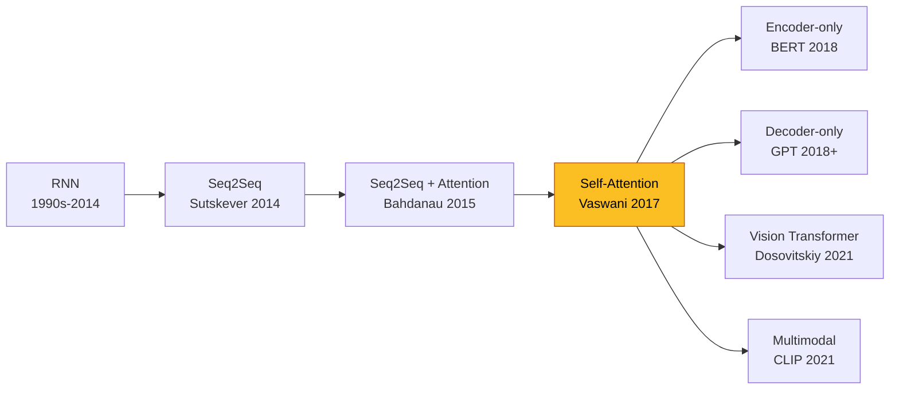
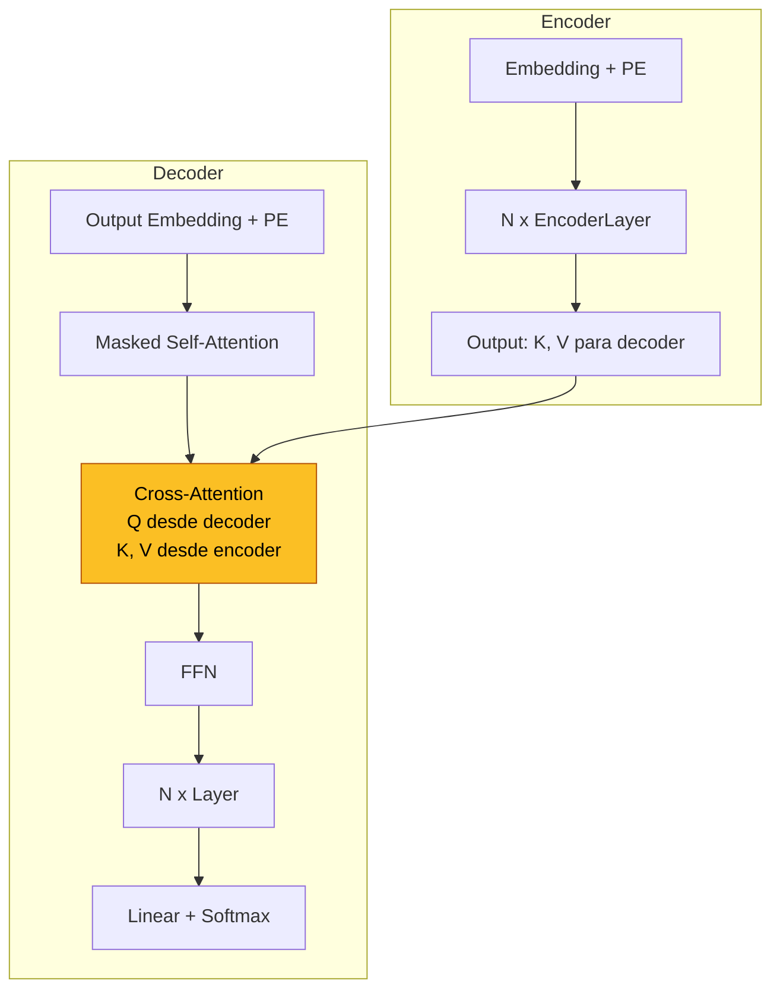
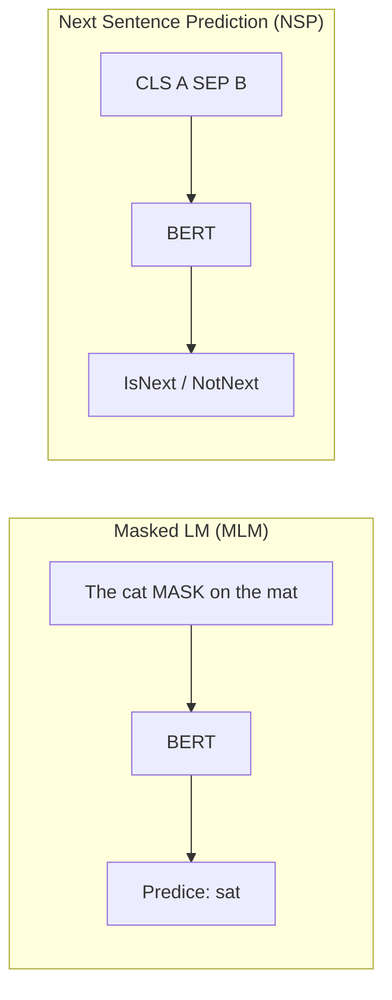
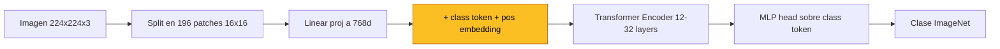
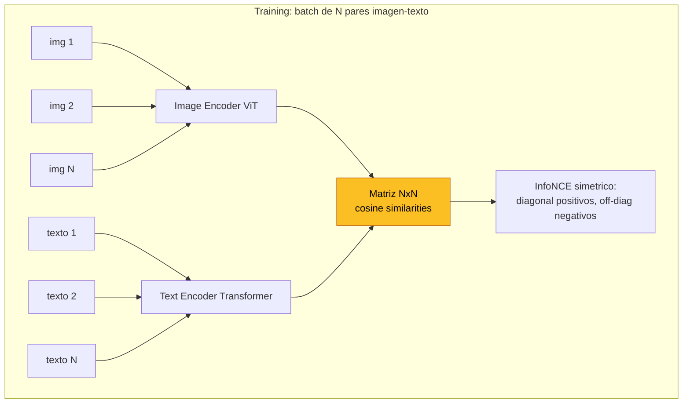

Este documento integra el contenido de la Clase 14 (Felipe del Rio, 111 slides) con los 5 papers seminales descargados, los 7 fundamentos creados y codigo de referencia en PyTorch / JAX / TensorFlow. Sirve como puerta de entrada al ecosistema Transformer.

> **Como navegar este documento**: las secciones 1-4 son la espina dorsal conceptual (motivacion, mecanica, arquitectura, codigo). Las secciones 5-9 son aplicaciones (BERT, ViT, CLIP, Relation Networks). La seccion 10 es el cuadro evolutivo. Los enlaces internos llevan al fundamento o paper correspondiente para profundizar.

---

## 1. La gran idea en una frase


**El Transformer cambia la pregunta**: en lugar de procesar tokens *secuencialmente* (RNN) o con *kernels locales* (CNN), los procesa **en paralelo** dejando que cada uno pondere a todos los demas via **self-attention**. Resultado: distancia O(1) entre cualquier par de tokens, paralelismo masivo en GPU, y un sesgo inductivo "grafo totalmente conectado" que escala mucho mejor con datos.


Lo que hace especial al paper de Vaswani et al. 2017 no es que invente la atencion -- Bahdanau (2015) y Luong (2015) ya la usaban entre encoder y decoder. La idea radical es **eliminar las RNNs por completo** y aplicar atencion **dentro** de cada mitad: self-attention.

---

## 2. La cadena conceptual: de RNN a Transformer



Cada flecha es un salto significativo. La explicacion comprimida:

- **A→B**: Secuencia variable a secuencia variable. Encoder comprime input en vector $C$, decoder genera output condicionado en $C$.
- **B→C**: $C$ fijo es cuello de botella; Bahdanau hace $C_t$ adaptativo via [atencion aditiva](/fundamentos/mecanismo-atencion).
- **C→D**: si atencion funciona entre encoder y decoder, **funciona dentro** de ambos. Vaswani elimina RNN.
- **D→E,F,G,H**: aplicaciones especializadas. BERT solo encoder + bidireccional. GPT solo decoder + autorregresivo. ViT en vision via patches. CLIP entrena imagen+texto contrastivamente.

---

## 3. Self-Attention paso a paso

Ver [fundamento dedicado](/fundamentos/self-attention) para detalle exhaustivo. Resumen ejecutivo:

### 3.1 Q, K, V como acceso a memoria

Cada token $x_i$ produce tres vectores via proyecciones lineales:

$$q_i = W^Q x_i, \quad k_i = W^K x_i, \quad v_i = W^V x_i$$

- $q_i$ (query) = "que estoy buscando?"
- $k_i$ (key) = "que ofrezco como id?"
- $v_i$ (value) = "que info entrego si me eligen?"

Analogia con `memory[query]`: los $k_i$ son las llaves de la memoria, los $v_i$ los valores almacenados. La atencion devuelve un value ponderado por similitud query-key.

### 3.2 Ecuacion central (scaled dot-product)

$$\text{Attention}(Q, K, V) = \text{softmax}\left(\frac{QK^T}{\sqrt{d_k}}\right)V$$

**Por que $\sqrt{d_k}$**: si $q, k \sim \mathcal{N}(0, I_{d_k})$ son independientes con coordenadas iid de varianza 1, entonces $E[q^T k] = 0$ y $\text{Var}(q^T k) = d_k$. Sin escala, productos punto crecen como $\sqrt{d_k}$ en magnitud, empujando softmax a saturacion (gradiente desaparece). Dividir por $\sqrt{d_k}$ normaliza varianza a 1.

### 3.3 Multi-Head: por que multiples distribuciones

Una sola $\text{softmax}$ produce una unica distribucion de pesos -- restrictivo. "kicked" en "Alexis kicked the ball" deberia atender simultaneamente a:
- "Alexis" (sujeto, *quien?*)
- "kicked" (accion, *que paso?*)
- "ball" (objeto, *a quien?*)

Multi-head ejecuta $h$ atenciones en paralelo en subespacios distintos:

$$\text{MultiHead}(Q, K, V) = W^O \cdot \text{Concat}(\text{head}_1, \ldots, \text{head}_h)$$
$$\text{head}_i = \text{Attention}(Q W_i^Q, K W_i^K, V W_i^V)$$

donde cada cabeza vive en $\mathbb{R}^{d_k}$ con $d_k = d_{model}/h$. Hyperparametros canonicos del paper Vaswani: $d_{model}=512$, $h=8$, $d_k = d_v = 64$.

### 3.4 Costo computacional

| Operacion | Complejidad por capa | Operaciones secuenciales | Distancia max |
|---|---|---|---|
| Self-Attention | $O(n^2 \cdot d)$ | $O(1)$ | $O(1)$ |
| Recurrent | $O(n \cdot d^2)$ | $O(n)$ | $O(n)$ |
| Convolutional | $O(k \cdot n \cdot d^2)$ | $O(1)$ | $O(\log_k n)$ |

(Tabla 1 del paper Vaswani.) Self-attention gana en NLP cuando $n < d$ (tipico $n=512$, $d=512$). Para secuencias muy largas la cuadraticidad se vuelve problema (ver Linformer, Performer, FlashAttention).

---

## 4. Implementacion: el bloque mas comun en deep learning moderno

Ver [fundamento self-attention](/fundamentos/self-attention) para code completo. Aqui la version compacta del **scaled dot-product attention** en los tres frameworks:




```python
import torch
import torch.nn.functional as F

def scaled_dot_product_attention(Q, K, V, mask=None):
    # Q, K, V: (batch, heads, seq, d_k)
    d_k = Q.size(-1)
    scores = torch.matmul(Q, K.transpose(-2, -1)) / (d_k ** 0.5)
    if mask is not None:
        scores = scores.masked_fill(mask == 0, float('-inf'))
    attn = F.softmax(scores, dim=-1)
    return torch.matmul(attn, V), attn
```



```python
import jax.numpy as jnp
from jax import nn as jnn

def scaled_dot_product_attention(Q, K, V, mask=None):
    # Q, K, V: (batch, heads, seq, d_k)
    d_k = Q.shape[-1]
    scores = jnp.matmul(Q, jnp.swapaxes(K, -2, -1)) / jnp.sqrt(d_k)
    if mask is not None:
        scores = jnp.where(mask == 0, -1e9, scores)
    attn = jnn.softmax(scores, axis=-1)
    return jnp.matmul(attn, V), attn
```



```python
import tensorflow as tf

def scaled_dot_product_attention(Q, K, V, mask=None):
    # Q, K, V: (batch, heads, seq, d_k)
    d_k = tf.cast(tf.shape(Q)[-1], tf.float32)
    scores = tf.matmul(Q, K, transpose_b=True) / tf.sqrt(d_k)
    if mask is not None:
        scores = tf.where(mask == 0, -1e9, scores)
    attn = tf.nn.softmax(scores, axis=-1)
    return tf.matmul(attn, V), attn
```




Las tres implementaciones son funcionalmente identicas. Diferencias sintacticas:
- **PyTorch**: idiomatic con `torch.matmul`, `masked_fill`, `F.softmax`.
- **JAX**: programacion funcional pura (sin estado), `jnp.where` en lugar de mask in-place.
- **TensorFlow**: `tf.matmul(... transpose_b=True)` evita `transpose` explicito; `tf.cast` necesario por tipos.

---

## 5. Arquitectura completa del Transformer

Ver [fundamento transformer](/fundamentos/transformer). Resumen estructural:



**Cada encoder layer**:
$$z' = \text{LayerNorm}(z + \text{MultiHeadAttn}(z))$$
$$z'' = \text{LayerNorm}(z' + \text{FFN}(z'))$$

**Cada decoder layer**: igual mas un sub-bloque adicional de cross-attention entre los dos.

**FFN position-wise**:
$$\text{FFN}(x) = \max(0, xW_1 + b_1)W_2 + b_2$$

con $d_{ff}=2048$ tipico (4x $d_{model}$). La self-attention mezcla tokens; la FFN mezcla dimensiones del embedding **dentro** de cada token.

**Hyperparametros canonicos** (paper Vaswani):

| Modelo | Layers $N$ | $d_{model}$ | $d_{ff}$ | $h$ | Params |
|--------|---|---|---|---|---|
| Base   | 6 | 512  | 2048 | 8  | 65M |
| Big    | 6 | 1024 | 4096 | 16 | 213M |

---

## 6. Positional Encoding

Self-attention es **permutation invariant**: sin info posicional, el modelo no distingue "el perro mordio al hombre" de "el hombre mordio al perro". Inyectar posicion es necesario.

Ver [fundamento positional-encoding](/fundamentos/positional-encoding) para tratamiento exhaustivo. Tabla comparativa:

| Tipo | Formula clave | Params | Extrapola | Usado por |
|------|---|---|---|---|
| Sinusoidal | $PE_{p, 2i} = \sin(p / 10000^{2i/d})$ | 0 | si | Vaswani 2017 |
| Aprendido | $PE = \text{Embedding}(\text{pos})$ | $L_{max} \cdot d$ | no | BERT, GPT-2, ViT |
| Relativo (Shaw) | sesgo en $QK$ por $\Delta = i-j$ | $O(d)$ | parcial | T5, Transformer-XL |
| **RoPE** (Su 2021) | rotacion en pares dim | 0 | si | LLaMA, PaLM, Mistral |
| **ALiBi** (Press 2021) | $-m \cdot \|i-j\|$ en scores | 0 | si | BLOOM, MPT |

RoPE es el estandar moderno -- combina lo mejor de absoluto (encoding por posicion) y relativo (producto punto solo depende de $p_i - p_j$).

---

## 7. BERT: pre-training masivo cambia el paradigma

Ver [fundamento pretraining-bert](/fundamentos/pretraining-bert) y [paper Devlin 2018](/papers/bert-devlin-2018) para detalle.

### 7.1 La revolucion del pretrain-finetune

Antes de BERT, el flujo en NLP era: word embeddings (W2V, GloVe) + arquitectura task-specific. BERT mostro que **un solo modelo pre-entrenado masivamente** podia adaptarse a casi cualquier tarea via fine-tuning ligero, batiendo state-of-the-art en GLUE, SQuAD, NER, etc.

### 7.2 Las dos tareas auto-supervisadas



**MLM**: enmascara 15% de tokens aleatorios; predice originales. Regla 80/10/10 (80% [MASK], 10% random, 10% original) evita sobre-ajustarse a `[MASK]` token.

$$\mathcal{L}_{\text{MLM}} = -\sum_{i \in \text{masked}} \log P(t_i \mid t_{\setminus \text{masked}})$$

**NSP**: par (A, B); predecir si B sigue a A en corpus. Posteriormente RoBERTa (Liu 2019) demostro que NSP no aporta -- entrenar mas MLM es mejor.

### 7.3 Bidireccional vs unidireccional

Anteriormente los modelos de lenguaje (GPT, ELMo) eran **unidireccionales** (left-to-right). BERT es **bidireccional**: ve contexto a ambos lados de cada palabra simultaneamente. La key insight: para que esto sea no-trivial (no solo memorizar la palabra), se usa MLM en lugar de next-token prediction.

Ablation de Tabla 5 del paper: BERT-base con MLM + bi >> BERT-base unidireccional + LM >> ELMo (bidireccional pero shallow).

### 7.4 Familia de descendientes

| Modelo | Cambio principal | Resultado |
|---|---|---|
| **RoBERTa** | Mas datos, sin NSP, dynamic masking | Mejor que BERT |
| **ALBERT** | Factoriza embedding + share params | Mismo perf con menos params |
| **DistilBERT** | Destilacion 6-capa | 60% mas rapido, 97% perf |
| **DeBERTa** | Disentangled attention + relative pos | SOTA en GLUE/SuperGLUE 2021 |
| **ELECTRA** | Replaced token detection (no MLM) | Mas eficiente compute |

---

## 8. Vision Transformer (ViT): NLP architecture vence en vision

Ver [fundamento vision-transformer](/fundamentos/vision-transformer) y [paper Dosovitskiy 2021](/papers/vit-dosovitskiy-2021).

### 8.1 La idea



Tratar cada **patch 16x16** como token. Si imagen es 224x224, se generan $14 \times 14 = 196$ patches. Cada uno se aplana ($16 \cdot 16 \cdot 3 = 768$ dims) y se proyecta linealmente al $d_{model}$ del Transformer.

### 8.2 El gran trade-off

ViT **no tiene** los inductive biases de CNN: localidad, equivarianza traslacional, jerarquia espacial. Esto significa:

- En datasets pequenos (ImageNet-1k, 1.3M imagenes): CNN gana. Los biases ayudan a aprender con pocos datos.
- En datasets gigantes (JFT-300M, 303M imagenes): ViT supera. Menos biases = mas flexibilidad = techo mas alto.
- **Cruce alrededor de 100M imagenes** (Figura 4 del paper).

### 8.3 Resultados clave

ViT-H/14 pre-entrenado en JFT-300M:
- ImageNet: **88.55%** top-1 (SOTA 2021)
- CIFAR-100: **94.55%**
- Oxford Flowers: **99.68%**

Con menos compute que el equivalente BiT-L (CNN-based).

### 8.4 Descendientes en vision

| Modelo | Cambio | Caso de uso |
|---|---|---|
| **DeiT** (Touvron 2021) | Training data-efficient (sin JFT) | ImageNet directo |
| **Swin** (Liu 2021) | Atencion en ventanas con shift | Detection, segmentation |
| **MAE** (He 2022) | Masked autoencoder pretrain | ViT con menos datos labeled |
| **ConvNeXt** (Liu 2022) | "Modernizar CNN" para competir | Reto a ViT |

---

## 9. CLIP: vision y lenguaje convergen

Ver [fundamento aprendizaje-contrastivo](/fundamentos/aprendizaje-contrastivo) y [paper Radford 2021](/papers/clip-radford-2021).

### 9.1 La intuicion



Dado batch de $N$ pares (imagen, texto), construir matriz $N \times N$ de similitudes coseno. Solo los $N$ pares de la diagonal son positivos verdaderos. La perdida InfoNCE simetrica empuja la diagonal a ser maxima.

### 9.2 Loss simetrico

$$\mathcal{L}_{i \to t} = -\frac{1}{N} \sum_{i=1}^N \log \frac{\exp(\text{sim}(I_i, T_i)/\tau)}{\sum_{j=1}^N \exp(\text{sim}(I_i, T_j)/\tau)}$$

$$\mathcal{L} = \frac{1}{2}(\mathcal{L}_{i \to t} + \mathcal{L}_{t \to i})$$

con temperatura $\tau$ aprendida. Equivalente a 2 cross-entropies con $N$ clases cada una.

### 9.3 Zero-shot classification: el truco magico

Para clasificar una imagen entre $K$ clases sin fine-tuning:

1. Construir prompts: `"A photo of a {class}"` para cada clase.
2. Codificar todos con text_encoder, normalizar L2.
3. Codificar imagen con image_encoder, normalizar L2.
4. Predecir: $\arg\max_k \cos(I, T_k)$.

CLIP-ViT-L/14: **76.2%** zero-shot en ImageNet (igual a ResNet-50 supervisado).

### 9.4 Robustez a distribution shift

| Dataset | ResNet-50 supervisado | CLIP zero-shot |
|---|---|---|
| ImageNet | 76.1% | 76.2% |
| ImageNet-V2 | 64.3% | 70.1% |
| ImageNet-A | 2.7% | **77.1%** |
| ImageNet-R | 36.1% | **88.9%** |
| ObjectNet | 32.6% | **72.3%** |

CLIP cae **mucho menos** que ResNet-50 supervisado en distribuciones desplazadas. Aprender de la web parece dar representaciones mas robustas que fitting estrecho a un dataset curado.

### 9.5 Impacto

- **Stable Diffusion** usa el text encoder de CLIP para condicionar generacion.
- **DALL-E 2** usa CLIP image embeddings.
- **OpenCLIP** (LAION) replica entrenamiento abierto.
- **SigLIP** (Zhai 2023) usa sigmoid loss, mas eficiente que softmax simetrico.

---

## 10. Relation Networks: el hilo conceptual

Ver [paper Santoro 2017](/papers/relation-networks-santoro-2017).

Antes del Transformer, **Relation Networks** ya formalizaban la idea de **bias relacional explicito**:

$$RN(O) = f_\phi\left(\sum_{i,j} g_\theta(o_i, o_j)\right)$$

donde $g_\theta$ es una MLP que codifica la relacion entre cada par $(o_i, o_j)$ y $f_\phi$ agrega.

**Conexion con self-attention**: ambas operaciones procesan **todos los pares** de elementos. La diferencia es que self-attention pondera cada par via $\alpha_{ij}$ aprendido (softmax sobre query-key), mientras que RN suma uniformemente. Self-attention puede verse como una RN con **funcion de relacion ponderada por similitud**.

Resultados de Santoro et al.:
- **CLEVR**: 95.5% (supera 92.6% de humanos)
- **bAbI**: 18/20 tareas
- **Sort-of-CLEVR**: confirma que el bias relacional es **necesario** (CNN sin RN: 63% en preguntas relacionales)

Lecciones que se transfieren al Transformer:
1. **Bias relacional explicito** acelera aprendizaje de razonamiento estructurado.
2. **Permutation invariance** (suma sobre pares) es la propiedad correcta para conjuntos.
3. **Composicion modular** (CNN → conjunto de objetos → RN/attention → MLP) es flexible.

---

## 11. Tabla cronologica de la era Transformer

| Ano | Paper | Aporte | Escala |
|------|---|---|---|
| 2014 | Sutskever et al. | Seq2Seq con LSTM | 380M params |
| 2015 | Bahdanau et al. | Atencion aditiva | -- |
| 2017 | **Vaswani et al.** | **Transformer** | 213M (big) |
| 2017 | Santoro et al. | Relation Networks | -- |
| 2018 | Radford et al. | GPT-1 (decoder-only) | 117M |
| 2018 | **Devlin et al.** | **BERT** (encoder-only) | 340M |
| 2019 | Liu et al. | RoBERTa | 355M |
| 2019 | Radford et al. | GPT-2 | 1.5B |
| 2020 | Brown et al. | GPT-3 | 175B |
| 2021 | **Dosovitskiy et al.** | **ViT** | 632M |
| 2021 | **Radford et al.** | **CLIP** | 400M params |
| 2021 | Fedus et al. | Switch Transformer | 1.6T (sparse) |
| 2022 | Chowdhery et al. | PaLM | 540B |
| 2023 | OpenAI | GPT-4 | ~1.76T (estimado) |
| 2024 | Anthropic | Claude 3 | -- |

Todos los modelos posteriores a 2017 son arquitecturas Transformer o variantes. El paper de Vaswani es el unico paper "fundacional" que se cita en literalmente todos los LLMs modernos.

---

## 12. Donde profundizar

### Lecturas guiadas (en orden)

1. **The Illustrated Transformer** (Jay Alammar) -- visualizaciones cristalinas.
2. **The Annotated Transformer** (Harvard NLP) -- paper con codigo PyTorch lado a lado.
3. **A Mathematical Framework for Transformer Circuits** (Anthropic) -- interpretabilidad mecanicista. Decomposicion QK/OV, induction heads.
4. **Stanford CS224N** -- curso completo.

### Implementaciones de referencia

- `tensor2tensor` (Google) -- repo original del paper, hoy en `trax`.
- `transformers` (HuggingFace) -- implementaciones modernas de cualquier variante.
- `jax/flax` -- implementaciones de DeepMind.
- `nanoGPT` (Karpathy) -- GPT minimalista en ~300 lineas, ideal para entender.
- `vit-pytorch` (lucidrains) -- implementaciones de ViT y descendientes.

### Frontera 2024-2026

- **Atencion eficiente**: FlashAttention v2 (Dao 2023), Mamba/SSMs (Gu 2023), Mixture of Experts (Switch, Mixtral).
- **Long context**: RoPE scaling, ALiBi, ring attention para context 1M+ tokens.
- **Multimodal**: GPT-4V, Gemini, Claude 3 -- vision + lenguaje en mismo modelo.
- **Reasoning**: CoT, ToT, RLHF, sintesis con verificacion (o1, DeepSeek-R1).

---

## 13. Mapa de archivos creados para esta clase

```
clase_14/
├── material/
│   ├── Clase/Clase 14 - Transformers.pdf            # 111 slides
│   └── Laboratorio/Laboratorio 14 - Parte 1+2.ipynb # notebooks
└── papers/
    ├── attention-is-all-you-need-vaswani-2017.pdf       # 15 pp
    ├── bert-devlin-2018.pdf                             # 16 pp
    ├── clip-radford-2021.pdf                            # 48 pp
    ├── vit-dosovitskiy-2021.pdf                         # 22 pp
    ├── relation-networks-santoro-2017.pdf               # 16 pp
    ├── analisis_attention_is_all_you_need_vaswani2017.md # 433 lineas
    ├── analisis_bert_devlin2018.md                       # 375
    ├── analisis_clip_radford2021.md                      # 628
    ├── analisis_vit_dosovitskiy2021.md                   # 430
    └── analisis_relation_networks_santoro2017.md         # 302

site/content/
├── clases/clase-14/
│   ├── _index.md         # hub
│   ├── teoria.md         # 465 lineas
│   ├── profundizacion.md # 449 lineas
│   └── wiki.md           # este archivo
├── fundamentos/
│   ├── self-attention.md          # 452 lineas
│   ├── transformer.md             # 605
│   ├── positional-encoding.md     # 414
│   ├── embeddings-distribuidos.md # 551
│   ├── pretraining-bert.md        # 612
│   ├── vision-transformer.md      # 530
│   └── aprendizaje-contrastivo.md # 504
├── papers/
│   ├── attention-is-all-you-need-vaswani-2017.md  # 152
│   ├── bert-devlin-2018.md                        # 149
│   ├── clip-radford-2021.md                       # 159
│   ├── vit-dosovitskiy-2021.md                    # 118
│   └── relation-networks-santoro-2017.md          # 132
└── ...

site/static/papers/  # PDFs servidos por Hugo
└── (mismos 5 PDFs duplicados aqui para servir desde el sitio)
```

---

## 14. Cierre

El Transformer se entiende mejor como **una arquitectura de proposito general para procesar conjuntos estructurados**. La elegancia de Vaswani et al. fue mostrar que self-attention sola, apilada y con FFN intercaladas, es suficiente para superar arquitecturas especializadas (RNNs en NLP, CNNs en vision). Lo que vino despues -- BERT, GPT, ViT, CLIP, LLMs modernos -- son **el mismo bloque computacional** apilado a escalas distintas, entrenado en datos distintos, con tareas auxiliares distintas.

La clase 14 cubre la mecanica. Los fundamentos creados con esta wiki cubren los detalles ingenieriles. Los 5 papers descargados son la fuente primaria. Y este documento es el puente integrador.

> Si solo lees una cosa: el [paper de Vaswani](/papers/attention-is-all-you-need-vaswani-2017). Si lees dos: agrega [BERT](/papers/bert-devlin-2018). Si lees tres: suma [CLIP](/papers/clip-radford-2021). Cada uno define una era.

---

**Ver tambien:** [Clase 14 - Teoria](teoria) · [Clase 14 - Profundizacion](profundizacion) · [Clase 13 (anterior)](/clases/clase-13) · [Fundamentos](/fundamentos/) · [Papers](/papers/).
