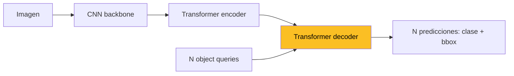

> Este documento profundiza en los fundamentos matematicos de la Clase 15.
> Cubre las derivaciones de IoU/AP/mAP, smooth L1, parametrizacion log de escalas,
> RoI Pool vs RoI Align, asignacion de anchors y desbalance de clases,
> y la evolucion conceptual hacia DETR y los detectores modernos.

---

# Parte I: Metricas Formales

---

## 1. Intersection over Union

Dadas cajas $A = (x_1^A, y_1^A, x_2^A, y_2^A)$ y $B = (x_1^B, y_1^B, x_2^B, y_2^B)$:

$$x_1^I = \max(x_1^A, x_1^B), \quad y_1^I = \max(y_1^A, y_1^B)$$
$$x_2^I = \min(x_2^A, x_2^B), \quad y_2^I = \min(y_2^A, y_2^B)$$

Area de interseccion:

$$|A \cap B| = \max(0, x_2^I - x_1^I) \cdot \max(0, y_2^I - y_1^I)$$

Area de union:

$$|A \cup B| = |A| + |B| - |A \cap B|$$

IoU:

$$\text{IoU}(A, B) = \frac{|A \cap B|}{|A \cup B|} \in [0, 1]$$

### 1.1 Propiedades

- **Invariante a escala**: solo depende de la geometria relativa.
- **No diferenciable** en regiones donde $|A \cap B| = 0$ (por eso usamos smooth L1 sobre offsets, no IoU directo, en el loss clasico). Variantes diferenciables: GIoU, DIoU, CIoU (Rezatofighi et al. 2019).

### 1.2 Generalizaciones

- **GIoU**: penaliza tambien por el tamano de la **caja envolvente** (smallest enclosing box).
- **DIoU**: agrega distancia entre centros.
- **CIoU**: agrega ademas consistencia de aspect ratio.

Estas variantes **si son diferenciables** y se usan como loss directo en detectores modernos (YOLOv4+).

---

## 2. Average Precision (AP)

### 2.1 Precision y recall

Para un umbral de IoU dado (ej. $0.5$):

- **TP** (true positive): deteccion con IoU $\geq$ umbral con un GT no asignado.
- **FP** (false positive): deteccion sin GT correspondiente, o con un GT ya asignado.
- **FN** (false negative): GT sin deteccion correspondiente.

$$\text{Precision} = \frac{TP}{TP + FP}, \quad \text{Recall} = \frac{TP}{TP + FN}$$

### 2.2 Curva precision-recall

Ordenar todas las detecciones por score descendente. Para cada prefijo, calcular precision y recall acumulados. Esto traza una curva $P(R)$.

### 2.3 AP como area bajo la curva

$$\text{AP} = \int_0^1 P(R) \, dR$$

En la practica, se aproxima con interpolacion:

**VOC interpolation (11-point)**: promediar $P(R)$ en $R \in \{0, 0.1, \ldots, 1.0\}$ usando $P_{\text{interp}}(R) = \max_{R' \geq R} P(R')$.

**COCO interpolation (101-point)**: promediar en $R \in \{0, 0.01, \ldots, 1.0\}$.

### 2.4 mAP

**mean Average Precision**: promedio de AP **sobre todas las clases**.

$$\text{mAP} = \frac{1}{K} \sum_{c=1}^{K} \text{AP}_c$$

### 2.5 mAP en COCO

COCO promedia ademas sobre **multiples umbrales de IoU**:

$$\text{mAP@[.5:.95]} = \frac{1}{10} \sum_{\tau \in \{0.5, 0.55, \ldots, 0.95\}} \text{mAP}_\tau$$

Mucho mas estricta: penaliza imprecision en la caja, no solo en la clase. mAP@0.5 (PASCAL VOC) y mAP@0.75 son metricas auxiliares.

---

# Parte II: Loss Multi-Task

---

## 3. Smooth L1 Loss: Derivacion

### 3.1 Motivacion

Las opciones naturales para regresion:

- **L2** ($\ell_2$): $L(x) = x^2$. Diferenciable en todas partes pero **muy sensible a outliers**: gradiente crece linealmente sin acotar.
- **L1** ($\ell_1$): $L(x) = |x|$. Robusta a outliers pero **no diferenciable en 0**.

Smooth L1 (Huber loss con $\delta = 1$):

$$\text{smooth}_{L_1}(x) = \begin{cases} 0.5 x^2 & |x| < 1 \\ |x| - 0.5 & |x| \geq 1 \end{cases}$$

### 3.2 Derivada

$$\frac{d}{dx} \text{smooth}_{L_1}(x) = \begin{cases} x & |x| < 1 \\ \text{sign}(x) & |x| \geq 1 \end{cases}$$

Continua y acotada por 1 en magnitud. Ventajas:

1. **En 0**: la derivada es 0 (continua, suave). L1 da $\pm 1$ discontinuamente.
2. **En el regimen lineal** ($|x| \geq 1$): el gradiente esta **acotado** a $\pm 1$. L2 daria $\pm |x|$ -- los outliers dominan.
3. **Cerca de 0**: cuadratica como L2 -- buena convergencia local.

### 3.3 Continuidad de la transicion

En $|x| = 1$:

- Funcion: $0.5 \cdot 1 = 0.5$ (cuadratica) y $1 - 0.5 = 0.5$ (lineal). **Continuas**.
- Derivada: $1$ (cuadratica) y $\text{sign}(1) = 1$ (lineal). **Continuas**.

Es una funcion $C^1$ (derivada continua), no $C^2$ (segunda derivada discontinua en $|x| = 1$).

### 3.4 Comparacion en deteccion

Los offsets $(t_x, t_y, t_w, t_h)$ pueden tener **outliers** (anchors mal asignados, GT con bordes ambiguos). Smooth L1 evita que un solo outlier domine el gradiente, mientras mantiene buen comportamiento local.

---

## 4. Por que log para $t_w$ y $t_h$

### 4.1 La escala es multiplicativa

Si un objeto tiene tamano $w$ y el anchor $w_a$, la relacion natural es **multiplicativa**: $w = s \cdot w_a$ con factor de escala $s > 0$.

Predecir $s$ directamente es problematico:

- $s$ debe ser positivo: la red podria predecir negativos (necesita activacion como exp o softplus).
- Asimetria: aumentar $s$ por 2x (de 1 a 2) y reducirlo a 0.5x (de 1 a 0.5) son **simetricos en escala** pero **muy distintos en distancia euclidea**.

### 4.2 Log resuelve ambos problemas

$$t_w = \log(w / w_a)$$

implica:

$$w = w_a \cdot e^{t_w}$$

- $t_w$ vive en $\mathbb{R}$: la red puede predecirlo sin restricciones (regresion lineal).
- **Simetria**: $t_w = +\log 2$ duplica, $t_w = -\log 2$ reduce a la mitad. Distancias iguales en el espacio de offsets.
- **Estabilidad**: una red entrenada con regression L2/Smooth-L1 sobre $t_w$ aprende escalas en un rango amplio sin saturar.
- **Inicializacion**: con $t_w \approx 0$ inicialmente, $w \approx w_a$. La red empieza prediciendo "el anchor original" y aprende ajustes pequenos.

### 4.3 Para $t_x, t_y$ no se usa log

Los offsets de centro son **aditivos**, no multiplicativos. Se normalizan por $w_a, h_a$ para invarianza a escala:

$$t_x = (x - x_a) / w_a$$

pero no se aplica log.

---

## 5. Loss Total de Faster R-CNN

$$L = L_{\text{rpn-cls}} + \lambda_1 L_{\text{rpn-reg}} + L_{\text{det-cls}} + \lambda_2 L_{\text{det-reg}}$$

con cada termino:

- **RPN cls**: cross-entropy binaria (objeto / no-objeto) sobre cada anchor positivo y negativo. Anchors intermedios excluidos.
- **RPN reg**: smooth L1 sobre $(t_x, t_y, t_w, t_h)$ **solo para anchors positivos**.
- **Det cls**: cross-entropy multiclase ($K + 1$ clases con fondo) sobre cada proposal.
- **Det reg**: smooth L1 sobre los offsets de la proposal positiva, indicador $[u \geq 1]$ excluye fondo.

Los $\lambda$ balancean magnitudes; valores tipicos $\lambda_1 = 10$, $\lambda_2 = 1$ con normalizacion por numero de muestras.

---

# Parte III: Asignacion de Anchors y Class Imbalance

---

## 6. Regla de Asignacion 0.7 / 0.3

### 6.1 Por que dos umbrales?

Una zona "muerta" $[0.3, 0.7]$ evita asignar etiquetas a anchors **ambiguos**:

- Si $\text{IoU} > 0.7$: el anchor cubre claramente el objeto -> **positivo**.
- Si $\text{IoU} < 0.3$: el anchor esta lejos -> **negativo**.
- Si $0.3 \leq \text{IoU} \leq 0.7$: el anchor cubre **parcialmente** -> ni positivo ni negativo, **ignorar**.

Sin la zona muerta, el clasificador recibiria senal contradictoria (un anchor con IoU = 0.5 podria etiquetarse como objeto en una iteracion y no-objeto en otra dependiendo de epsilons numericos).

### 6.2 Anchor de mayor IoU como salvavidas

Regla extra: **el anchor con mayor IoU** respecto a un GT es siempre positivo, aunque su IoU sea $< 0.7$. Esto garantiza que **todo GT tenga al menos un anchor responsable**, incluso si es un objeto raro o de tamano atipico.

### 6.3 Sampling balanceado

En cada batch, RPN samplea ~256 anchors con razon 1:1 positivo:negativo (rellenando con negativos si no hay suficientes positivos). Sin esto, los **negativos abrumarian** al loss (la mayoria de los $\sim 20{,}000$ anchors son fondo).

---

## 7. Class Imbalance y Focal Loss

### 7.1 El problema

Single-shot detectors (YOLO, SSD) generan **decenas de miles** de anchors por imagen. La gran mayoria son **fondo facil** (sky, road, etc.). El cross-entropy clasico:

$$L_{\text{CE}} = -\log p_t$$

con $p_t = p$ si la clase es positiva, $1 - p$ si es fondo. Para fondo "facil" con $p \approx 0$ ($p_t \approx 1$), el loss individual es pequeno pero **multiplicado por miles de anchors**, domina el gradiente.

### 7.2 Focal Loss (Lin et al. 2017, RetinaNet)

$$L_{\text{focal}} = -(1 - p_t)^\gamma \log p_t$$

con $\gamma \approx 2$. El factor $(1 - p_t)^\gamma$:

- Para ejemplos **faciles** ($p_t \to 1$): factor $\to 0$, loss casi nulo.
- Para ejemplos **dificiles** ($p_t$ pequeno): factor $\to 1$, loss completo.

Permite entrenar single-shot detectors sin sampling explicito. RetinaNet con focal loss alcanza precision de two-stage manteniendo velocidad single-stage.

### 7.3 Two-stage no necesita focal loss

En Faster R-CNN, la RPN ya hace **filtrado**: solo ~$2{,}000$ proposals llegan a la cabeza de clasificacion, y el sampling balanceado (1:3 positivo:negativo) maneja el desbalance restante. Por eso Faster R-CNN usa cross-entropy plano.

---

# Parte IV: RoI Pool vs RoI Align

---

## 8. RoI Pool: el problema de la cuantizacion

### 8.1 Como funciona RoI Pool

Dado un feature map de stride $s$ y una proposal $(x_1, y_1, x_2, y_2)$ en coordenadas de imagen:

1. Mapear a coordenadas de feature map: $(x_1/s, y_1/s, x_2/s, y_2/s)$.
2. **Cuantizar** a enteros: $(\lfloor x_1/s \rfloor, \ldots)$ -- esto pierde precision sub-pixel.
3. Dividir el RoI cuantizado en $7 \times 7$ celdas.
4. **Cuantizar** los limites de cada celda a enteros.
5. Max pool dentro de cada celda.

### 8.2 Errores de cuantizacion

Cada cuantizacion introduce error. Con stride $s = 32$ (tipico al final de ResNet), un pixel del feature map cubre 32 pixeles de imagen. Una proposal con bordes en pixel 100 vs 132 podria mapearse al **mismo bin** de feature map.

Para deteccion (cajas) este error es tolerable. Para **segmentacion mascaras** (Mask R-CNN), el error de pocos pixeles arruina la mascara.

---

## 9. RoI Align (Mask R-CNN, He et al. 2017)

### 9.1 Idea: no cuantizar

RoI Align mantiene **coordenadas flotantes** durante todo el proceso:

1. Mapear la proposal a feature map: coordenadas float, **no cuantizar**.
2. Dividir en $7 \times 7$ celdas: limites float.
3. Para cada celda, samplear (tipicamente 4) puntos uniformes.
4. En cada punto: **interpolacion bilineal** sobre los 4 pixeles vecinos del feature map.
5. Promediar (o max pool) los puntos de la celda.

### 9.2 Interpolacion bilineal

Para punto $(x, y)$ con vecinos $(x_0, y_0), (x_1, y_0), (x_0, y_1), (x_1, y_1)$:

$$f(x, y) = (1 - \alpha)(1 - \beta) f_{00} + \alpha (1 - \beta) f_{10} + (1 - \alpha) \beta f_{01} + \alpha \beta f_{11}$$

con $\alpha = x - x_0$, $\beta = y - y_0$. **Diferenciable** respecto a $x, y$ y a los $f_{ij}$.

### 9.3 Impacto

- En **deteccion**: ~1-2 puntos de mAP de mejora (no critico).
- En **segmentacion** (Mask R-CNN): mejora **dramatica** (~10 puntos de mAP de mascara). Sin RoI Align, la mascara tiene bordes desalineados con el objeto.


La leccion: **cuantizar es perder informacion**. Cuando la tarea downstream es sensible a pixeles (segmentacion, keypoints), la interpolacion diferenciable es indispensable.


---

# Parte V: Cronologia Seminal

---

## 10. Linea Evolutiva de Detectores

| Ano | Modelo | Innovacion clave |
|---|---|---|
| 2012 | Alexe-Deselaers-Ferrari | Objectness measure pre-CNN |
| 2013 | Selective Search | Propuestas via segmentacion jerarquica |
| 2014 | R-CNN (Girshick) | CNN + SVM por region, ~58% mAP VOC |
| 2014 | SPP-Net (He et al.) | Spatial Pyramid Pooling: una pasada CNN compartida |
| 2015 | Fast R-CNN (Girshick) | RoI Pool + multi-task loss, end-to-end (excepto SS) |
| **2015** | **Faster R-CNN (Ren et al.)** | **RPN aprendido, anchors $k=9$, end-to-end** |
| 2015 | YOLO v1 (Redmon et al.) | Single-shot, real-time |
| 2016 | SSD (Liu et al.) | Single-shot multi-scale |
| 2017 | YOLO9000 / YOLOv2 | k-means anchors, Darknet-19 |
| **2017** | **FPN (Lin et al.)** | **Lateral connections, piramide top-down** |
| 2017 | Mask R-CNN (He et al.) | RoI Align + mascara branch |
| 2017 | RetinaNet (Lin et al.) | Focal loss, single-shot competitivo |
| 2020 | DETR (Carion et al.) | Transformer + bipartite matching, sin anchors ni NMS |

---

## 11. SPP-Net: el Eslabon Perdido

He, Zhang, Ren, Sun (ECCV 2014) propusieron **Spatial Pyramid Pooling**: una capa que convierte feature maps de tamano variable en vectors fijos via pooling a multiples escalas. R-CNN clasico hacia warp + CNN por region (~2000 pasadas); SPP-Net hace **una sola pasada CNN** sobre la imagen completa y aplica SPP a cada region propuesta sobre el feature map.

Es el **precursor directo** de RoI Pool. Sin SPP-Net, no hay Fast R-CNN.

---

## 12. Fast R-CNN como Puente

Girshick (ICCV 2015) simplifica SPP-Net:

- Reemplaza SPP por **RoI Pool de un solo nivel** (mas simple).
- Introduce **multi-task loss** (clasificacion + regresion conjunta).
- Permite **end-to-end backprop** a traves de RoI Pool (SPP-Net solo backproppeaba la cabeza).

Fast R-CNN sigue dependiendo de Selective Search externo. **Faster R-CNN** elimina ese ultimo cuello de botella reemplazandolo por la RPN.

---

# Parte VI: Frontera Moderna

---

## 13. DETR: Detection Transformers (Carion et al. 2020)

DETR replantea deteccion como un problema de **set prediction**.

### 13.1 Arquitectura

- Backbone CNN produce feature map.
- **Transformer encoder** procesa el feature map con self-attention.
- **Transformer decoder** recibe **N object queries** aprendidas (vectors $\mathbb{R}^d$ aleatorios).
- Cada query produce una prediccion: clase ($K + 1$ con "no objeto") y bbox.

### 13.2 Bipartite matching loss

El problema: las $N$ predicciones deben asignarse a los $M$ GTs (con $M \leq N$). DETR usa el **algoritmo Hungaro** para encontrar el matching de costo minimo:

$$\hat{\sigma} = \arg\min_\sigma \sum_{i=1}^{M} \mathcal{L}_{\text{match}}(y_i, \hat{y}_{\sigma(i)})$$

Costo: combinacion de cross-entropy de clase + L1 + GIoU sobre bbox. Una vez fijado $\hat{\sigma}$, calcular el loss usual sobre los pares emparejados.

### 13.3 Sin anchors, sin NMS

DETR **elimina** dos heuristicas de los detectores clasicos:

- **Anchors**: las queries son aprendidas, no preestablecidas.
- **NMS**: el bipartite matching garantiza que cada GT se asigna a una sola query, no hay duplicados que suprimir.

Esto da un **pipeline end-to-end limpio**, sin post-processing no diferenciable.

### 13.4 Tradeoffs

- **Pro**: simplicidad conceptual, sin hyperparameters de anchors/NMS, generaliza naturalmente a panoptic segmentation.
- **Contra**: convergencia lenta (~10x mas epochs que Faster R-CNN). Variantes como **Deformable DETR** (Zhu et al. 2021) y **DINO** (Zhang et al. 2022) lo aceleran.

---

## 14. Mask R-CNN: Deteccion + Segmentacion

He, Gkioxari, Dollar, Girshick (ICCV 2017) extiende Faster R-CNN con:

1. **RoI Align** (visto en seccion 9).
2. **Mask branch**: una red FCN paralela a la cabeza de clasificacion que predice una mascara binaria $K \times m \times m$ por RoI (una mascara por clase).

Loss total:

$$L = L_{\text{cls}} + L_{\text{box}} + L_{\text{mask}}$$

con $L_{\text{mask}}$ binary cross-entropy **solo sobre la mascara de la clase verdadera** (las otras se ignoran). Mask R-CNN domina segmentacion de instancias durante anos.

---

## 15. Resumen de Ejes de Evolucion

1. **Multi-stage -> single-shot**: R-CNN -> Fast -> Faster -> YOLO/SSD. Cada paso reduce numero de etapas y elimina dependencias externas.
2. **Propuestas externas -> aprendidas**: Selective Search -> RPN -> object queries (DETR).
3. **Single-scale -> multi-scale**: feature map unico -> FPN -> piramide multi-nivel.
4. **Cuantizacion -> diferenciable**: RoI Pool -> RoI Align.
5. **Loss heuristico -> set matching**: NMS post-hoc -> bipartite matching diferenciable.
6. **Velocidad vs precision**: trade-off central que estructura todo el campo. Faster R-CNN domina precision; YOLO domina velocidad; RetinaNet (focal loss) los acerca; DETR los simplifica conceptualmente.

---

# Resumen Ejecutivo

1. **IoU** mide solapamiento; **mAP** integra precision-recall por clase y luego promedia.
2. COCO mAP@[.5:.95] es **mucho mas estricto** que VOC mAP@.5: penaliza imprecision en bbox.
3. **Smooth L1** combina robustez de L1 (regimen lineal acotado) con suavidad de L2 (regimen cuadratico cerca de 0); $C^1$ con derivada continua.
4. **Log para $t_w, t_h$**: parametrizacion natural de escala multiplicativa, simetrica, sin restricciones.
5. **Asignacion 0.7/0.3** evita anchors ambiguos; el "salvavidas" del max-IoU garantiza supervision para GTs raros.
6. **Class imbalance** en single-shot se resuelve con **focal loss** ($(1 - p_t)^\gamma \log p_t$); two-stage filtra via RPN + sampling.
7. **RoI Pool** cuantiza dos veces -> RoI Align usa interpolacion bilineal -> indispensable para mascaras.
8. **DETR** elimina anchors y NMS via bipartite matching y object queries: pipeline end-to-end sin heuristicas.
9. **Mask R-CNN** = Faster R-CNN + RoI Align + branch FCN para mascaras.
10. La evolucion del campo es **eliminacion progresiva de heuristicas no diferenciables**: warp, SS, RoI Pool quantization, NMS.

---

## Referencias

- Alexe, Deselaers, Ferrari (2012). Measuring the Objectness of Image Windows. *PAMI*.
- Uijlings, van de Sande, Gevers, Smeulders (2013). Selective Search for Object Recognition. *IJCV*.
- Girshick, Donahue, Darrell, Malik (2014). Rich feature hierarchies for accurate object detection and semantic segmentation. *CVPR* (R-CNN).
- He, Zhang, Ren, Sun (2014). Spatial Pyramid Pooling in Deep Convolutional Networks. *ECCV* (SPP-Net).
- Girshick (2015). Fast R-CNN. *ICCV*.
- Ren, He, Girshick, Sun (2015). Faster R-CNN: Towards Real-Time Object Detection with Region Proposal Networks. *NeurIPS*.
- Redmon, Farhadi (2017). YOLO9000: Better, Faster, Stronger. *CVPR*.
- Lin, Dollar, Girshick, He, Hariharan, Belongie (2017). Feature Pyramid Networks for Object Detection. *CVPR*.
- Lin, Goyal, Girshick, He, Dollar (2017). Focal Loss for Dense Object Detection. *ICCV* (RetinaNet).
- He, Gkioxari, Dollar, Girshick (2017). Mask R-CNN. *ICCV*.
- Rezatofighi et al. (2019). Generalized Intersection over Union. *CVPR*.
- Carion et al. (2020). End-to-End Object Detection with Transformers. *ECCV* (DETR).
- Zhu et al. (2021). Deformable DETR. *ICLR*.

Volver a [Teoria](teoria) | Hub de la [Clase 15](/clases/clase-15).
