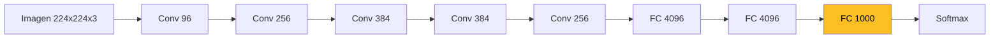
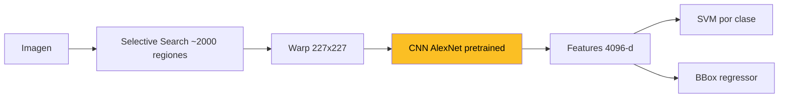
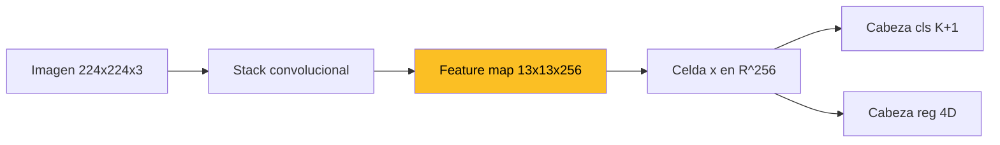
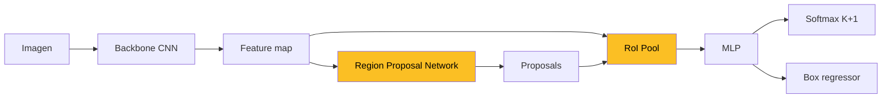
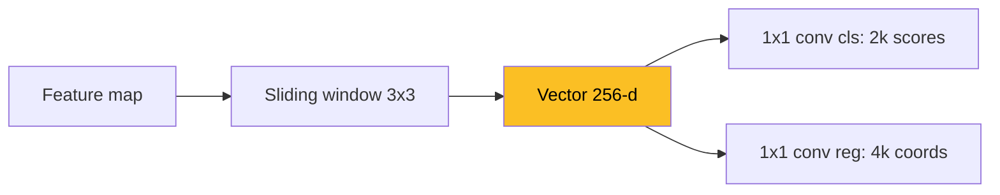
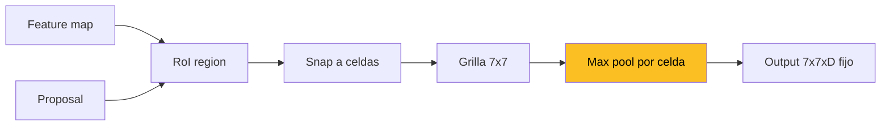
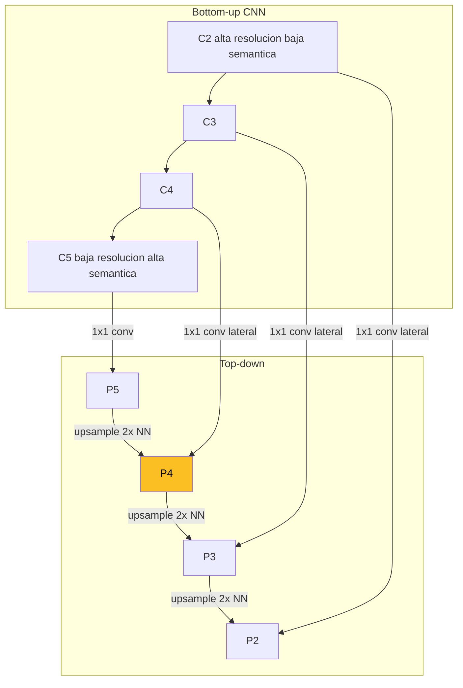

## 1. Del Clasificador Holistico a la Deteccion Region-Based

Las CNNs entrenadas en ImageNet (AlexNet, VGG, ResNet, Inception) producen una **clasificacion holistica**: dado una imagen completa, asignan **una sola etiqueta** entre las $K$ clases del dataset. AlexNet sigue el pipeline canonico: convoluciones progresivas $96 \to 256 \to 384 \to 384 \to 256$ canales, terminadas en cabezas fully-connected $4096 \to 4096 \to 1000$.

Variantes:

- **ImageNet** (1000 clases) -- benchmark canonico de clasificacion.
- **SUN, Places** (397 clases) -- scene recognition: clasificar la **escena** completa (oficina, playa, bosque) en vez de un objeto individual.

### 1.1 El problema con la clasificacion holistica

Una sola etiqueta es insuficiente cuando la imagen contiene **multiples objetos**. Una foto de calle con coches, peatones, semaforos y bicicletas no se describe con una sola clase. Necesitamos:

1. **Localizacion**: donde esta cada objeto (bounding box).
2. **Clasificacion por region**: que clase corresponde a cada caja.
3. **Cardinalidad variable**: el numero de objetos no se conoce a priori.


La **deteccion de objetos** es region-based: en lugar de una etiqueta global, se devuelve una **lista variable** de tuplas $(\text{clase}, \text{bounding box}, \text{score})$.


---

## 2. Bounding Boxes y Metricas Basicas

### 2.1 Bounding box

Rectangulo alineado con los ejes que envuelve un objeto. Dos parametrizaciones equivalentes:

- **Esquinas**: $(x_{\min}, y_{\min}, x_{\max}, y_{\max})$.
- **Centro+tamano**: $(x_c, y_c, w, h)$.

### 2.2 Intersection over Union (IoU)

Metrica de **solapamiento** entre dos cajas $A, B$:

$$\text{IoU}(A, B) = \frac{|A \cap B|}{|A \cup B|}$$

Rango $[0, 1]$. Umbrales tipicos:

- $\text{IoU} \geq 0.5$: deteccion correcta en VOC.
- $\text{IoU} \geq 0.7$: anchor positivo en RPN.
- $\text{IoU} < 0.3$: anchor negativo en RPN.

### 2.3 Non-Maximum Suppression (NMS)

Las redes producen muchas cajas redundantes sobre el mismo objeto. NMS **decora** la salida:

1. Ordenar cajas por score descendente.
2. Tomar la de mayor score, anadir al output.
3. Eliminar todas las cajas con $\text{IoU} \geq \theta$ (tipicamente $0.3$-$0.5$) respecto a la elegida.
4. Repetir con el resto.

---

## 3. R-CNN: la Idea Original (Girshick et al., CVPR 2014)

R-CNN propone tres etapas secuenciales:

### 3.1 Las tres preguntas

**Pregunta 1 — Como extraer propuestas de region?**

Aplicar un algoritmo de **objectness** o **region proposal** que genere ~2000 cajas candidatas por imagen. Opciones:

- **Selective Search** (Uijlings et al. 2013): segmentacion jerarquica por agrupacion de pixeles similares (color, textura, tamano).
- **Objectness measure** (Alexe, Deselaers, Ferrari, PAMI 2012): score generico de "que tan probable es que esta ventana contenga un objeto".
- **Category-independent proposals** (Endres-Hoiem).
- **CPMC** (Carreira-Sminchisescu).

Estos metodos son **clase-agnosticos**: no saben que objeto hay, solo proponen ventanas con alta probabilidad de contener algo.

**Pregunta 2 — Como manejar el tamano variable de las propuestas?**

Las propuestas tienen tamanos arbitrarios; la CNN espera input fijo $227 \times 227$. **Warp**: redimensionar (con distorsion) cada region al tamano canonico antes de pasar por la CNN.

**Pregunta 3 — Como entrenar el clasificador?**

Dos enfoques:

- **Adaptar la cabeza FC**: reemplazar la capa de 1000 clases por una de $K+1$ (incluyendo fondo) y fine-tunear sobre el dataset de deteccion.
- **Features + SVM**: usar la CNN como **extractor fijo**, entrenar un SVM lineal por clase sobre los features 4096-d.

R-CNN obtenia ~58% mAP en VOC2007, un salto fuerte sobre los metodos previos. Pero era **lento**: una pasada CNN por cada una de las ~2000 regiones.

---

## 4. Datasets de Deteccion

### 4.1 Pascal VOC

- **20 clases** (persona, coche, bicicleta, perro, gato, etc.).
- ~22000 imagenes anotadas con cajas y clases.
- Performance tipica de R-CNN: ~60% mAP@0.5.
- Benchmark canonico hasta ~2014.

### 4.2 Microsoft COCO

- **80 clases** (Common Objects in Context).
- **123,287 imagenes**, **886,284 instancias** anotadas.
- Imagenes mas complejas, objetos en contexto natural, escalas variadas.
- Metrica: **mAP promediado sobre IoU ~$\{0.5, 0.55, \ldots, 0.95\}$** (mucho mas estricta que VOC).
- Es el benchmark moderno de deteccion.


COCO es **mucho mas dificil** que VOC: 4x mas clases, 6x mas imagenes, escenas mas complejas y metrica que penaliza imprecision en la caja, no solo en la clase.


---

## 5. Fully Convolutional Networks (FCN)

R-CNN clasico tiene un cuello de botella: pasar 2000 regiones por la CNN. **Idea clave**: aplicar la CNN **una sola vez** sobre la imagen completa y trabajar sobre el feature map resultante.

### 5.1 Quitar las capas FC

AlexNet sin FCs produce, sobre input $224 \times 224$, un mapa $13 \times 13 \times 256$. Cada **celda** del mapa corresponde a una region receptiva de la imagen original (un parche).

### 5.2 Dos cabezas por celda

Cada vector $\vec{x} \in \mathbb{R}^{256}$ de una celda alimenta dos cabezas implementadas como convoluciones $1 \times 1$:

- **Object classification**: softmax sobre $K+1$ clases (las $K$ del dataset + **fondo**).
- **Bounding box regression**: 4 coordenadas $(x_c, y_c, w, h)$ relativas a la celda.

El fondo es una clase aparte para que la red pueda decir "aqui no hay objeto". Esta arquitectura es la base de **detectores single-shot** como YOLO y SSD.

---

## 6. YOLO — You Only Look Once (Redmon-Farhadi, YOLO9000)

YOLO empuja la idea FCN al extremo: **una sola pasada** produce todas las detecciones.

### 6.1 Anchor boxes

Predecir $(x_c, y_c, w, h)$ desde cero por celda es dificil: la red tendria que aprender la distribucion completa de tamanos. **Anchors**: cajas de referencia con escalas y aspect ratios fijos. La red predice **offsets** respecto a cada anchor.

YOLO9000 usa **k-means** sobre las cajas del training set para encontrar el numero optimo de anchors. Resultado: $k = 5$ anchors representativos.

### 6.2 Arquitectura Darknet

- **Darknet-19**: 19 capas, fully convolutional.
- Output map $13 \times 13$ con $k = 5$ anchors por celda.
- Total: $13 \times 13 \times 5 = 845$ predicciones de bounding box por imagen.

### 6.3 Salida por anchor

Cada anchor en cada celda produce:

- 4 offsets de bbox: $(t_x, t_y, t_w, t_h)$.
- Score de objectness.
- Distribucion softmax sobre $K$ clases + fondo.

### 6.4 Asignacion de etiquetas

Para entrenar:

- A cada GT bbox se le asigna **la celda que contiene su centro**.
- Dentro de esa celda, el anchor con mayor IoU es **responsable** de predecir.
- Otras celdas se ignoran o reciben label "no objeto".

### 6.5 Test: NMS

En inferencia, las 845 cajas pasan por NMS para eliminar redundancia. Output final: pocas cajas con clase y score.


YOLO es **single-stage**: una sola red predice todo en una pasada. Muy **rapido** (real-time), pero exige al regresor aprender una distribucion de tamanos compleja, lo que limita la precision en objetos pequenos o de aspect ratios atipicos.


---

## 7. Faster R-CNN (Ren, He, Girshick, Sun, NeurIPS 2015)

Faster R-CNN parte de una observacion: YOLO es rapido pero exige mucho al regresor; R-CNN es preciso pero lento por las propuestas externas. La solucion es un detector **two-stage** donde **las propuestas se aprenden** con una red dedicada.

### 7.1 Arquitectura de alto nivel

### 7.2 Step 1 — Region Proposal Network (RPN)

La RPN reemplaza Selective Search por una **red convolucional** que opera sobre el feature map del backbone.

Pipeline:

1. **Sliding window** de $3 \times 3$ sobre el feature map.
2. Cada ventana se proyecta a un vector de 256 dimensiones.
3. Dos cabezas $1 \times 1$ conv en paralelo:
   - **cls**: $2k$ scores (objeto / no-objeto, por anchor).
   - **reg**: $4k$ coordenadas (offsets, por anchor).

### 7.3 Anchors multi-escala

$k = 9$ anchors por posicion: **3 escalas** $\times$ **3 aspect ratios**. Cubren un rango amplio de tamanos sin que la red tenga que predecirlos desde cero.

### 7.4 Asignacion de anchors

- **Positivo** si: IoU $> 0.7$ con algun GT, o el anchor con mayor IoU para ese GT (aunque sea $< 0.7$).
- **Negativo** si: IoU $< 0.3$ con todos los GT.
- **Intermedios** ($0.3 \leq \text{IoU} \leq 0.7$): se descartan, no contribuyen al loss.

Esta regla genera supervision **balanceada** y evita ambiguedades.

### 7.5 Step 2 — RoI Pooling y clasificacion

Las proposals de la RPN tienen tamanos variables, pero la cabeza de clasificacion espera input fijo. **RoI Pooling**:

1. Dada una proposal sobre el feature map, dividir su area en una **grilla fija** ($7 \times 7$ tipico, $2 \times 2$ en versiones reducidas).
2. **Cuantizar** los limites a coordenadas enteras del feature map (snapped RoI).
3. Aplicar **max pooling** dentro de cada celda.
4. Output: tensor $H \times W \times D$ de tamano fijo, sin importar el tamano original de la proposal.

Ventaja clave: el feature map se calcula **una sola vez** y todas las proposals lo comparten. La diferencia con R-CNN clasico (una CNN por region) es enorme en velocidad.

### 7.6 Cabezas finales

Tras RoI Pool $\to$ flatten $\to$ MLP $\to$ dos cabezas:

- **Softmax classifier**: $K+1$ clases (incluye fondo).
- **Box regressor**: 4 offsets para refinar la proposal.

### 7.7 Modelo final: 4 cabezas conjuntas

Faster R-CNN entrena **4 cabezas conjuntamente**:

1. **RPN cls** ($3 \times 3$ obj/no-obj sobre cada anchor).
2. **RPN reg** ($k = 9$ anchors, offsets).
3. **Detection cls** (softmax $K+1$).
4. **Detection reg** (refinamiento de bbox).

Loss total:

$$L = L_{\text{rpn-cls}} + L_{\text{rpn-reg}} + L_{\text{det-cls}} + L_{\text{det-reg}}$$

### 7.8 Multi-task loss (Fast R-CNN)

Por proposal con clase verdadera $u$, prediccion $p$, target $v$ y prediccion $t^u$:

$$L(p, u, t^u, v) = L_{\text{cls}}(p, u) + \lambda \cdot [u \geq 1] \cdot L_{\text{loc}}(t^u, v)$$

donde:

- $L_{\text{cls}}(p, u) = -\log p_u$ (cross-entropy sobre la clase correcta).
- $L_{\text{loc}}$ usa **smooth L1** sobre los 4 offsets.
- El indicador $[u \geq 1]$ excluye el **fondo** del termino de localizacion (no tiene sentido refinar la caja del fondo).

**Smooth L1**:

$$\text{smooth}_{L_1}(x) = \begin{cases} 0.5 x^2 & |x| < 1 \\ |x| - 0.5 & \text{otro caso} \end{cases}$$

Combina lo mejor de L1 (menos sensible a outliers) y L2 (diferenciable en 0).

### 7.9 Parametrizacion de offsets

$$t_x = (x - x_a)/w_a, \quad t_y = (y - y_a)/h_a$$
$$t_w = \log(w/w_a), \quad t_h = \log(h/h_a)$$

donde $(x_a, y_a, w_a, h_a)$ son las coordenadas del anchor. El **log** sobre $w/h$ aporta:

- **Estabilidad numerica**: evita valores muy grandes o pequenos.
- **Simetria de escala**: predecir 2x o 0.5x se traduce a $\pm \log 2$.

---

## 8. Feature Pyramid Networks (Lin et al., CVPR 2017)

### 8.1 El problema de las escalas

Los objetos en una imagen aparecen en un **rango amplio de escalas**: una persona puede ocupar 20 pixeles o 500. Un solo nivel del feature map no captura bien todas las escalas:

- **Niveles altos** (cerca del output): mucha **semantica** (que clase es), pero **baja resolucion** -> mala localizacion.
- **Niveles bajos** (cerca del input): mucha **localizacion** (donde esta), pero **poca semantica**.

### 8.2 Idea de FPN: combinar bottom-up y top-down

Construccion:

1. **Bottom-up**: la pasada normal de la CNN backbone.
2. **Top-down**: empezando del nivel mas alto $C_5$, **upsamplear** $2 \times$ con **nearest neighbor** y descender.
3. **Lateral connections**: para cada nivel bottom-up, aplicar **conv $1 \times 1$** para igualar dimensionalidad y **sumar element-wise** con el top-down upsampleado.
4. Una **conv $3 \times 3$** sobre el mapa fusionado para suavizar artifacts del upsampling.

Resultado: una **piramide $\{P_2, P_3, P_4, P_5\}$** donde **cada nivel tiene alta semantica y resolucion adecuada a su escala**.

### 8.3 Como se usa

Aplicar el detector (RPN + cabezas) en **cada nivel de la piramide**, asignando objetos pequenos a niveles de mayor resolucion y objetos grandes a niveles mas profundos.


FPN se ha vuelto **estandar de facto** en deteccion: Faster R-CNN+FPN, Mask R-CNN, RetinaNet y casi todo el zoo moderno lo usan como neck entre backbone y head.


---

## 9. Resumen de la Clase

1. La **clasificacion holistica** falla cuando hay multiples objetos -- necesitamos deteccion **region-based**.
2. **R-CNN** (2014) fue el primer detector basado en CNN: Selective Search + warp + CNN + SVM. Lento pero precision alta.
3. Datasets: **VOC** (20 clases, mAP@0.5) y **COCO** (80 clases, mAP promediado).
4. **FCN** elimina las FCs y trabaja sobre feature maps; cada celda predice clase + bbox.
5. **YOLO** es single-shot, usa anchors aprendidos por k-means, output $13 \times 13 \times 5$ y NMS al final.
6. **Faster R-CNN** introduce la **RPN**: las propuestas se aprenden con anchors $k = 9$ (3 escalas $\times$ 3 ratios) y asignacion $0.7 / 0.3$.
7. **RoI Pooling** convierte regiones de tamano variable en tensors fijos, compartiendo el feature map entre todas las proposals.
8. **Multi-task loss**: cross-entropy + $\lambda \cdot [u \geq 1] \cdot \text{smooth L1}$ sobre offsets.
9. **FPN** fusiona bottom-up y top-down con lateral connections para deteccion **multi-escala**.
10. Ejes de evolucion: multi-stage -> single-shot, propuestas externas -> aprendidas, single-scale -> multi-scale, trade-off velocidad/precision.

---

## Lecturas recomendadas

- Alexe, Deselaers, Ferrari (2012) "Measuring the Objectness of Image Windows" -- objectness pre-CNN.
- Uijlings et al. (2013) "Selective Search for Object Recognition" -- algoritmo de propuestas usado por R-CNN.
- Girshick et al. (2014) "Rich feature hierarchies for accurate object detection and semantic segmentation" -- el paper R-CNN.
- He et al. (2014) "Spatial Pyramid Pooling" -- precursor de RoI Pool.
- Girshick (2015) "Fast R-CNN" -- RoI Pool, multi-task loss.
- Ren, He, Girshick, Sun (2015) "Faster R-CNN" -- RPN end-to-end.
- Redmon, Farhadi (2017) "YOLO9000: Better, Faster, Stronger" -- single-shot con anchors aprendidos.
- Lin et al. (2017) "Feature Pyramid Networks for Object Detection" -- la piramide moderna.

Continuar con la [Profundizacion](profundizacion) para la matematica detallada.
