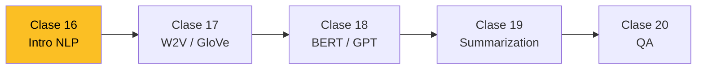
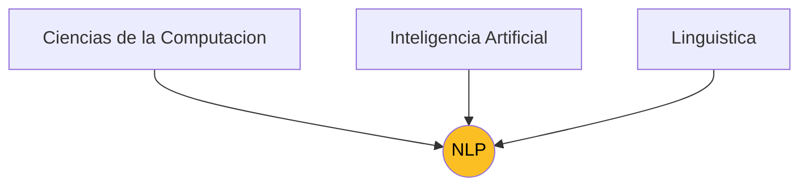
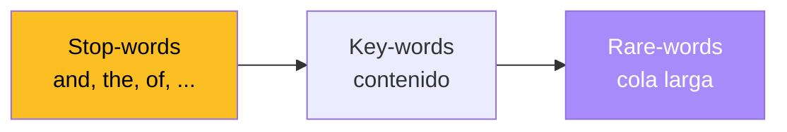

## 1. Mapa del Modulo

Esta es la **primera clase de un bloque de cinco** dedicado a Procesamiento de Lenguaje Natural (NLP). El recorrido del modulo:

1. **Clase 16 (esta)**: Introduccion -- contexto, aplicaciones, tecnicas clasicas, herramientas.
2. **Clase 17**: Modelos de lenguaje, Word2Vec y GloVe.
3. **Clase 18**: Modelos contextuales -- ELMo, GPT, BERT.
4. **Clase 19**: Generacion de resumenes (summarization).
5. **Clase 20**: Question Answering (QA).



La clase de hoy se estructura en cuatro bloques: **(1)** contexto y por que el lenguaje es dificil, **(2)** aplicaciones canonicas, **(3)** tecnicas clasicas y **(4)** herramientas concretas.

---

## 2. Que es NLP

NLP (Natural Language Processing, **Procesamiento de Lenguaje Natural**) es la interseccion entre tres disciplinas:



**Objetivo**: que las maquinas "entiendan" el lenguaje humano para resolver tareas utiles -- clasificar mensajes, traducir, responder preguntas, resumir, conversar.

### 2.1 Ejemplos de aplicacion industrial

- **Clasificacion de mensajes en redes sociales**: separar tweets/comentarios en categorias (Soporte, Felicitaciones, Reclamos, Ventas, Servicio) para enrutar a equipos correctos.
- **Prediccion de mercados financieros**: sentiment de tweets correlaciona con movimientos del FTSE 100 y otros indices.
- **Asistentes conversacionales**: Alexa, Siri, Google Duplex. Demo de Duplex agendando una hora con el peluquero por telefono ([video](https://www.youtube.com/watch?v=yDI5oVn0RgM)) -- el receptor humano no se da cuenta de que habla con una maquina.

---

## 3. Por que el Lenguaje es Dificil

El lenguaje natural fue **disenado por humanos para humanos**, no para maquinas. Tiene varias propiedades que lo hacen complejo de procesar.

### 3.1 Ambiguedad

Una misma cadena de palabras admite multiples interpretaciones:

- *"Impiden robo a camion Backus buscando botin de 30 mil"* -- ambiguedad sintactica (¿quien busca el botin?).
- *"Gianmarco festejara sus 20 anos cantando"* -- ¿20 anos de carrera o de edad?
- *"El mejor chef del mundo elabora bombones con ninos tinerfenos"* -- ambiguedad semantica peligrosa.
- *"La CEOE retiro su propuesta de abaratar el despido en 45 minutos"* -- ¿abaratar a 45 minutos o retirar en 45 minutos?
- *"-- ¿Sabes natacion? -- Si, nada mal."* -- juego de palabras (negacion vs. adverbio).

### 3.2 Multimodalidad y sarcasmo

El significado puede combinar **texto + tono + contexto visual**:

- *"Muy impresionante, ¿acaso no ves mi emocion?"* dicho con cara de aburrimiento -- sarcasmo.
- *"Que hermoso dia"* tuiteado bajo lluvia torrencial -- ironia.

Sin senales no textuales, el modelo confunde literalidad y sarcasmo.

### 3.3 Common sense y grounding

- **Common sense**: *"Un muerto y tres motoristas heridos"*. Un humano sabe que el muerto tambien era motorista; un modelo sin sentido comun no.
- **Grounding (Winograd Schema)**: *"The trophy cannot fit in the suitcase because it is too big"*. ¿A que se refiere "it"? Al trofeo. Si cambiaramos *big* por *small*, "it" pasaria a ser la maleta. Resolverlo requiere modelar el mundo fisico, no solo gramatica.

### 3.4 Conocimiento contextual

*"Muere la cerda de Miley Cyrus"* puede interpretarse de varias formas. Sin saber que la cantante tenia una mascota llamada asi, el modelo se pierde.


NLP es dificil por **cuatro razones simultaneas**: ambiguedad, multimodalidad, common sense y grounding/contexto. Estas dificultades motivan toda la maquinaria que veremos en el bloque (embeddings, modelos contextuales, attention).


---

## 4. Regularidades Estadisticas: Zipf y Heaps

A pesar de la complejidad, el lenguaje obedece **regularidades estadisticas robustas**. Dos leyes empiricas son fundamentales.

### 4.1 Ley de Zipf

Si ordenamos las palabras de un corpus por **frecuencia decreciente** y le asignamos rango $k = 1, 2, 3, \ldots$, la frecuencia de la palabra de rango $k$ sigue:

$$f(k) \;\propto\; \frac{1}{k^s}, \quad s \approx 1$$

Es decir, **la palabra mas frecuente aparece aproximadamente el doble que la segunda, el triple que la tercera, etc.**

Ejemplo en *Romeo y Julieta* (Shakespeare): top palabras son `and`, `the`, `I`, `to`, `a`, `of`, `my`, `is`, `that`. Pocas palabras concentran la mayor parte de las ocurrencias; existe una **cola larga** de palabras raras.



### 4.2 Tres zonas de la curva

La forma de Zipf permite segmentar el vocabulario en tres zonas:

- **Stop-words**: palabras muy frecuentes con poco contenido semantico (`el`, `la`, `de`, `que`, `y`, `a`). Aportan ruido en muchas tareas.
- **Key-words**: zona intermedia, contenido lexico relevante (sustantivos, verbos, adjetivos discriminativos).
- **Rare-words**: cola larga de palabras infrecuentes -- nombres propios, terminos tecnicos, neologismos.

### 4.3 Ley de Heaps (Herdan)

Si $n$ es el numero total de tokens en un corpus y $V_R(n)$ el tamano del vocabulario (numero de palabras unicas), entonces:

$$V_R(n) = K \cdot n^\beta$$

con $K$ una constante dependiente del idioma/genero y $\beta \in (0, 1)$, tipicamente $\beta \in [0.4, 0.6]$.

**Implicancia**: el vocabulario crece **sublinealmente** con el tamano del corpus. Aunque siempre aparecen palabras nuevas, la tasa decae. Esto justifica que en la practica el vocabulario sea **acotado** y manejable.


- **Zipf** describe la distribucion de frecuencias.
- **Heaps** describe el crecimiento del vocabulario con el corpus.
- Ambas leyes son empiricas, robustas y se observan en practicamente todos los idiomas y generos textuales.


---

## 5. Aplicaciones Canonicas de NLP

### 5.1 POS Tagging (Part-of-Speech Tagging)

Asignar a cada palabra de una oracion su **categoria gramatical**:

```
The   quick  brown  fox  jumped  over  the  lazy  dog
DT    JJ     JJ     NN   VBD     IN    DT   JJ    NN
```

Etiquetas: DT = determiner, JJ = adjective, NN = noun, VBD = verb past tense, IN = preposition.

**Caso ambiguo**: la palabra *"play"* puede ser verbo (`VB`) o sustantivo (`NN`) segun contexto. *"I will play the play"*. El tagger debe usar contexto local.

Estado del arte moderno: **~98% accuracy**. Disponible out-of-the-box en spaCy, NLTK.

### 5.2 Parsing

Construir la **estructura sintactica** de una oracion. Dos enfoques:

**Constituency parsing**: arbol de constituyentes (frases nominales, verbales, etc.).

```
S
├── NP: The children
└── VP
    ├── V: ate
    ├── NP: the cake
    └── PP: with a spoon
```

**Dependency parsing**: relaciones binarias entre palabras (sujeto, objeto, modificador).

```
ate ─nsubj→ children
ate ─obj→ cake
ate ─nmod→ spoon
spoon ─case→ with
spoon ─det→ a
```

Etiquetas tipicas: `nsubj` (sujeto), `det` (determinante), `amod` (modificador adjetival), `nmod` (modificador nominal), `case` (preposicion), `punct` (puntuacion). Accuracy moderna: **~96%**.

### 5.3 Ambiguedad en parsing

Frase clasica: *"Scientists study whales from space"*. Dos arboles validos:

- **(a)** *"from space"* modifica a *study*: cientificos en satelites observando ballenas.
- **(b)** *"from space"* modifica a *whales*: ballenas que vienen del espacio.

El parser elige por modelo estadistico, pero el contexto pragmatico es lo que realmente desambigua.

### 5.4 Coreference Resolution

Determinar a que entidad refiere un pronombre o frase nominal. Ejemplo Winograd:

> *"The trophy cannot fit in the suitcase because it is too big"*

¿"it" = trofeo o maleta? Si *big* → trofeo. Si cambiaramos a *small* → maleta. Requiere **modelo del mundo fisico**.

### 5.5 NER (Named Entity Recognition)

Detectar y clasificar **entidades nombradas** en texto. Ejemplo financiero:

> *On `Wall Street` (LOC), early in 2011 (DATE), `IBM` (ORG) released its `Watson` (ORG) system. `EquBot` (ORG) used it to predict that `Amarin Corp` (ORG) would jump $3 (PRICE) and `Visa` (ORG) $15 (PRICE) ...*

Etiquetas comunes: `PERSON`, `ORG`, `LOC`, `DATE`, `MONEY`, `PERCENT`, `MISC`. spaCy permite [entrenar NER personalizado](https://www.machinelearningplus.com/nlp/training-custom-ner-model-in-spacy/) para dominios especificos (medico, legal, financiero).

### 5.6 Sentiment Analysis

Clasificar polaridad de un texto: **Positive / Neutral / Negative**. Aplicaciones: monitoreo de marca, analisis de mercado (paneles bullish/bearish/mixed para pares de divisas como AUD/JPY).

### 5.7 Machine Translation (NMT)

Traduccion automatica entre idiomas. Caso especial: **lenguas de bajos recursos** como Rapa Nui o Maori. Proyectos como *"Umana Hatu Re'o"* trabajan en traduccion Castellano ↔ Rapa Nui ↔ Maori. NMT con encoder-decoder + attention (Clase 13) y Transformer (Clase 14) son la base.

### 5.8 Panel SOTA (Papers with Code)

Cinco tareas estrella concentran la atencion de la comunidad:

| Tarea | Benchmarks | Papers |
|---|---|---|
| Machine Translation | 49 | 671 |
| Language Modelling | 14 | 566 |
| Question Answering | 56 | 619 |
| Sentiment Analysis | 39 | 429 |
| Text Classification | 66 | 263 |

En total, **paperswithcode.com/sota** trackea mas de 312 tareas distintas en NLP.

---

## 6. Tecnicas Clasicas

### 6.1 Por que importan

A pesar del boom de los Transformers, las tecnicas clasicas **siguen siendo utiles**:

- **Rapidas**: corren en CPU, milisegundos por documento.
- **Bajos recursos**: poca memoria, poco data, sin GPU.
- **Suficientes en muchos casos**: para clasificacion simple, sentiment binario, filtros de spam.
- **Interpretables**: cada feature es una palabra o n-grama, facil de auditar.

> *"Don't use a cannon to kill a fly"* -- Confucio

### 6.2 Eliminacion de stop-words

Las palabras mas frecuentes (zona izquierda de Zipf) aportan poco contenido. Removerlas reduce dimensionalidad y ruido.

Ejemplo:

> *"Donald Trump es el 47vo y actual presidente de los Estados Unidos"*

Tras eliminar stop-words:

> *"Donald Trump 47vo actual presidente Estados Unidos"*

Dos estrategias:

- **Opcion 1**: umbral de frecuencia (eliminar las top-K mas frecuentes).
- **Opcion 2**: lista predefinida (NLTK, spaCy, scikit-learn ya traen listas por idioma).

```python
import nltk
nltk.download('stopwords')
from nltk.corpus import stopwords
print(stopwords.words('spanish'))
# ['de', 'la', 'que', 'el', 'en', 'y', 'a', 'los', 'del', 'se', 'las', ...]
```


**Cuidado**: en algunas tareas las stop-words si importan -- por ejemplo, sentiment analysis (`no me gusta` invierte la polaridad), QA (preposiciones), o detection de sarcasmo. No remover ciegamente.


### 6.3 Stemming

Reducir cada palabra a su **raiz morfologica** truncando sufijos:

```
interpretation, interpreted, interprets, interpreting, interpretable
                                ↓
                            interpret
```

Tres stemmers clasicos para ingles:

- **Porter stemmer (1980)**: el mas usado. Reglas heuristicas en cinco fases.
- **Lancaster (Paice/Husk)**: mas agresivo, raices mas cortas.
- **Snowball (Lovins extendido)**: soporta multiples idiomas, mas conservador que Porter.

**Limitacion**: el stemming puede producir cadenas que **no son palabras validas** (`computers → comput`). Es rapido pero impreciso.

### 6.4 Lematizacion

Reducir cada palabra a su **lema** (forma cannonica del diccionario), considerando contexto y categoria gramatical:

```
am, are, is, was, were   →   be
better                    →   good
geese                     →   goose
```

Implementacion clasica: **WordNet Lemmatizer** (NLTK). Ventajas sobre stemming:

- Produce **palabras validas** del diccionario.
- Considera la **categoria gramatical** (POS).

Desventajas: mas lento (consulta diccionario) y requiere POS tagger previo.

| Aspecto | Stemming | Lematizacion |
|---|---|---|
| Velocidad | Rapido | Lento |
| Output valido | No siempre | Si |
| Requiere POS | No | Si |
| Mapping | Heuristico | Diccionario |
| Uso tipico | IR, busqueda | Analisis linguistico |

### 6.5 Bag of Words (BoW)

Representar un documento como un **vector de conteos** sobre el vocabulario:

> *"Bats can see via echolocation. See the bat sight sneeze!"*

Vocabulario: `{bats, can, see, via, echolocation, the, bat, sight, sneeze}`.

Vector BoW: $[1, 1, 2, 1, 1, 1, 1, 1, 1]$ (la palabra *see* aparece dos veces).

Metafora visual: **una bolsa con letras revueltas**, sin orden. BoW **ignora completamente la estructura sintactica** del texto.


### 6.6 n-Grams

BoW puro pierde orden. Una mejora: contar **secuencias contiguas** de $n$ palabras (n-gramas).

Ejemplo: *"this is a sentence"*

- **Unigrams (1-grams)**: `this`, `is`, `a`, `sentence`.
- **Bigrams (2-grams)**: `this is`, `is a`, `a sentence`.
- **Trigrams (3-grams)**: `this is a`, `is a sentence`.

**Bag of n-Grams** = BoW aplicado al vocabulario extendido con bigrams y trigrams. Captura algo de contexto local (`not good` ≠ `good`) pero el vocabulario explota: si el vocabulario base tiene $|V|$ palabras, el de bigrams puede llegar a $|V|^2$.


BoW + n-grams + TF-IDF (que veremos en profundizacion) fueron la **base del NLP clasico** durante decadas. Modelos como Naive Bayes, SVM lineal, regresion logistica sobre estas features siguen siendo baselines competitivos.


---

## 7. Herramientas del Ecosistema

Para todas estas tecnicas existen librerias maduras, gratuitas y bien documentadas:

| Herramienta | Foco | Lenguaje |
|---|---|---|
| **spaCy** | Pipeline industrial: tokenizacion, POS, NER, parser, lemma | Python |
| **NLTK** | Toolkit academico, mucha documentacion didactica | Python |
| **Stanford NLP / Stanza** | Calidad linguistica, multi-idioma | Python (Java original) |
| **Hugging Face Transformers** | Modelos pre-entrenados modernos (BERT, GPT, T5, ...) | Python |
| **VADER** | Sentiment analysis especializado en redes sociales | Python |
| **AllenNLP** | Investigacion, modelos custom | Python |
| **Gensim** | Topic modeling, Word2Vec, doc2vec | Python |
| **scikit-learn** | TF-IDF vectorizer, clasificadores clasicos | Python |
| **OpenNMT** | Neural Machine Translation production-ready | Python / Lua |

Para esta clase y las siguientes el caballo de batalla es **spaCy** ([spacy.io/models/en](https://spacy.io/models/en), [spacy.io/models/es](https://spacy.io/models/es)) para preprocesamiento clasico, y **Hugging Face Transformers** para modelos modernos.

---

## 8. Resumen de la Clase

1. **NLP** es la interseccion de Computacion, IA y Linguistica; objetivo: que las maquinas entiendan el lenguaje para resolver tareas utiles.
2. El lenguaje es **dificil** por ambiguedad, multimodalidad, common sense y grounding.
3. **Ley de Zipf**: $f(k) \propto 1/k^s$. Pocas palabras acumulan la mayoria de las ocurrencias.
4. **Ley de Heaps**: $V_R(n) = K \cdot n^\beta$ con $\beta \in (0, 1)$. Vocabulario crece sublinealmente.
5. Aplicaciones canonicas: **POS tagging, parsing, NER, coreference, sentiment, NMT, summarization, QA**.
6. Tecnicas clasicas: **eliminacion de stop-words, stemming, lematizacion, BoW, n-grams**.
7. Las tecnicas clasicas son **rapidas, baratas, interpretables y suficientes** en muchos casos.
8. Ecosistema maduro: **spaCy, NLTK, HuggingFace, scikit-learn, Gensim**.

---

## 9. Que Viene en Clase 17

BoW tiene un **defecto fatal**: trata cada palabra como un identificador discreto sin estructura semantica. Las palabras *coche* y *automovil* son tan distintas como *coche* y *banano* en BoW.

La proxima clase introduce **representaciones distribuidas**: cada palabra se mapea a un vector denso en $\mathbb{R}^d$ donde la **distancia geometrica** captura **similitud semantica**.

- **Word2Vec** (Mikolov 2013): skip-gram, CBOW, negative sampling.
- **GloVe** (Pennington 2014): factorizacion de matriz de co-ocurrencias.

Estas representaciones rompen el techo de BoW y son la puerta de entrada a los modelos contextuales (BERT, GPT) que veremos despues.

---

## Lecturas recomendadas

- Zipf 1949 -- *Human Behaviour and the Principle of Least Effort*
- Heaps 1978 -- *Information Retrieval: Computational and Theoretical Aspects*
- Salton & Buckley 1988 -- *Term-weighting approaches in automatic text retrieval*
- Porter 1980 -- *An algorithm for suffix stripping*
- Russell & Norvig -- *Artificial Intelligence: A Modern Approach*

Continuar con la [Profundizacion](profundizacion) para la matematica detras de Zipf, Heaps, TF-IDF y los limites de BoW.
