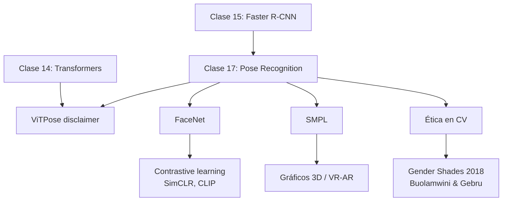

> Esta página desarrolla la matemática y los detalles de implementación que la [Teoría](/clases/clase-17/teoria) presenta a nivel conceptual. Se organiza en cuatro partes: **(I)** heatmap regression y decoding sub-pixel, **(II)** Laplace loss y *learned uncertainty* (PifPaf), **(III)** UV mapping con MDS y la métrica geodésica (DensePose), **(IV)** triplet ranking loss, semi-hard mining y conexión con angular margin losses (FaceNet y sucesores).

---

## Parte I — Heatmap regression

### I.1 Construcción del target

Para una imagen con keypoint $k$ en coordenadas $(x_k, y_k)$ y un heatmap de resolución $H \times W$, el target Gaussiano es:

$$
H_k(i, j) = \exp\!\left( -\frac{(i - x_k)^2 + (j - y_k)^2}{2 \sigma^2} \right)
$$

con $\sigma$ típicamente 2-3 píxeles. Si el keypoint no es visible ($v_k = 0$), el target completo es cero (todo el heatmap a 0).

### I.2 Pérdida

**MSE pixel-wise**:

$$
\mathcal{L} = \frac{1}{N_k H W} \sum_{k=1}^{N_k} \sum_{i=1}^H \sum_{j=1}^W \bigl( \hat H_k(i, j) - H_k(i, j) \bigr)^2
$$

donde $\hat H_k$ es la predicción del modelo. Alternativas:

- **Adaptive Wing Loss** (Wang 2019): pondera más los errores cerca del máximo del heatmap.
- **JSD loss**: trata $H_k$ como distribución y minimiza divergencia.
- **Focal-style heatmap loss** (CenterNet): pondera por dificultad pixel-wise.

### I.3 Decoding base — argmax

La predicción de coordenadas es simplemente:

$$
(\hat x_k, \hat y_k) = \arg\max_{(i, j)} \hat H_k(i, j)
$$

El problema: el output está cuantizado a la resolución del heatmap. Para una imagen 256×192 con heatmap a 64×48, el error de cuantización es **2-4 px** en la imagen original.

### I.4 Refinamiento sub-pixel — DARK (Zhang 2020)

**DARK** (Distribution-Aware coordinate Representation of Keypoint) hace un refinamiento Taylor:

1. Computar argmax discreto $(m_x, m_y)$.
2. Hacer suposición: el heatmap es localmente Gaussiano, $\hat H \sim \mathcal{N}(\mu, \Sigma)$.
3. La verdadera media $\mu$ se estima por expansión de Taylor del logaritmo:

$$
\mu \approx (m_x, m_y) - \mathcal{H}^{-1}_{m} \cdot \nabla \log \hat H |_m
$$

donde $\mathcal{H}_m$ es la Hessiana del log-heatmap en el máximo y $\nabla \log \hat H$ el gradiente. En la práctica se usa una aproximación simple con diferencias finitas:

$$
\hat x_k = m_x + 0.25 \cdot \text{sign}\bigl( \hat H(m_x + 1, m_y) - \hat H(m_x - 1, m_y) \bigr)
$$

(análogo para $y$). Esto solo cuesta 4 evaluaciones extra y agrega **+1.5 AP** en COCO.

### I.5 UDP — Unbiased Data Processing (Huang 2020)

ViTPose usa UDP para post-processing. Corrige sesgos sistemáticos del downsampling (4× en COCO setup), agregando ~+1 AP. Es la receta estándar moderna.

### I.6 Implementación PyTorch

```python
import torch
import torch.nn.functional as F


def generate_heatmaps(joints_xy: torch.Tensor, h: int, w: int,
                      sigma: float = 2.0, visibility: torch.Tensor = None):
    """
    joints_xy : (B, K, 2)  coordenadas en pixeles del heatmap
    visibility: (B, K) o None
    returns   : (B, K, H, W)
    """
    b, k, _ = joints_xy.shape
    yy, xx = torch.meshgrid(torch.arange(h), torch.arange(w),
                             indexing="ij")
    xx = xx.float().to(joints_xy.device)
    yy = yy.float().to(joints_xy.device)
    # broadcast: (B, K, H, W)
    x = joints_xy[..., 0:1].unsqueeze(-1)
    y = joints_xy[..., 1:2].unsqueeze(-1)
    hm = torch.exp(-((xx - x) ** 2 + (yy - y) ** 2) / (2 * sigma ** 2))
    if visibility is not None:
        hm = hm * visibility[..., None, None]
    return hm


def heatmap_loss(pred: torch.Tensor, target: torch.Tensor) -> torch.Tensor:
    return F.mse_loss(pred, target)


def decode_with_dark(heatmaps: torch.Tensor):
    """
    heatmaps: (B, K, H, W)
    returns : (B, K, 2)  coords (x, y) sub-pixel
    """
    b, k, h, w = heatmaps.shape
    flat = heatmaps.view(b, k, -1)
    idx = flat.argmax(dim=-1)
    mx = (idx % w).float()
    my = (idx // w).float()
    # DARK refinement
    px = torch.clamp(mx.long(), 1, w - 2)
    py = torch.clamp(my.long(), 1, h - 2)
    for bi in range(b):
        for ki in range(k):
            dx = heatmaps[bi, ki, py[bi, ki], px[bi, ki] + 1] \
                 - heatmaps[bi, ki, py[bi, ki], px[bi, ki] - 1]
            dy = heatmaps[bi, ki, py[bi, ki] + 1, px[bi, ki]] \
                 - heatmaps[bi, ki, py[bi, ki] - 1, px[bi, ki]]
            mx[bi, ki] += 0.25 * torch.sign(dx)
            my[bi, ki] += 0.25 * torch.sign(dy)
    return torch.stack([mx, my], dim=-1)
```

(La versión vectorizada usa `gather` en vez del doble loop — esto es solo pseudo-código pedagógico.)

---

## Parte II — Laplace loss (PifPaf)

### II.1 De L1 a Laplace — derivación

El $L_1$ vainilla:

$$
\mathcal{L}_{L_1}(x, \mu) = |x - \mu|
$$

trata todos los errores igual. Pero un error de 5 px sobre un cuerpo de 100 px no es lo mismo que sobre uno de 500 px. ¿Cómo agregar **incertidumbre aprendida**?

Asumir que el error se distribuye como una **Laplace** con escala $b > 0$:

$$
p(x \mid \mu, b) = \frac{1}{2b} \exp\!\left( -\frac{|x - \mu|}{b} \right)
$$

Log-verosimilitud negativa:

$$
-\log p(x \mid \mu, b) = \frac{|x - \mu|}{b} + \log(2b)
$$

Esta es la **Laplace loss** de PifPaf (Ec. 2):

$$
\mathcal{L}_{\text{Laplace}} = \frac{|x - \mu|}{b} + \log(2b)
$$

donde $b$ es **predicho por la red** para cada output vectorial. El modelo aprende dinámicamente:

- $b$ pequeño: alta confianza, error pequeño esperado, penalización lineal alta.
- $b$ grande: baja confianza, error grande tolerado, pero $\log(2b)$ pena.

### II.2 Comparación con SmoothL1

La SmoothL1 (Huber con $\delta = 1$):

$$
\mathcal{L}_{\text{SmoothL1}}(x) = \begin{cases} 0.5 x^2 & |x| < 1 \\ |x| - 0.5 & |x| \geq 1 \end{cases}
$$

Robust pero **no aprende incertidumbre**.

PifPaf ablation (Tabla 3):

| Loss | AP | AP^M | AP^L |
|---|---|---|---|
| $L_1$ vanilla | 41.7 | 26.5 | 62.5 |
| SmoothL1 ($r = 0.2\sqrt{A_i}\sigma_k$) | 42.0 | 26.9 | 62.6 |
| **Laplace** | **45.1** | **31.4** | 64.0 |
| **Laplace (b en decoder)** | **45.5** | 31.4 | **64.9** |

**+3.5 AP** solo cambiando el loss. La incertidumbre aprendida es valiosa.

### II.3 Implementación

```python
import torch


def laplace_loss(x_pred: torch.Tensor, x_gt: torch.Tensor,
                 b_pred: torch.Tensor, eps: float = 1e-3):
    """
    x_pred, x_gt: (..., 2)
    b_pred      : (..., 1)
    """
    b = torch.clamp(b_pred, min=eps)
    abs_err = torch.abs(x_pred - x_gt).sum(dim=-1, keepdim=True)
    return (abs_err / b + torch.log(2 * b)).mean()
```

### II.4 Conexión con incertidumbre Bayesiana

La idea de **predecir $b$ junto con $\mu$** es un ejemplo de **aleatoric uncertainty estimation** (Kendall y Gal, 2017). En general para regresión:

$$
\mathcal{L} = \frac{1}{2 \sigma^2(x)} \|y - \mu(x)\|^2 + \frac{1}{2} \log \sigma^2(x)
$$

(versión Gaussiana). La versión Laplace de PifPaf es la **forma robusta** (penaliza menos outliers).

---

## Parte III — UV mapping y geodésicas (DensePose)

### III.1 Multidimensional Scaling — derivación

Dado un conjunto de puntos $X = \{x_1, ..., x_N\}$ en un espacio arbitrario (e.g., vértices de un mesh 3D) con matriz de distancias $D \in \mathbb{R}^{N \times N}$, MDS clásico encuentra una proyección $\{p_i\}_{i=1}^N \subset \mathbb{R}^k$ minimizando:

$$
\text{Stress}(\{p_i\}) = \sum_{i < j} \bigl( \|p_i - p_j\|_2 - d_{ij} \bigr)^2
$$

**Algoritmo (MDS clásico):**

1. Construir $D^{(2)} = (d_{ij}^2)$ — distancias al cuadrado.
2. **Double-centering**: $B = -\frac{1}{2} J D^{(2)} J$ con $J = I - \frac{1}{N} \mathbf{1}\mathbf{1}^\top$.
3. Eigendecomposition: $B = U \Lambda U^\top$.
4. Tomar los $k$ eigenvectores top: $P = U_k \sqrt{\Lambda_k}$.

Los $\{p_i\}$ son las filas de $P$, en $\mathbb{R}^k$ con $k = 2$ para UV map.

### III.2 Distancia geodésica sobre mesh

Para una superficie discreta (mesh triangulado) $\mathcal{M}$ y dos vértices $v_i, v_j \in V(\mathcal{M})$, la **distancia geodésica** $g(v_i, v_j)$ es el largo del camino más corto sobre la superficie.

**Algoritmos**:

1. **Dijkstra sobre aristas** (Mitchell, Mount, Papadimitriou 1987): $O(N \log N + E)$. Sesgo: solo considera rutas sobre aristas, no a través de caras.
2. **Fast Marching** (Sethian 1996, Kimmel & Sethian 1998): $O(N \log N)$. Propaga un frente sobre la superficie.
3. **Heat method** (Crane et al. 2013): $O(N)$ por geodésica una vez precomputado un solve de Poisson. Idea: la solución de la ecuación de calor $\frac{\partial u}{\partial t} = \Delta u$ aproxima la distancia geodésica por el principio de Varadhan:

$$
g^2(v, v') \approx -4t \log u_t(v, v')
$$

para $t \to 0$, donde $u_t$ es el calor difundido desde $v'$ en tiempo $t$.

### III.3 GPS — la métrica de DensePose

$$
\text{GPS}_j = \frac{1}{|P_j|} \sum_{p \in P_j} \exp\!\left( -\frac{g(i_p, \hat i_p)^2}{2 \kappa^2} \right)
$$

con $\kappa = 0.255$ calibrado. Veamos:

- Si $g = 0$ (predicción exacta): $\text{GPS} = 1$.
- Si $g = \kappa \sqrt{2 \ln 2} \approx 0.30 \text{ m}$: $\text{GPS} = 0.5$.
- Si $g = 1 \text{ m}$ (medio cuerpo): $\text{GPS} \approx 0.0005$ — esencialmente cero.

A partir de GPS se computan **AP y AR** a thresholds desde 0.5 (predicción "decente") hasta 0.95 (casi perfecta), análogo a OKS para keypoints.

### III.4 Geodesic Point Similarity ≠ OKS

| Métrica | Distancia | Escala normalizadora |
|---|---|---|
| **OKS** (keypoints) | Euclidiana 2D en imagen | $s \cdot \kappa_k$ (área del bbox × dificultad del keypoint) |
| **GPS** (DensePose) | Geodésica sobre SMPL 3D | $\kappa = 0.255$ m (fija) |

GPS es **independiente de la escala 2D** del cuerpo en imagen — siempre opera sobre la malla 3D estándar. Esto hace comparable la performance entre personas pequeñas y grandes en la imagen.

### III.5 Implementación de unwrapping

```python
import numpy as np
from scipy.spatial.distance import squareform


def classical_mds(geodesic_distances: np.ndarray, k: int = 2):
    """
    geodesic_distances : (N, N) matriz simétrica
    k                  : dimensión de salida (2 para UV)
    returns            : (N, k) coordenadas embebidas
    """
    n = geodesic_distances.shape[0]
    D2 = geodesic_distances ** 2
    J = np.eye(n) - np.ones((n, n)) / n
    B = -0.5 * J @ D2 @ J
    eigvals, eigvecs = np.linalg.eigh(B)
    # ordenar descendente
    idx = np.argsort(-eigvals)
    eigvals = eigvals[idx][:k]
    eigvecs = eigvecs[:, idx][:, :k]
    return eigvecs * np.sqrt(np.maximum(eigvals, 0))


def normalize_uv(coords: np.ndarray) -> np.ndarray:
    """Normaliza coordenadas a [0, 1]^2."""
    mn = coords.min(axis=0)
    mx = coords.max(axis=0)
    return (coords - mn) / (mx - mn + 1e-8)
```

### III.6 Por qué 24 partes y no menos / más

Trade-off:

- **Menos partes** (e.g., 10): cada parte es más grande → MDS distorsiona más (menos planas).
- **Más partes** (e.g., 100): unwrapping perfecto pero costoso de etiquetar y entrenar.

24 es un compromiso empírico: cada parte es aproximadamente plana (distorsión < 10%) y manejable.

---

## Parte IV — Triplet loss y angular margin (FaceNet)

### IV.1 Derivación geométrica del margen

Embeddings $f(x) \in S^{d-1}$ (esfera unitaria). Distancia Euclidiana al cuadrado:

$$
\|f(x^a) - f(x^p)\|_2^2 = 2 - 2 f(x^a)^\top f(x^p) = 2 - 2 \cos \theta_{ap}
$$

donde $\theta_{ap}$ es el ángulo entre $f(x^a)$ y $f(x^p)$. Substituyendo en triplet loss:

$$
\mathcal{L} = \max(0,\ 2 - 2\cos\theta_{ap} - (2 - 2\cos\theta_{an}) + \alpha)
= \max(0,\ 2(\cos\theta_{an} - \cos\theta_{ap}) + \alpha)
$$

El loss cero cuando $\cos\theta_{ap} - \cos\theta_{an} \geq \alpha / 2$, es decir, el coseno al positive es **al menos $\alpha/2$ mayor** que al negative.

### IV.2 Por qué semi-hard mining

Dado que la red al inicio produce embeddings cuasi-random, **la mayoría de los triplets aleatorios son fáciles** (loss ≈ 0). Si solo usamos esos, no hay gradiente para aprender. Pero **hard negatives globales** (los más cercanos al anchor) son a menudo:

1. **Outliers** o **noisy labels** (caras mal etiquetadas).
2. **Casos degenerados** que llevan a colapso: si la red mapea todo a un punto, el "negative más cercano" en distancia es trivialmente cualquier punto.

**Semi-hard mining** (FaceNet) elige negatives que:

$$
\underbrace{\|f(x^a) - f(x^p)\|^2}_{\text{positive ya separado}} < \underbrace{\|f(x^a) - f(x^n)\|^2}_{\text{negative más lejos}} < \underbrace{\|f(x^a) - f(x^p)\|^2 + \alpha}_{\text{pero dentro del margen}}
$$

— negatives "Goldilocks": ni demasiado fáciles (no contribuyen), ni demasiado difíciles (colapsantes).

### IV.3 Implementación con online mining (PyTorch)

```python
import torch
import torch.nn.functional as F


def pairwise_l2_squared(emb: torch.Tensor) -> torch.Tensor:
    """emb: (N, D) -> (N, N) distancias al cuadrado."""
    dot = emb @ emb.t()
    sq = torch.diag(dot)
    return torch.clamp(sq.unsqueeze(0) + sq.unsqueeze(1) - 2 * dot, min=0.0)


def batch_semi_hard_triplet_loss(embeddings: torch.Tensor,
                                  labels: torch.Tensor,
                                  margin: float = 0.2) -> torch.Tensor:
    n = embeddings.shape[0]
    dist = pairwise_l2_squared(embeddings)               # (N, N)
    same = labels.unsqueeze(0) == labels.unsqueeze(1)
    diff = ~same
    diag = ~torch.eye(n, dtype=torch.bool, device=dist.device)
    pos_mask = same & diag                                # parejas (a, p)

    # broadcast: para cada (a, p), buscar el mejor negative semi-hard
    d_an = dist[:, None, :]                               # (N, 1, N)
    d_ap = dist[:, :, None]                                # (N, N, 1)
    semi_hard = diff[:, None, :] & (d_an > d_ap) & (d_an < d_ap + margin)
    INF = torch.finfo(dist.dtype).max
    d_an_masked = torch.where(semi_hard, d_an, torch.full_like(d_an, INF))
    best_d_an = d_an_masked.min(dim=-1).values            # (N, N)

    # cuando no hay semi-hard, fallback al hardest negative
    no_semi = (best_d_an == INF)
    fallback_d_an = torch.where(diff, dist,
                                 torch.full_like(dist, INF)).min(dim=-1).values
    best_d_an = torch.where(no_semi, fallback_d_an.unsqueeze(1).expand_as(best_d_an),
                             best_d_an)

    losses = F.relu(dist - best_d_an + margin)
    losses = torch.masked_select(losses, pos_mask)
    return losses.mean() if losses.numel() > 0 else dist.sum() * 0.0
```

### IV.4 Angular margin losses — la evolución moderna

La triplet loss de FaceNet ha sido superada por **angular margin losses** que operan directamente en el espacio angular de la esfera, sin necesidad de mining costoso:

#### CosFace (Wang 2018)

$$
\mathcal{L}_{\text{CosFace}} = -\log \frac{e^{s(\cos\theta_{y_i} - m)}}{e^{s(\cos\theta_{y_i} - m)} + \sum_{j \neq y_i} e^{s \cos\theta_j}}
$$

con $s = 64$ (radio de la esfera amplificada) y $m = 0.35$ (margen aditivo en coseno).

#### ArcFace (Deng 2019)

$$
\mathcal{L}_{\text{ArcFace}} = -\log \frac{e^{s \cos(\theta_{y_i} + m)}}{e^{s \cos(\theta_{y_i} + m)} + \sum_{j \neq y_i} e^{s \cos\theta_j}}
$$

con $m = 0.5$ rad (margen angular aditivo dentro del coseno).

**Diferencia conceptual**:

| Loss | Margen | Espacio |
|---|---|---|
| FaceNet | Aditivo Euclidiano | Distancias |
| SphereFace | Multiplicativo angular | Ángulos |
| CosFace | Aditivo coseno | Coseno (lineal en $\theta$ pequeño) |
| **ArcFace** | Aditivo angular | Ángulo directo (geodesic en esfera) |

ArcFace tiene la interpretación más limpia geométricamente: el margen $m$ es una **rotación angular fija** entre clases, garantizando separación independiente de la magnitud del embedding.

### IV.5 Cuando elegir triplet vs angular

| Escenario | Mejor opción |
|---|---|
| Pocas identidades de entrenamiento, muchas test (open-set) | Triplet — generaliza mejor a unseen |
| Muchas identidades en entrenamiento (>10K) | ArcFace / CosFace — más rápido y estable |
| Self-supervised, sin labels | **InfoNCE** (SimCLR, MoCo) |
| Re-ID / image retrieval | Triplet batch-hard (Hermans 2017) |

### IV.6 Conexión con InfoNCE

InfoNCE puede verse como una **generalización del triplet a $N$ negativos** simultáneos:

$$
\mathcal{L}_{\text{InfoNCE}} = -\log \frac{\exp(\text{sim}(z, z^+) / \tau)}{\sum_{j=0}^N \exp(\text{sim}(z, z_j) / \tau)}
$$

Equivale a tomar **muchos triplets que comparten el anchor** y optimizar el softmax sobre todos ellos. Ventaja: usa **todos los negatives del batch**, no solo el semi-hard. La temperatura $\tau$ controla la "dureza" sin necesidad de mining explícito.

Ver [Fundamento: Aprendizaje Contrastivo](/fundamentos/aprendizaje-contrastivo) para el desarrollo completo de la era InfoNCE/SimCLR/MoCo/CLIP.

---

## Conexiones con el resto del curso



La Clase 17 conecta con:

- **[Clase 15](/clases/clase-15)** — Faster R-CNN es el sustrato arquitectural directo. DensePose añade una rama; Mask R-CNN keypoints también.
- **Clase 14 (Transformers)** — ViTPose materializa la transición de CNNs a ViTs en pose estimation.
- **[Fundamento: Aprendizaje Contrastivo](/fundamentos/aprendizaje-contrastivo)** — FaceNet es ancestro directo de la era contrastive (SimCLR, MoCo, CLIP).
- **Ética en CV** — la sección final motiva discusiones sobre Gender Shades (Buolamwini & Gebru 2018), Privacy Act, militarización de la visión computacional.

## Recursos relacionados

**Papers de la clase (descarga directa):**

- [DensePose (Güler 2018)](/papers/densepose-guler-2018)
- [PifPaf (Kreiss 2019)](/papers/pifpaf-kreiss-2019)
- [ViTPose (Xu 2022)](/papers/vitpose-xu-2022)
- [FaceNet (Schroff 2015)](/papers/facenet-schroff-2015)
- [SMPL (Loper 2015)](/papers/smpl-loper-2015)

**Fundamentos:**

- [Pose Estimation](/fundamentos/pose-estimation) — keypoints, top-down vs bottom-up, datasets.
- [Dense Correspondence](/fundamentos/dense-correspondence) — UV mapping, MDS, geodésicas.
- [Triplet Loss](/fundamentos/triplet-loss) — metric learning desde FaceNet a ArcFace.
- [Detección de Objetos](/fundamentos/deteccion-de-objetos) — base arquitectural.

**Otros papers relevantes (no en este sitio):**

- *In Defense of the Triplet Loss for Person Re-Identification* (Hermans, Beyer, Leibe 2017) — batch-hard mining.
- *ArcFace* (Deng et al. 2019) — SOTA en face recognition.
- *Geodesics in heat* (Crane, Weischedel, Wardetzky 2013) — algoritmo de geodésica sobre meshes.
- *DARK* (Zhang et al. 2020) — refinamiento sub-pixel para heatmaps.
- *UDP* (Huang et al. 2020) — post-processing imparcial.
