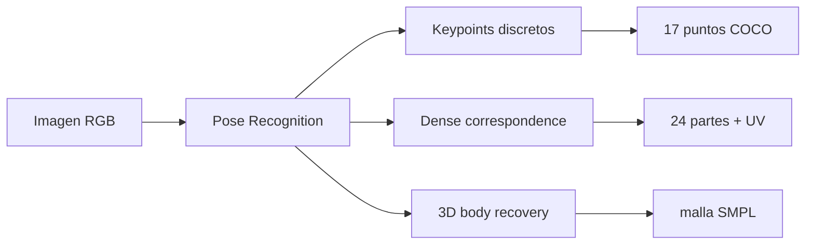
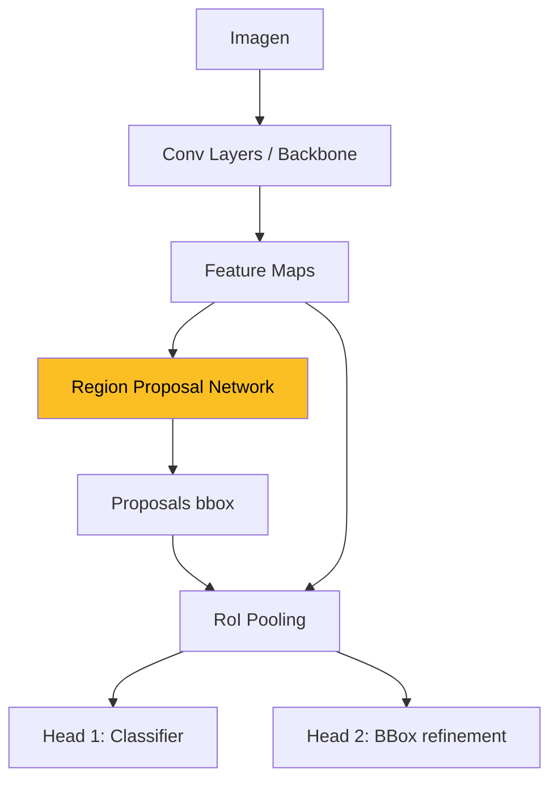
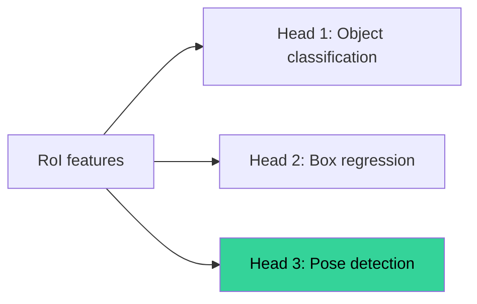
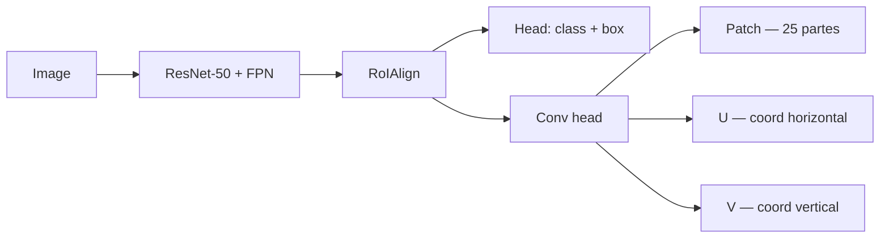
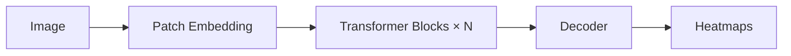
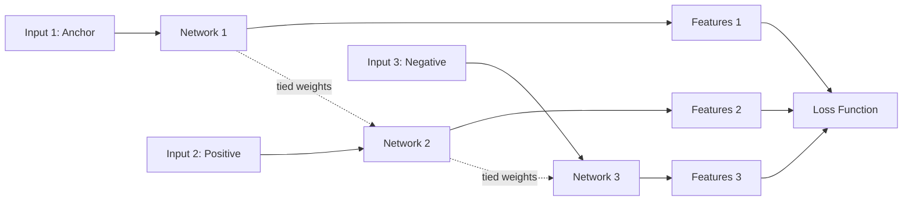
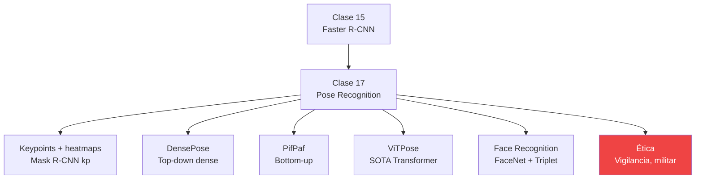

Recorrido conceptual de las 59 diapositivas de la **Clase 17** del profesor Tomás Vergara Browne. La clase se estructura en 6 secciones temáticas — **introducción y motivación**, **recap de Faster R-CNN**, **métodos para pose (top-down con keypoints)**, **DensePose**, **PifPaf y bottom-up**, **disclaimer ViTPose**, **otras aplicaciones (facial recognition)** y **ética**. Esta versión interpreta el material pedagógicamente, no es una transcripción literal del PDF.

---

## 1. Introducción (slides 2-4)

### ¿Qué es pose recognition?

> **Definición operativa**: identificar puntos en una imagen o video que corresponden a partes del cuerpo humano.

Es una **especialización de detección de objetos** donde la "detección" es más fina que un bounding box — necesitamos localizar articulaciones, partes del cuerpo, o incluso la superficie completa.



Tres niveles crecientes de detalle. La Clase 17 cubre los dos primeros (2D); el 3D recovery es referencia.

## 2. Motivación (slides 5-9)

¿Por qué importa? El profesor presenta cinco familias de aplicaciones, con imágenes representativas:

| # | Dominio | Aplicación |
|---|---|---|
| 1 | **Deportes** | Análisis de postura de tenistas, golfistas (Nadal sirviendo, slide 5). |
| 2 | **Salud** | Tracking de progreso en fisioterapia (slide 6). |
| 3 | **Vigilancia** | Detección de **acciones violentas** en CCTV (slide 7). |
| 4 | **VR/AR** | Avatares y juegos con tracking corporal en tiempo real (Iron Man en sala, slide 8). |
| 5 | **Robótica** | Entrenamiento de **robots humanoides** por demostración (Tesla Optimus, slide 9). |


Pose recognition no es un nicho — es la **interfaz natural** entre el mundo digital y el cuerpo humano. Las cinco aplicaciones de arriba abarcan **deporte, salud, seguridad, entretenimiento y robótica** — los grandes mercados de visión por computador.


## 3. Recap de object recognition: Faster R-CNN (slides 11-16)

Antes de poder hacer pose, recordemos cómo funciona [Faster R-CNN](/papers/faster-rcnn-ren-2015) — porque pose se construye encima.



Tres piezas clave:

- **Region Proposal Network (RPN)**: toma los features de la imagen y produce **propuestas de bounding boxes** candidatas a contener objetos.
- **RoI Pooling**: cada propuesta se mapea a un vector de **tamaño fijo** vía pooling (o RoIAlign en variantes modernas — ver [Mask R-CNN](/papers/mask-rcnn-he-2017)).
- **Dos cabezas paralelas**:
  - **Head 1** (Softmax Classifier): clasifica el objeto.
  - **Head 2** (Box regressor): refina las coordenadas del bbox.

### La pregunta clave del profesor (slide 16)

> *"¿Podríamos agregar una **tercera cabeza** para clasificar la pose?"*

Sí — y eso es exactamente lo que hace Mask R-CNN con keypoints y lo que motivará DensePose más adelante.



## 4. Métodos para pose recognition: keypoints + heatmaps (slides 17-25)

### 4.1 La idea de keypoints (slide 18)

Buscamos **puntos específicos del cuerpo humano**: nariz, ojos, hombros, codos, muñecas, caderas, rodillas, tobillos. El estándar **COCO Keypoints** usa **17 puntos** (slide 18 muestra la pose anotada de un tenista).

### 4.2 Cabeza de keypoints (slide 19)

Sobre los features RoI, se agrega un **stack de convoluciones** que produce, para cada uno de los 17 keypoints, un **heatmap** de la posición probable:

```
RoI features  →  Conv block  →  H × W × 17  (un heatmap por keypoint)
```

### 4.3 Heatmaps Gaussianos (slide 20)

Cada heatmap es un **mapa Gaussiano centrado en la articulación real**. Para un keypoint $k$ en ground-truth $(x_k, y_k)$:

$$
H_k(i, j) = \exp\!\left( -\frac{(i - x_k)^2 + (j - y_k)^2}{2 \sigma^2} \right)
$$

Pérdida: **MSE pixel-wise**. Decoding: argmax del heatmap.

**¿Por qué heatmaps en vez de regresar $(x, y)$ directo?**

- Heatmaps mantienen **distribución de probabilidad** — útil para incertidumbre.
- Empíricamente mejor convergencia y mejor AP en COCO.
- Robustos a ambigüedad (puntos parcialmente visibles).

### 4.4 Datos: COCO Keypoint Detection (slide 22)

Subset de COCO con anotación manual de los 17 keypoints — ~200K imágenes, ~250K instancias de persona. Es el benchmark estándar.

### 4.5 ¿Funciona? Resultados cualitativos (slide 24)

El profesor muestra fotos de hockey, skateboarding, golf con poses superpuestas — funciona razonablemente bien para casos sin oclusión severa.

### 4.6 La crítica clave (slide 25)

> *"¿Por qué elegimos estos 17 keypoints? No hay razón particular. Solo pareció una selección razonable."*

Esta arbitrariedad es lo que motivará la siguiente sección — **DensePose**, que parametriza **toda la superficie** del cuerpo.


17 keypoints son una **convención**, no una verdad. Otras opciones (14, 25, 136) son igualmente válidas. La representación discreta es **lossy** y motiva alternativas continuas como dense correspondence.


Ver [Fundamento: Pose Estimation](/fundamentos/pose-estimation) para una discusión completa de la taxonomía y los datasets.

## 5. DensePose (slides 26-36)

[DensePose](/papers/densepose-guler-2018) (Güler, Neverova, Kokkinos, CVPR 2018) es la **alternativa densa**: en vez de 17 puntos, predecir para *cada píxel humano* a qué punto de la superficie 3D corresponde.

### 5.1 La idea (slides 27-28)

Representar el cuerpo como una **superficie** — la malla del modelo [SMPL](/papers/smpl-loper-2015), con 6890 vértices. Cada píxel humano se mapea a uno de esos vértices.


Mucho más rico que keypoints: capta **orientación, deformación, parte específica del cuerpo**.

### 5.2 Arquitectura (slides 29-31)

DensePose-RCNN usa **Faster R-CNN + FPN + RoIAlign** (igual que [Mask R-CNN](/papers/mask-rcnn-he-2017)) con una cabeza adicional:



La red predice **tres outputs por píxel**:

- **Patch**: segmentación en 24 partes del cuerpo + background (25 clases). Equivalente a una rama de clasificación semántica.
- **U**: coordenada horizontal dentro de la parte, $\in [0, 1]$.
- **V**: coordenada vertical dentro de la parte, $\in [0, 1]$.

### 5.3 Las 24 partes (slide 32)

El cuerpo se divide en **24 regiones semánticas**: cabeza, torso (frontal/dorsal), brazos (sup/inf, izq/der, frontal/dorsal), piernas, manos, pies. Cada parte se "desenvuelve" como una lámina 2D — su parametrización UV.

### 5.4 ¿De dónde sale el dato? (slides 33-34)

Pipeline de anotación humana en **dos tasks**:

1. **Body part segmentation**: el anotador delinea las 14 grandes regiones del cuerpo.
2. **Body point correspondence**: para ~14 puntos por parte (sorteados por k-means), se le muestran 6 vistas pre-renderizadas del cuerpo SMPL y elige el correspondiente.

**Volumen**: ~5 millones de correspondencias manuales sobre 50K personas.

### 5.5 SMPL y UV maps (slide 35)

Con la correspondencia humana + el modelo paramétrico **SMPL** (Skinned Multi-Person Linear, Loper et al. 2015), se pueden **generar las imágenes U y V** automáticamente — el dataset resultante se llama **DensePose-COCO**.

Ver [Fundamento: Dense Correspondence](/fundamentos/dense-correspondence) para el desarrollo completo (UV mapping, MDS, geodésicas).

### 5.6 Resultados (slide 36)

DensePose-RCNN entrega resultados muy buenos *in the wild* — figuras 13 del paper muestran personas con vestidos, en grupos, con oclusiones moderadas, todas con correspondencia densa correcta. La métrica clave es **GPS (Geodesic Point Similarity)** — análoga a OKS pero usando distancias geodésicas sobre el mesh SMPL.

## 6. Top-down vs Bottom-up + PifPaf (slides 37-50)

### 6.1 Top-down (slide 37)

Los métodos vistos hasta ahora — Mask R-CNN keypoints, DensePose — son **top-down**:

```
1. Detectar personas (bbox).
2. Para cada bbox: estimar pose (keypoints o densa).
```

### 6.2 Bottom-up (slide 38)

La alternativa: invertir el orden.

```
1. Detectar partes del cuerpo en toda la imagen (sin saber a quién pertenecen).
2. Asociar partes en grupos (= personas).
```

**Ejemplo canónico**: [PifPaf](/papers/pifpaf-kreiss-2019) (Kreiss, Bertoni, Alahi, CVPR 2019).

### 6.3 PifPaf — los dos campos (slides 39-44)

El modelo predice **dos campos** sobre el feature map:

- **PIF (Part Intensity Field)**: localiza partes del cuerpo. Para cada keypoint y posición $(i, j)$, predice **confianza + vector sub-pixel + escala**. Slide 41 muestra heatmap de "left shoulder" con picos en cada hombro izquierdo de la imagen.

- **PAF (Part Association Field)**: **asocia** partes para formar limbs (extremidades). Para cada conexión esquelética $(k_1, k_2)$ y posición, predice **confianza + dos vectores + dos spreads Laplace**. Slide 44 muestra la conexión left-shoulder → left-hip.

Pseudo-código del decoding:

```python
# 1. Seeds: top-confidence keypoints
seeds = top_k(pif_confidence_map)

# 2. Crecimiento greedy por el esqueleto
for seed in seeds:
    pose = {seed}
    frontier = [seed]
    while frontier:
        kp = frontier.pop()
        for connection in connections_touching(kp):
            partner = follow_paf(connection, kp)
            if reverse_consistent(partner, kp):
                pose.add(partner)
                frontier.append(partner)
```

### 6.4 Resultados (slide 46)

PifPaf brilla en escenas urbanas multitudinarias — slide 46 muestra una calle con decenas de ciclistas y peatones, todos con pose detectada correctamente.

### 6.5 Top-down vs Bottom-up — comparación (slide 47)

| | Top-down | Bottom-up |
|---|---|---|
| Ejemplo | DensePose | PifPaf |
| Estrategia | Detectar personas → pose dentro | Detectar partes → asociar |

### 6.6 ¿Por qué Bottom-up > Top-down? (slides 48)

Dos escenarios donde top-down falla y bottom-up gana:

1. **Oclusiones**: el baseball player con el guante tapándole el brazo — el detector top-down puede fallar en detectar a la persona; el bottom-up detecta los keypoints visibles igual.

2. **Bounding boxes intersectados**: dos jugadores muy cerca → dos bboxes que contienen ambos cuerpos. El estimador top-down dentro de cada bbox se confunde.

### 6.7 ¿Por qué Top-down > Bottom-up? (slide 49)

El **escenario del bouldering nocturno**: persona escalando una roca con muy poca iluminación. El top-down puede usar **mayor contexto** (la escena entera + el detector ve "esto parece un humano por la silueta") para decidir, mientras bottom-up trabajaría keypoint a keypoint sin contexto suficiente.

### 6.8 ¿Cuál es mejor? (slide 50)

> *"Neither. Both have pros and cons."*

Las dos familias coexisten en producción. La elección depende del dominio:
- Top-down: deportes individuales, retratos, escenas controladas.
- Bottom-up: crowds, self-driving, escenarios con oclusión sistemática.

Ver [Fundamento: Pose Estimation](/fundamentos/pose-estimation) para una comparación cuantitativa.

## 7. Disclaimer: Vision Transformers son el SOTA (slides 51-52)

> *"A little detail that is missing is that the state of the art in object detection is done with **Vision Transformers** instead of CNNs. But the principles are the same."*

El profesor recomienda explícitamente **[ViTPose](/papers/vitpose-xu-2022)** (Xu et al., NeurIPS 2022):



**Lo notable**:

- ViT plain (sin trucos arquitecturales) como backbone.
- Decoder lightweight (2 deconvs, o incluso 1 bilinear + 1 conv).
- **SOTA en MS COCO** (80.9 AP con ViTPose-G de 1B parámetros).
- Demuestra que **los conceptos siguen siendo válidos** — heatmaps, top-down, keypoints — solo cambia el backbone.

El profesor comenta con humor que ViTPose es "un approach muy ingenuo" para usar ViT — pero **igual gana SOTA**.

## 8. Otras aplicaciones (slides 53-56)

Es común **mezclar pose recognition con otras técnicas**:

### 8.1 Object tracking + acciones (slide 53)

Trackear las partes del cuerpo a través del tiempo en un video → reconocer **acciones**. Es la base de:
- **Video action recognition** (UCF-101, Kinetics-400).
- **Sports analytics** (Hawk-Eye, TrackMan).
- **Surveillance video analytics**.

### 8.2 Facial recognition (slides 54-56)

> *"How would you train a model to detect if two pictures of people are the same person or not?"*

Respuesta del profesor: **triplet network**.

### Triplet network (slide 55)



Tres copias de la misma red (tied weights). Tres entradas: anchor, positive (misma persona), negative (otra persona).

### Triplet ranking loss

$$
L(f(I_1), f(I_2), f(I_3)) := \max\!\left\{0,\ m - \|f(I_1) - f(I_3)\| + \|f(I_1) - f(I_2)\|\right\}
$$

El **anchor** ($I_1$) debe estar **más cerca del positive** ($I_2$) que del **negative** ($I_3$), con un margen $m$.

### FaceNet (slide 56)

[FaceNet](/papers/facenet-schroff-2015) (Schroff, Kalenichenko, Philbin, Google 2015) fue el primer paper que llevó esta idea a producción:

- Embedding de 128 dimensiones.
- Triplet loss con **online semi-hard negative mining**.
- Resultado: **~60% → >95% accuracy** en benchmarks de face recognition.

Ver [Fundamento: Triplet Loss](/fundamentos/triplet-loss) para el desarrollo completo (mining strategies, angular margin losses, conexión con SimCLR/MoCo).

## 9. Ética (slides 57-58)

> *"It is very important to always be aware of ethical concerns when using machine learning to detect humans."*

El profesor cierra con tres preocupaciones explícitas:

### 9.1 Privacidad

¿Han dado las personas su consentimiento para ser grabadas y trackeadas? La mayoría de modelos de pose se entrenan con datos web sin consentimiento informado.

### 9.2 Vigilancia masiva

¿Cuándo es demasiado? ¿Queremos que nuestros cuerpos sean rastreados continuamente?

China usa pose recognition + face recognition para puntuar conducta ciudadana. Estados Unidos lo usa en investigaciones policiales. Los modelos open-source (PifPaf, ViTPose) habilitan esto a costo cero.

### 9.3 Aplicaciones militares

> *"I am especially worried about the applications in military nowadays."*

El profesor cita un paper específico — **"Pose-Based Identification Using Deep Learning for Military Surveillance Systems"** (Asota, Huynh-The, Lee, Kim) — y lo critica:

> *"The conclusion of the paper goes as: 'The paper proposed a military surveillance system that is built to prevent future attacks by identifying people without the need of their cooperation [...]'"*

> *"**The word 'ethics' does not appear once in the paper.**"*

Esto último es el cierre conceptual de la clase. El mismo toolkit (pose, face, embeddings) puede usarse para:
- Entrenar humanoides Tesla (slide 9).
- Hacer try-on virtual de ropa.
- O construir sistemas de identificación militar sin consentimiento.

La diferencia no es técnica — es **una decisión de diseño y deployment**.


**Capacidad técnica ≠ legitimidad de uso.** El pose recognition es **dual-use**: deportes y salud, sí; vigilancia masiva y armas autónomas, no. La responsabilidad ética del ingeniero es **distinguir y rechazar** los segundos.


## 10. Resumen y conexiones



La Clase 17 es un **viaje a través de los paradigmas de pose recognition**:
1. **Keypoints discretos** (la convención COCO de 17 puntos).
2. **Dense correspondence** (DensePose: superficie completa con UV maps).
3. **Top-down vs Bottom-up** (DensePose vs PifPaf — coexisten, hay pros/cons).
4. **Transformer era** (ViTPose: SOTA con simplicidad).
5. **Técnicas hermanas** (Face recognition + Triplet networks).
6. **Ética** (la cuestión que define el deployment responsable).

Para profundizar en la matemática (heatmap regression, Laplace loss, UV computation, triplet semi-hard mining), ver [Profundización](/clases/clase-17/profundizacion).
