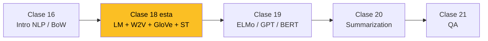

## 1. Mapa del modulo

Esta es la **segunda clase de un bloque de NLP** dentro del diplomado. La trayectoria del bloque:

1. **Clase 16**: Introduccion -- que es NLP, ley de Zipf, BoW, tokenizacion, herramientas.
2. **Clase 18 (esta)**: Modelos de lenguaje, Word2Vec, GloVe, SkipThought.
3. **Clase 19**: Modelos contextuales -- ELMo, GPT, BERT.
4. **Clase 20**: Generacion de resumenes (summarization).
5. **Clase 21**: Question Answering (QA).



La clase se organiza en **tres secciones** (slide 4):

1. **Modelos de Lenguaje (LM)** -- que son, para que sirven, n-gramas.
2. **Representaciones Discretas v/s Continuas (Distribuidas)** -- los dos paradigmas.
3. **Ejemplos concretos** -- Word2Vec, GloVe, SkipThought.

---

## 2. Modelos de Lenguaje

### 2.1 Que es un LM (slide 6)

Un **modelo de lenguaje** asigna probabilidad a secuencias de palabras:

$$P : V^* \to [0, 1]$$

Ejemplos del slide:

```
P(Hola) = 0.1
P(Hola, como estas?) = 0.05
P(Que bonito esta el dia) = 0.02
P(Se me atrofio el esternocleidooccipitomastoideo) = 0.00001
P(supernova flor barroco saltar hola chao) = 0.00000000001
```

**Observacion**: ciertas secuencias son mas probables que otras. La gramatica + semantica emerge como propiedad estadistica del corpus, no como reglas explicitas.

### 2.2 Probabilidad condicional (slide 7)

$$P(A \mid B) = \frac{P(A \cap B)}{P(B)}$$

El contexto **altera** la distribucion. Ejemplos del paper:
- $P(\text{perro}) = 0.01$ -- sin contexto.
- $P(\text{perro} \mid \text{un}) = 0.03$ -- contexto bigrama.
- $P(\text{perro} \mid \text{mordio un}) = 0.05$.
- $P(\text{perro} \mid \text{Me mordio un}) = 0.1$ -- mas contexto, mas probable.

### 2.3 Regla de la cadena (slide 8)

$$P(ABCD) = P(D \mid ABC) \cdot P(C \mid AB) \cdot P(B \mid A) \cdot P(A)$$

**Implicacion central**: para modelar la distribucion conjunta $P(w_{1:T})$ basta parametrizar **una unica funcion condicional** $P(w_t \mid w_{<t})$. Esta es la formulacion compartida por todos los LMs desde n-gramas hasta GPT-4.

Ejemplo:

$$P(\text{hola como estas}) = P(\text{hola}) \cdot P(\text{como} \mid \text{hola}) \cdot P(\text{estas} \mid \text{hola como})$$

### 2.4 Aplicaciones (slides 9-11)

**Generacion (NLG)** -- decoding greedy:

```
Texto inicial: X
w_0 = argmax P(w | X)
w_1 = argmax P(w | X w_0)
w_2 = argmax P(w | X w_0 w_1)
...
Texto final: X w_0 w_1 w_2 ...
```

**Machine Translation**: el LM condicional $P(Y \mid X)$ donde $X$ es source y $Y$ target. Misma estrategia greedy pero condicionada.

**Otras aplicaciones**:

- Spelling correction.
- Document summarization.
- Question answering.
- Sentence completion.
- Speech recognition.
- Information retrieval.
- Code completion.

Todas son variaciones del mismo objetivo: parametrizar $P(w_t \mid \text{contexto})$.

### 2.5 N-gramas (slide 12)

Aproximacion Markoviana: truncar el contexto a las ultimas $N$ palabras.

- $N = 0$: unigrama -- $P(w_0 w_1 w_2 w_3) = P(w_0) P(w_1) P(w_2) P(w_3)$.
- $N = 1$: bigrama -- $P(w_3) \to P(w_3 \mid w_2)$.
- $N = 2$: trigrama -- $P(w_3) \to P(w_3 \mid w_1 w_2)$.
- $N = 3$: 4-grama.

**Trade-off**: acotar el contexto reduce costo pero pierde informacion.


**Detalle de notacion**: el slide usa "$N$ palabras de contexto", no "tamano del $n$-grama" (la convencion estandar). Un trigrama tiene $n = 3$ tokens = 2 de contexto + 1 target. El slide llamaria a esto "$N = 2$".


Ver derivaciones de MLE, suavizado Kneser-Ney y perplejidad en [profundizacion.md](./profundizacion).

---

## 3. Representaciones Discretas vs Continuas

### 3.1 El problema dual (slide 14)

Construir un LM exige resolver **dos cosas**:

1. Como **representar las palabras**.
2. Como **calcular la probabilidad $P$**.

Dos paradigmas:

| | Discreto | Continuo (Machine Learning) |
|---|---|---|
| **Representacion** | IDs | Vectores distribuidos en $\mathbb{R}^m$ (word embeddings) |
| **Calculo de $P$** | Conteos de n-gramas + suavizado | Red neuronal (pesos aprendidos) |
| **Aprendizaje** | Estadisticas + heuristicas | Backpropagation end-to-end |

### 3.2 Representaciones discretas en accion (slides 15-19)

Para `P(the cat sat on the mat)` con contextos 1-grama (bigramas):

$$P(\text{the cat sat on the mat}) = P(\text{the}) \cdot P(\text{cat} \mid \text{the}) \cdot P(\text{sat} \mid \text{cat}) \cdot P(\text{on} \mid \text{sat}) \cdot P(\text{the} \mid \text{on}) \cdot P(\text{mat} \mid \text{the})$$

**Calculo por conteos**:

$$P(X \mid C) = \frac{\text{count\_in\_corpus}(C X)}{\text{count\_in\_corpus}(C)}$$

Ejemplo trabajado del slide 19 con corpus de 3 oraciones:

```
S1: the cat sat on the mat
S2: the dog sat on the cat
S3: the cat caught the mouse
```

$V = \{\text{the, cat, sat, on, mat, dog, caught, mouse}\}$.

$$P(\text{cat} \mid \text{the}) = \frac{\text{count}(\text{the cat})}{\text{count}(\text{the})} = \frac{3}{6} = 0.5$$

### 3.3 Limitaciones de representaciones discretas (slide 20)

1. **Palabras = IDs**: sin similitud semantica. "perro" y "gato" son tan distantes como "perro" y "supernova".
2. **N pequeno**: n-gramas con $n > 5$ son demasiado infrecuentes -> probabilidades cero o no estimables.
3. **No generaliza**: combinaciones nunca vistas reciben probabilidad cero.

Ver suavizado Laplace, Katz backoff y Kneser-Ney en [profundizacion.md](./profundizacion) -- mitigan parcialmente la limitacion 2 pero no la 1.

### 3.4 Representaciones continuas (distribuidas) (slide 21)

A.k.a. **Neural Probabilistic Language Models** -- la propuesta de [Bengio 2003 NPLM](/papers/nplm-bengio-2003).

**Dos objetivos**:
1. Aprender una representacion continua distribuida para cada palabra -> **word embedding**.
2. Aprender los pesos de una red neuronal que prediga $P(w \mid h(w))$.

Arquitectura:

```mermaid
graph LR
    W1[w_{t-n+1}] --> EMB[Word Embedding<br/>matriz C]
    Wdots[...] --> EMB
    Wn[w_{t-1}] --> EMB
    EMB --> FF[Feedforward NN]
    FF --> P1[P(w_1 | h)]
    FF --> Pdots[...]
    FF --> PV[P(w_V | h)]
    
    style EMB fill:#fbbf24,color:#000
```

La matriz $C \in \mathbb{R}^{|V| \times m}$ es **compartida** entre todas las posiciones del contexto -- aprende un embedding por palabra. La red neuronal predice la siguiente palabra con softmax sobre $|V|$.

### 3.5 RNN como alternativa (slide 22)

El feedforward no es obligatorio. Una **RNN** puede codificar contexto ilimitado en un estado oculto recurrente:

```
context_vector(t) = f(input(t), context_vector(t-1))
output(t) = g(context_vector(t))
```

Esta es la arquitectura de [Mikolov 2010 RNN-LM](/papers/rnn-lm-mikolov-2010) -- el antecesor directo de Word2Vec.

### 3.6 Transformer multimodal (slide 23)

El slide muestra como ejemplo avanzado un **Transformer multimodal clinico** (`cxrmate-rrg24` de Hugging Face) -- predice texto de reporte radiologico dado imagenes de radiografias. Demuestra que la misma idea -- LM neural -- se generaliza a multimodalidad. Conexion con el lab clinico que acompana esta clase.

### 3.7 Ventajas de embeddings densos (slides 24-28)

#### Ventaja 1: cercania semantica (slide 24)

Palabras que aparecen en contextos similares adquieren representaciones similares (sus vectores quedan cerca).

Ejemplo del slide: en un scatter 2D, `food`, `delicious chicken`, `kitchen` aparecen juntos; `music`, `saxophone`, `piano` forman otro cluster; `linux`, `screen`, otro.

#### Ventaja 2: composicionalidad aditiva (slides 25-26)

Los embeddings se distribuyen tal que **operaciones algebraicas producen analogias**:

$$\mathbf{v}_{\text{Beijing}} - \mathbf{v}_{\text{China}} + \mathbf{v}_{\text{Russia}} \approx \mathbf{v}_{\text{Moscow}}$$

$$\mathbf{v}_{\text{King}} - \mathbf{v}_{\text{Man}} + \mathbf{v}_{\text{Woman}} \approx \mathbf{v}_{\text{Queen}}$$

PCA plot de capitales y paises muestra que `pais → capital` es **una traslacion constante** en el espacio.

**Lecturas recomendadas** (slide 26):

- [Allen & Hospedales 2019 - "Analogies Explained"](/papers/analogies-explained-allen-hospedales-2019) -- prueba rigurosa.
- ["Analogies Explained" Explained](https://carl-allen.github.io/nlp/2019/07/01/explaining-analogies-explained.html) -- blog post.
- ["Contrastive Loss is All You Need to Recover Analogies as Parallel Lines"](https://arxiv.org/abs/2306.08221) -- extension 2023.

#### Ventaja 3: mayor generalizacion (slide 27)

Si el modelo aprende "Me gusta comer naranjas de postre" y sabe que `naranja ≈ manzana` (vectores cercanos), entonces tambien asigna alta probabilidad a "Me gusta comer manzanas de postre" -- aunque nunca lo haya visto.

Es el **soft sharing** que un n-grama puro no puede hacer.

#### Otras ventajas (slide 28)

- Se aprende todo automaticamente (machine learning).
- **Entrenamiento autosupervisado** -- sin etiquetas.
- No hay que contar cada n-grama posible.
- No limitado a n-gramas (RNNs capturan contexto ilimitado).

---

## 4. Ejemplos concretos -- Word2Vec, GloVe, Skip-Thought

### 4.1 Word2Vec (slides 31-34)

Propuesto por [Mikolov et al. 2013](/papers/word2vec-efficient-mikolov-2013). Idea clave: **abandonar el LM completo** y solo aprender embeddings. "Modelos simples pueden escalar a datasets mas grandes" -- feature learning.

Dos algoritmos:

#### CBoW -- Continuous Bag-of-Words (slide 33)

Predecir la palabra del medio dado el contexto.

$$\mathbf{h} = \sum_{w_i \in h(w_t)} C w_i$$

$$P(w^j \mid h(w_t)) = \frac{e^{y(w^j)}}{\sum_{w'} e^{y(w')}}$$

Donde $C \in \mathbb{R}^{|V| \times m}$ es la matriz input y $H \in \mathbb{R}^{m \times |V|}$ es la output.

#### Skip-gram (slide 34)

Predecir el contexto dada la palabra del medio.

$$P(w^{k \in h(w_t)} \mid w_t) = \frac{e^{s(w_k, w_t)}}{\sum_{w'_k} e^{s(w'_k, w_t)}}$$

con $s(w_k, w_t) = \mathbf{w}_k^T \mathbf{w}_t$ (producto punto).

Ver detalles de negative sampling, subsampling, hierarchical softmax y phrase embeddings en [profundizacion.md](./profundizacion) y en el [fundamento Word2Vec](/fundamentos/word2vec).

### 4.2 GloVe (slides 35-36)

Propuesto por [Pennington, Socher, Manning 2014](/papers/glove-pennington-2014). Similar a Word2Vec en filosofia (no modela LM, solo embeddings), pero usa **estadistica global** del corpus.

**Idea**: aprender embeddings cuyo **producto punto aproxime el log de la co-ocurrencia empirica**:

$$\boxed{J = \sum_{i,j=1}^{V} f(X_{ij}) \left( \mathbf{w}_i^T \tilde{\mathbf{w}}_j + b_i + \tilde{b}_j - \log X_{ij} \right)^2}$$

donde $X_{ij}$ es el conteo de co-ocurrencia entre palabras $i$ y $j$, y $f$ es una funcion de peso.

Embeddings preentrenados famosos: `glove.6B`, `glove.840B.300d` (descargables en https://nlp.stanford.edu/projects/glove/).

Ver derivacion completa y comparacion con W2V en [profundizacion.md](./profundizacion) y en el [fundamento GloVe](/fundamentos/glove).

### 4.3 Skip-Thought Vectors (slides 37-40)

Propuesto por [Kiros et al. 2015](/papers/skip-thought-kiros-2015). **Generaliza Skip-gram al nivel de oracion**:

- Dada la oracion del medio $s_i$, predecir la oracion anterior $s_{i-1}$ y la siguiente $s_{i+1}$.
- **Encoder GRU** procesa $s_i$ -> sentence embedding $\mathbf{h}_i$.
- **Dos decoders GRU condicionales** generan $s_{i-1}$ y $s_{i+1}$.

```mermaid
graph LR
    S[I could see the cat on the steps] --> ENC[Encoder GRU]
    ENC --> H[h_i]
    H --> DEC1[Decoder GRU]
    H --> DEC2[Decoder GRU]
    DEC1 --> SPREV[s_{i-1}: this was strange]
    DEC2 --> SNEXT[s_{i+1}: I got back home]

    style H fill:#fbbf24,color:#000
```

Una vez entrenado, el encoder produce **sentence embeddings** utiles para tareas downstream:

- **Semantic relatedness** (SICK dataset): $r = 0.86$ con humanos.
- **Paraphrase detection** (MSR Corpus).
- **Clasificacion de oraciones**: sentiment, sujetividad, opinion, tipo de pregunta.

Slide 40 muestra ejemplos cualitativos -- oraciones semanticamente cercanas se mapean a vectores cercanos.

Ver conditional GRU, vocabulary expansion, BookCorpus stats en [profundizacion.md](./profundizacion) y en el [fundamento Skip-Thought](/fundamentos/skip-thought).

---

## 5. Sintesis -- las tres ideas centrales

```mermaid
graph TD
    LM[1. LM probabilistico<br/>P(w_t | w_{<t})] --> DUAL[2. Problema dual:<br/>como representar + como calcular P]
    DUAL --> DISC[Approach discreto:<br/>IDs + conteos n-gramas]
    DUAL --> CONT[Approach continuo:<br/>embeddings + redes neuronales]
    CONT --> W2V[Word2Vec 2013<br/>Skip-gram + neg sampling]
    CONT --> GLV[GloVe 2014<br/>log-co-ocurrencia global]
    CONT --> ST[Skip-Thought 2015<br/>sentence embeddings]

    style LM fill:#fbbf24,color:#000
    style CONT fill:#fbbf24,color:#000
```

1. **El LM probabilistico** es el objeto matematico unificador de NLP.
2. La transicion **discreto -> continuo** es el paradigma central; embeddings densos resuelven las tres limitaciones de n-gramas.
3. **Word2Vec, GloVe y Skip-Thought** son tres instanciaciones distintas del mismo principio: aprender embeddings que capturen co-ocurrencia / similitud distribucional.

---

## 6. Que viene en Clase 19

Los embeddings de esta clase son **no contextuales** -- "banco" tiene un solo vector independiente de "banco de peces" o "banco financiero". La Clase 19 introduce **embeddings contextuales**:

- **ELMo** (2018): biLSTM-LM, vectores que cambian con el contexto.
- **GPT** (2018): Transformer-LM unidireccional.
- **BERT** (2018): Transformer-LM bidireccional con masked LM.

La cadena Word2Vec -> ELMo -> BERT es la **historia central de NLP entre 2013 y 2018**.

---

## Referencias

- Slides oficiales: `Clase18.pdf` (Pablo Messina, IA Lab + CENIA, 41 slides).
- Papers principales: ver cards en [_index.md](.).
- Apendices matematicos: [profundizacion.md](./profundizacion).
