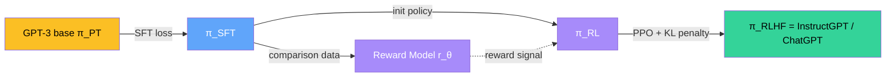

> Esta página complementa la [teoría de la clase 20](/clases/clase-20/teoria) con derivaciones formales. Tres bloques: **Parte I** revisita la máscara de atención que separa BERT de GPT y deriva el biLM de ELMo. **Parte II** formaliza Masked Language Modeling y Next Sentence Prediction. **Parte III** desmonta el pipeline RLHF — el Reward Model con Bradley-Terry, la penalización KL y la versión PPO-ptx.

---

## Parte I — biLM (ELMo) y la máscara de atención (BERT vs GPT)

### I.1 Forward LM autoregresivo

Sea $T = (t_1, t_2, \ldots, t_N)$ una secuencia de tokens. La factorización clásica de su probabilidad es la regla de la cadena:

$$
p(T) = \prod_{k=1}^{N} p(t_k \mid t_1, \ldots, t_{k-1})
$$

Es un **forward LM**: cada token se condiciona en los tokens previos. Esta es la base de GPT-1, GPT-2 y GPT-3 — y se entrena minimizando la **negative log-likelihood (NLL)** de un corpus $\mathcal{U}$:

$$
\mathcal{L}_{\text{fLM}}(\Theta) = - \sum_{T \in \mathcal{U}} \sum_{k=1}^{N} \log p(t_k \mid t_{<k}; \Theta)
$$

En un Transformer decoder-only, $p(t_k \mid t_{<k})$ se calcula con una **máscara causal** dentro del bloque de self-attention. Si $Q, K, V \in \mathbb{R}^{N \times d}$ son las proyecciones de los embeddings, las attention scores brutas son:

$$
S = \frac{Q K^\top}{\sqrt{d_k}} \in \mathbb{R}^{N \times N}
$$

La máscara causal sustituye con $-\infty$ todas las entradas $S_{ij}$ con $j > i$ (mirar hacia el futuro). Tras softmax, esas posiciones tienen peso 0:

$$
\text{Attention}(Q, K, V) = \text{softmax}\!\left( S + M_{\text{causal}} \right) V
\qquad
M_{ij} = \begin{cases} 0 & j \leq i \\ -\infty & j > i \end{cases}
$$

Esta es la diferencia técnica entre **BERT y GPT**: BERT entrena sin máscara causal (atención bidireccional), GPT entrena con máscara causal estricta. La distinción es una sola línea de código.

### I.2 Backward LM y su simetría

Por simetría, el **backward LM** factoriza con la regla de la cadena al revés:

$$
p(T) = \prod_{k=1}^{N} p(t_k \mid t_{k+1}, t_{k+2}, \ldots, t_N)
$$

Equivalente a entrenar un Transformer con **máscara causal invertida**: cada token solo ve los tokens posteriores. En ELMo no se usa Transformer sino una LSTM corrida de derecha a izquierda — mismo principio matemático.

### I.3 La loss conjunta de ELMo

ELMo entrena ambos modelos **simultáneamente** maximizando la log-likelihood conjunta:

$$
\mathcal{L}_{\text{biLM}} = \sum_{k=1}^{N} \Big[
    \log p(t_k \mid t_1, \ldots, t_{k-1}; \Theta_x, \overrightarrow{\Theta}_{\text{LSTM}}, \Theta_s) \\
    + \log p(t_k \mid t_{k+1}, \ldots, t_N; \Theta_x, \overleftarrow{\Theta}_{\text{LSTM}}, \Theta_s)
\Big]
$$

Donde:
- $\Theta_x$ — pesos del embedding de entrada (char-CNN). **Compartidos** entre forward y backward.
- $\Theta_s$ — pesos de la softmax de salida. **Compartidos**.
- $\overrightarrow{\Theta}_{\text{LSTM}}, \overleftarrow{\Theta}_{\text{LSTM}}$ — pesos de las LSTM **independientes** en cada dirección.


La **bidireccionalidad shallow** de ELMo se ve aquí explícitamente: la suma de dos términos. El forward LM **nunca observa** las activaciones del backward LM durante el entrenamiento. Solo en la combinación final task-specific (etapa 4) se mezclan los vectores. Esto es lo que BERT corrige con MLM, descrito en la Parte II.


### I.4 La combinación lineal task-specific

ELMo produce $L+1 = 3$ representaciones por token (la entrada $x_k$ más 2 capas BiLSTM). Apilemos:

$$
R_k = \big\{ x_k, \; h_{1,k}, \; h_{2,k} \big\}
\qquad \text{con} \qquad h_{j,k} = \big[ \overrightarrow{h}_{j,k}; \overleftarrow{h}_{j,k} \big]
$$

donde $[\cdot;\cdot]$ es concatenación. Cada $h_{j,k} \in \mathbb{R}^{2d}$ (concatenación de las direcciones).

Para una tarea downstream:

$$
\text{ELMo}_k^{\text{task}} = \gamma^{\text{task}} \cdot \sum_{j=0}^{L} s_j^{\text{task}} \cdot R_{j,k}
$$

con la restricción $\sum_{j=0}^{L} s_j^{\text{task}} = 1$ implementada por softmax sobre logits $\tilde{s}_j$:

$$
s_j = \frac{\exp(\tilde{s}_j)}{\sum_{j'} \exp(\tilde{s}_{j'})}
$$

Tres parámetros aprendibles por tarea: $\{\tilde{s}_0, \tilde{s}_1, \tilde{s}_2\}$ y $\gamma$. **Mínima carga de fine-tuning**: 4 parámetros por tarea, vs los millones de un BERT fine-tuneado.

### I.5 Posición vs profundidad

Resumen visual de los tres mecanismos arquitectónicos que aparecen en la clase:

| Modelo | Tipo de atención | Profundidad | Bidireccionalidad |
|---|---|---|---|
| **ELMo (biLM)** | LSTM (recurrente) | 2 capas | Shallow (suma de 2 LMs separados) |
| **BERT** | Self-attention sin máscara | 12-24 capas | Deep (joint, en cada capa) |
| **GPT** | Self-attention con máscara causal | 12-96 capas | Unidireccional (solo izquierda) |

La columna que más cambió la calidad fue **bidireccionalidad joint**: BERT en SQuAD subió de 81 a 93 F1 vs GPT-1 (mismo tamaño 110-117M parámetros).

---

## Parte II — Masked Language Modeling y Next Sentence Prediction

### II.1 La trampa del LM bidireccional ingenuo

Supongamos que intentamos definir un LM "bidireccional" como:

$$
p(t_k \mid T_{\setminus k}) \quad \text{con} \quad T_{\setminus k} = (t_1, \ldots, t_{k-1}, t_{k+1}, \ldots, t_N)
$$

Si entrenamos un Transformer encoder (sin máscara causal) sobre este objetivo con todos los tokens visibles, **la información de $t_k$ se filtra a través de las capas**: el token en posición $k$ atiende a sí mismo en cada capa, y otros tokens también atienden a él. Las representaciones internas tienen acceso indirecto a $t_k$, así que predecir $t_k$ desde su propia activación se vuelve trivial.

Devlin et al. resuelven esto **literalmente borrando el token de la entrada**.

### II.2 Masked Language Model

Sea $M \subset \{1, \ldots, N\}$ el conjunto de posiciones enmascaradas (típicamente $|M| = 0.15 N$). Definimos $\tilde{T}$ como $T$ con las posiciones de $M$ reemplazadas según la regla 80/10/10:

$$
\tilde{t}_k = \begin{cases}
\texttt{[MASK]} & \text{con prob. } 0.80 \\
\text{random token } u \in V & \text{con prob. } 0.10 \\
t_k & \text{con prob. } 0.10
\end{cases}
\qquad k \in M
$$

La **loss MLM** es cross-entropy solo sobre las posiciones enmascaradas:

$$
\mathcal{L}_{\text{MLM}}(\Theta) = - \sum_{k \in M} \log p_\Theta(t_k \mid \tilde{T})
$$

Donde $p_\Theta(\cdot \mid \tilde{T})$ se obtiene aplicando el Transformer encoder a $\tilde{T}$, leyendo la activación final en la posición $k$ y proyectándola a logits sobre el vocabulario.

#### Por qué 80/10/10

- **80% [MASK]**: la mayor parte del tiempo, el modelo debe rellenar un hueco explícito. Esto entrena la capacidad central — usar bidireccionalidad para inferir.
- **10% random**: previene que el modelo aprenda "si veo [MASK] predigo, si no veo [MASK] no". Lo fuerza a mantener representaciones útiles **para todos** los tokens, no solo los enmascarados.
- **10% unchanged**: bias hacia preservar el token original cuando es correcto. Reduce el train-test mismatch (en inferencia no hay tokens `[MASK]`).


**Equivalencia con loss_masking**: matemáticamente, MLM es cross-entropy estándar con `ignore_index=-100` en PyTorch para las posiciones $k \notin M$. Las posiciones no enmascaradas no contribuyen al gradiente. Esto es idéntico al **loss masking** que se usa en SFT (cap 24 de [`/fundamentos/loss-masking`](/fundamentos/loss-masking)): el mecanismo de "penalizar solo ciertos tokens" es el mismo, aunque conceptualmente uno entrena bidireccionalidad y el otro entrena seguimiento de instrucciones.


### II.3 Next Sentence Prediction

Para cada par $(A, B)$ se construye una etiqueta binaria $y \in \{\text{IsNext}, \text{NotNext}\}$:

$$
y = \begin{cases} \text{IsNext} & \text{con prob. } 0.5 \text{ (B sigue a A en el corpus)} \\ \text{NotNext} & \text{con prob. } 0.5 \text{ (B es de otro doc)} \end{cases}
$$

La entrada se construye como $\texttt{[CLS]} \, A \, \texttt{[SEP]} \, B \, \texttt{[SEP]}$, se pasa por el encoder, y la predicción se lee del vector de la última capa en la posición `[CLS]`:

$$
\hat{y} = \sigma(W^\top h_{[\text{CLS}]}) \in [0, 1]
$$

con $W \in \mathbb{R}^{d}$ aprendible. La loss es **binary cross-entropy**:

$$
\mathcal{L}_{\text{NSP}} = - \big[ y \log \hat{y} + (1 - y) \log(1 - \hat{y}) \big]
$$

### II.4 Loss conjunta de BERT pre-training

$$
\mathcal{L}_{\text{BERT}} = \mathcal{L}_{\text{MLM}} + \mathcal{L}_{\text{NSP}}
$$

Suma sin pesos: ambos términos tienen orden de magnitud similar durante el entrenamiento. Backprop conjunto entrena el mismo encoder para ambos objetivos.

### II.5 ¿Por qué NSP no aporta? — análisis de RoBERTa

Liu et al. (2019, RoBERTa) demostraron empíricamente que eliminar NSP no degrada el rendimiento. Hipótesis:

1. **NSP es demasiado fácil**. Cuando B es de otro documento, el modelo solo detecta cambio de tópico (vocabulario distinto, entidades distintas). No requiere comprensión semántica.
2. **MLM ya entrena coreferencia y discurso**. Si el contexto de un token enmascarado depende de la oración anterior, MLM forzará la atención cross-sentence.

La conclusión práctica: RoBERTa, ALBERT, DeBERTa eliminan NSP. SpanBERT (Joshi 2020) lo reemplaza con **Span Boundary Objective** — predecir spans contiguos en lugar de tokens aleatorios.

### II.6 Variantes del masking

- **Static masking (BERT original)**: el masking se aplica una vez al pre-procesar el dataset. Cada época ve la misma máscara.
- **Dynamic masking (RoBERTa)**: el masking se aplica al vuelo en cada época. Más variedad estadística → mejor.
- **Whole Word Masking** (Devlin 2019, Cui 2019 para chino): si un word se tokeniza en varios subwords, enmascarar todos juntos. BETO uses WWM.
- **Span masking (SpanBERT, T5)**: enmascarar spans contiguos de longitud variable, no tokens aislados.

---

## Parte III — Math del RLHF (InstructGPT / ChatGPT)

### III.1 Tres pasos, tres funciones objetivo

El pipeline de RLHF (Ouyang et al. 2022) optimiza secuencialmente tres modelos:

Cada paso tiene una función de pérdida distinta.

### III.2 Paso 1 — Supervised Fine-Tuning

Sea $\mathcal{D}_{\text{SFT}} = \{(x^{(i)}, y^{(i)})\}_{i=1}^{N}$ donde $x^{(i)}$ es un prompt y $y^{(i)} = (y^{(i)}_1, \ldots, y^{(i)}_T)$ es la respuesta ideal escrita por un labeler.

$$
\mathcal{L}_{\text{SFT}}(\phi) = - \sum_{i=1}^{N} \sum_{t=1}^{T_i} \log \pi_\phi(y^{(i)}_t \mid x^{(i)}, y^{(i)}_{<t})
$$

Es el mismo cross-entropy autoregresivo del pre-training, restringido a tokens de respuesta (loss masking sobre el prompt). Detalle en [`/fundamentos/sft`](/fundamentos/sft).

### III.3 Paso 2 — Reward Model (Bradley-Terry)

Para cada prompt $x$, se generan $K \in \{4, 5, \ldots, 9\}$ respuestas $\{y_1, \ldots, y_K\}$ con $\pi_{\text{SFT}}$. Los labelers las rankean — esto produce $\binom{K}{2}$ pares de preferencias por prompt:

$$
\mathcal{D}_{\text{RM}} = \{(x, y_w, y_l)\}
$$

donde $y_w \succ y_l$ (winner vs loser).

El **modelo Bradley-Terry** asume que la probabilidad de que un labeler prefiera $y_w$ sobre $y_l$ es:

$$
P(y_w \succ y_l \mid x) = \sigma\!\big( r_\theta(x, y_w) - r_\theta(x, y_l) \big)
$$

con $\sigma$ la sigmoide y $r_\theta : \mathcal{X} \times \mathcal{Y} \to \mathbb{R}$ un modelo escalar. Maximizar la likelihood equivale a minimizar:

$$
\mathcal{L}_{\text{RM}}(\theta) = - \mathbb{E}_{(x, y_w, y_l) \sim \mathcal{D}_{\text{RM}}} \big[ \log \sigma\big( r_\theta(x, y_w) - r_\theta(x, y_l) \big) \big]
$$

Ver derivación completa en [`/fundamentos/bradley-terry`](/fundamentos/bradley-terry).

#### Detalles prácticos del RM en InstructGPT

- $r_\theta$ se inicializa desde un GPT-3 6B (no del modelo final 175B — el RM no necesita ser tan grande).
- La cabeza es lineal sobre el último token: $r_\theta(x, y) = W^\top h_{T}$.
- Se entrenan $\binom{K}{2}$ pares simultáneamente por prompt — batch eficiente.
- La calibración es buena: el RM predice preferencias humanas con ~73% de acierto.

### III.4 Paso 3 — RL con PPO y penalización KL

Aquí la **policy** $\pi_\phi$ (inicializada desde $\pi_{\text{SFT}}$) se optimiza para maximizar el reward del RM, penalizando con KL para evitar **mode collapse** y **reward hacking**:

$$
\mathcal{J}_{\text{RLHF}}(\phi) = \mathbb{E}_{x \sim \mathcal{D}_{\text{RL}}, \, y \sim \pi_\phi(\cdot \mid x)} \Big[
    r_\theta(x, y) - \beta \cdot \log \frac{\pi_\phi(y \mid x)}{\pi_{\text{SFT}}(y \mid x)}
\Big]
$$

Reordenando, el reward efectivo por step es:

$$
R(x, y) = r_\theta(x, y) - \beta \cdot \text{KL}\!\left[ \pi_\phi(\cdot \mid x) \, \| \, \pi_{\text{SFT}}(\cdot \mid x) \right]
$$

con $\beta \approx 0.02$ en InstructGPT. La intuición:

- Si $\pi_\phi \approx \pi_{\text{SFT}}$, la KL es ~0 y el reward se concentra en $r_\theta$.
- Si $\pi_\phi$ se aleja mucho de $\pi_{\text{SFT}}$ (incluso si engaña al RM), la penalización KL crece y el reward neto cae.


La **KL penalty no es opcional** — sin ella, el modelo aprende rápidamente a producir outputs degenerados que explotan los bugs del RM (palabras clave que infla score). Esto se llama **reward hacking** y es el modo de fallo más común de RLHF sin KL. Ver [`/fundamentos/kl-implicito`](/fundamentos/kl-implicito) para análisis profundo.


### III.5 PPO clipping aplicado a LMs

La actualización PPO clásica de Schulman et al. 2017 maximiza:

$$
\mathcal{L}^{\text{PPO}}(\phi) = \mathbb{E}_t \Big[ \min\big( \rho_t(\phi) \hat{A}_t, \; \text{clip}(\rho_t(\phi), 1 - \epsilon, 1 + \epsilon) \hat{A}_t \big) \Big]
$$

con:
- $\rho_t(\phi) = \frac{\pi_\phi(a_t \mid s_t)}{\pi_{\phi_{\text{old}}}(a_t \mid s_t)}$ — el importance sampling ratio.
- $\hat{A}_t$ — advantage estimado (típicamente GAE).
- $\epsilon \approx 0.2$ — clipping threshold.

En el contexto de LMs:
- **Estado $s_t$** = (prompt + tokens generados hasta $t$).
- **Acción $a_t$** = siguiente token.
- **Reward** se asigna **al final del rollout** ($r_\theta$ es un score sobre la respuesta completa); para asignar reward por step se usa la KL term, que sí es densa.

### III.6 PPO-ptx: alignment tax mitigation

InstructGPT observó una pequeña regresión en benchmarks NLP académicos (SQuAD, NLU) — el llamado **alignment tax**. La solución fue **PPO-ptx**: mezclar el reward de RL con la log-likelihood sobre el corpus de pre-training:

$$
\mathcal{J}_{\text{PPO-ptx}}(\phi) = \mathcal{J}_{\text{RLHF}}(\phi) + \gamma \cdot \mathbb{E}_{x \sim \mathcal{D}_{\text{PT}}} \big[ \log \pi_\phi(x) \big]
$$

con $\gamma \approx 27.8$ en el paper. El segundo término ancla al modelo al manifiesto de pre-training, evitando catastrophic forgetting de conocimiento general.

### III.7 La forma cerrada y la conexión con DPO

Rafailov et al. 2023 demostraron que la policy óptima del objetivo RLHF tiene **forma cerrada** dado un reward $r$:

$$
\pi^*(y \mid x) = \frac{1}{Z(x)} \pi_{\text{SFT}}(y \mid x) \exp\!\left( \frac{1}{\beta} r(x, y) \right)
$$

con $Z(x)$ la constante de normalización. Reordenando para despejar $r$:

$$
r(x, y) = \beta \log \frac{\pi^*(y \mid x)}{\pi_{\text{SFT}}(y \mid x)} + \beta \log Z(x)
$$

Sustituir esta expresión en la **loss Bradley-Terry** del RM elimina el $r$ explícito y deja una pérdida directamente sobre la policy:

$$
\mathcal{L}_{\text{DPO}}(\phi) = - \mathbb{E}_{(x, y_w, y_l)} \Big[
    \log \sigma\Big( \beta \log \frac{\pi_\phi(y_w \mid x)}{\pi_{\text{SFT}}(y_w \mid x)} - \beta \log \frac{\pi_\phi(y_l \mid x)}{\pi_{\text{SFT}}(y_l \mid x)} \Big)
\Big]
$$

Esta es la **derivación clave de DPO**: salta el RM explícito y el paso PPO, optimizando directamente desde pares de preferencias. Ver desarrollo en [`/fundamentos/dpo`](/fundamentos/dpo).

---

## Tabla resumen — funciones objetivo por modelo

| Modelo | Objetivo | Fórmula |
|---|---|---|
| **ELMo biLM** | Suma de fLM + bLM | $\sum_k [\log p(t_k\|t_{<k}) + \log p(t_k\|t_{>k})]$ |
| **BERT** | MLM + NSP | $-\sum_{k \in M} \log p(t_k\|\tilde{T}) - [y \log \hat{y} + (1-y)\log(1-\hat{y})]$ |
| **GPT (1/2/3)** | Forward LM | $-\sum_k \log p(t_k\|t_{<k})$ |
| **SFT** | LM enmascarado en respuesta | $-\sum_t \log \pi(y_t\|x, y_{<t})$ |
| **Reward Model** | Bradley-Terry pairwise | $-\mathbb{E}[\log \sigma(r(x,y_w) - r(x,y_l))]$ |
| **PPO-RLHF** | Reward $-$ KL penalty | $\mathbb{E}[r(x,y) - \beta \text{KL}(\pi\|\pi_{\text{SFT}})]$ |
| **DPO** | Bradley-Terry sobre policy | $-\mathbb{E}[\log \sigma(\beta \Delta \log \frac{\pi}{\pi_{\text{SFT}}})]$ |

---

## Apuntes finales

1. **La distinción BERT/GPT es una máscara.** Una sola línea: `attention_mask = causal_mask if decoder_only else None`. El resto del Transformer es idéntico.
2. **MLM resuelve un problema técnico concreto** — entrenar bidireccionalidad sin filtrado de información. La respuesta es trivialmente elegante: borrar el token.
3. **RLHF formaliza un alineamiento que ya hacía sentido humano** — preferimos respuestas útiles vs continuaciones de internet. Bradley-Terry traduce ese sentido humano a un loss diferenciable.
4. **La KL penalty es el corazón de RLHF moderno**. Sin ella, mode collapse. Con ella, el modelo se mueve apenas lo necesario para subir el reward — anclado al SFT.
5. **DPO es exactamente RLHF re-parametrizado.** No es un atajo arbitrario — es la solución cerrada del problema. Saber esto cambia cómo se decide entre ambos en producción.

## Referencias

- [Paper ELMo (Peters 2018)](/papers/elmo-peters-2018)
- [Paper BERT (Devlin 2018)](/papers/bert-devlin-2018)
- [Paper GPT-1 (Radford 2018)](/papers/gpt-1-radford-2018) · [GPT-2](/papers/gpt-2-radford-2019) · [GPT-3](/papers/gpt-3-brown-2020)
- [Paper InstructGPT (Ouyang 2022)](/papers/instructgpt-ouyang-2022)
- [Fundamento: self-attention](/fundamentos/self-attention) · [transformer](/fundamentos/transformer)
- [Fundamento: SFT](/fundamentos/sft) · [DPO](/fundamentos/dpo) · [KL implícito](/fundamentos/kl-implicito) · [Bradley-Terry](/fundamentos/bradley-terry) · [RLHF hub](/fundamentos/rlhf)
- [Teoría de la clase 20](/clases/clase-20/teoria) · [Práctica desde 0](/clases/clase-20/practica)
