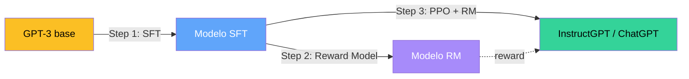

> **Recorrido de las 64 diapositivas** de la clase 20 del Diplomado IA UC (Carlos Aspillaga, mayo 2026). La clase pone en una sola foto cuatro modelos que cambiaron NLP entre 2018 y 2022 — **ELMo, BERT, GPT y ChatGPT** — y traza la genealogía que conecta a Word2Vec con los frontier LLMs actuales.

---

## 1. Introducción: ¿por qué tantos modelos?

### 1.1 NLP evoluciona muy rápido

La clase abre con una imagen provocadora — la "marcha del progreso" — para argumentar que el avance de NLP entre 2017 y 2022 fue inusualmente acelerado. Cuatro vectores se acoplaron:

1. **Mejores arquitecturas.** Transformer (2017) reemplazó las LSTM como caballo de batalla. Self-attention paralelizable destrabó cómputo en GPU/TPU.
2. **Mejores estrategias de entrenamiento.** Pasamos de "entrenar desde cero por tarea" a "pre-entrenar gigante + fine-tunear ligero", y luego a "pre-entrenar gigante + prompt".
3. **Más y mejores datos.** Corpus crecieron de BookCorpus (800M palabras) a Common Crawl filtrado (cientos de miles de millones).
4. **Más cómputo.** GPT-1 fue ~1018 FLOPs, GPT-3 alcanzó 3×1023 FLOPs — un crecimiento de cinco órdenes de magnitud en dos años.


La pregunta de fondo de la clase es: **¿por qué a 2022 conviven tantos modelos (ELMo, BERT, GPT-1, GPT-2, GPT-3, InstructGPT, ChatGPT) en lugar de uno solo?** La respuesta corta: cada uno resuelve un problema distinto bajo restricciones distintas de cómputo, datos y arquitectura.


### 1.2 Distintos modelos para distintos problemas

La clase divide los modelos en dos familias arquetípicas:

| Familia | Diseñada para | Modelos canónicos | Salida típica |
|---|---|---|---|
| **"Entender un texto"** | Clasificación, extracción, similitud | ELMo, BERT, RoBERTa, BETO | Texto → etiqueta o vector |
| **"Generar texto"** | Continuación, conversación, traducción | GPT-1, GPT-2, GPT-3, ChatGPT | Texto → texto |

El metáfora visual del PDF — Sesame Street (ELMo, BERT, ERNIE, Big Bird) versus el "zoológico" de animales más diverso de OpenAI — captura una intuición real: la familia encoder-only es relativamente homogénea, mientras que la familia decoder-only se ramificó en muchas direcciones.

### 1.3 ¿Idea revolucionaria o escala bruta?

Aspillaga propone una distinción que se vuelve la espina dorsal del resto de la clase:

- **BERT/ELMo**: aportan **una idea revolucionaria de entrenamiento** (MLM para BERT, biLM con combinación lineal para ELMo) y la sostienen con cómputo *para ese tiempo*.
- **GPT**: la idea base es la misma de Bengio 2003 (predecir la siguiente palabra) y la arquitectura es Transformer decoder ya conocida — la novedad es **muuuchos parámetros, muuuchos datos, muuucho cómputo**.


Esta distinción explica por qué hoy en 2026 los encoder-only (BERT y descendientes) viven en nichos específicos — embeddings de búsqueda, re-ranking, clasificación clínica — mientras que los decoder-only escalados dominan la conversación con humanos.


---

## 2. ELMo — Deep Contextualized Word Representations

### 2.1 El problema: embeddings estáticos no manejan polisemia

Hasta 2017 los embeddings dominantes eran **estáticos**: cada palabra tiene un único vector, independientemente del contexto. Word2Vec (Mikolov 2013), GloVe (Pennington 2014) y FastText (Joulin 2016) entran en esta categoría.

El problema lo ilustra el PDF con 4 ejemplos en inglés:

| Palabra | Contexto 1 | Contexto 2 | Sentido distinto |
|---|---|---|---|
| **arm** | *I have an ant bite on my arm.* | *It's important to **arm** yourself with a solid education.* | sustantivo vs verbo |
| **fall** | *I love cool, crisp fall weather.* | *Don't fall on your way to the gym.* | otoño vs caer |
| **clip** | *I enjoyed watching a clip from that video.* | *My mom is going to clip my hair.* | fragmento vs cortar |
| **drop** | *I hope I don't drop my books.* | *I enjoyed every last drop of my milkshake.* | dejar caer vs gota |

Word2Vec asigna **un solo vector a "arm"**. Imposible distinguir el brazo del verbo. Para clasificación de sentimiento o NER esto rompe el techo de rendimiento.

### 2.2 La descomposición del nombre del modelo

El paper de Peters et al. (NAACL 2018, **Best Paper Award**) descompone su nombre con claridad:

- **Deep** — usar redes neuronales **profundas** (no shallow).
- **Contextualized** — el vector de cada palabra es función del contexto entero: $v_{\text{word}} = f(\text{word} \mid \text{contexto})$.
- **Word** — la unidad semántica fundamental sigue siendo la palabra.
- **Representations** — embeddings: vectores distribuidos en un espacio continuo.

**Objetivo declarado**: obtener word embeddings contextualizados que se puedan **enchufar** a sistemas de NLP existentes sin re-arquitecturar.

### 2.3 La arquitectura

ELMo es un pipeline de cuatro etapas:

```
1. Char-level CNN  →  embedding inicial por palabra (sin contexto aún)
2. Forward LSTM       →  procesa de izquierda a derecha
   Backward LSTM      →  procesa de derecha a izquierda
3. 2 capas BiLSTM apiladas (cada una emite vectores forward y backward)
4. Combinación lineal task-specific de las representaciones de las 3 capas
```

#### 2.3.1 Character-level embeddings (etapa 1)

ELMo no parte de un vocabulario de palabras enteras. Toma los **caracteres** uno por uno (one-hot por carácter), los pasa por:

- **Convolution Layer + Max-Pool**: extrae n-gramas de caracteres con filtros de distintos anchos (filter width 1, 2, 3, ..., 7; 32-128 filtros por width).
- **2-layer Highway Network**: capa con gates que aprenden cuándo dejar pasar la información cruda y cuándo transformarla — funciona como pre-residual antes de que existieran residuals.
- Termina con una proyección lineal a una dimensión fija.

**Ventajas reportadas**:
- Generaliza a palabras **fuera de vocabulario** (OOV) — funciona con cualquier secuencia de caracteres.
- Captura morfología (conjugaciones, plurales, prefijos).
- Evita el preprocesamiento clásico (stemming, lemmatización).

Este truco lo tomó de Kim et al. 2016 ("Character-Aware Neural Language Models") y Jozefowicz et al. 2016 ("Exploring the Limits of Language Modeling").

#### 2.3.2 Bidirectional Language Model (etapa 2-3)

Lo central de ELMo: dos modelos de lenguaje entrenados **en conjunto pero con objetivos separados**.

**Forward LM** — predecir la palabra siguiente dadas las anteriores:

$$
p(t_1, t_2, \ldots, t_N) = \prod_{k=1}^{N} p(t_k \mid t_1, \ldots, t_{k-1})
$$

**Backward LM** — predecir la palabra anterior dadas las siguientes:

$$
p(t_1, t_2, \ldots, t_N) = \prod_{k=1}^{N} p(t_k \mid t_{k+1}, \ldots, t_N)
$$

**Loss conjunta** — la suma de las log-likelihoods de ambos modelos:

$$
\mathcal{L} = \sum_{k=1}^{N} \Big( \log p(t_k \mid t_1, \ldots, t_{k-1}; \Theta_x, \overrightarrow{\Theta}_{LSTM}, \Theta_s) \\
+ \log p(t_k \mid t_{k+1}, \ldots, t_N; \Theta_x, \overleftarrow{\Theta}_{LSTM}, \Theta_s) \Big)
$$

donde $\Theta_x$ son los pesos del embedding de entrada (compartidos) y $\Theta_s$ los del softmax de salida (también compartido).


**Sutileza importante**: los dos LMs **NO** se ven entre sí durante el entrenamiento. El forward LSTM no observa lo que produce el backward LSTM. Eso significa que la bidireccionalidad en ELMo es **shallow** (en superficie) — cada LM solo ve una dirección. BERT corregirá esto unos meses después con MLM, logrando **bidireccionalidad profunda y conjunta** en un solo modelo.


#### 2.3.3 ELMo task-specific (etapa 4)

Para cada palabra $k$ en una oración, las 2 capas BiLSTM producen 2 representaciones contextualizadas $h_{1,k}$ y $h_{2,k}$ (cada una es la concatenación forward+backward). Más el embedding inicial char-CNN $x_k$, tenemos **3 representaciones por palabra**:

- $x_k$ — capa 0: sin contexto (solo morfología de caracteres).
- $h_{1,k}$ — capa 1: contexto local, sintaxis superficial.
- $h_{2,k}$ — capa 2: contexto extendido, semántica.

ELMo combina las 3 con pesos aprendidos **por tarea**:

$$
\text{ELMo}_k^{\text{task}} = \gamma^{\text{task}} \cdot \left( s_0^{\text{task}} \cdot x_k + s_1^{\text{task}} \cdot h_{1,k} + s_2^{\text{task}} \cdot h_{2,k} \right)
$$

donde:
- $s_0, s_1, s_2$ son pesos softmax normalizados ($\sum s_j = 1$) — controlan **cuánto pesa cada capa** para la tarea downstream.
- $\gamma$ es un escalar global que regula la magnitud del vector ELMo final.


La intuición clave es que **distintas tareas valoran distintas capas**. POS tagging (etiquetado morfosintáctico) usa más $h_{1,k}$ (sintaxis baja). NER y similitud semántica usan más $h_{2,k}$ (semántica alta). Anteriormente, papers como BiLSTM contextualizers solo extraían la capa superior — ELMo demostró que usar **todas** las capas con pesos aprendidos vale puntos.


### 2.4 Entrenamiento y evaluación

- **Dataset**: One Billion Word Benchmark (Chelba et al. 2014) — ~1B palabras de noticias.
- **Cómputo**: 2 capas BiLSTM con 4096 unidades cada una, proyectadas a 512 — muy grande para 2018.
- **Perplexity** alcanzada: 39.7.
- **Vocabulario**: 793k palabras + caracteres (gracias al char-CNN, sin OOV problem real).

Una vez pre-entrenado el biLM, se **congela** (no se actualiza) y se enchufa a 6 sistemas downstream con pesos $s_j, \gamma$ entrenables:

| Tarea | SOTA previa | Baseline propia | ELMo + Baseline | Mejora |
|---|---|---|---|---|
| SQuAD (QA) | 84.4 | 81.1 | **85.8** | +4.7 (24.9% rel.) |
| SNLI (NLI) | 88.6 | 88.0 | **88.7** | +0.7 (5.8%) |
| SRL | 81.7 | 81.4 | **84.6** | +3.2 (17.2%) |
| Coref | 67.2 | 67.2 | **70.4** | +3.2 (9.8%) |
| NER (CoNLL) | 91.93 | 90.15 | **92.22** | +2.06 (21%) |
| SST-5 | 53.7 | 51.4 | **54.7** | +3.3 (6.8%) |

**ELMo mejoró el state of the art en las 6 tareas**, sin tocar la arquitectura del modelo downstream — solo cambiando los embeddings de entrada. Eso es un cambio de paradigma de magnitud Nobel para el campo.

---

## 3. BERT — Bidirectional Encoder Representations from Transformers

### 3.1 La idea revolucionaria

8 meses después de ELMo, Devlin et al. (octubre 2018, NAACL 2019) publican BERT. La pregunta que se hicieron: ¿podemos lograr **bidireccionalidad profunda** (no shallow como ELMo) dentro de **un solo modelo** basado en Transformer?

El obstáculo: si entrenamos un modelo bidireccional con next-token prediction, cada token **vería su propia respuesta** a través de la atención bidireccional — el problema se trivializa. BERT resuelve esto con dos objetivos auto-supervisados nuevos:

1. **Masked Language Modeling (MLM)** — enmascarar tokens al azar y predecirlos.
2. **Next Sentence Prediction (NSP)** — predecir si una oración B sigue a una oración A.

### 3.2 Arquitectura

BERT toma **solo el encoder** del Transformer original de Vaswani et al. 2017. Sin decoder. Sin atención cruzada. Sin generación autoregresiva.

- **BERT-base**: 12 capas, dimensión oculta 768, 12 cabezas de atención, 110M parámetros.
- **BERT-large**: 24 capas, dimensión 1024, 16 cabezas, 340M parámetros.

Cada capa es un bloque Transformer encoder estándar:

```
input → Multi-Head Self-Attention (sin máscara causal) → Add+Norm
      → Feed Forward (4× expansion + GELU) → Add+Norm → output
```

Ver [Fundamento: BERT](/fundamentos/bert) y [Pre-training BERT](/fundamentos/pretraining-bert) para la mecánica completa.

### 3.3 Tokenización: WordPiece

BERT usa **WordPiece** (Wu et al. 2016), un algoritmo de subword similar al BPE pero con criterio de merge basado en likelihood en lugar de frecuencia. El ejemplo del PDF:

```
"Learning new things is fun!"        →  Learn ##ing | new | things | is | fun | !
"Prompting is a powerful tool."      →  Prompt ##ing | is | a | powerful | tool | .
"lollipop"                            →  lol ##li ##pop
"l-o-l-l-i-p-o-p" (raro)              →  l | - | o | - | l | - | l | - | i ...
```

El doble hash `##` marca que el subtoken es continuación de la palabra anterior. Vocabulario típico: **30,000 tokens**.

Ver [Fundamento: BPE](/fundamentos/bpe) que cubre el algoritmo base; WordPiece y SentencePiece son variantes.

### 3.4 Inputs: [CLS], [SEP], segment, position

La entrada de BERT no es solo una secuencia de tokens — es una **suma de tres embeddings**:

```
input  =  [CLS] | my | dog | is | cute | [SEP] | he | likes | play | ##ing | [SEP]

token_emb     =  E_[CLS] + E_my + E_dog + ... + E_[SEP]   (vocab)
segment_emb   =  E_A   + E_A  + E_A  + ... + E_B          (A o B)
position_emb  =  E_0   + E_1  + E_2  + ... + E_10         (posición)

input final = token_emb + segment_emb + position_emb
```

Tres tokens especiales:
- **[CLS]** (classification) — siempre primero. Su embedding final agregado se usa para tareas de clasificación de secuencia.
- **[SEP]** (separator) — entre oraciones A y B.
- **[MASK]** (mask) — reemplaza tokens enmascarados durante MLM.

### 3.5 Pre-training: MLM + NSP

#### 3.5.1 Masked Language Modeling

Se enmascara el **15% de los tokens** al azar. Para cada token enmascarado:
- 80% se reemplaza por `[MASK]`
- 10% se reemplaza por un token aleatorio
- 10% se mantiene sin cambiar

La razón de la regla 80/10/10 es deliberada: si todos los enmascarados fueran `[MASK]`, el modelo nunca vería el token `[MASK]` durante fine-tuning y aprendería un truco trivial. La mezcla fuerza al modelo a aprender representaciones útiles para *todos* los tokens.

La loss es **cross-entropy solo sobre los tokens enmascarados**:

$$
\mathcal{L}_{\text{MLM}} = - \sum_{i \in M} \log P(x_i \mid x_{\setminus M})
$$

donde $M$ es el conjunto de posiciones enmascaradas y $x_{\setminus M}$ es la secuencia con los tokens enmascarados sustituidos.

#### 3.5.2 Next Sentence Prediction

Para cada par (A, B):
- 50% B es realmente la oración siguiente de A en el corpus.
- 50% B es una oración aleatoria de otro documento.

La predicción binaria (IsNext / NotNext) se hace **desde el vector [CLS]** de la última capa:

$$
\mathcal{L}_{\text{NSP}} = - \log P(y_{\text{IsNext}} \mid h_{[CLS]})
$$

La loss total de pre-training: $\mathcal{L} = \mathcal{L}_{\text{MLM}} + \mathcal{L}_{\text{NSP}}$.


**Crítica posterior**: trabajos como RoBERTa (Liu et al. 2019) demostraron que NSP **no aporta** — quitarla no degrada el modelo si se entrena con más datos y más epochs. La hipótesis: NSP es demasiado fácil, el modelo solo detecta cambio de tópico.


#### 3.5.3 Datos de pre-training

- **BooksCorpus** (Zhu et al. 2015): 800M palabras de libros narrativos largos (dependencias de largo alcance).
- **English Wikipedia**: 2,500M palabras de texto enciclopédico (sin listas, tablas, headers).

Total: ~3.3B palabras.

### 3.6 Fine-tuning por tarea

El diseño de BERT permite fine-tunear el mismo modelo para 4 modalidades de tarea con apenas una capa lineal de output:

| Modalidad | Tareas típicas | Donde se lee la predicción |
|---|---|---|
| **(a) Sentence pair classification** | MNLI, QQP, QNLI, STS-B, MRPC, RTE, SWAG | Vector [CLS] → softmax K-way |
| **(b) Single sentence classification** | SST-2, CoLA | Vector [CLS] → softmax K-way |
| **(c) Question Answering** | SQuAD v1.1 | Dos vectores aprendidos (start/end), dot product con cada token → softmax sobre posiciones |
| **(d) Single sentence tagging** | CoNLL-2003 NER | Vector de cada token → softmax sobre tag space |

Hyperparams típicos de fine-tuning: 3 epochs, lr ~2-5e-5, batch 16-32. Cómputo mínimo comparado al pre-training.

### 3.7 Resultados GLUE

Tabla 1 del paper de BERT:

| Sistema | MNLI | QQP | QNLI | SST-2 | CoLA | STS-B | MRPC | RTE | **Avg** |
|---|---|---|---|---|---|---|---|---|---|
| Pre-OpenAI SOTA | 80.6/80.1 | 66.1 | 82.3 | 93.2 | 35.0 | 81.0 | 86.0 | 61.7 | 74.0 |
| BiLSTM + ELMo + Attn | 76.4/76.1 | 64.8 | 79.8 | 90.4 | 36.0 | 73.3 | 84.9 | 56.8 | 71.0 |
| OpenAI GPT | 82.1/81.4 | 70.3 | 87.4 | 91.3 | 45.4 | 80.0 | 82.3 | 56.0 | 75.1 |
| **BERT-base** | 84.6/83.4 | 71.2 | 90.5 | 93.5 | 52.1 | 85.8 | 88.9 | 66.4 | 79.6 |
| **BERT-large** | **86.7/85.9** | **72.1** | **92.7** | **94.9** | **60.5** | **86.5** | **89.3** | **70.1** | **82.1** |

BERT-large supera la SOTA previa por 8 puntos absolutos promedio. Esto cambió el campo.

### 3.8 Detalles técnicos

- BERT-base: 110M params, 12 capas, 768 dim, 12 heads.
- BERT-large: 340M params, 24 capas, 1024 dim, 16 heads.
- WordPiece embeddings: 30,000 tokens.
- Cómputo de pre-training: 4 días en 4 Cloud TPUs (BERT-base), 16 Cloud TPUs (BERT-large).

### 3.9 Evoluciones de BERT

La clase menciona 3 variantes representativas:

#### RoBERTa (Liu et al. 2019)
Mismo modelo que BERT-large, **diferente receta de entrenamiento**:
- Mejor búsqueda de hiperparámetros.
- **Más datos**: agregan CC-News, OpenWebText, Stories (160GB vs 16GB de BERT).
- **Más cómputo**: 500k steps con batch 8k.
- Eliminan NSP (no aporta).
- Resultado: mejor rendimiento sin tocar arquitectura — validación de scaling laws antes de que existiera el término.

#### BETO (Cañete et al. 2020, DCC UChile)
BERT-base entrenado **en español** por el grupo de Jorge Pérez en la Universidad de Chile.
- Mismo modelo, ~3B palabras de Wikipedia/OpenSubtitles/ParaCrawl en español.
- Cómputo similar a BERT-base original.
- Resultado: SOTA en POS, NER y otras tareas en español.
- Disponible en Hugging Face: `dccuchile/bert-base-spanish-wwm-cased`, `dccuchile/bert-base-spanish-wwm-uncased`.

#### BERTÍN (Proyecto comunitario, 2021)
Modelo BERT en español del **proyecto BERTIN** (colaboración Flax + Google TPU Research Cloud).
- Variantes con distintas estrategias de muestreo (gaussian, stepwise, random) sobre mC4-es.
- Disponible en `bertin-project/bertin-base-*` en Hugging Face.


**Por qué importan BETO y BERTIN**: la mayoría de los modelos pre-entrenados de la era 2018-2022 fueron entrenados en inglés. Para aplicaciones en español, los modelos multilingües (mBERT, XLM-R) son razonables pero subóptimos. Los modelos monolingües entrenados directamente en español como BETO y BERTIN suelen ser superiores en tareas locales — especialmente importante para dominios clínicos, legales y técnicos donde el vocabulario y la estructura sintáctica son específicas.


---

## 4. GPT — Generative Pre-Training

### 4.1 GPT-1 (Radford et al. 2018) — Improving Language Understanding

Publicado por OpenAI en **junio 2018**, cuatro meses antes que BERT. Igual tamaño que BERT-base (117M params), pero filosofía radicalmente distinta.

#### Diferencias arquitectónicas

GPT-1 usa **solo el decoder** del Transformer (sin cross-attention, sin encoder):

```
input → Masked Multi-Head Self-Attention → Add+Norm
      → Feed Forward → Add+Norm → output
```

La clave: **atención enmascarada causal**. Cada token solo puede atender a posiciones anteriores. Esto es lo que permite entrenamiento autoregresivo y generación de texto.

- 12 capas, dim 768, 12 heads, 117M params.
- Context window: 512 tokens.

#### Pre-training: Language Modeling autoregresivo

Un único objetivo: predecir la siguiente palabra dadas las $k$ palabras anteriores.

$$
\mathcal{L}_1(\mathcal{U}) = \sum_i \log P(u_i \mid u_{i-k}, \ldots, u_{i-1}; \Theta)
$$

- **Dataset**: **BookCorpus** (Zhu et al. 2015) — 7000 libros sin estructurar de varios géneros. Elegido por sus **dependencias largas** (los libros tienen narrativas que conectan tokens a 1000+ tokens de distancia, lo que entrena al modelo a capturar contexto a escala).

#### Fine-tuning supervisado por tarea

GPT-1 introduce un patrón de fine-tuning donde el input se **transforma con tokens delimitadores** según la tarea:

| Tarea | Input transformation |
|---|---|
| Classification | `[Start] text [Extract]` → Linear |
| Entailment | `[Start] premise [Delim] hypothesis [Extract]` → Linear |
| Similarity | `[Start] text1 [Delim] text2 [Extract]` y `[Start] text2 [Delim] text1 [Extract]` (suma) → Linear |
| Multiple Choice | N copias con `[Start] context [Delim] answer_k [Extract]` → softmax sobre N |

El objetivo de fine-tuning combina la loss de la tarea con un **objetivo auxiliar de LM** (regularización):

$$
\mathcal{L}_3 = \mathcal{L}_2(\text{tarea}) + \lambda \cdot \mathcal{L}_1(\text{LM auxiliar})
$$

#### Resultados notables

- GPT-1 alcanzó SOTA en **9 de 12** datasets evaluados.
- **Zero-shot behaviors emergentes**: el modelo resolvía tareas para las que no había sido fine-tuneado, solo en función del corpus de pre-training. La figura del paper muestra cómo el rendimiento zero-shot crece monotónicamente con el número de pre-training updates.


El descubrimiento de zero-shot behaviors emergentes en GPT-1 plantó la semilla de toda la trayectoria GPT-2 → GPT-3 → ChatGPT. La idea: **si emergen capacidades sin que las pidamos, ¿qué pasa si escalamos masivamente?**


### 4.2 GPT-2 (Radford et al. 2019) — Language Models are Unsupervised Multitask Learners

Publicado en **febrero 2019**. Polémico por su **staged release** — OpenAI no liberó el modelo de 1.5B inmediatamente por preocupación por mal uso (generación masiva de fake news), lo que generó un debate intenso sobre "responsible release".

#### Cambios respecto a GPT-1

- **Arquitectura**: prácticamente la misma. Pequeños ajustes: LayerNorm movido al input de cada sub-block (pre-LN), inicialización residual escalada por $1/\sqrt{N}$, vocab expandido a 50,257.
- **Context window**: 1024 tokens (vs 512 en GPT-1).
- **Sin fine-tuning supervisado**: la evaluación es **zero-shot**, vía prompting natural.

#### 4 tamaños

| Modelo | Parámetros | Capas | Dim |
|---|---|---|---|
| GPT-2 Small | 117M | 12 | 768 |
| GPT-2 Medium | 345M | 24 | 1024 |
| GPT-2 Large | 762M | 36 | 1280 |
| GPT-2 Extra Large | 1.5B | 48 | 1600 |

#### Dataset: WebText

Diseñado deliberadamente para diversidad y calidad:
- 45M links salientes de Reddit con karma ≥ 3 (filtro de calidad implícito).
- Dedup de documentos + filtros heurísticos.
- Sin Wikipedia (para no inflar resultados en benchmarks que la usan).
- Resultado: **8M documentos** / **40GB** de texto.

#### Resultados zero-shot

Tabla 3 del paper — GPT-2 evaluado **sin fine-tuning** en 8 datasets de language modeling:

| Métrica | SOTA | GPT-2 117M | 345M | 762M | **1542M** |
|---|---|---|---|---|---|
| LAMBADA (PPL) | 99.8 | 35.13 | 15.60 | 10.87 | **8.63** |
| LAMBADA (ACC) | 59.23 | 45.99 | 55.48 | 60.12 | **63.24** |
| CBT-CN (ACC) | 85.7 | 87.65 | 92.35 | 93.45 | **93.30** |
| CBT-NE (ACC) | 82.3 | 83.4 | 87.1 | 88.0 | **89.05** |
| WikiText2 (PPL) | 39.14 | 29.41 | 22.76 | 19.93 | **18.34** |
| PTB (PPL) | 46.54 | 65.85 | 47.33 | 40.31 | **35.76** |

**GPT-2 1.5B mejoró el SOTA en 7 de 8 datasets, sin haber sido entrenado para ellos**.

#### Tesis: "Language Models are Unsupervised Multitask Learners"

El argumento conceptual del paper: un modelo de lenguaje entrenado en un corpus diverso aprende implícitamente a hacer **muchas tareas** — porque las tareas aparecen escritas en el corpus de internet:

- Traducción aparece como "Translate to French: ...".
- Resumen aparece como artículos terminados en "TL;DR: ...".
- QA aparece como "Question: ... Answer: ...".

Si el modelo es suficientemente grande, puede ejecutar la tarea solo siguiendo el patrón del prompt — sin haber sido entrenado explícitamente para ella.

### 4.3 GPT-3 (Brown et al. 2020) — Language Models are Few-Shot Learners

**Mayo 2020**. NeurIPS 2020 Best Paper Award. El momento en que la era de los LLMs se vuelve visible al público no especialista.

#### La misma arquitectura, MUCHO más grande

| Modelo | Parámetros | Capas | Dim | Heads |
|---|---|---|---|---|
| GPT-3 Small | 125M | 12 | 768 | 12 |
| GPT-3 Medium | 350M | 24 | 1024 | 16 |
| GPT-3 Large | 760M | 24 | 1536 | 16 |
| GPT-3 XL | 1.3B | 24 | 2048 | 24 |
| GPT-3 2.7B | 2.7B | 32 | 2560 | 32 |
| GPT-3 6.7B | 6.7B | 32 | 4096 | 32 |
| GPT-3 13B | 13B | 40 | 5120 | 40 |
| **GPT-3 175B** | **175B** | **96** | **12288** | **96** |

Context window: 2048 tokens. Sparse attention alternada con dense (de Sparse Transformer, Child et al. 2019).

#### Datos de entrenamiento

| Dataset | Tokens (B) | Weight en mix |
|---|---|---|
| Common Crawl (filtered) | 410B | 60% |
| WebText2 | 19B | 22% |
| Books1 | 12B | 8% |
| Books2 | 55B | 8% |
| Wikipedia | 3B | 3% |

Total entrenados: ~**300B tokens**. Compute: ~3.14×10^23 FLOPs. Costo estimado: ~$4.6M solo en cómputo.

#### In-Context Learning: zero/one/few-shot

GPT-3 introduce formalmente el concepto de **in-context learning**: el modelo aprende del prompt sin actualización de gradientes. Tres modos:

```
ZERO-SHOT                          ONE-SHOT
─────────                          ────────
Translate English to French:       Translate English to French:
cheese =>                          sea otter => loutre de mer
                                   cheese =>

FEW-SHOT
────────
Translate English to French:
sea otter => loutre de mer
peppermint => menthe poivrée
plush giraffe => girafe peluche
cheese =>
```

Vs **fine-tuning tradicional** que requiere ejemplos + actualización de pesos en cada paso.

#### Resultados notables

- **Few-shot competitivo con fine-tuning SOTA** en traducción, QA, cloze tasks.
- Capacidades emergentes nuevas: unscrambling palabras, usar palabras nuevas en oraciones, aritmética de 3 dígitos.
- **Generación de artículos casi indistinguibles de humanos**: en blind tests, humanos solo acertaban 52% al distinguir GPT-3 175B de prosa humana (52% = casi azar).

### 4.4 ChatGPT / InstructGPT (Ouyang et al. 2022)

**Marzo 2022**. El paper que formaliza el pipeline detrás de ChatGPT (lanzado en noviembre 2022). OpenAI no publicó paper técnico de ChatGPT — InstructGPT es la referencia técnica.

#### El problema: misalignment

GPT-3 base es un modelo que **continúa texto**, no un asistente. Si se le pregunta `What is the capital of Chile?`, su comportamiento natural es **continuar como en el corpus**:

```
LLM BASE (GPT-3)
What is the capital of Chile?
What is the population of Chile?     ← continúa con otras preguntas
What is the main economic activity of Chile?
...
```

Lo que queremos es:

```
LLM INSTRUCCIONAL (ChatGPT)
What is the capital of Chile?
The capital of Chile is Santiago.    ← responde la pregunta
```

#### Solución: RLHF en 3 pasos

El pipeline de Ouyang et al. 2022 — **R**einforcement **L**earning from **H**uman **F**eedback:



**Step 1 — Supervised Fine-Tuning (SFT)**:
- Labelers humanos escriben respuestas ideales a prompts.
- ~13k pares (prompt, respuesta) curados.
- Fine-tuning supervisado estándar sobre GPT-3 base.
- Resultado: modelo que sigue instrucciones, pero limitado por el dataset.

**Step 2 — Reward Model (RM)**:
- Para cada prompt, el SFT genera $K=4-9$ respuestas distintas.
- Labelers **rankean** las K respuestas (no asignan score absoluto).
- Se entrena un modelo RM de 6B params que asigna scores escalares.
- Loss: **Bradley-Terry** sobre pares chosen/rejected:

$$
\mathcal{L}_{\text{RM}} = - \mathbb{E}_{(x, y_w, y_l)} \left[ \log \sigma\!\left( r(x, y_w) - r(x, y_l) \right) \right]
$$

donde $y_w$ es la respuesta preferida y $y_l$ la rechazada. Ver [fundamento Bradley-Terry](/fundamentos/bradley-terry).

**Step 3 — RL con PPO contra el RM**:
- La policy (LLM) se inicializa desde SFT.
- Se optimiza con PPO maximizando reward = $r(x, y) - \beta \cdot \text{KL}(\pi \| \pi_{\text{SFT}})$
- La penalización KL contra el SFT previene **mode collapse** (que el modelo se rompa explotando el RM).
- $\beta \approx 0.02$ típicamente.

#### Hallazgos sorprendentes

- **InstructGPT 1.3B venció a GPT-3 175B en preferencia humana**, a pesar de ser 130× más chico.
- **Truthfulness mejoró** en TruthfulQA.
- **Toxicidad bajó** en RealToxicityPrompts.
- Pequeña regresión en benchmarks NLP académicos (alignment tax), mitigada con **PPO-ptx** (agregar pre-training loss en el RL step).

### 4.5 Temperatura: control de aleatoriedad

ChatGPT (y todos los LLMs) producen distribuciones sobre el vocabulario en cada paso. La **temperatura** $T$ controla qué tan aleatoria es la elección del siguiente token:

$$
p_i = \frac{\exp(z_i / T)}{\sum_j \exp(z_j / T)}
$$

- $T = 0$: argmax — siempre el token más probable. Determinístico.
- $T = 0.3$: bajo. Mayormente repetitivo, ocasionalmente varía.
- $T = 0.7$: equilibrio típico para creatividad.
- $T > 1$: muy aleatorio, riesgo de incoherencia.

El ejemplo del PDF — "¿Cuál es tu comida favorita?" con prob(pizza)=0.6, prob(sushi)=0.3, prob(tacos)=0.1:

```
T = 0.0   →  Pizza, Pizza, Pizza
T = 0.3   →  Pizza, Sushi, Pizza
T = 0.7   →  Tacos, Pizza, Sushi
```

### 4.6 Roles: system, user, assistant

ChatGPT introduce un formato de **mensajes con roles** que estructura conversaciones multi-turno:

```python
messages = [
    {"role": "system",    "content": "You are an assistant..."},
    {"role": "user",      "content": "tell me a joke"},
    {"role": "assistant", "content": "Why did the chicken..."},
    # más turnos
]
```

- **system**: instrucciones globales del modelo (persona, restricciones).
- **user**: el humano.
- **assistant**: respuestas del modelo.

Esto desbloquea la programabilidad de los LLMs como sistemas conversacionales y abre la era de los **chat templates** estandarizados (también adoptados por Claude, Gemini, LLaMA-2-chat, Mistral-Instruct, etc.).

---

## 5. Herramientas concretas

La clase cierra con un panorama del ecosistema de software para usar estos modelos en producción y aprendizaje.

### 5.1 Hugging Face Transformers

La librería que democratizó el acceso a modelos pre-entrenados. Tres componentes:

- **`transformers`**: implementación unificada de cientos de arquitecturas (BERT, GPT-2, T5, LLaMA, BETO, ...). API consistente para fine-tuning, inferencia, exportación.
- **Model Hub**: ~500k modelos pre-entrenados publicados por la comunidad. Cada modelo viene con tokenizador y config.
- **`datasets`** y **`evaluate`**: datasets canónicos y métricas estandarizadas.

```python
from transformers import AutoTokenizer, AutoModel

tok = AutoTokenizer.from_pretrained("dccuchile/bert-base-spanish-wwm-uncased")
model = AutoModel.from_pretrained("dccuchile/bert-base-spanish-wwm-uncased")

inputs = tok("La capital de Chile es Santiago.", return_tensors="pt")
outputs = model(**inputs)
# outputs.last_hidden_state: (batch=1, seq_len, 768)
```

### 5.2 OpenAI API (y similares)

Acceso pago a modelos cerrados de frontier (GPT-4, GPT-4o, o1, etc.) vía REST API. Patrón típico:

```python
from openai import OpenAI

client = OpenAI()
response = client.chat.completions.create(
    model="gpt-4o",
    messages=[
        {"role": "system", "content": "You are a clinical assistant."},
        {"role": "user",   "content": "Resume este informe radiológico..."}
    ],
    temperature=0.3
)
print(response.choices[0].message.content)
```

APIs análogas existen para Claude (Anthropic), Gemini (Google), Mistral, Cohere, etc.

### 5.3 Fine-tuning práctico

Para tareas específicas con vocabulario propio (clínico, legal, técnico), fine-tunear un modelo abierto es preferible a llamar API:

- **Hugging Face `Trainer`** + `TrainingArguments` para fine-tuning supervisado clásico.
- **PEFT (LoRA, QLoRA)** para adaptación eficiente con pocos parámetros entrenables.
- **TRL (`transformers reinforcement learning`)** para SFT, DPO, RLHF.

El laboratorio de la clase (lab-20) cubre este camino en concreto.

---

## Lectura complementaria

- [Profundización: math riguroso de biLM, MLM, RLHF](profundizacion)
- [Práctica desde 0: ELMo, BERT, GPT mini en PyTorch + TF + JAX](practica)
- [Paper ELMo (Peters 2018)](/papers/elmo-peters-2018) · [BERT (Devlin 2018)](/papers/bert-devlin-2018) · [GPT-1](/papers/gpt-1-radford-2018) · [GPT-2](/papers/gpt-2-radford-2019) · [GPT-3](/papers/gpt-3-brown-2020) · [InstructGPT](/papers/instructgpt-ouyang-2022)
- [Clase 14 — Transformer base](/clases/clase-14) · [Clase 16 — NLP clásico](/clases/clase-16)
- [Dominio Texto / NLP — timeline completa](/dominios/texto)
