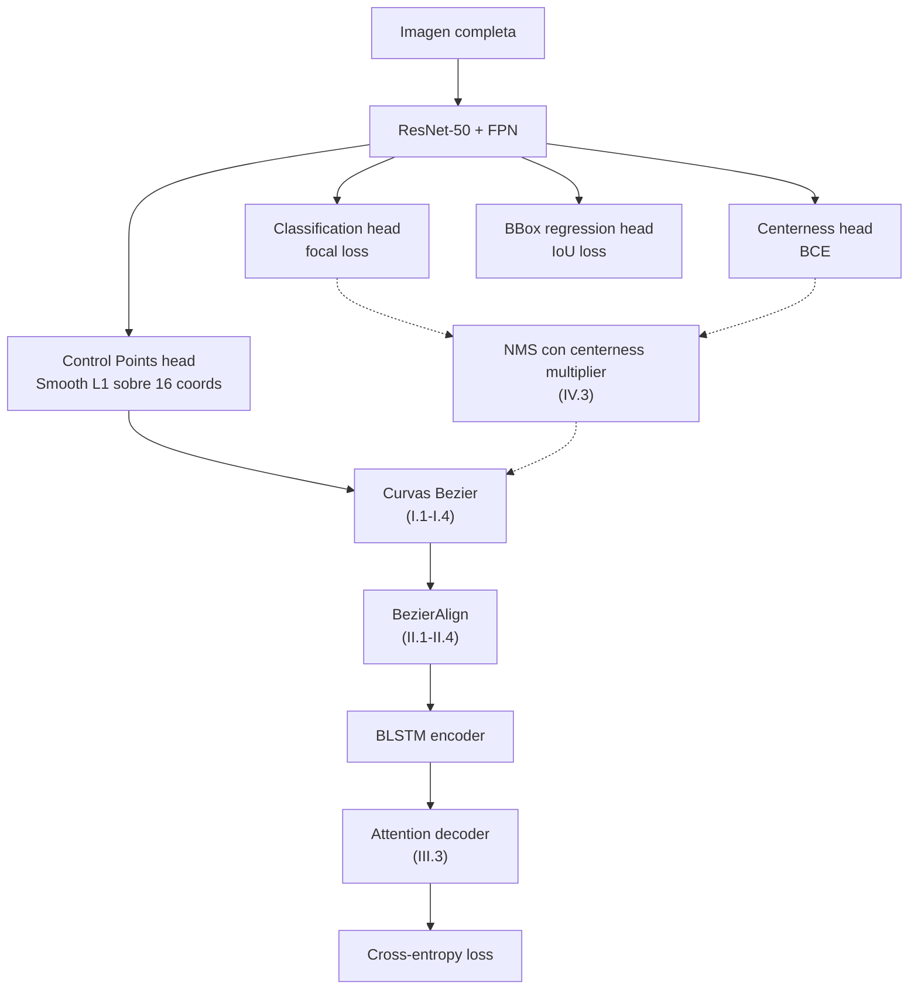

> Math riguroso que sustenta la clase 21. Cinco partes: (I) **curvas de Bézier** y polinomios de Bernstein, (II) **BezierAlign** como generalización de RoIAlign, (III) **predicción de secuencia** — CTC vs attention decoder, (IV) **detección geométrica** — IoU, GIoU y centerness de FCOS, (V) **Levenshtein** y NED. Cada parte conecta el formalismo con su rol concreto en ABCNet (Liu et al. CVPR 2020).

---

## Parte I — Curvas de Bézier

### I.1 Polinomios de Bernstein

Los polinomios de Bernstein de grado $n$ son una **base del espacio de polinomios** $\mathcal{P}_n$ definida como:

$$B_{i,n}(t) = \binom{n}{i} t^i (1-t)^{n-i}, \quad i = 0, 1, \ldots, n, \quad t \in [0, 1]$$

Propiedades fundamentales:

**1. Partition of unity** — suman exactamente 1 en todo el intervalo:

$$\sum_{i=0}^{n} B_{i,n}(t) = (t + (1-t))^n = 1^n = 1$$

por el teorema del binomio. Esto significa que cualquier combinación convexa de puntos $\{P_i\}$ con coeficientes $B_{i,n}(t)$ produce un punto en el **convex hull** de los $P_i$.

**2. No-negatividad** — $B_{i,n}(t) \geq 0$ para todo $t \in [0,1]$.

**3. Simetría** — $B_{i,n}(t) = B_{n-i,n}(1-t)$.

**4. Recurrencia** — $B_{i,n}(t) = (1-t) B_{i,n-1}(t) + t B_{i-1,n-1}(t)$.

Para $n = 3$ (caso cúbico):

| $i$ | $B_{i,3}(t)$ |
|---|---|
| 0 | $(1-t)^3$ |
| 1 | $3 t (1-t)^2$ |
| 2 | $3 t^2 (1-t)$ |
| 3 | $t^3$ |

### I.2 Definición formal de la curva Bézier

Dados $n+1$ puntos de control $P_0, P_1, \ldots, P_n \in \mathbb{R}^2$, la curva Bézier de grado $n$ es:

$$c(t) = \sum_{i=0}^{n} P_i \cdot B_{i,n}(t), \quad t \in [0, 1]$$

Para grado 3 (cúbica):

$$c(t) = (1-t)^3 P_0 + 3 t (1-t)^2 P_1 + 3 t^2 (1-t) P_2 + t^3 P_3$$

Propiedades geométricas:

- $c(0) = P_0$ y $c(1) = P_n$ — la curva pasa por el **primer y último** punto de control.
- Los puntos intermedios $P_1, \ldots, P_{n-1}$ **no pertenecen** a la curva en general — sólo "tiran" de ella.
- **Convex hull property**: $c(t)$ siempre está dentro del polígono convexo de $\{P_i\}$.
- **Affine invariance**: si $\phi$ es transformación afín, $\phi(c(t)) = \sum_i \phi(P_i) B_{i,n}(t)$ — basta aplicar $\phi$ a los puntos de control.

### I.3 Algoritmo de De Casteljau

La forma numéricamente más estable de evaluar $c(t)$ es por interpolación lineal sucesiva. Para grado 3 con puntos $P_0, P_1, P_2, P_3$:

**Nivel 1**:

$$Q_0 = (1-t) P_0 + t P_1, \quad Q_1 = (1-t) P_1 + t P_2, \quad Q_2 = (1-t) P_2 + t P_3$$

**Nivel 2**:

$$R_0 = (1-t) Q_0 + t Q_1, \quad R_1 = (1-t) Q_1 + t Q_2$$

**Nivel 3** (resultado):

$$c(t) = (1-t) R_0 + t R_1$$

La interpretación geométrica: tres niveles de interpolación lineal "colapsan" los cuatro puntos en uno solo — el punto exacto sobre la curva.

### I.4 Derivada de la curva Bézier

La derivada paramétrica:

$$c'(t) = \frac{dc}{dt} = n \sum_{i=0}^{n-1} (P_{i+1} - P_i) \cdot B_{i,n-1}(t)$$

es **otra curva Bézier** de grado $n-1$ cuyos puntos de control son las **diferencias** consecutivas escaladas por $n$.

Casos importantes:

- $c'(0) = n (P_1 - P_0)$ — la tangente al inicio apunta de $P_0$ a $P_1$.
- $c'(1) = n (P_n - P_{n-1})$ — la tangente al final apunta de $P_{n-1}$ a $P_n$.

Esto permite imponer **continuidad C¹** entre segmentos Bézier consecutivos compartiendo dirección de tangente — base de las splines compuestas.

### I.5 Representación de texto en ABCNet

ABCNet representa cada instancia de texto con **dos curvas Bézier cúbicas**:

- **Curva superior** $c^{\text{top}}(t)$ con puntos $P_0^t, P_1^t, P_2^t, P_3^t$.
- **Curva inferior** $c^{\text{bot}}(t)$ con puntos $P_0^b, P_1^b, P_2^b, P_3^b$.

Total: **8 puntos × 2 coordenadas = 16 valores escalares** que la regression head debe predecir.

Para sintetizar ground truth Bézier desde polygon annotations preexistentes (e.g., Total-Text), se ajustan los puntos de control via **least-squares**. Dado un polígono ordenado $\{V_0, V_1, \ldots, V_K\}$, se discretiza el parámetro $t$ en $K+1$ valores uniformes y se resuelve:

$$\arg\min_{P_0, \ldots, P_3} \sum_{k=0}^{K} \left\| V_k - \sum_{i=0}^{3} P_i B_{i,3}(t_k) \right\|^2$$

Es un sistema lineal $\mathbf{A} \mathbf{P} = \mathbf{V}$ con $\mathbf{A}_{k,i} = B_{i,3}(t_k)$. La solución es $\mathbf{P} = (\mathbf{A}^\top \mathbf{A})^{-1} \mathbf{A}^\top \mathbf{V}$.

---

## Parte II — BezierAlign

### II.1 Recap: RoIAlign

Mask R-CNN (He et al. 2017) introdujo **RoIAlign** como mejora sobre RoIPool: en vez de cuantizar la región a una grilla de pixels enteros (perdiendo precisión sub-pixel), RoIAlign:

1. Divide la RoI en una grilla regular $H_{\text{out}} \times W_{\text{out}}$ (típicamente $7 \times 7$ o $14 \times 14$).
2. Dentro de cada celda toma $N$ muestras (típicamente 4) en posiciones fraccionarias.
3. Cada muestra se obtiene por **interpolación bilineal** del feature map.
4. Agrega las $N$ muestras por **max** o **average**.

El resultado: un feature map de tamaño fijo, alineado sub-pixel con la RoI original.

### II.2 BezierAlign — sampling paramétrico

BezierAlign generaliza RoIAlign para regiones cuya forma está definida por **dos curvas Bézier**. Dada una grilla de output $H_{\text{out}} \times W_{\text{out}}$:

Para cada posición de output $(i, j)$ con $i \in \{0, \ldots, H_{\text{out}}-1\}$, $j \in \{0, \ldots, W_{\text{out}}-1\}$:

**1. Computar el parámetro** $t$ a lo largo de la curva:

$$t_j = \frac{j + 0.5}{W_{\text{out}}}$$

**2. Evaluar** ambas curvas en $t_j$:

$$\text{top}_j = c^{\text{top}}(t_j), \quad \text{bot}_j = c^{\text{bot}}(t_j)$$

**3. Interpolar verticalmente** entre top y bot usando el ratio $r_i = (i + 0.5) / H_{\text{out}}$:

$$\text{sample}_{i,j} = r_i \cdot \text{bot}_j + (1 - r_i) \cdot \text{top}_j$$

Este es el **punto del feature map original** (en coordenadas continuas) del que extraemos el valor.

**4. Extraer** el valor del feature map por **interpolación bilineal**:

Si $\text{sample}_{i,j} = (x, y)$ con $x_0 = \lfloor x \rfloor$, $y_0 = \lfloor y \rfloor$:

$$F_{i,j} = (1 - dx)(1 - dy) F_{x_0, y_0} + dx (1 - dy) F_{x_0+1, y_0} + (1 - dx) dy F_{x_0, y_0+1} + dx \cdot dy \cdot F_{x_0+1, y_0+1}$$

donde $dx = x - x_0$, $dy = y - y_0$.


La diferencia conceptual con RoIAlign: en RoIAlign, las **columnas** del grid de output son verticales en el feature map original. En BezierAlign, las **columnas** del grid de output son **secciones transversales perpendiculares a la curva del texto**. Cuando el texto se curva, BezierAlign "endereza" el muestreo — el recognizer ve un feature aligned como si el texto fuera horizontal.


### II.3 Por qué BezierAlign mejora tanto

Si el texto está curvado severamente, un sampling horizontal o quadrilateral "promedia" pixels del texto con pixels del fondo. El feature aligned está contaminado.

BezierAlign muestrea **exactamente sobre el texto** porque la curva sigue la línea media (o las dos curvas top/bot envuelven el texto). El feature aligned es nítido — cada columna corresponde a un caracter o parte de un caracter.

El paper reporta:

| Sampling | F-measure Total-Text |
|---|---|
| Horizontal | 38.4% |
| Quadrilateral | 44.7% |
| **BezierAlign** | **61.9%** |

**+23.5 puntos** sobre Horizontal. Este es el delta más grande de cualquier ablation del paper — confirma que la alineación geométrica es **más importante** que el recognizer per se.

### II.4 Diferenciabilidad y gradiente

BezierAlign es **diferenciable** respecto a los puntos de control $P_i$:

$$\frac{\partial F_{i,j}}{\partial P_k^t} = \frac{\partial F_{i,j}}{\partial \text{sample}_{i,j}} \cdot \frac{\partial \text{sample}_{i,j}}{\partial \text{top}_j} \cdot \frac{\partial \text{top}_j}{\partial P_k^t}$$

donde:

- $\partial F / \partial \text{sample}$ — gradiente del bilinear interpolation.
- $\partial \text{sample} / \partial \text{top} = 1 - r_i$ (de la fórmula de interpolación vertical).
- $\partial \text{top}_j / \partial P_k^t = B_{k,3}(t_j)$ — el polinomio de Bernstein evalúa la sensibilidad.

Esto permite **entrenar end-to-end**: el gradiente de la pérdida del recognizer se propaga a través de BezierAlign hasta los pesos de la regression head de los control points.

---

## Parte III — Predicción de secuencia

### III.1 CTC — formalismo

**Connectionist Temporal Classification** (Graves et al. ICML 2006) entrena una RNN para emitir una secuencia de labels cuando la alineación entre input frames y labels es desconocida.

Sea $\mathcal{L}$ el alfabeto y $\mathcal{L}' = \mathcal{L} \cup \{\epsilon\}$ el alfabeto augmentado con blank. La red emite, en cada frame $t = 1, \ldots, T$, una distribución $y^t_k$ sobre $\mathcal{L}'$.

Un **path** $\pi \in \mathcal{L}'^T$ tiene probabilidad:

$$p(\pi | \mathbf{x}) = \prod_{t=1}^{T} y^t_{\pi_t}$$

(asunción de **independencia condicional** entre frames).

El **mapping** $\mathcal{B}: \mathcal{L}'^T \to \mathcal{L}^{\leq T}$ collapsa repeticiones y elimina blanks. Ejemplo:

$$\pi = (-, a, a, -, b, b, -, c, c, -) \quad \mathcal{B}(\pi) = (a, b, c) = \text{``abc''}$$

La probabilidad de un label $\mathbf{l}$ es la suma sobre todos los paths que mapean a $\mathbf{l}$:

$$p(\mathbf{l} | \mathbf{x}) = \sum_{\pi \in \mathcal{B}^{-1}(\mathbf{l})} p(\pi | \mathbf{x})$$

Loss CTC:

$$\mathcal{L}_{\text{CTC}} = -\log p(\mathbf{l}^* | \mathbf{x})$$

### III.2 Forward-backward DP

Calcular $p(\mathbf{l} | \mathbf{x})$ directamente es intratable (exponencial en $T$). Se usa un algoritmo similar a Baum-Welch de HMMs.

Sea $\mathbf{l}' = (\epsilon, l_1, \epsilon, l_2, \ldots, l_U, \epsilon)$ la secuencia label intercalada con blanks (longitud $2U + 1$).

**Forward variable**:

$$\alpha_t(s) = \sum_{\substack{\pi : \mathcal{B}(\pi_{1:t}) = \mathbf{l}_{1:f(s)}\\ \pi_t = l'_s}} \prod_{t'=1}^{t} y^{t'}_{\pi_{t'}}$$

Recurrencia:

$$\alpha_t(s) = y^t_{l'_s} \cdot \begin{cases} \alpha_{t-1}(s) + \alpha_{t-1}(s-1) & \text{si } l'_s = \epsilon \text{ o } l'_s = l'_{s-2} \\ \alpha_{t-1}(s) + \alpha_{t-1}(s-1) + \alpha_{t-1}(s-2) & \text{otro caso} \end{cases}$$

con condiciones iniciales $\alpha_1(1) = y^1_\epsilon$, $\alpha_1(2) = y^1_{l_1}$, $\alpha_1(s) = 0$ para $s > 2$.

La probabilidad total:

$$p(\mathbf{l} | \mathbf{x}) = \alpha_T(2U+1) + \alpha_T(2U)$$

**Complexity**: $O(T \cdot U)$ — manejable. La derivada con respecto a la pre-activación de softmax se obtiene por backward variable simétrica.

Para profundización completa de CTC ver el [fundamento dedicado](/fundamentos/ctc-loss) y el [paper de Graves 2006](/papers/ctc-graves-2006).

### III.3 Attention decoder — la opción de ABCNet

ABCNet usa **attention-based encoder-decoder** en vez de CTC. La razón principal: el texto curvado, una vez rectificado por BezierAlign, aún puede tener distorsiones residuales que **rompen la asunción de monotonicidad** de CTC. Attention puede saltar y reagruparse.

**Encoder** sobre el feature aligned $\mathbf{F} \in \mathbb{R}^{H \times W \times C}$:

$$\mathbf{h}_1, \mathbf{h}_2, \ldots, \mathbf{h}_n = \text{BLSTM}(\text{flatten}(\mathbf{F}))$$

**Decoder LSTM autoregresivo**. Para cada paso $t = 1, 2, \ldots, T_{\max}$:

**1. Computar pesos de atención** (Bahdanau):

$$e_{t,i} = \mathbf{w}^\top \tanh(\mathbf{W} \mathbf{s}_{t-1} + \mathbf{V} \mathbf{h}_i + \mathbf{b})$$

donde $\mathbf{s}_{t-1}$ es el estado oculto del decoder en el paso anterior.

**2. Softmax sobre encoder timesteps**:

$$\alpha_{t,i} = \frac{\exp(e_{t,i})}{\sum_{i'=1}^{n} \exp(e_{t,i'})}$$

**3. Context vector**:

$$\mathbf{g}_t = \sum_{i=1}^{n} \alpha_{t,i} \mathbf{h}_i$$

**4. Update del decoder**:

$$(\mathbf{x}_t, \mathbf{s}_t) = \text{LSTM}(\mathbf{s}_{t-1}, (\mathbf{g}_t, f(y_{t-1})))$$

donde $f$ es un embedding del caracter predicho en el paso anterior.

**5. Salida del caracter**:

$$p(y_t) = \text{softmax}(\mathbf{W}_o \mathbf{x}_t + b_o), \quad y_t = \arg\max_k p(y_t = k)$$

**6. Stop** cuando $y_t = \text{`<EOS>'}$.

**Loss**: cross-entropy estándar:

$$\mathcal{L}_{\text{rec}} = -\sum_{t=1}^{T} \log p(y_t = y_t^* | y_{<t}, \mathbf{F})$$

con teacher forcing: durante training $f(y_{t-1})$ usa el ground truth, no la predicción del modelo.

### III.4 CTC vs Attention — comparación formal

| Aspecto | CTC | Attention decoder |
|---|---|---|
| Alignment | **Monotónico**, implícito vía $\mathcal{B}$ | **Aprendido**, no-monótono |
| Independencia | Conditional independence frame-wise | Dependencia autoregresiva |
| Inference | Paralelo ($O(T)$) | Secuencial ($O(T \cdot d^2)$) |
| Length constraint | $|\mathbf{l}| \leq T$ | Sin constraint (puede generar más que input) |
| Language modeling | Implícito o vía LM externo | Implícito (decoder ve outputs previos) |
| Training | Gradient via forward-backward | Gradient via teacher forcing |
| Falla típica | Texto curvado con alignment no-monótono | Hallucination / repetición |

Para texto regular horizontal, CTC suele ser suficiente y más rápido. Para texto irregular (curvado, perspectiva severa), attention gana — y por eso ABCNet la prefiere.

---

## Parte IV — Detección geométrica

### IV.1 IoU como métrica y como loss

Dadas dos cajas $A$ y $B$ axis-aligned:

$$\text{IoU}(A, B) = \frac{|A \cap B|}{|A \cup B|}$$

$|A \cap B|$ se obtiene con coordenadas $(x_1^I, y_1^I, x_2^I, y_2^I)$:

$$x_1^I = \max(x_1^A, x_1^B), \quad y_1^I = \max(y_1^A, y_1^B)$$
$$x_2^I = \min(x_2^A, x_2^B), \quad y_2^I = \min(y_2^A, y_2^B)$$

Si $x_2^I < x_1^I$ o $y_2^I < y_1^I$: $|A \cap B| = 0$.

**IoU como loss** ($\mathcal{L}_{\text{IoU}} = 1 - \text{IoU}$) tiene un problema: cuando no hay solape, el gradient es **cero**.

### IV.2 GIoU — Generalized IoU

Rezatofighi et al. (CVPR 2019) introducen GIoU para arreglar este problema. Sea $C$ el **enclosing box** (la menor caja axis-aligned que contiene a ambos $A$ y $B$):

$$\text{GIoU}(A, B) = \text{IoU}(A, B) - \frac{|C \setminus (A \cup B)|}{|C|}$$

Propiedades:

- $\text{GIoU} \in [-1, 1]$.
- $\text{GIoU} = 1 \iff A = B$.
- $\text{GIoU} \to -1$ cuando $A, B$ están **muy distantes** (la enclosing box es muchísimo más grande).
- **Diferenciable y no-cero** en todo el dominio: cuando $|A \cap B| = 0$, el segundo término sigue dando gradient para acercar las cajas.

**Loss**:

$$\mathcal{L}_{\text{GIoU}} = 1 - \text{GIoU}(A, B)$$

ABCNet usa **IoU loss simple** (no GIoU) para el bbox que envuelve el texto curvado. Para los puntos de control de Bezier usa **Smooth L1**. Ver [el paper de GIoU](/papers/giou-rezatofighi-2019) para detalles y variantes posteriores (DIoU, CIoU).

### IV.3 FCOS centerness

FCOS (Tian et al. ICCV 2019) introduce el **center-ness branch** para suprimir predicciones lejos del centro del objeto. Para cada location $(x, y)$ del feature map asignada a un bbox con offsets $(l, t, r, b)$ al ground truth:

$$\text{centerness}^*(l, t, r, b) = \sqrt{\frac{\min(l, r)}{\max(l, r)} \cdot \frac{\min(t, b)}{\max(t, b)}}$$

**Análisis**:

- $\text{centerness}^* = 1 \iff l = r \text{ y } t = b$ — exactamente en el centro del bbox.
- $\text{centerness}^* \to 0$ cuando la location está cerca del borde (uno de los offsets es muy pequeño relativo al opuesto).
- La raíz cuadrada **suaviza** la distribución del target.

**Loss** sobre centerness: Binary Cross Entropy con el target soft.

**Inference**: el classification score se **multiplica** por el centerness predicho antes de NMS:

$$\text{score}_{\text{final}} = p(\text{class}) \cdot \text{centerness}_{\text{pred}}$$

Esto suprime automáticamente predicciones de los bordes del objeto que tienden a ser inestables. ABCNet hereda este truco directamente. Para detalles ver el [paper de FCOS](/papers/fcos-tian-2019) y el [fundamento anchor-free detection](/fundamentos/anchor-free-detection).

### IV.4 Loss total de ABCNet

Para una imagen con $N$ instancias de texto detectadas:

$$\mathcal{L}_{\text{ABCNet}} = \mathcal{L}_{\text{cls}}^{\text{focal}} + \lambda_{\text{ctr}} \mathcal{L}_{\text{ctr}}^{\text{BCE}} + \lambda_{\text{bbox}} \mathcal{L}_{\text{bbox}}^{\text{IoU}} + \lambda_{\text{cp}} \mathcal{L}_{\text{cp}}^{\text{Smooth L1}} + \lambda_{\text{rec}} \mathcal{L}_{\text{rec}}^{\text{CE}}$$

donde:

- $\mathcal{L}_{\text{cls}}^{\text{focal}}$ — Focal Loss para classification texto/no-texto.
- $\mathcal{L}_{\text{ctr}}^{\text{BCE}}$ — BCE para centerness.
- $\mathcal{L}_{\text{bbox}}^{\text{IoU}}$ — IoU loss para el bbox axis-aligned.
- $\mathcal{L}_{\text{cp}}^{\text{Smooth L1}}$ — Smooth L1 para las 16 coordenadas de los 8 control points.
- $\mathcal{L}_{\text{rec}}^{\text{CE}}$ — Cross-entropy para la secuencia de caracteres.

Los $\lambda$ se ajustan empíricamente — el paper reporta $\lambda_{\text{rec}} = 1.0$, $\lambda_{\text{cp}} = 0.5$.

---

## Parte V — Levenshtein y NED

### V.1 Definición recursiva

La distancia de Levenshtein entre dos strings $s$ y $\hat{s}$ es el **número mínimo de operaciones edit** (insertion, deletion, substitution) para transformar $s$ en $\hat{s}$. Recursivamente:

$$D(s, \hat{s}) = \begin{cases}
|s| & \text{si } \hat{s} = \varepsilon \\
|\hat{s}| & \text{si } s = \varepsilon \\
D(s_{1:n-1}, \hat{s}_{1:m-1}) & \text{si } s_n = \hat{s}_m \\
1 + \min \begin{cases} D(s_{1:n-1}, \hat{s}) & \text{(delete)} \\ D(s, \hat{s}_{1:m-1}) & \text{(insert)} \\ D(s_{1:n-1}, \hat{s}_{1:m-1}) & \text{(substitute)} \end{cases} & \text{otro caso}
\end{cases}$$

### V.2 Algoritmo de programación dinámica

Sea $d[i][j]$ la distancia entre $s_{1:i}$ y $\hat{s}_{1:j}$. La matriz $(n+1) \times (m+1)$ se llena con:

```
d[0][j] = j   para j = 0..m   (inserciones)
d[i][0] = i   para i = 0..n   (eliminaciones)

para i = 1..n:
    para j = 1..m:
        si s[i] == ŝ[j]:
            d[i][j] = d[i-1][j-1]
        sino:
            d[i][j] = 1 + min(d[i-1][j],     # delete
                              d[i][j-1],     # insert
                              d[i-1][j-1])   # substitute
```

Complexity $O(n \cdot m)$ tiempo, $O(n \cdot m)$ espacio (reducible a $O(\min(n, m))$).

### V.3 Ejemplo paso a paso — "INTENTION" → "EXECUTION"

| | ε | E | X | E | C | U | T | I | O | N |
|---|---|---|---|---|---|---|---|---|---|---|
| **ε** | 0 | 1 | 2 | 3 | 4 | 5 | 6 | 7 | 8 | 9 |
| **I** | 1 | 1 | 2 | 3 | 4 | 5 | 6 | 6 | 7 | 8 |
| **N** | 2 | 2 | 2 | 3 | 4 | 5 | 6 | 7 | 7 | 7 |
| **T** | 3 | 3 | 3 | 3 | 4 | 5 | 5 | 6 | 7 | 8 |
| **E** | 4 | 3 | 4 | 3 | 4 | 5 | 6 | 6 | 7 | 8 |
| **N** | 5 | 4 | 4 | 4 | 4 | 5 | 6 | 7 | 7 | 7 |
| **T** | 6 | 5 | 5 | 5 | 5 | 5 | 5 | 6 | 7 | 8 |
| **I** | 7 | 6 | 6 | 6 | 6 | 6 | 6 | 5 | 6 | 7 |
| **O** | 8 | 7 | 7 | 7 | 7 | 7 | 7 | 6 | 5 | 6 |
| **N** | 9 | 8 | 8 | 8 | 8 | 8 | 8 | 7 | 6 | **5** |

$D(\text{"INTENTION"}, \text{"EXECUTION"}) = 5$ — coincide con el slide del profesor.

Trace de operaciones (5 ops):

- `Delete I` (al principio de INTENTION).
- `Substitute N → E`.
- `Substitute T → X`.
- `T` se mantiene como `E` (substitución internal).
- Inserción de `C`.
- ... etc — múltiples paths de 5 operaciones son válidos.

### V.4 NED como métrica

**Normalized Edit Distance** normaliza por la longitud:

$$\text{NED} = \frac{1}{N} \sum_{i=1}^{N} \frac{D(s_i, \hat{s}_i)}{\max(l_i, \hat{l}_i)}$$

donde $N$ es el número de palabras evaluadas, $l_i, \hat{l}_i$ las longitudes de predicción y ground truth.

**Por qué normalizar por $\max(l, \hat{l})$ y no por $\hat{l}$**:

- Si se normaliza solo por $\hat{l}$: predicción muy larga vs gt corto puede dar $\text{NED} > 1$.
- $\max(l, \hat{l})$ acota $\text{NED} \in [0, 1]$.

**WRA vs NED**:

| Predicción | GT | WRA | NED |
|---|---|---|---|
| `"HELLO"` | `"HELLO"` | 1 (match) | 0 |
| `"HELL0"` | `"HELLO"` | 0 (mismatch) | $1/5 = 0.2$ |
| `"HELL"` | `"HELLO"` | 0 (mismatch) | $1/5 = 0.2$ |
| `"WORLD"` | `"HELLO"` | 0 (mismatch) | $5/5 = 1.0$ |

NED captura **grado de error** — útil para benchmarks donde near-misses importan.

---

## Cierre — el grafo de dependencias

ABCNet integra todos estos pilares matemáticos en un solo modelo:



Cinco partes que se conectan:

1. **Bézier** (I) — la representación del texto curvado.
2. **BezierAlign** (II) — la alineación geométrica que conecta detection con recognition.
3. **Attention decoder** (III) — el recognizer que lee el feature aligned.
4. **IoU + centerness** (IV) — las losses de detection geométrica.
5. **Levenshtein/NED** (V) — la métrica de evaluación del recognition.

Para la implementación práctica de cada pieza, ver el [Laboratorio 21](/laboratorios/lab-21). Para el contexto del campo, ver el [survey de Chen et al. 2020](/papers/text-recognition-wild-chen-2020).
