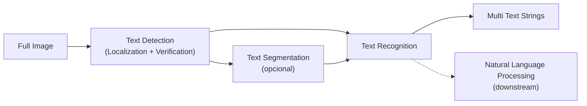
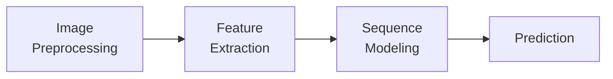
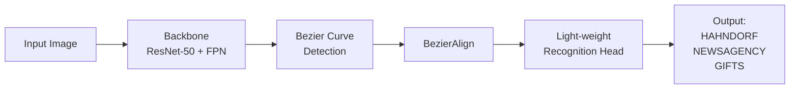

> **Recorrido de las 40 diapositivas** de la clase 21 del Diplomado IA UC (Miguel Fadic, mayo 2026). La clase atraviesa el problema de **leer texto en escenas naturales** — desde la motivación, las aplicaciones, el pipeline canónico en stages, los datasets y métricas, hasta el estudio profundo de **ABCNet (Liu et al. CVPR 2020)** como caso de estado del arte que integra detección anchor-free, curvas Bézier paramétricas y reconocimiento attention-based en un solo modelo end-to-end real-time.

---

## Today's schedule

El profesor organiza la clase en seis estaciones numeradas (slide 2):

| # | Sección | Slides aprox |
|---|---|---|
| 01 | What is Scene Text Recognition? | 3 |
| 02 | Applications | 4 |
| 03 | Stages | 5-8 |
| 04 | Datasets | 9-13 |
| 05 | Evaluation | 14-17 |
| 06 | ABCNet | 18-37 |

---

## 1. ¿Qué es Scene Text Recognition?

### 1.1 Definición

Scene Text Recognition (STR) es la **detección y lectura de texto en escenas naturales** — fotos del mundo real con texto incrustado en señalizaciones, vitrinas, productos, vehículos, edificios, ropa — en contraposición al **Optical Character Recognition (OCR) clásico**, que opera sobre **documentos escaneados** (PDFs, libros, formularios) con layout conocido y fondo plano.

El slide del profesor muestra el ejemplo de la señalización **"MALIBU — 27 MILES OF SCENIC BEAUTY"** sobre madera curvada y fondo azul, con bounding boxes detectando cada palabra independientemente con scores de confianza.


La diferencia entre OCR y STR **no es una mejora incremental** — es un problema cualitativamente distinto. OCR clásico (Tesseract de los 90s sobre documentos limpios) puede ignorar la variabilidad de fondo, fuente y orientación. STR no puede.


### 1.2 STR vs OCR scanned documents

El profesor contrasta los dos paradigmas con un slide visual (slide 5):

| Eje | OCR documentos | Scene Text Recognition |
|---|---|---|
| **Fondo** | Blanco, contraste alto | Cualquier textura, color, patrón |
| **Layout** | Filas/columnas conocidas | Aleatorio, sin garantías |
| **Iluminación** | Uniforme | Sombras, reflejos, contraluz |
| **Fuente** | Times/Arial limpia | Decorativa, manuscrita, deformada |
| **Orientación** | Horizontal | Rotada, curvada, perspectiva |
| **Tamaño** | Aproximadamente constante | Varía de 5 px a 5000 px |

### 1.3 Challenges concretos

El slide 6 desglosa los retos en tres categorías de problemas:

- **Background**:
  - El texto puede aparecer sobre **cualquier superficie** (vidrio, madera, tela, asfalto, piel).
  - La **textura del fondo** puede asemejarse al texto (graffiti sobre ladrillos, letras blancas sobre nieve).
- **Form** (la forma del texto):
  - **Múltiples colores** dentro de la misma palabra (logo multicolor).
  - **Fuentes irregulares** (decorativas, handwritten, neón).
  - **Tamaños distintos** dentro de la misma imagen.
  - **Orientaciones diversas** — vertical, curvada, perspectiva.
- **Noise**:
  - **Iluminación no uniforme** (parcialmente en sombra).
  - **Baja resolución** (lejano en la imagen).
  - **Motion blurring** (foto en movimiento, vehículo en carretera).

Estos tres ejes definen el espacio de dificultad. Para profundizar la taxonomía formal del campo ver [el survey de Chen et al. (2020)](/papers/text-recognition-wild-chen-2020) y el fundamento [Scene Text Recognition](/fundamentos/scene-text-recognition).

---

## 2. Applications

El profesor enumera cinco aplicaciones canónicas (slide 4):

- **Conducción autónoma**: lectura de señalización vial (límites de velocidad, indicaciones de carretera, mensajes variables en pantallas LED).
- **Multimedia retrieval**: indexar imágenes y videos por el texto que contienen — búsqueda "fotos con 'pizza' en el cartel".
- **Digitización de manuscritos**: documentos históricos con texto sobre páginas envejecidas, OCR ya no aplica.
- **Realidad Aumentada**: traducir texto en tiempo real (Google Translate camera mode), agregar anotaciones contextuales sobre objetos en una escena.
- **Asistencia a personas con discapacidad visual**: dispositivos que leen el mundo en voz alta (señalización, etiquetas de productos, menús).

A esto se suman aplicaciones en **e-commerce** (extraer texto de imágenes de productos), **industrial inspection** (números de serie en componentes, códigos en cajas), y **moderación de contenido** (detectar texto dentro de memes o imágenes en redes sociales).

---

## 3. Stages — el pipeline canónico

### 3.1 Diagrama de bloques

El slide 7 muestra el pipeline general:



Tres bloques obligatorios:

1. **Text Detection**: dada la imagen completa, **localizar** y **verificar** las instancias de texto. Output: bounding boxes (o polygons) con scores de confianza.
2. **Text Segmentation (opcional)**: refinar la región del texto a **máscara pixel-level**. Mejora alineación pero es costosa.
3. **Text Recognition**: dada una región rectificada (o un crop con la curva), **predecir el string** de caracteres. Vocabulario abierto.

El profesor enfatiza que el bloque NLP downstream es secuencial — una vez reconocido el texto, puede pasarse a tareas de comprensión semántica, traducción, búsqueda, etc.

### 3.2 Text Recognition en detalle — 4 sub-stages

El slide 8 zooma en la etapa de Recognition con un diagrama de 4 columnas que el profesor llamó la "anatomía estándar" del recognizer (replicada en la práctica totalidad de papers post-2015):



| Sub-stage | Métodos representativos |
|---|---|
| **Image Preprocessing** | Background removal · Text image Super-Resolution · Rectification networks (STN, TPS) |
| **Feature Extraction** | CNNs: VGGNet · Complex CNNs: ResNet, DenseNet · Recursive CNN, Gated recurrent convolution, Binary convolution, CNN+attention |
| **Sequence Modeling** | RNN (BiLSTM) · CNN (sliding window) · Transformer |
| **Prediction** | CTC (Connectionist Temporal Classification) · Attention mechanism |

#### 3.2.1 Image Preprocessing

El objetivo es **rectificar** el texto antes de pasarlo al recognizer. Si el texto está curvado, en perspectiva o en baja resolución, la idea es **normalizarlo** a un formato canónico (horizontal, recto, resolución estándar).

Los métodos canónicos son:

- **Spatial Transformer Networks (STN)** — Jaderberg et al. NeurIPS 2015. Módulo diferenciable que aprende una transformación afín, proyectiva o TPS sólo con la pérdida de la tarea final. Ver [paper](/papers/stn-jaderberg-2015) y [fundamento](/fundamentos/scene-text-recognition).
- **Thin Plate Spline (TPS)** — variante de STN especialmente útil para curved text. Usado en ASTER (Shi 2018) y MORAN (Luo 2019).
- **GAN-based background removal** — métodos generativos que aíslan el texto del fondo.
- **Text image super-resolution** — agrandar texto pequeño antes del recognizer.

#### 3.2.2 Feature Extraction

Extrae representaciones visuales densas del crop del texto. Las opciones canónicas son:

- **VGG-like** (VGGNet, Simonyan 2014): backbone simple con conv 3×3 apiladas.
- **ResNet / DenseNet** (He 2015, Huang 2017): residual / dense connections para profundidad.
- **Recursive CNN / Gated Recurrent Convolution**: variantes que comparten parámetros entre layers para reducir tamaño del modelo.
- **CNN + Attention internamente**: feature maps modulados por attention espacial.

El output típico es un **feature map** $(C, H', W')$ donde $H' = 1$ (altura colapsada) — la imagen del texto se "aplana" a una secuencia horizontal.

#### 3.2.3 Sequence Modeling

Convierte la secuencia de vectores de feature en una secuencia de **representaciones contextualizadas** (cada timestep ve a sus vecinos):

- **RNN — BiLSTM**: bidireccional, captura contexto izquierda-derecha y derecha-izquierda. Estándar en CRNN (Shi 2015) y descendientes. Ver [paper](/papers/crnn-shi-2017) y [fundamento](/fundamentos/lstm-gru).
- **CNN (sliding window)**: convoluciones 1D sobre la secuencia — paralelizable pero contexto local limitado.
- **Transformer**: self-attention global. Adoptado en NRTR (Sheng 2019), TrOCR (2021), PARSeq (2022). Ver [Clase 14](/clases/clase-14).

#### 3.2.4 Prediction

Transforma la secuencia contextualizada en el **string final**:

- **CTC (Connectionist Temporal Classification)** — Graves et al. ICML 2006. Permite entrenar sin alineamiento explícito frame↔carácter. El "blank symbol" y el forward-backward DP. Ver [paper](/papers/ctc-graves-2006) y [fundamento](/fundamentos/ctc-loss).
- **Attention mechanism** — decoder LSTM/Transformer con attention sobre el encoder. Bahdanau-style. Cada output character genera su propio context vector.


**CTC vs Attention** — CTC es paralelo, simple y rápido, pero asume independencia condicional entre frames. Attention captura dependencias de output pero es secuencial (inference autoregresiva, más lento). Decisión típica: CTC para texto regular alineable, attention para texto irregular o tareas que requieren modelado lingüístico. ABCNet (la estrella de esta clase) **usa attention**, no CTC.


---

## 4. Datasets

### 4.1 Ejes de clasificación

El slide 9 organiza el universo de datasets por tres ejes:

- **Origin**: Realistic (fotos del mundo) vs Synthetic (generados sintéticamente).
- **Form of text**: Regular (horizontal, alineado) vs Irregular (curvado, perspectiva).
- **Script**: Latin · Chinese · ... · Multilingual.

### 4.2 Synthetic datasets (slide 10)

El profesor muestra ejemplos visuales de los cuatro datasets sintéticos canónicos:

| Dataset | Tamaño | Característica |
|---|---|---|
| **Synth90k** (Jaderberg 2014) | ~9M imágenes | Word-level crops sobre fondos arbitrarios — el dataset que abrió el deep learning de STR |
| **SynthText** (Gupta 2016) | ~6M imágenes | Texto compuesto sobre fondos completos respetando depth/orientation |
| **Verisimilar Synthesis** (Zhan 2019) | ~5M imágenes | Synthesis más realista con ground geometry |
| **UnrealText** (Long 2020) | ~12M imágenes | Sintético con motor 3D Unreal Engine — escenas hiperrealistas |

Los sintéticos resuelven el cuello de botella histórico de STR: **la annotation manual es carísima**. 9 millones de imágenes annotadas a mano serían infactibles. Synth90k cambió el juego.

### 4.3 Realistic regular latin datasets (slide 11)

Cinco datasets que el campo usa como benchmarks canónicos:

| Dataset | Año | Imágenes (train/test) | Instances |
|---|---|---|---|
| **IIIT5K** (Mishra 2012) | 2012 | 380 / 740 | 5,000 |
| **SVT** (Wang 2010) | 2010 | 100 / 250 | 725 |
| **IC03** (Lucas 2003) | 2003 | 258 / 251 | 2,268 |
| **IC13** (Karatzas 2013) | 2013 | 420 / 141 | 5,003 |
| **SVHN** (Netzer 2011) | 2011 | 573,968 / 26,032 | 600,000 |

SVHN (Street View House Numbers) es **dígito-only** — un sub-problema de STR que muchas veces se usa como toy benchmark.

### 4.4 Realistic irregular latin datasets (slide 12)

La era del texto **curvado** y **multi-oriented**:

| Dataset | Año | Característica |
|---|---|---|
| **SVT-P** (Quy Phan 2013) | 2013 | Street View Text Perspective — vista lateral severa |
| **CUTE80** (Risnumawan 2014) | 2014 | 80 imágenes curvadas |
| **IC15** (Karatzas 2015) | 2015 | Annotation quadrilateral, multi-oriented |
| **COCO-Text** (Veit 2016) | 2016 | 63k images sobre COCO con annotations text |
| **Total-Text** (Ch'ng 2017) | 2017 | 1555 images, **polygon N-points**, primer dataset focado en curved | ([paper](/papers/total-text-chng-2017)) |

### 4.5 Datasets multilingual + chinese (slide 13 — tabla resumen)

El profesor muestra una tabla resumen (extraída del survey de Chen et al. 2020) con los datasets chinos y multilingües:

| Dataset | Idioma | Imágenes train/test | Type |
|---|---|---|---|
| RCTW-17 | Chinese/English | 11,514 / 1,000 | Regular |
| MTWI | Chinese/English | 10,000 / 10,000 | Regular |
| CTW | Chinese/English | 25,887 / 3,269 | Regular |
| **CTW-1500** | Chinese/English | 1,000 / 500 | **Irregular** (curved chinese) |
| LSVT | Chinese/English | 30,000 / 20,000 | Irregular |
| ArT | Chinese/English | 5,603 / 4,563 | Irregular |
| ReCTS-25k | Chinese/English | 20,000 / 5,000 | Irregular |
| **MLT** | Multilingual | 10,000 / 10,000 | Regular |

CTW-1500 y Total-Text son los dos benchmarks principales para **curved text spotters** modernos como ABCNet.

---

## 5. Evaluation

### 5.1 Text Detection (slide 14)

El estándar del campo:

$$\text{Precision} = \frac{TP}{TP + FP}, \quad \text{Recall} = \frac{TP}{TP + FN}$$

$$\text{Hmean} = \frac{2 \cdot \text{Precision} \cdot \text{Recall}}{\text{Precision} + \text{Recall}}$$

donde **TP, FP y FN** se computan según el **IoU (Intersection over Union)** del bounding box (o polygon) predicho con el ground truth. Típicamente $\text{IoU} \geq 0.5$ es TP.

Para detalles del IoU como métrica y como loss, ver [GIoU paper](/papers/giou-rezatofighi-2019) y el fundamento [detección de objetos](/fundamentos/deteccion-de-objetos).

### 5.2 Text Recognition (slide 15)

Dos métricas estándar:

**Word Recognition Accuracy (WRA)**:

$$\text{WRA} = \frac{W_r}{W}$$

donde $W$ = total de palabras y $W_r$ = palabras correctamente reconocidas (string-level match exacto).

**Normalized Edit Distance (NED)**:

$$\text{NED} = \frac{1}{N} \sum_{i=1}^{N} \frac{D(s_i, \hat{s}_i)}{\max(l_i, \hat{l}_i)}$$

donde $D(\cdot, \cdot)$ es la **distancia de Levenshtein** (edit distance), $s_i$ es el texto predicho, $\hat{s}_i$ el ground truth, $l_i$ y $\hat{l}_i$ las longitudes.

NED es más **gradual** que WRA: WRA da 0 a `"HELLO"` cuando se predice `"HELL0"`, mientras NED da $1/5 = 0.2$ (un solo carácter mal).

### 5.3 Levenshtein distance (slide 16)

El slide muestra el ejemplo canónico:

```
   I N T E * N T I O N
   |   |   |   |   |
   * E X E C U T I O N
```

Cinco operaciones para transformar **"INTENTION"** en **"EXECUTION"**:

- `Delete(I)` al inicio.
- `Substitute(N→E)`.
- `Substitute(T→X)` (la T queda).
- `Substitute(E→C)`.
- `Insert(C)`.
- `Substitute(N→U)`.

Wait — el slide explícitamente dice **distance = 5**. Las operaciones son: una inserción de `C`, una eliminación de `I`, tres substituciones. Total: 5. La diagonal `T → T`, `I → I`, `O → O`, `N → N` (los últimos cuatro) son matches sin costo.

El algoritmo se implementa con **programación dinámica** $O(|s_1| \cdot |s_2|)$. Para más detalle ver el fundamento [Scene Text Recognition](/fundamentos/scene-text-recognition).

### 5.4 End-to-End (slide 17)

Mismas tres métricas que Detection (Precision/Recall/Hmean) pero **TP, FP y FN se computan combinando**:

- El **IoU** del bounding box predicho con el ground truth.
- El **valor del string** predicho con el ground truth.

Para que una predicción sea TP, AMBAS condiciones deben cumplirse — la caja debe solaparse suficiente Y el string debe coincidir. Esto es más exigente que evaluar detection y recognition por separado.

Variantes del protocolo:

- **None**: sin lexicon — el modelo debe predecir el string libre.
- **Weak / Strong / Full**: con lexicon de longitud creciente — el modelo elige del vocabulario cerrado.

ABCNet reporta resultados en Total-Text con dos modos:

- **None** (lexicon-free): F-measure 69.5 (ABCNet-MS).
- **Full** (con lexicon completo del dataset): F-measure 78.4 (ABCNet-MS).

---

## 6. ABCNet — el caso de estudio profundo

### 6.1 Contexto y motivación (slide 18)

**ABCNet: Adaptive Bezier-Curve Network** — Liu, Chen, Bian, Shen & Liu (CVPR 2020, oral). Es el paper estrella de la clase porque integra **todo** el material anterior en un solo modelo end-to-end real-time. Sus contribuciones centrales:

1. **Representación de texto curvado con curvas Bézier cúbicas** — sólo 4 puntos de control por lado (8 puntos totales) para describir cualquier forma de texto natural.
2. **BezierAlign** — generalización de RoIAlign que muestrea features a lo largo de la curva, no sobre un rectángulo.
3. **Backbone anchor-free** (FCOS-based) que regresa los 8 puntos de control como heads adicionales.
4. **Real-time**: 22.8 FPS en single-scale, 17.9 FPS en multi-scale.

El slide muestra el pipeline completo: imagen → backbone con detección Bezier → BezierAlign → light-weight recognition head → output `HAHNDORF NEWSAGENCY GIFTS`.

### 6.2 Comparación con métodos previos (slide 19)

El slide 19 ("ABCNet Comparison") muestra una tabla con 9 métodos previos (Li et al. ICCV 2017, He CVPR 2018, Liu CVPR 2018, Liao ECCV 2018, Sun ACCV 2018, Qin ICCV 2019, Xing ICCV 2019, Feng ICCV 2019) más **(i) Ours = ABCNet**.

Las distinciones clave:

- Annotation usada (`W` word-level, `R` recognition, `C` character-level).
- Capacidad de detectar texto **horizontal / quadrilateral / arbitrary-shape**.
- Si tiene **grouping** explícito (post-process para juntar componentes).

ABCNet es el primero que combina **arbitrary shape detection + lightweight RoI (BezierAlign) + no grouping needed**.

### 6.3 Cubic Bezier curve (slide 20)

El profesor introduce la matemática de Bézier:

$$c(t) = \sum_{i=0}^{n} b_i \cdot B_{i,n}(t), \quad 0 \leq t \leq 1$$

$$B_{i,n}(t) = \binom{n}{i} t^i (1-t)^{n-i}, \quad i = 0, \ldots, n$$

donde:

- $b_i$ son los **puntos de control**.
- $B_{i,n}(t)$ son los **polinomios de Bernstein** de grado $n$.
- $t \in [0, 1]$ es el parámetro de la curva.

Para **cúbica** ($n = 3$):

$$c(t) = (1-t)^3 b_0 + 3(1-t)^2 t \cdot b_1 + 3(1-t) t^2 b_2 + t^3 b_3$$

Cuatro puntos de control $b_0, b_1, b_2, b_3$. El slide muestra dos ejemplos visuales — uno con curvatura suave y otro con curvatura severa — ambos capturados por 4 puntos. El profesor cierra con:

> **4 control points are enough to describe most of irregular scene texts.**

Para profundizar la matemática de Bézier ver el [fundamento dedicado](/fundamentos/bezier-curves) y la sección 1 de [profundización](/clases/clase-21/profundizacion).

### 6.4 Bezier curve completa (slide 21)

El slide muestra el caso general con la fórmula desplegada y el polígono de control conectando $P_0, P_1, P_2, P_3$. La curva resultante (en negro) atraviesa $P_0$ y $P_3$ pero **no necesariamente** los puntos intermedios — éstos sólo "tiran" de la curva.

### 6.5 Polygon annotation vs Bezier (slide 22)

El slide compara las dos annotations sobre la imagen del logo **"FIRESTONE"** (curvado en arco):

- **Polygon annotation**: el polígono manual debe seguir el contorno del texto con **14-16 vértices** colocados a mano por la persona que etiqueta. Annotation lenta y subjetiva.
- **Bezier annotation**: sólo **8 puntos** (4 para curva superior, 4 para curva inferior). Más rápido, más consistente.

El insight crítico: aun con menos puntos, **la fidelidad de representación es comparable** porque la curva continua interpola entre los puntos de control.

### 6.6 Bezier annotation (slide 23)

El slide muestra una caja de cerillas vintage **"CALKINS-FLETCHER DRUG CO. / DRUGS-KODAKS / CANDY AND SODAWATER / ANN ARBOR-MICH."** con cada palabra annotada con curvas Bézier rojas. La caja tiene texto vertical y diagonal — Bézier maneja ambos.

### 6.7 Full pipeline (slide 24)

Diagrama end-to-end:



Cuatro bloques clave: backbone, detection con regression de control points, alineación geométrica, recognition.

### 6.8 Backbone + FPN + RPN — FCOS based (slide 25)

ABCNet usa **FCOS** (Tian et al. ICCV 2019) como detector base. La estructura:

- **C3-C5**: feature maps del ResNet-50 backbone.
- **FPN top-down** + **lateral connections**: produce P3-P7.
- **Cada nivel del FPN tiene 5 heads** que comparten arquitectura:
  - **Center-ness**: $H \times W \times 1$ — qué tan central es cada location.
  - **Bounding Box Regression**: $H \times W \times 4$ — offsets $(l, t, r, b)$ al bbox.
  - **Control Points Regression**: $H \times W \times 16$ — los 8 control points × 2 coords cada uno.
  - **Classification**: $H \times W \times 1$ — texto / no-texto.

Para detalles de FCOS ver [el paper](/papers/fcos-tian-2019) y el fundamento [anchor-free detection](/fundamentos/anchor-free-detection).

### 6.9 Regression losses (slide 26)

ABCNet entrena con tres losses geométricas + clasificación:

- **Bounding Box** → **IoU Loss** (sobre el bbox axis-aligned que envuelve la curva).
- **Center-ness** → **Binary Cross Entropy** sobre el target soft de FCOS.
- **Control Points** → **Smooth L1** (Huber loss) sobre las 16 coordenadas regresadas.

El slide muestra:

- Bounding box rojo sobre la imagen de FIRESTONE.
- Heatmap radial de center-ness.
- Puntos de control marcados sobre la curva.

### 6.10 Before pooling — NMS (slide 27)

Antes de aplicar BezierAlign, ABCNet hace **Non-Maximum Suppression** sobre las propuestas:

> Application of NMS to proposals  
> Far from center proposals are usually of lower quality than close to center ones  
> **Score of proposal is multiplied by the predicted center-ness. This greatly improves the results.**

Este es el truco central de FCOS exportado a STR: el centerness se usa como multiplicador del score de classification antes de NMS. Las predicciones de los bordes del texto (más ambiguas) reciben penalización automática.

### 6.11 BezierAlign (slide 28)

El slide muestra tres opciones de sampling sobre la imagen del logo "TIRES" (curvado):

| Método | Descripción | Forma del sample |
|---|---|---|
| (a) Horizontal sampling | Grid axis-aligned tradicional | Rectángulo recto |
| (b) Quadrilateral sampling | Grid quadrilateral | Trapecio |
| **(c) BezierAlign** | Grid a lo largo de la curva | Curva (sigue el texto) |

BezierAlign muestrea features **a lo largo de la curva**, no sobre un rectángulo. Si el texto está curvado, el sample preserva la geometría intrínseca — el recognizer ve un "texto rectificado" sintético sin necesidad de STN/TPS.

### 6.12 Attention-based recognizer (slide 29)

El recognizer de ABCNet es **attention-based encoder-decoder** (no CTC):

**Encoder** (sobre el feature aligned por BezierAlign):

- ConvNet → BLSTM → secuencia de hidden states $\{h_1, \ldots, h_n\}$.

**Decoder** (LSTM autoregresivo):

- Attention de Bahdanau:
  $$e_{t,i} = \mathbf{w}^\top \tanh(\mathbf{W} \mathbf{s}_{t-1} + \mathbf{V} \mathbf{h}_i + \mathbf{b})$$
  $$\alpha_{t,i} = \frac{\exp(e_{t,i})}{\sum_{i'=1}^{n} \exp(e_{t,i'})}$$
  $$\mathbf{g}_t = \sum_{i=1}^{n} \alpha_{t,i} \mathbf{h}_i$$
  $$(\mathbf{x}_t, \mathbf{s}_t) = \text{rnn}(\mathbf{s}_{t-1}, (\mathbf{g}_t, f(y_{t-1})))$$
  $$p(y_t) = \text{softmax}(\mathbf{W}_o \mathbf{x}_t + b_o)$$
  $$y_t \sim p(y_t)$$

El profesor enfatiza que cada caracter de output genera su propio context vector $\mathbf{g}_t$ — esto permite que el decoder atienda a regiones distintas del feature aligned para distintos caracteres. Para más sobre attention ver la [Clase 15](/clases/clase-15) y el fundamento [mecanismo de atención](/fundamentos/mecanismo-atencion).

### 6.13 Recognition loss (slide 30)

**Cross-entropy** sobre cada caracter:

- Cada símbolo del alfabeto es una clase.
- Dos clases extras:
  - **Unseen character**: para chars fuera del vocabulario.
  - **End of Sequence `<EOS>`**: marca el fin del string predicho.

La referencia [5] del slide es Olah et al. "Feature Visualization", Distill 2017 — el profesor lo cita como contexto general de interpretabilidad de CNN features, no como componente directo del modelo.

### 6.14 Full pipeline revisitado (slide 31)

Mismo diagrama del slide 24, repetido para cerrar la sección de arquitectura.

### 6.15 Training datasets (slide 32)

ABCNet se entrena con la combinación:

- **15k imágenes de COCO-Text** (real, irregular).
- **7k imágenes de ICDAR-MLT** (real, multilingüe).
- **150k imágenes sintetizadas** (con curved + multi-oriented text sobre escenas).

El slide muestra dos ejemplos de imágenes sintéticas: una manta raya con texto curvado superpuesto, y un robot Optimus Prime sobre playa con anuncios. Las annotations sintéticas se generan ajustando Bezier curves a polygons sintéticos via least-squares.

### 6.16 Quantitative results on Total-Text (slide 33)

El slide reproduce la Tabla 3 del paper. Resumen:

| Método | Backbone | F-measure (None) | F-measure (Full) | FPS |
|---|---|---|---|---|
| TextBoxes | ResNet-50-FPN | 36.3 | 48.9 | 1.4 |
| Mask TextSpotter '18 | ResNet-50-FPN | 52.9 | 71.8 | 4.8 |
| Mask TextSpotter '19 | ResNet-50-FPN | 65.3 | 77.4 | 2.0 |
| Qin et al. | ResNet-50-MSF | 67.8 | — | 4.8 |
| **ABCNet-F** (single-scale) | ResNet-50-FPN | 61.9 | 74.1 | **22.8** |
| **ABCNet** | ResNet-50-FPN | 64.2 | 75.7 | 17.9 |
| **ABCNet-MS** (multi-scale) | ResNet-50-FPN | **69.5** | **78.4** | 6.9 |

Tres observaciones del profesor:

- **ABCNet-MS gana en F-measure** sobre todos los métodos previos (69.5 vs 65.3 del Mask TextSpotter '19).
- **ABCNet-F es 11× más rápido** que Mask TextSpotter '19 (22.8 FPS vs 2.0 FPS) con accuracy comparable.
- El **trade-off precision/speed** es ajustable vía single-scale vs multi-scale inference.

### 6.17 Qualitative results (slide 34)

Dos ejemplos visuales:

- **Plaque de Alan Turing**: "ALAN TURING 1912-1954 Code breaker, Pioneer Computer Science, Born here" — texto circular sobre disco azul.
- **Cartel Arby's**: "Arby's ROAST BEEF SANDWICH" — texto sobre cartel rojo con borde dorado.

Cada palabra detectada con caja Bezier roja + score de confianza. El modelo lee correctamente texto curvado severo (placa circular) y multi-orientado (cartel inclinado).

### 6.18 Bezier Align contribution — qualitative (slides 35-36)

Dos comparaciones lado a lado:

- **TELEPHONE** sobre disco curvado:
  - Quadrilateral warping → reconoce `KtYS` (falla).
  - BezierAlign warping → reconoce `TELEPHONE` (acierta).
- **PEACHTREE** sobre cartel oval:
  - Quadrilateral warping → reconoce `PEMEPREE` (falla).
  - BezierAlign warping → reconoce `PEACHTREE` (acierta).

El profesor remarca que la diferencia **no está en el recognizer** sino en la **alineación previa**. Si el feature aligned está distorsionado, ni el mejor recognizer salva la lectura.

### 6.19 Bezier Align contribution — quantitative (slide 37)

Tabla con sampling method × F-measure:

| Sampling method | F-measure (%) |
|---|---|
| Horizontal | 38.4 |
| Quadrilateral | 44.7 |
| **BezierAlign** | **61.9** |

**+23.5 puntos F-measure** sobre Horizontal — el delta más grande de todas las ablations del paper. BezierAlign es la contribución algorítmica fundamental.

### 6.20 ¿Cuán caro es BezierAlign? (slide 38)

Tabla con métodos × inference time:

| Método | Inference time |
|---|---|
| Without Bezier curve detection | 22.8 FPS |
| With Bezier curve detection | 22.5 FPS |

**0.3 FPS de overhead** — casi gratis. La Bezier curve regression head (16 canales adicionales) y el sampling de BezierAlign no agregan compute significativo.

Esto contradice la intuición — uno esperaría que regresar 8 puntos de control y luego sampling no-rectangular sea costoso. La razón: la regression head es shallow (mismo costo que una bbox regression con más canales), y el bilinear sampling sobre la curva es paralelizable en GPU.

### 6.21 References (slide 39)

El profesor cita seis referencias:

1. **Chen, Jin, Yi, Lyu** — Text Recognition in the Wild: A Survey, arXiv 2020. ([análisis interno + site](/papers/text-recognition-wild-chen-2020))
2. **Liu, Chen, Bian, Shen, Liu** — ABCNet (CVPR 2020). ([análisis](/papers/abcnet-liu-2020))
3. **Rezatofighi, Tsoi, Gwak, Sadeghian, Reid, Savarese** — Generalized IoU (CVPR 2019). ([análisis](/papers/giou-rezatofighi-2019))
4. **Tian, Shen, Chen, He** — FCOS (ICCV 2019). ([análisis](/papers/fcos-tian-2019))
5. **Girshick** — Fast R-CNN (ICCV 2015). ([análisis](/papers/fast-rcnn-girshick-2015))
6. **Ch'ng, Chan** — Total-Text (ICDAR 2017). ([análisis](/papers/total-text-chng-2017))

El curso complementa esta lista con tres papers canónicos no citados directamente pero esenciales:

- **Shi, Bai, Yao** — CRNN (TPAMI 2017). El baseline universal de scene text recognition. ([análisis](/papers/crnn-shi-2017))
- **Graves, Fernández, Gomez, Schmidhuber** — CTC (ICML 2006). El paper que hace posible entrenar RNNs sobre secuencias no segmentadas. ([análisis](/papers/ctc-graves-2006))
- **Jaderberg, Simonyan, Zisserman, Kavukcuoglu** — Spatial Transformer Networks (NeurIPS 2015). El módulo diferenciable de transformación espacial detrás de ASTER/MORAN. ([análisis](/papers/stn-jaderberg-2015))

---

## Cierre

La clase 21 atraviesa Scene Text Recognition desde la motivación (por qué es distinto del OCR clásico) hasta el estado del arte 2020 (ABCNet). La línea conectora:

1. STR es un problema cualitativamente distinto del OCR — variabilidad de fondo, forma y ruido.
2. La industria converge sobre un **pipeline canónico de 4 stages** (preprocessing → feature extraction → sequence modeling → prediction).
3. Los **datasets sintéticos** (Synth90k, SynthText) democratizaron el deep learning de STR.
4. Las **métricas WRA y NED** miden recognition; **F-measure con IoU** mide detection; **end-to-end** combina ambos con string matching + lexicon modes.
5. **ABCNet** unifica todo en un modelo real-time, anchor-free, con Bézier curve representation, BezierAlign sampling y attention recognizer.

Para profundizar la matemática (Bézier, BezierAlign sampling, attention decoder, CTC vs attention, IoU losses, FCOS centerness, Levenshtein DP) ver la página de [profundización](/clases/clase-21/profundizacion).

Para la implementación práctica (notebook ejecutado, experimentos en Total-Text), ver [el Laboratorio 21](/laboratorios/lab-21).
