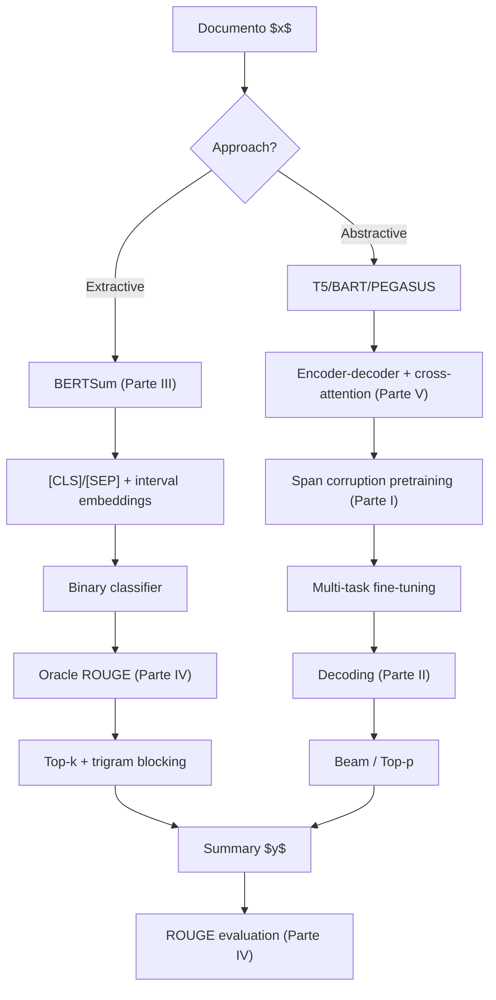

> Math riguroso que sustenta la clase 22. Cinco partes: (I) **T5 — text-to-text framework y span-corruption**, (II) **decoding strategies** — greedy, beam, top-k, top-p, temperature, (III) **BERTSum extractive model** — oracle ROUGE y trigram blocking, (IV) **ROUGE family** completa — N, L, W, S, SU con math y ejemplos, (V) **attention encoder-decoder** y cross-attention.

---

## Parte I — T5: text-to-text framework

### I.1 Formulación unificada

T5 propone que todas las tareas NLP se reformulen como **input texto → output texto** con un prefijo de tarea:

| Tarea | Input (con prefijo) | Output |
|---|---|---|
| Translation | `"translate English to German: That is good."` | `"Das ist gut."` |
| Sentiment | `"cola sentence: The course is jumping well."` | `"not acceptable"` |
| Similarity | `"stsb sentence1: ... sentence2: ..."` | `"3.8"` |
| Summarization | `"summarize: state authorities dispatched emergency crews..."` | `"six people hospitalized after a storm in attala county."` |
| QA | `"question: What is the capital? context: ..."` | `"Berlin"` |

**Loss única** — cross-entropy autoregresivo en el target:

$$\mathcal{L}_{\text{T5}}(\theta) = -\sum_{(x, y) \in \mathcal{D}} \sum_{t=1}^{|y|} \log P_\theta(y_t | x, y_{<t})$$

Esto elimina la necesidad de heads específicos por tarea. Toda la "especialización" vive en el prefijo y en los pesos compartidos.

### I.2 Span-corruption objective

El pretraining unsupervised de T5 enmascara **spans contiguos** (no tokens individuales como BERT MLM).

**Proceso**:

1. Tomar un texto del corpus C4.
2. Seleccionar el 15% de los tokens para corromper.
3. Agrupar los tokens seleccionados en **spans contiguos** (average length 3).
4. Cada span se reemplaza por un **sentinel único** `<X>`, `<Y>`, `<Z>`, ...
5. El target es la concatenación: `<X>` + span_X + `<Y>` + span_Y + ... + `<Z>` (final sentinel).

**Ejemplo** del slide 38 del PDF:

```
Original:  Thank you for inviting me to your party last week
Inputs:    Thank you <X> me to your party <Y> week
Targets:   <X> for inviting <Y> last <Z>
```

**Loss** sobre el target:

$$\mathcal{L}_{\text{span}}(\theta) = -\sum_{(x, y_{\text{span}}) \in \mathcal{D}} \sum_{t=1}^{|y_{\text{span}}|} \log P_\theta(y_t | x_{\text{corrupted}}, y_{<t})$$

**¿Por qué spans, no tokens individuales como BERT?**

- **Spans contiguos** son más naturales — capturan relaciones léxicas (`"for inviting"` vs `"for"` y `"inviting"` por separado).
- **Más eficiente computacionalmente** — el target tiene menos tokens que la suma de tokens enmascarados con sentinels individuales.
- **Más alineado con downstream generation** — el modelo aprende a generar trozos de texto coherentes.

### I.3 Multi-task fine-tuning

Post-pretraining, T5 hace **fine-tuning multi-task supervised** sobre:

- **CNN/DM** (summarization).
- **GLUE** (8 tareas).
- **SuperGLUE** (8 tareas más difíciles).
- **SQuAD** (extractive QA).
- **WMT** EN-DE, EN-FR, EN-RO (translation).

**Sampling strategy**:

- **Examples-proportional**: $p_t = N_t / \sum_{t'} N_{t'}$ donde $N_t$ es el tamaño del dataset $t$.
- **Temperature-scaled**: $p_t = N_t^{1/T} / \sum_{t'} N_{t'}^{1/T}$ con $T = 2-4$. Suaviza la dominancia de datasets grandes.
- T5 usa temperature-scaled con $T = 2.0$ por defecto.

### I.4 Resultados de scaling

| Modelo | Params | CNN/DM R-1 | R-2 | R-L |
|---|---|---|---|---|
| T5-Small | 60M | 41.12 | 19.56 | 38.35 |
| T5-Base | 220M | 42.05 | 20.34 | 39.40 |
| T5-Large | 770M | 42.50 | 20.68 | 39.75 |
| T5-3B | 3B | 42.72 | 21.02 | 39.94 |
| **T5-11B** | 11B | **43.52** | **21.55** | **40.69** |

El delta Small → 11B es ~2.4 puntos ROUGE-1 — scaling helps pero con retornos decrecientes. Para profundizar T5 ver [el paper](/papers/t5-raffel-2020) y el fundamento [t5-encoder-decoder](/fundamentos/t5-encoder-decoder).

---

## Parte II — Decoding strategies

### II.1 El setup formal

Un modelo autoregresivo produce, en cada paso $t$, una distribución $P(y_t | x, y_{<t})$ sobre el vocabulario $V$. El decoding algorithm $g$ convierte esta distribución en un token concreto:

$$\hat{y}_t = g(P(y_t | x, y_{<t}))$$

Hay esencialmente 5 familias de $g$ que cubre la clase.

### II.2 Greedy decoding

$$\hat{y}_t = \arg\max_{w \in V} P(y_t = w | x, y_{<t})$$

- **Complejidad**: $O(T \cdot |V|)$ — $T$ pasos × softmax sobre $|V|$.
- **Determinístico**.
- **Problema**: localmente óptimo, globalmente sub-óptimo. Atascado en bucles repetitivos en open-ended.

### II.3 Beam search

Mantener $k$ **beams** (candidate sequences) en cada paso. En el paso $t$:

1. Para cada beam $b_i$ con sequence parcial $y_{1:t-1}^{(i)}$ y log-prob acumulada $\log P_i$, computar la distribución sobre el siguiente token.
2. Expandir: candidatos $= \{(y_{1:t-1}^{(i)} \oplus w, \log P_i + \log P(y_t = w | x, y_{<t}^{(i)})) : i \in [k], w \in V\}$.
3. Mantener los $k$ candidatos con mayor log-prob acumulada.
4. Continuar hasta que todos los beams generen `<EOS>` o se alcance length máximo.

**Length normalization**: beam search prefiere outputs cortos porque $\log P$ es siempre negativa, y multiplicar log-probs (sumar log) acumula penalización con longitud. Compensar con:

$$\text{score}(y) = \frac{\log P(y | x)}{|y|^\alpha}, \quad \alpha \in [0.6, 1.0]$$

(Wu et al. 2016).

**Complejidad**: $O(T \cdot k \cdot |V|)$.

### II.4 Beam search en open-ended generation — el problema (Holtzman 2020)

Para tareas **constrained** (translation, summarization corta) beam search funciona bien. Para **open-ended generation** (continuación de texto, chatbot) **colapsa en repetición**:

```
"...la Universidad Nacional Autónoma de México (UNAM) y la Universidad
Nacional Autónoma de México (UNAM/Universidad Nacional Autónoma de
México/Universidad Nacional Autónoma de México/..."
```

**Razón formal**: cada repetición es individualmente probable según el modelo. La log-likelihood global del bucle es mayor que la de una continuación creativa. Beam search **maximiza** likelihood — atrapado en el bucle.

**Likelihood paradox**: el texto humano tiene perplexity **más alta** que el beam search output. Esto significa que los humanos **no escriben textos más probables** según el modelo — lo cual es semánticamente contraintuitivo. La realidad: maximum likelihood ≠ output deseable en open-ended.

### II.5 Pure (ancestral) sampling

$$\hat{y}_t \sim P(y_t | x, y_{<t})$$

Variabilidad alta. **Problema**: la **unreliable tail** de la distribución produce gibberish — tokens con $P \approx 10^{-5}$ son contextualmente inapropiados pero acumulados representan > 50% de la mass.

### II.6 Top-k sampling

Mantener solo los $k$ tokens más probables, renormalizar:

$$V^{(k)} = \text{top-}k \text{ tokens by } P$$

$$P'(x) = \begin{cases} P(x) / \sum_{x' \in V^{(k)}} P(x') & \text{si } x \in V^{(k)} \\ 0 & \text{en otro caso} \end{cases}$$

$$\hat{y}_t \sim P'$$

**Problema**: $k$ óptimo varía por contexto. En pasos confiados (distribución picuda), $k=10$ es generoso. En pasos ambiguos (distribución plana), $k=10$ es restrictivo y corta opciones válidas.

### II.7 Nucleus (top-p) sampling

**Holtzman 2020** propone reemplazar el tamaño fijo $k$ por una **masa acumulada** $p$:

$$V^{(p)} = \text{smallest set tal que } \sum_{x \in V^{(p)}} P(x) \geq p$$

Algoritmo:

1. Ordenar tokens por probabilidad descendente.
2. Computar CDF acumulada.
3. Cortar en el primer token cuya CDF acumulada alcance $p$.

$$P'(x) = \begin{cases} P(x) / \sum_{x' \in V^{(p)}} P(x') & \text{si } x \in V^{(p)} \\ 0 & \text{en otro caso} \end{cases}$$

$$\hat{y}_t \sim P'$$

**El tamaño del nucleus es dinámico** — se adapta al contexto. En pasos confiados, el nucleus puede ser de 1-3 tokens. En pasos ambiguos, de cientos.

Default $p = 0.95$. Estado del arte para open-ended generation.

### II.8 Temperature scaling

Modifica la sharpness de la distribución antes del sampling:

$$P_T(y_t = w) = \frac{\exp(u_w / T)}{\sum_j \exp(u_j / T)}$$

donde $u_w$ son los logits.

- $T < 1$: distribución **más concentrada** (más determinista).
- $T = 1$: distribución original.
- $T > 1$: distribución **más uniforme** (más random).
- $T \to 0$: equivalente a greedy.
- $T \to \infty$: equivalente a uniforme.

**Combinable con top-k y top-p** — son ortogonales. La práctica común en LLMs: temperature $\in [0.7, 1.0]$ + top-p $= 0.95$.

### II.9 Comparación práctica

| Strategy | Determinismo | Diversidad | Repetición | Best for |
|---|---|---|---|---|
| Greedy | Alto | Bajo | Alta | Tareas determinísticas (code, math) |
| Beam (k=4-8) | Alto | Bajo | Alta | Translation, summarization constrained |
| Pure sampling | Bajo | Muy alto | Bajo | Casi nunca |
| Top-k (k=40) | Medio | Medio | Medio | Storytelling pre-2020 |
| Top-p (p=0.95) | Medio | Alto | Bajo | **Default moderno** |
| Beam + LM penalty | Alto | Bajo | Bajo | Translation profesional |

Para profundización ver el [fundamento decoding-strategies](/fundamentos/decoding-strategies) y el [paper Nucleus Sampling](/papers/nucleus-sampling-holtzman-2020).

---

## Parte III — BERTSum (Extractive Model)

### III.1 BERT modificado para sentence-level encoding

BERT original procesa **una secuencia** y produce embeddings token-level. BERTSum necesita **embeddings sentence-level** sobre un **documento multi-oración**.

**Modificaciones de Yang Liu 2019**:

1. **Insertar `[CLS]` antes de cada oración** del documento (no solo al principio).
2. **`[SEP]` después de cada oración**.
3. **Interval segment embeddings** $E_A, E_B, E_A, E_B, \ldots$ alternantes — el modelo aprende a distinguir oración impar/par.

**Ejemplo** del slide 57 del PDF:

```
Input:    [CLS] my dog is cute [SEP] [CLS] he likes play ##ing [SEP]
Segments:  A    A   A   A  A   A     B     B  B     B    B    B
```

El embedding del `[CLS]_i` después de pasar por BERT es el **embedding** de la oración $i$ — llamémoslo $T_i$.

### III.2 Summary layer

Sobre los $T_i$ se aplica una capa que produce el score $\hat{y}_i \in [0, 1]$ por oración:

**Variante 1 — Linear classifier**:

$$\hat{y}_i = \sigma(W_o T_i + b_o)$$

**Variante 2 — Inter-sentence Transformer** (el ganador):

Stack de 2 layers de Transformer encoder sobre los $\{T_1, T_2, \ldots, T_n\}$:

$$\tilde{T}_i = \text{TransformerEncoder}(T_1, T_2, \ldots, T_n)_i$$

$$\hat{y}_i = \sigma(W_o \tilde{T}_i + b_o)$$

Esto permite que cada oración **vea las otras** antes de decidir si entra al summary. La variante con Transformer agrega ~3 puntos ROUGE-2 sobre Linear.

**Variante 3 — LSTM** sobre los $T_i$: similar pero menos efectivo.

### III.3 Oracle target construction

Los datasets de summarization dan summary $y^*$ (texto humano) pero no dan **labels per oración**. ¿Qué label asignar a cada oración del documento?

**Solución**: construir un **oracle** greedy que selecciona el subset de oraciones del documento que **maximiza ROUGE-2** con $y^*$.

**Algoritmo**:

```
G ← ∅  # set de oraciones seleccionadas
while True:
    best_s ← None
    best_rouge ← rouge_2(G, y*)
    for s in documento \ G:
        candidate_rouge ← rouge_2(G ∪ {s}, y*)
        if candidate_rouge > best_rouge:
            best_rouge ← candidate_rouge
            best_s ← s
    if best_s is None:
        break
    G ← G ∪ {best_s}
return G
```

Las oraciones $s \in G$ reciben label $y_s = 1$. El resto $y_s = 0$.

**Loss BCE**:

$$\mathcal{L}_{\text{BERTSum}}(\theta) = -\sum_{\text{doc} \in \mathcal{D}} \sum_{i=1}^{n_{\text{doc}}} y_i^{\text{oracle}} \log \hat{y}_i + (1 - y_i^{\text{oracle}}) \log (1 - \hat{y}_i)$$

### III.4 Inference — trigram blocking

En inference, simplemente tomar top-$k$ oraciones por score lleva a **redundancia**. Solución: **trigram blocking** (greedy):

```
G ← ∅
ranked_sentences ← sorted(documento, by ŷ_i, descending)
for s in ranked_sentences:
    if |G| >= k:
        break
    if no trigram of s is in trigrams(G):
        G ← G ∪ {s}
return G
```

Esto fuerza diversidad lexical — bigramas y trigramas no se repiten entre oraciones seleccionadas.

### III.5 Resultados CNN/DM

| Modelo | R-1 | R-2 | R-L |
|---|---|---|---|
| LEAD-3 (baseline) | 40.42 | 17.62 | 36.67 |
| Pointer-Generator | 39.53 | 17.28 | 36.38 |
| **BERTSum-Extractive (Transformer summary layer)** | **43.25** | **20.24** | **39.63** |

BERTSum supera el LEAD-3 baseline por ~3 puntos ROUGE-1 — el modelo agrega valor real sobre extraer las primeras 3 oraciones. Para más detalle ver [el paper](/papers/bertsum-liu-2019).

---

## Parte IV — ROUGE family

### IV.1 ROUGE-N

$$\text{ROUGE-N} = \frac{\displaystyle\sum_{S \in R} \sum_{\text{gram}_n \in S} \text{Count}_{\text{match}}(\text{gram}_n)}{\displaystyle\sum_{S \in R} \sum_{\text{gram}_n \in S} \text{Count}(\text{gram}_n)}$$

donde $R$ = set de reference summaries, y $\text{Count}_{\text{match}}(\text{gram}_n)$ es el número de n-gramas del reference que aparecen en el candidate.

**Crucial**: el denominador es **n-gramas del reference** (recall-oriented), no del candidate.

**Ejemplo (slide 50)**:

- Candidate: "I really loved reading the Hunger Games" (7 palabras, 6 bigramas).
- Reference: "I loved reading the Hunger Games" (6 palabras, 5 bigramas).

**ROUGE-1**:

- Match unigrams: I, loved, reading, the, Hunger, Games = 6.
- Recall = $6/6 = 1.0$.
- Precision = $6/7 \approx 0.857$.
- F1 = $12/13 \approx 0.923$.

**ROUGE-2**:

- Generated bigrams: (I, really), (really, loved), (loved, reading), (reading, the), (the, Hunger), (Hunger, Games).
- Reference bigrams: (I, loved), (loved, reading), (reading, the), (the, Hunger), (Hunger, Games).
- Match: (loved, reading), (reading, the), (the, Hunger), (Hunger, Games) = 4.
- Recall = $4/5 = 0.8$.
- Precision = $4/6 \approx 0.667$.
- F1 = $\frac{2 \cdot 0.8 \cdot 0.667}{0.8 + 0.667} \approx 0.727$.

### IV.2 ROUGE-L — Longest Common Subsequence

LCS no requiere contigüidad. Para nuestro ejemplo:

$$\text{LCS}(\text{candidate}, \text{reference}) = \text{"I loved reading the Hunger Games"} = 6$$

(las palabras del reference aparecen en orden dentro del candidate, intercaladas con "really").

**Math**:

$$R_{\text{LCS}} = \frac{\text{LCS}(C, R)}{|R|}, \quad P_{\text{LCS}} = \frac{\text{LCS}(C, R)}{|C|}$$

$$F_{\text{LCS}} = \frac{(1 + \beta^2) R_{\text{LCS}} P_{\text{LCS}}}{R_{\text{LCS}} + \beta^2 P_{\text{LCS}}}$$

Default $\beta = 1$ (F1 estándar).

Para nuestro ejemplo:

- $R_{\text{LCS}} = 6/6 = 1.0$.
- $P_{\text{LCS}} = 6/7 \approx 0.857$.
- $F_{\text{LCS}} = 12/13 \approx 0.923$.

**Algoritmo DP** ($O(|C| \cdot |R|)$):

```
def lcs_length(C, R):
    n, m = len(C), len(R)
    dp = [[0] * (m+1) for _ in range(n+1)]
    for i in range(1, n+1):
        for j in range(1, m+1):
            if C[i-1] == R[j-1]:
                dp[i][j] = dp[i-1][j-1] + 1
            else:
                dp[i][j] = max(dp[i-1][j], dp[i][j-1])
    return dp[n][m]
```

### IV.3 ROUGE-W — Weighted LCS

Penaliza LCS no-consecutivos. Usa $f(k) = k^2$ (premia bloques consecutivos):

$$\text{WLCS}(C, R) = \max \sum_i f(\text{len}_i)$$

donde $\text{len}_i$ son las longitudes de runs consecutivos del LCS.

**Ejemplo**: dos candidates que ambos tienen LCS de longitud 4 pero distinta consecutividad:

- $C_1$: bloques de [4] consecutivos → $f(4) = 16$.
- $C_2$: bloques de [1, 1, 1, 1] → $4 \cdot f(1) = 4$.

ROUGE-W premia $C_1$ sobre $C_2$. ROUGE-L no.

### IV.4 ROUGE-S — Skip-bigram

Skip-bigram = cualquier par de palabras en orden (no requiere contigüidad).

Para "I loved Hunger Games" (4 palabras), skip-bigrams son:

$$\binom{4}{2} = 6 \text{ pares}$$

(I, loved), (I, Hunger), (I, Games), (loved, Hunger), (loved, Games), (Hunger, Games).

**Math**:

$$\text{ROUGE-S} = \frac{\sum_{S \in R} \text{Count}_{\text{match}}^{\text{skip-bigram}}(C, S)}{\sum_{S \in R} \text{Count}^{\text{skip-bigram}}(S)}$$

**ROUGE-S$d_{\text{skip}}$**: limita el max gap entre palabras del skip-bigram.

### IV.5 ROUGE-SU — Skip-bigram + Unigram

Combina ROUGE-S con unigram counts — evita score 0 cuando no hay skip-bigram match pero sí palabras coincidentes.

### IV.6 Multi-reference scoring

Cuando hay múltiples references $R = \{R_1, \ldots, R_k\}$, ROUGE multi-reference toma **max** o **promedio** según convención.

**Jackknifing**: para cada subset $R \setminus \{R_j\}$, computar ROUGE; reportar promedio sobre los $k$ leave-one-out runs. Da estabilidad estadística con pocos references.

### IV.7 ROUGE-Lsum

Para multi-sentence summaries, ROUGE-L estándar (sobre texto concatenado) puede ser raro. **ROUGE-Lsum** computa LCS por oración del reference, luego agrega:

$$\text{ROUGE-Lsum} = \frac{\sum_{i} \text{LCS}_{\cup}(C, R_i)}{|R|}$$

HuggingFace `evaluate.load("rouge")` reporta ambos.

Para profundización ver [el fundamento ROUGE](/fundamentos/rouge-metric) y [el paper Lin 2004](/papers/rouge-lin-2004).

---

## Parte V — Encoder-decoder y cross-attention

### V.1 Recordatorio: arquitectura Transformer original

T5, BART y PEGASUS son todos **encoder-decoder Transformer**:

**Encoder**: stack de $N$ layers, cada uno:

$$\mathbf{H}^{(l+1)} = \text{LayerNorm}(\mathbf{H}^{(l)} + \text{MHA}(\mathbf{H}^{(l)}))$$
$$\mathbf{H}^{(l+1)} = \text{LayerNorm}(\mathbf{H}^{(l+1)} + \text{FFN}(\mathbf{H}^{(l+1)}))$$

donde MHA = multi-head self-attention (bidireccional, sin mask).

**Decoder**: stack de $N$ layers, cada uno con **3 sub-layers**:

1. **Masked self-attention** sobre los tokens generados $y_{<t}$ (causal mask).
2. **Cross-attention** sobre el encoder output.
3. **FFN**.

### V.2 Cross-attention — la pieza clave

La cross-attention conecta encoder y decoder. Formalmente:

$$\text{Attention}(Q, K, V) = \text{softmax}\left(\frac{QK^\top}{\sqrt{d_k}}\right) V$$

- **Queries** $Q$ vienen del decoder (token actual $y_t$).
- **Keys** $K$ y **Values** $V$ vienen del encoder (representación de $x$).
- El decoder **"atiende"** a las posiciones del encoder relevantes para predecir $y_t$.

Math LaTeX explícita:

$$Q = \mathbf{H}^{\text{dec}} W^Q, \quad K = \mathbf{H}^{\text{enc}} W^K, \quad V = \mathbf{H}^{\text{enc}} W^V$$

$$\text{CrossAttn}(\mathbf{H}^{\text{dec}}, \mathbf{H}^{\text{enc}}) = \text{softmax}\left(\frac{Q K^\top}{\sqrt{d_k}}\right) V$$

**Por qué importa para summarization**: el decoder genera el summary token a token. En cada paso atiende **diferentes partes** del documento input — al inicio mira la introducción, en el medio mira el cuerpo, al final mira la conclusión. Sin cross-attention, el decoder no podría enfocarse selectivamente en el input.

### V.3 Differencia con BERT (encoder-only) y GPT (decoder-only)

| Modelo | Encoder | Decoder | Cross-attention |
|---|---|---|---|
| **BERT** | ✓ | ✗ | N/A |
| **GPT** | ✗ | ✓ | N/A |
| **T5 / BART / PEGASUS** | ✓ | ✓ | **Sí** |

**¿Cuándo elegir cada uno?**

- **Encoder-only** (BERT): classification, NER, retrieval. Bidireccional, no genera.
- **Decoder-only** (GPT): generation, chatbot, completion. Causal, in-context learning.
- **Encoder-decoder** (T5, BART, PEGASUS): tareas con input + output asimétricos (translation, **summarization**, structured generation). Cross-attention permite "leer entera la pregunta antes de responder".

Para profundizar la familia encoder-decoder ver el [fundamento t5-encoder-decoder](/fundamentos/t5-encoder-decoder).

### V.4 Variantes de attention en T5

T5 simplifica respecto al Transformer original:

- **Sin LayerNorm bias** (RMSNorm en su lugar).
- **Relative position bias** en vez de absolute positional embeddings.
- Position bias **compartido** entre layers (memory save).
- **Sin scaling** explícito (depende del entrenamiento).

Estos detalles ingenieriles permiten escalar a 11B params manteniendo eficiencia.

---

## Cierre — el grafo de dependencias

Summarization moderna integra los 5 pilares matemáticos:



Cinco partes que se conectan:

1. **T5** (I) — text-to-text framework + span-corruption.
2. **Decoding** (II) — greedy/beam/top-k/top-p/temperature.
3. **BERTSum** (III) — extractive con oracle ROUGE + trigram blocking.
4. **ROUGE family** (IV) — métrica de evaluación + signal del oracle.
5. **Encoder-decoder + cross-attention** (V) — la arquitectura compartida por T5, BART, PEGASUS.

Para la implementación práctica de cada pieza, ver el [Laboratorio 22](/laboratorios/lab-22). Para el contexto del campo, ver el [fundamento Text Summarization](/fundamentos/text-summarization).
