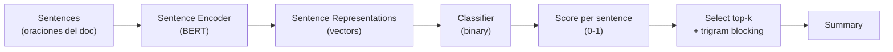

> **Recorrido de las 67 diapositivas** de la clase 22 del Diplomado IA UC (Felipe del Río R., mayo 2026). La clase atraviesa el problema de **Text Summarization** desde la definición formal de la tarea, sus dos paradigmas (Extractive y Abstractive), datasets canónicos, modelos representativos (BERTSum y T5), text generation con decoding strategies, las métricas ROUGE, y cierra con prompt engineering para summarization con LLMs instruction-tuned.

---

## Today's schedule

El profesor organiza la clase en 11 secciones (slide 5):

| # | Sección | Slides aprox |
|---|---|---|
| 1 | Intro | 2-4 |
| 2 | Task | 6-10 |
| 3 | Data | 11-16 |
| 4 | Extractive Model | 17-32 |
| 5 | Abstractive Model | 33-41 |
| 6 | Text Generation | 42-47 |
| 7 | Metrics | 48-52 |
| 8 | Final words | 53-54 |
| 9 | Questions? | 55 |
| 10 | Appendix | 56-59 |
| 11 | Prompt Engineering | 60-67 |

---

## 1. Intro

### 1.1 Motivation (slide 3)

Summarizing es **ubicuo**: movie trailers, book plots, elevator pitches, headlines, paper abstracts. Tres motivaciones del profesor:

- **Extracción de ideas centrales**: nos ayuda a focalizarnos en lo importante y descartar ruido o detalles.
- **Ahorro de tiempo**: en muchas situaciones leer el resumen es 10-100× más rápido que el documento completo.
- **Manual text summarization** es laborioso y caro — automatizar tiene retorno claro.

### 1.2 Today's class (slide 4)

El profesor enmarca:

- Foco **exclusivo en texto** (no audio, no video).
- Diferentes **flavours** del problema (single/multi-doc, etc.).
- Diferentes **maneras de atacarlo** (extractive vs abstractive).
- Cómo **medir performance**.


La pregunta central de la clase: dados un input $x$ y un output deseado $y$ con $|y| < |x|$, ¿cómo construimos un modelo que preserve la información importante de $x$ en $y$? La respuesta tiene dos paradigmas conceptualmente distintos: **extractivo** (seleccionar oraciones) y **abstractivo** (parafrasear/generar).


---

## 2. Task — definición formal

### 2.1 Definition (slide 7)

> Given an input text $x$, we want to produce a summary $y$ which is **shorter** and includes the **most important information** present in $x$.

**Habilidades necesarias** para resumir bien:

- **Identificar** las ideas más importantes.
- **Ignorar** información irrelevante.
- **Integrar** estas ideas de manera significativa.

**¿Por qué es difícil?**

- Algunas ideas pueden ser contextualmente importantes o no.
- El **commonsense** juega un rol grande — el modelo debe inferir qué importa en el dominio.

### 2.2 Flavours (slide 8)

El task se divide en:

- **Single-Document summarization**: generar un summary desde un único documento $x$.
- **Multi-document summarization**: generar un summary desde múltiples documentos $x_1, x_2, \ldots, x_n$ (combina, deduplica, integra).

Otros ejes ortogonales (no en el slide, complementarios):

- **Headline** (1 frase) vs **Multi-sentence** vs **Long-form**.
- **Generic** vs **Query-focused** (resumen sobre un tema específico).
- **Monolingual** vs **Multilingual** vs **Cross-lingual** (input en idioma A, summary en idioma B).

### 2.3 Approaches (slide 10)

| Approach | Idea | Ventajas | Desventajas |
|---|---|---|---|
| **Extractive** | Seleccionar oraciones/fragmentos del documento | Easier · Mantiene fidelidad léxica | Restrictivo · Sin paráfrasis · Texto puede sonar truncado |
| **Abstractive** | Parafrasear / generar texto nuevo | Flexible · Más humano · Capaz de comprimir mejor | Harder · Riesgo de hallucinations |

El profesor remarca que la clase cubre **ambos** — empezando por extractive (más fácil) y subiendo a abstractive.

---

## 3. Data — datasets canónicos

### 3.1 Open Datasets (slide 12)

El profesor lista los 5 datasets más usados:

| Dataset | Tamaño | Fuente | Tipo |
|---|---|---|---|
| **CNN/DailyMail** | 312,000 artículos | News | Multi-sentence summaries |
| **Gigaword** | 4M artículos | Newswire | Headline generation |
| **LCSTS** | 2M textos chinos | Sina Weibo (microblog) | Short summary del autor |
| **X-Sum** | 225,000 ejemplos | BBC News | **Extreme** — one-sentence summary |
| **Wikihow** | 200,000 procedure texts | wikihow.com | Headline / summary sentences |

Nota al pie del slide: "At [this repo](https://github.com/mathsyouth/awesome-text-summarization) you can find over 22 different datasets."

### 3.2 Summarization is a Heterogeneous Task (slide 13)

El profesor enfatiza que **la tarea cambia** según el dataset:

```
CNN/DailyMail  →  article → multi-sentences summary
Gigaword       →  first sentences of article → headline
LCSTS          →  paragraph → sentence
X-Sum          →  article → one-sentence summary
Wikihow        →  article → summary sentences
```

No es una sola tarea homogénea — cada dataset tiene su propia distribución de longitudes, estilo, dominio, novelty.

### 3.3 CNN/DailyMail example (slide 14)

El profesor muestra un caso real con un artículo truncado sobre Muhammadu Buhari (presidente electo de Nigeria, 2015) y su **reference summary** de 4 oraciones cubriendo los puntos centrales.

**Observación**: el summary toma oraciones que el modelo podría extraer directamente del article — eso hace que CNN/DM sea relativamente extractive-friendly (LEAD-3 baseline alcanza ROUGE-1 ≈ 40).

### 3.4 Gigaword examples (slide 15)

Dos ejemplos cortos:

- "The suicide bomb attacks in saudi arabia were a cowardly and disgraceful terrorist atrocity..." → "Two britons missing after saudi suicide blasts."
- "Zairean rebels, led by laurent-desire kabila..." → "Zairean rebels reject un call for ceasefire."

**Característica**: Gigaword es **headline generation** — input pequeño (primeras oraciones), output muy corto (1 frase).

### 3.5 How to build a dataset? (slide 16)

Estrategias para crear datasets de summarization:

- **Web scraping**: aprovechar grandes cantidades de datos en la web.
- **Buscar dominios donde summarizing naturalmente ocurre**: news, social networks, etc.
- **Cuanto más cerca del dominio downstream, mejor**.

**Possible summarization sources**:

- News articles + headlines.
- Movie previews.
- TV guide digests.
- Wikipedia (primera sección como summary del artículo).
- Academic papers (abstract como summary).

---

## 4. Extractive Model

### 4.1 Task framing (slide 18)

El profesor define los 3 pasos del extractive model:

1. **Find a way to represent** las oraciones o fragmentos.
2. **Score** cada oración o fragmento.
3. **Select** un subset de oraciones/fragmentos para crear el summary.

### 4.2 Pipeline general (slides 19-31)

El profesor muestra visualmente el pipeline:



#### Step 1 — Sentence representation (slides 21-24)

Encode each sentence using **BERT**:

- Token de input `[CLS]` antes de la oración.
- BERT procesa la secuencia.
- El output correspondiente al `[CLS]` (los tokens restantes se descartan) se usa como **sentence embedding**.

Esto es el patrón canónico de BERT para representar secuencias: el CLS token agrega información contextual de toda la oración.

#### Step 2 — Score (slides 25-27)

Aprender un **binary classifier** que decida si cada oración pertenece al summary:

- Input: el vector de la oración (CLS output).
- Output: probabilidad escalar $\hat{y}_i \in [0, 1]$.
- Loss: **Binary Cross Entropy** entre score y ground truth.

#### Step 3 — Ground truth (slides 28-29)

> **What ground truth to use?**
>
> Choose the subset of sentences that **maximize a metric (ROUGE)** as ground truth sentences.

Esta es la idea central del **oracle**: como los datasets dan summary $y^*$ pero no labels per oración, se construye un proxy seleccionando greedy las oraciones del documento que maximizan ROUGE-2 con $y^*$. Esas oraciones reciben label 1, el resto label 0.

#### Step 3 — Select (slides 30-31)

Una vez entrenado:

- Score cada oración del documento.
- **Select top-k** highest scores.
- Concatenar para formar el summary.

Para evitar redundancia, en práctica se aplica **trigram blocking**: no agregar una oración si comparte un trigrama (3-gram) con alguna oración ya seleccionada.

### 4.3 Use cases (slide 32)

Aplicaciones donde el extractive shine:

- **Legal Document Summarization** — preservar wording exacto, evitar paráfrasis legalmente riesgosa.
- **Court Proceedings**.
- **Financial Reports and Market Summaries**.
- **Healthcare Records and Medical Summaries** — donde alterar terminología clínica puede ser peligroso.
- **Meeting Minutes and Transcripts**.


**¿Cuándo elegir extractive sobre abstractive?** En dominios donde la **fidelidad léxica** es crítica (legal, médico, financiero, compliance) el riesgo de hallucinations del abstractive es inaceptable. El extractive garantiza que toda palabra del summary proviene del documento.


Para profundizar BERTSum (la implementación canónica) ver [el paper de Yang Liu 2019](/papers/bertsum-liu-2019) y la sección de [profundización](/clases/clase-22/profundizacion#parte-iii-bertsum-extractive-model).

---

## 5. Abstractive Model

### 5.1 Aplicaciones modernas (slides 34-35)

El profesor abre con dos ejemplos visuales contemporáneos:

- **YouTube AI-generated summary** de un video de cata de vinos ("Bargain Bordeaux vs Grand Cru Classé Blind Tasting") — auto-resumen de un video largo.
- **NotebookLM (Google)** — herramienta que resume papers académicos, genera FAQ, study guides, audio overviews. El ejemplo muestra "Exploring the Limits of Transfer Learning with a Unified Text-to-Text Transformer" — un resumen abstracto del paper de T5.

### 5.2 T5 — el paper estrella (slide 36)

> **"Exploring the Limits of Transfer Learning with a Unified Text-to-Text Transformer"**
>
> Raffel, Shazeer, Roberts, Lee, Narang, Matena, Zhou, Li, Liu — Google, JMLR 21 (2020).

El profesor presenta T5 como el modelo de referencia para abstractive summarization.

### 5.3 T5 — la idea (slide 37)

> **Text-to-Text Transfer Transformer.**
>
> **Idea**: We can solve any NLP task using **the same model**.
>
> Based on an **Encoder-Decoder Transformer** model.

El diagrama del slide muestra T5 recibiendo inputs con prefijos distintos:

```
"translate English to German: That is good."  →  "Das ist gut."
"cola sentence: The course is jumping well."  →  "not acceptable"
"stsb sentence1: ... sentence2: ..."          →  "3.8"
"summarize: state authorities dispatched..."  →  "six people hospitalized..."
```

**Una sola red, una sola loss (cross-entropy autoregresivo)**, múltiples tareas.

### 5.4 T5 Training — Unsupervised (slide 38)

**Multi-task mixture** de unsupervised + supervised training.

**Unsupervised Training**:

- **Span-corruption objective**: enmascarar el 15% de los tokens del input, pero **en spans contiguos** (no tokens individuales como BERT MLM).
- Cada span se reemplaza por un **sentinel** único (`<X>`, `<Y>`, `<Z>`, ...).
- El target es la concatenación de sentinels + spans originales.
- Corpus: **C4 (Colossal Clean Crawled Corpus)** — ~750GB filtrado de Common Crawl.

**Ejemplo del slide**:

```
Original:  Thank you for inviting me to your party last week
Inputs:    Thank you <X> me to your party <Y> week
Targets:   <X> for inviting <Y> last <Z>
```

### 5.5 T5 Training — Supervised (slide 39)

**Multi-Task supervised fine-tuning** sobre datasets:

- **CNN/Daily Mail** (summarization — relevante para esta clase).
- **GLUE** (8 tareas de clasificación: SST-2, MNLI, RTE, ...).
- **SuperGLUE** (8 tareas más difíciles).
- **SQuAD** (extractive QA).
- **WMT** English-to-German, French, Romanian translation.

Todas las tareas formuladas como text-to-text, todas con la misma loss.

### 5.6 Resultados (slide 40)

Tabla con resultados de T5 en summarization (CNN/DM):

| Model | ROUGE-1 | ROUGE-2 | ROUGE-L |
|---|---|---|---|
| Previous best | 43.47 | 20.30 | 40.63 |
| T5-Small (60M) | 41.12 | 19.56 | 38.35 |
| T5-Base (220M) | 42.05 | 20.34 | 39.40 |
| T5-Large (770M) | 42.50 | 20.68 | 39.75 |
| T5-3B | 42.72 | 21.02 | 39.94 |
| **T5-11B** | **43.52** | **21.55** | **40.69** |

Observaciones:

- T5-11B supera el SOTA previo en todas las métricas.
- Scaling helps — más parámetros, mejor ROUGE.
- El delta T5-Small → T5-11B es ~2.4 puntos ROUGE-1.

### 5.7 Additional T5 Remarks (slide 41)

> New T5 models have been trained on multilingual datasets:
>
> - **MT5**
> - **UMT5**
>
> Both use multilingual versions of C4 to improve performance in non-English languages. However, both are only based on an **unsupervised objective**, so they need finetuning.

Caveat importante: mT5 y UMT5 **NO incluyen** la fase supervisada multi-task — son solo pretrained. Para uso en summarization en español, hay que fine-tune sobre datos paired.

Para profundizar T5 y la arquitectura encoder-decoder ver [el paper](/papers/t5-raffel-2020) y el [fundamento dedicado](/fundamentos/t5-encoder-decoder).

---

## 6. Text Generation — decoding strategies

### 6.1 El problema general (slide 43)

Los modelos abstractive son entrenados para generar una **distribución de probabilidad** sobre el siguiente token, condicionada en el input y los tokens generados previamente:

$$P(y_t | x, y_{<t}) = f(x, y_{<t})$$

Necesitamos un **algoritmo $g$** que use esta distribución para seleccionar tokens concretos:

$$\hat{y}_t = g(P(y_t | x, y_{<t}))$$

La elección de $g$ es lo que llamamos **decoding strategy** — y el output puede ser radicalmente distinto con el mismo modelo, dependiendo de $g$.

### 6.2 Greedy Decoding (slide 44)

> **Greedy Decoding**: Select always the token with the **highest probability**.
>
> $$\hat{y}_t = \arg\max_w P(y_t = w | x, y_{<t})$$

Determinístico, simple, $O(T)$. **Problema**: localmente óptimo, globalmente sub-óptimo.

### 6.3 Beam Search (slide 44)

> **Beam Search**: Keep $k$ candidates (or beams) in every decoding step.

En cada paso, expandir cada beam con todos los tokens, retener los $k$ con highest cumulative log-probability.

Ejemplo del slide con tree:

```
Greedy:  A → A,D → A,D,H
Beam=2:  A,B → BF,BG → BFI,BGM
```

Beam search es default en NMT, summarization, image captioning.

### 6.4 Decoding Issues — beam search degeneration (slide 45)

El slide reproduce el famoso ejemplo de Holtzman et al. ICLR 2020 ("The Curious Case of Neural Text Degeneration"):

> **Context**: In a shocking finding, scientist discovered a herd of unicorns living in a remote, previously unexplored valley, in the Andes Mountains. Even more surprising to the researchers was the fact that the unicorns spoke perfect English.
>
> **Beam Search**: "The study, published in the Proceedings of the National Academy of Sciences of the United States of America (PNAS), was conducted by researchers from the **Universidad Nacional Autónoma de México (UNAM) and the Universidad Nacional Autónoma de México (UNAM/Universidad Nacional Autónoma de México/Universidad Nacional Autónoma de México/Universidad Nacional Autónoma de México/Universidad Nacional Autónoma de** ..."

**Beam search colapsa en bucles de repetición** en open-ended generation porque cada repetición es individualmente probable.

Para profundizar ver [el paper](/papers/nucleus-sampling-holtzman-2020) y el fundamento [decoding strategies](/fundamentos/decoding-strategies).

### 6.5 Top-p (Nucleus) Sampling (slide 46)

**Introduce randomness** en el decoding. La idea de Holtzman 2020:

> **Top-p (nucleus) Sampling**: Sample from the tokens for which their **cumulative probability is less than $p$**.

Pseudocódigo:

1. Ordenar tokens por probabilidad descendente.
2. Definir el **nucleus** $V^{(p)}$ = smallest set tal que $\sum_{x \in V^{(p)}} P(x) \geq p$.
3. Renormalizar dentro del nucleus.
4. Samplear de la distribución renormalizada.

El **tamaño del nucleus es dinámico** — se adapta al contexto. En pasos confiados, el nucleus es pequeño; en pasos ambiguos, es grande. La gráfica del slide muestra: nucleus principal (mass concentrada) + unreliable tail (cortado).

Default: $p = 0.95$.

### 6.6 Temperature (slide 47)

¿Qué pasa si queremos **aumentar la variabilidad**? Subir la temperatura:

$$P(y_t = w) = \frac{\exp(u_w / T)}{\sum_j \exp(u_j / T)}$$

donde $u_w$ son los logits.

- $T < 1$: distribución **más concentrada**, más determinista.
- $T = 1$: distribución original.
- $T > 1$: distribución **más uniforme**, más random.

El slide muestra 4 paneles con $T \in \{0.1, 0.5, 1, 5\}$ — visualizando cómo el spread crece con $T$.

**Combinable con top-p o top-k** — son ortogonales.

---

## 7. Metrics — ROUGE

### 7.1 Qué es ROUGE (slide 49)

> **ROUGE = Recall-Oriented Understudy for Gisting Evaluation**.
>
> La métrica principal para testear summarization.
>
> Not as good as human evaluation, but **more convenient**.
>
> Usually reported separately for each n-gram: ROUGE-1, ROUGE-2, ROUGE-L, etc.
>
> ROUGE-L measures the overlap for the **longest common subsequence**.
>
> In Python: `pip install rouge-score`.

### 7.2 ROUGE-1 (slide 50)

Ejemplo del slide:

- **Machine generated**: "I really loved reading the Hunger Games" (7 palabras).
- **Human reference**: "I loved reading the Hunger Games" (6 palabras).

Math LaTeX:

$$\text{ROUGE-1 Recall} = \frac{\text{Num correct words}}{\text{Num words in reference}} = \frac{6}{6} = 1.0$$

$$\text{ROUGE-1 Precision} = \frac{\text{Num correct words}}{\text{Num words in summary}} = \frac{6}{7}$$

$$\text{ROUGE-1 F1} = 2 \cdot \frac{\text{precision} \cdot \text{recall}}{\text{precision} + \text{recall}} = \frac{12}{13}$$

### 7.3 ROUGE-2 (slide 51)

Mismo ejemplo, ahora con **bigramas**.

- **Generated bigrams**: I really, really loved, loved reading, reading the, the Hunger, Hunger Games.
- **Reference bigrams**: I loved, loved reading, reading the, the Hunger, Hunger Games.
- **Match**: loved reading, reading the, the Hunger, Hunger Games — 4 bigramas.

$$\text{ROUGE-2 Recall} = \frac{4}{5}, \quad \text{ROUGE-2 Precision} = \frac{4}{6}$$

### 7.4 ROUGE-L (slide 52)

Mismo ejemplo, ahora con **Longest Common Subsequence**:

- LCS("I really loved reading the Hunger Games", "I loved reading the Hunger Games") = "I loved reading the Hunger Games" = 6 palabras.

$$\text{ROUGE-L Recall} = \frac{\text{LCS}(s, r)}{\text{Num words in reference}} = \frac{6}{6}$$

$$\text{ROUGE-L Precision} = \frac{\text{LCS}(s, r)}{\text{Num words in summary}} = \frac{6}{7}$$

**Ventaja de ROUGE-L**: captura matches no-contiguos. Si el modelo intercala una palabra extra dentro de una frase del reference, ROUGE-N pierde el match pero ROUGE-L lo captura.

Para profundizar ROUGE family (ROUGE-W, ROUGE-S, ROUGE-SU) ver [el paper de Lin 2004](/papers/rouge-lin-2004) y el [fundamento dedicado](/fundamentos/rouge-metric).

---

## 8. Final words & resources (slide 54)

El profesor cierra con recursos prácticos:

- **Article on how to generate text using HuggingFace Transformers**.
- **Article on how to do summarization with HuggingFace Transformers**.
- **Article by AssemblyAI** comparando summarization APIs.
- **Video** de Stanford class on text generation.
- **Video** explaining ROUGE score.
- **HuggingFace summarization models**.
- `github.com/mathsyouth/awesome-text-summarization`.

---

## 10. Appendix — Extractive Model detallado

### 10.1 Sentence representation con BERT (slide 57)

> *Fine-tune BERT for Extractive Summarization* by **Yang Liu** (arXiv 1903.10318).
>
> Use a pretrained BERT model to represent each sentence. Fine-tune it to score each sentence.

El slide muestra el input modificado de BERTSum:

```
[CLS] my dog is cute [SEP] he likes play ##ing [SEP]
```

Con **interval segment embeddings** $E_A, E_B, E_A, E_B, ...$ alternantes — distingue oraciones consecutivas. Cada `[CLS]` que precede una oración da el embedding $T_i$ de esa oración.

### 10.2 Scoring (slide 59)

> We need to provide a score to our model in order to learn.
>
> **This work**: The combination of text sentences which **maximize the ROUGE score**.

**Other alternatives** evaluadas:

- **Best case**: tener un ground truth real (oraciones marcadas como "summary" por humanos) — rara vez disponible.
- **Frequency-based scores**: word probabilities, TF-IDF.
- **Information theoretic**: KL-divergence entre distribuciones del summary y del documento.

Para profundizar BERTSum ver [el paper](/papers/bertsum-liu-2019) y la [profundización](/clases/clase-22/profundizacion#parte-iii-bertsum-extractive-model).

---

## 11. Prompt Engineering

### 11.1 Definición (slide 61)

> **Prompt Engineering**: finding the correct way to **describe a task** in order for an LLM to solve it correctly.
>
> Prepending **solved examples** of the task before our example. **In-context Learning**!

El slide muestra el ejemplo canónico de in-context learning:

```
Translate English to French:    ← task description
sea otter => loutre de mer      ← examples
peppermint => menthe poivrée
plush girafe => girafe peluche
cheese =>                       ← prompt
```

El modelo completa "fromage" sin haber sido fine-tuneado en traducción — solo guiado por el contexto de los ejemplos.

Para más detalle sobre in-context learning ver la [Clase 20](/clases/clase-20) y el fundamento [in-context-learning](/fundamentos/in-context-learning).

### 11.2 Choose the model carefully (slide 62)

> **Be careful**: Language models are **not trained to assist users**.
>
> Choose **instruction tuned LLMs**. Example: `gpt-3.5-turbo-instruct`.

El slide ilustra el problema con GPT-3 base (no instruction-tuned):

```
PROMPT:      Explain the moon landing to a 6 year old in a few sentences.

COMPLETION:  Explain the theory of gravity to a 6 year old.
             Explain the theory of relativity to a 6 year old in a few sentences.
             Explain the big bang theory to a 6 year old.
             Explain evolution to a 6 year old.
```

El modelo **continúa el patrón** (era completion model), no responde a la instrucción. Los instruction-tuned models (InstructGPT, ChatGPT, Claude, Llama-Instruct) resuelven este gap. Ver [paper InstructGPT](/papers/instructgpt-ouyang-2022).

### 11.3 Prompt examples para summarization (slides 63-67)

El profesor muestra **5 patterns** de prompt para summarization:

**(slide 63)** Provide a clear instruction:

```python
prompt = f"""
Please provide a summary of the following text:

TEXT:

{text}
"""
```

**(slide 64)** Same idea en otro orden:

```python
prompt = f"""
{text}

Explain the above in one sentence:
"""
```

**(slide 65)** Audience-aware ("usually helps to be descriptive"):

```python
prompt = f"""
Please provide a summary of the following text. Please
provide your output in a manner that a 5 year old would
understand:

TEXT:

{text}
"""
```

**(slide 66)** Concise summary:

```python
prompt = f"""
Write a concise summary of the following:

{text}

CONCISE SUMMARY:
"""
```

**(slide 67)** Structured output (bullet points):

```python
prompt = f"""
Write a concise summary of the following text delimited by
triple backquotes. Return your response in bullet points
which covers the key points of the text.

{text}

BULLET POINT SUMMARY:
"""
```

### 11.4 Lecciones de prompt engineering para summarization

- **Sé explícito** sobre el formato esperado (one-sentence, paragraph, bullets).
- **Sé explícito** sobre la audiencia ("5 year old", "executive", "technical reader").
- **Use delimiters** (triple backticks, `<TEXT>...</TEXT>`) para separar contenido del prompt — reduce confusión.
- **Termina con una pista** del formato del output ("CONCISE SUMMARY:", "BULLET POINT SUMMARY:") — el modelo continúa naturalmente.
- **Itera**: el prompt óptimo no es obvio; A/B test sobre ejemplos representativos.

---

## Cierre

La clase 22 atraviesa Text Summarization desde la definición (input $x$, output $y$ corto preservando info) hasta los modelos modernos (T5 abstractive, BERTSum extractive, ChatGPT prompt-based). La línea conectora:

1. **Summarization** es una familia heterogénea de tareas (single/multi-doc, extractive/abstractive, monolingual/multilingual, headline/multi-sentence).
2. Los **5 datasets canónicos** (CNN/DM, Gigaword, LCSTS, XSum, Wikihow) cubren distintos niveles de extracción/abstracción.
3. **BERTSum** (Extractive) usa BERT modificado con multi-CLS + interval embeddings + binary classifier sobre oracle ROUGE.
4. **T5** (Abstractive) propone el text-to-text framework unificado + span-corruption + multi-task fine-tuning.
5. **Decoding** importa tanto como el modelo: greedy/beam para constrained, top-p para open-ended, temperature para diversidad.
6. **ROUGE** family (R-1, R-2, R-L) sigue siendo la métrica de referencia 20 años después.
7. **Prompt engineering** con LLMs instruction-tuned es la frontera moderna — reemplaza fine-tuning para muchos use cases.

Para profundizar la matemática (span-corruption objective, BERTSum oracle algoritmo, beam search, nucleus sampling, ROUGE family completa, Levenshtein-style edit distances) ver la [profundización](/clases/clase-22/profundizacion).

Para la implementación práctica (notebooks Parte 1 y Parte 2 con T5/BART + prompt engineering), ver el [Laboratorio 22](/laboratorios/lab-22).
