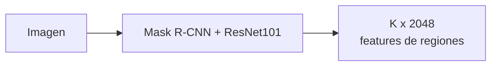
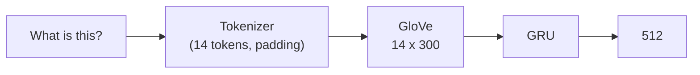
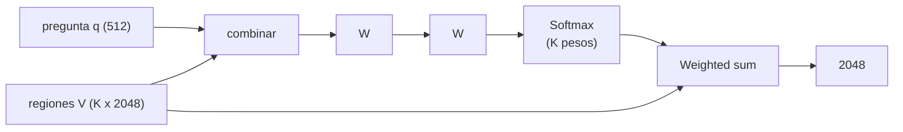
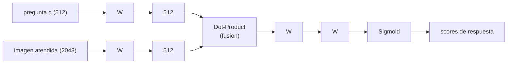

> Recorrido de las 29 diapositivas de la clase. La primera mitad construye el modelo **Pythia** para Visual Question Answering pieza por pieza y luego lo somete a crítica (tres modos de fallo). La segunda mitad pasa a **Image Captioning**: cómo se genera la descripción palabra por palabra (greedy vs beam search) y cómo se mide su calidad (BLEU).

## Contenido de la clase

La clase se organiza en dos bloques temáticos:

1. **Visual Question Answering (VQA)** — qué es, por qué importa, el dataset VQAv2, el modelo Pythia, y los problemas de los enfoques existentes.
2. **Image Captioning** — qué es, por qué importa, cómo generar un caption (greedy/beam search) y cómo medir su calidad (BLEU).

Ambas tareas comparten el desafío de fondo del campo **multimodal**: hacer dialogar dos modalidades que viven en espacios incompatibles — una imagen (grilla continua de píxeles) y un texto (secuencia discreta de tokens). Ver el [dominio Multimodal](/dominios/multimodal) para la línea de tiempo completa.

---

## Parte 1 — Visual Question Answering (VQA)

### 1. ¿Qué es Visual Question Answering?


**VQA**: dado un **contexto visual** (una imagen) y una **pregunta en lenguaje natural** sobre ella, el sistema debe producir una **respuesta** correcta. Formalmente, aprende una función $f(I, Q) \to A$ donde $I$ es la imagen, $Q$ la pregunta y $A$ la respuesta.


El ejemplo canónico de la slide: una foto de un tren sobre rieles y la pregunta *"What is this?"*. El modelo debe producir una distribución sobre respuestas:

| Respuesta | Score |
|---|---|
| Train | 99.99 |
| Train tracks | 0.004 |
| Trains | 0.003 |
| Countryside | 0.002 |
| Tracks | 0.001 |

La frase que la profesora destaca resume la dificultad: **el modelo necesita entender la pregunta y la imagen en conjunto** — no basta reconocer objetos (eso es clasificación) ni entender la pregunta aislada (eso es NLP puro). VQA exige *grounding*: anclar el lenguaje en la evidencia visual.

Por eso VQA se considera una tarea **"AI-complete"**: resolverla bien requiere visión, lenguaje, sentido común y razonamiento. Es un test de Turing visual. Ver el [paper fundacional de Antol et al. 2015](/papers/vqa-antol-2015) y el [fundamento de VQA](/fundamentos/visual-question-answering).

### 2. ¿Por qué es importante?

La clase presenta dos motivaciones de alto impacto social:

**Interacción con robots y asistentes personales.** Un robot doméstico que recibe *"¿Dónde están las ropas limpias?"* debe mirar la escena y responder *"En el canasto verde en la lavandería"*. Esto requiere VQA situado: la respuesta no está en una base de datos, sino en lo que el robot ve aquí y ahora.

**Accesibilidad para personas con discapacidad visual.** Una persona ciega puede fotografiar su entorno y preguntar *"¿Es seguro aquí? ¿Puedo seguir caminando hacia adelante?"*. El sistema interpreta la escena y responde. Este caso de uso — descrito en la slide 6 — es el que motivó datasets reales como VizWiz, donde las preguntas provienen de usuarios ciegos.


Estas dos motivaciones (asistencia robótica y accesibilidad) reaparecen en **Image Captioning** (slides 21-22). No es casualidad: ambas tareas son las dos caras del mismo problema de **describir el mundo visual en lenguaje** — VQA responde una pregunta específica, captioning describe sin que se lo pregunten.


### 3. El dataset — VQAv2

El modelo necesita datos. La clase usa **VQAv2** (["Making the V in VQA Matter", Goyal et al. 2017](/papers/vqav2-goyal-2017)). Sus cifras (slide 7):

- Poco más de **204K imágenes** provenientes de [COCO (Lin 2014)](/papers/coco-lin-2014).
- **614K preguntas** de lenguaje natural de forma libre (3 preguntas por imagen).
- Más de **6 millones de respuestas** de forma libre pero concisas (10 respuestas humanas por pregunta).
- Splits: **443K pares de entrenamiento, 214K de validación, 453K de prueba** (pares pregunta-imagen).

¿Por qué 10 respuestas por pregunta? Porque para preguntas abiertas no hay una única respuesta "correcta": *"¿qué hace el hombre?"* admite "corre", "trota", "hace ejercicio". Recolectar 10 respuestas humanas permite medir el **consenso** y diseñar una métrica robusta (ver sección de profundización).

#### El balanceo: evitar sesgos de lenguaje

La idea central de VQAv2 (slides 7-8) es **construir un dataset balanceado** para evitar los *language priors*:


**El problema:** en VQA v1 los modelos respondían bien **sin mirar la imagen**, explotando regularidades estadísticas del lenguaje. *"¿De qué color es el plátano?"* → "amarillo" casi siempre acierta. *"¿Cuántos...?"* → "2" es la respuesta más frecuente. El modelo aprende el sesgo del dataset, no a ver.

**La solución de VQAv2:** para cada triplete (imagen $I$, pregunta $Q$, respuesta $A$), se identifica **otra imagen** $I'$ que es **similar a $I$** pero que resulta en una **respuesta diferente** $A' \neq A$ a la misma pregunta $Q$. Así, para responder bien, el modelo está *obligado* a mirar la imagen — el lenguaje solo ya no basta.


Este balanceo por **pares complementarios** es la contribución que da nombre al paper: *"hacer que la V (de Visual) en VQA importe"*. Tras balancear, la accuracy de los modelos que dependían de priors cae notablemente — una señal de que ahora sí deben procesar la imagen.

### 4. El modelo — Pythia

[Pythia (Jiang et al. 2018)](/papers/pythia-jiang-2018) fue la **entrada ganadora del VQA Challenge 2018**. La clase lo describe (slide 9) como un modelo que *"se basa en el modelo de abajo hacia arriba y de arriba hacia abajo (up-down) con pocos pero importantes cambios para mejorar el rendimiento"*. Es decir: **Pythia = [Bottom-Up/Top-Down de Anderson 2018](/papers/bottom-up-attention-anderson-2018) + mejoras incrementales**.

Recorramos la arquitectura siguiendo el diagrama de la clase (slide 13), que tiene dos ramas — visión y lenguaje — que se fusionan al final.

#### 4.1 Procesar la imagen — features de regiones (slide 10)

En lugar de procesar la imagen como una grilla uniforme de píxeles, Pythia usa un **detector de objetos** (Mask R-CNN con backbone ResNet-101, preentrenado en Visual Genome) para **proponer los objetos en la imagen** (slide 10). Cada una de las $K$ regiones detectadas se representa con un vector de **2048 dimensiones** (las features de la región tras el pooling del detector).

El resultado es una matriz $V \in \mathbb{R}^{K \times 2048}$: $K$ vectores, uno por objeto/región saliente. Esta es la parte **bottom-up**: la imagen "propone" sus regiones interesantes sin que la pregunta intervenga todavía. Ver el [fundamento de detección de objetos](/fundamentos/deteccion-de-objetos).


Este es exactamente el aporte de [Bottom-Up/Top-Down (Anderson 2018)](/papers/bottom-up-attention-anderson-2018): atender a **regiones detectadas** (alineadas con objetos reales) en lugar de a un grid $14\times14$ arbitrario. El antecedente directo es [Stacked Attention (Yang 2016)](/papers/stacked-attention-yang-2016), que atendía sobre la grilla — Pythia atiende sobre objetos.


#### 4.2 Procesar la pregunta — embedding textual (slide 11)

La pregunta *"What is this?"* se procesa así (slide 11):

1. **Tokenizer**: se parte en tokens y se rellena (*padding*) a una longitud fija de **14 tokens**: `"What", "is", "this", "pad", "pad", ..., "pad"`.
2. **[GloVe](/fundamentos/glove)**: cada token se mapea a un embedding de **300 dimensiones** preentrenado → matriz $14 \times 300$.
3. **[GRU](/fundamentos/redes-recurrentes)**: una red recurrente con compuertas procesa la secuencia y produce un único vector de **512 dimensiones** que resume la pregunta.

El vector resultante $q \in \mathbb{R}^{512}$ es la representación de la pregunta que guiará la atención visual.

#### 4.3 Top-Down attention — qué objetos mirar (slide 12)

Esta es la parte **top-down**: la pregunta determina **qué objetos son importantes para responderla** (slide 12). El mecanismo:

1. Se combina cada región $v_i$ con la pregunta $q$ y se pasa por capas lineales ($W$).
2. Un **Softmax** sobre las $K$ regiones produce un vector de **attention weights** $\alpha \in \mathbb{R}^K$ que suma 1 — cuánto pesa cada objeto.
3. **Weighted sum**: se promedian las regiones ponderadas por su atención, dando un único vector visual $\hat{v} = \sum_{i=1}^K \alpha_i v_i \in \mathbb{R}^{2048}$.

El vector $\hat{v}$ es la imagen "vista a través de la pregunta": resalta los objetos relevantes y atenúa el resto. Es la herencia directa del [mecanismo de atención](/fundamentos/mecanismo-atencion). Las ecuaciones completas están en la [profundización](/clases/clase-23/profundizacion).

#### 4.4 Fusión multimodal y respuesta (slide 13)

Las dos modalidades se proyectan al mismo espacio de **512 dimensiones** y se **fusionan por dot-product** (producto elemento a elemento / Hadamard). La frase de la slide 13 lo explica: esta fusión permite *"mezclar la información multimodal sin aumentar la dimensión del modelo"* — a diferencia del producto externo (bilinear), que explotaría a $512 \times 512$. Luego dos capas lineales y una **Sigmoid** producen los scores de cada respuesta posible.


La salida usa **Sigmoid, no Softmax**. VQA se trata como **clasificación multi-etiqueta** sobre un vocabulario fijo de las ~3000 respuestas más frecuentes. Como hay 10 respuestas humanas que pueden no coincidir, el target es un *soft score* (qué fracción de humanos dio cada respuesta), y la Sigmoid permite que varias respuestas sean parcialmente correctas. El modelo "selecciona la mejor respuesta para la pregunta" — *Train* en el ejemplo.


Las mejoras de Pythia sobre BUTD (weight normalization, ReLU en vez de gated tanh, fine-tuning del detector, features de grilla + regiones, data augmentation con Visual Genome, ensemble) se detallan en el [análisis del paper](/papers/pythia-jiang-2018).

### 5. Problemas con los enfoques existentes

Aquí la clase da un giro crítico (slide 14): aun siendo el ganador del challenge, Pythia (y todo modelo VQA de la época) sufre tres problemas estructurales.

#### 5.1 Los modelos están impulsados por language priors

A pesar del balanceo de VQAv2, persiste un sesgo residual hacia las respuestas estadísticamente frecuentes. Las slides 15-17 lo muestran con un gato:

**Pregunta *"Is it a cat?"* (slide 15):**

| Predicción | Confianza |
|---|---|
| yes | 100.0 |
| gray | ~0 |
| cat | ~0 |

El modelo responde "yes" con confianza absoluta — razonable. Pero observa qué pasa con el conteo:

**Pregunta *"Are there two cats?"* (slides 16-17):**

| Predicción (caso A) | Confianza | | Predicción (caso B) | Confianza |
|---|---|---|---|---|
| yes | 99.995 | | no | 94.91 |
| no | 0.003 | | yes | 5.00 |
| 1 | 0.002 | | 1 | 0.084 |

El modelo es **inconsistente**: para preguntas de existencia tiende a "yes" (prior); el conteo real ("¿son dos?") es frágil. Los modelos VQA aprenden que "¿hay un...?" suele responderse "yes" porque el dataset rara vez pregunta por cosas ausentes.

#### 5.2 Falta de composicionalidad (slide 18)

**Pregunta *"What is the color of the cat?"*:**

| Predicción | Confianza |
|---|---|
| orange | 45.68 |
| blue | 24.47 |
| orange and black | 4.47 |
| black and orange | 4.42 |
| gray | 3.70 |

El modelo no compone significados de forma robusta: trata *"orange and black"* y *"black and orange"* como **respuestas distintas** (cuando son equivalentes), y reparte la probabilidad entre paráfrasis. No entiende la estructura composicional del lenguaje — solo memoriza cadenas de respuesta vistas.

#### 5.3 Las respuestas son limitadas (slide 19)

**Pregunta *"What is this?"* sobre un pájaro:**

| Predicción | Confianza |
|---|---|
| bird | 99.94 |
| duck | 0.03 |
| animal | 0.03 |
| yes | 0.002 |
| unknown | 0.001 |

Como el modelo es un **clasificador sobre un vocabulario cerrado** (~3000 respuestas), no puede producir respuestas fuera de esa lista. Si la respuesta correcta es una especie rara no incluida, el modelo está condenado a equivocarse. Es la limitación de fondo: VQA-como-clasificación no es VQA-como-generación.


Estos tres problemas — priors, composicionalidad, vocabulario cerrado — son exactamente lo que la era de los **VLMs generativos** (BLIP, GPT-4V, Gemini) vino a atacar: tratar VQA como **generación de texto** condicionada en la imagen, no como clasificación. El Laboratorio 23 usa **BLIP**, que genera la respuesta token por token y por tanto no está limitado a un vocabulario fijo (aunque hereda otros problemas, como la alucinación).


---

## Parte 2 — Image Captioning

### 6. ¿Qué es Image Captioning? (slide 20)


**Image Captioning**: dado un contexto visual (imagen), generar una **breve descripción** en lenguaje natural — *"describir con palabras las características visuales relevantes"*. Formalmente, aprende $g(I) \to (w_1, w_2, \ldots, w_T)$, una secuencia de palabras que describe la imagen.


La diferencia con VQA: en captioning **no hay pregunta**. El modelo decide por sí mismo qué es relevante y lo describe. Es un problema de **generación** puro (a diferencia de Pythia, que clasificaba). Ver el [fundamento de Image Captioning](/fundamentos/image-captioning).

### 7. ¿Por qué es importante? (slides 21-22)

Las mismas dos motivaciones que VQA, más una:

- **Accesibilidad**: describir imágenes para personas con discapacidad visual (lectores de pantalla enriquecidos).
- **Recuperación y búsqueda de imágenes**: si cada imagen tiene un caption, se puede buscar imágenes por texto (la base de Google Images, Pinterest Lens). El caption convierte el contenido visual en algo indexable.

### 8. ¿Cómo generamos un caption? (slide 23)

La clase plantea el problema de generación: necesitamos un **modelo** que, dada la imagen, produzca palabra por palabra. La arquitectura canónica es **encoder-decoder**:

- **Encoder** (CNN): convierte la imagen en una representación vectorial (como en [Show and Tell, Vinyals 2015](/papers/show-and-tell-vinyals-2015)) o en un conjunto de features de regiones con atención (como en [Show, Attend and Tell, Xu 2015](/papers/show-attend-tell-xu-2015)).
- **Decoder** (RNN/LSTM o Transformer): genera la descripción token por token, condicionado en la imagen y en las palabras ya generadas.

En cada paso $t$ el modelo produce una distribución sobre el vocabulario: $\text{Out} \in \mathbb{R}^{N \times D_{vocab}}$, donde $N$ es la longitud y $D_{vocab}$ el tamaño del vocabulario. La pregunta clave: **¿cómo elegimos las palabras a partir de estas distribuciones?**

### 9. Decoding — Greedy Search (slide 24)

La estrategia más simple: en cada paso, elegir la palabra **más probable**.

$$\text{Caption} = \arg\max(\text{Out}, \dim = 1) \in \mathbb{R}^{N}$$

Para cada posición $t$, tomar $\arg\max$ sobre el vocabulario. Es rápido y simple, **pero** — como advierte la slide — *"¿es la mejor manera? Puede repetir palabras"*.


**El problema de greedy**: elegir el óptimo local en cada paso no garantiza la **secuencia globalmente óptima**. Una palabra muy probable ahora puede llevar a un callejón sin salida después. Además, greedy tiende a la **repetición** ("a man man man...") y a captions genéricos. La probabilidad de una secuencia es el producto $\prod_t p(w_t \mid w_{<t}, I)$, y maximizar cada factor por separado no maximiza el producto.


### 10. Decoding — Beam Search (slides 25-26)

**Beam Search** mejora greedy manteniendo las $k$ hipótesis más probables (el *beam*) en cada paso, en lugar de una sola.

El diagrama de la clase (slide 26) ilustra el principio para una frase que empieza con *"I am..."*, *"I will..."*, *"My parents..."*. La probabilidad de una secuencia de dos palabras se factoriza:

$$P(y^1, y^2 \mid x) = p(y^1 \mid x) \cdot p(y^2 \mid x, y^1)$$

En lugar de comprometerse con el mejor $y^1$ (greedy), beam search **explora las $k$ mejores opciones de $y^1$** y, para cada una, las mejores continuaciones $y^2$, conservando las $k$ secuencias parciales más probables globalmente. En el ejemplo, descarta hipótesis que greedy habría tomado prematuramente (la "X roja" en el diagrama) y conserva combinaciones como *"I am"*, *"I will"*, *"My parents"*.


**Trade-off del beam width $k$**: $k=1$ es greedy. A mayor $k$, más exploración y mejor secuencia (hasta cierto punto), pero más cómputo. Curiosamente, en captioning beams demasiado grandes producen captions **más cortos y genéricos** (sesgo de longitud), por lo que se usan $k$ moderados (3-5) y penalizaciones de longitud.


Para el tratamiento completo de las estrategias de decodificación (incluyendo top-k, nucleus sampling, temperatura), ver el [fundamento de Decoding Strategies](/fundamentos/decoding-strategies), introducido en la [Clase 22](/clases/clase-22).

### 11. ¿Cómo medimos la calidad de un caption? — BLEU (slide 27)

Una vez generado el caption, ¿cómo sabemos si es bueno? La clase introduce **BLEU** ([Papineni et al. 2002](/papers/bleu-papineni-2002)):


**BLEU** (Bilingual Evaluation Understudy): una métrica que **puntúa en una escala de 0 a 1** (o 0-100), comparando el caption generado contra una o varias referencias humanas. Como dice la slide: *"se centra en la similitud de cadenas"* — cuenta cuántos **n-gramas** del candidato aparecen en las referencias. Y la advertencia clave: *"no evalúa la calidad de la traducción"* — solo la coincidencia superficial de palabras, no el significado.


BLEU nació para traducción automática pero se adoptó en captioning porque comparte la estructura: comparar texto generado contra referencias humanas. En COCO cada imagen tiene 5 captions de referencia, y se reportan BLEU-1 a BLEU-4 (n-gramas de tamaño 1 a 4). Sus componentes:

- **Modified n-gram precision** ($p_n$): fracción de n-gramas del candidato que aparecen en la referencia, con *clipping* para no premiar repeticiones.
- **Brevity penalty** ($BP$): penaliza captions demasiado cortos.

La fórmula completa y los ejemplos numéricos están en la [profundización](/clases/clase-23/profundizacion) y en el [fundamento de BLEU](/fundamentos/bleu-metric). Sus limitaciones (no captura semántica, penaliza paráfrasis válidas) motivaron métricas específicas de captioning como CIDEr, METEOR y SPICE.


BLEU es **precision-oriented** (importa que lo generado sea correcto), el espejo de [ROUGE](/fundamentos/rouge-metric) que es **recall-oriented** (importa cubrir el contenido del reference), visto en la [Clase 22](/clases/clase-22). Juntos forman el par clásico de métricas de generación de texto basadas en n-gramas.


---

## Cierre — del clasificador al generador multimodal

La clase traza, sin nombrarlo explícitamente, el arco completo del campo:

1. **VQA como clasificación** (Pythia): potente pero limitado por priors, composicionalidad y vocabulario cerrado.
2. **Captioning como generación** (encoder-decoder + beam search): más flexible, pero difícil de evaluar (BLEU es imperfecto).
3. **La síntesis** (no en las slides, pero implícita en el lab): los **VLMs generativos** como BLIP unifican ambas tareas — generan tanto respuestas como captions token por token, atacando los problemas de Pythia, aunque heredan otros (alucinación).

El Laboratorio 23 materializa este cierre usando BLIP para hacer VQA e Image Captioning sobre imágenes reales, incluyendo los casos de error vistos en clase (el ornitorrinco descrito como "a baby bird", relaciones espaciales mal interpretadas).

## Para seguir

- [Profundización](/clases/clase-23/profundizacion) — la matemática de top-down attention, fusión multimodal y bilineal, beam search y BLEU.
- [Fundamento: Visual Question Answering](/fundamentos/visual-question-answering) y [Image Captioning](/fundamentos/image-captioning).
- [Dominio Multimodal](/dominios/multimodal) — la línea de tiempo de 2014 a los VLMs frontier.
- Laboratorio 23 — práctica con BLIP.
