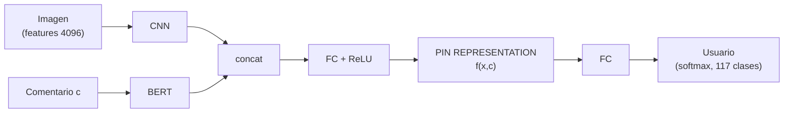
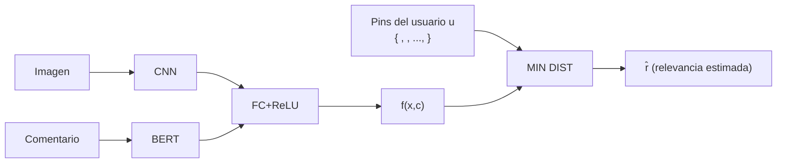

> **Recorrido de las 56 diapositivas** de la clase 25 del Diplomado IA UC (Julio Hurtado & Felipe del Río, Computer Science Department, PUC). Esta clase es un **case study**: en lugar de enseñar una técnica nueva, muestra cómo **orquestar** lo aprendido en el diplomado para resolver un problema de ML de punta a punta. El hilo conductor es un **framework de preguntas por etapa** — Problem, Data, Model, Representación, Metrics — aplicado a un sistema de recomendación de *pins* de Pinterest que combina imágenes y texto.

Esta página acompaña el [hub de la clase 25](/clases/clase-25). Para el detalle de implementación revisa la práctica; aquí desarrollamos cada concepto con el **qué**, el **porqué**, el **cómo** y los **gotchas**.

---

## 0. El framework de la clase (slides 1-4)

La tesis pedagógica es explícita (slide 3): hoy **no** se introduce un modelo nuevo, se *revisa el material del curso de manera práctica*. El método tiene cuatro pasos:

1. **Definir una tarea**.
2. **Plantear las preguntas relevantes** de cada etapa.
3. **Resolverla paso a paso** respondiendo esas preguntas.
4. **Implementarla** en la sesión de práctica.


La gran lección de un case study no es la arquitectura final, sino **el orden de las preguntas**. Un practicante de ML competente no empieza eligiendo el modelo: empieza entendiendo el **problema** y los **datos**, y solo entonces deriva el modelo y las métricas. La arquitectura es una *consecuencia* de las decisiones anteriores, no el punto de partida.


El *Table of Contents* (slide 4) define las secciones que estructuran esta página: **Problem → Data → Model → Double click in Data Representation → Metrics → Conclusions**. Cada una abre con sus *"Questions to ask"*.

---

## 1. Problem (slides 5-12)

### 1.1 Las preguntas (slide 6)

> 1. *What are we trying to solve?*
> 2. *How are we going to frame the problem?*

Antes de tocar datos o modelos, hay que articular **qué** se resuelve y **cómo** se formaliza. Estas dos preguntas son el filtro que separa un proyecto bien planteado de uno que entrena modelos sin norte.

### 1.2 Qué resolvemos (slide 7)

El objetivo: **recomendar a un usuario nuevos *pins*** (imagen + comentarios que escribió sobre ella) **basándonos en sus interacciones previas**. Visualmente, el usuario tiene un **board** con pins que le gustaron; queremos decidir si un *pin nuevo* debería entrar a ese board (✓) o no (✗).

Esto es un problema clásico de **sistemas de recomendación** ([/fundamentos/recommender-systems](/fundamentos/recommender-systems)) con un giro multimodal: cada ítem no es un ID anónimo, sino contenido rico (imagen + texto). Eso habilita recomendación **basada en contenido**, capaz de manejar ítems nuevos (cold-start de ítem) que un filtrado colaborativo puro no vería.

### 1.3 Cómo lo formalizamos: el framing (slides 9-12)

Dado un usuario $i$ representado por $u_i$, y un *pin* $j$ dado por una imagen $x_j$ y un comentario $c_j$, para cada par usuario-pin queremos calcular un **score de relevancia**:

$$ r_{ij} = h\big(g(u_i),\; f(x_j, c_j)\big) $$

y luego **recomendar solo los pins más relevantes** a ese usuario. La fórmula descompone el problema en tres funciones aprendibles:

| Función | Rol | Pregunta que responde |
|---|---|---|
| $f(x_j, c_j)$ | **Representar un pin** (imagen + comentario) | ¿Cómo codifico el contenido? |
| $g(u_i)$ | **Representar al usuario** como el conjunto de *sus* pins (reutilizando $f$) | ¿Cómo codifico al usuario? |
| $h(\cdot,\cdot)$ | **Medir relevancia** vía una función de distancia | ¿Qué tan compatibles son usuario y pin? |


Esta descomposición $r_{ij}=h(g(u_i),f(x_j,c_j))$ es exactamente la estructura de una **arquitectura de dos torres** ([/fundamentos/two-tower-retrieval](/fundamentos/two-tower-retrieval)): una torre $f$ codifica el ítem, otra $g$ codifica al usuario, y $h$ las compara en un espacio común. La gracia es que $f$ y $g$ se calculan **por separado**, así que los embeddings de ítems se precomputan una vez y la recomendación en producción es solo una **búsqueda del vecino más cercano**.


Las decisiones de diseño (slide 12) quedan así:

- **Pin** → aprendemos $f$ con redes neuronales (CNN para imagen, BERT para texto).
- **Usuario** → es el **conjunto** de todos sus pins; $g$ reutiliza $f$. Un usuario no es un vector aprendido aparte, sino una agregación de su historia.
- **Relevancia** → una **función de distancia** $h$. Menor distancia ⇒ mayor relevancia.

---

## 2. Data (slides 13-21)

### 2.1 Las preguntas (slides 14, 21)

> 1. *What data do we have available?*
> 2. *What info it contains and which kind it is?*
> 3. *How much data do we have available?*
> 4. *Based on the data, can a human/expert solve the problem?*

La cuarta pregunta es la más sutil y proviene del artículo de HBR *"What AI Can and Can't Do Right Now"*. Es un **test de sanidad**: si un experto humano, viendo solo los datos disponibles, no podría resolver la tarea, difícilmente lo logrará un modelo. Aquí la respuesta es *"probablemente sí"* — viendo los pins anteriores de alguien, un humano podría adivinar si le gustará un pin nuevo.

### 2.2 El dataset (slide 15)

Se usa el **Pinterest dataset** ([/papers/pinterest-dataset-2017](/papers/pinterest-dataset-2017)):

- **70.200 pins** de **117 usuarios**.
- Cada pin = **texto corto** (raw) + **una imagen**.
- **Cada imagen ya viene embebida con una CNN**.


*Atención* (slide 15): **no se usan las imágenes crudas**, sino **features ya extraídas** de ellas — un vector de **4096 dimensiones** por imagen (la salida de una capa fully-connected de una CNN tipo VGG). Por temas prácticos además se trabaja con un **sub-sample** del dataset. Esto es una decisión de ingeniería deliberada: evitar reentrenar el extractor visual y reducir el costo de cómputo.


Las slides 16-19 muestran un board real de Pinterest ("Departamento 52") y la anatomía de un pin: imagen grande, título, descripción y comentarios — confirmando que el contenido es genuinamente **multimodal**.

### 2.3 Repaso: Direct Transfer Learning (slide 20)

¿De dónde salen esas 4096 features? De **transfer learning** ([/fundamentos/transfer-learning](/fundamentos/transfer-learning)). El profesor recuerda la receta del *direct transfer*:

```
   [ imagen ]                  [ imagen ]
       │                           │
   ┌───────────┐  congeladas   ┌───────────┐
   │ conv-64   │ ────────────► │ conv-64   │   (FREEZE: capas
   │   ...     │               │   ...     │    extractoras de
   │ conv-512  │               │ conv-512  │    features)
   │ max pool  │               │ max pool  │
   ├───────────┤               ├───────────┤
   │ fc 4096   │ ── features ─►│ fc 4096   │ ──► [ fc C ]  (REEMPLAZA:
   └───────────┘   reutilizadas└───────────┘      clasificador nuevo
                                                   o SVM sobre features)
```

> **Recipe**: (1) *Freeze* las capas extractoras ya aprendidas; (2) *Replace* y entrena un clasificador nuevo sobre esas features; (3) ese clasificador puede ser otra red, o incluso un **SVM**.

Esta es justamente la situación del dataset: alguien ya pasó las imágenes por una CNN preentrenada y guardó el vector de 4096. Nosotros recibimos las features y construimos encima. Repaso de CNNs en [/fundamentos/redes-convolucionales](/fundamentos/redes-convolucionales).

---

## 3. Model (slides 22-35)

### 3.1 Las preguntas (slide 23)

> 1. *What is the nature of the input and output data?*
> 2. *What kind of model are we going to use?*
> 3. *What kind of supervision are we going to use?*
> 4. *What kind of training are we going to use?*

### 3.2 Input y output (slides 25-26)

| Modalidad | Tipo | Encoder elegido |
|---|---|---|
| **Texto** (comentario $c_j$) | secuencia de tokens | **Transformers o RNN** (aquí BERT) |
| **Imagen** ($x_j$) | features 4096-d | **CNN o Transformer** (ya embebida) |
| **Output** | usuario al que pertenece el pin | **classification loss (cross-entropy)** |


El truco de framing más importante de la clase: **el output del entrenamiento es el usuario**. Es decir, se entrena un **clasificador de 117 clases** ("¿de qué usuario es este pin?") con **cross-entropy**. La recomendación nunca se entrena directamente; emerge como **subproducto** del espacio de representación que aprende el clasificador. Esto convierte un problema de recomendación (sin etiquetas obvias) en un problema **supervisado** estándar.


### 3.3 Inspiración: YouTube DNN (slides 27-28, 33)

El diseño se inspira en *"Deep Neural Networks for YouTube Recommendations"* (Covington, Adams & Sargin, Google, 2016) — ver [/papers/youtube-dnn-covington-2016](/papers/youtube-dnn-covington-2016). Ese paper hace exactamente esto: durante el **training** modela la recomendación como **clasificación extrema** (softmax sobre millones de videos), y durante el **serving** descarta el softmax y hace **nearest-neighbor search** entre el vector de usuario y los vectores de video. La analogía con nuestro caso es 1:1:

- *watch/search vectors* promediados → nuestro **conjunto de pins** del usuario ($g$).
- capas ReLU → nuestro **FC+ReLU**.
- softmax en training, NN-index en serving → **cross-entropy** en training, **MIN DIST** en inference.

### 3.4 Arquitectura de training (slides 29-30)



Notas de diseño:

- El vector intermedio resaltado es la **PIN REPRESENTATION** $f(x,c)$ (slide 30): el embedding del pin que usaremos en inference. La última FC + softmax solo existe para *entrenar*; se descarta después.
- **Dropout** ([repaso de regularización](/fundamentos/redes-convolucionales)) aplicado en **dos lugares** (slide 29): sobre las representaciones de imagen y texto, y **después de cada FC excepto la última**. Regulariza un modelo que tiene pocos usuarios (117 clases, riesgo de sobreajuste).
- Repaso de los encoders: BERT en [/clases/clase-20](/clases/clase-20) y [/fundamentos/bert](/fundamentos/bert); Transformers en [/clases/clase-14](/clases/clase-14).

### 3.5 Arquitectura de inference (slide 31)

En producción ya no clasificamos. Calculamos $f(x,c)$ del pin candidato y lo comparamos contra el **conjunto de embeddings de los pins del usuario** $u$ mediante la **mínima distancia**:



Aquí $h$ se materializa como **mínima distancia** entre el pin candidato y la nube de pins históricos del usuario: si el pin nuevo cae *cerca* de lo que al usuario ya le gustó, es relevante.

### 3.6 Intuición del entrenamiento (slides 32, 35)

> *Items that correspond to the same user will end up closer together.*

Al entrenar el clasificador de usuarios, la red **agrupa** en el espacio de embeddings los pins de un mismo usuario. Esto es **metric learning** implícito: la cross-entropy empuja a que los pins de un usuario formen un cluster compacto y separado de los demás. Es la misma intuición geométrica detrás de la [/fundamentos/triplet-loss](/fundamentos/triplet-loss) — acercar lo similar, alejar lo distinto — pero obtenida "gratis" como efecto colateral de la clasificación.

La **intuición de recomendación** (slide 35) se sigue de ahí:

- Los usuarios prefieren contenido **similar** al que ya interactuaron.
- Por lo tanto, los pins (imagen + texto) **cercanos** a los que ya comentó son buenos candidatos. Los pins sin asignar ("?") se resuelven por proximidad al cluster del usuario.

Este es el mismo principio que el **VBPR** (Visual Bayesian Personalized Ranking) de He & McAuley, 2016 ([/papers/vbpr-he-2016](/papers/vbpr-he-2016)), que incorpora features visuales de CNN en recomendación con feedback implícito.

### 3.7 Tip transversal (slide 34)


> **Always pretrain as much as makes sense!**

Casi cada bloque de esta arquitectura llega **preentrenado**: la CNN que produjo las 4096 features, y BERT para el texto. Preentrenar reduce drásticamente los datos necesarios para la tarea downstream y estabiliza el entrenamiento — especialmente crítico aquí, con solo 117 usuarios. Es la lección de [/fundamentos/transfer-learning](/fundamentos/transfer-learning) aplicada de extremo a extremo.


---

## 4. Double click in Data Representation (slides 36-42)

Esta sección **generaliza** el caso particular: ¿cómo representar *cualquier* tipo de dato como vector para alimentar una red? El punto de partida (slide 37) son los tipos ya vistos en el diplomado (DINTA):

| Tipo "tradicional" | Encoder |
|---|---|
| Texto | Transformers o RNN |
| Imágenes | CNN o Transformer |
| Sonido | CNN, Transformer o RNN |
| Video | CNN/Transformer (visual) + RNN/Transformer (temporal) |

Pero un sistema real tiene **otros** tipos: categorías, propiedades, productos, datos geográficos. La clase ofrece un **recetario** para cada uno:

### 4.1 Valores discretos (slide 38)

- **Ejemplos**: categorías, tags, propiedades discretas, lugares.
- **Representación**: **Embeddings** (`torch.nn.Embedding`) — una tabla aprendible que mapea cada valor discreto a un vector denso. Para vocabularios grandes con semántica (palabras), un **language model**.
- *Por qué*: el one-hot es disperso y no captura similitud; el embedding aprende geometría útil (valores parecidos quedan cerca).

### 4.2 Valores numéricos / continuos (slide 39)

- **Ejemplos**: propiedades numéricas, geo (lat, lon).
- **Representación**: **valor normalizado + linear layer**.
- *Gotcha clave*: la capa lineal **no es opcional**. Sirve para **proyectar un escalar a una dimensión mayor**, de modo que el valor continuo "pese" lo mismo que las demás representaciones al concatenarlas. Un escalar suelto se pierde junto a vectores de cientos de dimensiones.

### 4.3 Conjuntos / Sets (slide 40)

- **Ejemplos**: conjuntos de tags, ítems de un juego, **los pins de un usuario** (¡nuestro $g(u_i)$!).
- **Representación**: **transformer encoder** + token **`[CLS]`** si se necesita una representación única del conjunto.
- *Gotcha clave*: **SIN positional encoding**. Un conjunto **no tiene orden**; agregar codificación posicional inyectaría una estructura falsa. El self-attention sin posiciones es naturalmente **permutation-invariant**.

### 4.4 Secuencias / Sequences (slide 41)

- **Ejemplos**: carrito de compras (con orden), jerarquía de categorías.
- **Representación**: **RNN** (cuidado si son largas), o **transformer encoder + positional encoding** + `[CLS]`.
- *Gotcha clave*: aquí el **positional encoding SÍ es necesario** — es la única diferencia con los sets, y captura que *el orden importa*.


**Set vs Sequence = la presencia o ausencia de positional encoding.** Es la misma red (transformer encoder + `[CLS]`), pero la decisión de incluir posiciones codifica una hipótesis sobre los datos: ¿el orden lleva información (secuencia) o no (conjunto)? Equivocarse aquí mete un sesgo inductivo erróneo.


### 4.5 Combinar representaciones (slide 42)

- **Ejemplos**: productos de e-commerce, información múltiple de usuario.
- **Cómo**: **concatenar**, **sumar**, **transformer encoder** (+ pos. encoding si el orden importa), o **RNN** si el orden importa.
- *Tip*: casi siempre conviene **una linear layer después** de combinar, para que la red aprenda a mezclar las modalidades (justo lo que hace el `FC+ReLU` tras el concat en nuestra arquitectura).

---

## 5. Metrics (slides 43-52)

### 5.1 Las preguntas (slide 44)

> 1. *How will we measure performance?*
> 2. *Which metrics are we going to track?*
> 3. *Which data should we use to measure performance?*
> 4. *How will we determine success?*

### 5.2 Por qué importan las métricas (slide 45)

Las métricas **capturan objetivos de negocio de forma cuantitativa** y permiten ubicarnos: comparación contra **baseline**, contra **target** y contra **desempeño pasado**.


El **training objective ≠ la métrica de éxito**. La cross-entropy es solo un **proxy** del mundo real (sirve para debuggear: si la training loss no baja, algo anda mal). Pero "qué tan buena es la recomendación" se mide con otras métricas. Optimizar el proxy no garantiza optimizar el objetivo real.


### 5.3 Métricas de la tarea (slide 46)

Propiedades de nuestro problema: queremos medir **qué tan buena es la lista de recomendación**, y el feedback es **sparse / desbalanceado** (pocos pins relevantes entre muchos). Decisión: usar **Precision & Recall** + **ranking metrics**.

### 5.4 Matriz de confusión (slides 47, 49)

|  | Predicho Positivo | Predicho Negativo | |
|---|---|---|---|
| **Real Positivo** | TP | FN (*Error Tipo II*) | **Sensitivity / Recall** $\frac{TP}{TP+FN}$ |
| **Real Negativo** | FP (*Error Tipo I*) | TN | **Specificity** $\frac{TN}{TN+FP}$ |
|  | **Precision** $\frac{TP}{TP+FP}$ | **NPV** $\frac{TN}{TN+FN}$ | **Accuracy** $\frac{TP+TN}{TP+TN+FP+FN}$ |

> *Not all errors are created equal* (slide 47). Distinguir **Error Tipo I** (FP, falsa alarma) de **Error Tipo II** (FN, omisión) es central: en recomendación un FP molesta al usuario, un FN pierde una oportunidad.

### 5.5 Precision, Recall y F1 (slides 48-49)

- **Precision** = *de lo recomendado, ¿cuánto era relevante?* $\dfrac{TP}{TP+FP}$
- **Recall (Sensitivity)** = *de lo relevante, ¿cuánto recomendé?* $\dfrac{TP}{TP+FN}$
- Hay un **trade-off**: recomendar más sube recall pero suele bajar precision. El **F1** los combina con la media armónica:

$$ F1 = 2\cdot\frac{\text{Precision}\cdot\text{Recall}}{\text{Precision}+\text{Recall}} $$

### 5.6 Ranking metrics (slides 50-52)

En recomendación importa **el orden**, no solo el conjunto. Detalle en [/fundamentos/ranking-metrics](/fundamentos/ranking-metrics). Las métricas (slide 50):

- **Precision@k** y **Recall@k** — sobre los $k$ primeros recomendados.
- **MAP** (Mean Average Precision).
- **MRR** (Mean Reciprocal Rank).
- **nDCG** (Normalized Discounted Cumulative Gain), basada en Järvelin & Kekäläinen, 2002 ([/papers/ndcg-jarvelin-2002](/papers/ndcg-jarvelin-2002)):

$$ DCG = \sum_i \frac{r_i}{\log_2(1+i)}, \qquad nDCG = \frac{DCG}{iDCG} $$

donde $r_i$ es la relevancia del ítem en la posición $i$, e $iDCG$ es el DCG del **ranking ideal** (todos los relevantes arriba). El **descuento logarítmico** penaliza poner relevantes abajo en la lista.

**Ejemplo Precision@k / Recall@k (slide 51).** Lista de 10 recomendados con **5 relevantes** (verdes) y **20 relevantes totales** en el catálogo:

$$ Recall@10 = \frac{5}{20} = 20\%, \qquad Precision@10 = \frac{5}{10} = 50\% $$

**Ejemplo nDCG (slide 52).** Lista de 5 con relevantes en las posiciones 2, 4, 5:

$$ DCG = \frac{1}{\log_2 3} + \frac{1}{\log_2 5} + \frac{1}{\log_2 6} = 1{,}4485 $$
$$ iDCG = \frac{1}{\log_2 2} + \frac{1}{\log_2 3} + \frac{1}{\log_2 4} + \frac{1}{\log_2 5} + \frac{1}{\log_2 6} = 2{,}9485 $$
$$ nDCG = \frac{1{,}4485}{2{,}9485} = 0{,}4912 $$


El **nDCG** es la métrica más informativa para recomendación porque combina **relevancia** y **posición**: no basta con incluir los ítems correctos, hay que ponerlos **arriba**. Un nDCG de 0,49 dice que el ranking captura cerca de la mitad de la ganancia posible respecto al orden ideal.


---

## 6. Conclusions (slides 53-56)

El *Rounding Up* (slide 54) resume el **método**, no el modelo:

1. **Proponer un problema** sobre el que aplicar técnicas conocidas.
2. **Plantear preguntas** que ayuden a resolverlo.
3. **Seguir esas preguntas** para construir una solución.
4. **Proponer métricas** para evaluarla.


El verdadero entregable de esta clase es un **checklist mental reutilizable**: *Problem → Data → Model → Representación → Metrics*. Cambia el dominio (videos, productos, música) y el esqueleto de preguntas se mantiene. La arquitectura CNN+BERT → concat → FC → clasificador de usuarios con inference por mínima distancia es **una instancia** de ese proceso, no su esencia.


La sesión de **práctica** (slide 3) implementa este pipeline sobre el sub-sample del Pinterest dataset. Vuelve al [hub de la clase 25](/clases/clase-25) para el resto del material.

---

## Mapa de conexiones

| Concepto de la clase | Profundiza en |
|---|---|
| Framing $r_{ij}=h(g(u),f(x,c))$ | [/fundamentos/two-tower-retrieval](/fundamentos/two-tower-retrieval), [/fundamentos/recommender-systems](/fundamentos/recommender-systems) |
| Clustering por usuario / min-dist | [/fundamentos/triplet-loss](/fundamentos/triplet-loss) |
| Encoder de texto (BERT) | [/clases/clase-20](/clases/clase-20), [/fundamentos/bert](/fundamentos/bert) |
| Encoders de conjunto/secuencia | [/clases/clase-14](/clases/clase-14) (Transformers) |
| Features de imagen 4096-d | [/fundamentos/redes-convolucionales](/fundamentos/redes-convolucionales), [/fundamentos/transfer-learning](/fundamentos/transfer-learning) |
| Métricas de ranking | [/fundamentos/ranking-metrics](/fundamentos/ranking-metrics), [/papers/ndcg-jarvelin-2002](/papers/ndcg-jarvelin-2002) |
| Inspiración arquitectónica | [/papers/youtube-dnn-covington-2016](/papers/youtube-dnn-covington-2016), [/papers/vbpr-he-2016](/papers/vbpr-he-2016) |
| Dataset | [/papers/pinterest-dataset-2017](/papers/pinterest-dataset-2017) |
