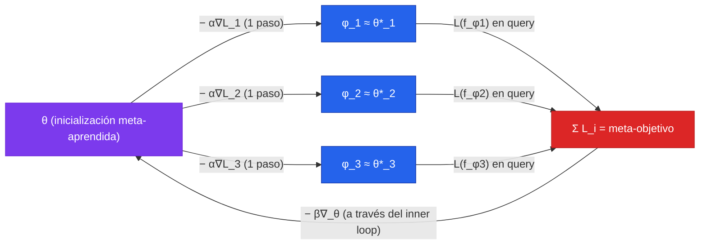

En el [Camino 02](/clases/clase-26/practica/02-prototypical-net) construimos una Prototypical Network: un meta-learner *métrico* que aprende un espacio de embeddings y clasifica por distancia a prototipos. La adaptación a una tarea nueva era una pasada feed-forward — calcular centroides y comparar. MAML ataca el mismo problema de few-shot learning desde el extremo opuesto del espectro: en lugar de aprender una métrica, aprende una **inicialización de pesos** desde la cual unos pocos pasos de descenso de gradiente bastan para resolver cualquier tarea nueva. No hay arquitectura especial, no hay parámetros extra; la adaptación es literalmente SGD, el mismo de siempre. Eso es lo que el título del paper de Finn, Abbeel y Levine (2017) llama *model-agnostic*.

La joya de MAML — y la razón por la que vale la pena implementarlo desde cero en tres frameworks — es su estructura de dos bucles anidados. El **inner loop** adapta los pesos con $K$ pasos de gradiente sobre el support de una tarea. El **outer loop** mide qué tan bien generalizó esa adaptación sobre un query, y retropropaga *a través del inner loop* para ajustar la inicialización. Ese "gradiente a través de un gradiente" es lo que produce las derivadas de segundo orden, y es exactamente el punto donde **PyTorch**, **TensorFlow** y **JAX** divergen en lo que ofrecen. Vamos a verlo escrito tres veces, con el mismo modelo y el mismo problema, para que el contraste quede nítido.

El problema canónico para entender MAML sin un dataset pesado es la **regresión sinusoidal de few-shot**, directamente del paper. Es ligero, corre en CPU en segundos, y produce la figura más didáctica de todo el meta-aprendizaje. Empezamos por ahí.

---

## 1. El problema en una imagen: regresión sinusoidal few-shot

Imaginemos una familia infinita de tareas, donde cada tarea es **una sinusoide distinta**. Una tarea $\mathcal{T}_i$ queda definida por una amplitud $A_i$ y una fase $\phi_i$ muestreadas al azar:

$$
\mathcal{T}_i:\quad y = A_i \sin(x + \phi_i), \qquad A_i \sim \mathcal{U}[0.1,\,5.0], \quad \phi_i \sim \mathcal{U}[0,\,\pi]
$$

Las entradas $x$ se muestrean uniformemente en $[-5.0, 5.0]$. Cada tarea aporta solo $K = 10$ puntos de support (los pocos ejemplos con los que el modelo debe adaptarse) y un conjunto de query disjunto sobre el cual medimos la generalización. La pérdida es MSE.

Lo que hace este problema tan revelador es la siguiente observación: **ningún modelo puede resolver una sinusoide arbitraria mirando solo 10 puntos sin conocimiento previo**. Si los 10 puntos caen todos en la mitad izquierda del rango, un regresor ingenuo no tiene forma de saber qué pasa en la mitad derecha. Pero si el modelo ha *meta-aprendido* que todas las tareas son sinusoides — que comparten estructura periódica, que tienen una amplitud y una fase — entonces 10 puntos bastan para inferir la curva completa, incluso donde no hay datos. Esa es la diferencia entre **aprender una tarea** y **aprender a aprender tareas**.

| Componente | Valor | Rol en MAML |
|---|---|---|
| Distribución de tareas $p(\mathcal{T})$ | sinusoides con $A, \phi$ aleatorios | de aquí se muestrea cada batch de tareas |
| Support set | $K = 10$ pares $(x, y)$ | datos del inner loop (adaptación) |
| Query set | otros $K_q$ pares $(x, y)$ de la misma tarea | datos del outer loop (meta-objetivo) |
| Modelo $f_\theta$ | MLP 2 capas ocultas de 40, ReLU | el regresor; mismo en los 3 frameworks |
| Pérdida | MSE | $\mathcal{L} = \sum_j \lVert f_\theta(x^{(j)}) - y^{(j)} \rVert_2^2$ |
| $\alpha$ (inner lr) | 0.01 | step size del inner loop |
| $\beta$ (outer lr) | 0.001 (Adam) | step size del meta-update |

El generador de tareas es idéntico en los tres frameworks; solo cambia el tipo de array al final. Lo dejamos en NumPy puro para que sea portable:

```python
import numpy as np

def sample_task(K=10, K_query=10, x_range=(-5.0, 5.0)):
    """Una tarea = una sinusoide. Devuelve support y query."""
    A = np.random.uniform(0.1, 5.0)
    phi = np.random.uniform(0.0, np.pi)
    f = lambda x: A * np.sin(x + phi)

    x_s = np.random.uniform(*x_range, size=(K, 1)).astype(np.float32)
    x_q = np.random.uniform(*x_range, size=(K_query, 1)).astype(np.float32)
    y_s = f(x_s).astype(np.float32)
    y_q = f(x_q).astype(np.float32)
    return (x_s, y_s), (x_q, y_q), (A, phi)

def sample_task_batch(meta_batch=25, K=10, K_query=10):
    """Un batch de tareas para una iteración de meta-entrenamiento."""
    return [sample_task(K, K_query) for _ in range(meta_batch)]
```


La separación **support/query** no es decorativa. El inner loop adapta usando el support; el outer loop mide la pérdida sobre el query — datos *distintos* de la misma tarea. Si midiéramos la meta-pérdida sobre el mismo support usado para adaptar, MAML aprendería una inicialización que sobreajusta trivialmente esos 10 puntos en pocos pasos. Al exigir que la pérdida post-adaptación se mida en un conjunto disjunto, internalizamos la lógica de un conjunto de validación *dentro* del bucle de entrenamiento, forzando a que la adaptación **generalice** en vez de memorizar.


---

## 2. La intuición: aprender una inicialización que se adapta rápido

El pretraining clásico sobre todas las tareas (entrenar un solo modelo que minimice la pérdida promedio) falla de un modo instructivo. Si una tarea pide $y = 5\sin(x)$ y otra $y = 5\sin(x + \pi) = -5\sin(x)$, ambas con la misma entrada esperan salidas *opuestas*. El modelo promedio aprende a emitir algo cercano a cero — el promedio de las dos — y queda atrapado en una región del espacio de parámetros desde la cual pocos pasos de gradiente no recuperan ninguna sinusoide concreta.

MAML hace algo más sutil. No busca el centroide de los óptimos $\theta_i^*$ de cada tarea, sino un punto $\theta$ con una propiedad geométrica específica: que **un solo paso de gradiente en la dirección de cualquier tarea caiga cerca del óptimo de esa tarea**.



La distinción $\theta$ vs $\phi$ es la notación que usaremos en todo el capítulo:

- $\theta$ = la **inicialización meta-aprendida**, compartida entre todas las tareas. Es lo que el outer loop optimiza.
- $\phi_i$ = los **pesos adaptados** a la tarea $\mathcal{T}_i$, resultado del inner loop. Son temporales: existen solo para evaluar la meta-pérdida y se descartan.

El paper lo enmarca como maximizar la *sensibilidad* de las pérdidas de tareas nuevas respecto a $\theta$: cuando la sensibilidad es alta, pequeños cambios locales en los parámetros producen grandes mejoras en la pérdida de la tarea. MAML coloca $\theta$ donde el gradiente de cualquier tarea es maximalmente informativo.


La intuición de "una inicialización que se especializa con poquísimos ejemplos" es, en retrospectiva, la misma que sustenta todo el **fine-tuning de modelos fundacionales** moderno: un LLM o un ViT preentrenado es un buen punto de partida desde el cual pocos ejemplos bastan. MAML formalizó y optimizó *explícitamente* esa propiedad en 2017, años antes de que se volviera el paradigma dominante. Ver el [fundamento de meta-aprendizaje](/fundamentos/meta-aprendizaje) para el panorama completo.


---

## 3. El inner loop: SGD manual que preserva el grafo

El inner loop adapta $\theta$ a una tarea con $K$ pasos de descenso de gradiente sobre el support. Con un paso:

$$
\phi_i = \theta - \alpha \nabla_\theta \mathcal{L}_{\mathcal{T}_i}^{\text{support}}(f_\theta)
$$

Con $K$ pasos, se itera ($\phi_i^{(0)} = \theta$):

$$
\phi_i^{(j+1)} = \phi_i^{(j)} - \alpha \nabla_{\phi_i^{(j)}} \mathcal{L}_{\mathcal{T}_i}^{\text{support}}\!\left(f_{\phi_i^{(j)}}\right), \qquad \phi_i = \phi_i^{(K)}
$$

Aquí está **la decisión que hace o rompe MAML**: el inner loop no es un `optimizer.step()` normal. Un paso de optimizador estándar muta los pesos *in place* y rompe el grafo de cómputo — los pesos resultantes serían hojas nuevas, sin historia. Pero el outer loop necesita derivar $\mathcal{L}^{\text{query}}(f_{\phi_i})$ respecto a $\theta$, y $\phi_i$ depende de $\theta$. Si rompemos el grafo, esa dependencia desaparece y el meta-gradiente es incorrecto.

La regla es: **el inner loop debe ser una transformación funcional de los pesos que mantenga vivo el grafo desde $\phi_i$ hasta $\theta$.** En la práctica eso significa:

- En PyTorch: `torch.autograd.grad(..., create_graph=True)` y construir $\phi_i$ con operaciones diferenciables (no `optimizer.step()`, no `with torch.no_grad()`).
- En TensorFlow: el gradiente del inner loop se calcula con un `GradientTape` que está *anidado dentro* del tape del outer loop, de modo que las operaciones que producen $\phi_i$ quedan registradas.
- En JAX: el inner loop es una función pura de $\theta$; al componerla con la meta-pérdida y aplicar `jax.grad`, la diferenciación a través del inner loop es automática y no requiere ningún flag especial.

Veámoslo concreto en cada framework. Definimos primero el modelo de forma que el forward acepte los pesos *explícitamente* (functional), porque eso es lo que permite evaluar $f_{\phi_i}$ con pesos que no son los del módulo.

---

## 4. El outer loop y la diferenciación de segundo orden

El meta-objetivo suma, sobre el batch de tareas, la pérdida de query evaluada con los pesos *adaptados*:

$$
\min_\theta \sum_{\mathcal{T}_i \sim p(\mathcal{T})} \mathcal{L}_{\mathcal{T}_i}^{\text{query}}\!\left(f_{\phi_i}\right) = \sum_{\mathcal{T}_i} \mathcal{L}_{\mathcal{T}_i}^{\text{query}}\!\left(f_{\theta - \alpha \nabla_\theta \mathcal{L}_{\mathcal{T}_i}^{\text{support}}(f_\theta)}\right)
$$

Derivar esto respecto a $\theta$ produce, por la regla de la cadena, el meta-gradiente exacto de una tarea (con un paso de inner loop):

$$
\nabla_\theta \mathcal{L}_{\mathcal{T}_i}^{\text{query}}(f_{\phi_i}) = \big(\underbrace{I - \alpha \nabla_\theta^2 \mathcal{L}_{\mathcal{T}_i}^{\text{support}}(f_\theta)}_{\partial \phi_i / \partial \theta}\big)\, \nabla_{\phi_i} \mathcal{L}_{\mathcal{T}_i}^{\text{query}}(f_{\phi_i})
$$

El factor $(I - \alpha \nabla_\theta^2 \mathcal{L})$ es el **Jacobiano de la adaptación** $\theta \mapsto \phi_i$, y contiene el **Hessiano** de la pérdida de support. Eso es la "derivada de segundo orden" de MAML: para meta-actualizar, hay que derivar a través de un gradiente, lo que exige el Hessiano (o, más exactamente, productos Hessiano-vector que la autodiferenciación obtiene con un backward extra). La derivación detallada está en el [fundamento de optimización bi-nivel](/fundamentos/optimizacion-binivel#4-el-meta-gradiente-y-la-derivada-de-segundo-orden).

La meta-actualización es entonces:

$$
\theta \leftarrow \theta - \beta \nabla_\theta \sum_{\mathcal{T}_i} \mathcal{L}_{\mathcal{T}_i}^{\text{query}}(f_{\phi_i})
$$

Vale detenerse en lo que *significa* el factor Hessiano antes de codificarlo, porque es la única parte de MAML que no es "SGD ordinario" y la que la mayoría de las implementaciones rompen sin darse cuenta. El Jacobiano $\partial\phi_i/\partial\theta = I - \alpha\nabla^2_\theta\mathcal{L}^{\text{support}}$ describe cómo se *deforma* el espacio de parámetros al dar el paso de adaptación. Un gradiente ordinario respondería a la pregunta "¿en qué dirección mover $\theta$ para que la pérdida de query baje *si dejara $\phi_i$ fijo*?". El meta-gradiente responde a una pregunta más fina: "¿en qué dirección mover $\theta$ sabiendo que mover $\theta$ *también cambia el punto $\phi_i$ al que el inner loop me lleva*?". Esa segunda dependencia — $\theta$ influye en el destino de la adaptación, no solo en el punto de partida — es exactamente lo que el Hessiano captura. MAML, multiplicando por $(I - \alpha\nabla^2\mathcal{L})$, precondiciona la dirección de mejora teniendo en cuenta la curvatura local de cada tarea: mueve $\theta$ no solo hacia donde la pérdida post-adaptación es baja, sino hacia donde *el propio acto de adaptarse* es más productivo.

Con $k>1$ pasos de inner loop, ese Jacobiano se vuelve un **producto de $k$ factores**, $\prod_{j=0}^{k-1}(I - \alpha\nabla^2\mathcal{L}(f_{\phi_i^{(j)}}))$, uno por cada paso de adaptación. El meta-gradiente debe retropropagarse a través de toda la trayectoria de optimización interna — el inner loop se comporta, para el backward del outer loop, como una red profunda de $k$ "capas" donde cada capa es un paso de SGD. De ahí que la memoria crezca linealmente con $k$ (sección 7) y que el problema se parezca, matemáticamente, a [backpropagation through time](/fundamentos/backpropagation-through-time) sobre una RNN: el mismo producto de Jacobianos que puede desvanecerse o explotar.

Ahora la implementación en los tres frameworks. La pregunta de ingeniería que cada uno responde a su manera es: *¿cómo le decimos al framework que mantenga vivo ese producto de Jacobianos para que el backward del outer loop pueda atravesarlo?*

### 4.1 PyTorch: functional_call + create_graph

En PyTorch moderno, la herramienta idiomática es `torch.func.functional_call`, que ejecuta un módulo con un diccionario de pesos pasado por fuera — exactamente lo que necesitamos para evaluar $f_{\phi_i}$. El inner loop construye $\phi_i$ con `torch.autograd.grad(..., create_graph=True)`, que es la llave del segundo orden: `create_graph=True` mantiene el grafo del gradiente del inner loop dentro del grafo del outer loop.

```python
import torch
import torch.nn as nn
from torch.func import functional_call

class SineMLP(nn.Module):
    def __init__(self, hidden=40):
        super().__init__()
        self.net = nn.Sequential(
            nn.Linear(1, hidden), nn.ReLU(),
            nn.Linear(hidden, hidden), nn.ReLU(),
            nn.Linear(hidden, 1),
        )

    def forward(self, x):
        return self.net(x)

def mse(pred, y):
    return ((pred - y) ** 2).mean()

def inner_loop(model, params, x_s, y_s, alpha, k_steps, create_graph):
    """K pasos de SGD manual. Devuelve phi (dict de pesos adaptados)."""
    phi = {name: p for name, p in params.items()}
    for _ in range(k_steps):
        pred = functional_call(model, phi, (x_s,))
        loss = mse(pred, y_s)
        grads = torch.autograd.grad(
            loss, phi.values(),
            create_graph=create_graph,   # <-- True = MAML 2do orden; False = FOMAML
        )
        phi = {name: p - alpha * g for (name, p), g in zip(phi.items(), grads)}
    return phi
```

El detalle decisivo está en la última línea del bucle: `phi = {name: p - alpha * g ...}` construye un *nuevo* diccionario con la operación diferenciable `p - alpha * g`. No mutamos nada in place. Como `g` se computó con `create_graph=True`, el nuevo `phi` mantiene una dependencia diferenciable de `params` original. Cuando luego evaluemos la pérdida de query con `phi` y llamemos `.backward()`, el gradiente fluirá a través del Hessiano hasta `theta`.

El meta-step junta todo:

```python
model = SineMLP()
theta = {name: p.clone().detach().requires_grad_(True) for name, p in model.named_parameters()}
meta_opt = torch.optim.Adam(theta.values(), lr=1e-3)

def meta_step(model, theta, task_batch, alpha=0.01, k_steps=1, second_order=True):
    meta_loss = 0.0
    for (x_s, y_s), (x_q, y_q), _ in task_batch:
        x_s, y_s = torch.tensor(x_s), torch.tensor(y_s)
        x_q, y_q = torch.tensor(x_q), torch.tensor(y_q)

        phi = inner_loop(model, theta, x_s, y_s, alpha, k_steps,
                         create_graph=second_order)
        pred_q = functional_call(model, phi, (x_q,))
        meta_loss = meta_loss + mse(pred_q, y_q)

    meta_loss = meta_loss / len(task_batch)
    meta_opt.zero_grad(set_to_none=True)
    meta_loss.backward()          # backprop a través del inner loop -> 2do orden
    meta_opt.step()
    return meta_loss.item()
```

La línea `meta_loss.backward()` es donde ocurre la magia: PyTorch retropropaga a través del query loss, a través de `phi`, y a través del gradiente del inner loop (gracias a `create_graph=True`), llegando hasta `theta`. Ese camino atraviesa el Hessiano de la pérdida de support.

### 4.2 TensorFlow: GradientTape anidado

TensorFlow expresa el segundo orden con **tapes anidados**. El tape externo (`outer_tape`) observa a $\theta$. Dentro de él, un tape interno (`inner_tape`) calcula el gradiente del support — y como ese tape interno vive *dentro* del contexto del externo, las operaciones que producen $\phi_i$ quedan registradas en el grafo del tape externo. Cuando el tape externo deriva la query loss, fluye a través del Hessiano.

```python
import tensorflow as tf

def build_sine_mlp(hidden=40):
    return tf.keras.Sequential([
        tf.keras.layers.Dense(hidden, activation="relu", input_shape=(1,)),
        tf.keras.layers.Dense(hidden, activation="relu"),
        tf.keras.layers.Dense(1),
    ])

def mse(pred, y):
    return tf.reduce_mean((pred - y) ** 2)

def functional_forward(model, weights, x):
    """Forward de un MLP denso usando una lista de pesos externos."""
    h = x
    for i in range(0, len(weights), 2):       # (kernel, bias) por capa Dense
        W, b = weights[i], weights[i + 1]
        h = tf.matmul(h, W) + b
        if i < len(weights) - 2:              # ReLU en capas ocultas, no en la final
            h = tf.nn.relu(h)
    return h

model = build_sine_mlp()
theta = model.trainable_variables
meta_opt = tf.keras.optimizers.Adam(learning_rate=1e-3)

def meta_step(task_batch, alpha=0.01, k_steps=1, second_order=True):
    with tf.GradientTape() as outer_tape:
        meta_loss = 0.0
        for (x_s, y_s), (x_q, y_q), _ in task_batch:
            x_s, y_s = tf.constant(x_s), tf.constant(y_s)
            x_q, y_q = tf.constant(x_q), tf.constant(y_q)

            phi = [tf.identity(w) for w in theta]
            for _ in range(k_steps):
                with tf.GradientTape() as inner_tape:
                    inner_tape.watch(phi)
                    pred_s = functional_forward(model, phi, x_s)
                    loss_s = mse(pred_s, y_s)
                grads = inner_tape.gradient(loss_s, phi)
                if not second_order:
                    grads = [tf.stop_gradient(g) for g in grads]   # FOMAML
                phi = [w - alpha * g for w, g in zip(phi, grads)]

            pred_q = functional_forward(model, phi, x_q)
            meta_loss += mse(pred_q, y_q)
        meta_loss /= len(task_batch)

    meta_grads = outer_tape.gradient(meta_loss, theta)
    meta_opt.apply_gradients(zip(meta_grads, theta))
    return float(meta_loss)
```

Tres puntos clave frente a PyTorch:

- El **anidamiento físico** es lo que habilita el segundo orden: `inner_tape` está escrito dentro del bloque `with outer_tape`. Si lo sacáramos fuera, el outer tape no vería las operaciones del inner loop y el meta-gradiente sería de primer orden por accidente.
- TF no tiene `functional_call`, así que escribimos `functional_forward` a mano. Es tedioso pero explícito: matmul + bias + ReLU, leyendo los pesos de una lista externa.
- `tf.stop_gradient(g)` es la versión TF de cortar el grafo para obtener FOMAML (sección 5). Sin él, el segundo orden está activo por defecto.

### 4.3 JAX: jax.grad de jax.grad — donde JAX brilla

Aquí JAX muestra su naturaleza. En JAX un modelo no tiene estado mutable: el forward es una **función pura** de `(params, x)`. El inner loop, entonces, es simplemente *otra función pura* que toma `theta` y devuelve `phi`. Y diferenciar a través de una composición de funciones puras es, literalmente, para lo que `jax.grad` fue construido. No hay flags `create_graph`, no hay tapes anidados — el segundo orden es la consecuencia natural de componer `jax.grad` consigo mismo.

```python
import jax
import jax.numpy as jnp
from jax import grad, vmap
import optax

def init_params(key, hidden=40):
    k1, k2, k3 = jax.random.split(key, 3)
    scale = 0.1
    return {
        "W1": jax.random.normal(k1, (1, hidden)) * scale, "b1": jnp.zeros(hidden),
        "W2": jax.random.normal(k2, (hidden, hidden)) * scale, "b2": jnp.zeros(hidden),
        "W3": jax.random.normal(k3, (hidden, 1)) * scale, "b3": jnp.zeros(1),
    }

def forward(params, x):
    h = jnp.maximum(x @ params["W1"] + params["b1"], 0.0)
    h = jnp.maximum(h @ params["W2"] + params["b2"], 0.0)
    return h @ params["W3"] + params["b3"]

def mse(params, x, y):
    pred = forward(params, x)
    return jnp.mean((pred - y) ** 2)

def inner_loop(theta, x_s, y_s, alpha, k_steps):
    """Función PURA: theta -> phi. K pasos de SGD."""
    phi = theta
    for _ in range(k_steps):
        grads = grad(mse)(phi, x_s, y_s)        # gradiente del support
        phi = jax.tree_util.tree_map(lambda p, g: p - alpha * g, phi, grads)
    return phi

def task_meta_loss(theta, x_s, y_s, x_q, y_q, alpha, k_steps):
    """Pérdida de query tras adaptar. Componer esto con grad da el 2do orden."""
    phi = inner_loop(theta, x_s, y_s, alpha, k_steps)
    return mse(phi, x_q, y_q)
```

El meta-step. `jax.grad(task_meta_loss)` diferencia a través de `inner_loop` — que a su vez contiene un `grad` — produciendo el segundo orden automáticamente. Vectorizamos sobre el batch de tareas con `vmap`:

```python
def batched_meta_loss(theta, xs_s, ys_s, xs_q, ys_q, alpha, k_steps):
    per_task = vmap(
        lambda xs, ys, xq, yq: task_meta_loss(theta, xs, ys, xq, yq, alpha, k_steps)
    )(xs_s, ys_s, xs_q, ys_q)
    return jnp.mean(per_task)

key = jax.random.PRNGKey(0)
theta = init_params(key)
opt = optax.adam(1e-3)
opt_state = opt.init(theta)

@jax.jit
def meta_step(theta, opt_state, xs_s, ys_s, xs_q, ys_q, alpha=0.01, k_steps=1):
    loss, meta_grads = jax.value_and_grad(batched_meta_loss)(
        theta, xs_s, ys_s, xs_q, ys_q, alpha, k_steps)
    updates, opt_state = opt.update(meta_grads, opt_state)
    theta = optax.apply_updates(theta, updates)
    return theta, opt_state, loss
```

Por qué JAX brilla aquí:

- **El inner loop es una función pura `theta -> phi`.** No hay estado escondido, no hay mutación. El segundo orden es `grad` de algo que contiene `grad` — composición funcional limpia, sin ningún flag especial.
- **`vmap`** vectoriza el meta-batch sin escribir un bucle Python. Cada tarea se adapta en paralelo sobre el eje batched. En PyTorch/TF iteramos tarea por tarea (o usamos `vmap`/`functorch`, que es más reciente).
- **`jax.jit`** compila todo el meta-step — inner loop incluido — a un solo grafo XLA. El primer step compila; los siguientes vuelan.


La diferencia conceptual entre los tres frameworks es *cómo expresan que el inner loop debe permanecer en el grafo del outer loop*. PyTorch lo hace con un flag explícito (`create_graph=True`). TensorFlow lo hace con anidamiento físico de tapes. JAX no necesita hacer nada: como todo es funcional puro, componer `jax.grad(jax.grad(...))` produce el segundo orden por construcción. Esa es la razón por la que el meta-aprendizaje basado en gradiente se siente *nativo* en JAX.


---

## 5. FOMAML: el truco de primer orden

El segundo orden es caro: un backward pass extra para los productos Hessiano-vector. La aproximación **First-Order MAML (FOMAML)** lo elimina ignorando el término Hessiano, es decir, asumiendo $I - \alpha\nabla^2\mathcal{L} \approx I$. El meta-gradiente se reduce a evaluar el gradiente de la pérdida de query *directamente* en los pesos adaptados, sin retropropagar a través del paso de adaptación:

$$
\nabla_\theta \mathcal{L}_{\mathcal{T}_i}^{\text{query}}(f_{\phi_i}) \approx \nabla_{\phi_i} \mathcal{L}_{\mathcal{T}_i}^{\text{query}}(f_{\phi_i})
$$

Crucialmente, el meta-gradiente sigue evaluándose en los valores post-update $\phi_i$ — por eso FOMAML aún meta-aprende algo útil. Solo descarta el precondicionamiento por curvatura.

Implementarlo es trivial: **cortar el grafo entre el inner loop y el outer loop**. Ya dejamos los hooks en el código anterior.

| Framework | Cómo activar FOMAML | Línea |
|---|---|---|
| PyTorch | `create_graph=False` en `torch.autograd.grad` | `inner_loop(..., create_graph=False)` |
| TensorFlow | `tf.stop_gradient(g)` sobre los grads del inner loop | el `if not second_order` del 4.2 |
| JAX | `jax.lax.stop_gradient` sobre `phi` antes del query, o `grad` del query loss en `phi` y reusarlo | ver abajo |

En JAX, la forma limpia de FOMAML es detener el gradiente a través del inner loop:

```python
def task_meta_loss_fomaml(theta, x_s, y_s, x_q, y_q, alpha, k_steps):
    phi = inner_loop(theta, x_s, y_s, alpha, k_steps)
    phi = jax.lax.stop_gradient(phi)            # corta el grafo theta -> phi
    # el gradiente de esto respecto a theta es 0; en su lugar evaluamos
    # el grad de la query loss EN phi y lo usamos como meta-grad:
    return mse(phi, x_q, y_q)

# En la práctica FOMAML se implementa devolviendo grad(mse)(phi, x_q, y_q)
# y sumándolo directamente como meta-gradiente, sin pasar por theta.
```

El hallazgo más citado del paper: **FOMAML rinde casi idéntico a MAML completo**. En MiniImagenet 5-way 1-shot, FOMAML logra 48.07% vs 48.70% de MAML exacto — estadísticamente indistinguible — con un *speed-up de ~33%*. La explicación de Finn et al.: las redes ReLU son "localmente casi lineales" (Goodfellow et al., 2015), y el Hessiano de una función localmente lineal es ≈ 0, así que $I - \alpha\nabla^2 \approx I$ es una buena aproximación.

| Aspecto | MAML (2do orden) | FOMAML (1er orden) |
|---|---|---|
| Hessiano | exacto (HVP, backward extra) | ignorado ($\approx I$) |
| Costo de cómputo | alto | ~33% más rápido |
| Memoria | $O(k)$ con los grafos del inner loop | $O(1)$ — no guarda el grafo |
| Calidad en ReLU nets | exacta | indistinguible empíricamente |
| Cuándo se nota la brecha | — | activaciones suaves, muchos pasos de inner loop |


La equivalencia FOMAML ≈ MAML *no es universal*. Depende de la casi-linealidad local de las redes ReLU. Con activaciones suaves (GELU, tanh) que tienen curvatura significativa, o con muchos pasos de inner loop, el término Hessiano deja de ser despreciable y la brecha reaparece. Reptile e iMAML son otras dos formas de evitar el Hessiano con trade-offs distintos — ver la [comparativa en el fundamento bi-nivel](/fundamentos/optimizacion-binivel#5-aproximaciones-del-meta-gradiente).


---

## 6. Entrenamiento completo y la curva de adaptación (Fig 2 del paper)

Juntamos todo en un bucle de meta-entrenamiento en PyTorch y luego reproducimos el experimento más visual del paper: la curva de adaptación pre-update vs 1 paso vs 10 pasos sobre una sinusoide nueva.

```python
import numpy as np
import torch

torch.manual_seed(0); np.random.seed(0)

model = SineMLP()
theta = {name: p.clone().detach().requires_grad_(True)
         for name, p in model.named_parameters()}
meta_opt = torch.optim.Adam(theta.values(), lr=1e-3)

N_ITERS = 20000
for it in range(N_ITERS):
    task_batch = sample_task_batch(meta_batch=25, K=10, K_query=10)
    loss = meta_step(model, theta, task_batch,
                     alpha=0.01, k_steps=1, second_order=True)
    if it % 2000 == 0:
        print(f"iter {it:6d} | meta-loss {loss:.4f}")
```

Sobre CPU esto entrena en pocos minutos. La meta-loss baja desde ~3-4 (predicción de la sinusoide promedio) hacia ~0.5-1.0, el régimen donde la inicialización ya "sabe" que las tareas son sinusoides.

Ahora la evaluación: tomamos una sinusoide nueva (held-out), le damos solo $K = 10$ puntos de support, y graficamos las predicciones tras 0, 1 y 10 pasos de gradiente.

```python
import matplotlib.pyplot as plt

def adapt_and_predict(model, theta, x_s, y_s, x_plot, k_steps, alpha=0.01):
    phi = {name: p.clone() for name, p in theta.items()}
    for _ in range(k_steps):
        pred = functional_call(model, phi, (x_s,))
        loss = mse(pred, y_s)
        grads = torch.autograd.grad(loss, phi.values())   # eval: sin create_graph
        phi = {n: p - alpha * g for (n, p), g in zip(phi.items(), grads)}
    with torch.no_grad():
        return functional_call(model, phi, (x_plot,))

# tarea de evaluación
A, phi_true = 4.0, 0.5
x_s = torch.tensor(np.random.uniform(-5, 5, (10, 1)).astype(np.float32))
y_s = torch.tensor((A * np.sin(x_s.numpy() + phi_true)).astype(np.float32))
x_plot = torch.tensor(np.linspace(-5, 5, 200, dtype=np.float32).reshape(-1, 1))
y_true = A * np.sin(x_plot.numpy() + phi_true)

plt.plot(x_plot.numpy(), y_true, "k--", label="verdad")
for k, style in [(0, "C0:"), (1, "C1-"), (10, "C2-")]:
    pred = adapt_and_predict(model, theta, x_s, y_s, x_plot, k_steps=k)
    plt.plot(x_plot.numpy(), pred.numpy(), style, label=f"{k} pasos")
plt.scatter(x_s.numpy(), y_s.numpy(), c="r", zorder=5, label="support (K=10)")
plt.legend(); plt.title("MAML: adaptación con pocos pasos de gradiente")
plt.show()
```

Lo que se observa, replicando la Figura 2 del paper:

- **0 pasos (pre-update):** la inicialización $\theta$ produce una curva suave que *no* es la sinusoide objetivo — es algo parecido a la sinusoide "promedio" que el meta-entrenamiento dejó como punto de partida. No resuelve la tarea, pero está *bien posicionada*.
- **1 paso:** la curva ya captura aproximadamente la amplitud y fase correctas. Un solo paso de gradiente sobre 10 puntos basta para acercarse a la sinusoide real. Esto es lo que MAML optimizó explícitamente.
- **10 pasos:** la curva se ajusta casi perfectamente, *incluso en la mitad del rango donde no hay puntos de support*. El modelo ha inferido la estructura periódica completa. Y nótese: sigue mejorando con más pasos pese a haber sido entrenado para máximo desempeño tras *un* paso — señal de que $\theta$ quedó en una región genuinamente amenable a la adaptación, no en un mínimo que solo mejora tras exactamente un paso.

| Pasos de gradiente | MSE 5-shot (paper, Tabla 2) | Qué se ve |
|---|---|---|
| pretrain (baseline) | 2.41 / 2.23 / 2.19 (1/5/10 pasos) | overfitting a los puntos, no infiere la curva |
| MAML, 1 paso | **0.67** | amplitud/fase aproximadas |
| MAML, 5 pasos | **0.38** | ajuste bueno |
| MAML, 10 pasos | **0.35** | ajuste casi perfecto, infiere donde no hay datos |

MAML mejora un orden de magnitud sobre el pretraining. La lección visual: el pretraining sobreajusta los 10 puntos (pasa por ellos pero diverge fuera); MAML infiere la *sinusoide* que los generó.

---

## 7. Gotchas

El bi-nivel anidado es elegante pero frágil. Los tropiezos más comunes al implementar MAML desde cero:

**`create_graph` olvidado.** El error #1. Si en el inner loop usas `torch.autograd.grad(loss, params)` sin `create_graph=True`, el grafo se rompe y `meta_loss.backward()` o bien falla (los pesos adaptados no requieren grad) o silenciosamente computa FOMAML en vez de MAML. En TF, el equivalente es escribir el inner tape *fuera* del outer tape. En JAX no puede pasar: la composición funcional siempre preserva el grafo.

**Segundo orden = memoria.** Mantener el grafo del inner loop para el backward del outer loop consume memoria proporcional al número de pasos $k$. Con $k$ grande o redes grandes, la memoria explota. Mitigaciones: FOMAML ($O(1)$ memoria), gradient checkpointing ($O(\sqrt{k})$), o iMAML (memoria independiente de $k$ vía diferenciación implícita). Ver el [fundamento bi-nivel, sección 6](/fundamentos/optimizacion-binivel#6-el-truco-de-la-diferenciacion-forward-mode-vs-reverse-mode).

**Confundir $\alpha$ y $\beta$.** Son dos learning rates distintos. $\alpha$ (inner, ~0.01-0.4) controla la adaptación; suele ser SGD plano. $\beta$ (outer, ~0.001) controla el meta-update; suele ser Adam. Usar Adam en el inner loop rompe el cálculo del segundo orden (los momentos de Adam no son diferenciables limpiamente respecto a $\theta$). Regla: **inner loop = SGD manual; outer loop = optimizador con estado**.

**El batch de tareas no es un batch de datos.** Un "batch" en MAML es un conjunto de *tareas* (25 sinusoides distintas), no de ejemplos. Dentro de cada tarea hay un support y un query. Es fácil confundir las dos nociones de batch y terminar promediando mal. El meta-gradiente es el promedio sobre las tareas del batch de los gradientes por-tarea.

**Reusar el support como query.** Si adaptas y evalúas la meta-pérdida sobre el *mismo* support, MAML aprende a memorizar esos $K$ puntos en pocos pasos en vez de a generalizar. El query *debe* ser disjunto del support dentro de cada tarea.

**Distinto número de pasos en train vs test.** El paper entrena MiniImagenet con 5 pasos de inner loop pero evalúa con 10. Está bien hacerlo — MAML sigue mejorando con más pasos —, pero hay que ser consciente de que train y test pueden diferir en $k$.


La generalidad "model-agnostic" de MAML **no significa "hyperparameter-free"**. Los $\alpha$ varían fuertemente entre benchmarks (0.4 en Omniglot 5-way, 0.01 en MiniImagenet/sinusoide), el número de pasos difiere entre train y test, y el meta-batch size importa. La fragilidad del entrenamiento bi-nivel es la contracara de su poder; antes de cualquier uso serio, valida con cuidado.


---

## 8. Extensión a clasificación few-shot y conexión con MetaSeg

La sinusoide es el laboratorio; la clasificación few-shot (Omniglot, MiniImagenet) es donde MAML demostró que competía con métodos diseñados específicamente para ello (98.7% en Omniglot 5-way 1-shot, 48.70% en MiniImagenet). El esqueleto es **idéntico** al de regresión; solo cambian tres cosas: el modelo (un CNN en vez de un MLP), la pérdida (cross-entropy en vez de MSE), y el muestreo de tareas (un episodio N-way K-shot en vez de una sinusoide).

```python
# Esqueleto: solo cambian modelo, loss y sampler. El meta_step es el MISMO.
class ConvNet(nn.Module):
    """4 bloques conv 3x3 (64 filtros, BN, ReLU, maxpool) + head lineal a N clases.
    Arquitectura de Vinyals et al. 2016, la estándar en few-shot."""
    ...

def ce_loss(logits, y):
    return torch.nn.functional.cross_entropy(logits, y)

def sample_classification_task(dataset, n_way=5, k_shot=1, k_query=15):
    """Muestrea N clases; K imágenes/clase para support, K_query para query.
    Las etiquetas se re-mapean a 0..N-1 (la tarea no conoce las clases globales)."""
    classes = np.random.choice(dataset.classes, n_way, replace=False)
    support, query = [], []
    for new_label, c in enumerate(classes):
        imgs = dataset.sample(c, k_shot + k_query)
        support += [(img, new_label) for img in imgs[:k_shot]]
        query   += [(img, new_label) for img in imgs[k_shot:]]
    return support, query

# El inner_loop, el outer loop con create_graph, FOMAML: todo idéntico.
# Solo se reemplaza mse(...) por ce_loss(...) y SineMLP por ConvNet.
```

Que el `meta_step` no cambie es *literalmente* el significado de "model-agnostic": la receta inner/outer es indiferente a si la pérdida viene de una MSE de un seno, una cross-entropy de imágenes, o — como veremos — un Dice de segmentación.

**Conexión con MetaSeg (Vyas et al., 2025).** El paper médico de esta clase aplica exactamente esta idea a la **segmentación de imágenes médicas few-shot**. El problema clínico es el régimen donde MAML es más relevante: una patología rara o un protocolo de adquisición nuevo tiene solo un puñado de imágenes anotadas por un especialista, y entrenar desde cero sobreajusta. MetaSeg meta-entrena sobre el conjunto de tareas de segmentación frecuentes (cada órgano o cada modalidad como una tarea $\mathcal{T}_i$) para producir una inicialización que se adapta a una estructura nueva con $K$ ejemplos. La pérdida del inner/outer loop pasa de MSE a una pérdida de segmentación (Dice / cross-entropy por píxel), pero el esqueleto bi-nivel — adaptar con pocos pasos, meta-actualizar a través de la adaptación — es el mismo que acabas de implementar para la sinusoide. Detalles en el [análisis del paper MetaSeg](/papers/metaseg-vyas-2025).

Esto cierra el arco pedagógico: la sinusoide que cabe en 30 líneas y la segmentación de un tumor raro comparten *exactamente* la misma maquinaria. Esa universalidad es la razón por la que MAML, ocho años después, sigue siendo el baseline obligado del meta-aprendizaje basado en optimización.

---

## 9. Comparación lado a lado de los tres frameworks

| Concepto | PyTorch | TensorFlow | JAX |
|---|---|---|---|
| Forward con pesos externos | `torch.func.functional_call(model, phi, (x,))` | `functional_forward` a mano (matmul + ReLU) | `forward(params, x)` — funcional por naturaleza |
| Gradiente del inner loop | `torch.autograd.grad(loss, phi, create_graph=True)` | `inner_tape.gradient(loss, phi)` dentro del outer tape | `jax.grad(mse)(phi, x_s, y_s)` |
| Mantener el grafo (2do orden) | flag `create_graph=True` | anidamiento físico de tapes | automático (composición funcional) |
| Construir $\phi_i$ | dict-comprehension `p - alpha*g` (no in-place) | lista `[w - alpha*g ...]` | `tree_map(lambda p,g: p - alpha*g, ...)` |
| Meta-gradiente | `meta_loss.backward()` | `outer_tape.gradient(meta_loss, theta)` | `jax.grad(batched_meta_loss)(theta, ...)` |
| FOMAML | `create_graph=False` | `tf.stop_gradient(g)` | `jax.lax.stop_gradient(phi)` |
| Batch de tareas | bucle Python sobre tareas | bucle Python dentro del outer tape | `vmap` sobre el eje de tareas |
| Compilación | `torch.compile` (opcional) | `@tf.function` | `@jax.jit` (esencial) |
| Optimizador outer | `torch.optim.Adam(theta.values())` | `tf.keras.optimizers.Adam` | `optax.adam` + `apply_updates` |

La lectura: para **entender** MAML, PyTorch es el más legible (el `create_graph=True` hace visible el segundo orden). Para **producción con grafos estáticos**, TF compila bien con `@tf.function`. Para **meta-aprendizaje serio**, JAX es el más natural: el inner loop como función pura y `vmap`/`jit`/`grad` componibles hacen que el segundo orden y el batch de tareas casi se escriban solos. No es casualidad que gran parte de la investigación moderna de meta-learning viva en JAX.

---

## 10. Cómo seguir

1. **Implementa el inner loop de $k>1$ pasos** en los tres frameworks y mide la diferencia MAML vs FOMAML cuando $k$ crece. Vas a ver la brecha reaparecer.
2. **Cambia la activación a `tanh` o GELU** y verifica que FOMAML empieza a separarse de MAML — la casi-linealidad de ReLU deja de aplicar.
3. **Pasa a clasificación** con Omniglot (descarga liviana, ~20 instancias de 1623 caracteres) usando el esqueleto de la sección 8.
4. **Implementa Reptile** (sección 5.2 del fundamento bi-nivel): es aún más simple, sin support/query separados, y un buen contraste de cuánto se puede simplificar el meta-gradiente.
5. **Lee MetaSeg** y mapea cada componente (inner loop, query loss, meta-batch) a su contraparte de segmentación médica.

---

## 11. Cross-links

- [Camino 02 - Prototypical Networks](/clases/clase-26/practica/02-prototypical-net): meta-learning *métrico* (la familia opuesta a MAML — adaptación feed-forward en vez de por gradiente).
- [Camino 04 - Verificación con redes siamesas](/clases/clase-26/practica/04-siamese-verificacion): el siguiente camino, otra vista del few-shot por comparación.
- [Fundamento: Optimización bi-nivel](/fundamentos/optimizacion-binivel): la matemática completa del meta-gradiente, el Hessiano, FOMAML/Reptile/iMAML y la diferenciación forward vs reverse-mode.
- [Fundamento: Meta-aprendizaje](/fundamentos/meta-aprendizaje): el panorama de las tres familias (métrica, basada en optimización, basada en modelos/memoria).
- [Paper MAML (Finn et al., 2017)](/papers/maml-finn-2017): el paper canónico que implementamos aquí, con los resultados de Omniglot, MiniImagenet, regresión y RL.
- [Paper MetaSeg (Vyas et al., 2025)](/papers/metaseg-vyas-2025): aplicación de MAML a segmentación médica few-shot.

---

**Ver también:** [Hub de práctica - Clase 26](/clases/clase-26/practica) · [Teoría - Clase 26](/clases/clase-26/teoria) · [Profundización - Clase 26](/clases/clase-26/profundizacion).
