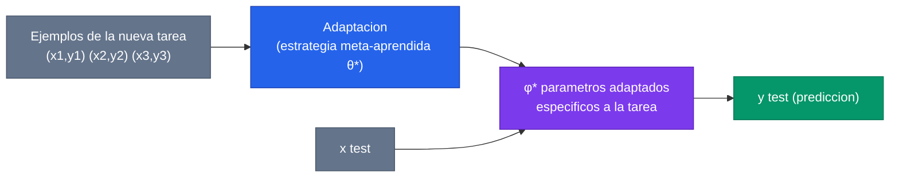
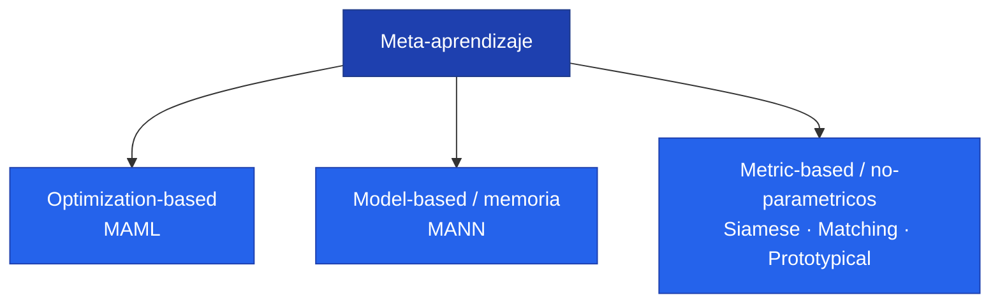

> **Recorrido de las 59 diapositivas** de la clase 26 del Diplomado IA UC (Pablo Messina, "Topicos de Profundizacion"). La clase responde una pregunta incomoda para el deep learning clasico: **¿como aprender una tarea nueva con muy pocos ejemplos?** La respuesta es el meta-aprendizaje — aprender *a aprender* — y la clase la desarrolla desde la intuicion hasta cinco algoritmos emblematicos (MAML, MANN, redes siamesas, Matching Networks, Prototypical Networks) y un panorama de aplicaciones reales, con enfasis en medicina.

---

## 1. El punto de partida: el paradigma supervisado y sus limites

### 1.1 Muchos datos, buena generalizacion

El deep learning de la ultima decada se construyo sobre una receta simple: **muchos datos + modelos grandes -> buena generalizacion**. ImageNet (1.2 millones de imagenes) entreno las CNN que reiniciaron el campo; BERT y la familia GPT escalaron esa idea al texto con corpus de cientos de miles de millones de palabras. La clase abre mostrando justamente esos iconos — ImageNet, BERT, GPT-2/3/4 — como sintesis del paradigma dominante.


El paradigma supervisado tradicional asume **abundancia de datos etiquetados por tarea**. Funciona espectacularmente cuando esa abundancia existe. El meta-aprendizaje ataca el caso opuesto: cuando NO la tenemos.


### 1.2 ¿Que pasa cuando los datos escasean?

La clase plantea tres preguntas que rompen el paradigma:

1. **¿Que pasa si no tenemos un dataset grande?** Imagenologia medica, robotica, sistemas recomendadores nuevos, traduccion de lenguas poco comunes: dominios donde reunir millones de ejemplos etiquetados es imposible o carisimo.
2. **¿Que pasa si queremos una IA de proposito general?** Una IA util en el mundo real debe **adaptarse continuamente** y aprender habilidades nuevas. Re-entrenar desde cero cada vez es ineficiente e impractico; hay que **reutilizar conocimiento previo**.
3. **¿Que pasa si los datos tienen una cola muy larga?** En casi todo problema real, unas pocas clases concentran muchos datos (*big data*) y una **larga cola** de clases raras tiene poquisimos ejemplos (*small data*). La cola larga es la regla, no la excepcion.

### 1.3 El ejemplo de Braque vs Cezanne

El gancho visual de la clase: dadas **6 pinturas** (3 de Braque, 3 de Cezanne), un humano clasifica una pintura nueva como "Braque o Cezanne" sin esfuerzo. ¿Como resolvemos una tarea con solo 6 ejemplos? Por dos razones:

- **Experiencia previa** con muchisimas imagenes (no partimos de cero).
- Capacidad de **adaptarnos rapido** a tareas nuevas apoyandonos en esa experiencia.

El meta-aprendizaje formaliza exactamente esa capacidad. Ver [Few-shot Learning](/fundamentos/few-shot-learning) para el planteamiento del problema.

---

## 2. ¿Que es el meta-aprendizaje?

### 2.1 La definicion: aprender a aprender


**Objetivo del meta-aprendizaje: aprender a aprender.** Sirve cuando el modelo enfrentara **tareas nuevas** (no vistas en entrenamiento), con **pocos ejemplos** por tarea, y por ende necesita la capacidad de adaptarse eficientemente. Para lograrlo, el modelo debe *meta-aprender* una forma de *aprender* que sea eficiente.


En terminos mas tecnicos: el meta-aprendizaje sirve cuando el modelo debe aprender tanto en *train* como en *test*, donde el aprendizaje en test esta limitado a pocos datos. Esa es la diferencia esencial con el supervisado clasico, donde el modelo se congela despues de entrenar.

### 2.2 La analogia del idioma

La clase usa una analogia memorable. Imagina que quieres aprender un idioma nuevo y comparas estrategias:

- Estrategia 1: aprender jugando con Duolingo.
- Estrategia 2: estudiar libros a la antigua.
- Estrategia 3: estudiar con ChatGPT.
- Estrategia 4: estudiar con Open English.
- Estrategia 5: hacer *shadowing* (imitacion) de videos subtitulados y consultar un diccionario.

Pruebas todas, las evaluas, y descubres que la estrategia 5 funciona mejor. Has **meta-aprendido** que la estrategia 5 es la mejor. Ahora puedes *aprender* un idioma nuevo — chino mandarin, por ejemplo — usando la estrategia 5.


La distincion clave: **aprender** un idioma (la tarea) vs **meta-aprender** que estrategia usar para aprender idiomas (la meta-tarea). El meta-aprendizaje opera un nivel mas arriba.


### 2.3 ¿Que cuenta como "estrategia de aprendizaje"?

En machine learning, "estrategia de aprendizaje" se interpreta de forma amplia. Puede ser:

- Los **parametros con los que se inicializa** el modelo (como en fine-tuning) -> esta es la idea de **MAML**.
- Un **algoritmo generico pre-aprendido** que permite aprender clases nuevas anotando en una **memoria** -> esta es la idea de **MANN**.
- Una **estrategia generica** para realizar tareas via instrucciones en lenguaje natural (los prompts de ChatGPT/Gemini) -> esto prefigura el *in-context learning*.
- Que **hiperparametros** usar (arquitectura, optimizador, learning rate, loss, batch size) -> esto conecta con AutoML/NAS.

Esa cosa generica y reutilizable que se meta-aprende es lo que el [survey de Hospedales](/papers/meta-learning-survey-hospedales-2020) llama **meta-knowledge** $\omega$.

### 2.4 Una definicion un poco mas formal

Partimos del aprendizaje supervisado estandar. Con un dataset $\mathcal{D} = \{(x_1,y_1),\dots,(x_N,y_N)\}$ entrenamos un modelo $\hat{y}=f_\theta(x)$ resolviendo:

$$
\theta^* = \arg\min_\theta \mathcal{L}(\mathcal{D};\theta,\omega)
$$

donde $\omega$ representa la **estrategia de aprendizaje** (asunciones sobre como aprender: inicializacion, optimizador, etc.). El meta-aprendizaje convierte $\omega$ en algo a aprender, sobre una **distribucion de tareas**:

$$
\omega^* = \arg\min_\omega \sum_{i=1}^{M} \mathcal{L}^{meta}\big(\theta^{*(i)}(\omega),\,\omega,\,\mathcal{D}^{val\,(i)}_{source}\big)
$$
$$
\text{s.t.}\quad \theta^{*(i)}(\omega) = \arg\min_\theta \mathcal{L}^{task}\big(\theta,\,\omega,\,\mathcal{D}^{train\,(i)}_{source}\big)
$$

con conjuntos de tareas fuente y objetivo:

$$
\mathscr{D}_{source} = \{(\mathcal{D}^{train}_{source}, \mathcal{D}^{val}_{source})^{(i)}\}_{i=1}^{M}, \qquad
\mathscr{D}_{target} = \{(\mathcal{D}^{train}_{target}, \mathcal{D}^{test}_{target})^{(i)}\}_{i=1}^{Q}
$$

Esta es la **vista de optimizacion bi-nivel**: un bucle interno aprende la tarea ($\theta$) y un bucle externo aprende la estrategia ($\omega$). La desarrollamos a fondo en [Optimizacion bi-nivel](/fundamentos/optimizacion-binivel) y en la [profundizacion](/clases/clase-26/profundizacion).

### 2.5 Explicacion visual

La clase muestra un diagrama clave: los **parametros meta-aprendidos** $\theta^\star$ (la estrategia de aprendizaje) procesan los ejemplos de la nueva tarea $\mathcal{D}=(x_1,y_1),(x_2,y_2),(x_3,y_3)$ y producen **parametros adaptados** $\phi^\star$ especificos para esa tarea, que finalmente predicen sobre un input de test $x^{ts}$.



---

## 3. Meta-training y meta-testing

El meta-aprendizaje contempla **dos etapas**, analogas a train/test pero un nivel arriba:

- **Meta-training:** los parametros del modelo se optimizan para **aprender la habilidad de adaptarse** a nuevas tareas. Se busca aprender los parametros $\theta$ (la estrategia).
- **Meta-testing:** el modelo **usa su habilidad de adaptacion** (ya aprendida) sobre nuevas tareas. Se evalua la adaptacion produciendo parametros $\phi$.


El principio rector lo formulo [Vinyals et al. (Matching Networks)](/papers/matching-networks-vinyals-2016): *"our training procedure is based on a simple machine learning principle: test and train conditions must match"*. Si en test vamos a clasificar con 5 ejemplos, en meta-training debemos entrenar simulando exactamente esa condicion — episodios de 5 ejemplos.


### 3.1 Estructura de los datos

Cada instancia de meta-entrenamiento es una **tarea** $\mathcal{D}_i$ con sus propios ejemplos de train y test:

$$
\mathcal{D}_{meta\text{-}train} = \{(\mathcal{D}^{tr}_1,\mathcal{D}^{ts}_1),\dots,(\mathcal{D}^{tr}_n,\mathcal{D}^{ts}_n)\}
$$

En meta-testing aparecen **tareas nuevas** (clases nunca vistas en meta-training), con la misma estructura support/query. Se entrena con tareas de un conjunto de clases y se evalua con tareas de clases disjuntas — esa disjuncion es lo que mide verdadera capacidad de "aprender a aprender", no memorizacion.

---

## 4. Relacion con Few-shot Learning


**Few-shot learning** tiene que ver con el **planteamiento del problema** (N-way, K-shot). **Meta-aprendizaje** tiene que ver con la **estrategia de aprendizaje** (aplicable a few-shot learning, entre otros). No son sinonimos: el meta-aprendizaje es una de las formas de resolver few-shot learning.


### 4.1 El protocolo N-way K-shot

Una tarea de few-shot se describe con dos numeros:

- **N (way):** cuantas clases hay en la tarea (ej. $N=3$: gato, cordero, jabali).
- **K (shot):** cuantos ejemplos etiquetados por clase tenemos en el **support set** (ej. $K=2$).

El modelo ve el support set (N·K ejemplos) y debe clasificar el **query set** (ejemplos nuevos de esas mismas N clases). Cada *task* de meta-training y meta-testing tiene su support y su query. El [camino 01 de la practica](/clases/clase-26/practica/01-episodios-nway-kshot) construye este sampler desde cero.

### 4.2 Datasets de few-shot

La clase presenta los benchmarks canonicos:

| Dataset | Que es | Escala |
| --- | --- | --- |
| **Omniglot** ([Lake et al. 2015](/papers/omniglot-lake-2015)) | El "transpose de MNIST": muchas clases, pocos ejemplos | 1623 caracteres, 50 alfabetos, 20 instancias por caracter |
| **miniImageNet** | Subconjunto de ImageNet para few-shot (creado por Vinyals) | 100 clases, imagenes naturales |
| **Meta-Dataset** (Google 2020) | Coleccion de datasets diversos para evaluar generalizacion cross-domain | Multiples dominios en un solo benchmark |

Omniglot es el dataset fundacional: lo introdujo Lake et al. con el modelo **Bayesian Program Learning**, alcanzando clasificacion one-shot a nivel humano. Hoy es el "hola mundo" del meta-aprendizaje.

---

## 5. Algoritmos emblematicos

La clase organiza los metodos en tres familias. Es la taxonomia didactica que tambien usa el [fundamento de meta-aprendizaje](/fundamentos/meta-aprendizaje):



---

## 6. MAML (2017): aprender una buena inicializacion

[Model-Agnostic Meta-Learning](/papers/maml-finn-2017) (Finn, Abbeel, Levine, 2017) es el algoritmo estrella del meta-aprendizaje basado en optimizacion.

### 6.1 La idea

- Se propone un **algoritmo de meta-entrenamiento** para encontrar una **buena inicializacion** de los parametros de un modelo.
- En meta-test, el modelo ajusta sus parametros a la nueva tarea mediante un **fine-tuning mas eficiente** (pocos pasos de gradiente).
- El algoritmo es **model-agnostic**: se aplica a cualquier modelo entrenado con gradiente (clasificacion, regresion, RL).

### 6.2 La matematica

El objetivo de MAML combina inner y outer loop en una sola expresion:

$$
\min_\theta \sum_{\text{task }i} \mathcal{L}\big(\theta - \alpha\nabla_\theta\mathcal{L}(\theta,\mathcal{D}^{tr}_i),\, \mathcal{D}^{ts}_i\big)
$$

Aqui $\theta$ es el **vector de parametros que se meta-aprende** y $\phi_i^* = \theta - \alpha\nabla_\theta\mathcal{L}(\theta,\mathcal{D}^{tr}_i)$ es el **vector optimo para la tarea $i$** tras un paso de adaptacion. Geometricamente: MAML busca un punto $\theta$ en el espacio de parametros desde el cual un solo paso de gradiente nos acerca al optimo de *cualquier* tarea de la distribucion.

La clase contrasta dos lecturas de la misma formula:

$$
\underbrace{\phi \leftarrow \theta - \alpha\nabla_\theta\mathcal{L}(\theta,\mathcal{D}^{tr})}_{\textbf{Fine-tuning [test-time]}}
\qquad
\underbrace{\min_\theta \sum_{\text{task }i}\mathcal{L}(\theta - \alpha\nabla_\theta\mathcal{L}(\theta,\mathcal{D}^{tr}_i),\mathcal{D}^{ts}_i)}_{\textbf{Meta-learning}}
$$

> **Key idea:** sobre muchas tareas, aprende un vector $\theta$ que transfiere bien via fine-tuning.

### 6.3 El algoritmo

El esquema general (optimization-based approach):

```text
1. Sample task T_i  (o un mini-batch de tareas)
2. Sample datasets disjuntos D_i^tr, D_i^test desde D_i
3. Optimize  φ_i ← θ - α ∇_θ L(θ, D_i^tr)        (inner loop)
4. Update    θ usando ∇_θ L(φ_i, D_i^test)        (outer loop)
   -> esto trae DERIVADAS DE SEGUNDO ORDEN
```

El paso 4 deriva *a traves* del paso 3, lo que introduce el **Hessiano** $\nabla^2_\theta\mathcal{L}$. Existe la aproximacion **first-order (FOMAML)** que lo ignora y casi no degrada. Toda la mecanica esta en [Optimizacion bi-nivel](/fundamentos/optimizacion-binivel) y se implementa en los tres frameworks en el [camino 03 de la practica](/clases/clase-26/practica/03-maml).

### 6.4 Resultados

- **Regresion sinusoidal:** MAML estima partes de la curva donde no hay datos, indicando que aprendio la estructura periodica; un modelo pre-entrenado sin MAML falla en extrapolar (Fig 2 del paper). MAML sigue mejorando con mas pasos de gradiente sin sobreajustar (Fig 3).
- **Clasificacion few-shot:** en Omniglot alcanza 98.7% (5-way 1-shot) y 95.8% (20-way 1-shot); en MiniImagenet 48.70% (5-way 1-shot), comparable o superior a metodos especificos de clasificacion de la epoca.
- **Reinforcement learning:** en locomocion (half-cheetah, ant) MAML se adapta a nuevas velocidades/direcciones en **2-3 pasos** de gradiente, muy por encima de pre-entrenamiento o inicializacion aleatoria (Fig 5).

---

## 7. MANN (2016): aprender a usar una memoria

[One-shot Learning with Memory-Augmented Neural Networks](/papers/mann-santoro-2016) (Santoro et al., Google DeepMind, 2016) representa la familia **model-based / con memoria**.

### 7.1 La idea

- Se propone un **modelo aumentado con memoria** externa, con el objetivo de reconocer y etiquetar caracteres nuevos (combinaciones nunca vistas en entrenamiento) a partir de **un solo ejemplo** (one-shot).
- Se propone ademas un **algoritmo de meta-entrenamiento** que fuerza al modelo a **aprender a usar la memoria**.
- En meta-test, los parametros se mantienen **congelados** (no hay fine-tuning): toda la "adaptacion" ocurre escribiendo y leyendo en la memoria.

### 7.2 El truco del setup episodico

La clave del entrenamiento (Fig 1 del paper): las imagenes $x_t$ se presentan con sus etiquetas **desplazadas en el tiempo** ($y_{t-1}$ junto a $x_t$), y de episodio a episodio se **barajan** clases, etiquetas y muestras. Esto **impide** que el modelo memorice el mapeo clase->etiqueta en sus pesos; lo obliga a una estrategia de *bind and encode* (guardar la representacion ligada a su etiqueta en memoria) y luego *retrieve* (recuperar esa informacion cuando reaparece una clase ya vista).

El acceso es por contenido: similitud coseno + softmax produce pesos de lectura, y la lectura es $r_t = \sum_i w_t(i)\,M_t(i)$. El modulo de escritura **LRUA** (Least Recently Used Access) decide donde escribir combinando ubicaciones poco usadas y la ultima leida. Detalle completo en [Memory-Augmented Networks](/fundamentos/memory-augmented-networks).

### 7.3 Resultados

En Omniglot, la precision por numero de instancia vista de cada clase muestra el "educated guessing":

| Modelo | 1st | 2nd | 3rd | 4th | 5th | 10th |
| --- | --- | --- | --- | --- | --- | --- |
| Human | 34.5 | 57.3 | 70.1 | 71.8 | 81.4 | 92.4 |
| Feedforward | 24.4 | 19.6 | 21.1 | 19.9 | 22.8 | 19.5 |
| LSTM | 24.4 | 49.5 | 55.3 | 61.0 | 63.6 | 62.5 |
| **MANN** | **36.4** | **82.8** | **91.0** | **92.6** | **94.9** | **98.1** |

MANN supera a humanos desde la segunda instancia: a la primera vista solo puede adivinar (no la ha guardado aun), pero apenas la liga en memoria, la recupera con precision creciente.


MANN separa dos formas de aprendizaje: el **lento** (gradiente sobre los pesos, que aprende *como* usar la memoria) y el **rapido** (escritura instantanea en memoria de informacion nueva). Esa separacion prefigura la atencion key-value de los Transformers y el *in-context learning* de los LLMs. Ver [Self-Attention](/fundamentos/self-attention).


---

## 8. Metodos no-parametricos (metric-based)

La tercera familia resuelve clasificacion con una **cantidad potencialmente ilimitada de clases** aprendiendo una **metrica de distancia**: vectores similares para objetos similares. Es, en esencia, un "**KNN meta-aprendido**". La pregunta de fondo: *¿en que espacio comparamos y con que metrica?* La respuesta del campo: **aprende a comparar usando datos** (no pixel-space con distancia $\ell_2$). Fundamento transversal: [Metric Learning](/fundamentos/metric-learning).

### 8.1 Redes Siamesas

[Koch et al. 2015](/papers/siamese-networks-koch-2015): dos torres **gemelas** que comparten pesos mapean dos imagenes a embeddings; una capa de distancia ($L_1$ ponderada) + sigmoide produce la probabilidad de que sean la misma clase. Meta-training: clasificacion binaria (mismo/distinto). Meta-test: clasificacion N-way comparando el query contra cada imagen del support y tomando el argmax. Es el antecedente del deep metric learning. Lo implementamos en el [camino 04 de la practica](/clases/clase-26/practica/04-siamese-verificacion), con su conexion directa a *record linkage* / patient matching.

### 8.2 Matching Networks

[Vinyals et al. 2016](/papers/matching-networks-vinyals-2016): la prediccion es un **vecino mas cercano ponderado en un espacio de embeddings aprendido**:

$$
\hat{y} = \sum_{i=1}^{k} a(\hat{x}, x_i)\, y_i
$$

donde $a$ es un kernel de atencion (softmax de similitudes coseno) sobre el support set. Los embeddings pueden ser **Full Context Embeddings** (computados con un biLSTM que mira todo el support set). La pregunta que dejan abierta — *¿y si hay mas de 1 shot? ¿podemos agregar la informacion de clase en un embedding prototipico?* — la responde el metodo siguiente. Implementacion y el puente con la atencion de Transformers en el [camino 05](/clases/clase-26/practica/05-matching-networks).

### 8.3 Prototypical Networks

[Snell et al. 2017](/papers/prototypical-networks-snell-2017): cada clase se resume en un **prototipo** = centroide de los embeddings de su support set:

$$
c_k = \frac{1}{|\mathcal{D}^{tr}_i|}\sum_{(x,y)\in\mathcal{D}^{tr}_i} f_\theta(x), \qquad
p_\theta(y=k\mid x) = \frac{\exp(-d(f_\theta(x),c_k))}{\sum_{k'}\exp(-d(f_\theta(x),c_{k'}))}
$$

con $d$ = distancia euclidiana (o coseno). Es mas simple que Matching Networks (sin LSTM de contexto) y la eleccion de la distancia euclidiana tiene una justificacion teorica elegante (divergencias de Bregman). Es el baseline de facto del few-shot. Lo construimos en triple framework en el [camino 02](/clases/clase-26/practica/02-prototypical-net).

| Metodo | Como compara | Que aprende |
| --- | --- | --- |
| Siamese | pares query-support, $L_1$ + sigmoide | metrica de verificacion |
| Matching Networks | atencion sobre todo el support | embedding + kernel de atencion |
| Prototypical Networks | distancia a centroides por clase | embedding (metrica fija euclidiana) |

---

## 9. Aplicaciones

La clase cierra con un panorama de aplicaciones, con foco notable en **medicina**.

### 9.1 Medicina

- **[Semi-supervised Meta-learning con Disentanglement](/papers/meta-disentanglement-liu-2021)** (Liu et al., MICCAI 2021 Oral): segmentacion de imagen medica con **generalizacion de dominio** — entrenar en varios centros para generalizar a un centro nuevo no visto, combinando meta-learning estilo MAML con separacion de representaciones anatomicas vs especificas del dominio.
- **[Fit Pixels, Get Labels / MetaSeg](/papers/metaseg-vyas-2025)** (Vyas et al., MICCAI 2025, **Best Paper Award**): un Implicit Neural Representation meta-aprendido que ajusta pixels y decodifica labels simultaneamente, con Dice comparable a U-Net usando ~90% menos parametros.
- **[fMRI Denoising](/papers/fmri-denoising-heo-2025)** (Heo et al., MICCAI 2025): meta-learning para domain adaptation semi-supervisado en denoising de fMRI, aprendiendo un extractor de features invariante al dataset frente al *criteria shift* entre centros.
- La clase tambien lista varios papers de **meta-learning en MICCAI 2025**, señal de que es un area activa en imagen medica.

### 9.2 Computer vision, generacion, NLP, robotica, AutoML

- **Computer vision:** few-shot image recognition, prediccion de pose/movimiento humano, domain adaptation, few-shot segmentation.
- **Generacion de imagenes y video:** few-shot image generation, image-to-image translation, generacion de viewpoints nuevos, *talking heads* desde pocas imagenes.
- **NLP:** adaptarse a programas nuevos (meta program induction), idiomas nuevos (low-resource translation), palabras nuevas (one-shot language modeling), personas nuevas (dialogue agents).
- **Robotica:** *one-shot imitation learning* — aprender una politica desde una sola demostracion.
- **AutoML:** meta-learning en HPO y NAS, performance prediction, algorithm selection/configuration, *learning to learn* (L2L).


Para el lector que trabaja en salud, el hilo conductor es claro: el meta-aprendizaje es la herramienta natural cuando hay **pocos casos anotados** (enfermedades raras), **heterogeneidad entre instituciones** (multi-centro, distintos escaneres/protocolos) y necesidad de **adaptarse a un sitio nuevo** sin re-entrenar desde cero. Son exactamente los retos de desplegar modelos clinicos en produccion.


---

## 10. Sintesis

| Familia | Algoritmo | Que se meta-aprende | Adaptacion en test |
| --- | --- | --- | --- |
| Optimization-based | MAML | una inicializacion $\theta$ | pocos pasos de gradiente |
| Model-based / memoria | MANN | como leer/escribir en memoria | escritura en memoria (pesos congelados) |
| Metric-based | Siamese / Matching / Prototypical | un espacio de embeddings + metrica | comparacion con el support (sin gradiente) |

El meta-aprendizaje no es un algoritmo, es un **marco**: aprender la estrategia de aprendizaje sobre una distribucion de tareas, para adaptarse rapido a tareas nuevas con pocos datos. La [profundizacion](/clases/clase-26/profundizacion) deriva la matematica de la optimizacion bi-nivel, el meta-gradiente de segundo orden y la equivalencia Bregman de Prototypical Networks.

---

**Ver tambien:** [Profundizacion - Math del meta-aprendizaje](/clases/clase-26/profundizacion) · [Practica desde 0](/clases/clase-26/practica) · Fundamentos: [Meta-aprendizaje](/fundamentos/meta-aprendizaje) · [Few-shot Learning](/fundamentos/few-shot-learning) · [Optimizacion bi-nivel](/fundamentos/optimizacion-binivel) · [Metric Learning](/fundamentos/metric-learning) · [Memory-Augmented Networks](/fundamentos/memory-augmented-networks).
