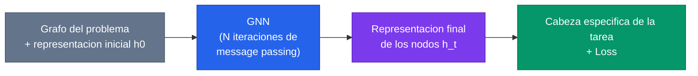
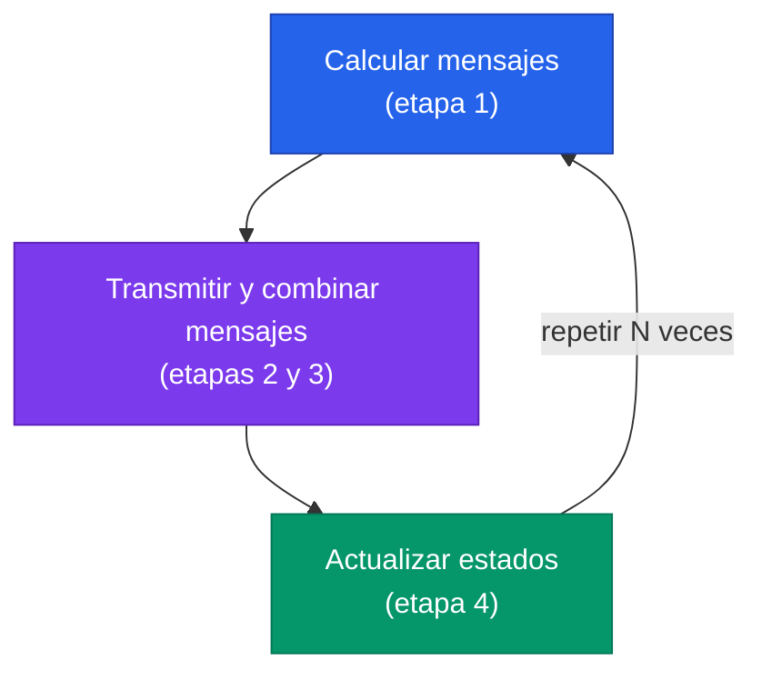

> **Recorrido de las 49 diapositivas** de la clase 27 del Diplomado IA UC (Carlos Aspillaga, "Redes Neuronales de Grafos"). La clase aborda una pregunta que el deep learning clasico contesta mal: **¿como aprende un modelo cuando los datos son relacionales** — no una grilla de pixeles ni una secuencia de tokens, sino un grafo de entidades conectadas? La respuesta son las **Graph Neural Networks (GNN)**, y la clase las desarrolla desde la notacion de grafos, pasando por el mecanismo de *message passing* en cuatro etapas y el concepto de *receptive field*, hasta cuatro modelos concretos (GGNN, GCN, GraphSAGE, R-GCN) y aplicaciones reales en navegacion, quimica y deteccion de bugs.

---

## 1. Introduccion: por que grafos

### 1.1 Motivacion: datos relacionales

Las arquitecturas que vimos hasta ahora asumen una estructura fija del input. Una **CNN** asume una grilla regular (la imagen), donde cada pixel tiene vecinos en posiciones predecibles. Una **RNN o un Transformer** asumen una secuencia ordenada (el texto). Pero buena parte de los datos del mundo real no son ni grilla ni secuencia: son **relacionales**. Una red social es un conjunto de personas conectadas por amistades; una molecula es un conjunto de atomos unidos por enlaces; un knowledge graph es un conjunto de entidades ligadas por relaciones tipadas; el codigo fuente de un programa es un grafo de dependencias entre variables y operaciones.


Un grafo no tiene un orden canonico de sus nodos ni un numero fijo de vecinos por nodo. Cualquier arquitectura que opere sobre grafos debe ser **invariante a la permutacion** de los nodos y tolerar grados variables. Esa restriccion es la que da forma a toda la familia de [Redes Neuronales de Grafos](/fundamentos/redes-neuronales-de-grafos).


### 1.2 Grafos y su notacion

Un grafo se define formalmente como un par:

$$
G = (V, E)
$$

donde $V$ es el conjunto de **nodos** (o vertices) y $E$ es el conjunto de **aristas** (o arcos) que los conectan. El ejemplo de la clase usa siete nodos:

$$
V = \{A, B, C, D, E, F, G\}
$$
$$
E = \{(A,C),(C,F),(F,G),(G,E),(E,A),(E,B),(B,A),(D,C)\}
$$

Cada arista es un par de nodos. Hasta aqui la definicion es identica a la de un grafo en teoria de grafos clasica: lo que cambia con las GNN es que a cada nodo le asociaremos un **vector de features** (su representacion) y aprenderemos a propagarlo por las aristas.

### 1.3 Grafos dirigidos vs no dirigidos

Una arista puede ser **dirigida** (va de un nodo a otro, como en "A sigue a B" en Twitter) o **no dirigida** (la relacion es simetrica, como "A es amigo de B"). La clase hace una observacion importante para la implementacion:


Un **grafo no dirigido tiene un equivalente dirigido** en el que cada arista se representa con **dos aristas dirigidas**, una en cada sentido. Esto significa que basta con implementar la maquinaria para grafos dirigidos: los no dirigidos se reducen a ese caso duplicando aristas. Toda la formulacion del paso de mensajes asume entonces aristas dirigidas.


### 1.4 Matriz de adyacencia

La forma estandar de codificar la estructura de un grafo es la **matriz de adyacencia** $A$, una matriz cuadrada de tamaño $|V| \times |V|$. La clase adopta una convencion concreta que conviene fijar bien, porque es la que hace que la implementacion matricial del paso de mensajes funcione:

$$
A_{ij} = 1 \iff \text{existe la arista que va de } j \text{ hacia } i
$$

Es decir, el elemento $(i,j)$ indica si existe la arista **de $j$ a $i$** (origen $j$, destino $i$). Las columnas son nodos de origen y las filas son nodos de destino. Con esta convencion, la fila $i$ de $A$ marca **de quienes recibe mensajes** el nodo $i$, lo cual es exactamente lo que necesitamos al combinar mensajes entrantes. Para el grafo del ejemplo:

| destino \ origen | A | B | C | D | E | F | G |
| --- | --- | --- | --- | --- | --- | --- | --- |
| **A** | 0 | 1 | 0 | 0 | 1 | 0 | 0 |
| **B** | 0 | 0 | 0 | 0 | 1 | 0 | 0 |
| **C** | 1 | 0 | 0 | 1 | 0 | 0 | 0 |
| **D** | 0 | 0 | 0 | 0 | 0 | 0 | 0 |
| **E** | 0 | 0 | 0 | 0 | 0 | 0 | 1 |
| **F** | 0 | 0 | 1 | 0 | 0 | 0 | 0 |
| **G** | 0 | 0 | 0 | 0 | 0 | 1 | 0 |

Leyendo la fila de A: recibe aristas desde B y desde E. Leyendo la fila de D: no recibe ninguna (es un nodo sin aristas entrantes), detalle que reaparecera mas adelante con el problema de los nodos *OUT-only*.

---

## 2. La GNN: el mecanismo

### 2.1 La idea de alto nivel

Una GNN transforma una **representacion inicial de los nodos** en una **representacion final** mas rica, propagando informacion por la estructura del grafo. El pipeline completo tiene tres bloques:

1. Partimos del **grafo del problema** y de una **representacion inicial de cada nodo** (sus features de entrada $h_0$).
2. La **GNN** procesa el grafo y produce una **representacion final de cada nodo** ($h_t$), que ya incorpora informacion de su vecindario.
3. Sobre esa representacion final aplicamos **elementos especificos de la tarea + un loss** adecuado (seleccion de nodos, clasificacion, prediccion de aristas, etc.).

El corazon de la GNN es el bloque central, y funciona por **paso de mensajes** ([message passing](/fundamentos/message-passing)). Cada iteracion del paso de mensajes se descompone en cuatro etapas que la clase recorre una por una.

### 2.2 Etapa 1 — Calculo de mensajes

Para cada arista del grafo se calcula un **mensaje**. El mensaje es el resultado de una funcion $f$ que puede depender de tres cosas:

$$
\text{mensaje} = f(\,\underbrace{\text{origen}}_{h \text{ del emisor}},\; \underbrace{\text{tipo de arista}}_{\text{relacion}},\; \underbrace{\text{destino}}_{h \text{ del receptor}}\,)
$$


La funcion de mensaje **puede depender de los tres elementos o solo de algunos**. Los modelos concretos se diferencian justamente en que toman como input: el GCN usa solo el estado del nodo origen, el GGNN incorpora el **tipo de arista** mediante una matriz aprendible por relacion, R-GCN generaliza esto a knowledge graphs con muchos tipos de relacion. Esta libertad de diseño es lo que distingue a unas GNN de otras.


### 2.3 Etapa 2 — Traspaso de mensajes

Una vez calculados, los mensajes **se transmiten por las aristas** hacia sus nodos de destino. Cada mensaje viaja en el sentido de la arista (de origen a destino). Esta etapa es puramente de "ruteo": no transforma nada, solo mueve los mensajes calculados hacia donde corresponden segun la estructura del grafo.

### 2.4 Etapa 3 — Combinacion de mensajes

Un nodo recibe, en general, **varios mensajes** (uno por cada arista entrante). En el ejemplo de la clase, un nodo "recibio 4 mensajes". Esos mensajes hay que **agregarlos en uno solo** mediante una funcion de combinacion:

$$
h' = \bigoplus_{m \in \text{mensajes recibidos}} m
$$


La funcion de combinacion **debe ser conmutativa** (invariante al orden): suma, promedio, maximo. Esto es obligatorio porque un grafo no impone ningun orden sobre los vecinos de un nodo — si la agregacion dependiera del orden, la salida cambiaria con una simple permutacion de los nodos y se perderia la invariancia que define a las GNN.


### 2.5 Etapa 4 — Actualizacion del nodo

Finalmente, cada nodo **actualiza su estado** combinando lo que tenia antes con lo que acaba de recibir:

$$
h_t = f(\,\underbrace{h_{t-1}}_{\text{estado anterior}},\; \underbrace{h'}_{\text{mensaje recibido y combinado}}\,)
$$

Es el "paso mas" que la clase enfatiza: no basta con calcular y transmitir mensajes; hace falta **actualizar** el estado del nodo con esa informacion. La funcion de actualizacion puede ser tan simple como una suma seguida de una no linealidad, o tan elaborada como una celda **GRU** (es el caso del GGNN).

### 2.6 Repetir N veces

El mecanismo completo se **repite N veces**. Cada iteracion consta de dos fases que se alternan:

Cada repeticion permite que la informacion viaje **un salto mas** por el grafo. Tras $N$ iteraciones, el estado de un nodo resume informacion de todos los nodos que estan a distancia $\le N$ de el. Esto nos lleva directo al concepto de campo receptivo.

### 2.7 Receptive field

El **receptive field** (campo receptivo) de un nodo es el conjunto de nodos cuya informacion ha logrado alcanzarlo. La clase lo ilustra con una secuencia desde $t=0$ hasta $t=8$:

- En **$t=0$** el nodo solo se conoce a si mismo: su campo receptivo es el propio nodo.
- En **$t=1$** ha recibido mensajes de sus vecinos directos (distancia 1).
- En **$t=2$** llega informacion de los vecinos de sus vecinos (distancia 2).
- ... y asi sucesivamente, de modo que en **$t=k$** el campo receptivo cubre todos los nodos a distancia $\le k$.
- Hacia **$t=8$** (en un grafo de diametro pequeño) el campo receptivo ya abarca practicamente todo el grafo.


El receptive field **crece un salto por iteracion**, de forma analoga a como las capas apiladas de una CNN amplian su campo receptivo sobre la imagen. Esto tiene una consecuencia practica: el numero de iteraciones $N$ controla cuan "lejos" mira cada nodo. Demasiadas iteraciones, sin embargo, hacen que todos los nodos converjan a representaciones indistinguibles — el fenomeno de *over-smoothing*, que es una de las limitaciones de [expresividad de las GNN](/fundamentos/expresividad-gnn).


---

## 3. El objetivo final: que se predice

Tras las $N$ iteraciones, tenemos una representacion final $h_t$ por nodo. Sobre ella se monta la **cabeza de la tarea**. La clase distingue cuatro tipos de objetivo.

### 3.1 Seleccion de nodos

Queremos marcar un subconjunto de nodos (por ejemplo, "que cuentas de una red son bots"). Para cada nodo calculamos un score con una sigmoide y aplicamos un umbral:

$$
x = \sigma(w^\top h_t + b), \qquad \sigma(z) = (1 + e^{-z})^{-1}
$$

Se **seleccionan los nodos con $x > \text{threshold}$**, y el entrenamiento usa una **perdida L2** (o equivalente) sobre el score.

### 3.2 Clasificacion de nodos

Asignar una clase a cada nodo. La cabeza es la misma sigmoide/softmax sobre $h_t$, pero el loss es **cross-entropy**:

$$
x = \sigma(w^\top h_t + b), \qquad \text{Loss} = \text{Cross-Entropy}
$$

Es el caso clasico de los benchmarks de GCN: clasificar documentos en una red de citaciones a partir de sus features y sus vecinos.

### 3.3 Clasificacion del grafo

Aqui la prediccion es **una sola para todo el grafo** (por ejemplo, "esta molecula es toxica o no"). Como la cabeza necesita un vector unico, primero se hace un **readout**: se agregan las representaciones de todos los nodos en un vector de grafo $g$ mediante un promedio:

$$
g = \frac{1}{N}\sum_{n} h_{t,n}, \qquad x = \sigma(w^\top g + b), \qquad \text{Loss} = \text{Cross-Entropy}
$$

El readout por promedio es conmutativo (de nuevo, invariancia a la permutacion); tambien se usan suma o max.

### 3.4 Prediccion de aristas

Si en vez de un solo nodo usamos **pares de nodos**, podemos predecir si entre ellos deberia existir una arista. Esta es la base de los **sistemas de recomendacion sobre grafos** y de la *completion* de knowledge graphs: tomamos $h_t$ de dos nodos, los combinamos y producimos un score de "existe la relacion".

### 3.5 Una consideracion importante: la GNN espera un grafo


La GNN **espera un input tipo grafo, tambien en inferencia**. Si en produccion le entregamos un elemento individual (por ejemplo, un paper suelto) **sin su grafo asociado**, la GNN no podra aprovechar lo que aprendio sobre las conexiones. El grafo no es solo dato de entrenamiento: es parte estructural del input en cada prediccion. Esto contrasta con un clasificador tabular, donde cada ejemplo se evalua de forma aislada.


### 3.6 Parentesis: el problema de los nodos OUT-only

Recordemos el nodo D del ejemplo: solo tiene aristas **salientes**, ninguna entrante. Un nodo *OUT-only* nunca recibe mensajes, asi que su estado **nunca se actualiza** con informacion del resto del grafo — y, peor, la informacion que el produce no le regresa. La solucion estandar es **agregar aristas inversas**: por cada relacion `follows` se añade su inversa `followed_by`. Asi todo nodo participa en ambos sentidos del paso de mensajes y ninguno queda aislado en la propagacion.

### 3.7 Parentesis: implementacion matricial

Toda la maquinaria de "calcular, transmitir y sumar mensajes" se implementa de forma compacta con **algebra matricial**. Si $N$ es la matriz cuyas filas son las representaciones de los nodos y $A$ la matriz de adyacencia (con la convencion $(i,j) = $ arista de $j$ a $i$), entonces el producto realiza de un golpe el **envio y suma de mensajes**:

$$
A \cdot N
$$

Cada fila $i$ del resultado es la **suma de los mensajes que recibe el nodo $i$** desde sus vecinos entrantes. Por ejemplo, si el nodo $c$ recibe de $a$ y de $b$, la fila correspondiente de $A \cdot N$ vale $a + b$; un nodo sin aristas entrantes obtiene $0$. La "preparacion de mensajes" (multiplicar las features por una matriz aprendible por tipo de arista $E_k$) se compone con esta operacion: $A \cdot (N E_k)$ prepara y luego distribuye los mensajes. Esta formulacion es la que hace a las GNN eficientes en GPU.

---

## 4. Modelos concretos y aplicaciones

Las distintas GNN se obtienen eligiendo concretamente las funciones de mensaje, combinacion y actualizacion. La clase presenta tres familias clasicas y cuatro aplicaciones.

### 4.1 GGNN — Gated Graph Neural Networks (Li et al., 2015)

El [GGNN](/papers/ggnn-li-2015) introduce dos ingredientes clave:

- **Mensaje dependiente del tipo de arista:** $m = h \cdot E_k$, donde $h$ son las features del nodo y $E_k$ es una **matriz aprendible para cada tipo de arista $k$**. Esto permite que distintas relaciones propaguen informacion de manera distinta.
- **Combinacion** por suma de mensajes entrantes: $h' = \sum m$.
- **Actualizacion con una GRU:** $h_t = \text{GRU}(h_{t-1}, h')$. La compuerta de la GRU regula cuanta informacion nueva incorpora el nodo y cuanta de su estado anterior conserva, lo que estabiliza muchas iteraciones de paso de mensajes.

La clase deja una pregunta para pensar: ¿que pasaria con los features de un **nodo aislado**, sin aristas entrantes ni salientes? Su $h'$ seria cero y la GRU solo veria su estado anterior — el nodo queda esencialmente "congelado", lo que vuelve a motivar el cuidado con los nodos OUT-only y las aristas inversas.

### 4.2 GCN — Graph Convolutional Networks (Kipf & Welling, 2017)

El [GCN](/papers/gcn-kipf-2017) es el modelo mas popular y el mas simple de los tres:

- **Mensaje** = el propio estado del nodo: $m = h$ (sin matriz por tipo de arista; el GCN basico no tipa las relaciones).
- **Actualizacion** con normalizacion por grado y una matriz aprendible **por iteracion $t$**:

$$
h_t = \sigma\!\left( \frac{1}{\#\text{neigh} + 1} \, W_t\,(h_{t-1} + h') \right)
$$

El factor $\frac{1}{\#\text{neigh}+1}$ **promedia** sobre los vecinos mas el propio nodo (el "+1" es el self-loop). Esa normalizacion evita que nodos de alto grado dominen por su mero numero de conexiones y es la marca distintiva del GCN. La interpretacion como "convolucion" viene de que esta operacion es un filtro espectral de primer orden sobre el grafo.

### 4.3 GraphSAGE (Hamilton et al., 2017)

El [GraphSAGE](/papers/graphsage-hamilton-2017) introduce dos ideas pensadas para **grafos grandes** e **inductivos** (generalizar a nodos no vistos en entrenamiento):

- **Sampling de vecinos:** para hacerlo eficiente, en vez de agregar *todos* los vecinos, **se muestrea un subconjunto** de ellos en cada iteracion. Esto acota el costo aunque un nodo tenga miles de conexiones.
- **Combinacion libre:** $h' = \text{agregacion libre}$ (por ejemplo, promedio; tambien proponen max-pooling o un LSTM sobre los vecinos).
- **Actualizacion por concatenacion + normalizacion**, con matriz aprendible por iteracion:

$$
h_t = \sigma\!\big( W_t\, \text{concat}(h_{t-1}, h') \big), \qquad h_t \leftarrow \frac{h_t}{\lVert h_t \rVert}
$$

La **concatenacion** (en lugar de sumar el estado propio con el agregado, como hace el GCN) preserva por separado "lo mio" y "lo de mis vecinos"; la **normalizacion L2** final mantiene los embeddings en una escala estable.

| Modelo | Mensaje | Combinacion | Actualizacion |
| --- | --- | --- | --- |
| **GGNN** | $m = h\,E_k$ (por tipo de arista) | $\sum m$ | $\text{GRU}(h_{t-1}, h')$ |
| **GCN** | $m = h$ | suma normalizada por grado | $\sigma\big(\tfrac{1}{\#n+1} W_t (h_{t-1}+h')\big)$ |
| **GraphSAGE** | $m = h$ (con sampling de vecinos) | agregacion libre (promedio, max, ...) | $\sigma(W_t\,\text{concat}(h_{t-1},h'))$ + norm L2 |

### 4.4 Aplicacion: R-GCN sobre knowledge graphs (Schlichtkrull et al., 2018)

El [R-GCN](/papers/rgcn-schlichtkrull-2018) (Relational GCN) extiende el GCN a grafos con **muchos tipos de relacion**, como los knowledge graphs. El ejemplo de la clase: el bailarin **Mikhail Baryshnikov** conectado a `Vaganova Academy` por la relacion `educated_at`, y la academia a `Russia` por `location`. A partir de las relaciones conocidas, el R-GCN puede **inferir aristas faltantes** (link prediction): por ejemplo, deducir que Baryshnikov `lived_in` Russia, o que su `:country` es Russia, propagando informacion por las relaciones tipadas. Cada tipo de relacion tiene su propia matriz de transformacion (como el $E_k$ del GGNN), lo que conecta directamente con la idea de mensajes dependientes del tipo de arista.

### 4.5 Aplicacion: GraphNav, navegacion (Chen et al., 2019)

[GraphNav](/papers/graphnav-chen-2019) aplica GNN a **navegacion visual**: un robot localiza su posicion en un grafo topologico del entorno (nodos = lugares como `kitchen`, `hall-1`, `office-1`; aristas = acciones como `Forward`, `Move left`, `Move right`). La GNN integra observaciones visuales con la estructura del mapa para decidir el siguiente movimiento, en un enfoque "behavioral" de la navegacion.

### 4.6 Aplicacion: MPNN, quimica cuantica (Gilmer et al., 2017)

[MPNN](/papers/mpnn-gilmer-2017) (Message Passing Neural Networks) es, ademas de una aplicacion, el **marco unificador** que formaliza todo lo visto en este capitulo: muestra que GGNN, GCN y otras variantes son casos particulares de un mismo esquema de paso de mensajes. Su aplicacion estrella es la **quimica cuantica**: predecir propiedades moleculares (energias, etc.) que tradicionalmente requieren simulaciones DFT **lentas**, sustituyendolas por una **aproximacion con GNN rapida** que trata la molecula como grafo (atomos = nodos, enlaces = aristas).

### 4.7 Aplicacion: Bugs in Code (Allamanis et al., 2018)

[Programs as Graphs](/papers/programs-as-graphs-allamanis-2018) representa el **codigo fuente como un grafo** (con aristas de flujo de datos, de control, de uso de variables, etc.) y entrena una GNN para **detectar bugs**, como el clasico error de usar una variable equivocada (*VarMisuse*). Es un ejemplo de como datos que parecen secuenciales (texto de programa) ganan al modelarse explicitamente con su estructura relacional.

---

## 5. Cierre: trabajo practico y expresividad

La clase termina anunciando el **trabajo practico** (el laboratorio), donde se implementa y entrena una GNN sobre un problema concreto.

En los creditos aparece un hilo teorico que vale la pena seguir: la **expresividad de las GNN**, trabajada por **Pablo Barcelo y Jorge Perez** (de la PUC), entre otros. La pregunta es profunda: ¿que funciones sobre grafos puede o no puede representar una GNN? Se sabe que su poder discriminativo esta acotado por el test de isomorfismo de **Weisfeiler-Lehman**, y que conectarlas con la **logica de primer orden** ayuda a caracterizar exactamente que propiedades pueden capturar. Ese es el tema del paper [The Logical Expressiveness of Graph Neural Networks](/papers/logical-expressiveness-barcelo-2020) y del fundamento [Expresividad de las GNN](/fundamentos/expresividad-gnn).


La idea unificadora de toda la clase: una GNN es una receta de **paso de mensajes** repetida $N$ veces — calcular, transmitir, combinar (de forma conmutativa) y actualizar — sobre una estructura relacional. Lo que cambia entre modelos (GGNN, GCN, GraphSAGE, R-GCN) es la eleccion concreta de esas funciones; lo que comparten es la invariancia a la permutacion y la propagacion de informacion por la topologia del grafo.


---

**Ver tambien:** Fundamentos: [Redes Neuronales de Grafos](/fundamentos/redes-neuronales-de-grafos) · [Message Passing](/fundamentos/message-passing) · [Expresividad de las GNN](/fundamentos/expresividad-gnn). Papers: [GGNN (Li 2015)](/papers/ggnn-li-2015) · [GCN (Kipf & Welling 2017)](/papers/gcn-kipf-2017) · [GraphSAGE (Hamilton 2017)](/papers/graphsage-hamilton-2017) · [R-GCN (Schlichtkrull 2018)](/papers/rgcn-schlichtkrull-2018) · [GraphNav (Chen 2019)](/papers/graphnav-chen-2019) · [MPNN (Gilmer 2017)](/papers/mpnn-gilmer-2017) · [Programs as Graphs (Allamanis 2018)](/papers/programs-as-graphs-allamanis-2018) · [Logical Expressiveness (Barcelo 2020)](/papers/logical-expressiveness-barcelo-2020).
