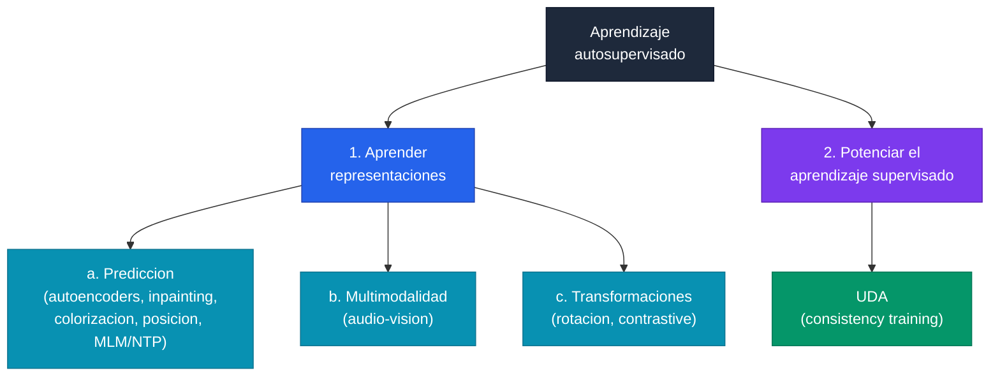
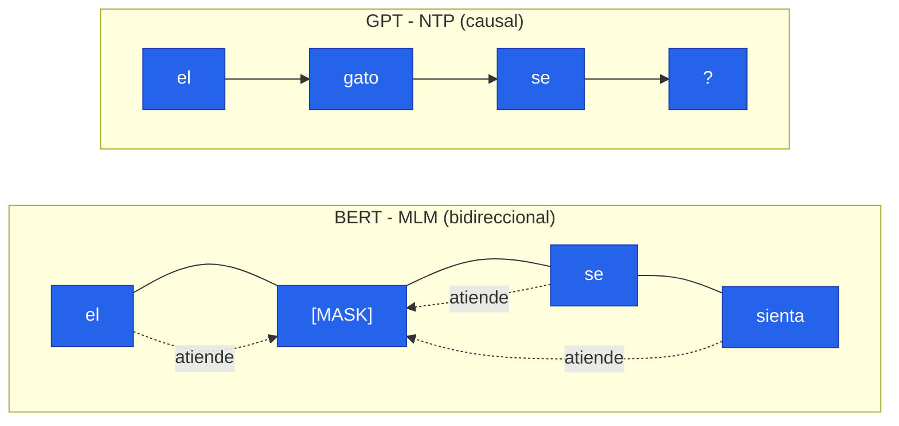
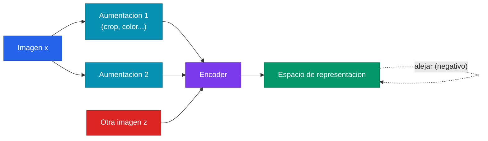
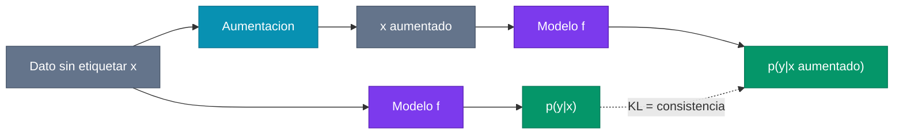

> **Recorrido de las 42 diapositivas** de la clase 28 del Diplomado IA UC (Sebastian Amenabar, "Topicos de Profundizacion"). La clase ataca el talon de Aquiles del deep learning moderno: **necesita enormes cantidades de datos etiquetados**. La idea central es **generar automaticamente el output a predecir** — autosupervision — para aprender representaciones utiles sin anotaciones humanas. El recorrido va de la motivacion cognitiva (como aprenden los ninos) a tres grandes familias de pretext tasks (prediccion, multimodalidad, transformaciones), pasando por autoencoders, inpainting, colorizacion, contrastive learning (SimCLR, MoCo, CLIP), MAE, y cierra mostrando como la autosupervision **potencia** al aprendizaje supervisado con UDA.

---

## 1. Motivacion: el costo de las etiquetas

### 1.1 El deep learning supervisado y su precio

El deep learning funciona **extraordinariamente bien cuando tenemos muchos datos etiquetados**. Ese es justamente el problema: las etiquetas son caras y problematicas. La clase abre con tres preguntas incomodas que pesan sobre cualquier proyecto supervisado real:

- **¿Costo de etiquetado?** Anotar millones de ejemplos cuesta tiempo y dinero, y a veces requiere expertos (radiologos, abogados, linguistas).
- **¿Consistencia de etiquetas?** Distintos anotadores discrepan; el mismo anotador discrepa consigo mismo a lo largo del tiempo.
- **¿Nivel de detalle de las etiquetas?** Una caja, una mascara de segmentacion pixel a pixel y una descripcion en lenguaje natural tienen costos radicalmente distintos.


El paradigma supervisado clasico asume **abundancia de datos etiquetados**. El aprendizaje autosupervisado ataca el caso contrario: tenemos **muchos datos sin etiquetar** y queremos aprender de ellos sin pagar el costo de la anotacion humana.


### 1.2 Los humanos no aprenden con tantas etiquetas

El argumento cognitivo es contundente: **los humanos no usamos tantas etiquetas para aprender**. La clase cita el estudio de **Clerkin y Smith (2019)**, que grabo 17 horas de video durante la hora de comida de ninos entre 7 y 11 meses:

- Se menciona el nombre de **351 objetos distintos 1.941 veces** (5,5 veces cada uno en promedio).
- Pero de esos objetos, **213 nunca son mencionados** en el momento en que el nino tiene el objeto en su campo de vision.

Es decir, la senal "supervisada" (escuchar el nombre mientras se mira el objeto) es escasisima. La mayor parte del aprendizaje perceptual ocurre **sin esa coincidencia** entre etiqueta y observacion.

### 1.3 Hinton: mas parametros que datos

Geoffrey Hinton lo planteo como un argumento de conteo (Reddit AMA, 2014):

> *"The brain has about 10^14 synapses and we only live for about 10^9 seconds. So we have a lot more parameters than data. This motivates the idea that we must do a lot of unsupervised learning since the perceptual input (including proprioception) is the only place we can get 10^5 dimensions of constraint per second."*

El cerebro tiene **~10^14 sinapsis** (parametros) y solo vivimos **~10^9 segundos**. Tenemos muchos mas parametros que datos discretos de "supervision". La unica fuente capaz de aportar las **~10^5 dimensiones de restriccion por segundo** que se necesitan para ajustar tantos parametros es la **entrada perceptual misma** — aprender de la estructura del input, no de etiquetas externas.

### 1.4 "The cake" de LeCun

El gancho mas famoso del campo es la metafora del pastel de Yann LeCun (NeurIPS 2016):

- La **guinda del pastel** es el aprendizaje por refuerzo (poquisimos bits de informacion por muestra).
- El **glaseado** es el aprendizaje supervisado (10 a 10.000 bits por muestra).
- El **bizcocho**, la masa que constituye casi todo el pastel, es el **aprendizaje no supervisado / autosupervisado** (millones de bits por muestra).

La moraleja: **la mayoria del aprendizaje en humanos (y la que deberia dominar en maquinas) es sin supervision explicita.**

### 1.5 La definicion de autosupervision


**Autosupervision: generar de manera automatica el output que debe predecir el modelo.** No hay anotador humano. La etiqueta se deriva del propio dato — ocultando una parte, transformandola, o relacionando modalidades — y el modelo aprende resolviendo esa tarea inventada (la *pretext task*).


Ver el fundamento de [Aprendizaje Autosupervisado](/fundamentos/aprendizaje-autosupervisado) para el marco general. La clase organiza el contenido en dos grandes bloques:

---

## 2. Autosupervision para aprender representaciones: prediccion

### 2.1 La idea general: predecir una parte desde otra

La forma mas directa de fabricar supervision es **predecir una parte del input a partir de cualquier otra parte**. LeCun lo resume en su curso de deep learning con tres variantes que explotan la estructura de **tiempo o espacio**:

- Predecir una parte del input a partir de cualquier otra parte.
- Predecir el **futuro** a partir del **pasado** (video, audio, texto).
- Predecir **partes ocultas** a partir de las visibles.

En los tres casos, el dato completo ya contiene la respuesta: basta esconder una porcion y pedirle al modelo que la reconstruya.

### 2.2 Autoencoders

Un **autoencoder** es la encarnacion mas clasica de esta idea. Es una red en dos partes:

- Un **encoder** que codifica el input en un **codigo** de menor tamano.
- Un **decoder** que, a partir de ese codigo, **reconstruye el input**.

Dos presiones moldean lo aprendido:

- La **reconstruccion** fuerza a que el codigo sea descriptivo del input (si no, el decoder no puede reconstruir).
- El **cuello de botella** (el codigo comprimido) fuerza a que ese codigo tenga **mayor nivel semantico**: a mayor compresion, mayor abstraccion, porque no cabe la informacion pixel a pixel.

Para una imagen $I$ de $50 \times 50 \times 3$, la reconstruccion $\hat{I}$ tiene el mismo tamano y se mide pixel a pixel. Las perdidas habituales son:

$$
\mathcal{L}_{\text{MSE}} = \frac{1}{N}\sum_{i=1}^{N} \left( I_i - \hat{I}_i \right)^2
\qquad\qquad
\mathcal{L}_{\text{L1}} = \frac{1}{N}\sum_{i=1}^{N} \left| I_i - \hat{I}_i \right|
$$

Ambas dan resultados muy similares, pero comparten un defecto importante:


MSE y L1 son **perdidas conservadoras**: ante incertidumbre tienden a **predecir el valor promedio**, lo que produce reconstrucciones borrosas que **pierden los detalles**. Esta limitacion es una de las razones por las que pretext tasks mas exigentes terminan aprendiendo mejores representaciones.


¿De que sirve todo esto? Para **transfer learning**: inicializar un modelo con conocimiento mejor que aleatorio sin necesitar un gran dataset etiquetado. Pero el rendimiento del autoencoder puro es decepcionante. Evaluando *fine-tuning* sobre **PASCAL VOC 2007** (clasificacion, 20 clases, 9.963 imagenes) segun la inicializacion de pesos:

| Inicializacion de pesos | Rendimiento |
| --- | --- |
| Aleatoria | 53,3 |
| Autoencoder | 53,8 |
| Preentrenamiento ImageNet (supervisado) | 79,9 |

El autoencoder apenas supera a la inicializacion aleatoria (53,8 vs 53,3) y queda lejisimos del preentrenamiento supervisado en ImageNet (79,9). La reconstruccion pixel a pixel **no obliga al modelo a entender** la imagen.

### 2.3 Otras tareas de prediccion en imagenes

La respuesta a la debilidad del autoencoder fue disenar pretext tasks que **exijan comprension semantica**:

- **Inpainting** ([Pathak et al. 2016](/papers/context-encoders-pathak-2016)): se oculta una region de la imagen y el modelo debe reconstruirla. Para rellenar el hueco de forma plausible, la red necesita un **mayor entendimiento** del contenido global.
- **Colorizacion** ([Zhang et al. 2016](/papers/colorization-zhang-2016)): a partir de la imagen en **escala de grises**, generar los colores. Saber que el cielo es azul y el cesped verde requiere reconocer objetos.
- **Posicionamiento relativo** ([Doersch et al. 2015](/papers/context-prediction-doersch-2015)): dos redes convolucionales con **pesos compartidos** reciben cada una un parche de la imagen; el objetivo es predecir en cual de las **8 posiciones posibles** esta ubicado un parche respecto del otro. Resolver esto exige entender la disposicion espacial de las partes de los objetos.

Estas tareas si aprenden representaciones utiles. Sobre el mismo benchmark PASCAL VOC 2007:

| Inicializacion de pesos | Rendimiento |
| --- | --- |
| Aleatoria | 53,3 |
| Autoencoder | 53,8 |
| Inpainting | 56,5 |
| Posicionamiento relativo | 65,3 |
| Colorizacion (desde grises) | 65,9 |
| Colorizacion (color) | 65,6 |
| Preentrenamiento ImageNet | 79,9 |

El salto es claro: posicionamiento relativo y colorizacion (~65) casi duplican la brecha hacia ImageNet (79,9) comparado con el autoencoder (53,8). **Un pretext mas exigente produce mejores representaciones.**

### 2.4 ¿Que se aprende?

Una forma de inspeccionar lo aprendido es buscar, para una imagen dada, las **secciones mas cercanas** en el espacio de representacion (vecinos mas proximos). En la tarea de posicionamiento relativo (Zisserman, *Self-Supervised*), las secciones recuperadas corresponden a **partes semanticas analogas** (cabezas con cabezas, ruedas con ruedas), evidencia de que el modelo aprendio nociones de objeto y no solo estadistica de bajo nivel.

### 2.5 Autosupervision en lenguaje: MLM vs NTP

En texto, la prediccion es el regimen dominante de preentrenamiento. La clase contrasta las dos grandes familias:

- **BERT — Masked Language Modelling (MLM)** ([Devlin et al. 2018](/papers/bert-devlin-2018)): se enmascaran tokens al azar y se predicen. Cada token puede **mirar (atender) al pasado Y al futuro** — contexto bidireccional. Ideal para tareas de comprension.
- **GPT — Next Token Prediction (NTP)**: predecir el siguiente token. Cada token solo puede **mirar a los anteriores** — contexto causal (autoregresivo). Ideal para generacion.

En ambos casos la etiqueta (el token oculto, el token siguiente) se genera **automaticamente del propio texto**: es autosupervision pura sobre corpus masivos sin anotar.

---

## 3. Autosupervision con multimodalidad: audio y vision

### 3.1 Correspondencia audio-visual

Si un dato tiene **dos modalidades** que ocurren juntas, la coincidencia misma es la senal. En video, **imagen y audio** estan sincronizados de forma gratuita. [Arandjelovic y Zisserman (2017)](/papers/look-listen-learn-arandjelovic-2017), en *Look, Listen and Learn*, entrenan un modelo a decidir si un fotograma y un clip de audio **corresponden** (ejemplo positivo: vienen del mismo instante) o **no** (negativo: provienen de videos distintos).

Al aprender esa correspondencia, el modelo descubre **conceptos** sin etiquetas: aprende que el sonido de una guitarra va con la imagen de una guitarra. Como subproducto, se puede hacer **retrieval cross-modal**: buscar imagenes a partir de un audio, o audio a partir de una imagen.

### 3.2 Localizar el objeto que suena

Modificando un poco la arquitectura, [Arandjelovic y Zisserman (2018)](/papers/objects-that-sound-arandjelovic-2018), en *Objects that Sound*, logran no solo decir **si** corresponden, sino **en que parte de la imagen** esta el objeto que produce el sonido. La red aprende a **localizar la fuente sonora** sin ninguna anotacion espacial: la supervision sigue siendo solo la coincidencia audio-visual.

### 3.3 VisualBERT

La logica multimodal escala a vision-lenguaje. [Li et al. (2019)](/papers/visualbert-li-2019) proponen **VisualBERT**, un baseline simple que aplica el esquema de atencion de BERT sobre **tokens de texto y regiones de imagen conjuntamente**, aprendiendo a alinear ambas modalidades para tareas como VQA. Es un puente directo entre la autosupervision textual de BERT y la senal multimodal.

---

## 4. Autosupervision con transformaciones

### 4.1 Prediccion de rotaciones (RotNet)

Otra familia genera la etiqueta aplicando una **transformacion conocida** y pidiendo al modelo que la identifique. [Gidaris et al. (2018)](/papers/rotnet-gidaris-2018) proponen **RotNet**: rotar la imagen en $\{0°, 90°, 180°, 270°\}$ y entrenar la red a **clasificar la rotacion aplicada**. Para acertar, la red debe reconocer la orientacion canonica de los objetos — es decir, **entender los objetos**.

La evidencia mas elegante esta en los **filtros aprendidos**: los de la primera capa de RotNet (autosupervisado por rotacion) se parecen notablemente a los aprendidos por entrenamiento **supervisado** sobre ImageNet, pese a no haber visto ni una etiqueta de clase. La tarea de rotacion mide accuracy competitivo en clasificacion PASCAL VOC 2007.

### 4.2 Contrastive learning: la idea


**Aprendizaje contrastivo:** la representacion de una imagen debe ser **mas cercana a ella misma transformada** (ejemplo *positivo* — rotada, recortada, con saturacion alterada, etc.) que a **otra imagen distinta** (ejemplo *negativo*). Se aprende **invarianza** a transformaciones que no cambian el contenido, y **discriminacion** entre instancias distintas.


[Ye et al. (2019)](/papers/invariant-spreading-ye-2019), en *Unsupervised Embedding Learning via Invariant and Spreading Instance Feature*, formalizan esta doble propiedad: las representaciones deben ser **invariantes** (la imagen y su version aumentada se acercan) y **dispersas** (instancias distintas se separan). Ver el fundamento de [Aprendizaje Contrastivo](/fundamentos/aprendizaje-contrastivo) para el detalle de la perdida InfoNCE.

### 4.3 SimCLR

[Chen et al. (2020)](/papers/simclr-chen-2020) presentan **SimCLR** (*A Simple Framework for Contrastive Learning of Visual Representations*), que llevo el contrastive learning al primer plano. Su receta: por cada imagen del batch se generan **dos vistas aumentadas** (el par positivo); todas las demas vistas del batch sirven como negativos. Un encoder seguido de una cabeza de proyeccion produce los embeddings, y la perdida contrastiva acerca el par positivo y aleja los negativos.

Su gran limitacion practica: el rendimiento mejora **aumentando el batch size hasta 4096** para tener muchos negativos en cada paso — lo que exige **muchas TPUs** y mucha memoria.

### 4.4 MoCo: contrastive con menos memoria

[He et al. (2019)](/papers/moco-he-2019) resuelven el problema de memoria con **Momentum Contrast (MoCo)**. La arquitectura tiene **dos redes**:

- Un **encoder** (por el que fluye el gradiente).
- Un **momentum encoder** que **no recibe gradiente**: se actualiza como un promedio movil (momentum) de los pesos del encoder.

El flujo:

- Por cada imagen se generan **dos aumentaciones**; una la procesa el encoder y la otra el momentum encoder — ese es el **par positivo**.
- Hay una **cola FIFO** con $K$ embeddings de imagenes previas que sirven de **ejemplos negativos**.
- Como por las codificaciones de la cola **no fluye gradiente**, se puede comparar contra **miles de imagenes** con **mucho menor requerimiento de memoria** que SimCLR (que necesita todo en el batch vivo).

[Chen et al. (2020)](/papers/moco-v2-chen-2020) refinan la idea en **MoCo v2**, incorporando la cabeza de proyeccion y mejores aumentaciones de SimCLR sobre la eficiente arquitectura de MoCo.

### 4.5 SimCLR vs MoCo: numeros

Detalles importantes a recordar: **SimCLR** alcanza buen rendimiento a costa de batches gigantes (4096, muchas TPUs); **MoCo** logra resultados comparables con **menos requisitos computacionales**.

Evaluacion de *features* en **ImageNet** (clasificador lineal sobre todos los labels):

| Metodo | Top-1 Accuracy |
| --- | --- |
| Rotacion | 55,4 |
| MoCo v1 | 60,2 |
| SimCLR | 69,3 |
| MoCo v2 | 71,1 |
| Entrenar con todos los labels (supervisado) | 76,0 |

Y el regimen **semi-supervisado** en ImageNet (Top-5 con muy pocos labels):

| Metodo | Top-5 con 1% labels | Top-5 con 10% labels |
| --- | --- | --- |
| Sin preentrenamiento | 48,4 | 80,4 |
| SimCLR | 75,5 | 91,2 |
| Entrenando con todos los labels | 93,1 | — |

La lectura clave: con preentrenamiento contrastivo y **solo 1% de las etiquetas**, SimCLR (75,5 Top-5) supera ampliamente al modelo entrenado desde cero (48,4), y con 10% se acerca al techo supervisado. **El contrastive learning vuelve la supervision mucho mas eficiente en datos.**

### 4.6 CLIP: contrastive texto-imagen

[Radford et al. (2021)](/papers/clip-radford-2021) llevan el contrastive a la multimodalidad masiva con **CLIP** (*Contrastive Language-Image Pre-training*):

- Usa **400 millones de pares texto-imagen** recolectados de internet.
- El **embedding de una imagen** debe ser similar al **embedding de su descripcion** textual, y disimilar al de las demas descripciones del batch (contrastive cruzado entre modalidades).

El resultado mas impactante es la capacidad **zero-shot**: para clasificar una imagen nueva, **sin ningun dato etiquetado a mano**, se generan descripciones candidatas ("una foto de un perro", "una foto de un gato") y se elige el **texto cuyo embedding es mas parecido** al de la imagen. CLIP demostro que la senal contrastiva texto-imagen a escala produce representaciones transferibles a una enorme variedad de tareas.

### 4.7 Contrastive learning en otros dominios

La gracia de la autosupervision es que **se adapta a cada dominio**:

- **Medicina** — [Zhang et al. (2020)](/papers/convirt-zhang-2020) proponen **ConVIRT**: aprender representaciones medicas a partir de **pares imagen-texto** (radiografias y sus reportes). Con un dataset de preentrenamiento de **220.000 pares** imagen-texto y **3 dias en una sola GPU Titan RTX (24 GB)**, las representaciones transfieren a multiples benchmarks medicos (RSNA con 25.000 imagenes, CheXpert con 220.000, COVIDx con 14.000, MURA con 33.000). Es el antecesor directo de CLIP en el dominio clinico.
- **Urbano** — [Stalder et al. (2023)](/papers/urban-ssl-stalder-2023) aprenden una **metrica de distancia** usando fotografias tomadas en el **mismo lugar a traves del tiempo**, para detectar cambios en la vivienda urbana a partir de imagenes a nivel de calle. La senal autosupervisada (mismo lugar = cercano) reemplaza anotaciones costosas.

### 4.8 MAE: el autoencoder enmascarado renace

[He et al. (2022)](/papers/mae-he-2022) cierran el circulo con **Masked Autoencoder (MAE)**, que revive la idea del *denoising autoencoder* pero adaptada al **Vision Transformer** ([Dosovitskiy et al. 2021](/papers/vit-dosovitskiy-2021)):

- Se **enmascara una fraccion alta** de los parches de la imagen y se entrena a reconstruirlos.
- La tarea es **mas adecuada a la arquitectura Transformer**: lidiar con parches ocultos **no es trivial en una CNN**, pero es natural en un ViT que procesa tokens.
- Se **ahorra computo** procesando **solo los parches visibles** en el encoder (los ocultos se rellenan recien en el decoder).
- Funciona bien **sin aumentaciones tan intensas** como las que necesita el contrastive learning.

[Feichtenhofer et al. (2022)](/papers/mae-video-feichtenhofer-2022) extienden MAE a **video** (*Masked Autoencoders As Spatiotemporal Learners*): enmascarar parches espacio-temporales y reconstruirlos, aprovechando la enorme redundancia del video para enmascarar fracciones aun mayores.

---

## 5. Autosupervision para potenciar el aprendizaje supervisado

### 5.1 UDA: consistency training

Hasta aqui la autosupervision sirvio para **aprender representaciones** que luego se transfieren. El segundo bloque la usa de forma distinta: como **complemento del aprendizaje supervisado cuando hay pocas etiquetas** — esto es **aprendizaje semi-supervisado**.

[Xie et al. (2019)](/papers/uda-xie-2019) proponen **UDA** (*Unsupervised Data Augmentation for Consistency Training*). La intuicion es muy similar al contrastive learning:


**Principio de consistencia:** el modelo deberia realizar **predicciones muy similares** para un dato y para ese **mismo dato transformado**. Se agrega una **regularizacion** que obliga al modelo a cumplir esa consistencia, usando los abundantes datos **sin etiquetar**.


Como la salida del modelo es una **distribucion de probabilidad**, la consistencia se mide con la **divergencia KL** entre la prediccion sobre el dato original y la prediccion sobre el dato aumentado:

$$
D_{KL}\big(\, p_\theta(y \mid x)\,\|\,p_\theta(y \mid \hat{x})\,\big)
$$

La **divergencia KL** mide la diferencia entre dos distribuciones de probabilidad: vale **0 cuando son identicas** y crece a medida que difieren. Minimizar este termino sobre datos no etiquetados empuja al modelo a ser **estable frente a la aumentacion** $\hat{x}$. Ver el fundamento de [Aprendizaje Semi-Supervisado](/fundamentos/aprendizaje-semi-supervisado).

### 5.2 La clave esta en la aumentacion

El truco de UDA es usar aumentaciones **fuertes y realistas**, especificas de cada modalidad:

- En **imagenes**, sobre **ImageNet con 10% de las etiquetas** (y el resto de los datos como no etiquetados con la perdida de UDA), se logran mejoras notables de Top-1/Top-5 frente a entrenar solo con ese 10%.
- En **texto**, la aumentacion estrella es la **back-translation**: traducir una frase a otro idioma y de vuelta al original genera una parafrasis que **preserva el significado** pero cambia las palabras — perfecta para la perdida de consistencia en clasificacion de texto.

Este es el contenido que se trabaja en el **laboratorio** de la clase.

---

## 6. Resumen: las ideas que quedan


**Las cinco ideas clave del aprendizaje autosupervisado:**

1. El **output objetivo a predecir se genera automaticamente** — no hay anotador humano.
2. Nos **ahorramos el costo de etiquetar**, que puede ser altisimo cuando se necesitan **profesionales** (por ejemplo, en medicina).
3. Permite **aprender representaciones** reutilizables en diversas tareas; una vez aprendidas, se entrenan modelos con **menos datos** (igual que con features preentrenados).
4. Permite **complementar el aprendizaje supervisado** con datos sin etiquetar (UDA, semi-supervisado).
5. Mas que una solucion unica, lo importante es la **creatividad para disenar el pretext** segun las caracteristicas del **dominio** en que se aplicara.


### 6.1 Para seguir profundizando

La clase deja punteros para ir mas alla:

- **Tutorial de OpenAI** (2021, ~2 horas): mas tecnicas, funciones de perdida y mayor profundidad.
- **A Cookbook of Self-Supervised Learning** (arXiv 2304.12210, 2023, 45 paginas): fundamentos teoricos y recomendaciones practicas sobre aumentacion, batch size, hiperparametros, evaluacion y tiempo de entrenamiento con SSL.
- **USB (Unified Semi-supervised Benchmark)**: libreria con tecnicas de semi-supervisado posteriores a UDA.

El hilo conductor de toda la clase es el mismo: **la estructura del dato es, por si misma, una fuente inagotable de supervision gratuita** — solo hace falta inventar la tarea correcta para extraerla.
