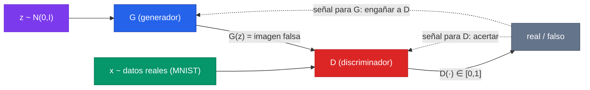
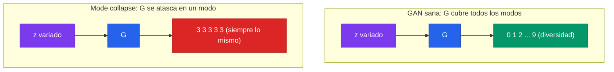

Las GAN son, de lejos, el modelo generativo más extraño de implementar la primera vez. No hay una pérdida que minimizar de cabo a rabo: hay dos redes que se entrenan en sentidos opuestos, una *falsificador* y otra *detective*, y el "aprendizaje" emerge de su pelea. Ese giro conceptual — pasar de "minimizar un error" a "encontrar el equilibrio de un juego" — es lo que hace valioso construir una GAN desde cero, con un MLP minúsculo sobre MNIST, antes de tocar cualquier arquitectura grande. Una vez que el bucle alternado de dos optimizadores se vuelve familiar, todo lo demás (DCGAN, StyleGAN, los discriminadores de la difusión) es decoración encima de la misma idea.

Vamos a implementar la GAN original de Goodfellow et al. (2014) en su forma más esquelética: un **generador** $G$ que mapea ruido $z \sim \mathcal{N}(0, I)$ a una imagen de 784 píxeles, y un **discriminador** $D$ que mira una imagen y emite la probabilidad de que sea real. Lo escribiremos tres veces — **PyTorch**, **TensorFlow** y **JAX** — con el mismo modelo, el mismo dataset y la misma pérdida, para que la única diferencia visible sea *cómo cada framework expresa el entrenamiento de dos redes acopladas*. El fundamento conceptual completo (el trilema generativo, dónde caen las GAN frente a VAE y difusión) está en el [fundamento de modelos generativos](/fundamentos/modelos-generativos); aquí nos concentramos en el código correcto y en por qué cuesta tanto que converja.

---

## 1. El juego adversarial en una imagen

Una GAN tiene dos jugadores con objetivos opuestos:

- El **generador** $G_{\theta_G}: \mathbb{R}^{d_z} \to \mathbb{R}^{784}$ toma un vector de ruido $z$ y produce una imagen falsa $G(z)$. Su meta es engañar a $D$.
- El **discriminador** $D_{\theta_D}: \mathbb{R}^{784} \to [0,1]$ toma una imagen y emite $D(x)$, la probabilidad de que sea real. Su meta es no dejarse engañar.

Goodfellow formuló esto como un **juego minimax** sobre una sola función de valor $V(D, G)$:

$$
\min_G \max_D \; V(D, G) = \mathbb{E}_{x \sim p_{\text{data}}}\big[\log D(x)\big] + \mathbb{E}_{z \sim p_z}\big[\log\big(1 - D(G(z))\big)\big]
$$

Leído despacio: $D$ quiere **maximizar** $V$ — empujar $D(x)$ hacia 1 en imágenes reales y $D(G(z))$ hacia 0 en falsas. $G$ quiere **minimizar** $V$ — pero $G$ solo aparece en el segundo término, así que lo único que puede hacer es empujar $D(G(z))$ hacia 1 (hacer $\log(1 - D(G(z)))$ muy negativo). Es un tira y afloja: cada mejora de un jugador empeora la posición del otro.



El equilibrio teórico (el óptimo de Nash del juego) ocurre cuando $G$ reproduce exactamente la distribución de los datos, $p_g = p_{\text{data}}$, y en ese punto $D(x) = \tfrac{1}{2}$ para todo $x$: el discriminador no puede distinguir nada y solo le queda tirar una moneda. Esa es la meta. El problema, como veremos, es *llegar* ahí.


La GAN no tiene una "función de pérdida" en el sentido habitual. Tiene una **función de valor** que un jugador maximiza y el otro minimiza. No existe un único número que baje monótonamente durante el entrenamiento — si la pérdida de $D$ baja, la de $G$ tiende a subir, y viceversa. Por eso *mirar la curva de pérdida no sirve para saber si una GAN va bien*; hay que mirar las muestras generadas. Esta es la primera intuición que rompe a quien viene de la clasificación supervisada.


---

## 2. El entrenamiento alternado: dos pasos por iteración

Como $D$ y $G$ tienen objetivos opuestos, no se pueden optimizar a la vez con un solo gradiente. El algoritmo de Goodfellow **alterna**: en cada iteración da un paso (o varios) de ascenso para $D$ y luego un paso de descenso para $G$.

**Paso D (maximizar $V$ respecto a $D$).** Con $G$ congelado, queremos que $D$ acierte. Maximizar $\log D(x) + \log(1 - D(G(z)))$ equivale a **minimizar** la cross-entropy binaria con etiquetas *real = 1* y *falso = 0*:

$$
\mathcal{L}_D = -\mathbb{E}_{x \sim p_{\text{data}}}\big[\log D(x)\big] - \mathbb{E}_{z \sim p_z}\big[\log\big(1 - D(G(z))\big)\big]
$$

**Paso G (el truco non-saturating).** La formulación original pide a $G$ minimizar $\log(1 - D(G(z)))$. El problema: al principio del entrenamiento $G$ genera basura, $D$ la rechaza con confianza ($D(G(z)) \approx 0$), y ahí la curva $\log(1 - D(G(z)))$ es **plana** — su gradiente respecto a $\theta_G$ es casi cero. $G$ no recibe señal justo cuando más la necesita. Esto es la **saturación del gradiente**.

La solución que el propio Goodfellow propone en el paper es el **truco non-saturating**: en vez de pedir a $G$ minimizar $\log(1 - D(G(z)))$, le pedimos **maximizar** $\log D(G(z))$ (equivalentemente, minimizar $-\log D(G(z))$):

$$
\mathcal{L}_G = -\mathbb{E}_{z \sim p_z}\big[\log D(G(z))\big]
$$

Ambos objetivos tienen el mismo óptimo (que $D(G(z)) \to 1$), pero el non-saturating da gradientes **fuertes** cuando $G$ va mal y $D(G(z)) \approx 0$ — exactamente al revés que la versión original. En la práctica, esto es *lo que hace que las GAN entrenen*. En BCE con etiquetas, equivale a entrenar $G$ usando las imágenes falsas pero **etiquetándolas como reales (1)**: le decimos a la pérdida "esto debería haber sido real", y el gradiente empuja a $G$ a hacerlas más convincentes.

| | Etiqueta para imágenes reales | Etiqueta para imágenes falsas | Optimiza |
|---|---|---|---|
| **Paso D** | 1 (real) | 0 (falso) | $\theta_D$ |
| **Paso G** (non-saturating) | — | **1** (mentimos: "son reales") | $\theta_G$ |


El non-saturating es *casi gratis* de implementar — solo se cambia la etiqueta del lote falso de 0 a 1 en el paso de $G$ — y es la diferencia entre una GAN que aprende y una que se queda muerta. Si tu generador no mejora nunca, lo primero que hay que revisar es si estás minimizando $\log(1-D(G(z)))$ (malo) o maximizando $\log D(G(z))$ (bueno).


### La arquitectura compartida

Para que los tres frameworks sean comparables, fijamos la misma topología MLP en todos. MNIST son imágenes de $28 \times 28 = 784$ píxeles; las aplanamos y normalizamos a $[-1, 1]$ (por eso $G$ termina en `tanh`).

| Red | Entrada | Capas ocultas | Salida | Activaciones |
|---|---|---|---|---|
| $G$ | $z \in \mathbb{R}^{64}$ | $256 \to 512 \to 1024$ | $784$ | LeakyReLU(0.2) ocultas, **tanh** salida |
| $D$ | $x \in \mathbb{R}^{784}$ | $1024 \to 512 \to 256$ | $1$ (logit) | LeakyReLU(0.2) ocultas, **lineal** salida (logit) |

Dos decisiones de dimensiones que importan y que repetiremos en los tres frameworks:

- $D$ emite un **logit** (sin sigmoide), no una probabilidad. Usamos `BCEWithLogitsLoss` / `from_logits=True` / `sigmoid_binary_cross_entropy`, que son numéricamente estables (combinan sigmoide + log internamente). Aplicar sigmoide a mano y luego `log` es la receta para `NaN`.
- $G$ termina en `tanh` (salida en $[-1, 1]$), por eso normalizamos MNIST a $[-1, 1]$ y no a $[0, 1]$. Si las escalas no coinciden, $D$ distingue real de falso por el rango y no por el contenido — un bug sutil y común.

---

## 3. PyTorch: dos `nn.Module`, dos optimizadores

PyTorch es el más directo para entender el bucle alternado: dos módulos, dos `optim.Adam`, y dos llamadas a `.backward()` por iteración. La clave es **a qué parámetros apunta cada optimizador** y **cuándo usar `.detach()`** para no propagar gradiente al generador durante el paso de $D$.

```python
import torch
import torch.nn as nn

DEVICE = "cuda" if torch.cuda.is_available() else "cpu"
Z_DIM = 64
IMG_DIM = 784  # 28*28

class Generator(nn.Module):
    def __init__(self, z_dim=Z_DIM, img_dim=IMG_DIM):
        super().__init__()
        self.net = nn.Sequential(
            nn.Linear(z_dim, 256),  nn.LeakyReLU(0.2),
            nn.Linear(256, 512),    nn.LeakyReLU(0.2),
            nn.Linear(512, 1024),   nn.LeakyReLU(0.2),
            nn.Linear(1024, img_dim),
            nn.Tanh(),               # salida en [-1, 1]
        )

    def forward(self, z):            # z: (B, z_dim) -> (B, 784)
        return self.net(z)

class Discriminator(nn.Module):
    def __init__(self, img_dim=IMG_DIM):
        super().__init__()
        self.net = nn.Sequential(
            nn.Linear(img_dim, 1024), nn.LeakyReLU(0.2),
            nn.Linear(1024, 512),     nn.LeakyReLU(0.2),
            nn.Linear(512, 256),      nn.LeakyReLU(0.2),
            nn.Linear(256, 1),        # emite un LOGIT, sin sigmoide
        )

    def forward(self, x):            # x: (B, 784) -> (B, 1)
        return self.net(x)
```

El loop de entrenamiento. `criterion = BCEWithLogitsLoss()` espera logits, no probabilidades. Etiquetas: real = 1, falso = 0. El non-saturating aparece al final, cuando entrenamos $G$ con etiquetas **de unos** sobre las imágenes falsas.

```python
from torchvision import datasets, transforms
from torch.utils.data import DataLoader

# MNIST normalizado a [-1, 1] para casar con la tanh de G
tfm = transforms.Compose([
    transforms.ToTensor(),
    transforms.Normalize((0.5,), (0.5,)),   # x -> (x - 0.5) / 0.5  =>  [-1, 1]
])
loader = DataLoader(datasets.MNIST(".", train=True, download=True, transform=tfm),
                    batch_size=128, shuffle=True, drop_last=True)

G = Generator().to(DEVICE)
D = Discriminator().to(DEVICE)
opt_G = torch.optim.Adam(G.parameters(), lr=2e-4, betas=(0.5, 0.999))  # betas de DCGAN
opt_D = torch.optim.Adam(D.parameters(), lr=2e-4, betas=(0.5, 0.999))
criterion = nn.BCEWithLogitsLoss()

for epoch in range(50):
    for real, _ in loader:
        real = real.view(-1, IMG_DIM).to(DEVICE)   # (B, 784)
        B = real.size(0)
        ones  = torch.ones(B, 1, device=DEVICE)     # etiqueta "real"
        zeros = torch.zeros(B, 1, device=DEVICE)    # etiqueta "falso"

        # ---------- Paso D: maximizar log D(x) + log(1 - D(G(z))) ----------
        z = torch.randn(B, Z_DIM, device=DEVICE)
        fake = G(z)                                 # (B, 784)
        d_real = D(real)                            # logits sobre reales
        d_fake = D(fake.detach())                   # detach: NO propagar a G aquí
        loss_D = criterion(d_real, ones) + criterion(d_fake, zeros)
        opt_D.zero_grad(set_to_none=True)
        loss_D.backward()
        opt_D.step()

        # ---------- Paso G: maximizar log D(G(z))  (non-saturating) --------
        # Reusamos 'fake' SIN detach: el gradiente debe llegar a G.
        d_fake_for_g = D(fake)                       # D ve las falsas de nuevo
        loss_G = criterion(d_fake_for_g, ones)       # etiqueta=1 => "engaña a D"
        opt_G.zero_grad(set_to_none=True)
        loss_G.backward()
        opt_G.step()

    print(f"epoch {epoch:2d} | loss_D {loss_D.item():.3f} | loss_G {loss_G.item():.3f}")
```

Los dos detalles que hacen o rompen esta implementación:

- **`fake.detach()` en el paso D.** Cuando entrenamos $D$, no queremos que el gradiente fluya hacia $G$ (estamos congelando $G$). `detach()` corta el grafo en la frontera, de modo que `loss_D.backward()` solo actualiza $\theta_D$. Si lo olvidas, ensucias los gradientes de $G$ con la señal equivocada.
- **El paso G usa `fake` SIN detach.** Aquí sí queremos que el gradiente atraviese $D$ y llegue hasta $G$. Nota que `opt_G` solo conoce `G.parameters()`, así que aunque el gradiente pase por $D$, solo $\theta_G$ se actualiza. $D$ actúa como un "crítico" diferenciable fijo en este paso.

Para muestrear e inspeccionar (lo único que de verdad dice si la GAN va bien):

```python
import matplotlib.pyplot as plt

G.eval()
with torch.no_grad():
    z = torch.randn(16, Z_DIM, device=DEVICE)
    samples = G(z).view(-1, 28, 28).cpu()           # (16, 28, 28) en [-1, 1]
    samples = (samples + 1) / 2                       # de vuelta a [0, 1] para plotear

fig, axes = plt.subplots(2, 8, figsize=(12, 3))
for ax, img in zip(axes.flat, samples):
    ax.imshow(img, cmap="gray"); ax.axis("off")
plt.show()
```

---

## 4. TensorFlow: dos `GradientTape`

TensorFlow expresa el mismo bucle con dos `GradientTape` independientes — uno para la pérdida de $D$, otro para la de $G$ — y aplica cada gradiente a su propia lista de variables. No hay `.detach()`; en su lugar, separamos *qué variables* recibe cada `tape.gradient(...)`, lo que logra el mismo aislamiento.

```python
import tensorflow as tf

Z_DIM, IMG_DIM = 64, 784

def make_generator():
    return tf.keras.Sequential([
        tf.keras.layers.Input(shape=(Z_DIM,)),
        tf.keras.layers.Dense(256),  tf.keras.layers.LeakyReLU(0.2),
        tf.keras.layers.Dense(512),  tf.keras.layers.LeakyReLU(0.2),
        tf.keras.layers.Dense(1024), tf.keras.layers.LeakyReLU(0.2),
        tf.keras.layers.Dense(IMG_DIM, activation="tanh"),   # [-1, 1]
    ])

def make_discriminator():
    return tf.keras.Sequential([
        tf.keras.layers.Input(shape=(IMG_DIM,)),
        tf.keras.layers.Dense(1024), tf.keras.layers.LeakyReLU(0.2),
        tf.keras.layers.Dense(512),  tf.keras.layers.LeakyReLU(0.2),
        tf.keras.layers.Dense(256),  tf.keras.layers.LeakyReLU(0.2),
        tf.keras.layers.Dense(1),    # LOGIT, sin sigmoide
    ])

G = make_generator()
D = make_discriminator()
# BCE estable desde logits (equivale a BCEWithLogitsLoss de PyTorch)
bce = tf.keras.losses.BinaryCrossentropy(from_logits=True)
opt_G = tf.keras.optimizers.Adam(2e-4, beta_1=0.5)
opt_D = tf.keras.optimizers.Adam(2e-4, beta_1=0.5)
```

El `train_step`, compilado con `@tf.function` para velocidad. Los dos tapes son **independientes**: cada uno observa su propio cómputo de pérdida.

```python
@tf.function
def train_step(real):                              # real: (B, 784) en [-1, 1]
    B = tf.shape(real)[0]
    z = tf.random.normal((B, Z_DIM))
    ones  = tf.ones((B, 1))                         # "real"
    zeros = tf.zeros((B, 1))                        # "falso"

    # ---------- Paso D ----------
    with tf.GradientTape() as tape_D:
        fake = G(z, training=True)                  # (B, 784)
        d_real = D(real, training=True)
        d_fake = D(fake, training=True)
        loss_D = bce(ones, d_real) + bce(zeros, d_fake)
    # gradiente SOLO respecto a las variables de D => G queda intacto
    grads_D = tape_D.gradient(loss_D, D.trainable_variables)
    opt_D.apply_gradients(zip(grads_D, D.trainable_variables))

    # ---------- Paso G (non-saturating) ----------
    with tf.GradientTape() as tape_G:
        fake = G(z, training=True)                  # regeneramos dentro del tape de G
        d_fake = D(fake, training=True)
        loss_G = bce(ones, d_fake)                  # etiqueta=1 => "engaña a D"
    # gradiente SOLO respecto a G; fluye a través de D pero D no se actualiza
    grads_G = tape_G.gradient(loss_G, G.trainable_variables)
    opt_G.apply_gradients(zip(grads_G, G.trainable_variables))

    return loss_D, loss_G
```

El bucle de datos y entrenamiento:

```python
(x_train, _), _ = tf.keras.datasets.mnist.load_data()
x_train = (x_train.astype("float32") - 127.5) / 127.5     # [0,255] -> [-1, 1]
x_train = x_train.reshape(-1, IMG_DIM)
ds = (tf.data.Dataset.from_tensor_slices(x_train)
      .shuffle(60000).batch(128, drop_remainder=True))

for epoch in range(50):
    for real in ds:
        loss_D, loss_G = train_step(real)
    print(f"epoch {epoch:2d} | loss_D {float(loss_D):.3f} | loss_G {float(loss_G):.3f}")
```

La diferencia conceptual con PyTorch: en lugar de `detach()`, el aislamiento entre redes lo da la **lista de variables que pasamos a `tape.gradient(...)`**. `tape_D.gradient(loss_D, D.trainable_variables)` solo computa derivadas respecto a $D$; aunque el grafo incluye a $G$ (porque `fake = G(z)`), nunca pedimos esos gradientes, así que $G$ no se mueve en el paso D. En el paso G ocurre lo simétrico.

---

## 5. JAX: dos sets de params, funciones puras de pérdida

En JAX no hay estado mutable: los parámetros de $G$ y $D$ son dos PyTrees de arrays que pasamos explícitamente. Las pérdidas son **funciones puras** y `jax.grad` deriva respecto a *un argumento específico* — eso reemplaza tanto al `.detach()` de PyTorch como a la separación de variables de TF. El ruido $z$ se muestrea con una `PRNGKey` que vamos partiendo (`split`) en cada iteración, porque en JAX la aleatoriedad es explícita y sin estado global.

```python
import jax
import jax.numpy as jnp
from jax import grad, jit, random
import optax

Z_DIM, IMG_DIM = 64, 784

def init_mlp(key, sizes):
    """Inicializa pesos de un MLP. sizes = [in, h1, ..., out]."""
    params = []
    keys = random.split(key, len(sizes) - 1)
    for k, (d_in, d_out) in zip(keys, zip(sizes[:-1], sizes[1:])):
        # init tipo He, escalada para LeakyReLU
        W = random.normal(k, (d_in, d_out)) * jnp.sqrt(2.0 / d_in)
        b = jnp.zeros(d_out)
        params.append((W, b))
    return params

def leaky_relu(x, a=0.2):
    return jnp.where(x > 0, x, a * x)

def generator(params, z):
    h = z
    for W, b in params[:-1]:
        h = leaky_relu(h @ W + b)
    W, b = params[-1]
    return jnp.tanh(h @ W + b)              # salida en [-1, 1]

def discriminator(params, x):
    h = x
    for W, b in params[:-1]:
        h = leaky_relu(h @ W + b)
    W, b = params[-1]
    return h @ W + b                        # LOGIT (B, 1), sin sigmoide
```

Las pérdidas, como funciones puras. Usamos `optax.sigmoid_binary_cross_entropy`, la versión estable desde logits (equivalente a `BCEWithLogitsLoss`).

```python
def bce_logits(logits, targets):
    """Cross-entropy binaria estable desde logits. targets en {0,1}."""
    return jnp.mean(optax.sigmoid_binary_cross_entropy(logits, targets))

def loss_D(params_D, params_G, real, z):
    """Paso D: real=1, falso=0. Deriva SOLO respecto a params_D."""
    fake = generator(params_G, z)           # G fijo aquí (no derivamos por él)
    d_real = discriminator(params_D, real)
    d_fake = discriminator(params_D, fake)
    ones  = jnp.ones_like(d_real)
    zeros = jnp.zeros_like(d_fake)
    return bce_logits(d_real, ones) + bce_logits(d_fake, zeros)

def loss_G(params_G, params_D, z):
    """Paso G non-saturating: etiqueta=1 sobre las falsas. Deriva SOLO por params_G."""
    fake = generator(params_G, z)
    d_fake = discriminator(params_D, fake)  # D fijo aquí
    ones = jnp.ones_like(d_fake)
    return bce_logits(d_fake, ones)         # "engaña a D"
```


En JAX, el aislamiento entre redes es automático y elegante: `jax.grad(loss_D, argnums=0)` deriva **solo respecto al primer argumento** (`params_D`). Aunque `loss_D` use `params_G` para generar las falsas, ese argumento se trata como constante en la derivada. No hace falta `detach()` ni separar listas de variables: la firma de la función *es* la separación. Esto hace que el código de GAN en JAX sea, posiblemente, el más limpio de los tres en cuanto a "qué se actualiza y qué no".


El paso de entrenamiento, `jit`-compilado. Dos optimizadores `optax`, dos estados, y partimos la `PRNGKey` para obtener ruido fresco:

```python
key = random.PRNGKey(0)
k_g, k_d, key = random.split(key, 3)
params_G = init_mlp(k_g, [Z_DIM, 256, 512, 1024, IMG_DIM])
params_D = init_mlp(k_d, [IMG_DIM, 1024, 512, 256, 1])

opt_G = optax.adam(2e-4, b1=0.5)
opt_D = optax.adam(2e-4, b1=0.5)
state_G = opt_G.init(params_G)
state_D = opt_D.init(params_D)

@jit
def train_step(params_G, params_D, state_G, state_D, real, key):
    key, z_key = random.split(key)
    B = real.shape[0]
    z = random.normal(z_key, (B, Z_DIM))

    # ---------- Paso D: grad SOLO por params_D (argnums=0) ----------
    lD, gD = jax.value_and_grad(loss_D, argnums=0)(params_D, params_G, real, z)
    updates_D, state_D = opt_D.update(gD, state_D)
    params_D = optax.apply_updates(params_D, updates_D)

    # ---------- Paso G non-saturating: grad SOLO por params_G ----------
    lG, gG = jax.value_and_grad(loss_G, argnums=0)(params_G, params_D, z)
    updates_G, state_G = opt_G.update(gG, state_G)
    params_G = optax.apply_updates(params_G, updates_G)

    return params_G, params_D, state_G, state_D, key, lD, lG
```

El bucle externo. Nota que la `key` se va encadenando entre iteraciones — así cada batch ve ruido distinto sin estado global:

```python
import numpy as np
import tensorflow as tf  # solo para cargar MNIST cómodo

(x_train, _), _ = tf.keras.datasets.mnist.load_data()
x_train = ((x_train.astype("float32") - 127.5) / 127.5).reshape(-1, IMG_DIM)

BATCH = 128
for epoch in range(50):
    perm = np.random.permutation(len(x_train))
    for i in range(0, len(x_train) - BATCH, BATCH):
        real = jnp.asarray(x_train[perm[i:i + BATCH]])
        params_G, params_D, state_G, state_D, key, lD, lG = train_step(
            params_G, params_D, state_G, state_D, real, key)
    print(f"epoch {epoch:2d} | loss_D {float(lD):.3f} | loss_G {float(lG):.3f}")

# muestreo: ruido fresco -> imágenes
z = random.normal(random.PRNGKey(999), (16, Z_DIM))
samples = (generator(params_G, z) + 1) / 2      # [-1,1] -> [0,1]
samples = np.asarray(samples).reshape(-1, 28, 28)
```

---

## 6. Comparación lado a lado de los tres frameworks

| Concepto | PyTorch | TensorFlow | JAX |
|---|---|---|---|
| Modelo | `nn.Module` (G y D) | `tf.keras.Sequential` (G y D) | función pura `(params, x)` |
| Pérdida estable | `nn.BCEWithLogitsLoss` | `BinaryCrossentropy(from_logits=True)` | `optax.sigmoid_binary_cross_entropy` |
| Aislar G del paso D | `fake.detach()` | lista de variables en `tape.gradient` | `argnums=0` en `jax.grad` |
| Optimizadores | dos `optim.Adam` | dos `keras.optimizers.Adam` | dos `optax.adam` + estados |
| Ruido $z$ | `torch.randn` (estado global) | `tf.random.normal` (estado global) | `random.normal(key)` + `split` (explícito) |
| Compilación | `torch.compile` (opcional) | `@tf.function` | `@jax.jit` (esencial) |
| Salida de D | logit (Linear final) | logit (Dense final) | logit (`@ W + b` final) |
| Salida de G | `nn.Tanh()` | `activation="tanh"` | `jnp.tanh` |

La lectura: para **aprender** el bucle adversarial, PyTorch es el más transparente — `detach()` hace visible *exactamente* dónde se corta el gradiente. TensorFlow deja el aislamiento en la elección de variables del tape, más implícito pero compacto. JAX es el más riguroso conceptualmente: la separación entre redes vive en la firma de cada función de pérdida (`argnums`), y la aleatoriedad explícita con `PRNGKey` elimina toda fuente de no-reproducibilidad. Las tres entrenan la misma GAN con los mismos hiperparámetros (Adam $2\times10^{-4}$, $\beta_1 = 0.5$).

---

## 7. Por qué el entrenamiento es inestable

Las GAN tienen fama justificada de difíciles de entrenar. La raíz es que **no estamos minimizando una función, sino buscando el equilibrio de un juego de dos jugadores** — un problema de punto-silla, no de mínimo. Eso trae patologías que no existen en el entrenamiento supervisado normal:

- **No hay garantía de convergencia.** El descenso de gradiente alternado puede *orbitar* alrededor del equilibrio sin llegar nunca, u oscilar entre estados. Matemáticamente, los juegos minimax pueden tener dinámicas cíclicas que el gradiente simultáneo no resuelve.
- **El equilibrio de poder es frágil.** Si $D$ aprende demasiado rápido y se vuelve "perfecto" ($D(x) \approx 1$, $D(G(z)) \approx 0$), su gradiente para $G$ se desvanece — $G$ deja de recibir señal y se congela. Si $G$ domina, $D$ no logra distinguir y tampoco da señal útil. El entrenamiento solo funciona mientras ambos están **parejos**.
- **Las pérdidas no son diagnósticas.** Como vimos, `loss_D` y `loss_G` se mueven en sentidos opuestos; una `loss_G` que baja puede significar que $G$ mejora *o* que $D$ empeoró. La única métrica honesta es mirar las muestras (o usar FID, ver el [fundamento](/fundamentos/modelos-generativos)).
- **Sensibilidad a hiperparámetros.** Learning rates, número de pasos de $D$ por paso de $G$, arquitectura, inicialización — todo importa más que en una red supervisada, y un cambio chico puede pasar de "converge" a "colapsa".


Un error frecuente es entrenar $D$ "hasta el óptimo" en cada iteración (varios pasos de $D$ por uno de $G$), pensando que un mejor discriminador ayuda. Con la pérdida non-saturating suele ser **contraproducente**: un $D$ casi perfecto satura y deja a $G$ sin gradiente. El paper original sugiere alternar $k$ pasos de $D$ por uno de $G$, pero en la práctica con MNIST y MLP, $k=1$ (un paso de cada uno, como en el código) funciona mejor y es lo más estable para empezar.


---

## 8. Mode collapse

El fracaso más característico de las GAN tiene nombre propio: **mode collapse** (colapso de modos). Ocurre cuando $G$ descubre que puede engañar a $D$ produciendo solo **una pequeña variedad** de salidas convincentes — por ejemplo, en MNIST, generando únicamente *treses* impecables e ignorando los otros nueve dígitos.

La lógica perversa es la siguiente: $G$ no tiene ningún incentivo explícito a cubrir *toda* la distribución de datos. Su único objetivo es que $D(G(z)) \to 1$. Si encuentra un puñado de salidas que $D$ acepta, las repite para *cualquier* ruido $z$ de entrada — distintos $z$ producen la misma imagen. $D$ podría penalizar esto si notara la falta de diversidad, pero $D$ evalúa imágenes **una por una**, sin ver el lote completo, así que no percibe que $G$ se repite. Se llega a un equilibrio degenerado: $G$ produce poca variedad, $D$ no puede castigarlo, y la diversidad de los datos reales se pierde.



Síntomas para reconocerlo: las muestras de un mismo batch se parecen todas entre sí; al variar $z$ la salida casi no cambia; la `loss_G` baja muy bien pero las imágenes son monótonas. Mitigaciones que aparecen en la literatura — **minibatch discrimination** (dar a $D$ estadísticas del lote para que detecte falta de diversidad), **unrolled GANs**, **feature matching**, y cambios de objetivo como **WGAN** (distancia de Wasserstein, que da gradientes más estables y reduce el colapso). El [fundamento de modelos generativos](/fundamentos/modelos-generativos) sitúa el mode collapse dentro del trilema generativo: es exactamente el eje de **cobertura** donde las GAN pagan el precio de su alta calidad y velocidad.

---

## 9. De MLP-GAN a DCGAN: las pautas que estabilizaron todo

La GAN que acabamos de construir usa MLPs y genera dígitos reconocibles pero ruidosos. El salto a imágenes nítidas vino con **DCGAN** (Radford, Metz & Chintala, 2015), que no cambió el objetivo adversarial — sigue siendo el mismo juego minimax — sino la **arquitectura** y un conjunto de buenas prácticas que volvieron el entrenamiento mucho más estable. Sus pautas, hoy canónicas:

| Pauta DCGAN | Qué reemplaza | Por qué ayuda |
|---|---|---|
| **Convoluciones strided** en $D$ y **transposed conv** (fraccionarias) en $G$ | capas fully-connected y pooling | la red aprende su propio sub/up-sampling; conserva estructura espacial 2D que un MLP destruye al aplanar |
| **Batch normalization** en $G$ y $D$ | sin normalización | estabiliza el flujo de gradiente, evita que las activaciones colapsen o exploten; clave para que $G$ profundo entrene |
| **LeakyReLU** en $D$ (ReLU en $G$, salvo `tanh` final) | ReLU en todas | LeakyReLU deja pasar gradiente en la zona negativa; en $D$ evita "neuronas muertas" que matarían la señal hacia $G$ |
| **Sin capas fully-connected ocultas** | MLP | toda la red es convolucional; solo el ruido entra por una proyección+reshape |
| **`tanh` en la salida de $G$**, datos en $[-1,1]$ | sigmoide / $[0,1]$ | rango simétrico que casa mejor con la inicialización y la normalización |
| **Adam con $\beta_1 = 0.5$**, lr $2\times10^{-4}$ | SGD / Adam por defecto ($\beta_1=0.9$) | momento más bajo evita oscilaciones del juego adversarial |

Fíjate que ya adoptamos varias de estas pautas en el MLP-GAN de arriba — LeakyReLU(0.2), `tanh` de salida, datos en $[-1,1]$, Adam con $\beta_1=0.5$ — precisamente porque funcionan incluso sin convoluciones. Las dos que faltan para llegar a una DCGAN propia son **estructurar $G$ y $D$ como redes convolucionales** (transposed conv para upsampling en $G$, strided conv para downsampling en $D$) y **añadir BatchNorm** entre capas. Ese es el ejercicio natural de extensión: reemplazar los `Linear` por `ConvTranspose2d`/`Conv2d` (PyTorch), `Conv2DTranspose`/`Conv2D` (TF) o sus equivalentes en JAX/Flax, manteniendo intacto el bucle alternado de las secciones 3-5. El análisis completo de la arquitectura y de los experimentos (interpolación en el espacio latente, aritmética de vectores de rostros) está en el [paper DCGAN](/papers/dcgan-radford-2015).


DCGAN es la prueba de que, en deep learning, *la arquitectura es la mitad del algoritmo*. El objetivo minimax de Goodfellow ya estaba en 2014; lo que faltaba para generar imágenes nítidas y estables no era una mejor pérdida, sino convoluciones + BatchNorm + LeakyReLU + los hiperparámetros correctos. Esa lección — que un buen *inductive bias* arquitectónico destraba lo que la pura optimización no puede — se repite en toda la historia del campo, de las CNN a los Transformers.


---

## 10. Cómo seguir

1. **Conviértela en DCGAN.** Reemplaza los MLP por convoluciones (transposed conv en $G$, strided conv en $D$) y añade BatchNorm, manteniendo el `train_step` idéntico. Compara la nitidez de las muestras.
2. **Provoca y diagnostica mode collapse.** Entrena $D$ con $k=3$ pasos por cada paso de $G$ y observa cómo las muestras pierden diversidad. Grafica un batch entero para verlo.
3. **Implementa el non-saturating *y* el saturating** y compara las curvas de gradiente de $G$ en las primeras iteraciones — vas a ver la saturación de la versión original con tus propios ojos.
4. **Condiciona la GAN** (cGAN): pásale la etiqueta del dígito a $G$ y a $D$ para generar un dígito específico a pedido.
5. **Mide FID** sobre las muestras a lo largo del entrenamiento — la única métrica que correlaciona con la calidad percibida (ver el [fundamento](/fundamentos/modelos-generativos)).

---

## 11. Cross-links

- [Clase 29 - Modelos Generativos en Visión](/clases/clase-29): la clase que enmarca GANs, VAE, difusión y el trilema generativo.
- [Fundamento: Modelos Generativos](/fundamentos/modelos-generativos): el panorama completo (VAE, GAN, difusión, latent diffusion), el trilema calidad/velocidad/cobertura y la métrica FID.
- [Paper GAN (Goodfellow et al., 2014)](/papers/gan-goodfellow-2014): el paper canónico del juego minimax que implementamos aquí, con la prueba del equilibrio $p_g = p_{\text{data}}$.
- [Paper DCGAN (Radford et al., 2015)](/papers/dcgan-radford-2015): las pautas arquitectónicas (strided conv, BatchNorm, LeakyReLU) que estabilizaron el entrenamiento y la aritmética en el espacio latente.

---

**Ver también:** [Hub de práctica - Clase 29](/clases/clase-29/practica) · [Teoría - Clase 29](/clases/clase-29/teoria) · [Profundización - Clase 29](/clases/clase-29/profundizacion).
